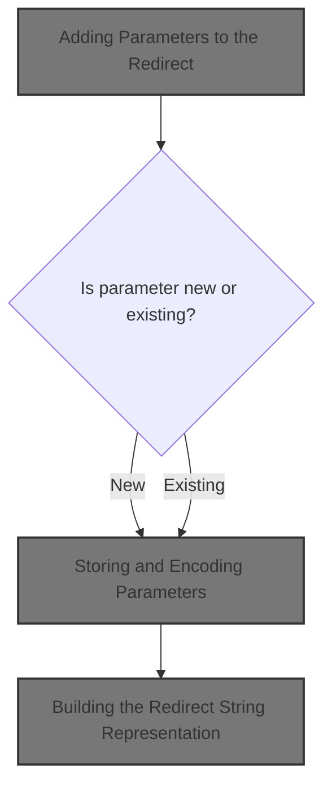
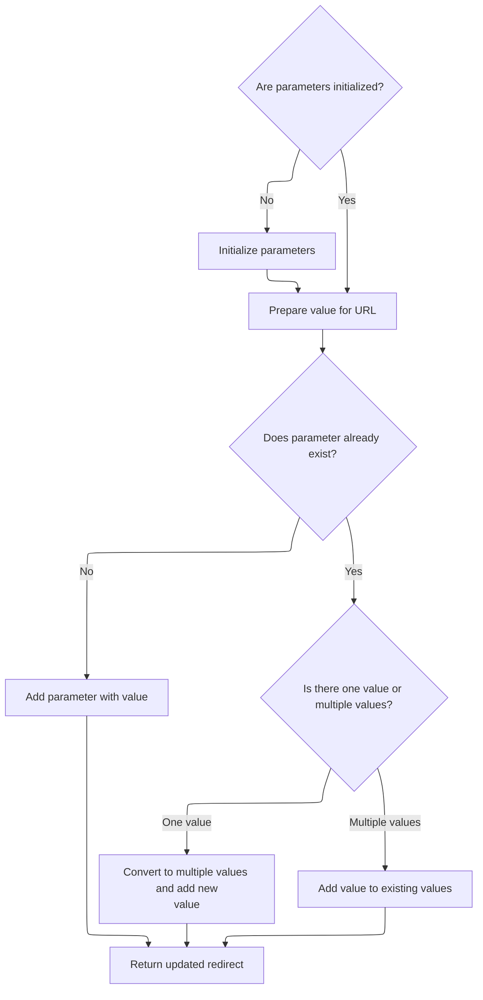

This document describes how parameters are dynamically added to a redirect, enabling the construction of redirect <SwmToken path="core/src/main/java/org/apache/struts/action/ActionRedirect.java" pos="276:22:22" line-data="     * @return a string which can be appended to the URLs.  The">`URLs`</SwmToken> that can include single or multiple values for each parameter. This allows the system to redirect users with the necessary context embedded in the URL.



# Adding Parameters to the Redirect

<SwmSnippet path="/core/src/main/java/org/apache/struts/action/ActionRedirect.java" line="158">

---

In <SwmToken path="core/src/main/java/org/apache/struts/action/ActionRedirect.java" pos="158:5:5" line-data="    public ActionRedirect addParameter(String fieldName, Object valueObj) {">`addParameter`</SwmToken>, we're converting the incoming value to a string so it can be stored as a parameter. Calling <SwmToken path="core/src/main/java/org/apache/struts/action/ActionRedirect.java" pos="159:19:19" line-data="        String value = (valueObj != null) ? valueObj.toString() : &quot;&quot;;">`toString`</SwmToken> next is what assembles the full redirect string, reflecting all parameters added up to this point.

```java
    public ActionRedirect addParameter(String fieldName, Object valueObj) {
        String value = (valueObj != null) ? valueObj.toString() : "";

```

---

</SwmSnippet>

## Building the Redirect String Representation

<SwmSnippet path="/core/src/main/java/org/apache/struts/action/ActionRedirect.java" line="340">

---

In <SwmToken path="core/src/main/java/org/apache/struts/action/ActionRedirect.java" pos="340:5:5" line-data="    public String toString() {">`toString`</SwmToken>, we're starting to build the string that represents the redirect, and we pull in the original path first since that's the base URL everything else attaches to. Next, we call <SwmToken path="core/src/main/java/org/apache/struts/action/ActionRedirect.java" pos="344:13:13" line-data="        result.append(&quot;originalPath=&quot;).append(getOriginalPath()).append(&quot;;&quot;);">`getOriginalPath`</SwmToken> to fetch that base.

```java
    public String toString() {
        StringBuffer result = new StringBuffer(DEFAULT_BUFFER_SIZE);

        result.append("ActionRedirect [");
        result.append("originalPath=").append(getOriginalPath()).append(";");
```

---

</SwmSnippet>

### Fetching the Base Redirect Path

<SwmSnippet path="/core/src/main/java/org/apache/struts/action/ActionRedirect.java" line="220">

---

<SwmToken path="core/src/main/java/org/apache/struts/action/ActionRedirect.java" pos="220:5:5" line-data="    public String getOriginalPath() {">`getOriginalPath`</SwmToken> just returns the path from the superclass, so it's basically a passthrough to whatever the base path logic is. Next, we call <SwmToken path="core/src/main/java/org/apache/struts/action/ActionRedirect.java" pos="221:5:5" line-data="        return super.getPath();">`getPath`</SwmToken> to actually retrieve that value.

```java
    public String getOriginalPath() {
        return super.getPath();
    }
```

---

</SwmSnippet>

### Retrieving the Redirect Path

See <SwmLink doc-title="Building a Redirect URL">[Building a Redirect URL](/.swm/building-a-redirect-url.5sg2g20n.sw.md)</SwmLink>

### Appending Parameters to the Redirect String

<SwmSnippet path="/core/src/main/java/org/apache/struts/action/ActionRedirect.java" line="345">

---

Back in <SwmToken path="core/src/main/java/org/apache/struts/action/ActionRedirect.java" pos="159:19:19" line-data="        String value = (valueObj != null) ? valueObj.toString() : &quot;&quot;;">`toString`</SwmToken>, after getting the original path, we append the parameter string by calling <SwmToken path="core/src/main/java/org/apache/struts/action/ActionRedirect.java" pos="345:13:13" line-data="        result.append(&quot;parameterString=&quot;).append(getParameterString()).append(&quot;]&quot;);">`getParameterString`</SwmToken>. This adds all the query parameters to the redirect output.

```java
        result.append("parameterString=").append(getParameterString()).append("]");
```

---

</SwmSnippet>

<SwmSnippet path="/core/src/main/java/org/apache/struts/action/ActionRedirect.java" line="346">

---

Back in <SwmToken path="core/src/main/java/org/apache/struts/action/ActionRedirect.java" pos="348:5:5" line-data="        return result.toString();">`toString`</SwmToken>, after adding the parameters, we append the anchor string (if any) and then return the full redirect string. This finalizes the output used for the redirect.

```java
        result.append("anchorString=").append(getAnchorString()).append("]");

        return result.toString();
    }
```

---

</SwmSnippet>

## Storing and Encoding Parameters



<SwmSnippet path="/core/src/main/java/org/apache/struts/action/ActionRedirect.java" line="161">

---

Back in <SwmToken path="core/src/main/java/org/apache/struts/action/ActionRedirect.java" pos="158:5:5" line-data="    public ActionRedirect addParameter(String fieldName, Object valueObj) {">`addParameter`</SwmToken>, after building the redirect string, we encode the value for safe URL usage and handle storing it in the parameter map, supporting single or multiple values as needed.

```java
        if (parameterValues == null) {
            initializeParameters();
        }

        //try {
        value = ResponseUtils.encodeURL(value);

        //} catch (UnsupportedEncodingException uce) {
        // this shouldn't happen since UTF-8 is the W3C Recommendation
        //     String errorMsg = "UTF-8 Character Encoding not supported";
        //     LOG.error(errorMsg, uce);
        //     throw new RuntimeException(errorMsg, uce);
        // }
        Object currentValue = parameterValues.get(fieldName);

        if (currentValue == null) {
            // there's no value for this param yet; add it to the map
            parameterValues.put(fieldName, value);
        } else if (currentValue instanceof String) {
            // there's already a value; let's use an array for these parameters
            String[] newValue = new String[2];

            newValue[0] = (String) currentValue;
            newValue[1] = value;
            parameterValues.put(fieldName, newValue);
        } else if (currentValue instanceof String[]) {
            // add the value to the list of existing values
            List newValues =
                new ArrayList(Arrays.asList((Object[]) currentValue));

            newValues.add(value);
            parameterValues.put(fieldName,
                newValues.toArray(new String[newValues.size()]));
        }
        return this;
    }
```

---

</SwmSnippet>

&nbsp;

*This is an auto-generated document by Swimm 🌊 and has not yet been verified by a human*

<SwmMeta version="3.0.0" repo-id="Z2l0aHViJTNBJTNBc3RydXRzMSUzQSUzQVN3aW1tLURlbW8=" repo-name="struts1"><sup>Powered by [Swimm](https://app.swimm.io/)</sup></SwmMeta>
