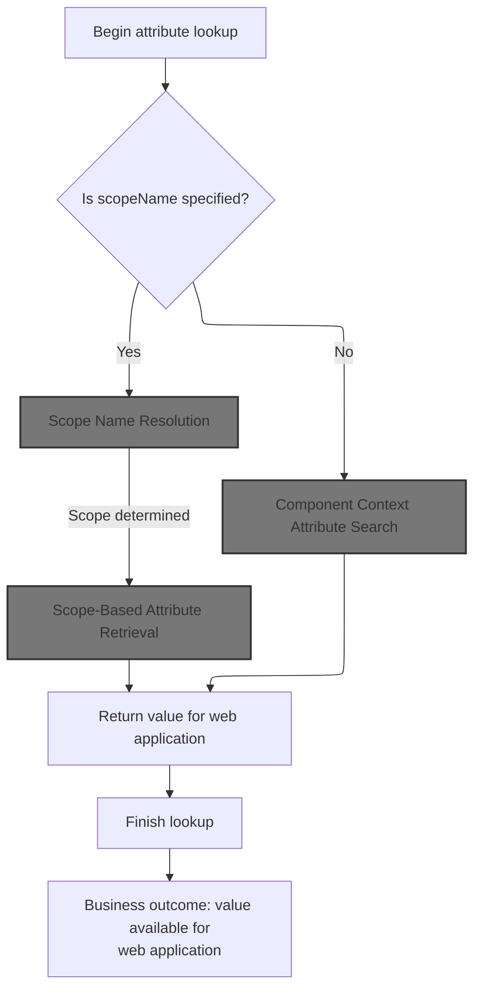
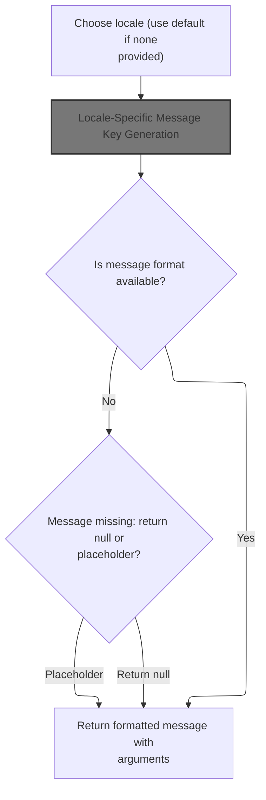
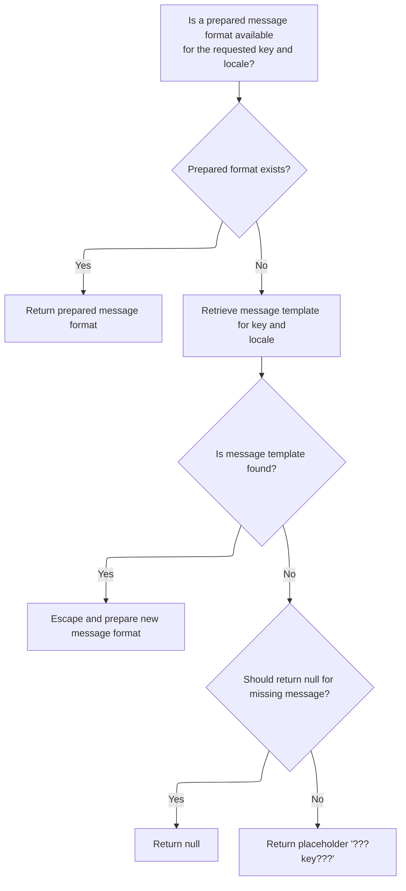
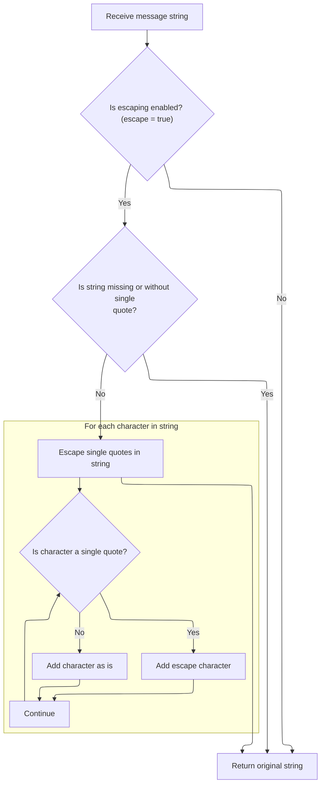

This document describes how the system retrieves an attribute value by name, either from a specific scope or by searching all available scopes. This enables dynamic data access and rendering in the web application. The input is a request for an attribute by name (and optionally a scope), and the output is the attribute value if found.

# Attribute Lookup Entry Point



<SwmSnippet path="/taglib/src/main/java/org/apache/struts/taglib/TagUtils.java" line="863">

---

In <SwmToken path="taglib/src/main/java/org/apache/struts/taglib/TagUtils.java" pos="863:5:5" line-data="    public Object lookup(PageContext pageContext, String name, String scopeName)">`lookup`</SwmToken>, if <SwmToken path="taglib/src/main/java/org/apache/struts/taglib/TagUtils.java" pos="863:19:19" line-data="    public Object lookup(PageContext pageContext, String name, String scopeName)">`scopeName`</SwmToken> is null, we use <SwmToken path="taglib/src/main/java/org/apache/struts/taglib/TagUtils.java" pos="866:3:5" line-data="            return pageContext.findAttribute(name);">`pageContext.findAttribute`</SwmToken>(name) to search for the attribute across all JSP scopes. If <SwmToken path="taglib/src/main/java/org/apache/struts/taglib/TagUtils.java" pos="863:19:19" line-data="    public Object lookup(PageContext pageContext, String name, String scopeName)">`scopeName`</SwmToken> isn't null, we need to check for special component context handling, so we call into <SwmToken path="tiles/src/main/java/org/apache/struts/tiles/ComponentContext.java" pos="39:4:4" line-data="public class ComponentContext implements Serializable {">`ComponentContext`</SwmToken> next to see if the attribute is managed there.

```java
    public Object lookup(PageContext pageContext, String name, String scopeName)
        throws JspException {
        if (scopeName == null) {
            return pageContext.findAttribute(name);
        }

```

---

</SwmSnippet>

## Component Context Attribute Search

<SwmSnippet path="/tiles/src/main/java/org/apache/struts/tiles/ComponentContext.java" line="152">

---

In <SwmToken path="tiles/src/main/java/org/apache/struts/tiles/ComponentContext.java" pos="152:5:5" line-data="    public Object findAttribute(String beanName, PageContext pageContext) {">`findAttribute`</SwmToken>, we first try to get the attribute from the local component context. If it's not found, we fall back to searching the page context, so we don't miss attributes defined outside the component.

```java
    public Object findAttribute(String beanName, PageContext pageContext) {
        Object attribute = getAttribute(beanName);
```

---

</SwmSnippet>

<SwmSnippet path="/tiles/src/main/java/org/apache/struts/tiles/ComponentContext.java" line="112">

---

<SwmToken path="tiles/src/main/java/org/apache/struts/tiles/ComponentContext.java" pos="112:5:5" line-data="    public Object getAttribute(String name) {">`getAttribute`</SwmToken> checks if the attributes map exists before trying to fetch the value. If the map is missing, it returns null; otherwise, it just pulls the value for the given key.

```java
    public Object getAttribute(String name) {
        if (attributes == null){
            return null;
        }

        return attributes.get(name);
    }
```

---

</SwmSnippet>

<SwmSnippet path="/tiles/src/main/java/org/apache/struts/tiles/ComponentContext.java" line="154">

---

Back in <SwmToken path="tiles/src/main/java/org/apache/struts/tiles/ComponentContext.java" pos="155:7:7" line-data="            attribute = pageContext.findAttribute(beanName);">`findAttribute`</SwmToken>, after checking the local context, if the attribute wasn't found, we try <SwmToken path="tiles/src/main/java/org/apache/struts/tiles/ComponentContext.java" pos="155:5:7" line-data="            attribute = pageContext.findAttribute(beanName);">`pageContext.findAttribute`</SwmToken>(<SwmToken path="tiles/src/main/java/org/apache/struts/tiles/ComponentContext.java" pos="155:9:9" line-data="            attribute = pageContext.findAttribute(beanName);">`beanName`</SwmToken>) as a fallback. This lets us grab attributes from the wider JSP scopes if they're not in the component.

```java
        if (attribute == null) {
            attribute = pageContext.findAttribute(beanName);
        }

        return attribute;
    }
```

---

</SwmSnippet>

## Scope-Based Attribute Retrieval

<SwmSnippet path="/taglib/src/main/java/org/apache/struts/taglib/TagUtils.java" line="869">

---

Back in <SwmToken path="taglib/src/main/java/org/apache/struts/taglib/TagUtils.java" pos="814:12:12" line-data="            throw new JspException(messages.getMessage(&quot;lookup.scope&quot;, scope));">`lookup`</SwmToken>, after checking the component context, we need to convert the scope name to the integer constant used by <SwmToken path="taglib/src/main/java/org/apache/struts/taglib/TagUtils.java" pos="863:7:7" line-data="    public Object lookup(PageContext pageContext, String name, String scopeName)">`PageContext`</SwmToken>. That's why we call <SwmToken path="taglib/src/main/java/org/apache/struts/taglib/TagUtils.java" pos="870:12:12" line-data="            return pageContext.getAttribute(name, instance.getScope(scopeName));">`getScope`</SwmToken> next—to map the string scope to the right constant for attribute retrieval.

```java
        try {
            return pageContext.getAttribute(name, instance.getScope(scopeName));
```

---

</SwmSnippet>

## Scope Name Resolution

<SwmSnippet path="/taglib/src/main/java/org/apache/struts/taglib/TagUtils.java" line="809">

---

<SwmToken path="taglib/src/main/java/org/apache/struts/taglib/TagUtils.java" pos="809:5:5" line-data="    public int getScope(String scopeName)">`getScope`</SwmToken> converts the scope name to lowercase and looks it up in the scopes map. If it's not found, it throws a <SwmToken path="taglib/src/main/java/org/apache/struts/taglib/TagUtils.java" pos="810:3:3" line-data="        throws JspException {">`JspException`</SwmToken> with a localized error message, which is why we call <SwmToken path="taglib/src/main/java/org/apache/struts/taglib/TagUtils.java" pos="34:10:10" line-data="import org.apache.struts.util.MessageResources;">`MessageResources`</SwmToken> next—to get the error message.

```java
    public int getScope(String scopeName)
        throws JspException {
        Integer scope = (Integer) scopes.get(scopeName.toLowerCase());

        if (scope == null) {
            throw new JspException(messages.getMessage("lookup.scope", scope));
        }

        return scope.intValue();
    }
```

---

</SwmSnippet>

## Localized Error Message Retrieval

<SwmSnippet path="/core/src/main/java/org/apache/struts/util/MessageResources.java" line="218">

---

<SwmToken path="core/src/main/java/org/apache/struts/util/MessageResources.java" pos="218:5:5" line-data="    public String getMessage(String key, Object arg0) {">`getMessage`</SwmToken> just delegates to the version with a Locale argument set to null, so we always use the default locale unless specified otherwise. Next, we call the overloaded method to wrap the argument and handle formatting.

```java
    public String getMessage(String key, Object arg0) {
        return this.getMessage((Locale) null, key, arg0);
    }
```

---

</SwmSnippet>

## Single Argument Message Formatting

<SwmSnippet path="/core/src/main/java/org/apache/struts/util/MessageResources.java" line="324">

---

<SwmToken path="core/src/main/java/org/apache/struts/util/MessageResources.java" pos="324:5:5" line-data="    public String getMessage(Locale locale, String key, Object arg0) {">`getMessage`</SwmToken> here wraps the single argument into an Object array and passes it to the main message formatting method. This keeps the API clean and avoids duplicating logic.

```java
    public String getMessage(Locale locale, String key, Object arg0) {
        return this.getMessage(locale, key, new Object[] { arg0 });
    }
```

---

</SwmSnippet>

## Message Formatting and Caching



<SwmSnippet path="/core/src/main/java/org/apache/struts/util/MessageResources.java" line="286">

---

In <SwmToken path="core/src/main/java/org/apache/struts/util/MessageResources.java" pos="286:5:5" line-data="    public String getMessage(Locale locale, String key, Object[] args) {">`getMessage`</SwmToken>, we handle locale defaults, generate a cache key, and check for a cached <SwmToken path="core/src/main/java/org/apache/struts/util/MessageResources.java" pos="287:5:5" line-data="        // Cache MessageFormat instances as they are accessed">`MessageFormat`</SwmToken>. If it's missing, we need to build the cache key using <SwmToken path="core/src/main/java/org/apache/struts/util/MessageResources.java" pos="293:7:7" line-data="        String formatKey = messageKey(locale, key);">`messageKey`</SwmToken>, so that's why we call <SwmToken path="core/src/main/java/org/apache/struts/util/MessageResources.java" pos="293:7:7" line-data="        String formatKey = messageKey(locale, key);">`messageKey`</SwmToken> next.

```java
    public String getMessage(Locale locale, String key, Object[] args) {
        // Cache MessageFormat instances as they are accessed
        if (locale == null) {
            locale = defaultLocale;
        }

        MessageFormat format = null;
        String formatKey = messageKey(locale, key);

```

---

</SwmSnippet>

### Locale-Specific Message Key Generation

<SwmSnippet path="/core/src/main/java/org/apache/struts/util/MessageResources.java" line="460">

---

<SwmToken path="core/src/main/java/org/apache/struts/util/MessageResources.java" pos="460:5:5" line-data="    protected String messageKey(Locale locale, String key) {">`messageKey`</SwmToken> builds a composite key by joining the locale string and the message key with a dot. To get the locale part, we call <SwmToken path="core/src/main/java/org/apache/struts/util/MessageResources.java" pos="461:4:4" line-data="        return (localeKey(locale) + &quot;.&quot; + key);">`localeKey`</SwmToken> next.

```java
    protected String messageKey(Locale locale, String key) {
        return (localeKey(locale) + "." + key);
    }
```

---

</SwmSnippet>

<SwmSnippet path="/core/src/main/java/org/apache/struts/util/MessageResources.java" line="449">

---

<SwmToken path="core/src/main/java/org/apache/struts/util/MessageResources.java" pos="449:5:5" line-data="    protected String localeKey(Locale locale) {">`localeKey`</SwmToken> returns an empty string if the locale is null, otherwise it just uses <SwmToken path="core/src/main/java/org/apache/struts/util/MessageResources.java" pos="450:18:22" line-data="        return (locale == null) ? &quot;&quot; : locale.toString();">`locale.toString()`</SwmToken>. This keeps the message key format consistent even when locale isn't specified.

```java
    protected String localeKey(Locale locale) {
        return (locale == null) ? "" : locale.toString();
    }
```

---

</SwmSnippet>

### Message Format Retrieval and Fallback



<SwmSnippet path="/core/src/main/java/org/apache/struts/util/MessageResources.java" line="295">

---

Back in <SwmToken path="core/src/main/java/org/apache/struts/util/MessageResources.java" pos="299:7:7" line-data="                String formatString = getMessage(locale, key);">`getMessage`</SwmToken>, after building the cache key, we check the cache for a <SwmToken path="core/src/main/java/org/apache/struts/util/MessageResources.java" pos="296:6:6" line-data="            format = (MessageFormat) formats.get(formatKey);">`MessageFormat`</SwmToken>. If it's missing, we fetch the format string and handle fallback if it's not found. If found, we escape the string, so we call escape next.

```java
        synchronized (formats) {
            format = (MessageFormat) formats.get(formatKey);

            if (format == null) {
                String formatString = getMessage(locale, key);

                if (formatString == null) {
                    return returnNull ? null : ("???" + formatKey + "???");
                }

                format = new MessageFormat(escape(formatString));
```

---

</SwmSnippet>

### Conditional Message String Escaping



<SwmSnippet path="/core/src/main/java/org/apache/struts/util/MessageResources.java" line="417">

---

In <SwmToken path="core/src/main/java/org/apache/struts/util/MessageResources.java" pos="417:5:5" line-data="    protected String escape(String string) {">`escape`</SwmToken>, we check if escaping is enabled and if the string needs escaping (has single quotes). If not, we just return the original string. To check the escape flag, we call <SwmToken path="core/src/main/java/org/apache/struts/util/MessageResources.java" pos="418:5:5" line-data="        if (!isEscape()) {">`isEscape`</SwmToken> next.

```java
    protected String escape(String string) {
        if (!isEscape()) {
            return string;
        }

        if ((string == null) || (string.indexOf('\'') < 0)) {
            return string;
        }

```

---

</SwmSnippet>

<SwmSnippet path="/core/src/main/java/org/apache/struts/util/MessageResources.java" line="175">

---

<SwmToken path="core/src/main/java/org/apache/struts/util/MessageResources.java" pos="175:5:5" line-data="    public boolean isEscape() {">`isEscape`</SwmToken> just returns the escape flag. It's a plain getter, nothing fancy.

```java
    public boolean isEscape() {
        return escape;
    }
```

---

</SwmSnippet>

<SwmSnippet path="/core/src/main/java/org/apache/struts/util/MessageResources.java" line="426">

---

Back in <SwmToken path="core/src/main/java/org/apache/struts/util/MessageResources.java" pos="176:3:3" line-data="        return escape;">`escape`</SwmToken>, we loop through the string and double up any single quotes. This prevents issues with message formatting that uses single quotes.

```java
        int n = string.length();
        StringBuffer sb = new StringBuffer(n);

        for (int i = 0; i < n; i++) {
            char ch = string.charAt(i);

            if (ch == '\'') {
                sb.append('\'');
            }

            sb.append(ch);
        }
```

---

</SwmSnippet>

### Final Message Formatting and Return

<SwmSnippet path="/core/src/main/java/org/apache/struts/util/MessageResources.java" line="306">

---

Back in <SwmToken path="taglib/src/main/java/org/apache/struts/taglib/TagUtils.java" pos="814:9:9" line-data="            throw new JspException(messages.getMessage(&quot;lookup.scope&quot;, scope));">`getMessage`</SwmToken>, after escaping and caching the <SwmToken path="core/src/main/java/org/apache/struts/util/MessageResources.java" pos="287:5:5" line-data="        // Cache MessageFormat instances as they are accessed">`MessageFormat`</SwmToken>, we format the message and return it. Next, we call <SwmToken path="taglib/src/main/java/org/apache/struts/taglib/html/ErrorsTag.java" pos="62:4:4" line-data="public class ErrorsTag extends TagSupport {">`ErrorsTag`</SwmToken> to set the locale for error messages.

```java
                format.setLocale(locale);
                formats.put(formatKey, format);
            }
        }

        return format.format(args);
    }
```

---

</SwmSnippet>

<SwmSnippet path="/taglib/src/main/java/org/apache/struts/taglib/html/ErrorsTag.java" line="125">

---

<SwmToken path="taglib/src/main/java/org/apache/struts/taglib/html/ErrorsTag.java" pos="125:5:5" line-data="    public void setLocale(String locale) {">`setLocale`</SwmToken> just assigns the locale string to the instance variable. It's a plain setter, nothing else going on.

```java
    public void setLocale(String locale) {
        this.locale = locale;
    }
```

---

</SwmSnippet>

## Attribute Retrieval by Scope

<SwmSnippet path="/taglib/src/main/java/org/apache/struts/taglib/TagUtils.java" line="870">

---

Back in <SwmToken path="taglib/src/main/java/org/apache/struts/taglib/TagUtils.java" pos="814:12:12" line-data="            throw new JspException(messages.getMessage(&quot;lookup.scope&quot;, scope));">`lookup`</SwmToken>, after converting the scope name, we use <SwmToken path="taglib/src/main/java/org/apache/struts/taglib/TagUtils.java" pos="870:3:5" line-data="            return pageContext.getAttribute(name, instance.getScope(scopeName));">`pageContext.getAttribute`</SwmToken>(name, scope) to fetch the attribute. If the scope is a special component scope, we need to check <SwmToken path="tiles/src/main/java/org/apache/struts/tiles/ComponentContext.java" pos="39:4:4" line-data="public class ComponentContext implements Serializable {">`ComponentContext`</SwmToken> next.

```java
            return pageContext.getAttribute(name, instance.getScope(scopeName));
```

---

</SwmSnippet>

<SwmSnippet path="/tiles/src/main/java/org/apache/struts/tiles/ComponentContext.java" line="169">

---

<SwmToken path="tiles/src/main/java/org/apache/struts/tiles/ComponentContext.java" pos="169:5:5" line-data="    public Object getAttribute(">`getAttribute`</SwmToken> checks if the scope is the special <SwmToken path="tiles/src/main/java/org/apache/struts/tiles/ComponentContext.java" pos="174:10:10" line-data="        if (scope == ComponentConstants.COMPONENT_SCOPE){">`COMPONENT_SCOPE`</SwmToken>. If so, it grabs the attribute from the component context; otherwise, it uses the standard <SwmToken path="tiles/src/main/java/org/apache/struts/tiles/ComponentContext.java" pos="178:3:5" line-data="        return pageContext.getAttribute(beanName, scope);">`pageContext.getAttribute`</SwmToken> method.

```java
    public Object getAttribute(
        String beanName,
        int scope,
        PageContext pageContext) {

        if (scope == ComponentConstants.COMPONENT_SCOPE){
            return getAttribute(beanName);
        }

        return pageContext.getAttribute(beanName, scope);
    }
```

---

</SwmSnippet>

<SwmSnippet path="/taglib/src/main/java/org/apache/struts/taglib/TagUtils.java" line="871">

---

Back in <SwmToken path="taglib/src/main/java/org/apache/struts/taglib/TagUtils.java" pos="814:12:12" line-data="            throw new JspException(messages.getMessage(&quot;lookup.scope&quot;, scope));">`lookup`</SwmToken>, if an exception is thrown during attribute retrieval, we call <SwmToken path="taglib/src/main/java/org/apache/struts/taglib/TagUtils.java" pos="872:1:1" line-data="            saveException(pageContext, e);">`saveException`</SwmToken> to record the error in the page context and rethrow it. This keeps error handling consistent for JSP tag operations.

```java
        } catch (JspException e) {
            saveException(pageContext, e);
            throw e;
        }
    }
```

---

</SwmSnippet>

&nbsp;

*This is an auto-generated document by Swimm 🌊 and has not yet been verified by a human*

<SwmMeta version="3.0.0" repo-id="Z2l0aHViJTNBJTNBc3RydXRzMSUzQSUzQVN3aW1tLURlbW8=" repo-name="struts1"><sup>Powered by [Swimm](https://app.swimm.io/)</sup></SwmMeta>
