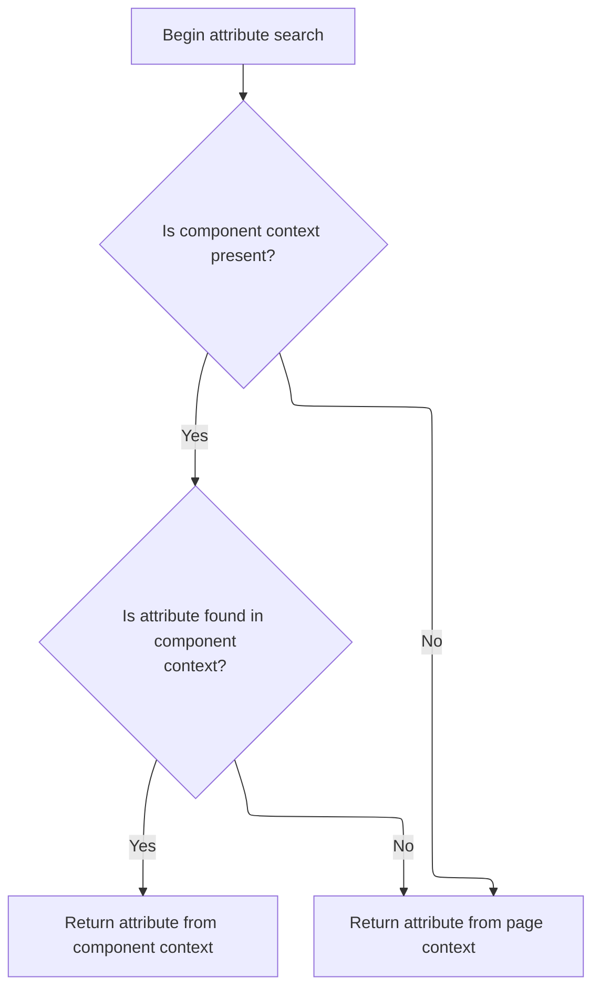

This document explains how an attribute value is retrieved by searching first in a component context and then in the standard page context. Given an attribute name and the current page context, the flow ensures that data can be accessed from both component-level and page-level scopes, enabling flexible content rendering.

# Attribute Lookup Entry Point

<SwmSnippet path="/tiles/src/main/java/org/apache/struts/tiles/taglib/util/TagUtils.java" line="148">

---

In <SwmToken path="tiles/src/main/java/org/apache/struts/tiles/taglib/util/TagUtils.java" pos="148:7:7" line-data="    public static Object findAttribute(String beanName, PageContext pageContext) {">`findAttribute`</SwmToken>, we start by grabbing the <SwmToken path="tiles/src/main/java/org/apache/struts/tiles/taglib/util/TagUtils.java" pos="149:1:1" line-data="        ComponentContext compContext = ComponentContext.getContext(pageContext.getRequest());">`ComponentContext`</SwmToken> from the request tied to the <SwmToken path="tiles/src/main/java/org/apache/struts/tiles/taglib/util/TagUtils.java" pos="148:14:14" line-data="    public static Object findAttribute(String beanName, PageContext pageContext) {">`PageContext`</SwmToken>. This sets up a layered search: first, we look in the component-specific context, and if that fails, we fall back to the standard JSP scopes. To get the right request object, we need to call into <SwmToken path="core/src/main/java/org/apache/struts/chain/contexts/ServletActionContext.java" pos="39:4:4" line-data="public class ServletActionContext extends WebActionContext {">`ServletActionContext`</SwmToken>, which handles the context extraction logic.

```java
    public static Object findAttribute(String beanName, PageContext pageContext) {
        ComponentContext compContext = ComponentContext.getContext(pageContext.getRequest());
```

---

</SwmSnippet>

## Extracting the HTTP Request

<SwmSnippet path="/core/src/main/java/org/apache/struts/chain/contexts/ServletActionContext.java" line="94">

---

<SwmToken path="core/src/main/java/org/apache/struts/chain/contexts/ServletActionContext.java" pos="94:5:5" line-data="    public HttpServletRequest getRequest() {">`getRequest`</SwmToken> just delegates to <SwmToken path="core/src/main/java/org/apache/struts/chain/contexts/ServletActionContext.java" pos="95:3:5" line-data="        return servletWebContext().getRequest();">`servletWebContext()`</SwmToken><SwmToken path="core/src/main/java/org/apache/struts/chain/contexts/ServletActionContext.java" pos="95:6:9" line-data="        return servletWebContext().getRequest();">`.getRequest()`</SwmToken>, abstracting how the HTTP request is fetched. This keeps the rest of the code from caring about the underlying context details.

```java
    public HttpServletRequest getRequest() {
        return servletWebContext().getRequest();
    }
```

---

</SwmSnippet>

<SwmSnippet path="/core/src/main/java/org/apache/struts/chain/contexts/ServletActionContext.java" line="67">

---

<SwmToken path="core/src/main/java/org/apache/struts/chain/contexts/ServletActionContext.java" pos="67:5:5" line-data="    protected ServletWebContext servletWebContext() {">`servletWebContext`</SwmToken> just casts the base context to <SwmToken path="core/src/main/java/org/apache/struts/chain/contexts/ServletActionContext.java" pos="67:3:3" line-data="    protected ServletWebContext servletWebContext() {">`ServletWebContext`</SwmToken>, assuming the context is always set up as expected. No checks, just a straight cast.

```java
    protected ServletWebContext servletWebContext() {
        return (ServletWebContext) this.getBaseContext();
    }
```

---

</SwmSnippet>

## Component Context Resolution



<SwmSnippet path="/tiles/src/main/java/org/apache/struts/tiles/taglib/util/TagUtils.java" line="149">

---

Back in TagUtils.findAttribute, after getting the request, we call <SwmToken path="tiles/src/main/java/org/apache/struts/tiles/taglib/util/TagUtils.java" pos="149:7:9" line-data="        ComponentContext compContext = ComponentContext.getContext(pageContext.getRequest());">`ComponentContext.getContext`</SwmToken> to check for a component-level context. This is the first layer in the attribute search, before falling back to the broader JSP scopes.

```java
        ComponentContext compContext = ComponentContext.getContext(pageContext.getRequest());

```

---

</SwmSnippet>

<SwmSnippet path="/tiles/src/main/java/org/apache/struts/tiles/ComponentContext.java" line="187">

---

<SwmToken path="tiles/src/main/java/org/apache/struts/tiles/ComponentContext.java" pos="187:7:7" line-data="    static public ComponentContext getContext(ServletRequest request) {">`getContext`</SwmToken> first checks for a JSP exception attribute and bails out if one is present. Otherwise, it pulls the <SwmToken path="tiles/src/main/java/org/apache/struts/tiles/ComponentContext.java" pos="187:5:5" line-data="    static public ComponentContext getContext(ServletRequest request) {">`ComponentContext`</SwmToken> from the request, assuming it's there and of the right type.

```java
    static public ComponentContext getContext(ServletRequest request) {
       if (request.getAttribute("javax.servlet.jsp.jspException") != null) {
           return null;
        }        return (ComponentContext) request.getAttribute(
            ComponentConstants.COMPONENT_CONTEXT);
    }
```

---

</SwmSnippet>

<SwmSnippet path="/tiles/src/main/java/org/apache/struts/tiles/taglib/util/TagUtils.java" line="151">

---

Back in TagUtils.findAttribute, after checking <SwmToken path="tiles/src/main/java/org/apache/struts/tiles/taglib/util/TagUtils.java" pos="149:1:1" line-data="        ComponentContext compContext = ComponentContext.getContext(pageContext.getRequest());">`ComponentContext`</SwmToken>, if the attribute isn't found there, we fall back to searching all the standard JSP scopes via <SwmToken path="tiles/src/main/java/org/apache/struts/tiles/taglib/util/TagUtils.java" pos="159:3:5" line-data="        return pageContext.findAttribute(beanName);">`pageContext.findAttribute`</SwmToken>. This layered search ensures attributes are found whether they're set at the component or page level.

```java
        if (compContext != null) {
            Object attribute = compContext.findAttribute(beanName, pageContext);
            if (attribute != null) {
                return attribute;
            }
        }

        // Search in pageContext scopes
        return pageContext.findAttribute(beanName);
    }
```

---

</SwmSnippet>

&nbsp;

*This is an auto-generated document by Swimm 🌊 and has not yet been verified by a human*

<SwmMeta version="3.0.0" repo-id="Z2l0aHViJTNBJTNBc3RydXRzMSUzQSUzQVN3aW1tLURlbW8=" repo-name="struts1"><sup>Powered by [Swimm](https://app.swimm.io/)</sup></SwmMeta>
