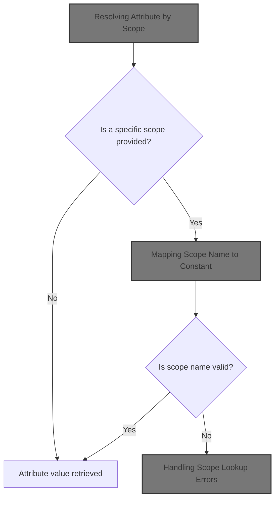
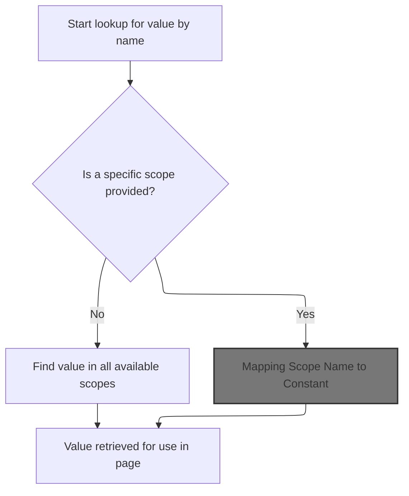
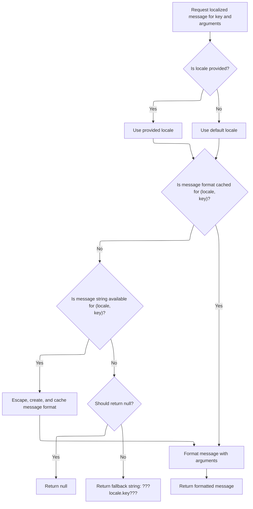
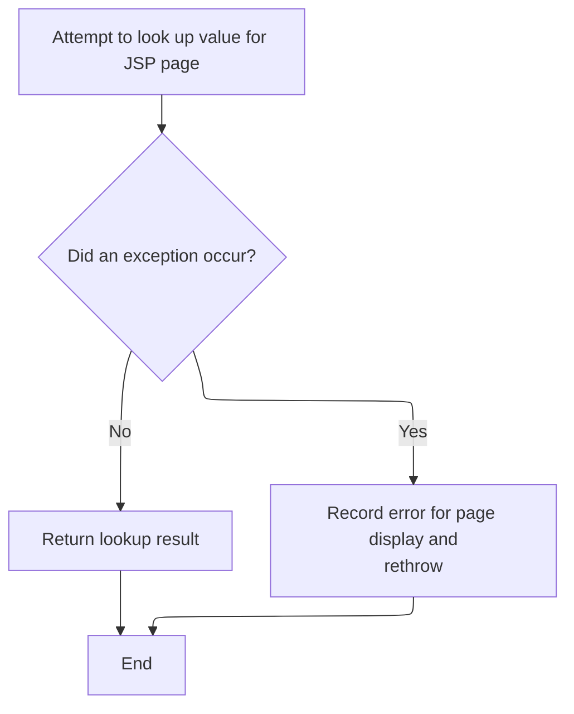

This document explains how attribute values are retrieved for use in JSP pages. Attributes can be accessed from a specific scope or by searching all available scopes, supporting flexible page rendering. The input is a name and an optional scope, and the output is the attribute value or an error if the scope is invalid.



# Resolving Attribute by Scope



<SwmSnippet path="/taglib/src/main/java/org/apache/struts/taglib/TagUtils.java" line="863">

---

In <SwmToken path="taglib/src/main/java/org/apache/struts/taglib/TagUtils.java" pos="863:5:5" line-data="    public Object lookup(PageContext pageContext, String name, String scopeName)">`lookup`</SwmToken>, we check if <SwmToken path="taglib/src/main/java/org/apache/struts/taglib/TagUtils.java" pos="863:19:19" line-data="    public Object lookup(PageContext pageContext, String name, String scopeName)">`scopeName`</SwmToken> is null to decide whether to search all scopes or a specific one. If <SwmToken path="taglib/src/main/java/org/apache/struts/taglib/TagUtils.java" pos="863:19:19" line-data="    public Object lookup(PageContext pageContext, String name, String scopeName)">`scopeName`</SwmToken> is provided, we call <SwmToken path="taglib/src/main/java/org/apache/struts/taglib/TagUtils.java" pos="870:10:12" line-data="            return pageContext.getAttribute(name, instance.getScope(scopeName));">`instance.getScope`</SwmToken> to translate it to the integer constant required by the JSP API. This lets us fetch the attribute from the exact scope requested. The function assumes <SwmToken path="taglib/src/main/java/org/apache/struts/taglib/TagUtils.java" pos="863:19:19" line-data="    public Object lookup(PageContext pageContext, String name, String scopeName)">`scopeName`</SwmToken> is valid—if not, <SwmToken path="taglib/src/main/java/org/apache/struts/taglib/TagUtils.java" pos="870:12:12" line-data="            return pageContext.getAttribute(name, instance.getScope(scopeName));">`getScope`</SwmToken> will throw.

```java
    public Object lookup(PageContext pageContext, String name, String scopeName)
        throws JspException {
        if (scopeName == null) {
            return pageContext.findAttribute(name);
        }

        try {
            return pageContext.getAttribute(name, instance.getScope(scopeName));
```

---

</SwmSnippet>

## Mapping Scope Name to Constant

<SwmSnippet path="/taglib/src/main/java/org/apache/struts/taglib/TagUtils.java" line="809">

---

<SwmToken path="taglib/src/main/java/org/apache/struts/taglib/TagUtils.java" pos="809:5:5" line-data="    public int getScope(String scopeName)">`getScope`</SwmToken> looks up the integer constant for a given scope name in a map. If the name isn't found, it throws a <SwmToken path="taglib/src/main/java/org/apache/struts/taglib/TagUtils.java" pos="810:3:3" line-data="        throws JspException {">`JspException`</SwmToken>, using <SwmToken path="taglib/src/main/java/org/apache/struts/taglib/TagUtils.java" pos="814:7:9" line-data="            throw new JspException(messages.getMessage(&quot;lookup.scope&quot;, scope));">`messages.getMessage`</SwmToken> to build the error message. This is where we jump to <SwmToken path="taglib/src/main/java/org/apache/struts/taglib/TagUtils.java" pos="34:10:10" line-data="import org.apache.struts.util.MessageResources;">`MessageResources`</SwmToken> to get the error text.

```java
    public int getScope(String scopeName)
        throws JspException {
        Integer scope = (Integer) scopes.get(scopeName.toLowerCase());

        if (scope == null) {
            throw new JspException(messages.getMessage("lookup.scope", scope));
        }

        return scope.intValue();
    }
```

---

</SwmSnippet>

## Building Error Message (Single Arg)

<SwmSnippet path="/core/src/main/java/org/apache/struts/util/MessageResources.java" line="218">

---

<SwmToken path="core/src/main/java/org/apache/struts/util/MessageResources.java" pos="218:5:5" line-data="    public String getMessage(String key, Object arg0) {">`getMessage`</SwmToken> with a key and one argument just calls the main <SwmToken path="core/src/main/java/org/apache/struts/util/MessageResources.java" pos="218:5:5" line-data="    public String getMessage(String key, Object arg0) {">`getMessage`</SwmToken> method with a null Locale and wraps the argument in an array. This keeps all the formatting logic in one place.

```java
    public String getMessage(String key, Object arg0) {
        return this.getMessage((Locale) null, key, arg0);
    }
```

---

</SwmSnippet>

## Formatting and Caching Messages



<SwmSnippet path="/core/src/main/java/org/apache/struts/util/MessageResources.java" line="324">

---

<SwmToken path="core/src/main/java/org/apache/struts/util/MessageResources.java" pos="324:5:5" line-data="    public String getMessage(Locale locale, String key, Object arg0) {">`getMessage`</SwmToken> (with Locale, key, and args) handles message formatting and caching. It checks the cache for a <SwmToken path="core/src/main/java/org/apache/struts/util/MessageResources.java" pos="287:5:5" line-data="        // Cache MessageFormat instances as they are accessed">`MessageFormat`</SwmToken>, creates and stores one if missing, and formats the message. If the message isn't found, it returns a placeholder or null. The cache is synchronized for thread safety.

```java
    public String getMessage(Locale locale, String key, Object arg0) {
        return this.getMessage(locale, key, new Object[] { arg0 });
    }
```

---

</SwmSnippet>

<SwmSnippet path="/core/src/main/java/org/apache/struts/util/MessageResources.java" line="286">

---

<SwmToken path="core/src/main/java/org/apache/struts/util/MessageResources.java" pos="286:5:5" line-data="    public String getMessage(Locale locale, String key, Object[] args) {">`getMessage`</SwmToken> (Locale, key, Object\[\]) is where the actual formatting and caching happens. It synchronizes on the cache, checks for an existing <SwmToken path="core/src/main/java/org/apache/struts/util/MessageResources.java" pos="287:5:5" line-data="        // Cache MessageFormat instances as they are accessed">`MessageFormat`</SwmToken>, creates and stores one if missing, and formats the message. If the message string is missing, it returns a placeholder or null. The escape method is used before creating <SwmToken path="core/src/main/java/org/apache/struts/util/MessageResources.java" pos="287:5:5" line-data="        // Cache MessageFormat instances as they are accessed">`MessageFormat`</SwmToken> to handle special cases.

```java
    public String getMessage(Locale locale, String key, Object[] args) {
        // Cache MessageFormat instances as they are accessed
        if (locale == null) {
            locale = defaultLocale;
        }

        MessageFormat format = null;
        String formatKey = messageKey(locale, key);

        synchronized (formats) {
            format = (MessageFormat) formats.get(formatKey);

            if (format == null) {
                String formatString = getMessage(locale, key);

                if (formatString == null) {
                    return returnNull ? null : ("???" + formatKey + "???");
                }

                format = new MessageFormat(escape(formatString));
                format.setLocale(locale);
                formats.put(formatKey, format);
            }
        }

        return format.format(args);
    }
```

---

</SwmSnippet>

## Handling Scope Lookup Errors



<SwmSnippet path="/taglib/src/main/java/org/apache/struts/taglib/TagUtils.java" line="871">

---

Back in TagUtils.lookup, after returning from <SwmToken path="taglib/src/main/java/org/apache/struts/taglib/TagUtils.java" pos="809:5:5" line-data="    public int getScope(String scopeName)">`getScope`</SwmToken>, if a <SwmToken path="taglib/src/main/java/org/apache/struts/taglib/TagUtils.java" pos="871:6:6" line-data="        } catch (JspException e) {">`JspException`</SwmToken> is thrown, we catch it, store it in the request scope with <SwmToken path="taglib/src/main/java/org/apache/struts/taglib/TagUtils.java" pos="872:1:1" line-data="            saveException(pageContext, e);">`saveException`</SwmToken>, and then rethrow. This makes the exception available for error handling downstream.

```java
        } catch (JspException e) {
            saveException(pageContext, e);
            throw e;
        }
    }
```

---

</SwmSnippet>

# Storing Exception in Request Scope

<SwmSnippet path="/taglib/src/main/java/org/apache/struts/taglib/TagUtils.java" line="1170">

---

<SwmToken path="taglib/src/main/java/org/apache/struts/taglib/TagUtils.java" pos="1170:5:5" line-data="    public void saveException(PageContext pageContext, Throwable exception) {">`saveException`</SwmToken> puts the exception into the request scope using a fixed key. This is done by calling <SwmToken path="taglib/src/main/java/org/apache/struts/taglib/TagUtils.java" pos="1171:3:3" line-data="        pageContext.setAttribute(Globals.EXCEPTION_KEY, exception,">`setAttribute`</SwmToken> with the exception and the key, so error handlers can find it during the request.

```java
    public void saveException(PageContext pageContext, Throwable exception) {
        pageContext.setAttribute(Globals.EXCEPTION_KEY, exception,
            PageContext.REQUEST_SCOPE);
    }
```

---

</SwmSnippet>

<SwmSnippet path="/tiles/src/main/java/org/apache/struts/tiles/taglib/util/TagUtils.java" line="290">

---

<SwmToken path="tiles/src/main/java/org/apache/struts/tiles/taglib/util/TagUtils.java" pos="290:7:7" line-data="    public static void setAttribute(PageContext pageContext, String name, Object beanValue)">`setAttribute`</SwmToken> is just a wrapper that always puts the attribute in request scope. No extra logic—just makes sure the attribute is always accessible for the current request.

```java
    public static void setAttribute(PageContext pageContext, String name, Object beanValue)
        throws JspException {
        pageContext.setAttribute(name, beanValue, PageContext.REQUEST_SCOPE);
    }
```

---

</SwmSnippet>

&nbsp;

*This is an auto-generated document by Swimm 🌊 and has not yet been verified by a human*

<SwmMeta version="3.0.0" repo-id="Z2l0aHViJTNBJTNBc3RydXRzMSUzQSUzQVN3aW1tLURlbW8=" repo-name="struts1"><sup>Powered by [Swimm](https://app.swimm.io/)</sup></SwmMeta>
