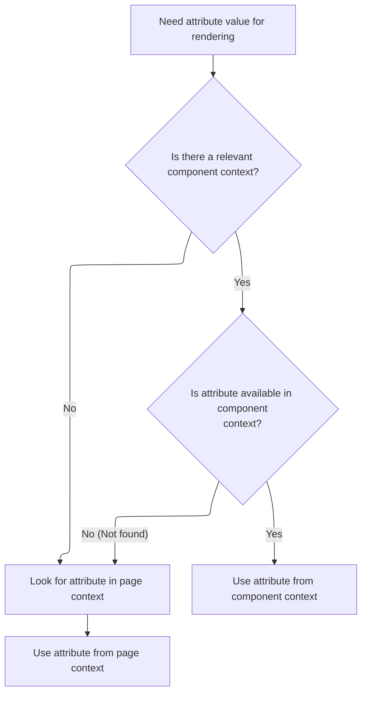

This document explains how an attribute value is retrieved for rendering. The process first checks for a component-specific value, then falls back to the page context if needed. This supports flexible and reusable UI rendering by allowing components to override page-level attributes.

# Attribute Lookup Entry Point

<SwmSnippet path="/tiles/src/main/java/org/apache/struts/tiles/taglib/util/TagUtils.java" line="148">

---

In <SwmToken path="tiles/src/main/java/org/apache/struts/tiles/taglib/util/TagUtils.java" pos="148:7:7" line-data="    public static Object findAttribute(String beanName, PageContext pageContext) {">`findAttribute`</SwmToken>, we start by trying to get a <SwmToken path="tiles/src/main/java/org/apache/struts/tiles/taglib/util/TagUtils.java" pos="149:1:1" line-data="        ComponentContext compContext = ComponentContext.getContext(pageContext.getRequest());">`ComponentContext`</SwmToken> from the request tied to the current <SwmToken path="tiles/src/main/java/org/apache/struts/tiles/taglib/util/TagUtils.java" pos="148:14:14" line-data="    public static Object findAttribute(String beanName, PageContext pageContext) {">`PageContext`</SwmToken>. This sets up a layered search: first, look for the attribute in the more specific <SwmToken path="tiles/src/main/java/org/apache/struts/tiles/taglib/util/TagUtils.java" pos="149:1:1" line-data="        ComponentContext compContext = ComponentContext.getContext(pageContext.getRequest());">`ComponentContext`</SwmToken>, and if it's not there, fall back to the broader <SwmToken path="tiles/src/main/java/org/apache/struts/tiles/taglib/util/TagUtils.java" pos="148:14:14" line-data="    public static Object findAttribute(String beanName, PageContext pageContext) {">`PageContext`</SwmToken>. To do this, we need to extract the request from the <SwmToken path="tiles/src/main/java/org/apache/struts/tiles/taglib/util/TagUtils.java" pos="148:14:14" line-data="    public static Object findAttribute(String beanName, PageContext pageContext) {">`PageContext`</SwmToken>, which is why the next step is to call into <SwmToken path="core/src/main/java/org/apache/struts/chain/contexts/ServletActionContext.java" pos="39:4:4" line-data="public class ServletActionContext extends WebActionContext {">`ServletActionContext`</SwmToken> to get the request object.

```java
    public static Object findAttribute(String beanName, PageContext pageContext) {
        ComponentContext compContext = ComponentContext.getContext(pageContext.getRequest());
```

---

</SwmSnippet>

## Extracting the HTTP Request

<SwmSnippet path="/core/src/main/java/org/apache/struts/chain/contexts/ServletActionContext.java" line="94">

---

<SwmToken path="core/src/main/java/org/apache/struts/chain/contexts/ServletActionContext.java" pos="94:5:5" line-data="    public HttpServletRequest getRequest() {">`getRequest`</SwmToken> pulls the <SwmToken path="core/src/main/java/org/apache/struts/chain/contexts/ServletActionContext.java" pos="94:3:3" line-data="    public HttpServletRequest getRequest() {">`HttpServletRequest`</SwmToken> from the underlying <SwmToken path="core/src/main/java/org/apache/struts/chain/contexts/ServletActionContext.java" pos="67:3:3" line-data="    protected ServletWebContext servletWebContext() {">`ServletWebContext`</SwmToken>. This indirection lets the framework handle different context implementations without hardcoding servlet details everywhere.

```java
    public HttpServletRequest getRequest() {
        return servletWebContext().getRequest();
    }
```

---

</SwmSnippet>

<SwmSnippet path="/core/src/main/java/org/apache/struts/chain/contexts/ServletActionContext.java" line="67">

---

<SwmToken path="core/src/main/java/org/apache/struts/chain/contexts/ServletActionContext.java" pos="67:5:5" line-data="    protected ServletWebContext servletWebContext() {">`servletWebContext`</SwmToken> just casts the base context to <SwmToken path="core/src/main/java/org/apache/struts/chain/contexts/ServletActionContext.java" pos="67:3:3" line-data="    protected ServletWebContext servletWebContext() {">`ServletWebContext`</SwmToken> with no checks. If the base context isn't what we expect, this will blow up at runtime.

```java
    protected ServletWebContext servletWebContext() {
        return (ServletWebContext) this.getBaseContext();
    }
```

---

</SwmSnippet>

## Component Context Retrieval



<SwmSnippet path="/tiles/src/main/java/org/apache/struts/tiles/taglib/util/TagUtils.java" line="149">

---

Back in `TagUtils.findAttribute`, after getting the request, we call into <SwmToken path="tiles/src/main/java/org/apache/struts/tiles/taglib/util/TagUtils.java" pos="149:1:1" line-data="        ComponentContext compContext = ComponentContext.getContext(pageContext.getRequest());">`ComponentContext`</SwmToken> to see if there's a tile/component-specific context attached to this request. This lets us check for attributes that might only exist for the current tile before falling back to the page scope.

```java
        ComponentContext compContext = ComponentContext.getContext(pageContext.getRequest());

```

---

</SwmSnippet>

<SwmSnippet path="/tiles/src/main/java/org/apache/struts/tiles/ComponentContext.java" line="187">

---

<SwmToken path="tiles/src/main/java/org/apache/struts/tiles/ComponentContext.java" pos="187:7:7" line-data="    static public ComponentContext getContext(ServletRequest request) {">`getContext`</SwmToken> first checks for a JSP exception on the request. If one is present, it skips returning a <SwmToken path="tiles/src/main/java/org/apache/struts/tiles/ComponentContext.java" pos="187:5:5" line-data="    static public ComponentContext getContext(ServletRequest request) {">`ComponentContext`</SwmToken>. Otherwise, it pulls the context from the request attribute, assuming it's there and of the right type.

```java
    static public ComponentContext getContext(ServletRequest request) {
       if (request.getAttribute("javax.servlet.jsp.jspException") != null) {
           return null;
        }        return (ComponentContext) request.getAttribute(
            ComponentConstants.COMPONENT_CONTEXT);
    }
```

---

</SwmSnippet>

<SwmSnippet path="/tiles/src/main/java/org/apache/struts/tiles/taglib/util/TagUtils.java" line="151">

---

Back in `TagUtils.findAttribute`, after checking <SwmToken path="tiles/src/main/java/org/apache/struts/tiles/taglib/util/TagUtils.java" pos="149:1:1" line-data="        ComponentContext compContext = ComponentContext.getContext(pageContext.getRequest());">`ComponentContext`</SwmToken>, if the attribute isn't found there, we try <SwmToken path="tiles/src/main/java/org/apache/struts/tiles/taglib/util/TagUtils.java" pos="148:14:14" line-data="    public static Object findAttribute(String beanName, PageContext pageContext) {">`PageContext`</SwmToken> as a fallback. This layered search means component-specific values take priority, but we don't miss out on page-level attributes if nothing is set for the tile.

```java
        if (compContext != null) {
            Object attribute = compContext.findAttribute(beanName, pageContext);
            if (attribute != null) {
                return attribute;
            }
        }

        // Search in pageContext scopes
        return pageContext.findAttribute(beanName);
    }
```

---

</SwmSnippet>

&nbsp;

*This is an auto-generated document by Swimm 🌊 and has not yet been verified by a human*

<SwmMeta version="3.0.0" repo-id="Z2l0aHViJTNBJTNBc3RydXRzMSUzQSUzQVN3aW1tLURlbW8=" repo-name="struts1"><sup>Powered by [Swimm](https://app.swimm.io/)</sup></SwmMeta>
