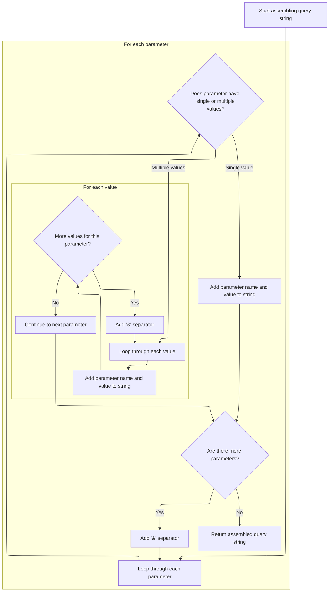

This document explains how a redirect URL is built by combining a base path, query parameters, and an optional anchor. This ensures navigation or workflow redirection includes all necessary information in the URL.

# Building the Redirect Path

<SwmSnippet path="/core/src/main/java/org/apache/struts/action/ActionRedirect.java" line="230">

---

In <SwmToken path="core/src/main/java/org/apache/struts/action/ActionRedirect.java" pos="230:5:5" line-data="    public String getPath() {">`getPath`</SwmToken>, we grab the original path first, since everything else (parameters, anchors) gets appended to it. We need to call <SwmToken path="core/src/main/java/org/apache/struts/action/ActionRedirect.java" pos="232:7:7" line-data="        String originalPath = getOriginalPath();">`getOriginalPath`</SwmToken> so we know the base URL before adding anything.

```java
    public String getPath() {
        // get the original path and the parameter string that was formed
        String originalPath = getOriginalPath();
```

---

</SwmSnippet>

<SwmSnippet path="/core/src/main/java/org/apache/struts/action/ActionRedirect.java" line="233">

---

Back in <SwmToken path="core/src/main/java/org/apache/struts/action/ActionRedirect.java" pos="230:5:5" line-data="    public String getPath() {">`getPath`</SwmToken>, after getting the original path, we immediately fetch the parameter string. This step ensures any query parameters are ready to be appended to the base URL.

```java
        String parameterString = getParameterString();
```

---

</SwmSnippet>

## Formatting Query Parameters



<SwmSnippet path="/core/src/main/java/org/apache/struts/action/ActionRedirect.java" line="295">

---

In <SwmToken path="core/src/main/java/org/apache/struts/action/ActionRedirect.java" pos="295:5:5" line-data="    public String getParameterString() {">`getParameterString`</SwmToken>, we loop through all parameters and build a query string. Single values get appended as key=value, arrays get each value appended with the same key. Everything is joined with '&'.

```java
    public String getParameterString() {
        StringBuffer strParam = new StringBuffer(DEFAULT_BUFFER_SIZE);

        // loop through all parameters
        Iterator iterator = parameterValues.keySet().iterator();

        while (iterator.hasNext()) {
            // get the parameter name
            String paramName = (String) iterator.next();

            // get the value for this parameter
            Object value = parameterValues.get(paramName);

            if (value instanceof String) {
                // just one value for this param
                strParam.append(paramName).append("=").append(value);
            } else if (value instanceof String[]) {
                // loop through all values for this param
                String[] values = (String[]) value;

                for (int i = 0; i < values.length; i++) {
                    strParam.append(paramName).append("=").append(values[i]);

                    if (i < (values.length - 1)) {
                        strParam.append("&");
                    }
                }
            }

            if (iterator.hasNext()) {
                strParam.append("&");
            }
        }
```

---

</SwmSnippet>

<SwmSnippet path="/core/src/main/java/org/apache/struts/action/ActionRedirect.java" line="329">

---

Finally, we return the built query string so it can be appended to the redirect URL. The buffer is converted to a string for use in the rest of the flow.

```java
        return strParam.toString();
    }
```

---

</SwmSnippet>

## Assembling the Final Redirect URL

```mermaid
%%{init: {"flowchart": {"defaultRenderer": "elk"}} }%%
flowchart TD
    node1["Start with original path"] --> node2{"Are parameters present?"}
    click node1 openCode "core/src/main/java/org/apache/struts/action/ActionRedirect.java:234:237"
    node2 -->|"No"| node5["Append anchor"]
    click node2 openCode "core/src/main/java/org/apache/struts/action/ActionRedirect.java:238:263"
    node2 -->|"Yes"| node3{"Does original path contain '?'?"}
    click node3 openCode "core/src/main/java/org/apache/struts/action/ActionRedirect.java:246:256"
    node3 -->|"No"| node4["Use '?' as separator"]
    click node4 openCode "core/src/main/java/org/apache/struts/action/ActionRedirect.java:240:241"
    node3 -->|"Yes"| node6{"Does path end with '?'?"}
    click node6 openCode "core/src/main/java/org/apache/struts/action/ActionRedirect.java:250:251"
    node6 -->|"No"| node7["Use '&' as separator"]
    click node7 openCode "core/src/main/java/org/apache/struts/action/ActionRedirect.java:254:255"
    node6 -->|"Yes"| node4
    node4 --> node8["Append separator and parameters"]
    click node8 openCode "core/src/main/java/org/apache/struts/action/ActionRedirect.java:259:262"
    node7 --> node8
    node8 --> node5
    node5["Append anchor"] --> node9["Return final path"]
    click node5 openCode "core/src/main/java/org/apache/struts/action/ActionRedirect.java:266:267"
    click node9 openCode "core/src/main/java/org/apache/struts/action/ActionRedirect.java:269:270"
classDef HeadingStyle fill:#777777,stroke:#333,stroke-width:2px;

%% Swimm:
%% %%{init: {"flowchart": {"defaultRenderer": "elk"}} }%%
%% flowchart TD
%%     node1["Start with original path"] --> node2{"Are parameters present?"}
%%     click node1 openCode "<SwmPath>[core/…/action/ActionRedirect.java](core/src/main/java/org/apache/struts/action/ActionRedirect.java)</SwmPath>:234:237"
%%     node2 -->|"No"| node5["Append anchor"]
%%     click node2 openCode "<SwmPath>[core/…/action/ActionRedirect.java](core/src/main/java/org/apache/struts/action/ActionRedirect.java)</SwmPath>:238:263"
%%     node2 -->|"Yes"| node3{"Does original path contain '?'?"}
%%     click node3 openCode "<SwmPath>[core/…/action/ActionRedirect.java](core/src/main/java/org/apache/struts/action/ActionRedirect.java)</SwmPath>:246:256"
%%     node3 -->|"No"| node4["Use '?' as separator"]
%%     click node4 openCode "<SwmPath>[core/…/action/ActionRedirect.java](core/src/main/java/org/apache/struts/action/ActionRedirect.java)</SwmPath>:240:241"
%%     node3 -->|"Yes"| node6{"Does path end with '?'?"}
%%     click node6 openCode "<SwmPath>[core/…/action/ActionRedirect.java](core/src/main/java/org/apache/struts/action/ActionRedirect.java)</SwmPath>:250:251"
%%     node6 -->|"No"| node7["Use '&' as separator"]
%%     click node7 openCode "<SwmPath>[core/…/action/ActionRedirect.java](core/src/main/java/org/apache/struts/action/ActionRedirect.java)</SwmPath>:254:255"
%%     node6 -->|"Yes"| node4
%%     node4 --> node8["Append separator and parameters"]
%%     click node8 openCode "<SwmPath>[core/…/action/ActionRedirect.java](core/src/main/java/org/apache/struts/action/ActionRedirect.java)</SwmPath>:259:262"
%%     node7 --> node8
%%     node8 --> node5
%%     node5["Append anchor"] --> node9["Return final path"]
%%     click node5 openCode "<SwmPath>[core/…/action/ActionRedirect.java](core/src/main/java/org/apache/struts/action/ActionRedirect.java)</SwmPath>:266:267"
%%     click node9 openCode "<SwmPath>[core/…/action/ActionRedirect.java](core/src/main/java/org/apache/struts/action/ActionRedirect.java)</SwmPath>:269:270"
%% classDef HeadingStyle fill:#777777,stroke:#333,stroke-width:2px;
```



<SwmSnippet path="/core/src/main/java/org/apache/struts/action/ActionRedirect.java" line="234">

---

Back in <SwmToken path="core/src/main/java/org/apache/struts/action/ActionRedirect.java" pos="230:5:5" line-data="    public String getPath() {">`getPath`</SwmToken>, after getting the parameter string, we check if the original path already has a '?'. If so, we use '&' to append parameters; otherwise, we use '?'. Then we add the anchor string and return the full redirect URL.

```java
        String anchorString = getAnchorString();

        StringBuffer result = new StringBuffer(originalPath);

        if ((parameterString != null) && (parameterString.length() > 0)) {
            // the parameter separator we're going to use
            String paramSeparator = "?";

            // true if we need to use a parameter separator after originalPath
            boolean needsParamSeparator = true;

            // does the original path already have a "?"?
            int paramStartIndex = originalPath.indexOf("?");

            if (paramStartIndex > 0) {
                // did the path end with "?"?
                needsParamSeparator = (paramStartIndex != (originalPath.length()
                    - 1));

                if (needsParamSeparator) {
                    paramSeparator = "&";
                }
            }

            if (needsParamSeparator) {
                result.append(paramSeparator);
            }

            result.append(parameterString);
        }

        // append anchor string (or blank if none was set)
        result.append(anchorString);


        return result.toString();
    }
```

---

</SwmSnippet>

&nbsp;

*This is an auto-generated document by Swimm 🌊 and has not yet been verified by a human*

<SwmMeta version="3.0.0" repo-id="Z2l0aHViJTNBJTNBc3RydXRzMSUzQSUzQVN3aW1tLURlbW8=" repo-name="struts1"><sup>Powered by [Swimm](https://app.swimm.io/)</sup></SwmMeta>
