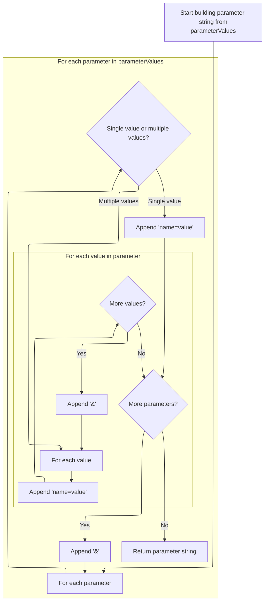
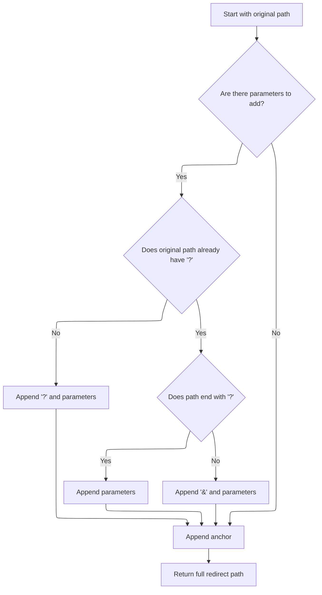

This document explains how a redirect URL is constructed by combining a base path, query parameters, and an optional anchor. This ensures users are redirected to the correct destination with all required information included in the URL.

# Building the Redirect Path

<SwmSnippet path="/core/src/main/java/org/apache/struts/action/ActionRedirect.java" line="230">

---

In <SwmToken path="core/src/main/java/org/apache/struts/action/ActionRedirect.java" pos="230:5:5" line-data="    public String getPath() {">`getPath`</SwmToken>, we start by grabbing the original path using <SwmToken path="core/src/main/java/org/apache/struts/action/ActionRedirect.java" pos="232:7:9" line-data="        String originalPath = getOriginalPath();">`getOriginalPath()`</SwmToken>. This gives us the base URL that everything else (parameters, anchors) will be attached to. We need to call <SwmToken path="core/src/main/java/org/apache/struts/action/ActionRedirect.java" pos="232:7:7" line-data="        String originalPath = getOriginalPath();">`getOriginalPath`</SwmToken> first because the rest of the logic depends on knowing where we're redirecting before we can add anything to it.

```java
    public String getPath() {
        // get the original path and the parameter string that was formed
        String originalPath = getOriginalPath();
```

---

</SwmSnippet>

<SwmSnippet path="/core/src/main/java/org/apache/struts/action/ActionRedirect.java" line="233">

---

Back in <SwmToken path="core/src/main/java/org/apache/struts/action/ActionRedirect.java" pos="230:5:5" line-data="    public String getPath() {">`getPath`</SwmToken>, after getting the original path, we immediately fetch the parameter string with <SwmToken path="core/src/main/java/org/apache/struts/action/ActionRedirect.java" pos="233:7:9" line-data="        String parameterString = getParameterString();">`getParameterString()`</SwmToken>. This step is needed to collect all the query parameters that should be added to the URL. Without this, the redirect would just be a plain path with no extra data.

```java
        String parameterString = getParameterString();
```

---

</SwmSnippet>

## Serializing Parameters for the URL



<SwmSnippet path="/core/src/main/java/org/apache/struts/action/ActionRedirect.java" line="295">

---

In <SwmToken path="core/src/main/java/org/apache/struts/action/ActionRedirect.java" pos="295:5:5" line-data="    public String getParameterString() {">`getParameterString`</SwmToken>, we loop through the <SwmToken path="core/src/main/java/org/apache/struts/action/ActionRedirect.java" pos="299:7:7" line-data="        Iterator iterator = parameterValues.keySet().iterator();">`parameterValues`</SwmToken> map, expecting each value to be either a String or a String array. For each entry, we serialize it into 'key=value' pairs, joining multiple values with '&'. This builds the query string that gets appended to the redirect URL.

```java
    public String getParameterString() {
        StringBuffer strParam = new StringBuffer(DEFAULT_BUFFER_SIZE);

        // loop through all parameters
        Iterator iterator = parameterValues.keySet().iterator();

        while (iterator.hasNext()) {
            // get the parameter name
            String paramName = (String) iterator.next();

            // get the value for this parameter
            Object value = parameterValues.get(paramName);

            if (value instanceof String) {
                // just one value for this param
                strParam.append(paramName).append("=").append(value);
            } else if (value instanceof String[]) {
                // loop through all values for this param
                String[] values = (String[]) value;

                for (int i = 0; i < values.length; i++) {
                    strParam.append(paramName).append("=").append(values[i]);

                    if (i < (values.length - 1)) {
                        strParam.append("&");
                    }
                }
            }

            if (iterator.hasNext()) {
                strParam.append("&");
            }
        }
```

---

</SwmSnippet>

<SwmSnippet path="/core/src/main/java/org/apache/struts/action/ActionRedirect.java" line="329">

---

Finally in <SwmToken path="core/src/main/java/org/apache/struts/action/ActionRedirect.java" pos="233:7:7" line-data="        String parameterString = getParameterString();">`getParameterString`</SwmToken>, we convert the buffer to a String and return it. The rest of the flow expects a String, so we need to do this conversion before passing the parameter string back to <SwmToken path="core/src/main/java/org/apache/struts/action/ActionRedirect.java" pos="230:5:5" line-data="    public String getPath() {">`getPath`</SwmToken>.

```java
        return strParam.toString();
    }
```

---

</SwmSnippet>

## Composing the Final Redirect URL



<SwmSnippet path="/core/src/main/java/org/apache/struts/action/ActionRedirect.java" line="234">

---

After getting the parameter string in <SwmToken path="core/src/main/java/org/apache/struts/action/ActionRedirect.java" pos="230:5:5" line-data="    public String getPath() {">`getPath`</SwmToken>, we check if there are parameters to add, figure out the right separator ('?' or '&'), and append everything (parameters and anchor) to the base path. We return the final URL as a String so it can be used directly for the redirect.

```java
        String anchorString = getAnchorString();

        StringBuffer result = new StringBuffer(originalPath);

        if ((parameterString != null) && (parameterString.length() > 0)) {
            // the parameter separator we're going to use
            String paramSeparator = "?";

            // true if we need to use a parameter separator after originalPath
            boolean needsParamSeparator = true;

            // does the original path already have a "?"?
            int paramStartIndex = originalPath.indexOf("?");

            if (paramStartIndex > 0) {
                // did the path end with "?"?
                needsParamSeparator = (paramStartIndex != (originalPath.length()
                    - 1));

                if (needsParamSeparator) {
                    paramSeparator = "&";
                }
            }

            if (needsParamSeparator) {
                result.append(paramSeparator);
            }

            result.append(parameterString);
        }

        // append anchor string (or blank if none was set)
        result.append(anchorString);


        return result.toString();
    }
```

---

</SwmSnippet>

&nbsp;

*This is an auto-generated document by Swimm 🌊 and has not yet been verified by a human*

<SwmMeta version="3.0.0" repo-id="Z2l0aHViJTNBJTNBc3RydXRzMSUzQSUzQVN3aW1tLURlbW8=" repo-name="struts1"><sup>Powered by [Swimm](https://app.swimm.io/)</sup></SwmMeta>
