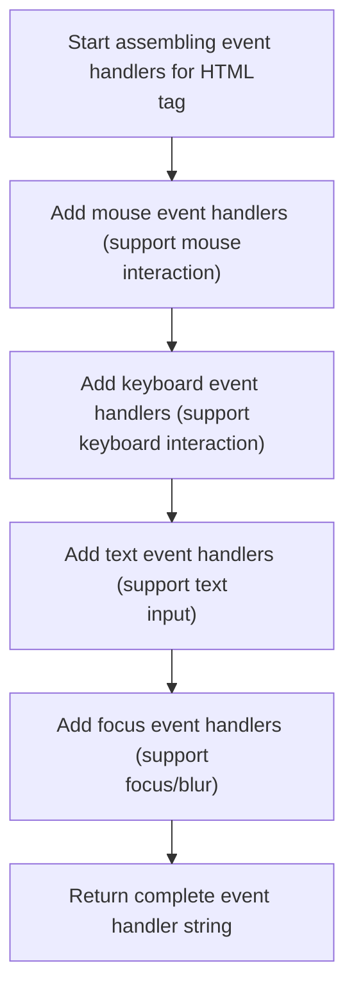

This document describes how event handler and state attributes are prepared for HTML form elements. The flow collects all necessary handlers and state information, producing a string of attributes to ensure interactive and accessible form controls in the rendered HTML.

# Where is this flow used?

This flow is used multiple times in the codebase as represented in the following diagram:

(Note - these are only some of the entry points of this flow)

```mermaid
graph TD;
      71ddfa855c52deabd2f43f2927180c614cd5406e57899956abd88820d83bba04(taglib/…/html/ImgTag.java::ImgTag.doEndTag) --> 772a516e45a4d49a2a8eb217fb4324f5c16ec8d43e28d71c31ea45d500e9bef3(taglib/…/html/BaseHandlerTag.java::BaseHandlerTag.prepareEventHandlers)

301dfc7ce22ede9c7489c8be7f41b3e29c1314ff3abbff75b89d76d9d9735032(taglib/…/html/RadioTag.java::RadioTag.doStartTag) --> 5879655579cd0af8fa7578026060c84080ed05a38d35bf1edc129bd63318a65c(taglib/…/html/RadioTag.java::RadioTag.renderRadioElement)

5879655579cd0af8fa7578026060c84080ed05a38d35bf1edc129bd63318a65c(taglib/…/html/RadioTag.java::RadioTag.renderRadioElement) --> 772a516e45a4d49a2a8eb217fb4324f5c16ec8d43e28d71c31ea45d500e9bef3(taglib/…/html/BaseHandlerTag.java::BaseHandlerTag.prepareEventHandlers)

2c2ce28aaa6165003ef5589d8a8a5bdc21b65969cd85fd8b3612224a11795533(taglib/…/html/BaseFieldTag.java::BaseFieldTag.doStartTag) --> e05f7a0268d45dd6cbda0454d34b519da746846bf88e8c631682bc7870014f4c(taglib/…/html/BaseFieldTag.java::BaseFieldTag.renderInputElement)

e05f7a0268d45dd6cbda0454d34b519da746846bf88e8c631682bc7870014f4c(taglib/…/html/BaseFieldTag.java::BaseFieldTag.renderInputElement) --> 772a516e45a4d49a2a8eb217fb4324f5c16ec8d43e28d71c31ea45d500e9bef3(taglib/…/html/BaseHandlerTag.java::BaseHandlerTag.prepareEventHandlers)

16954283ad016dbbdd2ab1921c68eca78115311671b85ed5cbdc2e02dc68e0de(taglib/…/html/CheckboxTag.java::CheckboxTag.doStartTag) --> 772a516e45a4d49a2a8eb217fb4324f5c16ec8d43e28d71c31ea45d500e9bef3(taglib/…/html/BaseHandlerTag.java::BaseHandlerTag.prepareEventHandlers)

0072d0bda5a83199fb108597a9cc7e79ab04d586b0862cee6b4b66640d2665d0(taglib/…/html/LinkTag.java::LinkTag.doEndTag) --> 772a516e45a4d49a2a8eb217fb4324f5c16ec8d43e28d71c31ea45d500e9bef3(taglib/…/html/BaseHandlerTag.java::BaseHandlerTag.prepareEventHandlers)


classDef mainFlowStyle color:#000000,fill:#7CB9F4
classDef rootsStyle color:#000000,fill:#00FFF4
classDef Style1 color:#000000,fill:#00FFAA
classDef Style2 color:#000000,fill:#FFFF00
classDef Style3 color:#000000,fill:#AA7CB9

%% Swimm:
%% graph TD;
%%       71ddfa855c52deabd2f43f2927180c614cd5406e57899956abd88820d83bba04(<SwmPath>[taglib/…/html/ImgTag.java](taglib/src/main/java/org/apache/struts/taglib/html/ImgTag.java)</SwmPath>::ImgTag.doEndTag) --> 772a516e45a4d49a2a8eb217fb4324f5c16ec8d43e28d71c31ea45d500e9bef3(<SwmPath>[taglib/…/html/BaseHandlerTag.java](taglib/src/main/java/org/apache/struts/taglib/html/BaseHandlerTag.java)</SwmPath>::BaseHandlerTag.prepareEventHandlers)
%% 
%% 301dfc7ce22ede9c7489c8be7f41b3e29c1314ff3abbff75b89d76d9d9735032(<SwmPath>[taglib/…/html/RadioTag.java](taglib/src/main/java/org/apache/struts/taglib/html/RadioTag.java)</SwmPath>::RadioTag.doStartTag) --> 5879655579cd0af8fa7578026060c84080ed05a38d35bf1edc129bd63318a65c(<SwmPath>[taglib/…/html/RadioTag.java](taglib/src/main/java/org/apache/struts/taglib/html/RadioTag.java)</SwmPath>::RadioTag.renderRadioElement)
%% 
%% 5879655579cd0af8fa7578026060c84080ed05a38d35bf1edc129bd63318a65c(<SwmPath>[taglib/…/html/RadioTag.java](taglib/src/main/java/org/apache/struts/taglib/html/RadioTag.java)</SwmPath>::RadioTag.renderRadioElement) --> 772a516e45a4d49a2a8eb217fb4324f5c16ec8d43e28d71c31ea45d500e9bef3(<SwmPath>[taglib/…/html/BaseHandlerTag.java](taglib/src/main/java/org/apache/struts/taglib/html/BaseHandlerTag.java)</SwmPath>::BaseHandlerTag.prepareEventHandlers)
%% 
%% 2c2ce28aaa6165003ef5589d8a8a5bdc21b65969cd85fd8b3612224a11795533(<SwmPath>[taglib/…/html/BaseFieldTag.java](taglib/src/main/java/org/apache/struts/taglib/html/BaseFieldTag.java)</SwmPath>::BaseFieldTag.doStartTag) --> e05f7a0268d45dd6cbda0454d34b519da746846bf88e8c631682bc7870014f4c(<SwmPath>[taglib/…/html/BaseFieldTag.java](taglib/src/main/java/org/apache/struts/taglib/html/BaseFieldTag.java)</SwmPath>::BaseFieldTag.renderInputElement)
%% 
%% e05f7a0268d45dd6cbda0454d34b519da746846bf88e8c631682bc7870014f4c(<SwmPath>[taglib/…/html/BaseFieldTag.java](taglib/src/main/java/org/apache/struts/taglib/html/BaseFieldTag.java)</SwmPath>::BaseFieldTag.renderInputElement) --> 772a516e45a4d49a2a8eb217fb4324f5c16ec8d43e28d71c31ea45d500e9bef3(<SwmPath>[taglib/…/html/BaseHandlerTag.java](taglib/src/main/java/org/apache/struts/taglib/html/BaseHandlerTag.java)</SwmPath>::BaseHandlerTag.prepareEventHandlers)
%% 
%% 16954283ad016dbbdd2ab1921c68eca78115311671b85ed5cbdc2e02dc68e0de(<SwmPath>[taglib/…/html/CheckboxTag.java](taglib/src/main/java/org/apache/struts/taglib/html/CheckboxTag.java)</SwmPath>::CheckboxTag.doStartTag) --> 772a516e45a4d49a2a8eb217fb4324f5c16ec8d43e28d71c31ea45d500e9bef3(<SwmPath>[taglib/…/html/BaseHandlerTag.java](taglib/src/main/java/org/apache/struts/taglib/html/BaseHandlerTag.java)</SwmPath>::BaseHandlerTag.prepareEventHandlers)
%% 
%% 0072d0bda5a83199fb108597a9cc7e79ab04d586b0862cee6b4b66640d2665d0(<SwmPath>[taglib/…/html/LinkTag.java](taglib/src/main/java/org/apache/struts/taglib/html/LinkTag.java)</SwmPath>::LinkTag.doEndTag) --> 772a516e45a4d49a2a8eb217fb4324f5c16ec8d43e28d71c31ea45d500e9bef3(<SwmPath>[taglib/…/html/BaseHandlerTag.java](taglib/src/main/java/org/apache/struts/taglib/html/BaseHandlerTag.java)</SwmPath>::BaseHandlerTag.prepareEventHandlers)
%% 
%% 
%% classDef mainFlowStyle color:#000000,fill:#7CB9F4
%% classDef rootsStyle color:#000000,fill:#00FFF4
%% classDef Style1 color:#000000,fill:#00FFAA
%% classDef Style2 color:#000000,fill:#FFFF00
%% classDef Style3 color:#000000,fill:#AA7CB9
```



# Building Event Handler Attributes and Managing Input State



<SwmSnippet path="/taglib/src/main/java/org/apache/struts/taglib/html/BaseHandlerTag.java" line="1039">

---

<SwmToken path="taglib/src/main/java/org/apache/struts/taglib/html/BaseHandlerTag.java" pos="1039:5:5" line-data="    protected String prepareEventHandlers() {">`prepareEventHandlers`</SwmToken> collects all event handler attributes for the tag by calling the mouse, key, text, and focus event preparation methods in sequence. Calling <SwmToken path="taglib/src/main/java/org/apache/struts/taglib/html/BaseHandlerTag.java" pos="1045:1:1" line-data="        prepareFocusEvents(handlers);">`prepareFocusEvents`</SwmToken> next ensures that focus events and input state (disabled/readonly) are appended to the handlers, so the final string covers all interactive and state-related attributes needed for the HTML element.

```java
    protected String prepareEventHandlers() {
        StringBuffer handlers = new StringBuffer();

        prepareMouseEvents(handlers);
        prepareKeyEvents(handlers);
        prepareTextEvents(handlers);
        prepareFocusEvents(handlers);

        return handlers.toString();
    }
```

---

</SwmSnippet>

<SwmSnippet path="/taglib/src/main/java/org/apache/struts/taglib/html/BaseHandlerTag.java" line="1095">

---

<SwmToken path="taglib/src/main/java/org/apache/struts/taglib/html/BaseHandlerTag.java" pos="1095:5:5" line-data="    protected void prepareFocusEvents(StringBuffer handlers) {">`prepareFocusEvents`</SwmToken> adds the onblur and onfocus event handlers, then checks if it needs to append disabled or readonly attributes. It conditionally grabs the parent <SwmToken path="taglib/src/main/java/org/apache/struts/taglib/html/BaseHandlerTag.java" pos="1099:9:9" line-data="        // Get the parent FormTag (if necessary)">`FormTag`</SwmToken> to see if the form is disabled/readonly, and if so (or if the tag itself is), it appends the corresponding attributes. This way, both the tag and its parent form can control the input's state in the final HTML.

```java
    protected void prepareFocusEvents(StringBuffer handlers) {
        prepareAttribute(handlers, "onblur", getOnblur());
        prepareAttribute(handlers, "onfocus", getOnfocus());

        // Get the parent FormTag (if necessary)
        FormTag formTag = null;

        if ((doDisabled && !getDisabled()) || (doReadonly && !getReadonly())) {
            formTag =
                (FormTag) pageContext.getAttribute(Constants.FORM_KEY,
                    PageContext.REQUEST_SCOPE);
        }

        // Format Disabled
        if (doDisabled) {
            boolean formDisabled =
                (formTag == null) ? false : formTag.isDisabled();

            if (formDisabled || getDisabled()) {
                handlers.append(" disabled=\"disabled\"");
            }
        }

        // Format Read Only
        if (doReadonly) {
            boolean formReadOnly =
                (formTag == null) ? false : formTag.isReadonly();

            if (formReadOnly || getReadonly()) {
                handlers.append(" readonly=\"readonly\"");
            }
        }
    }
```

---

</SwmSnippet>

&nbsp;

*This is an auto-generated document by Swimm 🌊 and has not yet been verified by a human*

<SwmMeta version="3.0.0" repo-id="Z2l0aHViJTNBJTNBc3RydXRzMSUzQSUzQVN3aW1tLURlbW8=" repo-name="struts1"><sup>Powered by [Swimm](https://app.swimm.io/)</sup></SwmMeta>
