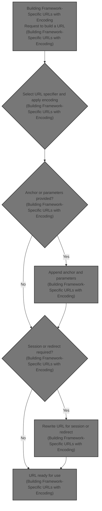
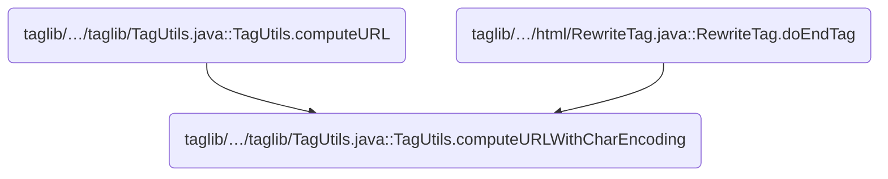

This document describes how URLs are dynamically built for web pages, actions, or resources, ensuring proper formatting, encoding, and session tracking. The flow adapts to framework routing and supports anchors and parameters.



# Where is this flow used?

This flow is used multiple times in the codebase as represented in the following diagram:



# Building Framework-Specific URLs with Encoding

```mermaid
%%{init: {"flowchart": {"defaultRenderer": "elk"}} }%%
flowchart TD
    node1["Start: Request to build a URL"]
    click node1 openCode "taglib/src/main/java/org/apache/struts/taglib/TagUtils.java:366:368"
    node1 --> node2{"Is exactly one URL specifier provided?"}
    click node2 openCode "taglib/src/main/java/org/apache/struts/taglib/TagUtils.java:379:400"
    node2 -->|"No"| node3["Return error: Invalid URL specifier"]
    click node3 openCode "taglib/src/main/java/org/apache/struts/taglib/TagUtils.java:398:400"
    node2 -->|"Yes"| node4{"Use local character encoding?"}
    click node4 openCode "taglib/src/main/java/org/apache/struts/taglib/TagUtils.java:373:375"
    node4 -->|"Yes"| node5["Set encoding to local"]
    click node5 openCode "taglib/src/main/java/org/apache/struts/taglib/TagUtils.java:374:375"
    node4 -->|"No"| node6["Set encoding to UTF-8"]
    click node6 openCode "taglib/src/main/java/org/apache/struts/taglib/TagUtils.java:371:372"
    node5 --> node7["Select base URL (forward, href, page, or action)"]
    click node7 openCode "taglib/src/main/java/org/apache/struts/taglib/TagUtils.java:410:448"
    node6 --> node7
    node7 --> node8{"Add anchor?"}
    click node8 openCode "taglib/src/main/java/org/apache/struts/taglib/TagUtils.java:451:461"
    node8 -->|"Yes"| node9["Append anchor to URL"]
    click node9 openCode "taglib/src/main/java/org/apache/struts/taglib/TagUtils.java:451:461"
    node8 -->|"No"| node10["Continue"]
    node9 --> node11{"Add parameters?"}
    click node11 openCode "taglib/src/main/java/org/apache/struts/taglib/TagUtils.java:464:545"
    node10 --> node11
    subgraph loop1["For each parameter to add to the URL"]
        node11 -->|"Yes"| node12{"Parameter value type?"}
        node12 -->|"Null"| node13["Append key only"]
        click node13 openCode "taglib/src/main/java/org/apache/struts/taglib/TagUtils.java:496:506"
        node12 -->|"String"| node14["Append key=value"]
        click node14 openCode "taglib/src/main/java/org/apache/struts/taglib/TagUtils.java:507:517"
        node12 -->|"Array"| node15["Append key=value for each"]
        click node15 openCode "taglib/src/main/java/org/apache/struts/taglib/TagUtils.java:518:531"
        node12 -->|"Other"| node16["Append key=object.toString()"]
        click node16 openCode "taglib/src/main/java/org/apache/struts/taglib/TagUtils.java:533:544"
        node13 --> node17["Next parameter"]
        node14 --> node17
        node15 --> node17
        node16 --> node17
        node17 --> node11
    end
    node11 -->|"No parameters"| node18{"Re-add anchor if needed"}
    click node18 openCode "taglib/src/main/java/org/apache/struts/taglib/TagUtils.java:547:551"
    node18 --> node19{"Redirect or session encoding?"}
    click node19 openCode "taglib/src/main/java/org/apache/struts/taglib/TagUtils.java:556:564"
    node19 -->|"Redirect"| node20["Encode URL for redirect"]
    click node20 openCode "taglib/src/main/java/org/apache/struts/taglib/TagUtils.java:560:562"
    node19 -->|"Session"| node21["Encode URL for session"]
    click node21 openCode "taglib/src/main/java/org/apache/struts/taglib/TagUtils.java:564:565"
    node19 -->|"Neither"| node22["Return final URL"]
    click node22 openCode "taglib/src/main/java/org/apache/struts/taglib/TagUtils.java:567:568"
    node20 --> node22
    node21 --> node22

classDef HeadingStyle fill:#777777,stroke:#333,stroke-width:2px;

%% Swimm:
%% %%{init: {"flowchart": {"defaultRenderer": "elk"}} }%%
%% flowchart TD
%%     node1["Start: Request to build a URL"]
%%     click node1 openCode "<SwmPath>[taglib/…/taglib/TagUtils.java](taglib/src/main/java/org/apache/struts/taglib/TagUtils.java)</SwmPath>:366:368"
%%     node1 --> node2{"Is exactly one URL specifier provided?"}
%%     click node2 openCode "<SwmPath>[taglib/…/taglib/TagUtils.java](taglib/src/main/java/org/apache/struts/taglib/TagUtils.java)</SwmPath>:379:400"
%%     node2 -->|"No"| node3["Return error: Invalid URL specifier"]
%%     click node3 openCode "<SwmPath>[taglib/…/taglib/TagUtils.java](taglib/src/main/java/org/apache/struts/taglib/TagUtils.java)</SwmPath>:398:400"
%%     node2 -->|"Yes"| node4{"Use local character encoding?"}
%%     click node4 openCode "<SwmPath>[taglib/…/taglib/TagUtils.java](taglib/src/main/java/org/apache/struts/taglib/TagUtils.java)</SwmPath>:373:375"
%%     node4 -->|"Yes"| node5["Set encoding to local"]
%%     click node5 openCode "<SwmPath>[taglib/…/taglib/TagUtils.java](taglib/src/main/java/org/apache/struts/taglib/TagUtils.java)</SwmPath>:374:375"
%%     node4 -->|"No"| node6["Set encoding to <SwmToken path="taglib/src/main/java/org/apache/struts/taglib/TagUtils.java" pos="371:8:10" line-data="        String charEncoding = &quot;UTF-8&quot;;">`UTF-8`</SwmToken>"]
%%     click node6 openCode "<SwmPath>[taglib/…/taglib/TagUtils.java](taglib/src/main/java/org/apache/struts/taglib/TagUtils.java)</SwmPath>:371:372"
%%     node5 --> node7["Select base URL (forward, href, page, or action)"]
%%     click node7 openCode "<SwmPath>[taglib/…/taglib/TagUtils.java](taglib/src/main/java/org/apache/struts/taglib/TagUtils.java)</SwmPath>:410:448"
%%     node6 --> node7
%%     node7 --> node8{"Add anchor?"}
%%     click node8 openCode "<SwmPath>[taglib/…/taglib/TagUtils.java](taglib/src/main/java/org/apache/struts/taglib/TagUtils.java)</SwmPath>:451:461"
%%     node8 -->|"Yes"| node9["Append anchor to URL"]
%%     click node9 openCode "<SwmPath>[taglib/…/taglib/TagUtils.java](taglib/src/main/java/org/apache/struts/taglib/TagUtils.java)</SwmPath>:451:461"
%%     node8 -->|"No"| node10["Continue"]
%%     node9 --> node11{"Add parameters?"}
%%     click node11 openCode "<SwmPath>[taglib/…/taglib/TagUtils.java](taglib/src/main/java/org/apache/struts/taglib/TagUtils.java)</SwmPath>:464:545"
%%     node10 --> node11
%%     subgraph loop1["For each parameter to add to the URL"]
%%         node11 -->|"Yes"| node12{"Parameter value type?"}
%%         node12 -->|"Null"| node13["Append key only"]
%%         click node13 openCode "<SwmPath>[taglib/…/taglib/TagUtils.java](taglib/src/main/java/org/apache/struts/taglib/TagUtils.java)</SwmPath>:496:506"
%%         node12 -->|"String"| node14["Append key=value"]
%%         click node14 openCode "<SwmPath>[taglib/…/taglib/TagUtils.java](taglib/src/main/java/org/apache/struts/taglib/TagUtils.java)</SwmPath>:507:517"
%%         node12 -->|"Array"| node15["Append key=value for each"]
%%         click node15 openCode "<SwmPath>[taglib/…/taglib/TagUtils.java](taglib/src/main/java/org/apache/struts/taglib/TagUtils.java)</SwmPath>:518:531"
%%         node12 -->|"Other"| node16["Append key=object.toString()"]
%%         click node16 openCode "<SwmPath>[taglib/…/taglib/TagUtils.java](taglib/src/main/java/org/apache/struts/taglib/TagUtils.java)</SwmPath>:533:544"
%%         node13 --> node17["Next parameter"]
%%         node14 --> node17
%%         node15 --> node17
%%         node16 --> node17
%%         node17 --> node11
%%     end
%%     node11 -->|"No parameters"| node18{"<SwmToken path="taglib/src/main/java/org/apache/struts/taglib/TagUtils.java" pos="547:3:5" line-data="            // Re-add the saved anchor (if any)">`Re-add`</SwmToken> anchor if needed"}
%%     click node18 openCode "<SwmPath>[taglib/…/taglib/TagUtils.java](taglib/src/main/java/org/apache/struts/taglib/TagUtils.java)</SwmPath>:547:551"
%%     node18 --> node19{"Redirect or session encoding?"}
%%     click node19 openCode "<SwmPath>[taglib/…/taglib/TagUtils.java](taglib/src/main/java/org/apache/struts/taglib/TagUtils.java)</SwmPath>:556:564"
%%     node19 -->|"Redirect"| node20["Encode URL for redirect"]
%%     click node20 openCode "<SwmPath>[taglib/…/taglib/TagUtils.java](taglib/src/main/java/org/apache/struts/taglib/TagUtils.java)</SwmPath>:560:562"
%%     node19 -->|"Session"| node21["Encode URL for session"]
%%     click node21 openCode "<SwmPath>[taglib/…/taglib/TagUtils.java](taglib/src/main/java/org/apache/struts/taglib/TagUtils.java)</SwmPath>:564:565"
%%     node19 -->|"Neither"| node22["Return final URL"]
%%     click node22 openCode "<SwmPath>[taglib/…/taglib/TagUtils.java](taglib/src/main/java/org/apache/struts/taglib/TagUtils.java)</SwmPath>:567:568"
%%     node20 --> node22
%%     node21 --> node22
%% 
%% classDef HeadingStyle fill:#777777,stroke:#333,stroke-width:2px;
```



<SwmSnippet path="/taglib/src/main/java/org/apache/struts/taglib/TagUtils.java" line="366">

---

In <SwmToken path="taglib/src/main/java/org/apache/struts/taglib/TagUtils.java" pos="366:5:5" line-data="    public String computeURLWithCharEncoding(PageContext pageContext,">`computeURLWithCharEncoding`</SwmToken>, we start by picking the character encoding and checking that only one of forward, href, page, or action is set. Then, depending on which is set, we branch to different URL construction logic. If 'action' is specified, we need to call <SwmToken path="taglib/src/main/java/org/apache/struts/taglib/TagUtils.java" pos="441:7:7" line-data="                url.append(instance.getActionMappingURL(action, module,">`getActionMappingURL`</SwmToken> next, because Struts1 actions require framework-specific URL mapping, not just a simple string append.

```java
    public String computeURLWithCharEncoding(PageContext pageContext,
        String forward, String href, String page, String action, String module,
        Map params, String anchor, boolean redirect, boolean encodeSeparator,
        boolean useLocalEncoding)
        throws MalformedURLException {
        String charEncoding = "UTF-8";

        if (useLocalEncoding) {
            charEncoding = pageContext.getResponse().getCharacterEncoding();
        }

        // TODO All the computeURL() methods need refactoring!
        // Validate that exactly one specifier was included
        int n = 0;

        if (forward != null) {
            n++;
        }

        if (href != null) {
            n++;
        }

        if (page != null) {
            n++;
        }

        if (action != null) {
            n++;
        }

        if (n != 1) {
            throw new MalformedURLException(messages.getMessage(
                    "computeURL.specifier"));
        }

        // Look up the module configuration for this request
        ModuleConfig moduleConfig = getModuleConfig(module, pageContext);

        // Calculate the appropriate URL
        StringBuffer url = new StringBuffer();
        HttpServletRequest request =
            (HttpServletRequest) pageContext.getRequest();

        if (forward != null) {
            ForwardConfig forwardConfig =
                moduleConfig.findForwardConfig(forward);

            if (forwardConfig == null) {
                throw new MalformedURLException(messages.getMessage(
                        "computeURL.forward", forward));
            }

            // **** removed - see bug 37817 ****
            //  if (forwardConfig.getRedirect()) {
            //      redirect = true;
            //  }

            if (forwardConfig.getPath().startsWith("/")) {
                url.append(request.getContextPath());
                url.append(RequestUtils.forwardURL(request, forwardConfig,
                        moduleConfig));
            } else {
                url.append(forwardConfig.getPath());
            }
        } else if (href != null) {
            url.append(href);
        } else if (action != null) {
            ActionServlet servlet = (ActionServlet) pageContext.getServletContext().getAttribute(Globals.ACTION_SERVLET_KEY);
            String actionIdPath = RequestUtils.actionIdURL(action, moduleConfig, servlet);
            if (actionIdPath != null) {
                action = actionIdPath;
                url.append(request.getContextPath());
                url.append(actionIdPath);
            } else {
                url.append(instance.getActionMappingURL(action, module,
                        pageContext, false));
            }
        } else /* if (page != null) */
         {
            url.append(request.getContextPath());
            url.append(this.pageURL(request, page, moduleConfig));
        }

```

---

</SwmSnippet>

<SwmSnippet path="/taglib/src/main/java/org/apache/struts/taglib/TagUtils.java" line="654">

---

<SwmToken path="taglib/src/main/java/org/apache/struts/taglib/TagUtils.java" pos="654:5:5" line-data="    public String getActionMappingURL(String action, String module,">`getActionMappingURL`</SwmToken> builds the action URL using Struts1-specific details: it grabs the module config, checks servlet mapping from the page context, and then applies logic based on mapping patterns like '*.extension', '/prefix/*', or '/'. It also handles query strings in the action and ensures the URL starts with the right context and module prefix.

```java
    public String getActionMappingURL(String action, String module,
        PageContext pageContext, boolean contextRelative) {
        HttpServletRequest request =
            (HttpServletRequest) pageContext.getRequest();

        String contextPath = request.getContextPath();
        StringBuffer value = new StringBuffer();

        // Avoid setting two slashes at the beginning of an action:
        //  the length of contextPath should be more than 1
        //  in case of non-root context, otherwise length==1 (the slash)
        if (contextPath.length() > 1) {
            value.append(contextPath);
        }

        ModuleConfig moduleConfig = getModuleConfig(module, pageContext);

        if ((moduleConfig != null) && (!contextRelative)) {
            value.append(moduleConfig.getPrefix());
        }

        // Use our servlet mapping, if one is specified
        String servletMapping =
            (String) pageContext.getAttribute(Globals.SERVLET_KEY,
                PageContext.APPLICATION_SCOPE);

        if (servletMapping != null) {
            String queryString = null;
            int question = action.indexOf("?");

            if (question >= 0) {
                queryString = action.substring(question);
            }

            String actionMapping = getActionMappingName(action);

            if (servletMapping.startsWith("*.")) {
                value.append(actionMapping);
                value.append(servletMapping.substring(1));
            } else if (servletMapping.endsWith("/*")) {
                value.append(servletMapping.substring(0,
                        servletMapping.length() - 2));
                value.append(actionMapping);
            } else if (servletMapping.equals("/")) {
                value.append(actionMapping);
            }

            if (queryString != null) {
                value.append(queryString);
            }
        }
        // Otherwise, assume extension mapping is in use and extension is
        // already included in the action property
        else {
            if (!action.startsWith("/")) {
                value.append("/");
            }

            value.append(action);
        }

        return value.toString();
    }
```

---

</SwmSnippet>

<SwmSnippet path="/taglib/src/main/java/org/apache/struts/taglib/TagUtils.java" line="450">

---

Back in <SwmToken path="taglib/src/main/java/org/apache/struts/taglib/TagUtils.java" pos="366:5:5" line-data="    public String computeURLWithCharEncoding(PageContext pageContext,">`computeURLWithCharEncoding`</SwmToken>, after getting the action mapping URL, we handle anchors and parameters. Anchors are stripped and re-added to make sure they're at the end, and parameters are appended with the right separator and encoding. This keeps the URL format correct regardless of what was returned from <SwmToken path="taglib/src/main/java/org/apache/struts/taglib/TagUtils.java" pos="441:7:7" line-data="                url.append(instance.getActionMappingURL(action, module,">`getActionMappingURL`</SwmToken>.

```java
        // Add anchor if requested (replacing any existing anchor)
        if (anchor != null) {
            String temp = url.toString();
            int hash = temp.indexOf('#');

            if (hash >= 0) {
                url.setLength(hash);
            }

            url.append('#');
            url.append(this.encodeURL(anchor, charEncoding));
        }

        // Add dynamic parameters if requested
        if ((params != null) && (params.size() > 0)) {
            // Save any existing anchor
            String temp = url.toString();
            int hash = temp.indexOf('#');

            if (hash >= 0) {
                anchor = temp.substring(hash + 1);
                url.setLength(hash);
                temp = url.toString();
            } else {
                anchor = null;
            }

            // Define the parameter separator
            String separator = null;

            if (redirect) {
                separator = "&";
            } else if (encodeSeparator) {
                separator = "&amp;";
            } else {
                separator = "&";
            }

            // Add the required request parameters
            boolean question = temp.indexOf('?') >= 0;
            Iterator keys = params.keySet().iterator();

            while (keys.hasNext()) {
                String key = (String) keys.next();
                Object value = params.get(key);

                if (value == null) {
                    if (!question) {
                        url.append('?');
                        question = true;
                    } else {
                        url.append(separator);
                    }

                    url.append(this.encodeURL(key, charEncoding));
                    url.append('='); // Interpret null as "no value"
                } else if (value instanceof String) {
                    if (!question) {
                        url.append('?');
                        question = true;
                    } else {
                        url.append(separator);
                    }

                    url.append(this.encodeURL(key, charEncoding));
                    url.append('=');
                    url.append(this.encodeURL((String) value, charEncoding));
                } else if (value instanceof String[]) {
                    String[] values = (String[]) value;

                    for (int i = 0; i < values.length; i++) {
                        if (!question) {
                            url.append('?');
                            question = true;
                        } else {
                            url.append(separator);
                        }

                        url.append(this.encodeURL(key, charEncoding));
                        url.append('=');
                        url.append(this.encodeURL(values[i], charEncoding));
                    }
                } else /* Convert other objects to a string */
                 {
                    if (!question) {
                        url.append('?');
                        question = true;
                    } else {
                        url.append(separator);
                    }

                    url.append(this.encodeURL(key, charEncoding));
                    url.append('=');
                    url.append(this.encodeURL(value.toString(), charEncoding));
                }
            }
```

---

</SwmSnippet>

<SwmSnippet path="/taglib/src/main/java/org/apache/struts/taglib/TagUtils.java" line="547">

---

Finally, <SwmToken path="taglib/src/main/java/org/apache/struts/taglib/TagUtils.java" pos="366:5:5" line-data="    public String computeURLWithCharEncoding(PageContext pageContext,">`computeURLWithCharEncoding`</SwmToken> returns the finished URL, optionally rewritten to include the session ID if needed. It uses <SwmToken path="taglib/src/main/java/org/apache/struts/taglib/TagUtils.java" pos="561:6:6" line-data="                return (response.encodeRedirectURL(url.toString()));">`encodeRedirectURL`</SwmToken> for redirects and <SwmToken path="taglib/src/main/java/org/apache/struts/taglib/TagUtils.java" pos="550:7:7" line-data="                url.append(this.encodeURL(anchor, charEncoding));">`encodeURL`</SwmToken> otherwise, making sure session tracking works for internal URLs.

```java
            // Re-add the saved anchor (if any)
            if (anchor != null) {
                url.append('#');
                url.append(this.encodeURL(anchor, charEncoding));
            }
        }

        // Perform URL rewriting to include our session ID (if any)
        // but only if url is not an external URL
        if ((href == null) && (pageContext.getSession() != null)) {
            HttpServletResponse response =
                (HttpServletResponse) pageContext.getResponse();

            if (redirect) {
                return (response.encodeRedirectURL(url.toString()));
            }

            return (response.encodeURL(url.toString()));
        }

        return (url.toString());
    }
```

---

</SwmSnippet>

&nbsp;

*This is an auto-generated document by Swimm 🌊 and has not yet been verified by a human*

<SwmMeta version="3.0.0" repo-id="Z2l0aHViJTNBJTNBc3RydXRzMSUzQSUzQVN3aW1tLURlbW8=" repo-name="struts1"><sup>Powered by [Swimm](https://app.swimm.io/)</sup></SwmMeta>
