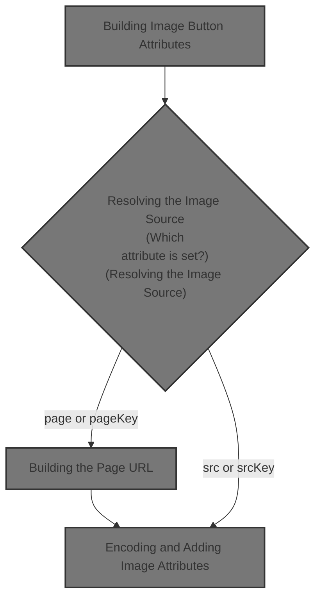
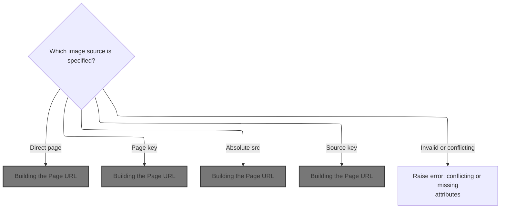
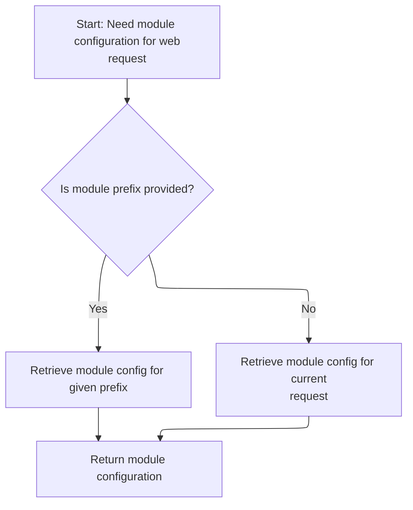
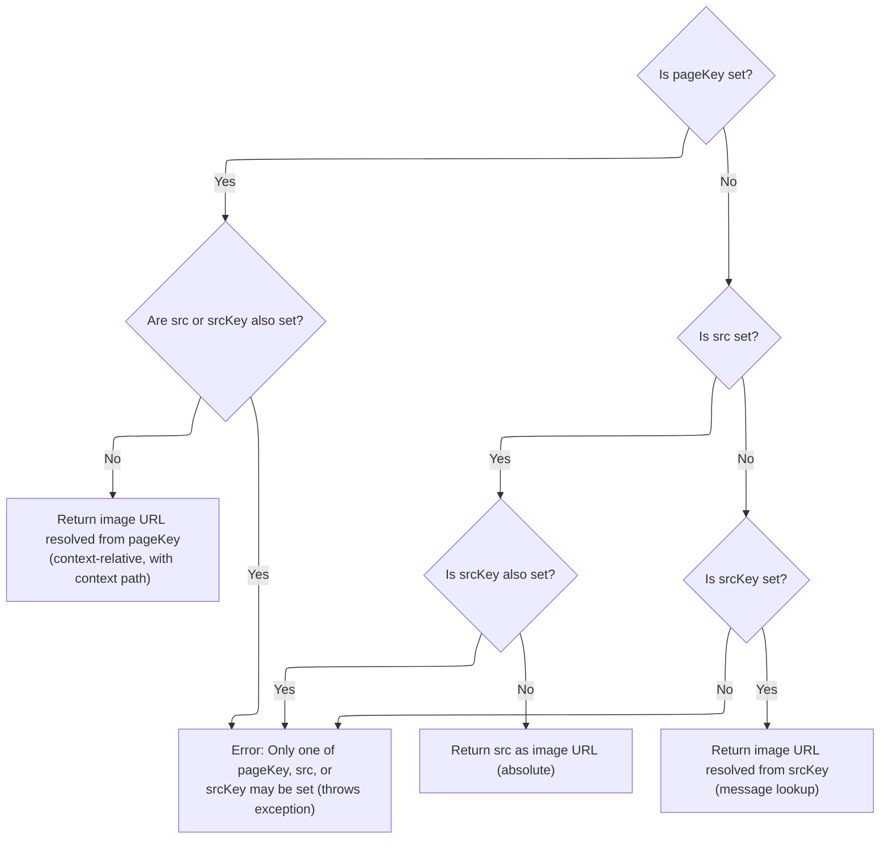

This document describes how image button attributes are constructed for web forms. The flow determines the image source from provided attributes, resolves the correct URL, encodes it for HTML, and assembles all required attributes for rendering the image button.



# Building Image Button Attributes

<SwmSnippet path="/taglib/src/main/java/org/apache/struts/taglib/html/ImageTag.java" line="161">

---

In <SwmToken path="taglib/src/main/java/org/apache/struts/taglib/html/ImageTag.java" pos="161:5:5" line-data="    protected void prepareButtonAttributes(StringBuffer results)">`prepareButtonAttributes`</SwmToken>, we start by resolving the image source URL using src(). This is needed up front because the rest of the attribute preparation depends on having a valid image source to encode and insert into the tag.

```java
    protected void prepareButtonAttributes(StringBuffer results)
        throws JspException {
        String tmp = src();

```

---

</SwmSnippet>

## Resolving the Image Source



<SwmSnippet path="/taglib/src/main/java/org/apache/struts/taglib/html/ImageTag.java" line="200">

---

In <SwmToken path="taglib/src/main/java/org/apache/struts/taglib/html/ImageTag.java" pos="200:5:5" line-data="    protected String src() throws JspException {">`src`</SwmToken>, we check which image source attribute is set (page, <SwmToken path="taglib/src/main/java/org/apache/struts/taglib/html/ImageTag.java" pos="204:6:6" line-data="                || (this.pageKey != null)) {">`pageKey`</SwmToken>, src, or <SwmToken path="taglib/src/main/java/org/apache/struts/taglib/html/ImageTag.java" pos="203:19:19" line-data="            if ((this.src != null) || (this.srcKey != null)">`srcKey`</SwmToken>), making sure only one is used to avoid ambiguity. If 'page' is set, we grab the request and module config next, since those are needed to resolve the actual URL.

```java
    protected String src() throws JspException {
        // Deal with a direct context-relative page that has been specified
        if (this.page != null) {
            if ((this.src != null) || (this.srcKey != null)
                || (this.pageKey != null)) {
                JspException e =
                    new JspException(messages.getMessage("imgTag.src"));

                TagUtils.getInstance().saveException(pageContext, e);
                throw e;
            }

            HttpServletRequest request =
                (HttpServletRequest) pageContext.getRequest();

```

---

</SwmSnippet>

### Accessing the HTTP Request

<SwmSnippet path="/core/src/main/java/org/apache/struts/chain/contexts/ServletActionContext.java" line="94">

---

<SwmToken path="core/src/main/java/org/apache/struts/chain/contexts/ServletActionContext.java" pos="94:5:5" line-data="    public HttpServletRequest getRequest() {">`getRequest`</SwmToken> just fetches the current <SwmToken path="core/src/main/java/org/apache/struts/chain/contexts/ServletActionContext.java" pos="94:3:3" line-data="    public HttpServletRequest getRequest() {">`HttpServletRequest`</SwmToken> from the web context, which is needed for downstream URL and config resolution.

```java
    public HttpServletRequest getRequest() {
        return servletWebContext().getRequest();
    }
```

---

</SwmSnippet>

<SwmSnippet path="/core/src/main/java/org/apache/struts/chain/contexts/ServletActionContext.java" line="67">

---

<SwmToken path="core/src/main/java/org/apache/struts/chain/contexts/ServletActionContext.java" pos="67:5:5" line-data="    protected ServletWebContext servletWebContext() {">`servletWebContext`</SwmToken> just casts the base context to <SwmToken path="core/src/main/java/org/apache/struts/chain/contexts/ServletActionContext.java" pos="67:3:3" line-data="    protected ServletWebContext servletWebContext() {">`ServletWebContext`</SwmToken> without checking. If the context isn't right, you'll get a <SwmToken path="taglib/src/main/java/org/apache/struts/taglib/TagUtils.java" pos="209:8:8" line-data="            //        } catch (ClassCastException e) {">`ClassCastException`</SwmToken>.

```java
    protected ServletWebContext servletWebContext() {
        return (ServletWebContext) this.getBaseContext();
    }
```

---

</SwmSnippet>

### Resolving Module Configuration

<SwmSnippet path="/taglib/src/main/java/org/apache/struts/taglib/html/ImageTag.java" line="215">

---

Back in `ImageTag.src`, after getting the request, we grab the <SwmToken path="taglib/src/main/java/org/apache/struts/taglib/html/ImageTag.java" pos="215:1:1" line-data="            ModuleConfig config =">`ModuleConfig`</SwmToken> using <SwmToken path="taglib/src/main/java/org/apache/struts/taglib/html/ImageTag.java" pos="216:1:1" line-data="                ModuleUtils.getInstance().getModuleConfig(this.module,">`ModuleUtils`</SwmToken>. This is needed because Struts modules can have different URL patterns and settings.

```java
            ModuleConfig config =
                ModuleUtils.getInstance().getModuleConfig(this.module,
                    request, pageContext.getServletContext());

```

---

</SwmSnippet>

### Finding the Module Configuration



<SwmSnippet path="/core/src/main/java/org/apache/struts/util/ModuleUtils.java" line="108">

---

<SwmToken path="core/src/main/java/org/apache/struts/util/ModuleUtils.java" pos="108:5:5" line-data="    public ModuleConfig getModuleConfig(String prefix,">`getModuleConfig`</SwmToken> checks if a module prefix is given. If so, it looks up the config by prefix; otherwise, it tries to resolve the current module from the request.

```java
    public ModuleConfig getModuleConfig(String prefix,
        HttpServletRequest request, ServletContext context) {
        ModuleConfig moduleConfig = null;

        if (prefix != null) {
            //lookup module stored with the given prefix.
            moduleConfig = this.getModuleConfig(prefix, context);
        } else {
            //return the current module if no prefix was supplied.
            moduleConfig = this.getModuleConfig(request, context);
        }

        return moduleConfig;
    }
```

---

</SwmSnippet>

<SwmSnippet path="/core/src/main/java/org/apache/struts/util/ModuleUtils.java" line="130">

---

<SwmToken path="core/src/main/java/org/apache/struts/util/ModuleUtils.java" pos="130:5:5" line-data="    public ModuleConfig getModuleConfig(HttpServletRequest request,">`getModuleConfig`</SwmToken> (request, context) first tries to get the config from the request. If that's missing, it falls back to the context (using an empty string for the default module) and sets it as a request attribute for later use.

```java
    public ModuleConfig getModuleConfig(HttpServletRequest request,
        ServletContext context) {
        ModuleConfig moduleConfig = this.getModuleConfig(request);

        if (moduleConfig == null) {
            moduleConfig = this.getModuleConfig("", context);
            request.setAttribute(Globals.MODULE_KEY, moduleConfig);
        }

        return moduleConfig;
    }
```

---

</SwmSnippet>

### Building the Page URL



<SwmSnippet path="/taglib/src/main/java/org/apache/struts/taglib/html/ImageTag.java" line="219">

---

Back in `ImageTag.src`, after getting the <SwmToken path="taglib/src/main/java/org/apache/struts/taglib/html/ImageTag.java" pos="215:1:1" line-data="            ModuleConfig config =">`ModuleConfig`</SwmToken>, we use TagUtils.pageURL to build the final page URL. This handles any module-specific URL patterns.

```java
            String pageValue = this.page;

            if (config != null) {
                pageValue =
                    TagUtils.getInstance().pageURL(request, this.page, config);
            }

            return (request.getContextPath() + pageValue);
        }

```

---

</SwmSnippet>

<SwmSnippet path="/taglib/src/main/java/org/apache/struts/taglib/TagUtils.java" line="1031">

---

<SwmToken path="taglib/src/main/java/org/apache/struts/taglib/TagUtils.java" pos="1031:5:5" line-data="    public String pageURL(HttpServletRequest request, String page,">`pageURL`</SwmToken> builds the final URL using a pattern from the module config. It replaces $M with the module prefix, $P with the page, and $$ with a literal dollar sign. If there's no pattern, it just joins the prefix and page.

```java
    public String pageURL(HttpServletRequest request, String page,
        ModuleConfig moduleConfig) {
        StringBuffer sb = new StringBuffer();
        String pagePattern =
            moduleConfig.getControllerConfig().getPagePattern();

        if (pagePattern == null) {
            sb.append(moduleConfig.getPrefix());
            sb.append(page);
        } else {
            boolean dollar = false;

            for (int i = 0; i < pagePattern.length(); i++) {
                char ch = pagePattern.charAt(i);

                if (dollar) {
                    switch (ch) {
                    case 'M':
                        sb.append(moduleConfig.getPrefix());

                        break;

                    case 'P':
                        sb.append(page);

                        break;

                    case '$':
                        sb.append('$');

                        break;

                    default:
                        ; // Silently swallow
                    }

                    dollar = false;

                    continue;
                } else if (ch == '$') {
                    dollar = true;
                } else {
                    sb.append(ch);
                }
            }
```

---

</SwmSnippet>

<SwmSnippet path="/taglib/src/main/java/org/apache/struts/taglib/html/ImageTag.java" line="229">

---

Back in `ImageTag.src`, after building the URL for 'page', we check if <SwmToken path="taglib/src/main/java/org/apache/struts/taglib/html/ImageTag.java" pos="230:6:6" line-data="        if (this.pageKey != null) {">`pageKey`</SwmToken> is set. If so, we repeat the process: get the request again, since the context might have changed, and prep for another round of module config and message resolution.

```java
        // Deal with an indirect context-relative page that has been specified
        if (this.pageKey != null) {
            if ((this.src != null) || (this.srcKey != null)) {
                JspException e =
                    new JspException(messages.getMessage("imgTag.src"));

                TagUtils.getInstance().saveException(pageContext, e);
                throw e;
            }

            HttpServletRequest request =
                (HttpServletRequest) pageContext.getRequest();

```

---

</SwmSnippet>

<SwmSnippet path="/taglib/src/main/java/org/apache/struts/taglib/html/ImageTag.java" line="242">

---

Back in `ImageTag.src`, after getting the request for <SwmToken path="taglib/src/main/java/org/apache/struts/taglib/html/ImageTag.java" pos="204:6:6" line-data="                || (this.pageKey != null)) {">`pageKey`</SwmToken>, we fetch <SwmToken path="taglib/src/main/java/org/apache/struts/taglib/html/ImageTag.java" pos="242:1:1" line-data="            ModuleConfig config =">`ModuleConfig`</SwmToken> again. This is needed in case the resolved page key points to a different module setup.

```java
            ModuleConfig config =
                ModuleUtils.getInstance().getModuleConfig(this.module,
                    request, pageContext.getServletContext());

```

---

</SwmSnippet>

<SwmSnippet path="/taglib/src/main/java/org/apache/struts/taglib/html/ImageTag.java" line="246">

---

Back in `ImageTag.src`, after getting the <SwmToken path="taglib/src/main/java/org/apache/struts/taglib/html/ImageTag.java" pos="215:1:1" line-data="            ModuleConfig config =">`ModuleConfig`</SwmToken> for <SwmToken path="taglib/src/main/java/org/apache/struts/taglib/html/ImageTag.java" pos="248:8:8" line-data="                    getLocale(), this.pageKey);">`pageKey`</SwmToken>, we use TagUtils.message to resolve the actual page path from the resource bundle, then (if config is present) build the URL with <SwmToken path="taglib/src/main/java/org/apache/struts/taglib/html/ImageTag.java" pos="252:7:7" line-data="                    TagUtils.getInstance().pageURL(request, pageValue, config);">`pageURL`</SwmToken>.

```java
            String pageValue =
                TagUtils.getInstance().message(pageContext, getBundle(),
                    getLocale(), this.pageKey);

            if (config != null) {
                pageValue =
                    TagUtils.getInstance().pageURL(request, pageValue, config);
            }

            return (request.getContextPath() + pageValue);
        }

```

---

</SwmSnippet>

<SwmSnippet path="/taglib/src/main/java/org/apache/struts/taglib/html/ImageTag.java" line="258">

---

Back in `ImageTag.src`, after handling page and <SwmToken path="taglib/src/main/java/org/apache/struts/taglib/html/ImageTag.java" pos="204:6:6" line-data="                || (this.pageKey != null)) {">`pageKey`</SwmToken>, we check for 'src' and <SwmToken path="taglib/src/main/java/org/apache/struts/taglib/html/ImageTag.java" pos="260:6:6" line-data="            if (this.srcKey != null) {">`srcKey`</SwmToken>. Only one can be set, or we throw. If 'src' is set, we return it directly. If <SwmToken path="taglib/src/main/java/org/apache/struts/taglib/html/ImageTag.java" pos="260:6:6" line-data="            if (this.srcKey != null) {">`srcKey`</SwmToken> is set, we resolve it from the resource bundle. If nothing is set, we throw.

```java
        // Deal with an absolute source that has been specified
        if (this.src != null) {
            if (this.srcKey != null) {
                JspException e =
                    new JspException(messages.getMessage("imgTag.src"));

                TagUtils.getInstance().saveException(pageContext, e);
                throw e;
            }

            return (this.src);
        }

        // Deal with an indirect source that has been specified
        if (this.srcKey == null) {
            JspException e =
                new JspException(messages.getMessage("imgTag.src"));

            TagUtils.getInstance().saveException(pageContext, e);
            throw e;
        }

        return TagUtils.getInstance().message(pageContext, getBundle(),
            getLocale(), this.srcKey);
    }
```

---

</SwmSnippet>

## Encoding and Adding Image Attributes

<SwmSnippet path="/taglib/src/main/java/org/apache/struts/taglib/html/ImageTag.java" line="165">

---

Back in `ImageTag.prepareButtonAttributes`, after getting the image URL from src, we grab the response object so we can encode the URL before adding it as the 'src' attribute.

```java
        if (tmp != null) {
            HttpServletResponse response =
                (HttpServletResponse) pageContext.getResponse();

```

---

</SwmSnippet>

<SwmSnippet path="/core/src/main/java/org/apache/struts/chain/contexts/ServletActionContext.java" line="103">

---

<SwmToken path="core/src/main/java/org/apache/struts/chain/contexts/ServletActionContext.java" pos="103:5:5" line-data="    public HttpServletResponse getResponse() {">`getResponse`</SwmToken> just fetches the current <SwmToken path="core/src/main/java/org/apache/struts/chain/contexts/ServletActionContext.java" pos="103:3:3" line-data="    public HttpServletResponse getResponse() {">`HttpServletResponse`</SwmToken> from the web context, which is needed for URL encoding.

```java
    public HttpServletResponse getResponse() {
        return servletWebContext().getResponse();
    }
```

---

</SwmSnippet>

<SwmSnippet path="/taglib/src/main/java/org/apache/struts/taglib/html/ImageTag.java" line="169">

---

Back in `ImageTag.prepareButtonAttributes`, after encoding the src, we add all the other attributes (align, border, value, etc.) using <SwmToken path="taglib/src/main/java/org/apache/struts/taglib/html/ImageTag.java" pos="169:1:1" line-data="            prepareAttribute(results, &quot;src&quot;, response.encodeURL(tmp));">`prepareAttribute`</SwmToken>. This delegates to <SwmToken path="taglib/src/main/java/org/apache/struts/taglib/html/LabelTag.java" pos="33:4:4" line-data="public class LabelTag extends BaseInputTag {">`LabelTag`</SwmToken> for any special handling, like required field styling.

```java
            prepareAttribute(results, "src", response.encodeURL(tmp));
        }

        prepareAttribute(results, "align", getAlign());
        prepareAttribute(results, "border", getBorder());
        prepareAttribute(results, "value", getValue());
        prepareAttribute(results, "accesskey", getAccesskey());
        prepareAttribute(results, "tabindex", getTabindex());
    }
```

---

</SwmSnippet>

<SwmSnippet path="/taglib/src/main/java/org/apache/struts/taglib/html/LabelTag.java" line="161">

---

<SwmToken path="taglib/src/main/java/org/apache/struts/taglib/html/LabelTag.java" pos="161:5:5" line-data="    protected void prepareAttribute(StringBuffer handlers, String name,">`prepareAttribute`</SwmToken> in <SwmToken path="taglib/src/main/java/org/apache/struts/taglib/html/LabelTag.java" pos="33:4:4" line-data="public class LabelTag extends BaseInputTag {">`LabelTag`</SwmToken> checks if the attribute is 'class' and the field is required. If so, it appends a required style class before delegating to the superclass. This is how required fields get their special CSS.

```java
    protected void prepareAttribute(StringBuffer handlers, String name,
            Object value) {

        if ("class".equals(name) && this.required) {
            String requiredStyleClass = getRequiredStyleClass();
            if (requiredStyleClass != null) {
                value = (value != null) ? (value + " " + requiredStyleClass)
                        : requiredStyleClass;
            }
        }
        super.prepareAttribute(handlers, name, value);
    }
```

---

</SwmSnippet>

&nbsp;

*This is an auto-generated document by Swimm 🌊 and has not yet been verified by a human*

<SwmMeta version="3.0.0" repo-id="Z2l0aHViJTNBJTNBc3RydXRzMSUzQSUzQVN3aW1tLURlbW8=" repo-name="struts1"><sup>Powered by [Swimm](https://app.swimm.io/)</sup></SwmMeta>
