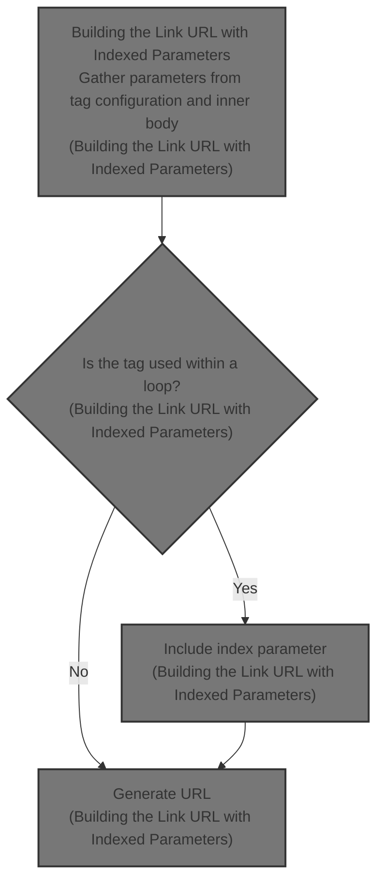
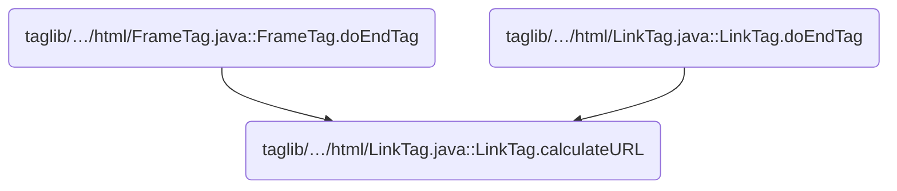
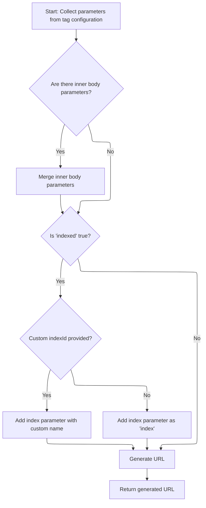

This document explains how link URLs are built for dynamic lists and repeated elements in web pages. Parameters are gathered from tag configuration and the inner body, and an index parameter is included when the tag is used within a loop. The generated URL ensures each link points to the correct item.



# Where is this flow used?

This flow is used multiple times in the codebase as represented in the following diagram:



# Building the Link URL with Indexed Parameters



<SwmSnippet path="/taglib/src/main/java/org/apache/struts/taglib/html/LinkTag.java" line="409">

---

In <SwmToken path="taglib/src/main/java/org/apache/struts/taglib/html/LinkTag.java" pos="409:5:5" line-data="    protected String calculateURL()">`calculateURL`</SwmToken>, we start by collecting parameters from tag attributes and the inner body. If 'indexed' is set, we need to figure out which item in a loop this link refers to, so we call <SwmToken path="taglib/src/main/java/org/apache/struts/taglib/html/LinkTag.java" pos="428:7:9" line-data="            int indexValue = getIndexValue();">`getIndexValue()`</SwmToken> next to get the current loop index.

```java
    protected String calculateURL()
        throws JspException {
        // Identify the parameters we will add to the completed URL
        Map params =
            TagUtils.getInstance().computeParameters(pageContext, paramId,
                paramName, paramProperty, paramScope, name, property, scope,
                transaction);

        // Add parameters collected from the tag's inner body
        if (!this.parameters.isEmpty()) {
            if (params == null) {
                params = new HashMap();
            }
            params.putAll(this.parameters);
        }

        // if "indexed=true", add "index=x" parameter to query string
        // * @since Struts 1.1
        if (indexed) {
            int indexValue = getIndexValue();

```

---

</SwmSnippet>

<SwmSnippet path="/taglib/src/main/java/org/apache/struts/taglib/html/BaseHandlerTag.java" line="935">

---

GetIndexValue() checks if the tag is inside an <SwmToken path="taglib/src/main/java/org/apache/struts/taglib/html/BaseHandlerTag.java" pos="938:1:1" line-data="        IterateTag iterateTag =">`IterateTag`</SwmToken> or JSTL loop, grabs the current index from whichever is found, and throws a localized exception if neither is present. This ensures the index parameter is only added when the tag is actually inside a loop.

```java
    protected int getIndexValue()
        throws JspException {
        // look for outer iterate tag
        IterateTag iterateTag =
            (IterateTag) findAncestorWithClass(this, IterateTag.class);

        if (iterateTag != null) {
            return iterateTag.getIndex();
        }

        // Look for JSTL loops
        Integer i = getJstlLoopIndex();

        if (i != null) {
            return i.intValue();
        }

        // this tag should be nested in an IterateTag or JSTL loop tag, if it's not, throw exception
        JspException e =
            new JspException(messages.getMessage("indexed.noEnclosingIterate"));

        TagUtils.getInstance().saveException(pageContext, e);
        throw e;
    }
```

---

</SwmSnippet>

<SwmSnippet path="/taglib/src/main/java/org/apache/struts/taglib/html/LinkTag.java" line="430">

---

Back in LinkTag.calculateURL, after getting the index from <SwmToken path="taglib/src/main/java/org/apache/struts/taglib/html/LinkTag.java" pos="428:7:9" line-data="            int indexValue = getIndexValue();">`getIndexValue()`</SwmToken>, we add it to the parameters map and then build the final URL with all parameters, including the index. This makes sure each link in a loop points to the right item.

```java
            //calculate index, and add as a parameter
            if (params == null) {
                params = new HashMap(); //create new HashMap if no other params
            }

            if (indexId != null) {
                params.put(indexId, Integer.toString(indexValue));
            } else {
                params.put("index", Integer.toString(indexValue));
            }
        }

        String url = null;

        try {
            url = TagUtils.getInstance().computeURLWithCharEncoding(pageContext,
                    forward, href, page, action, module, params, anchor, false,
                    useLocalEncoding);
        } catch (MalformedURLException e) {
            TagUtils.getInstance().saveException(pageContext, e);
            throw new JspException(messages.getMessage("rewrite.url",
                    e.toString()), e);
        }

        return (url);
    }
```

---

</SwmSnippet>

&nbsp;

*This is an auto-generated document by Swimm 🌊 and has not yet been verified by a human*

<SwmMeta version="3.0.0" repo-id="Z2l0aHViJTNBJTNBc3RydXRzMSUzQSUzQVN3aW1tLURlbW8=" repo-name="struts1"><sup>Powered by [Swimm](https://app.swimm.io/)</sup></SwmMeta>
