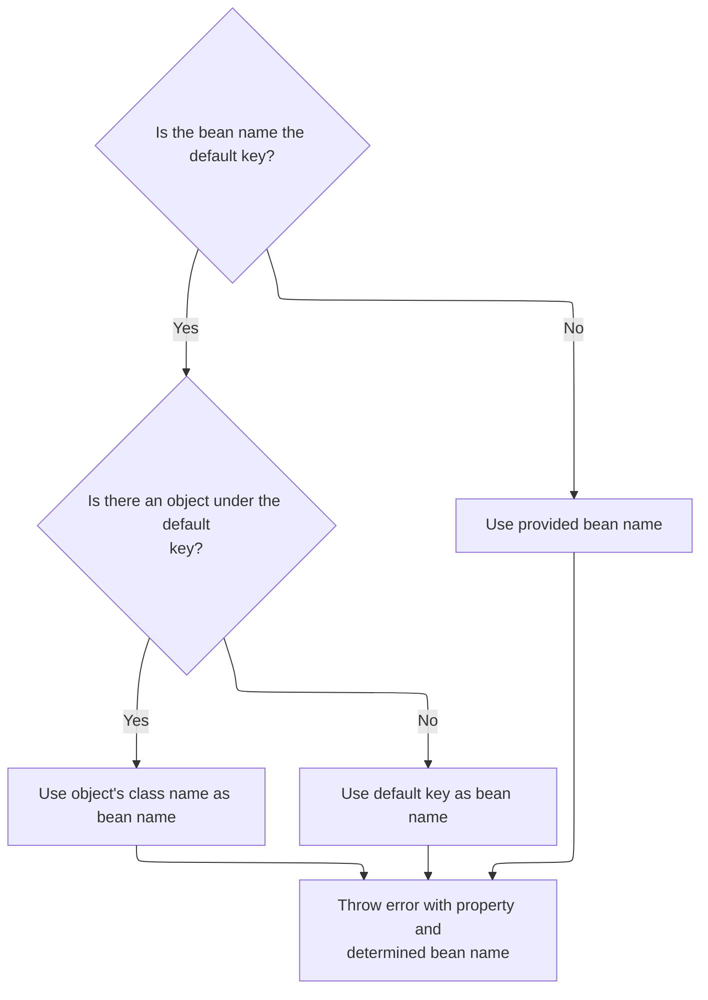

This document explains how parameters are gathered and assembled for use in tag processing. The flow enables tags to flexibly retrieve parameter values from various sources and supports the inclusion of a transaction token when needed. The process starts by determining if parameters or transaction control are required, collects parameter values from the context, builds a result map, and returns it for use by tags.

# Building the Parameter Map

<SwmSnippet path="/taglib/src/main/java/org/apache/struts/taglib/TagUtils.java" line="190">

---

In <SwmToken path="taglib/src/main/java/org/apache/struts/taglib/TagUtils.java" pos="190:5:5" line-data="    public Map computeParameters(PageContext pageContext, String paramId,">`computeParameters`</SwmToken>, we check if any parameters or transaction control are needed, and if so, we try to fetch a Map of parameters from the context using the provided bean name/property/scope. Calling <SwmToken path="taglib/src/main/java/org/apache/struts/taglib/TagUtils.java" pos="204:13:13" line-data="                map = (Map) getInstance().lookup(pageContext, name, property,">`lookup`</SwmToken> here lets us support dynamic sources for parameters, not just static values.

```java
    public Map computeParameters(PageContext pageContext, String paramId,
        String paramName, String paramProperty, String paramScope, String name,
        String property, String scope, boolean transaction)
        throws JspException {
        // Short circuit if no parameters are specified
        if ((paramId == null) && (name == null) && !transaction) {
            return (null);
        }

        // Locate the Map containing our multi-value parameters map
        Map map = null;

        try {
            if (name != null) {
                map = (Map) getInstance().lookup(pageContext, name, property,
                        scope);
            }

```

---

</SwmSnippet>

## Resolving Beans and Properties

<SwmSnippet path="/taglib/src/main/java/org/apache/struts/taglib/TagUtils.java" line="897">

---

In <SwmToken path="taglib/src/main/java/org/apache/struts/taglib/TagUtils.java" pos="897:5:5" line-data="    public Object lookup(PageContext pageContext, String name, String property,">`lookup`</SwmToken>, we try to find the bean (and optionally a property) in the page context. If the bean isn't found, we create a <SwmToken path="taglib/src/main/java/org/apache/struts/taglib/TagUtils.java" pos="898:8:8" line-data="        String scope) throws JspException {">`JspException`</SwmToken>, save it for error handling, and throw it. This makes sure errors are visible to the rest of the system.

```java
    public Object lookup(PageContext pageContext, String name, String property,
        String scope) throws JspException {
        // Look up the requested bean, and return if requested
        Object bean = lookup(pageContext, name, scope);

        if (bean == null) {
            JspException e = null;

            if (scope == null) {
                e = new JspException(messages.getMessage("lookup.bean.any", name));
            } else {
                e = new JspException(messages.getMessage("lookup.bean", name,
                            scope));
            }

            saveException(pageContext, e);
            throw e;
        }

        if (property == null) {
            return bean;
        }

        // Locate and return the specified property
        try {
            return PropertyUtils.getProperty(bean, property);
        } catch (IllegalAccessException e) {
            saveException(pageContext, e);
            throw new JspException(messages.getMessage("lookup.access",
                    property, name), e);
        } catch (IllegalArgumentException e) {
            saveException(pageContext, e);
            throw new JspException(messages.getMessage("lookup.argument",
                    property, name), e);
        } catch (InvocationTargetException e) {
            Throwable t = e.getTargetException();

            if (t == null) {
                t = e;
            }

            saveException(pageContext, t);
            throw new JspException(messages.getMessage("lookup.target",
                    property, name), e);
        } catch (NoSuchMethodException e) {
            saveException(pageContext, e);

```

---

</SwmSnippet>

### Recording Exceptions in the Request

<SwmSnippet path="/taglib/src/main/java/org/apache/struts/taglib/TagUtils.java" line="1170">

---

<SwmToken path="taglib/src/main/java/org/apache/struts/taglib/TagUtils.java" pos="1170:5:5" line-data="    public void saveException(PageContext pageContext, Throwable exception) {">`saveException`</SwmToken> just puts the exception into the request scope under a known key. This makes it available for error pages or handlers. The actual set is done by a utility method that always uses request scope, hiding that detail from callers.

```java
    public void saveException(PageContext pageContext, Throwable exception) {
        pageContext.setAttribute(Globals.EXCEPTION_KEY, exception,
            PageContext.REQUEST_SCOPE);
    }
```

---

</SwmSnippet>

<SwmSnippet path="/tiles/src/main/java/org/apache/struts/tiles/taglib/util/TagUtils.java" line="290">

---

<SwmToken path="tiles/src/main/java/org/apache/struts/tiles/taglib/util/TagUtils.java" pos="290:7:7" line-data="    public static void setAttribute(PageContext pageContext, String name, Object beanValue)">`setAttribute`</SwmToken> is just a wrapper that always puts the attribute in the request scope. No extra logic, just a fixed scope to keep things simple and consistent.

```java
    public static void setAttribute(PageContext pageContext, String name, Object beanValue)
        throws JspException {
        pageContext.setAttribute(name, beanValue, PageContext.REQUEST_SCOPE);
    }
```

---

</SwmSnippet>

### Final Exception Handling in Bean Lookup



<SwmSnippet path="/taglib/src/main/java/org/apache/struts/taglib/TagUtils.java" line="944">

---

Back in <SwmToken path="taglib/src/main/java/org/apache/struts/taglib/TagUtils.java" pos="947:12:12" line-data="            // an input tag. Thus lookup the bean under the key and use">`lookup`</SwmToken>, after saving the exception, we build a more detailed error message using the bean's class name if possible, then throw a new <SwmToken path="taglib/src/main/java/org/apache/struts/taglib/TagUtils.java" pos="957:5:5" line-data="            throw new JspException(messages.getMessage(&quot;lookup.method&quot;,">`JspException`</SwmToken>. This helps make error reporting clearer for debugging.

```java
            String beanName = name;

            // Name defaults to Contants.BEAN_KEY if no name is specified by
            // an input tag. Thus lookup the bean under the key and use
            // its class name for the exception message.
            if (Constants.BEAN_KEY.equals(name)) {
                Object obj = pageContext.findAttribute(Constants.BEAN_KEY);

                if (obj != null) {
                    beanName = obj.getClass().getName();
                }
            }

            throw new JspException(messages.getMessage("lookup.method",
                    property, beanName), e);
        }
    }
```

---

</SwmSnippet>

## Building and Populating the Result Map

```mermaid
%%{init: {"flowchart": {"defaultRenderer": "elk"}} }%%
flowchart TD
    node1["Start with existing parameters or create
empty map"]
    click node1 openCode "taglib/src/main/java/org/apache/struts/taglib/TagUtils.java:221:225"
    node1 --> node2{"Are both parameter id and name provided?"}
    click node2 openCode "taglib/src/main/java/org/apache/struts/taglib/TagUtils.java:228:229"
    node2 -->|"No"| node6{"Should add anti-duplicate token?"}
    node2 -->|"Yes"| node3{"Is parameter value available?"}
    click node3 openCode "taglib/src/main/java/org/apache/struts/taglib/TagUtils.java:240:240"
    node3 -->|"No"| node6
    node3 -->|"Yes"| node4{"Does parameter id already exist in map?"}
    click node4 openCode "taglib/src/main/java/org/apache/struts/taglib/TagUtils.java:249:251"
    node4 -->|"No"| node5["Add parameter to map"]
    click node5 openCode "taglib/src/main/java/org/apache/struts/taglib/TagUtils.java:252:252"
    node4 -->|"Yes"| node10["Append value to existing parameter"]
    click node10 openCode "taglib/src/main/java/org/apache/struts/taglib/TagUtils.java:253:267"
    node5 --> node6
    node10 --> node6
    node6 -->|"No"| node8["Return parameter map"]
    click node8 openCode "taglib/src/main/java/org/apache/struts/taglib/TagUtils.java:287:287"
    node6 -->|"Yes"| node7{"Is session and token available?"}
    click node7 openCode "taglib/src/main/java/org/apache/struts/taglib/TagUtils.java:273:281"
    node7 -->|"No"| node8
    node7 -->|"Yes"| node9["Add anti-duplicate token to map"]
    click node9 openCode "taglib/src/main/java/org/apache/struts/taglib/TagUtils.java:282:283"
    node9 --> node8
classDef HeadingStyle fill:#777777,stroke:#333,stroke-width:2px;

%% Swimm:
%% %%{init: {"flowchart": {"defaultRenderer": "elk"}} }%%
%% flowchart TD
%%     node1["Start with existing parameters or create
%% empty map"]
%%     click node1 openCode "<SwmPath>[taglib/…/taglib/TagUtils.java](taglib/src/main/java/org/apache/struts/taglib/TagUtils.java)</SwmPath>:221:225"
%%     node1 --> node2{"Are both parameter id and name provided?"}
%%     click node2 openCode "<SwmPath>[taglib/…/taglib/TagUtils.java](taglib/src/main/java/org/apache/struts/taglib/TagUtils.java)</SwmPath>:228:229"
%%     node2 -->|"No"| node6{"Should add anti-duplicate token?"}
%%     node2 -->|"Yes"| node3{"Is parameter value available?"}
%%     click node3 openCode "<SwmPath>[taglib/…/taglib/TagUtils.java](taglib/src/main/java/org/apache/struts/taglib/TagUtils.java)</SwmPath>:240:240"
%%     node3 -->|"No"| node6
%%     node3 -->|"Yes"| node4{"Does parameter id already exist in map?"}
%%     click node4 openCode "<SwmPath>[taglib/…/taglib/TagUtils.java](taglib/src/main/java/org/apache/struts/taglib/TagUtils.java)</SwmPath>:249:251"
%%     node4 -->|"No"| node5["Add parameter to map"]
%%     click node5 openCode "<SwmPath>[taglib/…/taglib/TagUtils.java](taglib/src/main/java/org/apache/struts/taglib/TagUtils.java)</SwmPath>:252:252"
%%     node4 -->|"Yes"| node10["Append value to existing parameter"]
%%     click node10 openCode "<SwmPath>[taglib/…/taglib/TagUtils.java](taglib/src/main/java/org/apache/struts/taglib/TagUtils.java)</SwmPath>:253:267"
%%     node5 --> node6
%%     node10 --> node6
%%     node6 -->|"No"| node8["Return parameter map"]
%%     click node8 openCode "<SwmPath>[taglib/…/taglib/TagUtils.java](taglib/src/main/java/org/apache/struts/taglib/TagUtils.java)</SwmPath>:287:287"
%%     node6 -->|"Yes"| node7{"Is session and token available?"}
%%     click node7 openCode "<SwmPath>[taglib/…/taglib/TagUtils.java](taglib/src/main/java/org/apache/struts/taglib/TagUtils.java)</SwmPath>:273:281"
%%     node7 -->|"No"| node8
%%     node7 -->|"Yes"| node9["Add anti-duplicate token to map"]
%%     click node9 openCode "<SwmPath>[taglib/…/taglib/TagUtils.java](taglib/src/main/java/org/apache/struts/taglib/TagUtils.java)</SwmPath>:282:283"
%%     node9 --> node8
%% classDef HeadingStyle fill:#777777,stroke:#333,stroke-width:2px;
```



<SwmSnippet path="/taglib/src/main/java/org/apache/struts/taglib/TagUtils.java" line="208">

---

Back in <SwmToken path="taglib/src/main/java/org/apache/struts/taglib/TagUtils.java" pos="190:5:5" line-data="    public Map computeParameters(PageContext pageContext, String paramId,">`computeParameters`</SwmToken>, if <SwmToken path="taglib/src/main/java/org/apache/struts/taglib/TagUtils.java" pos="204:13:13" line-data="                map = (Map) getInstance().lookup(pageContext, name, property,">`lookup`</SwmToken> throws a <SwmToken path="taglib/src/main/java/org/apache/struts/taglib/TagUtils.java" pos="211:7:7" line-data="            //            throw new JspException(">`JspException`</SwmToken>, we save the exception for error handling and then rethrow it. This keeps error info available for the rest of the request.

```java
            // @TODO - remove this - it is never thrown
            //        } catch (ClassCastException e) {
            //            saveException(pageContext, e);
            //            throw new JspException(
            //                    messages.getMessage("parameters.multi", name, property, scope));
        } catch (JspException e) {
            saveException(pageContext, e);
            throw e;
        }

```

---

</SwmSnippet>

<SwmSnippet path="/taglib/src/main/java/org/apache/struts/taglib/TagUtils.java" line="218">

---

Back in <SwmToken path="taglib/src/main/java/org/apache/struts/taglib/TagUtils.java" pos="190:5:5" line-data="    public Map computeParameters(PageContext pageContext, String paramId,">`computeParameters`</SwmToken>, after handling exceptions, we build the result map (copying the fetched map if present), then try to fetch a single parameter value using another <SwmToken path="taglib/src/main/java/org/apache/struts/taglib/TagUtils.java" pos="233:7:7" line-data="                    TagUtils.getInstance().lookup(pageContext, paramName,">`lookup`</SwmToken> call. This keeps parameter sources flexible.

```java
        // Create a Map to contain our results from the multi-value parameters
        Map results = null;

        if (map != null) {
            results = new HashMap(map);
        } else {
            results = new HashMap();
        }

        // Add the single-value parameter (if any)
        if ((paramId != null) && (paramName != null)) {
            Object paramValue = null;

            try {
                paramValue =
                    TagUtils.getInstance().lookup(pageContext, paramName,
                        paramProperty, paramScope);
```

---

</SwmSnippet>

<SwmSnippet path="/taglib/src/main/java/org/apache/struts/taglib/TagUtils.java" line="235">

---

Back in <SwmToken path="taglib/src/main/java/org/apache/struts/taglib/TagUtils.java" pos="190:5:5" line-data="    public Map computeParameters(PageContext pageContext, String paramId,">`computeParameters`</SwmToken>, if the <SwmToken path="taglib/src/main/java/org/apache/struts/taglib/TagUtils.java" pos="227:7:9" line-data="        // Add the single-value parameter (if any)">`single-value`</SwmToken> parameter lookup fails, we save the exception and rethrow it, so error handlers can access the failure.

```java
            } catch (JspException e) {
                saveException(pageContext, e);
                throw e;
            }

```

---

</SwmSnippet>

<SwmSnippet path="/taglib/src/main/java/org/apache/struts/taglib/TagUtils.java" line="240">

---

Finally, in <SwmToken path="taglib/src/main/java/org/apache/struts/taglib/TagUtils.java" pos="190:5:5" line-data="    public Map computeParameters(PageContext pageContext, String paramId,">`computeParameters`</SwmToken>, we add the fetched parameter value to the result map, handling multiple values by converting them to arrays if needed. We also add a transaction token if requested, then return the completed map.

```java
            if (paramValue != null) {
                String paramString = null;

                if (paramValue instanceof String) {
                    paramString = (String) paramValue;
                } else {
                    paramString = paramValue.toString();
                }

                Object mapValue = results.get(paramId);

                if (mapValue == null) {
                    results.put(paramId, paramString);
                } else if (mapValue instanceof String[]) {
                    String[] oldValues = (String[]) mapValue;
                    String[] newValues = new String[oldValues.length + 1];

                    System.arraycopy(oldValues, 0, newValues, 0,
                        oldValues.length);
                    newValues[oldValues.length] = paramString;
                    results.put(paramId, newValues);
                } else {
                    String[] newValues = new String[2];

                    newValues[0] = mapValue.toString();
                    newValues[1] = paramString;
                    results.put(paramId, newValues);
                }
            }
        }

        // Add our transaction control token (if requested)
        if (transaction) {
            HttpSession session = pageContext.getSession();
            String token = null;

            if (session != null) {
                token =
                    (String) session.getAttribute(Globals.TRANSACTION_TOKEN_KEY);
            }

            if (token != null) {
                results.put(Constants.TOKEN_KEY, token);
            }
        }

        // Return the completed Map
        return (results);
    }
```

---

</SwmSnippet>

&nbsp;

*This is an auto-generated document by Swimm 🌊 and has not yet been verified by a human*

<SwmMeta version="3.0.0" repo-id="Z2l0aHViJTNBJTNBc3RydXRzMSUzQSUzQVN3aW1tLURlbW8=" repo-name="struts1"><sup>Powered by [Swimm](https://app.swimm.io/)</sup></SwmMeta>
