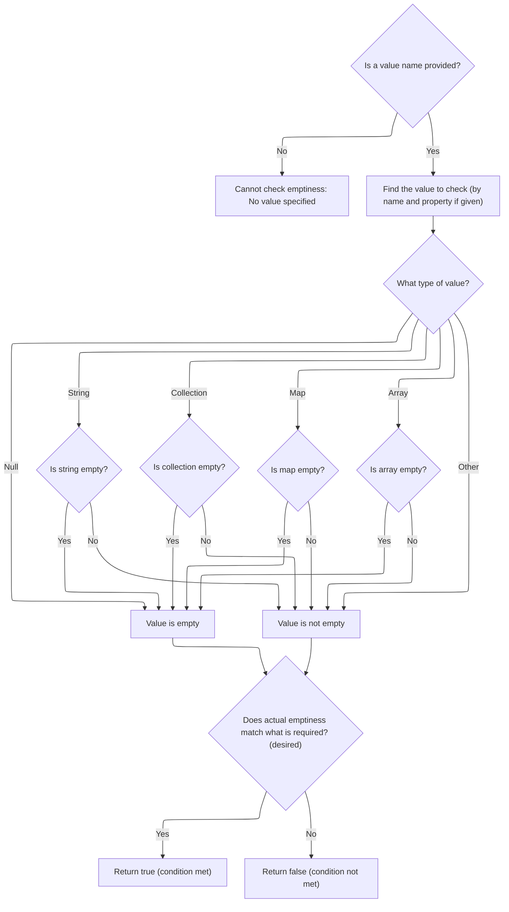

This document explains how the system determines whether an attribute or its property is empty, enabling conditional logic in web pages. The flow receives the name (and optionally property) of an attribute to check, retrieves its value from the appropriate scope, evaluates its emptiness based on type, and returns whether it matches the desired condition.

# Evaluating Emptiness with Scoped Attribute Lookup



<SwmSnippet path="/taglib/src/main/java/org/apache/struts/taglib/logic/EmptyTag.java" line="65">

---

In `EmptyTag.condition`, we start by validating the presence of the 'name' attribute and then decide which lookup method to call based on whether 'property' is set. We call into <SwmToken path="taglib/src/main/java/org/apache/struts/taglib/logic/EmptyTag.java" pos="71:1:1" line-data="            TagUtils.getInstance().saveException(pageContext, e);">`TagUtils`</SwmToken> to fetch the value from the correct scope and property, since that's how we get the actual data to check for emptiness. The rest of the function will use this value to determine if it's empty, matching the 'desired' state.

```java
    protected boolean condition(boolean desired)
        throws JspException {
        if (this.name == null) {
            JspException e =
                new JspException(messages.getMessage("empty.noNameAttribute"));

            TagUtils.getInstance().saveException(pageContext, e);
            throw e;
        }

        Object value = null;

        if (this.property == null) {
            value = TagUtils.getInstance().lookup(pageContext, name, scope);
        } else {
```

---

</SwmSnippet>

<SwmSnippet path="/taglib/src/main/java/org/apache/struts/taglib/TagUtils.java" line="863">

---

<SwmToken path="taglib/src/main/java/org/apache/struts/taglib/TagUtils.java" pos="863:5:5" line-data="    public Object lookup(PageContext pageContext, String name, String scopeName)">`lookup`</SwmToken>`(`<SwmToken path="taglib/src/main/java/org/apache/struts/taglib/TagUtils.java" pos="863:9:9" line-data="    public Object lookup(PageContext pageContext, String name, String scopeName)">`pageContext`</SwmToken>`, `<SwmToken path="taglib/src/main/java/org/apache/struts/taglib/TagUtils.java" pos="863:14:14" line-data="    public Object lookup(PageContext pageContext, String name, String scopeName)">`name`</SwmToken>`, `<SwmToken path="taglib/src/main/java/org/apache/struts/taglib/TagUtils.java" pos="863:19:19" line-data="    public Object lookup(PageContext pageContext, String name, String scopeName)">`scopeName`</SwmToken>`)` fetches an attribute by name from the specified scope, converting the scope string to the right constant. If no scope is given, it searches all scopes. This is how we get the raw value for further checks.

```java
    public Object lookup(PageContext pageContext, String name, String scopeName)
        throws JspException {
        if (scopeName == null) {
            return pageContext.findAttribute(name);
        }

        try {
            return pageContext.getAttribute(name, instance.getScope(scopeName));
        } catch (JspException e) {
            saveException(pageContext, e);
            throw e;
        }
    }
```

---

</SwmSnippet>

<SwmSnippet path="/taglib/src/main/java/org/apache/struts/taglib/logic/EmptyTag.java" line="80">

---

Back in `EmptyTag.condition`, if 'property' is set, we call the other <SwmToken path="taglib/src/main/java/org/apache/struts/taglib/logic/EmptyTag.java" pos="81:1:1" line-data="                TagUtils.getInstance().lookup(pageContext, name, property, scope);">`TagUtils`</SwmToken> lookup method to fetch a property from the bean. This gives us the actual value to check, not just the bean reference.

```java
            value =
                TagUtils.getInstance().lookup(pageContext, name, property, scope);
        }

```

---

</SwmSnippet>

<SwmSnippet path="/taglib/src/main/java/org/apache/struts/taglib/TagUtils.java" line="897">

---

<SwmToken path="taglib/src/main/java/org/apache/struts/taglib/logic/EmptyTag.java" pos="81:7:19" line-data="                TagUtils.getInstance().lookup(pageContext, name, property, scope);">`lookup(pageContext, name, property, scope)`</SwmToken> first fetches the bean, then tries to get the property using reflection. If anything goes wrong—bean or property missing, or access issues—it throws a <SwmToken path="taglib/src/main/java/org/apache/struts/taglib/TagUtils.java" pos="898:8:8" line-data="        String scope) throws JspException {">`JspException`</SwmToken> with a clear message. This is how we get the exact value for the emptiness check.

```java
    public Object lookup(PageContext pageContext, String name, String property,
        String scope) throws JspException {
        // Look up the requested bean, and return if requested
        Object bean = lookup(pageContext, name, scope);

        if (bean == null) {
            JspException e = null;

            if (scope == null) {
                e = new JspException(messages.getMessage("lookup.bean.any", name));
            } else {
                e = new JspException(messages.getMessage("lookup.bean", name,
                            scope));
            }

            saveException(pageContext, e);
            throw e;
        }

        if (property == null) {
            return bean;
        }

        // Locate and return the specified property
        try {
            return PropertyUtils.getProperty(bean, property);
        } catch (IllegalAccessException e) {
            saveException(pageContext, e);
            throw new JspException(messages.getMessage("lookup.access",
                    property, name), e);
        } catch (IllegalArgumentException e) {
            saveException(pageContext, e);
            throw new JspException(messages.getMessage("lookup.argument",
                    property, name), e);
        } catch (InvocationTargetException e) {
            Throwable t = e.getTargetException();

            if (t == null) {
                t = e;
            }

            saveException(pageContext, t);
            throw new JspException(messages.getMessage("lookup.target",
                    property, name), e);
        } catch (NoSuchMethodException e) {
            saveException(pageContext, e);

            String beanName = name;

            // Name defaults to Contants.BEAN_KEY if no name is specified by
            // an input tag. Thus lookup the bean under the key and use
            // its class name for the exception message.
            if (Constants.BEAN_KEY.equals(name)) {
                Object obj = pageContext.findAttribute(Constants.BEAN_KEY);

                if (obj != null) {
                    beanName = obj.getClass().getName();
                }
            }

            throw new JspException(messages.getMessage("lookup.method",
                    property, beanName), e);
        }
    }
```

---

</SwmSnippet>

<SwmSnippet path="/taglib/src/main/java/org/apache/struts/taglib/logic/EmptyTag.java" line="84">

---

After getting the value from <SwmToken path="taglib/src/main/java/org/apache/struts/taglib/logic/EmptyTag.java" pos="71:1:1" line-data="            TagUtils.getInstance().saveException(pageContext, e);">`TagUtils`</SwmToken>, `EmptyTag.condition` checks its type and decides if it's empty: null, empty string, empty collection/map/array are all empty; everything else isn't. The result is compared to 'desired' to decide what to return.

```java
        boolean empty = true;

        if (value == null) {
            empty = true;
        } else if (value instanceof String) {
            String strValue = (String) value;

            empty = (strValue.length() < 1);
        } else if (value instanceof Collection) {
            Collection collValue = (Collection) value;

            empty = collValue.isEmpty();
        } else if (value instanceof Map) {
            Map mapValue = (Map) value;

            empty = mapValue.isEmpty();
        } else if (value.getClass().isArray()) {
            empty = Array.getLength(value) == 0;
        } else {
            empty = false;
        }

        return (empty == desired);
    }
```

---

</SwmSnippet>

&nbsp;

*This is an auto-generated document by Swimm 🌊 and has not yet been verified by a human*

<SwmMeta version="3.0.0" repo-id="Z2l0aHViJTNBJTNBc3RydXRzMSUzQSUzQVN3aW1tLURlbW8=" repo-name="struts1"><sup>Powered by [Swimm](https://app.swimm.io/)</sup></SwmMeta>
