This document explains how the system determines whether a user has any of the roles provided in a comma-separated list. The process checks each role and returns a positive result if the user matches at least one. This enables flexible permission checks for subsequent validation steps.

# Checking User Roles with Comma Support

<SwmSnippet path="/tiles/src/main/java/org/apache/struts/tiles/taglib/InsertTag.java" line="984">

---

<SwmToken path="tiles/src/main/java/org/apache/struts/tiles/taglib/InsertTag.java" pos="984:7:7" line-data="    static public boolean userHasRole(">`userHasRole`</SwmToken> checks if the user has any of the roles listed in a comma-separated string. It splits the string, checks each role with <SwmToken path="tiles/src/main/java/org/apache/struts/tiles/taglib/InsertTag.java" pos="989:4:6" line-data="            if (request.isUserInRole(st.nextToken())) {">`request.isUserInRole`</SwmToken>, and returns true on the first match. This means you can pass multiple roles in one call, not just a single role. Next, we need to call <SwmToken path="core/src/main/java/org/apache/struts/validator/validwhen/ValidWhenLexer.java" pos="1:25:25" line-data="// $ANTLR 2.7.7 (20060906): &quot;ValidWhenParser.g&quot; -&gt; &quot;ValidWhenLexer.java&quot;$">`ValidWhenLexer`</SwmToken> because after checking roles, the flow continues with parsing and validating expressions, which is handled by the lexer.

```java
    static public boolean userHasRole(
        HttpServletRequest request,
        String role) {
        StringTokenizer st = new StringTokenizer(role, ",");
        while (st.hasMoreTokens()) {
            if (request.isUserInRole(st.nextToken())) {
                return true;
            }
        }

        return false;
    }
```

---

</SwmSnippet>

# Tokenizing the Next Input Segment

```mermaid
%%{init: {"flowchart": {"defaultRenderer": "elk"}} }%%
flowchart TD
  node1["Start scanning input"]
  click node1 openCode "core/src/main/java/org/apache/struts/validator/validwhen/ValidWhenLexer.java:75:78"
  subgraph loop1["Scan input for next token"]
    node1 --> node2{"What is the next character?"}
    click node2 openCode "core/src/main/java/org/apache/struts/validator/validwhen/ValidWhenLexer.java:84:159"
    node2 -->|"Whitespace"| node3["Skipping Whitespace"]
    
    node2 -->|"Digit or '-'"| node4["Parsing Numeric Literals"]
    
    node2 -->|"Quote"| node5["Parsing String Literals"]
    
    node2 -->|"Left bracket"| node6[Recognize '[' token]
    
    node2 -->|"Right bracket"| node7["Parsing Right Bracket"]' token]
    
    node2 -->|"Left parenthesis"| node8["Parsing Left Parenthesis"]
    
    node2 -->|"Right parenthesis"| node9["Parsing Right Parenthesis"]
    
    node2 -->|"Asterisk"| node10["Parsing the '*this*' Identifier"]
    
    node2 -->|"Identifier"| node11["Parsing Identifiers"]
    
    node2 -->|"Equals"| node12["Parsing the Equality Operator"]
    
    node2 -->|"Exclamation"| node13["Parsing the Inequality Operator"]
    
    node2 -->|"Less or greater"| node14{"Is it '<=', '>=', '<', or '>'?"}
    click node14 openCode "core/src/main/java/org/apache/struts/validator/validwhen/ValidWhenLexer.java:160:175"
    node14 -->|"'<='"| node15["Parsing the '<=' Operator"]
    
    node14 -->|"'>='"| node16["Parsing the '>=' Operator"]
    
    node14 -->|"'<'"| node17["Parsing Less-Than Operator"]
    
    node14 -->|"'>'"| node18["Parsing Greater-Than Operator"]
    
    node2 -->|"EOF"| node19["Return EOF token"]
    click node19 openCode "core/src/main/java/org/apache/struts/validator/validwhen/ValidWhenLexer.java:177:177"
    node2 -->|"Other"| node20["Error: Unrecognized character"]
    click node20 openCode "core/src/main/java/org/apache/struts/validator/validwhen/ValidWhenLexer.java:178:178"
    node3 --> node21{"Is token to be skipped?"}
    node4 --> node21
    node5 --> node21
    node6 --> node21
    node7 --> node21
    node8 --> node21
    node9 --> node21
    node10 --> node21
    node11 --> node21
    node12 --> node21
    node13 --> node21
    node15 --> node21
    node16 --> node21
    node17 --> node21
    node18 --> node21
    click node21 openCode "core/src/main/java/org/apache/struts/validator/validwhen/ValidWhenLexer.java:181:181"
    node21 -->|"Yes, skip and continue"| node2
    node21 -->|"No, return token"| node22["Adjust and return recognized token"]
    click node22 openCode "core/src/main/java/org/apache/struts/validator/validwhen/ValidWhenLexer.java:182:185"
  end
  node19 --> node22
  node20 --> node23["Return error"]
  click node23 openCode "core/src/main/java/org/apache/struts/validator/validwhen/ValidWhenLexer.java:178:178"

classDef HeadingStyle fill:#777777,stroke:#333,stroke-width:2px;
click node3 goToHeading "Skipping Whitespace"
node3:::HeadingStyle
click node4 goToHeading "Parsing Numeric Literals"
node4:::HeadingStyle
click node5 goToHeading "Parsing String Literals"
node5:::HeadingStyle
click node6 goToHeading "Parsing Left Bracket"
node6:::HeadingStyle
click node7 goToHeading "Parsing Right Bracket"
node7:::HeadingStyle
click node8 goToHeading "Parsing Left Parenthesis"
node8:::HeadingStyle
click node9 goToHeading "Parsing Right Parenthesis"
node9:::HeadingStyle
click node10 goToHeading "Parsing the '*this*' Identifier"
node10:::HeadingStyle
click node11 goToHeading "Parsing Identifiers"
node11:::HeadingStyle
click node12 goToHeading "Parsing the Equality Operator"
node12:::HeadingStyle
click node13 goToHeading "Parsing the Inequality Operator"
node13:::HeadingStyle
click node15 goToHeading "Parsing the '<=' Operator"
node15:::HeadingStyle
click node16 goToHeading "Parsing the '>=' Operator"
node16:::HeadingStyle
click node17 goToHeading "Parsing Less-Than Operator"
node17:::HeadingStyle
click node18 goToHeading "Parsing Greater-Than Operator"
node18:::HeadingStyle

%% Swimm:
%% %%{init: {"flowchart": {"defaultRenderer": "elk"}} }%%
%% flowchart TD
%%   node1["Start scanning input"]
%%   click node1 openCode "<SwmPath>[core/…/validwhen/ValidWhenLexer.java](core/src/main/java/org/apache/struts/validator/validwhen/ValidWhenLexer.java)</SwmPath>:75:78"
%%   subgraph loop1["Scan input for next token"]
%%     node1 --> node2{"What is the next character?"}
%%     click node2 openCode "<SwmPath>[core/…/validwhen/ValidWhenLexer.java](core/src/main/java/org/apache/struts/validator/validwhen/ValidWhenLexer.java)</SwmPath>:84:159"
%%     node2 -->|"Whitespace"| node3["Skipping Whitespace"]
%%     
%%     node2 -->|"Digit or '-'"| node4["Parsing Numeric Literals"]
%%     
%%     node2 -->|"Quote"| node5["Parsing String Literals"]
%%     
%%     node2 -->|"Left bracket"| node6[Recognize '[' token]
%%     
%%     node2 -->|"Right bracket"| node7["Parsing Right Bracket"]' token]
%%     
%%     node2 -->|"Left parenthesis"| node8["Parsing Left Parenthesis"]
%%     
%%     node2 -->|"Right parenthesis"| node9["Parsing Right Parenthesis"]
%%     
%%     node2 -->|"Asterisk"| node10["Parsing the '*this*' Identifier"]
%%     
%%     node2 -->|"Identifier"| node11["Parsing Identifiers"]
%%     
%%     node2 -->|"Equals"| node12["Parsing the Equality Operator"]
%%     
%%     node2 -->|"Exclamation"| node13["Parsing the Inequality Operator"]
%%     
%%     node2 -->|"Less or greater"| node14{"Is it '<=', '>=', '<', or '>'?"}
%%     click node14 openCode "<SwmPath>[core/…/validwhen/ValidWhenLexer.java](core/src/main/java/org/apache/struts/validator/validwhen/ValidWhenLexer.java)</SwmPath>:160:175"
%%     node14 -->|"'<='"| node15["Parsing the '<=' Operator"]
%%     
%%     node14 -->|"'>='"| node16["Parsing the '>=' Operator"]
%%     
%%     node14 -->|"'<'"| node17["Parsing Less-Than Operator"]
%%     
%%     node14 -->|"'>'"| node18["Parsing Greater-Than Operator"]
%%     
%%     node2 -->|"EOF"| node19["Return EOF token"]
%%     click node19 openCode "<SwmPath>[core/…/validwhen/ValidWhenLexer.java](core/src/main/java/org/apache/struts/validator/validwhen/ValidWhenLexer.java)</SwmPath>:177:177"
%%     node2 -->|"Other"| node20["Error: Unrecognized character"]
%%     click node20 openCode "<SwmPath>[core/…/validwhen/ValidWhenLexer.java](core/src/main/java/org/apache/struts/validator/validwhen/ValidWhenLexer.java)</SwmPath>:178:178"
%%     node3 --> node21{"Is token to be skipped?"}
%%     node4 --> node21
%%     node5 --> node21
%%     node6 --> node21
%%     node7 --> node21
%%     node8 --> node21
%%     node9 --> node21
%%     node10 --> node21
%%     node11 --> node21
%%     node12 --> node21
%%     node13 --> node21
%%     node15 --> node21
%%     node16 --> node21
%%     node17 --> node21
%%     node18 --> node21
%%     click node21 openCode "<SwmPath>[core/…/validwhen/ValidWhenLexer.java](core/src/main/java/org/apache/struts/validator/validwhen/ValidWhenLexer.java)</SwmPath>:181:181"
%%     node21 -->|"Yes, skip and continue"| node2
%%     node21 -->|"No, return token"| node22["Adjust and return recognized token"]
%%     click node22 openCode "<SwmPath>[core/…/validwhen/ValidWhenLexer.java](core/src/main/java/org/apache/struts/validator/validwhen/ValidWhenLexer.java)</SwmPath>:182:185"
%%   end
%%   node19 --> node22
%%   node20 --> node23["Return error"]
%%   click node23 openCode "<SwmPath>[core/…/validwhen/ValidWhenLexer.java](core/src/main/java/org/apache/struts/validator/validwhen/ValidWhenLexer.java)</SwmPath>:178:178"
%% 
%% classDef HeadingStyle fill:#777777,stroke:#333,stroke-width:2px;
%% click node3 goToHeading "Skipping Whitespace"
%% node3:::HeadingStyle
%% click node4 goToHeading "Parsing Numeric Literals"
%% node4:::HeadingStyle
%% click node5 goToHeading "Parsing String Literals"
%% node5:::HeadingStyle
%% click node6 goToHeading "Parsing Left Bracket"
%% node6:::HeadingStyle
%% click node7 goToHeading "Parsing Right Bracket"
%% node7:::HeadingStyle
%% click node8 goToHeading "Parsing Left Parenthesis"
%% node8:::HeadingStyle
%% click node9 goToHeading "Parsing Right Parenthesis"
%% node9:::HeadingStyle
%% click node10 goToHeading "Parsing the '*this*' Identifier"
%% node10:::HeadingStyle
%% click node11 goToHeading "Parsing Identifiers"
%% node11:::HeadingStyle
%% click node12 goToHeading "Parsing the Equality Operator"
%% node12:::HeadingStyle
%% click node13 goToHeading "Parsing the Inequality Operator"
%% node13:::HeadingStyle
%% click node15 goToHeading "Parsing the '<=' Operator"
%% node15:::HeadingStyle
%% click node16 goToHeading "Parsing the '>=' Operator"
%% node16:::HeadingStyle
%% click node17 goToHeading "Parsing Less-Than Operator"
%% node17:::HeadingStyle
%% click node18 goToHeading "Parsing Greater-Than Operator"
%% node18:::HeadingStyle
```

<SwmSnippet path="/core/src/main/java/org/apache/struts/validator/validwhen/ValidWhenLexer.java" line="75">

---

In <SwmToken path="core/src/main/java/org/apache/struts/validator/validwhen/ValidWhenLexer.java" pos="75:4:4" line-data="public Token nextToken() throws TokenStreamException {">`nextToken`</SwmToken>, the lexer loops through the input, checking the next character to decide what kind of token to parse (whitespace, number, etc). It branches to the right parsing function based on the character. We need to call the lexer again for each new token, so the flow continues with more token parsing.

```java
public Token nextToken() throws TokenStreamException {
	Token theRetToken=null;
tryAgain:
	for (;;) {
		Token _token = null;
		int _ttype = Token.INVALID_TYPE;
		resetText();
		try {   // for char stream error handling
			try {   // for lexical error handling
				switch ( LA(1)) {
				case '\t':  case '\n':  case '\r':  case ' ':
				{
					mWS(true);
					theRetToken=_returnToken;
					break;
				}
				case '-':  case '0':  case '1':  case '2':
				case '3':  case '4':  case '5':  case '6':
```

---

</SwmSnippet>

## Skipping Whitespace

<SwmSnippet path="/core/src/main/java/org/apache/struts/validator/validwhen/ValidWhenLexer.java" line="202">

---

In <SwmToken path="core/src/main/java/org/apache/struts/validator/validwhen/ValidWhenLexer.java" pos="202:7:7" line-data="	public final void mWS(boolean _createToken) throws RecognitionException, CharStreamException, TokenStreamException {">`mWS`</SwmToken>, the lexer matches and skips over spaces, tabs, newlines, and carriage returns. This keeps the input clean for the next parsing step. After handling whitespace, the flow continues with ActionConfigMatcher to match the next significant token or pattern in the input.

```java
	public final void mWS(boolean _createToken) throws RecognitionException, CharStreamException, TokenStreamException {
		int _ttype; Token _token=null; int _begin=text.length();
		_ttype = WS;
		int _saveIndex;
		
		{
		int _cnt17=0;
		_loop17:
		do {
			switch ( LA(1)) {
			case ' ':
			{
				match(' ');
				break;
			}
			case '\t':
			{
				match('\t');
				break;
			}
			case '\n':
			{
				match('\n');
				break;
			}
			case '\r':
			{
				match('\r');
				break;
			}
			default:
			{
				if ( _cnt17>=1 ) { break _loop17; } else {throw new NoViableAltForCharException((char)LA(1), getFilename(), getLine(), getColumn());}
			}
			}
			_cnt17++;
		} while (true);
		}
```

---

</SwmSnippet>

### Matching Action Configurations

See <SwmLink doc-title="Matching request paths to configuration templates">[Matching request paths to configuration templates](/.swm/matching-request-paths-to-configuration-templates.h6fo7d9u.sw.md)</SwmLink>

### Finalizing Whitespace Handling

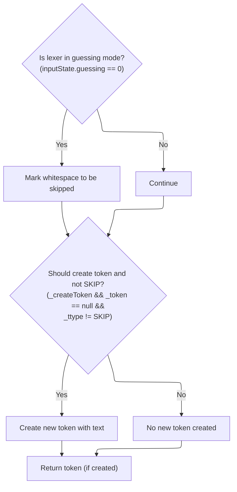

<SwmSnippet path="/core/src/main/java/org/apache/struts/validator/validwhen/ValidWhenLexer.java" line="240">

---

Back in <SwmToken path="core/src/main/java/org/apache/struts/validator/validwhen/ValidWhenLexer.java" pos="87:1:1" line-data="					mWS(true);">`mWS`</SwmToken>, after returning from ActionConfigMatcher, the code sets the token type to SKIP if not in guessing mode, so whitespace is ignored. If a token should be created, it does so, but only for non-skipped types. This keeps the token stream clean for the rest of the lexer.

```java
		if ( inputState.guessing==0 ) {
			_ttype = Token.SKIP;
		}
		if ( _createToken && _token==null && _ttype!=Token.SKIP ) {
			_token = makeToken(_ttype);
			_token.setText(new String(text.getBuffer(), _begin, text.length()-_begin));
		}
		_returnToken = _token;
	}
```

---

</SwmSnippet>

## Processing Numeric Tokens

<SwmSnippet path="/core/src/main/java/org/apache/struts/validator/validwhen/ValidWhenLexer.java" line="93">

---

After returning from <SwmToken path="core/src/main/java/org/apache/struts/validator/validwhen/ValidWhenLexer.java" pos="87:1:1" line-data="					mWS(true);">`mWS`</SwmToken> in <SwmToken path="tiles/src/main/java/org/apache/struts/tiles/taglib/InsertTag.java" pos="989:10:10" line-data="            if (request.isUserInRole(st.nextToken())) {">`nextToken`</SwmToken>, the lexer checks for digits 7-9 to handle decimal literals. It calls <SwmToken path="core/src/main/java/org/apache/struts/validator/validwhen/ValidWhenLexer.java" pos="95:1:1" line-data="					mDECIMAL_LITERAL(true);">`mDECIMAL_LITERAL`</SwmToken> to parse the number, then continues tokenizing the rest of the input for further parsing.

```java
				case '7':  case '8':  case '9':
				{
					mDECIMAL_LITERAL(true);
					theRetToken=_returnToken;
					break;
				}
```

---

</SwmSnippet>

## Parsing Numeric Literals

```mermaid
%%{init: {"flowchart": {"defaultRenderer": "elk"}} }%%
flowchart TD
    node1["Start: Analyze input for number type"]
    click node1 openCode "core/src/main/java/org/apache/struts/validator/validwhen/ValidWhenLexer.java:250:251"
    node1 --> node2{"Floating-point pattern?"}
    click node2 openCode "core/src/main/java/org/apache/struts/validator/validwhen/ValidWhenLexer.java:256:305"
    node2 -->|"Yes"| node3["Recognize as floating-point number"]
    click node3 openCode "core/src/main/java/org/apache/struts/validator/validwhen/ValidWhenLexer.java:306:360"
    subgraph loop1["For each digit in floating-point"]
      node3 --> node11["Consume digit"]
      click node11 openCode "core/src/main/java/org/apache/struts/validator/validwhen/ValidWhenLexer.java:328:356"
      node11 --> node3
    end
    node3 --> node15["Create and return token"]
    click node15 openCode "core/src/main/java/org/apache/struts/validator/validwhen/ValidWhenLexer.java:495:500"
    node2 -->|"No"| node4{"Hexadecimal pattern (0x)?"}
    click node4 openCode "core/src/main/java/org/apache/struts/validator/validwhen/ValidWhenLexer.java:361:413"
    node4 -->|"Yes"| node5["Recognize as hexadecimal number"]
    click node5 openCode "core/src/main/java/org/apache/struts/validator/validwhen/ValidWhenLexer.java:378:412"
    subgraph loop2["For each digit in hexadecimal"]
      node5 --> node12["Consume digit/letter"]
      click node12 openCode "core/src/main/java/org/apache/struts/validator/validwhen/ValidWhenLexer.java:383:406"
      node12 --> node5
    end
    node5 --> node15
    node4 -->|"No"| node6{"Octal pattern (0)?"}
    click node6 openCode "core/src/main/java/org/apache/struts/validator/validwhen/ValidWhenLexer.java:414:450"
    node6 -->|"Yes"| node7["Recognize as octal number"]
    click node7 openCode "core/src/main/java/org/apache/struts/validator/validwhen/ValidWhenLexer.java:430:448"
    subgraph loop3["For each digit in octal"]
      node7 --> node13["Consume digit"]
      click node13 openCode "core/src/main/java/org/apache/struts/validator/validwhen/ValidWhenLexer.java:434:443"
      node13 --> node7
    end
    node7 --> node15
    node6 -->|"No"| node8{"Decimal integer pattern?"}
    click node8 openCode "core/src/main/java/org/apache/struts/validator/validwhen/ValidWhenLexer.java:450:491"
    node8 -->|"Yes"| node9["Recognize as decimal integer"]
    click node9 openCode "core/src/main/java/org/apache/struts/validator/validwhen/ValidWhenLexer.java:453:489"
    subgraph loop4["For each digit in decimal"]
      node9 --> node14["Consume digit"]
      click node14 openCode "core/src/main/java/org/apache/struts/validator/validwhen/ValidWhenLexer.java:475:484"
      node14 --> node9
    end
    node9 --> node15
    node8 -->|"No"| node10["Input is not a valid number"]
    click node10 openCode "core/src/main/java/org/apache/struts/validator/validwhen/ValidWhenLexer.java:492:494"

classDef HeadingStyle fill:#777777,stroke:#333,stroke-width:2px;

%% Swimm:
%% %%{init: {"flowchart": {"defaultRenderer": "elk"}} }%%
%% flowchart TD
%%     node1["Start: Analyze input for number type"]
%%     click node1 openCode "<SwmPath>[core/…/validwhen/ValidWhenLexer.java](core/src/main/java/org/apache/struts/validator/validwhen/ValidWhenLexer.java)</SwmPath>:250:251"
%%     node1 --> node2{"Floating-point pattern?"}
%%     click node2 openCode "<SwmPath>[core/…/validwhen/ValidWhenLexer.java](core/src/main/java/org/apache/struts/validator/validwhen/ValidWhenLexer.java)</SwmPath>:256:305"
%%     node2 -->|"Yes"| node3["Recognize as floating-point number"]
%%     click node3 openCode "<SwmPath>[core/…/validwhen/ValidWhenLexer.java](core/src/main/java/org/apache/struts/validator/validwhen/ValidWhenLexer.java)</SwmPath>:306:360"
%%     subgraph loop1["For each digit in floating-point"]
%%       node3 --> node11["Consume digit"]
%%       click node11 openCode "<SwmPath>[core/…/validwhen/ValidWhenLexer.java](core/src/main/java/org/apache/struts/validator/validwhen/ValidWhenLexer.java)</SwmPath>:328:356"
%%       node11 --> node3
%%     end
%%     node3 --> node15["Create and return token"]
%%     click node15 openCode "<SwmPath>[core/…/validwhen/ValidWhenLexer.java](core/src/main/java/org/apache/struts/validator/validwhen/ValidWhenLexer.java)</SwmPath>:495:500"
%%     node2 -->|"No"| node4{"Hexadecimal pattern (0x)?"}
%%     click node4 openCode "<SwmPath>[core/…/validwhen/ValidWhenLexer.java](core/src/main/java/org/apache/struts/validator/validwhen/ValidWhenLexer.java)</SwmPath>:361:413"
%%     node4 -->|"Yes"| node5["Recognize as hexadecimal number"]
%%     click node5 openCode "<SwmPath>[core/…/validwhen/ValidWhenLexer.java](core/src/main/java/org/apache/struts/validator/validwhen/ValidWhenLexer.java)</SwmPath>:378:412"
%%     subgraph loop2["For each digit in hexadecimal"]
%%       node5 --> node12["Consume digit/letter"]
%%       click node12 openCode "<SwmPath>[core/…/validwhen/ValidWhenLexer.java](core/src/main/java/org/apache/struts/validator/validwhen/ValidWhenLexer.java)</SwmPath>:383:406"
%%       node12 --> node5
%%     end
%%     node5 --> node15
%%     node4 -->|"No"| node6{"Octal pattern (0)?"}
%%     click node6 openCode "<SwmPath>[core/…/validwhen/ValidWhenLexer.java](core/src/main/java/org/apache/struts/validator/validwhen/ValidWhenLexer.java)</SwmPath>:414:450"
%%     node6 -->|"Yes"| node7["Recognize as octal number"]
%%     click node7 openCode "<SwmPath>[core/…/validwhen/ValidWhenLexer.java](core/src/main/java/org/apache/struts/validator/validwhen/ValidWhenLexer.java)</SwmPath>:430:448"
%%     subgraph loop3["For each digit in octal"]
%%       node7 --> node13["Consume digit"]
%%       click node13 openCode "<SwmPath>[core/…/validwhen/ValidWhenLexer.java](core/src/main/java/org/apache/struts/validator/validwhen/ValidWhenLexer.java)</SwmPath>:434:443"
%%       node13 --> node7
%%     end
%%     node7 --> node15
%%     node6 -->|"No"| node8{"Decimal integer pattern?"}
%%     click node8 openCode "<SwmPath>[core/…/validwhen/ValidWhenLexer.java](core/src/main/java/org/apache/struts/validator/validwhen/ValidWhenLexer.java)</SwmPath>:450:491"
%%     node8 -->|"Yes"| node9["Recognize as decimal integer"]
%%     click node9 openCode "<SwmPath>[core/…/validwhen/ValidWhenLexer.java](core/src/main/java/org/apache/struts/validator/validwhen/ValidWhenLexer.java)</SwmPath>:453:489"
%%     subgraph loop4["For each digit in decimal"]
%%       node9 --> node14["Consume digit"]
%%       click node14 openCode "<SwmPath>[core/…/validwhen/ValidWhenLexer.java](core/src/main/java/org/apache/struts/validator/validwhen/ValidWhenLexer.java)</SwmPath>:475:484"
%%       node14 --> node9
%%     end
%%     node9 --> node15
%%     node8 -->|"No"| node10["Input is not a valid number"]
%%     click node10 openCode "<SwmPath>[core/…/validwhen/ValidWhenLexer.java](core/src/main/java/org/apache/struts/validator/validwhen/ValidWhenLexer.java)</SwmPath>:492:494"
%% 
%% classDef HeadingStyle fill:#777777,stroke:#333,stroke-width:2px;
```

<SwmSnippet path="/core/src/main/java/org/apache/struts/validator/validwhen/ValidWhenLexer.java" line="250">

---

In <SwmToken path="core/src/main/java/org/apache/struts/validator/validwhen/ValidWhenLexer.java" pos="250:7:7" line-data="	public final void mDECIMAL_LITERAL(boolean _createToken) throws RecognitionException, CharStreamException, TokenStreamException {">`mDECIMAL_LITERAL`</SwmToken>, the lexer uses lookahead and syntactic predicates to figure out if the input is a decimal, hex, octal, or integer literal. It tries to match each format, rewinding if the guess is wrong, so it can handle all the number formats used in validation rules.

```java
	public final void mDECIMAL_LITERAL(boolean _createToken) throws RecognitionException, CharStreamException, TokenStreamException {
		int _ttype; Token _token=null; int _begin=text.length();
		_ttype = DECIMAL_LITERAL;
		int _saveIndex;
		
		boolean synPredMatched24 = false;
		if (((_tokenSet_0.member(LA(1))) && (_tokenSet_1.member(LA(2))))) {
			int _m24 = mark();
			synPredMatched24 = true;
			inputState.guessing++;
			try {
				{
				{
				switch ( LA(1)) {
				case '-':
				{
					match('-');
					break;
				}
				case '0':  case '1':  case '2':  case '3':
				case '4':  case '5':  case '6':  case '7':
				case '8':  case '9':
				{
					break;
				}
				default:
				{
					throw new NoViableAltForCharException((char)LA(1), getFilename(), getLine(), getColumn());
				}
				}
				}
				{
				int _cnt22=0;
				_loop22:
				do {
					if (((LA(1) >= '0' && LA(1) <= '9'))) {
						matchRange('0','9');
					}
					else {
						if ( _cnt22>=1 ) { break _loop22; } else {throw new NoViableAltForCharException((char)LA(1), getFilename(), getLine(), getColumn());}
					}
					
					_cnt22++;
				} while (true);
```

---

</SwmSnippet>

<SwmSnippet path="/core/src/main/java/org/apache/struts/validator/validwhen/ValidWhenLexer.java" line="296">

---

After confirming a decimal literal with the syntactic predicate, the lexer matches the optional '-', digits, and the decimal point, then collects the digits after the dot. If this doesn't match, it falls back to check for other number formats.

```java
				match('.');
				}
				}
			}
			catch (RecognitionException pe) {
				synPredMatched24 = false;
			}
			rewind(_m24);
inputState.guessing--;
		}
		if ( synPredMatched24 ) {
			{
			{
			switch ( LA(1)) {
			case '-':
			{
				match('-');
				break;
			}
			case '0':  case '1':  case '2':  case '3':
			case '4':  case '5':  case '6':  case '7':
			case '8':  case '9':
			{
				break;
			}
			default:
			{
				throw new NoViableAltForCharException((char)LA(1), getFilename(), getLine(), getColumn());
			}
			}
			}
			{
			int _cnt28=0;
			_loop28:
			do {
				if (((LA(1) >= '0' && LA(1) <= '9'))) {
					matchRange('0','9');
				}
				else {
					if ( _cnt28>=1 ) { break _loop28; } else {throw new NoViableAltForCharException((char)LA(1), getFilename(), getLine(), getColumn());}
				}
				
				_cnt28++;
			} while (true);
```

---

</SwmSnippet>

<SwmSnippet path="/core/src/main/java/org/apache/struts/validator/validwhen/ValidWhenLexer.java" line="342">

---

Here the lexer matches the decimal point and then loops to collect all digits after it. If there are no digits, it throws an error, so only valid decimal numbers are accepted. After this, it checks for other number formats if needed.

```java
			match('.');
			}
			{
			int _cnt31=0;
			_loop31:
			do {
				if (((LA(1) >= '0' && LA(1) <= '9'))) {
					matchRange('0','9');
				}
				else {
					if ( _cnt31>=1 ) { break _loop31; } else {throw new NoViableAltForCharException((char)LA(1), getFilename(), getLine(), getColumn());}
				}
				
				_cnt31++;
			} while (true);
```

---

</SwmSnippet>

<SwmSnippet path="/core/src/main/java/org/apache/struts/validator/validwhen/ValidWhenLexer.java" line="361">

---

After decimals, the lexer uses lookahead to check for '0x' to match hexadecimal literals. If it finds '0x', it matches the prefix and then loops through hex digits. If not, it falls back to check for octal or decimal integers.

```java
			boolean synPredMatched38 = false;
			if (((LA(1)=='0') && (LA(2)=='x'))) {
				int _m38 = mark();
				synPredMatched38 = true;
				inputState.guessing++;
				try {
					{
					match('0');
					match('x');
					}
				}
				catch (RecognitionException pe) {
					synPredMatched38 = false;
				}
				rewind(_m38);
inputState.guessing--;
			}
			if ( synPredMatched38 ) {
				{
				match('0');
				match('x');
				{
				int _cnt41=0;
				_loop41:
				do {
					switch ( LA(1)) {
					case '0':  case '1':  case '2':  case '3':
					case '4':  case '5':  case '6':  case '7':
					case '8':  case '9':
					{
						matchRange('0','9');
						break;
					}
					case 'a':  case 'b':  case 'c':  case 'd':
					case 'e':  case 'f':
					{
						matchRange('a','f');
						break;
					}
					default:
					{
						if ( _cnt41>=1 ) { break _loop41; } else {throw new NoViableAltForCharException((char)LA(1), getFilename(), getLine(), getColumn());}
					}
					}
					_cnt41++;
				} while (true);
```

---

</SwmSnippet>

<SwmSnippet path="/core/src/main/java/org/apache/struts/validator/validwhen/ValidWhenLexer.java" line="409">

---

If the input isn't hex, the lexer checks for a leading '0' to match octal literals. It matches '0' and any following digits 0-7. If that doesn't fit, it tries to match a regular decimal integer next.

```java
				if ( inputState.guessing==0 ) {
					_ttype = HEX_INT_LITERAL;
				}
			}
			else {
				boolean synPredMatched33 = false;
				if (((LA(1)=='0') && (true))) {
					int _m33 = mark();
					synPredMatched33 = true;
					inputState.guessing++;
					try {
						{
						match('0');
						}
					}
					catch (RecognitionException pe) {
						synPredMatched33 = false;
					}
					rewind(_m33);
inputState.guessing--;
				}
				if ( synPredMatched33 ) {
					{
					match('0');
					{
					_loop36:
					do {
						if (((LA(1) >= '0' && LA(1) <= '7'))) {
							matchRange('0','7');
						}
						else {
							break _loop36;
						}
						
					} while (true);
```

---

</SwmSnippet>

<SwmSnippet path="/core/src/main/java/org/apache/struts/validator/validwhen/ValidWhenLexer.java" line="446">

---

After octal, the lexer checks for decimal integers (with optional '-') and matches the digits. If none of the number formats match, it throws an error. After this, the flow continues with ActionConfigMatcher to handle the next pattern in the input.

```java
					if ( inputState.guessing==0 ) {
						_ttype = OCTAL_INT_LITERAL;
					}
				}
				else if ((_tokenSet_2.member(LA(1))) && (true)) {
					{
					{
					switch ( LA(1)) {
					case '-':
					{
						match('-');
						break;
					}
					case '1':  case '2':  case '3':  case '4':
					case '5':  case '6':  case '7':  case '8':
					case '9':
					{
						break;
					}
```

---

</SwmSnippet>

<SwmSnippet path="/core/src/main/java/org/apache/struts/validator/validwhen/ValidWhenLexer.java" line="465">

---

Back in <SwmToken path="core/src/main/java/org/apache/struts/validator/validwhen/ValidWhenLexer.java" pos="95:1:1" line-data="					mDECIMAL_LITERAL(true);">`mDECIMAL_LITERAL`</SwmToken>, after returning from ActionConfigMatcher, the lexer sets the token type to <SwmToken path="core/src/main/java/org/apache/struts/validator/validwhen/ValidWhenLexer.java" pos="488:5:5" line-data="						_ttype = DEC_INT_LITERAL;">`DEC_INT_LITERAL`</SwmToken> if a valid integer was matched, creates the token if needed, and returns it for further parsing.

```java
					default:
					{
						throw new NoViableAltForCharException((char)LA(1), getFilename(), getLine(), getColumn());
					}
					}
					}
					{
					matchRange('1','9');
					}
					{
					_loop46:
					do {
						if (((LA(1) >= '0' && LA(1) <= '9'))) {
							matchRange('0','9');
						}
						else {
							break _loop46;
						}
						
					} while (true);
```

---

</SwmSnippet>

<SwmSnippet path="/core/src/main/java/org/apache/struts/validator/validwhen/ValidWhenLexer.java" line="487">

---

After matching a number, the lexer creates a token of the right type (decimal, hex, octal, or integer), sets its text from the input buffer, and returns it for the parser to use.

```java
					if ( inputState.guessing==0 ) {
						_ttype = DEC_INT_LITERAL;
					}
				}
				else {
					throw new NoViableAltForCharException((char)LA(1), getFilename(), getLine(), getColumn());
				}
				}}
				if ( _createToken && _token==null && _ttype!=Token.SKIP ) {
					_token = makeToken(_ttype);
					_token.setText(new String(text.getBuffer(), _begin, text.length()-_begin));
				}
				_returnToken = _token;
			}
```

---

</SwmSnippet>

## Handling String Literals

<SwmSnippet path="/core/src/main/java/org/apache/struts/validator/validwhen/ValidWhenLexer.java" line="99">

---

After returning from <SwmToken path="core/src/main/java/org/apache/struts/validator/validwhen/ValidWhenLexer.java" pos="95:1:1" line-data="					mDECIMAL_LITERAL(true);">`mDECIMAL_LITERAL`</SwmToken> in <SwmToken path="tiles/src/main/java/org/apache/struts/tiles/taglib/InsertTag.java" pos="989:10:10" line-data="            if (request.isUserInRole(st.nextToken())) {">`nextToken`</SwmToken>, the lexer checks for quote characters to handle string literals. It calls <SwmToken path="core/src/main/java/org/apache/struts/validator/validwhen/ValidWhenLexer.java" pos="101:1:1" line-data="					mSTRING_LITERAL(true);">`mSTRING_LITERAL`</SwmToken> to parse the string, then continues tokenizing the rest of the input.

```java
				case '"':  case '\'':
				{
					mSTRING_LITERAL(true);
					theRetToken=_returnToken;
					break;
				}
```

---

</SwmSnippet>

## Parsing String Literals

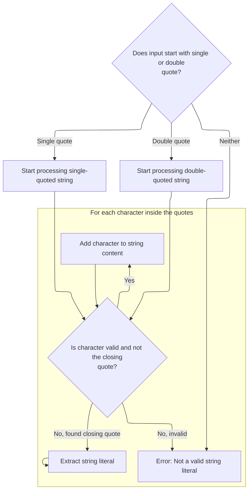

<SwmSnippet path="/core/src/main/java/org/apache/struts/validator/validwhen/ValidWhenLexer.java" line="502">

---

In <SwmToken path="core/src/main/java/org/apache/struts/validator/validwhen/ValidWhenLexer.java" pos="502:7:7" line-data="	public final void mSTRING_LITERAL(boolean _createToken) throws RecognitionException, CharStreamException, TokenStreamException {">`mSTRING_LITERAL`</SwmToken>, the lexer checks for single or double quotes, then loops through the input to match all valid characters inside the quotes (using <SwmToken path="core/src/main/java/org/apache/struts/validator/validwhen/ValidWhenLexer.java" pos="516:5:5" line-data="				if ((_tokenSet_3.member(LA(1)))) {">`_tokenSet_3`</SwmToken> or <SwmToken path="core/src/main/java/org/apache/struts/validator/validwhen/ValidWhenLexer.java" pos="538:5:5" line-data="				if ((_tokenSet_4.member(LA(1)))) {">`_tokenSet_4`</SwmToken>). It ensures at least one character is present and matches the closing quote. If <SwmToken path="core/src/main/java/org/apache/struts/validator/validwhen/ValidWhenLexer.java" pos="502:11:11" line-data="	public final void mSTRING_LITERAL(boolean _createToken) throws RecognitionException, CharStreamException, TokenStreamException {">`_createToken`</SwmToken> is true, it creates the token for the string.

```java
	public final void mSTRING_LITERAL(boolean _createToken) throws RecognitionException, CharStreamException, TokenStreamException {
		int _ttype; Token _token=null; int _begin=text.length();
		_ttype = STRING_LITERAL;
		int _saveIndex;
		
		switch ( LA(1)) {
		case '\'':
		{
			{
			match('\'');
			{
			int _cnt50=0;
			_loop50:
			do {
				if ((_tokenSet_3.member(LA(1)))) {
					matchNot('\'');
				}
				else {
					if ( _cnt50>=1 ) { break _loop50; } else {throw new NoViableAltForCharException((char)LA(1), getFilename(), getLine(), getColumn());}
				}
				
				_cnt50++;
			} while (true);
```

---

</SwmSnippet>

<SwmSnippet path="/core/src/main/java/org/apache/struts/validator/validwhen/ValidWhenLexer.java" line="526">

---

After matching the opening quote and the string content, the lexer matches the closing quote. If it's missing, it throws an error. The logic is similar for both single and double quotes, just using different token sets for allowed characters.

```java
			match('\'');
			}
			break;
		}
		case '"':
		{
			{
			match('\"');
			{
			int _cnt53=0;
			_loop53:
			do {
				if ((_tokenSet_4.member(LA(1)))) {
					matchNot('\"');
				}
				else {
					if ( _cnt53>=1 ) { break _loop53; } else {throw new NoViableAltForCharException((char)LA(1), getFilename(), getLine(), getColumn());}
				}
				
				_cnt53++;
			} while (true);
```

---

</SwmSnippet>

<SwmSnippet path="/core/src/main/java/org/apache/struts/validator/validwhen/ValidWhenLexer.java" line="548">

---

If the input doesn't match a valid quote pattern, the lexer throws an error. After handling strings, the flow continues with ActionConfigMatcher to process the next pattern in the input.

```java
			match('\"');
			}
			break;
		}
		default:
		{
			throw new NoViableAltForCharException((char)LA(1), getFilename(), getLine(), getColumn());
		}
		}
```

---

</SwmSnippet>

<SwmSnippet path="/core/src/main/java/org/apache/struts/validator/validwhen/ValidWhenLexer.java" line="557">

---

Back in <SwmToken path="core/src/main/java/org/apache/struts/validator/validwhen/ValidWhenLexer.java" pos="101:1:1" line-data="					mSTRING_LITERAL(true);">`mSTRING_LITERAL`</SwmToken>, after returning from ActionConfigMatcher, the lexer creates the string token if needed and returns it. If the token type is SKIP, nothing is returned, keeping the token stream clean.

```java
		if ( _createToken && _token==null && _ttype!=Token.SKIP ) {
			_token = makeToken(_ttype);
			_token.setText(new String(text.getBuffer(), _begin, text.length()-_begin));
		}
		_returnToken = _token;
	}
```

---

</SwmSnippet>

## Handling Bracket Tokens

<SwmSnippet path="/core/src/main/java/org/apache/struts/validator/validwhen/ValidWhenLexer.java" line="105">

---

After returning from <SwmToken path="core/src/main/java/org/apache/struts/validator/validwhen/ValidWhenLexer.java" pos="101:1:1" line-data="					mSTRING_LITERAL(true);">`mSTRING_LITERAL`</SwmToken> in <SwmToken path="tiles/src/main/java/org/apache/struts/tiles/taglib/InsertTag.java" pos="989:10:10" line-data="            if (request.isUserInRole(st.nextToken())) {">`nextToken`</SwmToken>, the lexer checks for '\[' to handle left brackets. It calls <SwmToken path="core/src/main/java/org/apache/struts/validator/validwhen/ValidWhenLexer.java" pos="107:1:1" line-data="					mLBRACKET(true);">`mLBRACKET`</SwmToken> to parse it, then continues with the next token in the input.

```java
				case '[':
				{
					mLBRACKET(true);
					theRetToken=_returnToken;
					break;
				}
```

---

</SwmSnippet>

## Parsing Left Bracket

```mermaid
%%{init: {"flowchart": {"defaultRenderer": "elk"}} }%%
flowchart TD
  node1[Recognize left bracket '[' in input]
  click node1 openCode "core/src/main/java/org/apache/struts/validator/validwhen/ValidWhenLexer.java:569:569"
  node1 --> node2{"Should create token for '['?
(_createToken, token not yet created,
not skipping)"}
  click node2 openCode "core/src/main/java/org/apache/struts/validator/validwhen/ValidWhenLexer.java:570:570"
  node2 -->|"Yes"| node3["Create token for left bracket and assign
text"]
  click node3 openCode "core/src/main/java/org/apache/struts/validator/validwhen/ValidWhenLexer.java:571:572"
  node2 -->|"No"| node4["Continue without creating a token"]
  click node4 openCode "core/src/main/java/org/apache/struts/validator/validwhen/ValidWhenLexer.java:573:573"
  node3 --> node5["Set return value to token"]
  node4 --> node5["Set return value to token"]
  click node5 openCode "core/src/main/java/org/apache/struts/validator/validwhen/ValidWhenLexer.java:574:574"

classDef HeadingStyle fill:#777777,stroke:#333,stroke-width:2px;

%% Swimm:
%% %%{init: {"flowchart": {"defaultRenderer": "elk"}} }%%
%% flowchart TD
%%   node1[Recognize left bracket '[' in input]
%%   click node1 openCode "<SwmPath>[core/…/validwhen/ValidWhenLexer.java](core/src/main/java/org/apache/struts/validator/validwhen/ValidWhenLexer.java)</SwmPath>:569:569"
%%   node1 --> node2{"Should create token for '['?
%% (<SwmToken path="core/src/main/java/org/apache/struts/validator/validwhen/ValidWhenLexer.java" pos="202:11:11" line-data="	public final void mWS(boolean _createToken) throws RecognitionException, CharStreamException, TokenStreamException {">`_createToken`</SwmToken>, token not yet created,
%% not skipping)"}
%%   click node2 openCode "<SwmPath>[core/…/validwhen/ValidWhenLexer.java](core/src/main/java/org/apache/struts/validator/validwhen/ValidWhenLexer.java)</SwmPath>:570:570"
%%   node2 -->|"Yes"| node3["Create token for left bracket and assign
%% text"]
%%   click node3 openCode "<SwmPath>[core/…/validwhen/ValidWhenLexer.java](core/src/main/java/org/apache/struts/validator/validwhen/ValidWhenLexer.java)</SwmPath>:571:572"
%%   node2 -->|"No"| node4["Continue without creating a token"]
%%   click node4 openCode "<SwmPath>[core/…/validwhen/ValidWhenLexer.java](core/src/main/java/org/apache/struts/validator/validwhen/ValidWhenLexer.java)</SwmPath>:573:573"
%%   node3 --> node5["Set return value to token"]
%%   node4 --> node5["Set return value to token"]
%%   click node5 openCode "<SwmPath>[core/…/validwhen/ValidWhenLexer.java](core/src/main/java/org/apache/struts/validator/validwhen/ValidWhenLexer.java)</SwmPath>:574:574"
%% 
%% classDef HeadingStyle fill:#777777,stroke:#333,stroke-width:2px;
```

<SwmSnippet path="/core/src/main/java/org/apache/struts/validator/validwhen/ValidWhenLexer.java" line="564">

---

In <SwmToken path="core/src/main/java/org/apache/struts/validator/validwhen/ValidWhenLexer.java" pos="564:7:7" line-data="	public final void mLBRACKET(boolean _createToken) throws RecognitionException, CharStreamException, TokenStreamException {">`mLBRACKET`</SwmToken>, the lexer matches the '\[' character and sets up the token. After this, the flow continues with ActionConfigMatcher to process the next pattern in the input.

```java
	public final void mLBRACKET(boolean _createToken) throws RecognitionException, CharStreamException, TokenStreamException {
		int _ttype; Token _token=null; int _begin=text.length();
		_ttype = LBRACKET;
		int _saveIndex;
		
		match('[');
```

---

</SwmSnippet>

<SwmSnippet path="/core/src/main/java/org/apache/struts/validator/validwhen/ValidWhenLexer.java" line="570">

---

Back in <SwmToken path="core/src/main/java/org/apache/struts/validator/validwhen/ValidWhenLexer.java" pos="107:1:1" line-data="					mLBRACKET(true);">`mLBRACKET`</SwmToken>, after returning from ActionConfigMatcher, the lexer creates the left bracket token if needed and returns it. If the token type is SKIP, nothing is returned.

```java
		if ( _createToken && _token==null && _ttype!=Token.SKIP ) {
			_token = makeToken(_ttype);
			_token.setText(new String(text.getBuffer(), _begin, text.length()-_begin));
		}
		_returnToken = _token;
	}
```

---

</SwmSnippet>

## Handling Right Bracket Tokens

<SwmSnippet path="/core/src/main/java/org/apache/struts/validator/validwhen/ValidWhenLexer.java" line="111">

---

After returning from <SwmToken path="core/src/main/java/org/apache/struts/validator/validwhen/ValidWhenLexer.java" pos="107:1:1" line-data="					mLBRACKET(true);">`mLBRACKET`</SwmToken> in <SwmToken path="tiles/src/main/java/org/apache/struts/tiles/taglib/InsertTag.java" pos="989:10:10" line-data="            if (request.isUserInRole(st.nextToken())) {">`nextToken`</SwmToken>, the lexer checks for '\]' to handle right brackets. It calls <SwmToken path="core/src/main/java/org/apache/struts/validator/validwhen/ValidWhenLexer.java" pos="113:1:1" line-data="					mRBRACKET(true);">`mRBRACKET`</SwmToken> to parse it, then continues with the next token in the input.

```java
				case ']':
				{
					mRBRACKET(true);
					theRetToken=_returnToken;
					break;
				}
```

---

</SwmSnippet>

## Parsing Right Bracket

```mermaid
%%{init: {"flowchart": {"defaultRenderer": "elk"}} }%%
flowchart TD
    node1["Recognize right bracket ('"]')] --> node2{"Create token? (_createToken and not
skipping)"}
    click node1 openCode "core/src/main/java/org/apache/struts/validator/validwhen/ValidWhenLexer.java:582:582"
    node2 -->|"Yes"| node3["Create right bracket token (type:
RBRACKET)"]
    click node2 openCode "core/src/main/java/org/apache/struts/validator/validwhen/ValidWhenLexer.java:583:586"
    node2 -->|"No"| node4["No token created"]
    click node4 openCode "core/src/main/java/org/apache/struts/validator/validwhen/ValidWhenLexer.java:583:586"
    node3 --> node5["Return token (may be right bracket)"]
    click node3 openCode "core/src/main/java/org/apache/struts/validator/validwhen/ValidWhenLexer.java:583:586"
    node4 --> node5["Return token (null)"]
    click node5 openCode "core/src/main/java/org/apache/struts/validator/validwhen/ValidWhenLexer.java:587:588"

classDef HeadingStyle fill:#777777,stroke:#333,stroke-width:2px;

%% Swimm:
%% %%{init: {"flowchart": {"defaultRenderer": "elk"}} }%%
%% flowchart TD
%%     node1["Recognize right bracket ('"]')] --> node2{"Create token? (<SwmToken path="core/src/main/java/org/apache/struts/validator/validwhen/ValidWhenLexer.java" pos="202:11:11" line-data="	public final void mWS(boolean _createToken) throws RecognitionException, CharStreamException, TokenStreamException {">`_createToken`</SwmToken> and not
%% skipping)"}
%%     click node1 openCode "<SwmPath>[core/…/validwhen/ValidWhenLexer.java](core/src/main/java/org/apache/struts/validator/validwhen/ValidWhenLexer.java)</SwmPath>:582:582"
%%     node2 -->|"Yes"| node3["Create right bracket token (type:
%% RBRACKET)"]
%%     click node2 openCode "<SwmPath>[core/…/validwhen/ValidWhenLexer.java](core/src/main/java/org/apache/struts/validator/validwhen/ValidWhenLexer.java)</SwmPath>:583:586"
%%     node2 -->|"No"| node4["No token created"]
%%     click node4 openCode "<SwmPath>[core/…/validwhen/ValidWhenLexer.java](core/src/main/java/org/apache/struts/validator/validwhen/ValidWhenLexer.java)</SwmPath>:583:586"
%%     node3 --> node5["Return token (may be right bracket)"]
%%     click node3 openCode "<SwmPath>[core/…/validwhen/ValidWhenLexer.java](core/src/main/java/org/apache/struts/validator/validwhen/ValidWhenLexer.java)</SwmPath>:583:586"
%%     node4 --> node5["Return token (null)"]
%%     click node5 openCode "<SwmPath>[core/…/validwhen/ValidWhenLexer.java](core/src/main/java/org/apache/struts/validator/validwhen/ValidWhenLexer.java)</SwmPath>:587:588"
%% 
%% classDef HeadingStyle fill:#777777,stroke:#333,stroke-width:2px;
```

<SwmSnippet path="/core/src/main/java/org/apache/struts/validator/validwhen/ValidWhenLexer.java" line="577">

---

In <SwmToken path="core/src/main/java/org/apache/struts/validator/validwhen/ValidWhenLexer.java" pos="577:7:7" line-data="	public final void mRBRACKET(boolean _createToken) throws RecognitionException, CharStreamException, TokenStreamException {">`mRBRACKET`</SwmToken>, the lexer matches the '\]' character and sets up the token. After this, the flow continues with ActionConfigMatcher to process the next pattern in the input.

```java
	public final void mRBRACKET(boolean _createToken) throws RecognitionException, CharStreamException, TokenStreamException {
		int _ttype; Token _token=null; int _begin=text.length();
		_ttype = RBRACKET;
		int _saveIndex;
		
		match(']');
```

---

</SwmSnippet>

<SwmSnippet path="/core/src/main/java/org/apache/struts/validator/validwhen/ValidWhenLexer.java" line="583">

---

Back in <SwmToken path="core/src/main/java/org/apache/struts/validator/validwhen/ValidWhenLexer.java" pos="113:1:1" line-data="					mRBRACKET(true);">`mRBRACKET`</SwmToken>, after returning from ActionConfigMatcher, the lexer creates the right bracket token if needed and returns it. If the token type is SKIP, nothing is returned.

```java
		if ( _createToken && _token==null && _ttype!=Token.SKIP ) {
			_token = makeToken(_ttype);
			_token.setText(new String(text.getBuffer(), _begin, text.length()-_begin));
		}
		_returnToken = _token;
	}
```

---

</SwmSnippet>

## Handling Parenthesis Tokens

<SwmSnippet path="/core/src/main/java/org/apache/struts/validator/validwhen/ValidWhenLexer.java" line="117">

---

After returning from <SwmToken path="core/src/main/java/org/apache/struts/validator/validwhen/ValidWhenLexer.java" pos="113:1:1" line-data="					mRBRACKET(true);">`mRBRACKET`</SwmToken> in <SwmToken path="tiles/src/main/java/org/apache/struts/tiles/taglib/InsertTag.java" pos="989:10:10" line-data="            if (request.isUserInRole(st.nextToken())) {">`nextToken`</SwmToken>, the lexer checks for '(' to handle left parentheses. It calls <SwmToken path="core/src/main/java/org/apache/struts/validator/validwhen/ValidWhenLexer.java" pos="119:1:1" line-data="					mLPAREN(true);">`mLPAREN`</SwmToken> to parse it, then continues with the next token in the input.

```java
				case '(':
				{
					mLPAREN(true);
					theRetToken=_returnToken;
					break;
				}
```

---

</SwmSnippet>

## Parsing Left Parenthesis

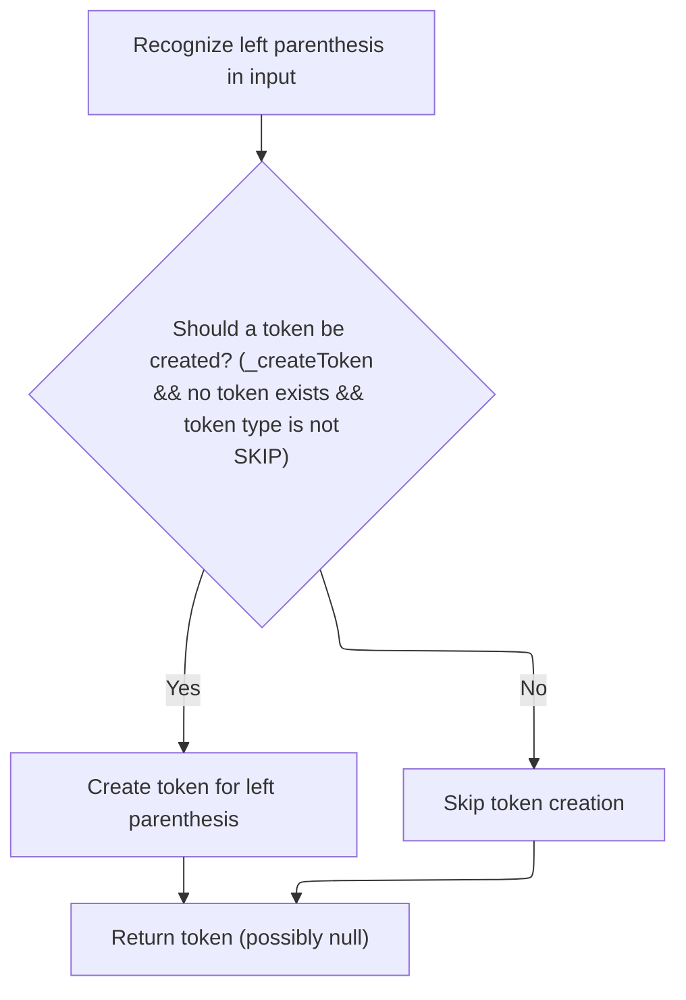

<SwmSnippet path="/core/src/main/java/org/apache/struts/validator/validwhen/ValidWhenLexer.java" line="590">

---

In <SwmToken path="core/src/main/java/org/apache/struts/validator/validwhen/ValidWhenLexer.java" pos="590:7:7" line-data="	public final void mLPAREN(boolean _createToken) throws RecognitionException, CharStreamException, TokenStreamException {">`mLPAREN`</SwmToken>, the lexer matches the '(' character and sets up the token. After this, it hands off to ActionConfigMatcher to see if this parenthesis is part of a bigger pattern that needs to be handled.

```java
	public final void mLPAREN(boolean _createToken) throws RecognitionException, CharStreamException, TokenStreamException {
		int _ttype; Token _token=null; int _begin=text.length();
		_ttype = LPAREN;
		int _saveIndex;
		
		match('(');
```

---

</SwmSnippet>

<SwmSnippet path="/core/src/main/java/org/apache/struts/validator/validwhen/ValidWhenLexer.java" line="596">

---

Back in <SwmToken path="core/src/main/java/org/apache/struts/validator/validwhen/ValidWhenLexer.java" pos="119:1:1" line-data="					mLPAREN(true);">`mLPAREN`</SwmToken>, after returning from ActionConfigMatcher, the lexer creates the left parenthesis token if needed and returns it. If the token type is SKIP, nothing is returned.

```java
		if ( _createToken && _token==null && _ttype!=Token.SKIP ) {
			_token = makeToken(_ttype);
			_token.setText(new String(text.getBuffer(), _begin, text.length()-_begin));
		}
		_returnToken = _token;
	}
```

---

</SwmSnippet>

## Handling Right Parenthesis

<SwmSnippet path="/core/src/main/java/org/apache/struts/validator/validwhen/ValidWhenLexer.java" line="123">

---

Next, in <SwmToken path="tiles/src/main/java/org/apache/struts/tiles/taglib/InsertTag.java" pos="989:10:10" line-data="            if (request.isUserInRole(st.nextToken())) {">`nextToken`</SwmToken>, after handling a left parenthesis, the lexer checks for a right parenthesis and calls <SwmToken path="core/src/main/java/org/apache/struts/validator/validwhen/ValidWhenLexer.java" pos="125:1:1" line-data="					mRPAREN(true);">`mRPAREN`</SwmToken> if it finds one. This keeps the token stream in sync with the input structure.

```java
				case ')':
				{
					mRPAREN(true);
					theRetToken=_returnToken;
					break;
				}
```

---

</SwmSnippet>

## Parsing Right Parenthesis

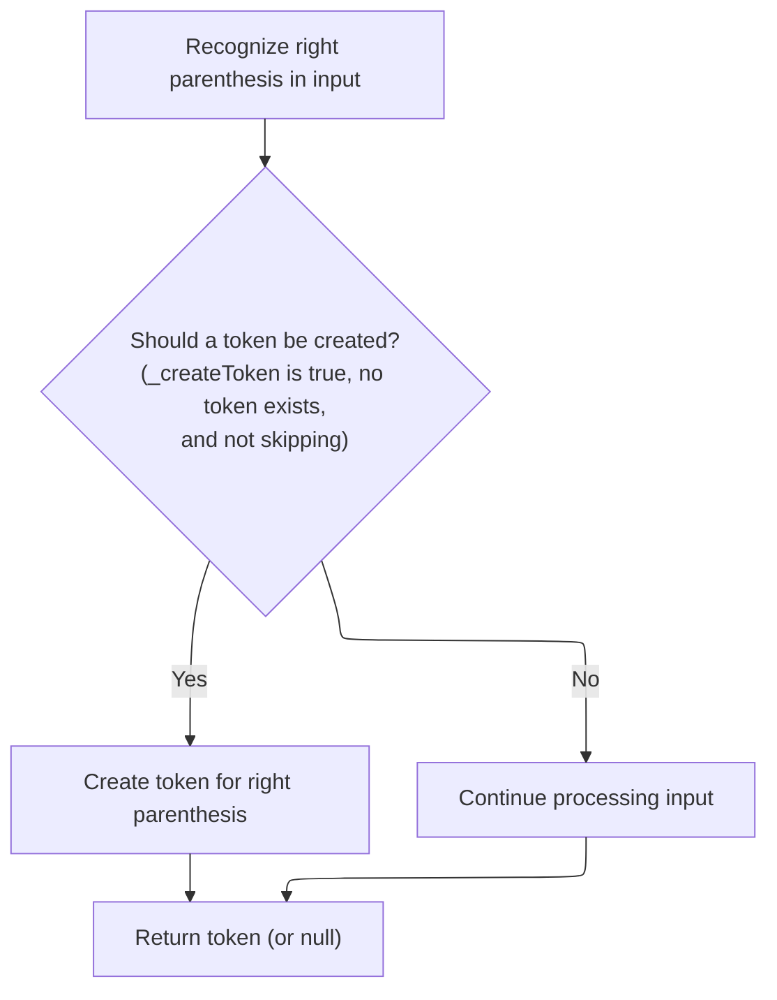

<SwmSnippet path="/core/src/main/java/org/apache/struts/validator/validwhen/ValidWhenLexer.java" line="603">

---

In <SwmToken path="core/src/main/java/org/apache/struts/validator/validwhen/ValidWhenLexer.java" pos="603:7:7" line-data="	public final void mRPAREN(boolean _createToken) throws RecognitionException, CharStreamException, TokenStreamException {">`mRPAREN`</SwmToken>, the lexer matches the ')' character and sets up the token. After this, it calls ActionConfigMatcher to see if this parenthesis is part of a more complex pattern.

```java
	public final void mRPAREN(boolean _createToken) throws RecognitionException, CharStreamException, TokenStreamException {
		int _ttype; Token _token=null; int _begin=text.length();
		_ttype = RPAREN;
		int _saveIndex;
		
		match(')');
```

---

</SwmSnippet>

<SwmSnippet path="/core/src/main/java/org/apache/struts/validator/validwhen/ValidWhenLexer.java" line="609">

---

Back in <SwmToken path="core/src/main/java/org/apache/struts/validator/validwhen/ValidWhenLexer.java" pos="125:1:1" line-data="					mRPAREN(true);">`mRPAREN`</SwmToken>, after returning from ActionConfigMatcher, the lexer creates the right parenthesis token if needed and returns it. If the token type is SKIP, nothing is returned.

```java
		if ( _createToken && _token==null && _ttype!=Token.SKIP ) {
			_token = makeToken(_ttype);
			_token.setText(new String(text.getBuffer(), _begin, text.length()-_begin));
		}
		_returnToken = _token;
	}
```

---

</SwmSnippet>

## Handling Special Identifiers

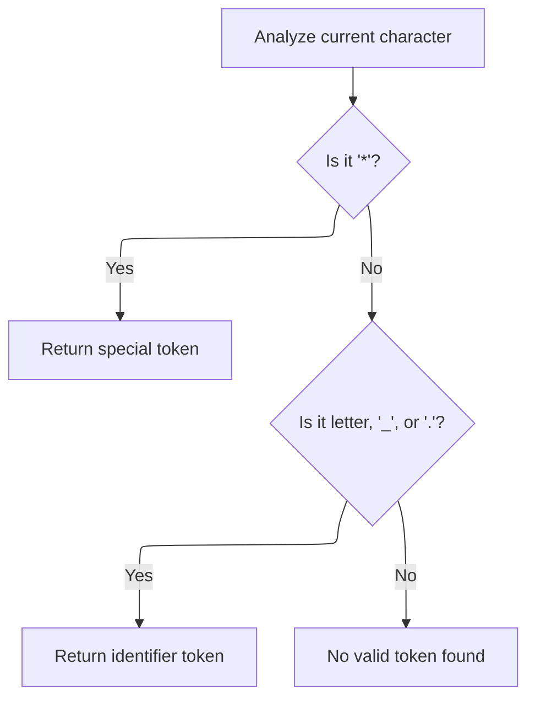

<SwmSnippet path="/core/src/main/java/org/apache/struts/validator/validwhen/ValidWhenLexer.java" line="129">

---

Next, in <SwmToken path="tiles/src/main/java/org/apache/struts/tiles/taglib/InsertTag.java" pos="989:10:10" line-data="            if (request.isUserInRole(st.nextToken())) {">`nextToken`</SwmToken>, after handling parentheses, the lexer checks for '\*' and calls <SwmToken path="core/src/main/java/org/apache/struts/validator/validwhen/ValidWhenLexer.java" pos="131:1:1" line-data="					mTHIS(true);">`mTHIS`</SwmToken> if it finds one. This is used to handle the special '*this*' identifier in the input.

```java
				case '*':
				{
					mTHIS(true);
					theRetToken=_returnToken;
					break;
				}
				case '.':  case '_':  case 'a':  case 'b':
				case 'c':  case 'd':  case 'e':  case 'f':
				case 'g':  case 'h':  case 'i':  case 'j':
				case 'k':  case 'l':  case 'm':  case 'n':
				case 'o':  case 'p':  case 'q':  case 'r':
				case 's':  case 't':  case 'u':  case 'v':
```

---

</SwmSnippet>

## Parsing the '*this*' Identifier

<SwmSnippet path="/core/src/main/java/org/apache/struts/validator/validwhen/ValidWhenLexer.java" line="616">

---

In <SwmToken path="core/src/main/java/org/apache/struts/validator/validwhen/ValidWhenLexer.java" pos="616:7:7" line-data="	public final void mTHIS(boolean _createToken) throws RecognitionException, CharStreamException, TokenStreamException {">`mTHIS`</SwmToken>, the lexer matches the literal '*this*' and sets up the token. After this, it calls ActionConfigMatcher to check if this identifier is part of a more complex rule.

```java
	public final void mTHIS(boolean _createToken) throws RecognitionException, CharStreamException, TokenStreamException {
		int _ttype; Token _token=null; int _begin=text.length();
		_ttype = THIS;
		int _saveIndex;
		
		match("*this*");
```

---

</SwmSnippet>

<SwmSnippet path="/core/src/main/java/org/apache/struts/validator/validwhen/ValidWhenLexer.java" line="622">

---

Back in <SwmToken path="core/src/main/java/org/apache/struts/validator/validwhen/ValidWhenLexer.java" pos="131:1:1" line-data="					mTHIS(true);">`mTHIS`</SwmToken>, after returning from ActionConfigMatcher, the lexer creates the '*this*' token if needed and returns it. If the token type is SKIP, nothing is returned.

```java
		if ( _createToken && _token==null && _ttype!=Token.SKIP ) {
			_token = makeToken(_ttype);
			_token.setText(new String(text.getBuffer(), _begin, text.length()-_begin));
		}
		_returnToken = _token;
	}
```

---

</SwmSnippet>

## Handling Identifiers

<SwmSnippet path="/core/src/main/java/org/apache/struts/validator/validwhen/ValidWhenLexer.java" line="141">

---

Next, in <SwmToken path="tiles/src/main/java/org/apache/struts/tiles/taglib/InsertTag.java" pos="989:10:10" line-data="            if (request.isUserInRole(st.nextToken())) {">`nextToken`</SwmToken>, after handling '*this*', the lexer checks for alphabetic characters and calls <SwmToken path="core/src/main/java/org/apache/struts/validator/validwhen/ValidWhenLexer.java" pos="143:1:1" line-data="					mIDENTIFIER(true);">`mIDENTIFIER`</SwmToken> to parse regular identifiers in the input.

```java
				case 'w':  case 'x':  case 'y':  case 'z':
				{
					mIDENTIFIER(true);
					theRetToken=_returnToken;
					break;
				}
```

---

</SwmSnippet>

## Parsing Identifiers

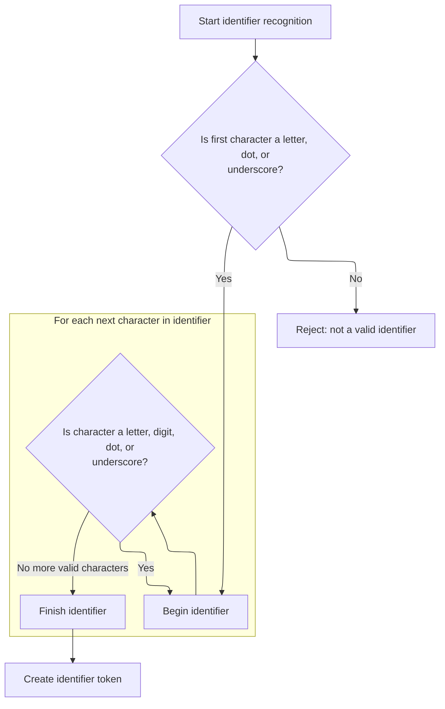

<SwmSnippet path="/core/src/main/java/org/apache/struts/validator/validwhen/ValidWhenLexer.java" line="629">

---

In <SwmToken path="core/src/main/java/org/apache/struts/validator/validwhen/ValidWhenLexer.java" pos="629:7:7" line-data="	public final void mIDENTIFIER(boolean _createToken) throws RecognitionException, CharStreamException, TokenStreamException {">`mIDENTIFIER`</SwmToken>, the lexer matches identifiers that start with a letter, dot, or underscore, and can include letters, digits, dots, and underscores. After matching, it calls ActionConfigMatcher to check if the identifier is part of a more complex rule.

```java
	public final void mIDENTIFIER(boolean _createToken) throws RecognitionException, CharStreamException, TokenStreamException {
		int _ttype; Token _token=null; int _begin=text.length();
		_ttype = IDENTIFIER;
		int _saveIndex;
		
		{
		switch ( LA(1)) {
		case 'a':  case 'b':  case 'c':  case 'd':
		case 'e':  case 'f':  case 'g':  case 'h':
		case 'i':  case 'j':  case 'k':  case 'l':
		case 'm':  case 'n':  case 'o':  case 'p':
		case 'q':  case 'r':  case 's':  case 't':
		case 'u':  case 'v':  case 'w':  case 'x':
		case 'y':  case 'z':
		{
			matchRange('a','z');
			break;
		}
		case '.':
		{
			match('.');
			break;
		}
		case '_':
		{
			match('_');
			break;
		}
		default:
		{
			throw new NoViableAltForCharException((char)LA(1), getFilename(), getLine(), getColumn());
		}
		}
		}
		{
		int _cnt62=0;
		_loop62:
		do {
			switch ( LA(1)) {
			case 'a':  case 'b':  case 'c':  case 'd':
			case 'e':  case 'f':  case 'g':  case 'h':
			case 'i':  case 'j':  case 'k':  case 'l':
			case 'm':  case 'n':  case 'o':  case 'p':
			case 'q':  case 'r':  case 's':  case 't':
			case 'u':  case 'v':  case 'w':  case 'x':
			case 'y':  case 'z':
			{
				matchRange('a','z');
				break;
			}
			case '0':  case '1':  case '2':  case '3':
			case '4':  case '5':  case '6':  case '7':
			case '8':  case '9':
			{
				matchRange('0','9');
				break;
			}
			case '.':
			{
				match('.');
				break;
			}
			case '_':
			{
				match('_');
				break;
			}
			default:
			{
				if ( _cnt62>=1 ) { break _loop62; } else {throw new NoViableAltForCharException((char)LA(1), getFilename(), getLine(), getColumn());}
			}
			}
			_cnt62++;
		} while (true);
		}
```

---

</SwmSnippet>

<SwmSnippet path="/core/src/main/java/org/apache/struts/validator/validwhen/ValidWhenLexer.java" line="704">

---

Back in <SwmToken path="core/src/main/java/org/apache/struts/validator/validwhen/ValidWhenLexer.java" pos="143:1:1" line-data="					mIDENTIFIER(true);">`mIDENTIFIER`</SwmToken>, after returning from ActionConfigMatcher, the lexer creates the identifier token if needed and returns it. If the token type is SKIP, nothing is returned.

```java
		if ( _createToken && _token==null && _ttype!=Token.SKIP ) {
			_token = makeToken(_ttype);
			_token.setText(new String(text.getBuffer(), _begin, text.length()-_begin));
		}
		_returnToken = _token;
	}
```

---

</SwmSnippet>

## Handling Equality Operators

<SwmSnippet path="/core/src/main/java/org/apache/struts/validator/validwhen/ValidWhenLexer.java" line="147">

---

Next, in <SwmToken path="tiles/src/main/java/org/apache/struts/tiles/taglib/InsertTag.java" pos="989:10:10" line-data="            if (request.isUserInRole(st.nextToken())) {">`nextToken`</SwmToken>, after handling identifiers, the lexer checks for '=' and calls <SwmToken path="core/src/main/java/org/apache/struts/validator/validwhen/ValidWhenLexer.java" pos="149:1:1" line-data="					mEQUALSIGN(true);">`mEQUALSIGN`</SwmToken> if it finds one. This is used to handle the equality operator '==' in the input.

```java
				case '=':
				{
					mEQUALSIGN(true);
					theRetToken=_returnToken;
					break;
				}
```

---

</SwmSnippet>

## Parsing the Equality Operator

<SwmSnippet path="/core/src/main/java/org/apache/struts/validator/validwhen/ValidWhenLexer.java" line="711">

---

In <SwmToken path="core/src/main/java/org/apache/struts/validator/validwhen/ValidWhenLexer.java" pos="711:7:7" line-data="	public final void mEQUALSIGN(boolean _createToken) throws RecognitionException, CharStreamException, TokenStreamException {">`mEQUALSIGN`</SwmToken>, the lexer matches two '=' characters to recognize the equality operator. After matching, it calls ActionConfigMatcher to check if this operator is part of a more complex rule.

```java
	public final void mEQUALSIGN(boolean _createToken) throws RecognitionException, CharStreamException, TokenStreamException {
		int _ttype; Token _token=null; int _begin=text.length();
		_ttype = EQUALSIGN;
		int _saveIndex;
		
		match('=');
		match('=');
```

---

</SwmSnippet>

<SwmSnippet path="/core/src/main/java/org/apache/struts/validator/validwhen/ValidWhenLexer.java" line="718">

---

Back in <SwmToken path="core/src/main/java/org/apache/struts/validator/validwhen/ValidWhenLexer.java" pos="149:1:1" line-data="					mEQUALSIGN(true);">`mEQUALSIGN`</SwmToken>, after returning from ActionConfigMatcher, the lexer creates the equality operator token if needed and returns it. If the token type is SKIP, nothing is returned.

```java
		if ( _createToken && _token==null && _ttype!=Token.SKIP ) {
			_token = makeToken(_ttype);
			_token.setText(new String(text.getBuffer(), _begin, text.length()-_begin));
		}
		_returnToken = _token;
	}
```

---

</SwmSnippet>

## Handling Inequality Operators

<SwmSnippet path="/core/src/main/java/org/apache/struts/validator/validwhen/ValidWhenLexer.java" line="153">

---

Next, in <SwmToken path="tiles/src/main/java/org/apache/struts/tiles/taglib/InsertTag.java" pos="989:10:10" line-data="            if (request.isUserInRole(st.nextToken())) {">`nextToken`</SwmToken>, after handling '==', the lexer checks for '!' and calls <SwmToken path="core/src/main/java/org/apache/struts/validator/validwhen/ValidWhenLexer.java" pos="155:1:1" line-data="					mNOTEQUALSIGN(true);">`mNOTEQUALSIGN`</SwmToken> if it finds one. This is used to handle the inequality operator '!=' in the input.

```java
				case '!':
				{
					mNOTEQUALSIGN(true);
					theRetToken=_returnToken;
					break;
				}
```

---

</SwmSnippet>

## Parsing the Inequality Operator

<SwmSnippet path="/core/src/main/java/org/apache/struts/validator/validwhen/ValidWhenLexer.java" line="725">

---

In <SwmToken path="core/src/main/java/org/apache/struts/validator/validwhen/ValidWhenLexer.java" pos="725:7:7" line-data="	public final void mNOTEQUALSIGN(boolean _createToken) throws RecognitionException, CharStreamException, TokenStreamException {">`mNOTEQUALSIGN`</SwmToken>, the lexer matches '!' followed by '=' to recognize the inequality operator. After matching, it calls ActionConfigMatcher to check if this operator is part of a more complex rule.

```java
	public final void mNOTEQUALSIGN(boolean _createToken) throws RecognitionException, CharStreamException, TokenStreamException {
		int _ttype; Token _token=null; int _begin=text.length();
		_ttype = NOTEQUALSIGN;
		int _saveIndex;
		
		match('!');
		match('=');
```

---

</SwmSnippet>

<SwmSnippet path="/core/src/main/java/org/apache/struts/validator/validwhen/ValidWhenLexer.java" line="732">

---

Back in <SwmToken path="core/src/main/java/org/apache/struts/validator/validwhen/ValidWhenLexer.java" pos="155:1:1" line-data="					mNOTEQUALSIGN(true);">`mNOTEQUALSIGN`</SwmToken>, after returning from ActionConfigMatcher, the lexer creates the inequality operator token if needed and returns it. If the token type is SKIP, nothing is returned.

```java
		if ( _createToken && _token==null && _ttype!=Token.SKIP ) {
			_token = makeToken(_ttype);
			_token.setText(new String(text.getBuffer(), _begin, text.length()-_begin));
		}
		_returnToken = _token;
	}
```

---

</SwmSnippet>

## Handling Less/Greater Comparison Operators

<SwmSnippet path="/core/src/main/java/org/apache/struts/validator/validwhen/ValidWhenLexer.java" line="159">

---

Next, in <SwmToken path="tiles/src/main/java/org/apache/struts/tiles/taglib/InsertTag.java" pos="989:10:10" line-data="            if (request.isUserInRole(st.nextToken())) {">`nextToken`</SwmToken>, after handling '!=', the lexer checks for '<=' and '>=' and calls <SwmToken path="core/src/main/java/org/apache/struts/validator/validwhen/ValidWhenLexer.java" pos="161:1:1" line-data="						mLESSEQUALSIGN(true);">`mLESSEQUALSIGN`</SwmToken> or <SwmToken path="core/src/main/java/org/apache/struts/validator/validwhen/ValidWhenLexer.java" pos="165:1:1" line-data="						mGREATEREQUALSIGN(true);">`mGREATEREQUALSIGN`</SwmToken> as needed. This is for handling less-than-or-equal and greater-than-or-equal operators in the input.

```java
				default:
					if ((LA(1)=='<') && (LA(2)=='=')) {
						mLESSEQUALSIGN(true);
```

---

</SwmSnippet>

## Parsing the '<=' Operator

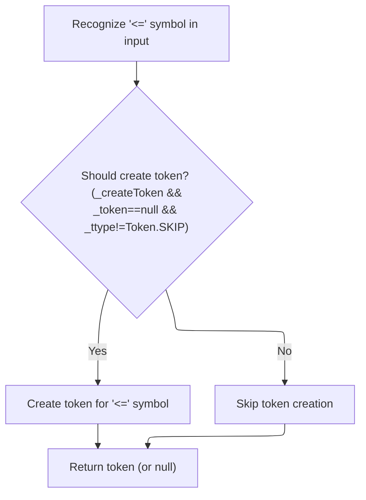

<SwmSnippet path="/core/src/main/java/org/apache/struts/validator/validwhen/ValidWhenLexer.java" line="765">

---

In <SwmToken path="core/src/main/java/org/apache/struts/validator/validwhen/ValidWhenLexer.java" pos="765:7:7" line-data="	public final void mLESSEQUALSIGN(boolean _createToken) throws RecognitionException, CharStreamException, TokenStreamException {">`mLESSEQUALSIGN`</SwmToken>, the lexer matches '<' followed by '=' to recognize the less-than-or-equal operator. After matching, it calls ActionConfigMatcher to check if this operator is part of a more complex rule.

```java
	public final void mLESSEQUALSIGN(boolean _createToken) throws RecognitionException, CharStreamException, TokenStreamException {
		int _ttype; Token _token=null; int _begin=text.length();
		_ttype = LESSEQUALSIGN;
		int _saveIndex;
		
		match('<');
		match('=');
```

---

</SwmSnippet>

<SwmSnippet path="/core/src/main/java/org/apache/struts/validator/validwhen/ValidWhenLexer.java" line="772">

---

Back in <SwmToken path="core/src/main/java/org/apache/struts/validator/validwhen/ValidWhenLexer.java" pos="161:1:1" line-data="						mLESSEQUALSIGN(true);">`mLESSEQUALSIGN`</SwmToken>, after returning from ActionConfigMatcher, the lexer creates the less-than-or-equal operator token if needed and returns it. If the token type is SKIP, nothing is returned.

```java
		if ( _createToken && _token==null && _ttype!=Token.SKIP ) {
			_token = makeToken(_ttype);
			_token.setText(new String(text.getBuffer(), _begin, text.length()-_begin));
		}
		_returnToken = _token;
	}
```

---

</SwmSnippet>

## Handling Greater-Than-Or-Equal Operators

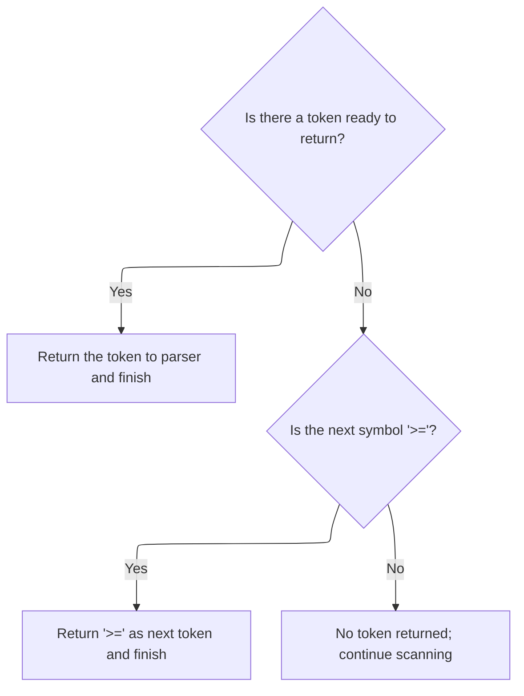

<SwmSnippet path="/core/src/main/java/org/apache/struts/validator/validwhen/ValidWhenLexer.java" line="162">

---

Next, in <SwmToken path="tiles/src/main/java/org/apache/struts/tiles/taglib/InsertTag.java" pos="989:10:10" line-data="            if (request.isUserInRole(st.nextToken())) {">`nextToken`</SwmToken>, after handling '<=', the lexer checks for '>=' and calls <SwmToken path="core/src/main/java/org/apache/struts/validator/validwhen/ValidWhenLexer.java" pos="165:1:1" line-data="						mGREATEREQUALSIGN(true);">`mGREATEREQUALSIGN`</SwmToken> if it finds one. This is for handling the greater-than-or-equal operator in the input.

```java
						theRetToken=_returnToken;
					}
					else if ((LA(1)=='>') && (LA(2)=='=')) {
						mGREATEREQUALSIGN(true);
```

---

</SwmSnippet>

## Parsing the '>=' Operator

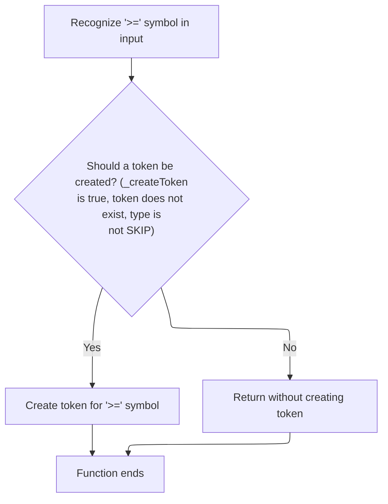

<SwmSnippet path="/core/src/main/java/org/apache/struts/validator/validwhen/ValidWhenLexer.java" line="779">

---

In <SwmToken path="core/src/main/java/org/apache/struts/validator/validwhen/ValidWhenLexer.java" pos="779:7:7" line-data="	public final void mGREATEREQUALSIGN(boolean _createToken) throws RecognitionException, CharStreamException, TokenStreamException {">`mGREATEREQUALSIGN`</SwmToken>, the lexer matches '>' followed by '=' to recognize the greater-than-or-equal operator. After matching, it calls ActionConfigMatcher to check if this operator is part of a more complex rule.

```java
	public final void mGREATEREQUALSIGN(boolean _createToken) throws RecognitionException, CharStreamException, TokenStreamException {
		int _ttype; Token _token=null; int _begin=text.length();
		_ttype = GREATEREQUALSIGN;
		int _saveIndex;
		
		match('>');
		match('=');
```

---

</SwmSnippet>

<SwmSnippet path="/core/src/main/java/org/apache/struts/validator/validwhen/ValidWhenLexer.java" line="786">

---

Back in <SwmToken path="core/src/main/java/org/apache/struts/validator/validwhen/ValidWhenLexer.java" pos="165:1:1" line-data="						mGREATEREQUALSIGN(true);">`mGREATEREQUALSIGN`</SwmToken>, after returning from ActionConfigMatcher, the lexer creates the greater-than-or-equal operator token if needed and returns it. If the token type is SKIP, nothing is returned.

```java
		if ( _createToken && _token==null && _ttype!=Token.SKIP ) {
			_token = makeToken(_ttype);
			_token.setText(new String(text.getBuffer(), _begin, text.length()-_begin));
		}
		_returnToken = _token;
	}
```

---

</SwmSnippet>

## Handling Less-Than Operators

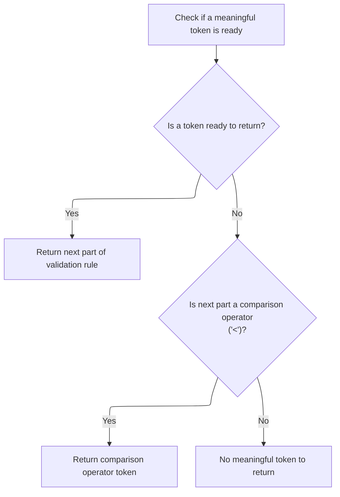

<SwmSnippet path="/core/src/main/java/org/apache/struts/validator/validwhen/ValidWhenLexer.java" line="166">

---

Next, in <SwmToken path="tiles/src/main/java/org/apache/struts/tiles/taglib/InsertTag.java" pos="989:10:10" line-data="            if (request.isUserInRole(st.nextToken())) {">`nextToken`</SwmToken>, after handling '>=' in the lexer, it checks for '<' and calls <SwmToken path="core/src/main/java/org/apache/struts/validator/validwhen/ValidWhenLexer.java" pos="169:1:1" line-data="						mLESSTHANSIGN(true);">`mLESSTHANSIGN`</SwmToken> if it finds one. This is for handling the less-than operator in the input.

```java
						theRetToken=_returnToken;
					}
					else if ((LA(1)=='<') && (true)) {
						mLESSTHANSIGN(true);
```

---

</SwmSnippet>

## Parsing Less-Than Operator

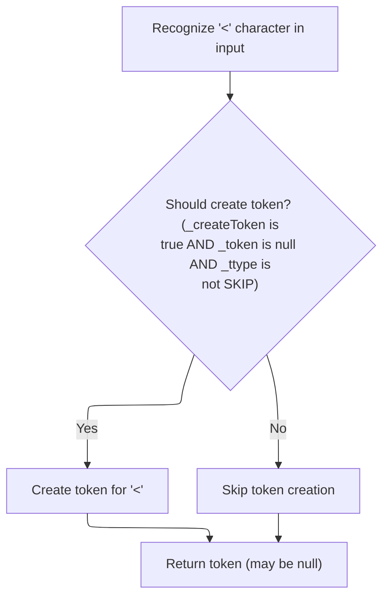

<SwmSnippet path="/core/src/main/java/org/apache/struts/validator/validwhen/ValidWhenLexer.java" line="739">

---

In <SwmToken path="core/src/main/java/org/apache/struts/validator/validwhen/ValidWhenLexer.java" pos="739:7:7" line-data="	public final void mLESSTHANSIGN(boolean _createToken) throws RecognitionException, CharStreamException, TokenStreamException {">`mLESSTHANSIGN`</SwmToken>, the lexer matches the '<' character and sets up the token type. After this, it hands off to ActionConfigMatcher to check if this less-than sign is part of a bigger pattern, like '<=' or something else.

```java
	public final void mLESSTHANSIGN(boolean _createToken) throws RecognitionException, CharStreamException, TokenStreamException {
		int _ttype; Token _token=null; int _begin=text.length();
		_ttype = LESSTHANSIGN;
		int _saveIndex;
		
		match('<');
```

---

</SwmSnippet>

<SwmSnippet path="/core/src/main/java/org/apache/struts/validator/validwhen/ValidWhenLexer.java" line="745">

---

Back in <SwmToken path="core/src/main/java/org/apache/struts/validator/validwhen/ValidWhenLexer.java" pos="169:1:1" line-data="						mLESSTHANSIGN(true);">`mLESSTHANSIGN`</SwmToken>, after returning from ActionConfigMatcher, the lexer creates the less-than token if needed and returns it. If the token type is SKIP, nothing is returned.

```java
		if ( _createToken && _token==null && _ttype!=Token.SKIP ) {
			_token = makeToken(_ttype);
			_token.setText(new String(text.getBuffer(), _begin, text.length()-_begin));
		}
		_returnToken = _token;
	}
```

---

</SwmSnippet>

## Continuing Token Dispatch After Less-Than

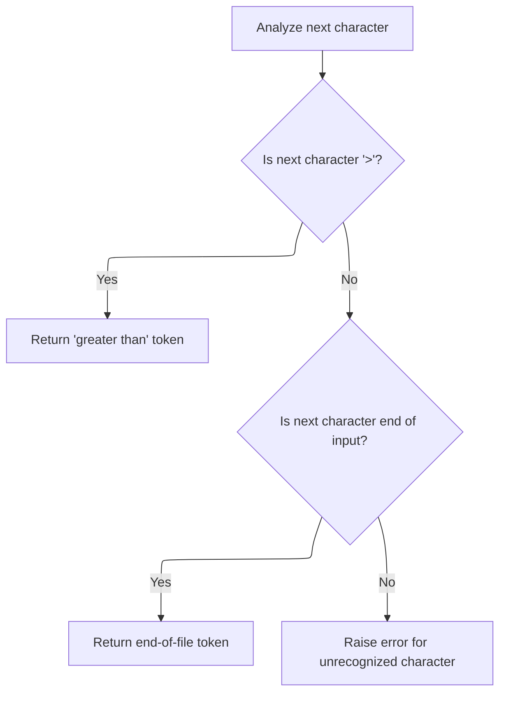

<SwmSnippet path="/core/src/main/java/org/apache/struts/validator/validwhen/ValidWhenLexer.java" line="170">

---

After returning from <SwmToken path="core/src/main/java/org/apache/struts/validator/validwhen/ValidWhenLexer.java" pos="169:1:1" line-data="						mLESSTHANSIGN(true);">`mLESSTHANSIGN`</SwmToken>, the lexer logic in <SwmToken path="tiles/src/main/java/org/apache/struts/tiles/taglib/InsertTag.java" pos="989:10:10" line-data="            if (request.isUserInRole(st.nextToken())) {">`nextToken`</SwmToken> checks for '>' and calls <SwmToken path="core/src/main/java/org/apache/struts/validator/validwhen/ValidWhenLexer.java" pos="173:1:1" line-data="						mGREATERTHANSIGN(true);">`mGREATERTHANSIGN`</SwmToken> if found. This keeps the token stream moving and ensures all comparison operators are handled. If nothing matches, it checks for EOF or throws an error.

```java
						theRetToken=_returnToken;
					}
					else if ((LA(1)=='>') && (true)) {
						mGREATERTHANSIGN(true);
						theRetToken=_returnToken;
					}
				else {
					if (LA(1)==EOF_CHAR) {uponEOF(); _returnToken = makeToken(Token.EOF_TYPE);}
				else {throw new NoViableAltForCharException((char)LA(1), getFilename(), getLine(), getColumn());}
				}
				}
```

---

</SwmSnippet>

## Parsing Greater-Than Operator

<SwmSnippet path="/core/src/main/java/org/apache/struts/validator/validwhen/ValidWhenLexer.java" line="752">

---

In <SwmToken path="core/src/main/java/org/apache/struts/validator/validwhen/ValidWhenLexer.java" pos="752:7:7" line-data="	public final void mGREATERTHANSIGN(boolean _createToken) throws RecognitionException, CharStreamException, TokenStreamException {">`mGREATERTHANSIGN`</SwmToken>, the lexer matches the '>' character and sets up the token type. After this, it hands off to ActionConfigMatcher to check if this greater-than sign is part of a bigger pattern, like '>=' or something else.

```java
	public final void mGREATERTHANSIGN(boolean _createToken) throws RecognitionException, CharStreamException, TokenStreamException {
		int _ttype; Token _token=null; int _begin=text.length();
		_ttype = GREATERTHANSIGN;
		int _saveIndex;
		
		match('>');
```

---

</SwmSnippet>

<SwmSnippet path="/core/src/main/java/org/apache/struts/validator/validwhen/ValidWhenLexer.java" line="758">

---

Back in <SwmToken path="core/src/main/java/org/apache/struts/validator/validwhen/ValidWhenLexer.java" pos="173:1:1" line-data="						mGREATERTHANSIGN(true);">`mGREATERTHANSIGN`</SwmToken>, after returning from ActionConfigMatcher, the lexer creates the greater-than token if needed and returns it. If the token type is SKIP, nothing is returned.

```java
		if ( _createToken && _token==null && _ttype!=Token.SKIP ) {
			_token = makeToken(_ttype);
			_token.setText(new String(text.getBuffer(), _begin, text.length()-_begin));
		}
		_returnToken = _token;
	}
```

---

</SwmSnippet>

## Finalizing Token Dispatch

<SwmSnippet path="/core/src/main/java/org/apache/struts/validator/validwhen/ValidWhenLexer.java" line="181">

---

After returning from <SwmToken path="core/src/main/java/org/apache/struts/validator/validwhen/ValidWhenLexer.java" pos="173:1:1" line-data="						mGREATERTHANSIGN(true);">`mGREATERTHANSIGN`</SwmToken>, the lexer checks if the token is SKIP and keeps looping if so. It sets the token type, checks for literal matches, and returns the token. Exceptions are handled to keep the flow robust.

```java
				if ( _returnToken==null ) continue tryAgain; // found SKIP token
				_ttype = _returnToken.getType();
				_ttype = testLiteralsTable(_ttype);
				_returnToken.setType(_ttype);
				return _returnToken;
			}
			catch (RecognitionException e) {
				throw new TokenStreamRecognitionException(e);
			}
		}
		catch (CharStreamException cse) {
			if ( cse instanceof CharStreamIOException ) {
				throw new TokenStreamIOException(((CharStreamIOException)cse).io);
			}
			else {
				throw new TokenStreamException(cse.getMessage());
			}
		}
	}
}
```

---

</SwmSnippet>

&nbsp;

*This is an auto-generated document by Swimm 🌊 and has not yet been verified by a human*

<SwmMeta version="3.0.0" repo-id="Z2l0aHViJTNBJTNBc3RydXRzMSUzQSUzQVN3aW1tLURlbW8=" repo-name="struts1"><sup>Powered by [Swimm](https://app.swimm.io/)</sup></SwmMeta>
