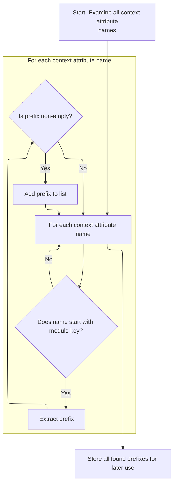

This document explains how the system identifies and stores module prefixes by examining attribute names in the servlet context. By filtering and extracting relevant prefixes, the system supports dynamic recognition and management of multiple modules.

# Collecting Module Prefixes from Servlet Context

<SwmSnippet path="/core/src/main/java/org/apache/struts/action/ActionServlet.java" line="418">

---

In <SwmToken path="core/src/main/java/org/apache/struts/action/ActionServlet.java" pos="418:5:5" line-data="    protected void initModulePrefixes(ServletContext context) {">`initModulePrefixes`</SwmToken>, we're grabbing all attribute names from the <SwmToken path="core/src/main/java/org/apache/struts/action/ActionServlet.java" pos="418:7:7" line-data="    protected void initModulePrefixes(ServletContext context) {">`ServletContext`</SwmToken> so we can filter out the ones that represent module keys. We need to call `ComponentContext.getAttributeNames` next because it provides a way to iterate over attribute names, which is necessary for the filtering logic that follows.

```java
    protected void initModulePrefixes(ServletContext context) {
        ArrayList prefixList = new ArrayList();

        Enumeration names = context.getAttributeNames();

```

---

</SwmSnippet>

## Enumerating Attribute Names in Component Context

<SwmSnippet path="/tiles/src/main/java/org/apache/struts/tiles/ComponentContext.java" line="124">

---

<SwmToken path="tiles/src/main/java/org/apache/struts/tiles/ComponentContext.java" pos="124:5:5" line-data="    public Iterator getAttributeNames() {">`getAttributeNames`</SwmToken> gives us an iterator over all attribute keys in the <SwmToken path="tiles/src/main/java/org/apache/struts/tiles/ComponentContext.java" pos="39:4:4" line-data="public class ComponentContext implements Serializable {">`ComponentContext`</SwmToken>, or an empty iterator if there aren't any. We call `MessagesMap.keySet` next because if the underlying attributes map is a <SwmToken path="faces/src/main/java/org/apache/struts/faces/util/MessagesMap.java" pos="41:4:4" line-data="public class MessagesMap implements Map {">`MessagesMap`</SwmToken>, we need its key set to enumerate attribute names.

```java
    public Iterator getAttributeNames() {
        if (attributes == null) {
            return Collections.EMPTY_LIST.iterator();
        }

        return attributes.keySet().iterator();
    }
```

---

</SwmSnippet>

<SwmSnippet path="/faces/src/main/java/org/apache/struts/faces/util/MessagesMap.java" line="211">

---

<SwmToken path="faces/src/main/java/org/apache/struts/faces/util/MessagesMap.java" pos="211:5:5" line-data="    public Set keySet() {">`keySet`</SwmToken> in <SwmToken path="faces/src/main/java/org/apache/struts/faces/util/MessagesMap.java" pos="41:4:4" line-data="public class MessagesMap implements Map {">`MessagesMap`</SwmToken> just throws <SwmToken path="faces/src/main/java/org/apache/struts/faces/util/MessagesMap.java" pos="213:5:5" line-data="        throw new UnsupportedOperationException();">`UnsupportedOperationException`</SwmToken>, so if the attributes map is a <SwmToken path="faces/src/main/java/org/apache/struts/faces/util/MessagesMap.java" pos="41:4:4" line-data="public class MessagesMap implements Map {">`MessagesMap`</SwmToken>, you can't enumerate its keys. This means any code expecting to loop through keys will fail here—it's a hard stop for unsupported operations.

```java
    public Set keySet() {

        throw new UnsupportedOperationException();

    }
```

---

</SwmSnippet>

## Filtering and Collecting Valid Module Prefixes



<SwmSnippet path="/core/src/main/java/org/apache/struts/action/ActionServlet.java" line="423">

---

Back in ActionServlet.initModulePrefixes, we loop through the attribute names we just got from <SwmToken path="tiles/src/main/java/org/apache/struts/tiles/ComponentContext.java" pos="39:4:4" line-data="public class ComponentContext implements Serializable {">`ComponentContext`</SwmToken>. Only names starting with <SwmToken path="core/src/main/java/org/apache/struts/action/ActionServlet.java" pos="426:9:11" line-data="            if (!name.startsWith(Globals.MODULE_KEY)) {">`Globals.MODULE_KEY`</SwmToken> are considered, and we extract and collect their suffixes as module prefixes. If <SwmToken path="core/src/main/java/org/apache/struts/action/ActionServlet.java" pos="421:9:9" line-data="        Enumeration names = context.getAttributeNames();">`getAttributeNames`</SwmToken> returned nothing or threw, this loop would do nothing or fail.

```java
        while (names.hasMoreElements()) {
            String name = (String) names.nextElement();

            if (!name.startsWith(Globals.MODULE_KEY)) {
                continue;
            }

            String prefix = name.substring(Globals.MODULE_KEY.length());

            if (prefix.length() > 0) {
                prefixList.add(prefix);
            }
        }
```

---

</SwmSnippet>

<SwmSnippet path="/core/src/main/java/org/apache/struts/action/ActionServlet.java" line="437">

---

Finally, ActionServlet.initModulePrefixes converts the collected prefixes into a String array and saves it in the <SwmToken path="core/src/main/java/org/apache/struts/action/ActionServlet.java" pos="418:7:7" line-data="    protected void initModulePrefixes(ServletContext context) {">`ServletContext`</SwmToken> so other code can access the list of module prefixes later.

```java
        String[] prefixes =
            (String[]) prefixList.toArray(new String[prefixList.size()]);

        context.setAttribute(Globals.MODULE_PREFIXES_KEY, prefixes);
    }
```

---

</SwmSnippet>

&nbsp;

*This is an auto-generated document by Swimm 🌊 and has not yet been verified by a human*

<SwmMeta version="3.0.0" repo-id="Z2l0aHViJTNBJTNBc3RydXRzMSUzQSUzQVN3aW1tLURlbW8=" repo-name="struts1"><sup>Powered by [Swimm](https://app.swimm.io/)</sup></SwmMeta>
