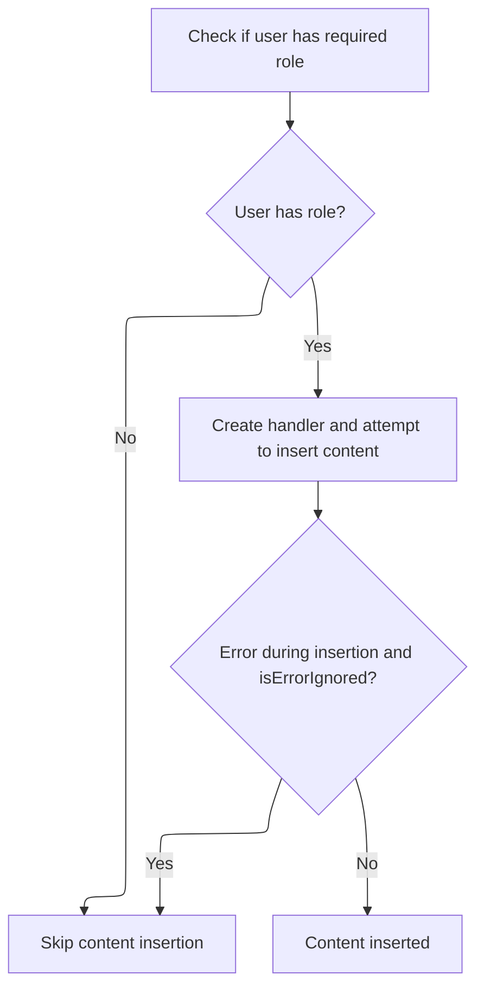
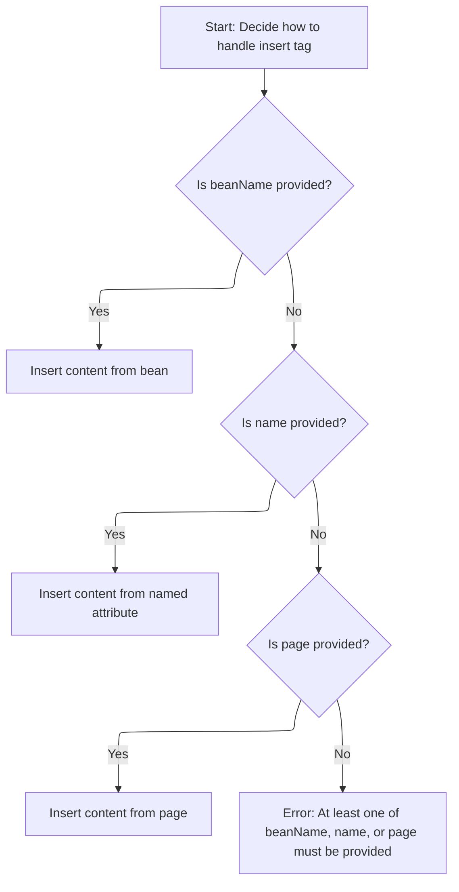

This document describes how content is conditionally inserted into a page, based on user authorization and the attributes provided. The process checks if the user is allowed to see the content, then determines the appropriate content source, supporting flexible layouts and access control.

# Authorization and Delegation Entry



<SwmSnippet path="/tiles/src/main/java/org/apache/struts/tiles/taglib/InsertTag.java" line="425">

---

<SwmToken path="tiles/src/main/java/org/apache/struts/tiles/taglib/InsertTag.java" pos="425:5:5" line-data="    public int doStartTag() throws JspException {">`doStartTag`</SwmToken> kicks off the tag processing by checking user authorization based on the 'role' field. If the user isn't authorized, it skips the tag body. Otherwise, it tries to create a tag handler via <SwmToken path="tiles/src/main/java/org/apache/struts/tiles/taglib/InsertTag.java" pos="441:5:5" line-data="            tagHandler = createTagHandler();">`createTagHandler`</SwmToken>, and if successful, hands off processing to that handler. This sets up the rest of the tag lifecycle.

```java
    public int doStartTag() throws JspException {

            // Additional fix for Bug 20034 (2005-04-28)
            cachedCurrentContext = null;

        // Check role immediatly to avoid useless stuff.
        // In case of insertion of a "definition", definition's role still checked later.
        // This lead to a double check of "role" ;-(
        HttpServletRequest request =
            (HttpServletRequest) pageContext.getRequest();
        if (role != null && !request.isUserInRole(role)) {
            processEndTag = false;
            return SKIP_BODY;
        }

        try {
            tagHandler = createTagHandler();

        } catch (JspException e) {
            if (isErrorIgnored) {
                processEndTag = false;
                return SKIP_BODY;
            } else {
                throw e;
            }
        }

        return tagHandler.doStartTag();
    }
```

---

</SwmSnippet>

# Attribute Dispatch and Handler Selection

<SwmSnippet path="/tiles/src/main/java/org/apache/struts/tiles/taglib/InsertTag.java" line="474">

---

In <SwmToken path="tiles/src/main/java/org/apache/struts/tiles/taglib/InsertTag.java" pos="474:5:5" line-data="    public TagHandler createTagHandler() throws JspException {">`createTagHandler`</SwmToken>, we check which attribute is set to decide how to process the tag. If 'attribute' is set, we call <SwmToken path="tiles/src/main/java/org/apache/struts/tiles/taglib/InsertTag.java" pos="481:3:3" line-data="            return processAttribute(attribute);">`processAttribute`</SwmToken> next, since it determines what content or logic to include based on the attribute value. The order matters because 'page' can overlap with others, so it's checked last.

```java
    public TagHandler createTagHandler() throws JspException {
        // Check each tag attribute.
        // page Url attribute must be the last checked  because it can appears concurrently
        // with others attributes.
        if (definitionName != null) {
            return processDefinitionName(definitionName);
        } else if (attribute != null) {
            return processAttribute(attribute);
```

---

</SwmSnippet>

## Attribute Value Resolution

<SwmSnippet path="/tiles/src/main/java/org/apache/struts/tiles/taglib/InsertTag.java" line="689">

---

<SwmToken path="tiles/src/main/java/org/apache/struts/tiles/taglib/InsertTag.java" pos="689:5:5" line-data="    public TagHandler processAttribute(String name) throws JspException {">`processAttribute`</SwmToken> grabs the attribute value from the current context. If it's missing, it throws an error. Otherwise, it passes the value to <SwmToken path="tiles/src/main/java/org/apache/struts/tiles/taglib/InsertTag.java" pos="699:3:3" line-data="        return processObjectValue(attrValue);">`processObjectValue`</SwmToken> to figure out what kind of handler to use based on the value's type.

```java
    public TagHandler processAttribute(String name) throws JspException {
        Object attrValue = getCurrentContext().getAttribute(name);

        if (attrValue == null) {
            throw new JspException(
                "Error - Tag Insert : No value found for attribute '"
                    + name
                    + "'.");
        }

        return processObjectValue(attrValue);
    }
```

---

</SwmSnippet>

<SwmSnippet path="/tiles/src/main/java/org/apache/struts/tiles/taglib/InsertTag.java" line="501">

---

<SwmToken path="tiles/src/main/java/org/apache/struts/tiles/taglib/InsertTag.java" pos="501:5:5" line-data="    public TagHandler processObjectValue(Object value) throws JspException {">`processObjectValue`</SwmToken> figures out what kind of handler to use by checking the runtime type of the value. If it's a known type, it dispatches accordingly; otherwise, it treats the value as a string for further processing.

```java
    public TagHandler processObjectValue(Object value) throws JspException {
        // First, check if value is one of the Typed Attribute
        if (value instanceof AttributeDefinition) {
            // We have a type => return appropriate IncludeType
            return processTypedAttribute((AttributeDefinition) value);

        } else if (value instanceof ComponentDefinition) {
            return processDefinition((ComponentDefinition) value);
        }

        // Value must denote a valid String
        return processAsDefinitionOrURL(value.toString());
    }
```

---

</SwmSnippet>

## Bean Property Dispatch



<SwmSnippet path="/tiles/src/main/java/org/apache/struts/tiles/taglib/InsertTag.java" line="482">

---

Back in <SwmToken path="tiles/src/main/java/org/apache/struts/tiles/taglib/InsertTag.java" pos="441:5:5" line-data="            tagHandler = createTagHandler();">`createTagHandler`</SwmToken>, after handling attributes, we check if <SwmToken path="tiles/src/main/java/org/apache/struts/tiles/taglib/InsertTag.java" pos="482:8:8" line-data="        } else if (beanName != null) {">`beanName`</SwmToken> is set. If so, we call <SwmToken path="tiles/src/main/java/org/apache/struts/tiles/taglib/InsertTag.java" pos="483:3:3" line-data="            return processBean(beanName, beanProperty, beanScope);">`processBean`</SwmToken> to resolve the bean property and figure out what handler to use based on its value.

```java
        } else if (beanName != null) {
            return processBean(beanName, beanProperty, beanScope);
```

---

</SwmSnippet>

<SwmSnippet path="/tiles/src/main/java/org/apache/struts/tiles/taglib/InsertTag.java" line="653">

---

<SwmToken path="tiles/src/main/java/org/apache/struts/tiles/taglib/InsertTag.java" pos="653:5:5" line-data="    protected TagHandler processBean(">`processBean`</SwmToken> pulls the bean property value from the specified scope. If it's missing, it throws an error. Otherwise, it hands off the value to <SwmToken path="tiles/src/main/java/org/apache/struts/tiles/taglib/InsertTag.java" pos="677:3:3" line-data="        return processObjectValue(beanValue);">`processObjectValue`</SwmToken> to decide how to process it.

```java
    protected TagHandler processBean(
        String beanName,
        String beanProperty,
        String beanScope)
        throws JspException {

        Object beanValue =
            TagUtils.getRealValueFromBean(
                beanName,
                beanProperty,
                beanScope,
                pageContext);

        if (beanValue == null) {
            throw new JspException(
                "Error - Tag Insert : No value defined for bean '"
                    + beanName
                    + "' with property '"
                    + beanProperty
                    + "' in scope '"
                    + beanScope
                    + "'.");
        }

        return processObjectValue(beanValue);
    }
```

---

</SwmSnippet>

<SwmSnippet path="/tiles/src/main/java/org/apache/struts/tiles/taglib/InsertTag.java" line="484">

---

Back in <SwmToken path="tiles/src/main/java/org/apache/struts/tiles/taglib/InsertTag.java" pos="441:5:5" line-data="            tagHandler = createTagHandler();">`createTagHandler`</SwmToken>, after handling beans, we check if 'name' is set. If so, we call <SwmToken path="tiles/src/main/java/org/apache/struts/tiles/taglib/InsertTag.java" pos="485:3:3" line-data="            return processName(name);">`processName`</SwmToken> to resolve the handler based on the named attribute. If none of the earlier attributes are set, we finally check 'page', since it can overlap with others and needs to be handled last.

```java
        } else if (name != null) {
            return processName(name);
        } else if (page != null) {
            return processUrl(page);
        } else {
            throw new JspException("Error - Tag Insert : At least one of the following attribute must be defined : template|page|attribute|definition|name|beanName. Check tag syntax");
        }
    }
```

---

</SwmSnippet>

<SwmSnippet path="/tiles/src/main/java/org/apache/struts/tiles/taglib/InsertTag.java" line="529">

---

<SwmToken path="tiles/src/main/java/org/apache/struts/tiles/taglib/InsertTag.java" pos="529:5:5" line-data="    public TagHandler processName(String name) throws JspException {">`processName`</SwmToken> looks up the named attribute in the current context. If it's found, it passes the value to <SwmToken path="tiles/src/main/java/org/apache/struts/tiles/taglib/InsertTag.java" pos="533:3:3" line-data="            return processObjectValue(attrValue);">`processObjectValue`</SwmToken> for handler selection. If not, it falls back to treating the name as a definition or URL.

```java
    public TagHandler processName(String name) throws JspException {
        Object attrValue = getCurrentContext().getAttribute(name);

        if (attrValue != null) {
            return processObjectValue(attrValue);
        }

        return processAsDefinitionOrURL(name);
    }
```

---

</SwmSnippet>

&nbsp;

*This is an auto-generated document by Swimm 🌊 and has not yet been verified by a human*

<SwmMeta version="3.0.0" repo-id="Z2l0aHViJTNBJTNBc3RydXRzMSUzQSUzQVN3aW1tLURlbW8=" repo-name="struts1"><sup>Powered by [Swimm](https://app.swimm.io/)</sup></SwmMeta>
