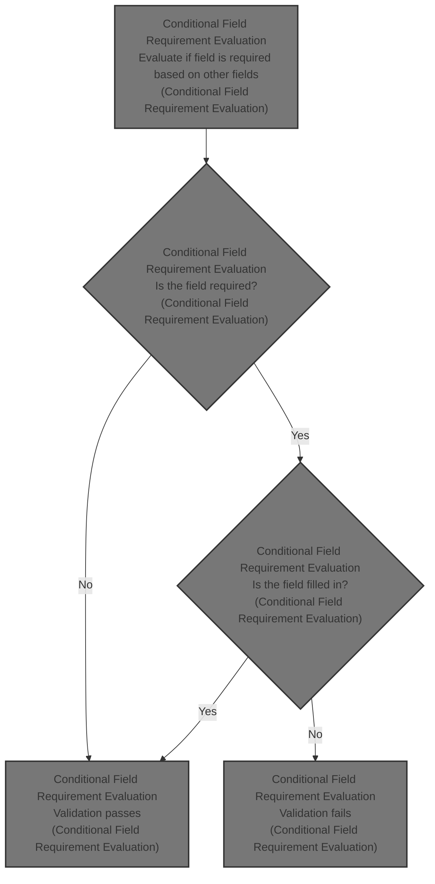
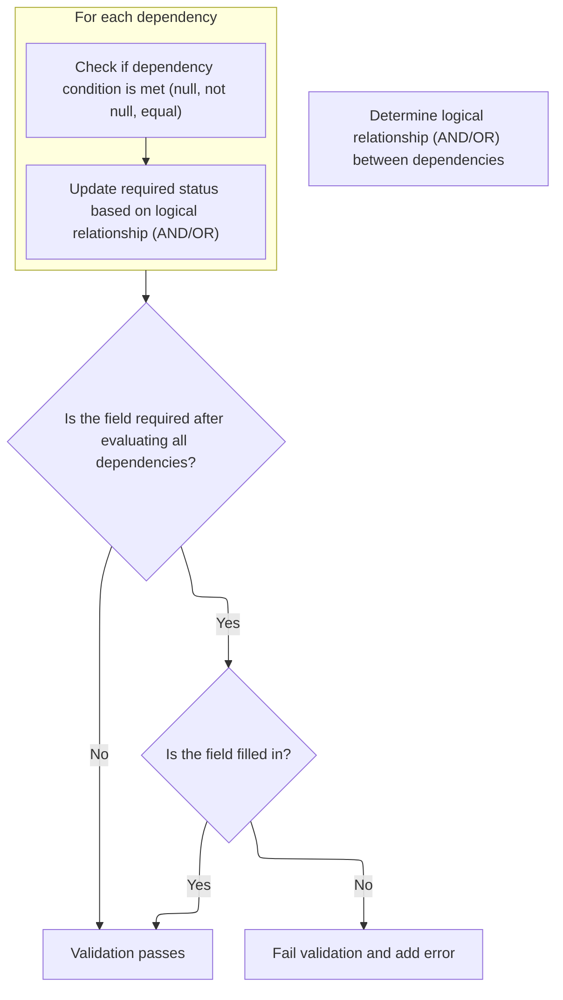

This document explains how dynamic form validation determines whether a field must be filled in, depending on the values of other fields. The process evaluates conditions across related fields and applies logical rules to decide if the main field is required. If the field is required and not filled, validation fails; otherwise, validation passes.



# Conditional Field Requirement Evaluation



<SwmSnippet path="/core/src/main/java/org/apache/struts/validator/FieldChecks.java" line="159">

---

In <SwmToken path="core/src/main/java/org/apache/struts/validator/FieldChecks.java" pos="159:7:7" line-data="    public static boolean validateRequiredIf(Object bean, ValidatorAction va,">`validateRequiredIf`</SwmToken>, the function starts by pulling the main field value and setting up the required flag based on the <SwmToken path="core/src/main/java/org/apache/struts/validator/FieldChecks.java" pos="175:3:3" line-data="        String fieldJoin = &quot;AND&quot;;">`fieldJoin`</SwmToken> variable (defaults to AND). It then loops through dependent fields, which are expected to be named in a specific pattern inside the Field object (like 'field\[0\]', '<SwmToken path="core/src/main/java/org/apache/struts/validator/FieldChecks.java" pos="188:12:12" line-data="            String dependTest = field.getVarValue(&quot;fieldTest[&quot; + i + &quot;]&quot;);">`fieldTest`</SwmToken>\[0\]', etc.). For each dependent field, it figures out the property, test type, test value, and whether it's indexed, then evaluates the condition and updates the required flag using AND/OR logic. This setup is what determines if the main field should be required based on the state of other fields.

```java
    public static boolean validateRequiredIf(Object bean, ValidatorAction va,
        Field field, ActionMessages errors, Validator validator,
        HttpServletRequest request) {
        Object form =
            validator.getParameterValue(org.apache.commons.validator.Validator.BEAN_PARAM);
        String value = null;
        boolean required = false;

        try {
            value = evaluateBean(bean, field);
        } catch (Exception e) {
            processFailure(errors, field, validator.getFormName(), "requiredif", e);
            return false;
        }

        int i = 0;
        String fieldJoin = "AND";

        if (!GenericValidator.isBlankOrNull(field.getVarValue("fieldJoin"))) {
            fieldJoin = field.getVarValue("fieldJoin");
        }

        if (fieldJoin.equalsIgnoreCase("AND")) {
            required = true;
        }

        while (!GenericValidator.isBlankOrNull(field.getVarValue("field[" + i
                    + "]"))) {
            String dependProp = field.getVarValue("field[" + i + "]");
            String dependTest = field.getVarValue("fieldTest[" + i + "]");
            String dependTestValue = field.getVarValue("fieldValue[" + i + "]");
            String dependIndexed = field.getVarValue("fieldIndexed[" + i + "]");

            if (dependIndexed == null) {
                dependIndexed = "false";
            }

            String dependVal = null;
            boolean thisRequired = false;

            if (field.isIndexed() && dependIndexed.equalsIgnoreCase("true")) {
                String key = field.getKey();

                if ((key.indexOf("[") > -1) && (key.indexOf("]") > -1)) {
                    String ind = key.substring(0, key.indexOf(".") + 1);

                    dependProp = ind + dependProp;
                }
            }

            dependVal = ValidatorUtils.getValueAsString(form, dependProp);

            if (dependTest.equals(FIELD_TEST_NULL)) {
                if ((dependVal != null) && (dependVal.length() > 0)) {
                    thisRequired = false;
                } else {
                    thisRequired = true;
                }
            }

            if (dependTest.equals(FIELD_TEST_NOTNULL)) {
                if ((dependVal != null) && (dependVal.length() > 0)) {
                    thisRequired = true;
                } else {
                    thisRequired = false;
                }
            }

            if (dependTest.equals(FIELD_TEST_EQUAL)) {
                thisRequired = dependTestValue.equalsIgnoreCase(dependVal);
            }

            if (fieldJoin.equalsIgnoreCase("AND")) {
                required = required && thisRequired;
            } else {
                required = required || thisRequired;
            }

            i++;
        }
```

---

</SwmSnippet>

<SwmSnippet path="/core/src/main/java/org/apache/struts/validator/FieldChecks.java" line="240">

---

After evaluating all the dependent field conditions, if the main field is determined to be required and it's blank, the function adds an error and returns false. If it's filled or not required, it just returns true. So, validation only fails if the field is required and empty.

```java
        if (required) {
            if (GenericValidator.isBlankOrNull(value)) {
                errors.add(field.getKey(),
                    Resources.getActionMessage(validator, request, va, field));

                return false;
            } else {
                return true;
            }
        }

        return true;
    }
```

---

</SwmSnippet>

&nbsp;

*This is an auto-generated document by Swimm 🌊 and has not yet been verified by a human*

<SwmMeta version="3.0.0" repo-id="Z2l0aHViJTNBJTNBc3RydXRzMSUzQSUzQVN3aW1tLURlbW8=" repo-name="struts1"><sup>Powered by [Swimm](https://app.swimm.io/)</sup></SwmMeta>
