This document describes how the system checks for the presence of specific elements—such as cookies, headers, beans, parameters, roles, or users—in a web request or context. This enables web pages to conditionally display or hide content depending on whether certain conditions are met, such as whether a user is logged in or a particular parameter is present.

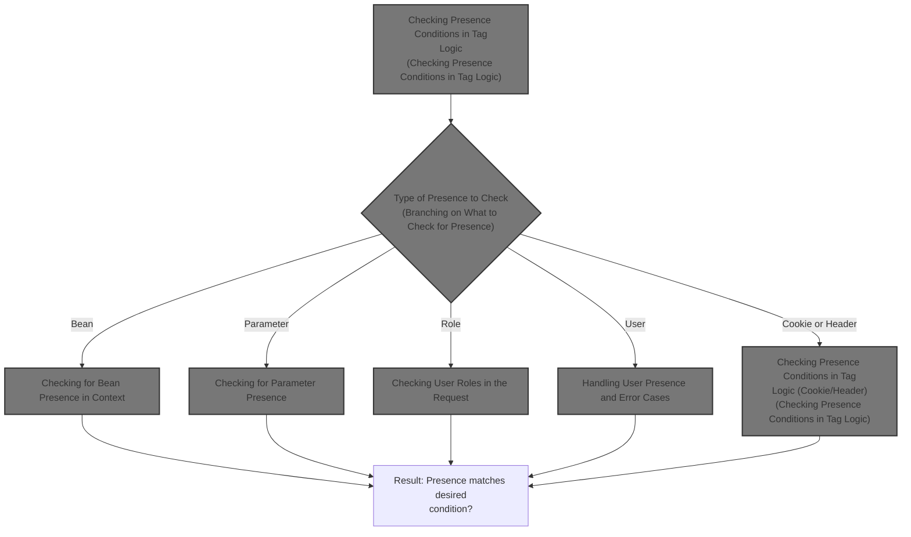
```mermaid
flowchart TD
  node1["Checking Presence Conditions in Tag
Logic
(Checking Presence Conditions in Tag Logic)"]:::HeadingStyle
  click node1 goToHeading "Checking Presence Conditions in Tag Logic"
  node1 --> node2{"Type of Presence to Check
(Branching on What to Check for Presence)"}:::HeadingStyle
  click node2 goToHeading "Branching on What to Check for Presence"
  node2 -->|"Bean"| node3["Checking for Bean Presence in Context"]:::HeadingStyle
  click node3 goToHeading "Checking for Bean Presence in Context"
  node2 -->|"Parameter"| node4["Checking for Parameter Presence"]:::HeadingStyle
  click node4 goToHeading "Checking for Parameter Presence"
  node2 -->|"Role"| node5["Checking User Roles in the Request"]:::HeadingStyle
  click node5 goToHeading "Checking User Roles in the Request"
  node2 -->|"User"| node6["Handling User Presence and Error Cases"]:::HeadingStyle
  click node6 goToHeading "Handling User Presence and Error Cases"
  node2 -->|"Cookie or Header"| node7["Checking Presence Conditions in Tag
Logic (Cookie/Header)
(Checking Presence Conditions in Tag Logic)"]:::HeadingStyle
  click node7 goToHeading "Checking Presence Conditions in Tag Logic"
  node3 --> node8["Result: Presence matches desired
condition?"]
  node4 --> node8
  node5 --> node8
  node6 --> node8
  node7 --> node8
classDef HeadingStyle fill:#777777,stroke:#333,stroke-width:2px;
```

# Where is this flow used?

This flow is used multiple times in the codebase as represented in the following diagram:

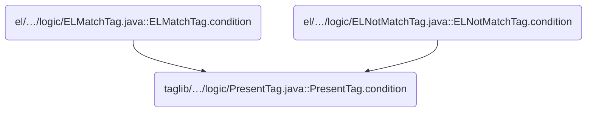
```mermaid
graph TD;
      d764121753f4241f575e3cdded1c26c88a62fa21ffcac7414d61ea635d42adc7(el/…/logic/ELMatchTag.java::ELMatchTag.condition) --> 618b6d2d8db222b09f8118b4c2e657b6ee4421e83e76faf46b7b2cfd6fd10196(taglib/…/logic/PresentTag.java::PresentTag.condition)

3e0b80c83c745b7354a5cb2525ac48cb58fbc1ce3a427b5f2ba9138c0746ef20(el/…/logic/ELNotMatchTag.java::ELNotMatchTag.condition) --> 618b6d2d8db222b09f8118b4c2e657b6ee4421e83e76faf46b7b2cfd6fd10196(taglib/…/logic/PresentTag.java::PresentTag.condition)


classDef mainFlowStyle color:#000000,fill:#7CB9F4
classDef rootsStyle color:#000000,fill:#00FFF4
classDef Style1 color:#000000,fill:#00FFAA
classDef Style2 color:#000000,fill:#FFFF00
classDef Style3 color:#000000,fill:#AA7CB9

%% Swimm:
%% graph TD;
%%       d764121753f4241f575e3cdded1c26c88a62fa21ffcac7414d61ea635d42adc7(<SwmPath>[el/…/logic/ELMatchTag.java](el/src/main/java/org/apache/strutsel/taglib/logic/ELMatchTag.java)</SwmPath>::ELMatchTag.condition) --> 618b6d2d8db222b09f8118b4c2e657b6ee4421e83e76faf46b7b2cfd6fd10196(<SwmPath>[taglib/…/logic/PresentTag.java](taglib/src/main/java/org/apache/struts/taglib/logic/PresentTag.java)</SwmPath>::PresentTag.condition)
%% 
%% 3e0b80c83c745b7354a5cb2525ac48cb58fbc1ce3a427b5f2ba9138c0746ef20(<SwmPath>[el/…/logic/ELNotMatchTag.java](el/src/main/java/org/apache/strutsel/taglib/logic/ELNotMatchTag.java)</SwmPath>::ELNotMatchTag.condition) --> 618b6d2d8db222b09f8118b4c2e657b6ee4421e83e76faf46b7b2cfd6fd10196(<SwmPath>[taglib/…/logic/PresentTag.java](taglib/src/main/java/org/apache/struts/taglib/logic/PresentTag.java)</SwmPath>::PresentTag.condition)
%% 
%% 
%% classDef mainFlowStyle color:#000000,fill:#7CB9F4
%% classDef rootsStyle color:#000000,fill:#00FFF4
%% classDef Style1 color:#000000,fill:#00FFAA
%% classDef Style2 color:#000000,fill:#FFFF00
%% classDef Style3 color:#000000,fill:#AA7CB9
```

# Checking Presence Conditions in Tag Logic

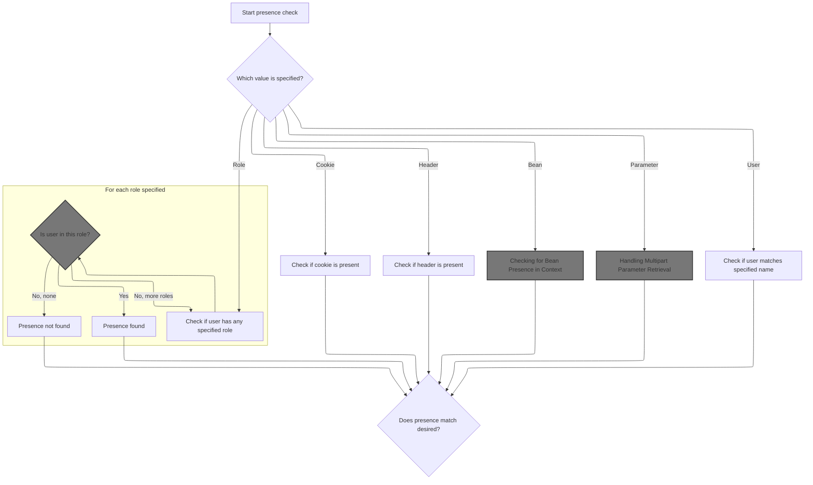
```mermaid
%%{init: {"flowchart": {"defaultRenderer": "elk"}} }%%
flowchart TD
  node1["Start presence check"]
  click node1 openCode "taglib/src/main/java/org/apache/struts/taglib/logic/PresentTag.java:67:72"
  node1 --> node2{"Which value is specified?"}
  click node2 openCode "taglib/src/main/java/org/apache/struts/taglib/logic/PresentTag.java:74:74"
  node2 -->|"Cookie"| node3["Check if cookie is present"]
  click node3 openCode "taglib/src/main/java/org/apache/struts/taglib/logic/PresentTag.java:75:75"
  node2 -->|"Header"| node4["Check if header is present"]
  click node4 openCode "taglib/src/main/java/org/apache/struts/taglib/logic/PresentTag.java:77:79"
  node2 -->|"Bean"| node5["Checking for Bean Presence in Context"]
  
  node2 -->|"Parameter"| node6["Handling Multipart Parameter Retrieval"]
  
  node2 -->|"Role"| node7["Check if user has any specified role"]
  click node7 openCode "taglib/src/main/java/org/apache/struts/taglib/logic/PresentTag.java:87:92"
  node2 -->|"User"| node8["Check if user matches specified name"]
  click node8 openCode "taglib/src/main/java/org/apache/struts/taglib/logic/PresentTag.java:94:96"

  subgraph loop1["For each role specified"]
    node7 --> node9{"Is user in this role?"}
    
    node9 -->|"Yes"| node10["Presence found"]
    click node10 openCode "taglib/src/main/java/org/apache/struts/taglib/logic/PresentTag.java:91:91"
    node9 -->|"No, more roles"| node7
    node9 -->|"No, none"| node11["Presence not found"]
    click node11 openCode "taglib/src/main/java/org/apache/struts/taglib/logic/PresentTag.java:92:92"
  end

  node3 --> node12{"Does presence match desired?"}
  node4 --> node12
  node5 --> node12
  node6 --> node12
  node10 --> node12
  node8 --> node12
  node11 --> node12
  click node12 openCode "taglib/src/main/java/org/apache/struts/taglib/logic/PresentTag.java:105:106"

classDef HeadingStyle fill:#777777,stroke:#333,stroke-width:2px;
click node5 goToHeading "Checking for Bean Presence in Context"
node5:::HeadingStyle
click node6 goToHeading "Handling Multipart Parameter Retrieval"
node6:::HeadingStyle
click node9 goToHeading "Tokenizing Input for Validation Rules"
node9:::HeadingStyle

%% Swimm:
%% %%{init: {"flowchart": {"defaultRenderer": "elk"}} }%%
%% flowchart TD
%%   node1["Start presence check"]
%%   click node1 openCode "<SwmPath>[taglib/…/logic/PresentTag.java](taglib/src/main/java/org/apache/struts/taglib/logic/PresentTag.java)</SwmPath>:67:72"
%%   node1 --> node2{"Which value is specified?"}
%%   click node2 openCode "<SwmPath>[taglib/…/logic/PresentTag.java](taglib/src/main/java/org/apache/struts/taglib/logic/PresentTag.java)</SwmPath>:74:74"
%%   node2 -->|"Cookie"| node3["Check if cookie is present"]
%%   click node3 openCode "<SwmPath>[taglib/…/logic/PresentTag.java](taglib/src/main/java/org/apache/struts/taglib/logic/PresentTag.java)</SwmPath>:75:75"
%%   node2 -->|"Header"| node4["Check if header is present"]
%%   click node4 openCode "<SwmPath>[taglib/…/logic/PresentTag.java](taglib/src/main/java/org/apache/struts/taglib/logic/PresentTag.java)</SwmPath>:77:79"
%%   node2 -->|"Bean"| node5["Checking for Bean Presence in Context"]
%%   
%%   node2 -->|"Parameter"| node6["Handling Multipart Parameter Retrieval"]
%%   
%%   node2 -->|"Role"| node7["Check if user has any specified role"]
%%   click node7 openCode "<SwmPath>[taglib/…/logic/PresentTag.java](taglib/src/main/java/org/apache/struts/taglib/logic/PresentTag.java)</SwmPath>:87:92"
%%   node2 -->|"User"| node8["Check if user matches specified name"]
%%   click node8 openCode "<SwmPath>[taglib/…/logic/PresentTag.java](taglib/src/main/java/org/apache/struts/taglib/logic/PresentTag.java)</SwmPath>:94:96"
%% 
%%   subgraph loop1["For each role specified"]
%%     node7 --> node9{"Is user in this role?"}
%%     
%%     node9 -->|"Yes"| node10["Presence found"]
%%     click node10 openCode "<SwmPath>[taglib/…/logic/PresentTag.java](taglib/src/main/java/org/apache/struts/taglib/logic/PresentTag.java)</SwmPath>:91:91"
%%     node9 -->|"No, more roles"| node7
%%     node9 -->|"No, none"| node11["Presence not found"]
%%     click node11 openCode "<SwmPath>[taglib/…/logic/PresentTag.java](taglib/src/main/java/org/apache/struts/taglib/logic/PresentTag.java)</SwmPath>:92:92"
%%   end
%% 
%%   node3 --> node12{"Does presence match desired?"}
%%   node4 --> node12
%%   node5 --> node12
%%   node6 --> node12
%%   node10 --> node12
%%   node8 --> node12
%%   node11 --> node12
%%   click node12 openCode "<SwmPath>[taglib/…/logic/PresentTag.java](taglib/src/main/java/org/apache/struts/taglib/logic/PresentTag.java)</SwmPath>:105:106"
%% 
%% classDef HeadingStyle fill:#777777,stroke:#333,stroke-width:2px;
%% click node5 goToHeading "Checking for Bean Presence in Context"
%% node5:::HeadingStyle
%% click node6 goToHeading "Handling Multipart Parameter Retrieval"
%% node6:::HeadingStyle
%% click node9 goToHeading "Tokenizing Input for Validation Rules"
%% node9:::HeadingStyle
```

<SwmSnippet path="/taglib/src/main/java/org/apache/struts/taglib/logic/PresentTag.java" line="67">

---

In <SwmToken path="taglib/src/main/java/org/apache/struts/taglib/logic/PresentTag.java" pos="67:5:5" line-data="    protected boolean condition(boolean desired)">`condition`</SwmToken>, we grab the <SwmToken path="taglib/src/main/java/org/apache/struts/taglib/logic/PresentTag.java" pos="71:1:1" line-data="        HttpServletRequest request =">`HttpServletRequest`</SwmToken> from the page context so we can check for cookies, headers, parameters, roles, or user info. Next, we need to call into <SwmToken path="core/src/main/java/org/apache/struts/chain/contexts/ServletActionContext.java" pos="39:4:4" line-data="public class ServletActionContext extends WebActionContext {">`ServletActionContext`</SwmToken> to get the actual request object, since that's where all the presence checks happen.

```java
    protected boolean condition(boolean desired)
        throws JspException {
        // Evaluate the presence of the specified value
        boolean present = false;
        HttpServletRequest request =
            (HttpServletRequest) pageContext.getRequest();

```

---

</SwmSnippet>

## Retrieving the HTTP Request from the Context

<SwmSnippet path="/core/src/main/java/org/apache/struts/chain/contexts/ServletActionContext.java" line="94">

---

<SwmToken path="core/src/main/java/org/apache/struts/chain/contexts/ServletActionContext.java" pos="94:5:5" line-data="    public HttpServletRequest getRequest() {">`getRequest`</SwmToken> just hands off to <SwmToken path="core/src/main/java/org/apache/struts/chain/contexts/ServletActionContext.java" pos="95:3:9" line-data="        return servletWebContext().getRequest();">`servletWebContext().getRequest()`</SwmToken>. We need to call <SwmToken path="core/src/main/java/org/apache/struts/chain/contexts/ServletActionContext.java" pos="95:3:3" line-data="        return servletWebContext().getRequest();">`servletWebContext`</SwmToken> next to actually get the request object from the underlying context abstraction.

```java
    public HttpServletRequest getRequest() {
        return servletWebContext().getRequest();
    }
```

---

</SwmSnippet>

<SwmSnippet path="/core/src/main/java/org/apache/struts/chain/contexts/ServletActionContext.java" line="67">

---

<SwmToken path="core/src/main/java/org/apache/struts/chain/contexts/ServletActionContext.java" pos="67:5:5" line-data="    protected ServletWebContext servletWebContext() {">`servletWebContext`</SwmToken> just casts the base context to <SwmToken path="core/src/main/java/org/apache/struts/chain/contexts/ServletActionContext.java" pos="67:3:3" line-data="    protected ServletWebContext servletWebContext() {">`ServletWebContext`</SwmToken>. If the base context isn't the right type, you'll get a <SwmToken path="taglib/src/main/java/org/apache/struts/taglib/TagUtils.java" pos="209:8:8" line-data="            //        } catch (ClassCastException e) {">`ClassCastException`</SwmToken>—there's no safety check here. This is a straight cast, no extra logic.

```java
    protected ServletWebContext servletWebContext() {
        return (ServletWebContext) this.getBaseContext();
    }
```

---

</SwmSnippet>

## Branching on What to Check for Presence

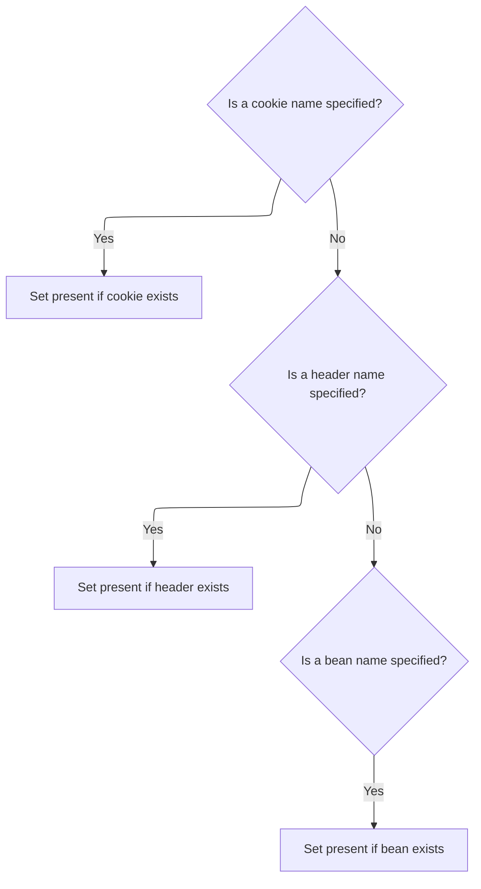
```mermaid
%%{init: {"flowchart": {"defaultRenderer": "elk"}} }%%
flowchart TD
    node1{"Is a cookie name specified?"}
    click node1 openCode "taglib/src/main/java/org/apache/struts/taglib/logic/PresentTag.java:74:76"
    node1 -->|"Yes"| node2["Set present if cookie exists"]
    click node2 openCode "taglib/src/main/java/org/apache/struts/taglib/logic/PresentTag.java:75:76"
    node1 -->|"No"| node3{"Is a header name specified?"}
    click node3 openCode "taglib/src/main/java/org/apache/struts/taglib/logic/PresentTag.java:76:80"
    node3 -->|"Yes"| node4["Set present if header exists"]
    click node4 openCode "taglib/src/main/java/org/apache/struts/taglib/logic/PresentTag.java:77:79"
    node3 -->|"No"| node5{"Is a bean name specified?"}
    click node5 openCode "taglib/src/main/java/org/apache/struts/taglib/logic/PresentTag.java:80:81"
    node5 -->|"Yes"| node6["Set present if bean exists"]
    click node6 openCode "taglib/src/main/java/org/apache/struts/taglib/logic/PresentTag.java:81:81"

classDef HeadingStyle fill:#777777,stroke:#333,stroke-width:2px;

%% Swimm:
%% %%{init: {"flowchart": {"defaultRenderer": "elk"}} }%%
%% flowchart TD
%%     node1{"Is a cookie name specified?"}
%%     click node1 openCode "<SwmPath>[taglib/…/logic/PresentTag.java](taglib/src/main/java/org/apache/struts/taglib/logic/PresentTag.java)</SwmPath>:74:76"
%%     node1 -->|"Yes"| node2["Set present if cookie exists"]
%%     click node2 openCode "<SwmPath>[taglib/…/logic/PresentTag.java](taglib/src/main/java/org/apache/struts/taglib/logic/PresentTag.java)</SwmPath>:75:76"
%%     node1 -->|"No"| node3{"Is a header name specified?"}
%%     click node3 openCode "<SwmPath>[taglib/…/logic/PresentTag.java](taglib/src/main/java/org/apache/struts/taglib/logic/PresentTag.java)</SwmPath>:76:80"
%%     node3 -->|"Yes"| node4["Set present if header exists"]
%%     click node4 openCode "<SwmPath>[taglib/…/logic/PresentTag.java](taglib/src/main/java/org/apache/struts/taglib/logic/PresentTag.java)</SwmPath>:77:79"
%%     node3 -->|"No"| node5{"Is a bean name specified?"}
%%     click node5 openCode "<SwmPath>[taglib/…/logic/PresentTag.java](taglib/src/main/java/org/apache/struts/taglib/logic/PresentTag.java)</SwmPath>:80:81"
%%     node5 -->|"Yes"| node6["Set present if bean exists"]
%%     click node6 openCode "<SwmPath>[taglib/…/logic/PresentTag.java](taglib/src/main/java/org/apache/struts/taglib/logic/PresentTag.java)</SwmPath>:81:81"
%% 
%% classDef HeadingStyle fill:#777777,stroke:#333,stroke-width:2px;
```

<SwmSnippet path="/taglib/src/main/java/org/apache/struts/taglib/logic/PresentTag.java" line="74">

---

Back in `PresentTag.condition`, after getting the request, we branch based on which field (cookie, header, name, parameter, role, user) is set. Only one should be non-null. If 'name' is set, we call <SwmToken path="taglib/src/main/java/org/apache/struts/taglib/logic/PresentTag.java" pos="81:7:7" line-data="            present = this.isBeanPresent();">`isBeanPresent`</SwmToken> next to check for a bean in the context.

```java
        if (cookie != null) {
            present = this.isCookiePresent(request);
        } else if (header != null) {
            String value = request.getHeader(header);

            present = (value != null);
        } else if (name != null) {
            present = this.isBeanPresent();
```

---

</SwmSnippet>

## Checking for Bean Presence in Context

<SwmSnippet path="/taglib/src/main/java/org/apache/struts/taglib/logic/PresentTag.java" line="114">

---

In <SwmToken path="taglib/src/main/java/org/apache/struts/taglib/logic/PresentTag.java" pos="114:5:5" line-data="    protected boolean isBeanPresent() {">`isBeanPresent`</SwmToken>, we use TagUtils.lookup to find the bean or property in the page context. If 'property' is set, we look up that property; otherwise, we just look up the bean by name. <SwmToken path="taglib/src/main/java/org/apache/struts/taglib/logic/PresentTag.java" pos="120:1:1" line-data="                    TagUtils.getInstance().lookup(pageContext, name,">`TagUtils`</SwmToken> handles the details.

```java
    protected boolean isBeanPresent() {
        Object value = null;

        try {
            if (this.property != null) {
                value =
                    TagUtils.getInstance().lookup(pageContext, name,
                        this.property, scope);
            } else {
```

---

</SwmSnippet>

### Looking Up Beans or Properties in Page Context

See <SwmLink doc-title="Retrieving Beans and Properties in JSP Context">[Retrieving Beans and Properties in JSP Context](/.swm/retrieving-beans-and-properties-in-jsp-context.mtrgy2r6.sw.md)</SwmLink>

### Handling Lookup Results and Exceptions

<SwmSnippet path="/taglib/src/main/java/org/apache/struts/taglib/logic/PresentTag.java" line="123">

---

Just returned from TagUtils.lookup in <SwmToken path="taglib/src/main/java/org/apache/struts/taglib/logic/PresentTag.java" pos="81:7:7" line-data="            present = this.isBeanPresent();">`isBeanPresent`</SwmToken>. If lookup throws, we catch it and treat the bean as not present. The function returns true if the bean/property was found (value != null).

```java
                value = TagUtils.getInstance().lookup(pageContext, name, scope);
            }
        } catch (JspException e) {
            value = null;
        }

        return (value != null);
    }
```

---

</SwmSnippet>

## Resolving Scope and Attribute in <SwmToken path="taglib/src/main/java/org/apache/struts/taglib/logic/PresentTag.java" pos="101:1:1" line-data="            TagUtils.getInstance().saveException(pageContext, e);">`TagUtils`</SwmToken>

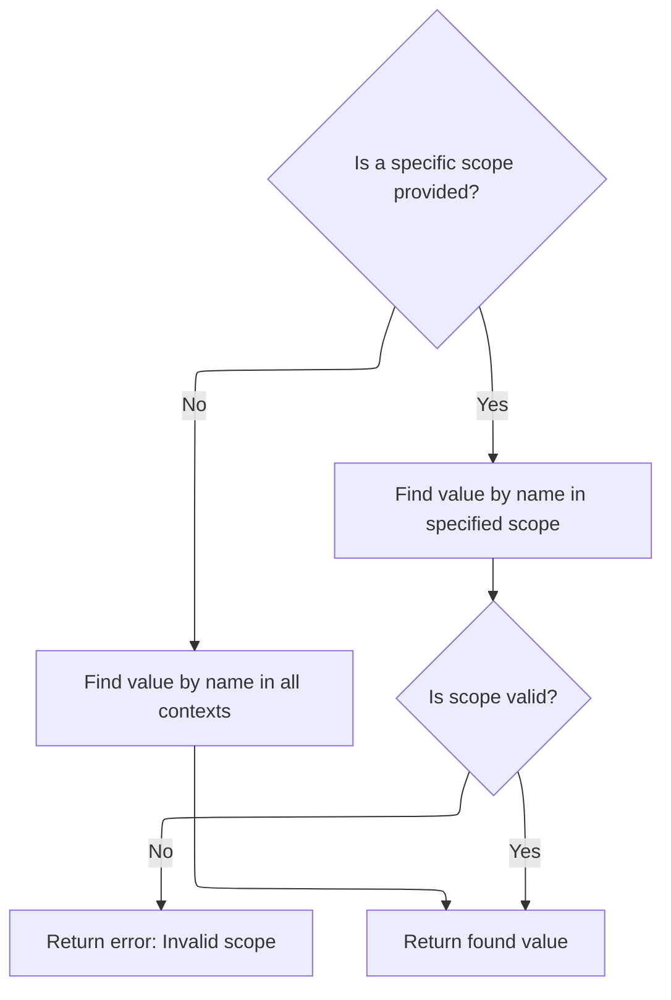
```mermaid
%%{init: {"flowchart": {"defaultRenderer": "elk"}} }%%
flowchart TD
  node1{"Is a specific scope provided?"}
  click node1 openCode "taglib/src/main/java/org/apache/struts/taglib/TagUtils.java:865:865"
  node1 -->|"No"| node2["Find value by name in all contexts"]
  click node2 openCode "taglib/src/main/java/org/apache/struts/taglib/TagUtils.java:866:866"
  node1 -->|"Yes"| node3["Find value by name in specified scope"]
  click node3 openCode "taglib/src/main/java/org/apache/struts/taglib/TagUtils.java:870:870"
  node3 --> node4{"Is scope valid?"}
  click node4 openCode "taglib/src/main/java/org/apache/struts/taglib/TagUtils.java:811:813"
  node4 -->|"No"| node5["Return error: Invalid scope"]
  click node5 openCode "taglib/src/main/java/org/apache/struts/taglib/TagUtils.java:814:815"
  node4 -->|"Yes"| node6["Return found value"]
  click node6 openCode "taglib/src/main/java/org/apache/struts/taglib/TagUtils.java:870:870"
  node2 --> node6
classDef HeadingStyle fill:#777777,stroke:#333,stroke-width:2px;

%% Swimm:
%% %%{init: {"flowchart": {"defaultRenderer": "elk"}} }%%
%% flowchart TD
%%   node1{"Is a specific scope provided?"}
%%   click node1 openCode "<SwmPath>[taglib/…/taglib/TagUtils.java](taglib/src/main/java/org/apache/struts/taglib/TagUtils.java)</SwmPath>:865:865"
%%   node1 -->|"No"| node2["Find value by name in all contexts"]
%%   click node2 openCode "<SwmPath>[taglib/…/taglib/TagUtils.java](taglib/src/main/java/org/apache/struts/taglib/TagUtils.java)</SwmPath>:866:866"
%%   node1 -->|"Yes"| node3["Find value by name in specified scope"]
%%   click node3 openCode "<SwmPath>[taglib/…/taglib/TagUtils.java](taglib/src/main/java/org/apache/struts/taglib/TagUtils.java)</SwmPath>:870:870"
%%   node3 --> node4{"Is scope valid?"}
%%   click node4 openCode "<SwmPath>[taglib/…/taglib/TagUtils.java](taglib/src/main/java/org/apache/struts/taglib/TagUtils.java)</SwmPath>:811:813"
%%   node4 -->|"No"| node5["Return error: Invalid scope"]
%%   click node5 openCode "<SwmPath>[taglib/…/taglib/TagUtils.java](taglib/src/main/java/org/apache/struts/taglib/TagUtils.java)</SwmPath>:814:815"
%%   node4 -->|"Yes"| node6["Return found value"]
%%   click node6 openCode "<SwmPath>[taglib/…/taglib/TagUtils.java](taglib/src/main/java/org/apache/struts/taglib/TagUtils.java)</SwmPath>:870:870"
%%   node2 --> node6
%% classDef HeadingStyle fill:#777777,stroke:#333,stroke-width:2px;
```

<SwmSnippet path="/taglib/src/main/java/org/apache/struts/taglib/TagUtils.java" line="863">

---

In <SwmToken path="taglib/src/main/java/org/apache/struts/taglib/TagUtils.java" pos="863:5:5" line-data="    public Object lookup(PageContext pageContext, String name, String scopeName)">`lookup`</SwmToken>, if <SwmToken path="taglib/src/main/java/org/apache/struts/taglib/TagUtils.java" pos="863:19:19" line-data="    public Object lookup(PageContext pageContext, String name, String scopeName)">`scopeName`</SwmToken> is null, we search all scopes for the attribute. If it's set, we convert it to a scope integer with <SwmToken path="taglib/src/main/java/org/apache/struts/taglib/TagUtils.java" pos="870:12:12" line-data="            return pageContext.getAttribute(name, instance.getScope(scopeName));">`getScope`</SwmToken> and fetch the attribute from that specific scope. If <SwmToken path="taglib/src/main/java/org/apache/struts/taglib/TagUtils.java" pos="863:19:19" line-data="    public Object lookup(PageContext pageContext, String name, String scopeName)">`scopeName`</SwmToken> is invalid, <SwmToken path="taglib/src/main/java/org/apache/struts/taglib/TagUtils.java" pos="870:12:12" line-data="            return pageContext.getAttribute(name, instance.getScope(scopeName));">`getScope`</SwmToken> throws.

```java
    public Object lookup(PageContext pageContext, String name, String scopeName)
        throws JspException {
        if (scopeName == null) {
            return pageContext.findAttribute(name);
        }

        try {
            return pageContext.getAttribute(name, instance.getScope(scopeName));
```

---

</SwmSnippet>

<SwmSnippet path="/taglib/src/main/java/org/apache/struts/taglib/TagUtils.java" line="809">

---

<SwmToken path="taglib/src/main/java/org/apache/struts/taglib/TagUtils.java" pos="809:5:5" line-data="    public int getScope(String scopeName)">`getScope`</SwmToken> lowercases the scope name before looking it up in the scopes map, so scope names are case-insensitive. If the scope isn't found, it throws a <SwmToken path="taglib/src/main/java/org/apache/struts/taglib/TagUtils.java" pos="810:3:3" line-data="        throws JspException {">`JspException`</SwmToken> with a localized message from the messages object.

```java
    public int getScope(String scopeName)
        throws JspException {
        Integer scope = (Integer) scopes.get(scopeName.toLowerCase());

        if (scope == null) {
            throw new JspException(messages.getMessage("lookup.scope", scope));
        }

        return scope.intValue();
    }
```

---

</SwmSnippet>

<SwmSnippet path="/taglib/src/main/java/org/apache/struts/taglib/TagUtils.java" line="871">

---

Just returned from <SwmToken path="taglib/src/main/java/org/apache/struts/taglib/TagUtils.java" pos="809:5:5" line-data="    public int getScope(String scopeName)">`getScope`</SwmToken> in <SwmToken path="taglib/src/main/java/org/apache/struts/taglib/logic/PresentTag.java" pos="101:1:1" line-data="            TagUtils.getInstance().saveException(pageContext, e);">`TagUtils`</SwmToken>. If <SwmToken path="taglib/src/main/java/org/apache/struts/taglib/TagUtils.java" pos="809:5:5" line-data="    public int getScope(String scopeName)">`getScope`</SwmToken> throws, we save the exception in the page context before rethrowing it, so error handlers can pick it up.

```java
        } catch (JspException e) {
            saveException(pageContext, e);
            throw e;
        }
    }
```

---

</SwmSnippet>

## Checking for Parameter Presence

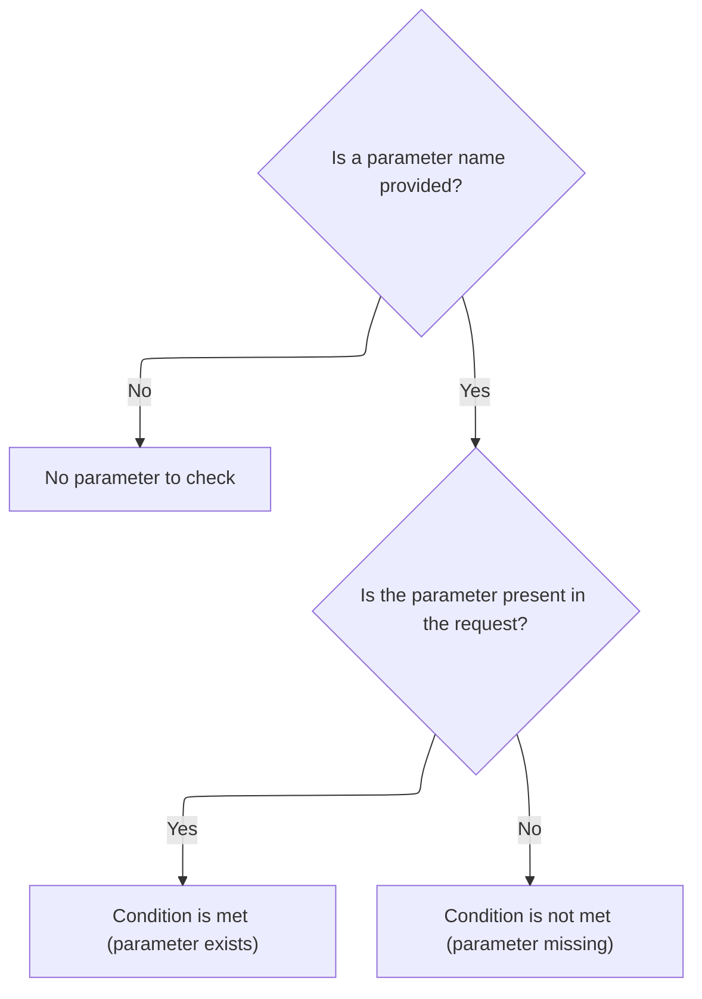
```mermaid
%%{init: {"flowchart": {"defaultRenderer": "elk"}} }%%
flowchart TD
    node1{"Is a parameter name provided?"}
    click node1 openCode "taglib/src/main/java/org/apache/struts/taglib/logic/PresentTag.java:82:83"
    node1 -->|"No"| node4["No parameter to check"]
    click node4 openCode "taglib/src/main/java/org/apache/struts/taglib/logic/PresentTag.java:82:83"
    node1 -->|"Yes"| node2{"Is the parameter present in the request?"}
    click node2 openCode "taglib/src/main/java/org/apache/struts/taglib/logic/PresentTag.java:82:83"
    node2 -->|"Yes"| node3["Condition is met (parameter exists)"]
    click node3 openCode "taglib/src/main/java/org/apache/struts/taglib/logic/PresentTag.java:82:83"
    node2 -->|"No"| node5["Condition is not met (parameter missing)"]
    click node5 openCode "taglib/src/main/java/org/apache/struts/taglib/logic/PresentTag.java:82:83"

classDef HeadingStyle fill:#777777,stroke:#333,stroke-width:2px;

%% Swimm:
%% %%{init: {"flowchart": {"defaultRenderer": "elk"}} }%%
%% flowchart TD
%%     node1{"Is a parameter name provided?"}
%%     click node1 openCode "<SwmPath>[taglib/…/logic/PresentTag.java](taglib/src/main/java/org/apache/struts/taglib/logic/PresentTag.java)</SwmPath>:82:83"
%%     node1 -->|"No"| node4["No parameter to check"]
%%     click node4 openCode "<SwmPath>[taglib/…/logic/PresentTag.java](taglib/src/main/java/org/apache/struts/taglib/logic/PresentTag.java)</SwmPath>:82:83"
%%     node1 -->|"Yes"| node2{"Is the parameter present in the request?"}
%%     click node2 openCode "<SwmPath>[taglib/…/logic/PresentTag.java](taglib/src/main/java/org/apache/struts/taglib/logic/PresentTag.java)</SwmPath>:82:83"
%%     node2 -->|"Yes"| node3["Condition is met (parameter exists)"]
%%     click node3 openCode "<SwmPath>[taglib/…/logic/PresentTag.java](taglib/src/main/java/org/apache/struts/taglib/logic/PresentTag.java)</SwmPath>:82:83"
%%     node2 -->|"No"| node5["Condition is not met (parameter missing)"]
%%     click node5 openCode "<SwmPath>[taglib/…/logic/PresentTag.java](taglib/src/main/java/org/apache/struts/taglib/logic/PresentTag.java)</SwmPath>:82:83"
%% 
%% classDef HeadingStyle fill:#777777,stroke:#333,stroke-width:2px;
```

<SwmSnippet path="/taglib/src/main/java/org/apache/struts/taglib/logic/PresentTag.java" line="82">

---

Just returned from <SwmToken path="taglib/src/main/java/org/apache/struts/taglib/logic/PresentTag.java" pos="81:7:7" line-data="            present = this.isBeanPresent();">`isBeanPresent`</SwmToken> in PresentTag.condition. Now, if 'parameter' is set, we call <SwmToken path="taglib/src/main/java/org/apache/struts/taglib/logic/PresentTag.java" pos="83:9:9" line-data="            String value = request.getParameter(parameter);">`getParameter`</SwmToken> on the request (which could be a <SwmToken path="core/src/main/java/org/apache/struts/upload/MultipartRequestWrapper.java" pos="38:4:4" line-data="public class MultipartRequestWrapper extends HttpServletRequestWrapper {">`MultipartRequestWrapper`</SwmToken>) to see if the client submitted that parameter.

```java
        } else if (parameter != null) {
            String value = request.getParameter(parameter);

```

---

</SwmSnippet>

## Handling Multipart Parameter Retrieval

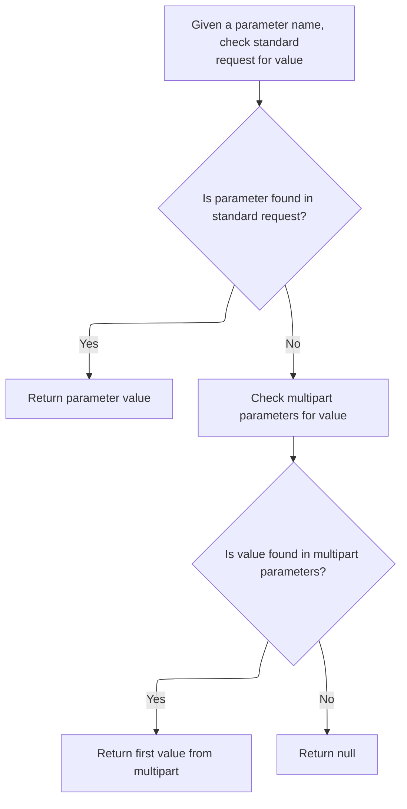
```mermaid
%%{init: {"flowchart": {"defaultRenderer": "elk"}} }%%
flowchart TD
  node1["Given a parameter name, check standard
request for value"]
  click node1 openCode "core/src/main/java/org/apache/struts/upload/MultipartRequestWrapper.java:76:77"
  node1 --> node2{"Is parameter found in standard request?"}
  click node2 openCode "core/src/main/java/org/apache/struts/upload/MultipartRequestWrapper.java:78:78"
  node2 -->|"Yes"| node3["Return parameter value"]
  click node3 openCode "core/src/main/java/org/apache/struts/upload/MultipartRequestWrapper.java:86:87"
  node2 -->|"No"| node4["Check multipart parameters for value"]
  click node4 openCode "core/src/main/java/org/apache/struts/upload/MultipartRequestWrapper.java:79:83"
  node4 --> node5{"Is value found in multipart parameters?"}
  click node5 openCode "core/src/main/java/org/apache/struts/upload/MultipartRequestWrapper.java:81:81"
  node5 -->|"Yes"| node6["Return first value from multipart"]
  click node6 openCode "core/src/main/java/org/apache/struts/upload/MultipartRequestWrapper.java:82:83"
  node5 -->|"No"| node7["Return null"]
  click node7 openCode "core/src/main/java/org/apache/struts/upload/MultipartRequestWrapper.java:86:87"
classDef HeadingStyle fill:#777777,stroke:#333,stroke-width:2px;

%% Swimm:
%% %%{init: {"flowchart": {"defaultRenderer": "elk"}} }%%
%% flowchart TD
%%   node1["Given a parameter name, check standard
%% request for value"]
%%   click node1 openCode "<SwmPath>[core/…/upload/MultipartRequestWrapper.java](core/src/main/java/org/apache/struts/upload/MultipartRequestWrapper.java)</SwmPath>:76:77"
%%   node1 --> node2{"Is parameter found in standard request?"}
%%   click node2 openCode "<SwmPath>[core/…/upload/MultipartRequestWrapper.java](core/src/main/java/org/apache/struts/upload/MultipartRequestWrapper.java)</SwmPath>:78:78"
%%   node2 -->|"Yes"| node3["Return parameter value"]
%%   click node3 openCode "<SwmPath>[core/…/upload/MultipartRequestWrapper.java](core/src/main/java/org/apache/struts/upload/MultipartRequestWrapper.java)</SwmPath>:86:87"
%%   node2 -->|"No"| node4["Check multipart parameters for value"]
%%   click node4 openCode "<SwmPath>[core/…/upload/MultipartRequestWrapper.java](core/src/main/java/org/apache/struts/upload/MultipartRequestWrapper.java)</SwmPath>:79:83"
%%   node4 --> node5{"Is value found in multipart parameters?"}
%%   click node5 openCode "<SwmPath>[core/…/upload/MultipartRequestWrapper.java](core/src/main/java/org/apache/struts/upload/MultipartRequestWrapper.java)</SwmPath>:81:81"
%%   node5 -->|"Yes"| node6["Return first value from multipart"]
%%   click node6 openCode "<SwmPath>[core/…/upload/MultipartRequestWrapper.java](core/src/main/java/org/apache/struts/upload/MultipartRequestWrapper.java)</SwmPath>:82:83"
%%   node5 -->|"No"| node7["Return null"]
%%   click node7 openCode "<SwmPath>[core/…/upload/MultipartRequestWrapper.java](core/src/main/java/org/apache/struts/upload/MultipartRequestWrapper.java)</SwmPath>:86:87"
%% classDef HeadingStyle fill:#777777,stroke:#333,stroke-width:2px;
```

<SwmSnippet path="/core/src/main/java/org/apache/struts/upload/MultipartRequestWrapper.java" line="75">

---

In <SwmToken path="core/src/main/java/org/apache/struts/upload/MultipartRequestWrapper.java" pos="75:5:5" line-data="    public String getParameter(String name) {">`getParameter`</SwmToken>, we first try to get the parameter from the wrapped request. If it's not there (like with multipart forms), we look in the parameters map. Only the first value is returned if it's an array.

```java
    public String getParameter(String name) {
        String value = getRequest().getParameter(name);

```

---

</SwmSnippet>

<SwmSnippet path="/core/src/main/java/org/apache/struts/upload/MultipartRequestWrapper.java" line="78">

---

Just returned from <SwmToken path="taglib/src/main/java/org/apache/struts/taglib/logic/PresentTag.java" pos="72:7:7" line-data="            (HttpServletRequest) pageContext.getRequest();">`getRequest`</SwmToken> in <SwmToken path="core/src/main/java/org/apache/struts/upload/MultipartRequestWrapper.java" pos="38:4:4" line-data="public class MultipartRequestWrapper extends HttpServletRequestWrapper {">`MultipartRequestWrapper`</SwmToken>. If the parameter wasn't found in the request, we check the parameters map (which holds String arrays from multipart parsing). Only the first value is used, and if both sources are null, we return null.

```java
        if (value == null) {
            String[] mValue = (String[]) parameters.get(name);

            if ((mValue != null) && (mValue.length > 0)) {
                value = mValue[0];
            }
        }

        return value;
    }
```

---

</SwmSnippet>

## Checking User Roles in the Request

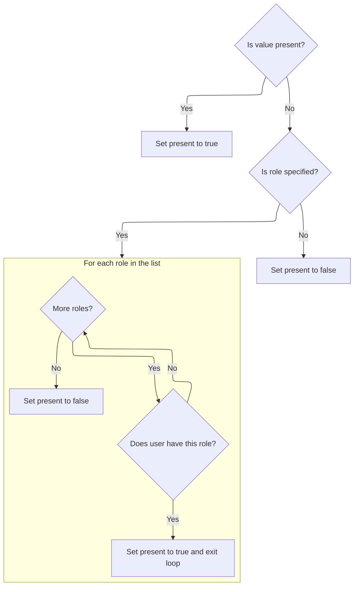
```mermaid
%%{init: {"flowchart": {"defaultRenderer": "elk"}} }%%
flowchart TD
  node1{"Is value present?"}
  click node1 openCode "taglib/src/main/java/org/apache/struts/taglib/logic/PresentTag.java:85:86"
  node1 -->|"Yes"| node2["Set present to true"]
  click node2 openCode "taglib/src/main/java/org/apache/struts/taglib/logic/PresentTag.java:85:86"
  node1 -->|"No"| node3{"Is role specified?"}
  click node3 openCode "taglib/src/main/java/org/apache/struts/taglib/logic/PresentTag.java:86:87"
  node3 -->|"No"| node4["Set present to false"]
  click node4 openCode "taglib/src/main/java/org/apache/struts/taglib/logic/PresentTag.java:85:86"
  node3 -->|"Yes"| loop1

  subgraph loop1["For each role in the list"]
    node5{"Does user have this role?"}
    click node5 openCode "taglib/src/main/java/org/apache/struts/taglib/logic/PresentTag.java:91:92"
    node5 -->|"Yes"| node6["Set present to true and exit loop"]
    click node6 openCode "taglib/src/main/java/org/apache/struts/taglib/logic/PresentTag.java:91:92"
    node5 -->|"No"| node7{"More roles?"}
    node7 -->|"Yes"| node5
    node7 -->|"No"| node8["Set present to false"]
    click node8 openCode "taglib/src/main/java/org/apache/struts/taglib/logic/PresentTag.java:85:86"
  end

classDef HeadingStyle fill:#777777,stroke:#333,stroke-width:2px;

%% Swimm:
%% %%{init: {"flowchart": {"defaultRenderer": "elk"}} }%%
%% flowchart TD
%%   node1{"Is value present?"}
%%   click node1 openCode "<SwmPath>[taglib/…/logic/PresentTag.java](taglib/src/main/java/org/apache/struts/taglib/logic/PresentTag.java)</SwmPath>:85:86"
%%   node1 -->|"Yes"| node2["Set present to true"]
%%   click node2 openCode "<SwmPath>[taglib/…/logic/PresentTag.java](taglib/src/main/java/org/apache/struts/taglib/logic/PresentTag.java)</SwmPath>:85:86"
%%   node1 -->|"No"| node3{"Is role specified?"}
%%   click node3 openCode "<SwmPath>[taglib/…/logic/PresentTag.java](taglib/src/main/java/org/apache/struts/taglib/logic/PresentTag.java)</SwmPath>:86:87"
%%   node3 -->|"No"| node4["Set present to false"]
%%   click node4 openCode "<SwmPath>[taglib/…/logic/PresentTag.java](taglib/src/main/java/org/apache/struts/taglib/logic/PresentTag.java)</SwmPath>:85:86"
%%   node3 -->|"Yes"| loop1
%% 
%%   subgraph loop1["For each role in the list"]
%%     node5{"Does user have this role?"}
%%     click node5 openCode "<SwmPath>[taglib/…/logic/PresentTag.java](taglib/src/main/java/org/apache/struts/taglib/logic/PresentTag.java)</SwmPath>:91:92"
%%     node5 -->|"Yes"| node6["Set present to true and exit loop"]
%%     click node6 openCode "<SwmPath>[taglib/…/logic/PresentTag.java](taglib/src/main/java/org/apache/struts/taglib/logic/PresentTag.java)</SwmPath>:91:92"
%%     node5 -->|"No"| node7{"More roles?"}
%%     node7 -->|"Yes"| node5
%%     node7 -->|"No"| node8["Set present to false"]
%%     click node8 openCode "<SwmPath>[taglib/…/logic/PresentTag.java](taglib/src/main/java/org/apache/struts/taglib/logic/PresentTag.java)</SwmPath>:85:86"
%%   end
%% 
%% classDef HeadingStyle fill:#777777,stroke:#333,stroke-width:2px;
```

<SwmSnippet path="/taglib/src/main/java/org/apache/struts/taglib/logic/PresentTag.java" line="85">

---

Just returned from <SwmToken path="core/src/main/java/org/apache/struts/upload/MultipartRequestWrapper.java" pos="38:4:4" line-data="public class MultipartRequestWrapper extends HttpServletRequestWrapper {">`MultipartRequestWrapper`</SwmToken>. Now, in PresentTag.condition, if 'role' is set, we split the role string using <SwmToken path="taglib/src/main/java/org/apache/struts/taglib/logic/PresentTag.java" pos="88:8:8" line-data="                new StringTokenizer(role, ROLE_DELIMITER, false);">`ROLE_DELIMITER`</SwmToken> and check each token with <SwmToken path="taglib/src/main/java/org/apache/struts/taglib/logic/PresentTag.java" pos="91:7:7" line-data="                present = request.isUserInRole(st.nextToken());">`isUserInRole`</SwmToken>. This lets us support multiple roles in one tag.

```java
            present = (value != null);
        } else if (role != null) {
            StringTokenizer st =
                new StringTokenizer(role, ROLE_DELIMITER, false);

            while (!present && st.hasMoreTokens()) {
                present = request.isUserInRole(st.nextToken());
            }
```

---

</SwmSnippet>

## Tokenizing Input for Validation Rules


```mermaid
%%{init: {"flowchart": {"defaultRenderer": "elk"}} }%%
flowchart TD
  node1["Start scanning for next token"]
  click node1 openCode "core/src/main/java/org/apache/struts/validator/validwhen/ValidWhenLexer.java:75:78"
  subgraph loop1["Scan input for next token"]
    node1 --> node2{"Is whitespace?"}
    click node2 openCode "core/src/main/java/org/apache/struts/validator/validwhen/ValidWhenLexer.java:85:86"
    node2 -->|"Yes"| node3["Skipping Whitespace in Lexer"]
    
    node3 --> node31
    node2 -->|"No"| node4{"Is digit or '-'"}
    click node4 openCode "core/src/main/java/org/apache/struts/validator/validwhen/ValidWhenLexer.java:91:94"
    node4 -->|"Yes"| node5["Parsing Numeric Literals with Lookahead"]
    
    node4 -->|"No"| node6{"Is quote?"}
    click node6 openCode "core/src/main/java/org/apache/struts/validator/validwhen/ValidWhenLexer.java:99:100"
    node6 -->|"Yes"| node7["Parsing String Literals"]
    
    node6 -->|"No"| node8{"Is '['?"}
    click node8 openCode "core/src/main/java/org/apache/struts/validator/validwhen/ValidWhenLexer.java:105:106"
    node8 -->|"Yes"| node9["Tokenizing Left Bracket"]
    
    node8 -->|"No"| node10{"Is ']'?"}
    click node10 openCode "core/src/main/java/org/apache/struts/validator/validwhen/ValidWhenLexer.java:111:112"
    node10 -->|"Yes"| node11["Tokenizing Right Bracket"]
    
    node10 -->|"No"| node12{"Is '('?"}
    click node12 openCode "core/src/main/java/org/apache/struts/validator/validwhen/ValidWhenLexer.java:117:118"
    node12 -->|"Yes"| node13["Tokenizing Left Parenthesis"]
    
    node12 -->|"No"| node14{"Is ')'?"}
    click node14 openCode "core/src/main/java/org/apache/struts/validator/validwhen/ValidWhenLexer.java:123:124"
    node14 -->|"Yes"| node15["Tokenizing Right Parenthesis"]
    
    node14 -->|"No"| node16{"Is '*'?"}
    click node16 openCode "core/src/main/java/org/apache/struts/validator/validwhen/ValidWhenLexer.java:129:130"
    node16 -->|"Yes"| node17["Tokenizing Special Identifier"]
    
    node16 -->|"No"| node18{"Is identifier character?"}
    click node18 openCode "core/src/main/java/org/apache/struts/validator/validwhen/ValidWhenLexer.java:135:142"
    node18 -->|"Yes"| node19["Tokenizing Identifiers"]
    
    node18 -->|"No"| node20{"Is '='?"}
    click node20 openCode "core/src/main/java/org/apache/struts/validator/validwhen/ValidWhenLexer.java:147:148"
    node20 -->|"Yes"| node21["Tokenizing Equality Operator"]
    
    node20 -->|"No"| node22{"Is '!'?"}
    click node22 openCode "core/src/main/java/org/apache/struts/validator/validwhen/ValidWhenLexer.java:153:154"
    node22 -->|"Yes"| node23["Tokenizing Not-Equal Operator"]
    
    node22 -->|"No"| node24{"Is '<='?"}
    click node24 openCode "core/src/main/java/org/apache/struts/validator/validwhen/ValidWhenLexer.java:160:161"
    node24 -->|"Yes"| node25["Tokenizing Less-Than-Or-Equal Operator"]
    
    node24 -->|"No"| node26{"Is '>='?"}
    click node26 openCode "core/src/main/java/org/apache/struts/validator/validwhen/ValidWhenLexer.java:164:165"
    node26 -->|"Yes"| node27["Tokenizing Greater-Than-Or-Equal Operator"]
    
    node26 -->|"No"| node28{"Is '<'?"}
    click node28 openCode "core/src/main/java/org/apache/struts/validator/validwhen/ValidWhenLexer.java:168:169"
    node28 -->|"Yes"| node29["Tokenizing Less-Than Operator"]
    
    node28 -->|"No"| node30{"Is '>'?"}
    click node30 openCode "core/src/main/java/org/apache/struts/validator/validwhen/ValidWhenLexer.java:172:173"
    node30 -->|"Yes"| node31["Tokenizing Greater-Than Operator"]
    
    node30 -->|"No"| node32{"Is end of input?"}
    click node32 openCode "core/src/main/java/org/apache/struts/validator/validwhen/ValidWhenLexer.java:177:177"
    node32 -->|"Yes"| node33["Return EOF token"]
    click node33 openCode "core/src/main/java/org/apache/struts/validator/validwhen/ValidWhenLexer.java:177:178"
    node32 -->|"No"| node34["Unrecognized input"]
    click node34 openCode "core/src/main/java/org/apache/struts/validator/validwhen/ValidWhenLexer.java:178:179"
  end
  node3 --> node1
  node5 --> node35{"Is SKIP token?"}
  node7 --> node35
  node9 --> node35
  node11 --> node35
  node13 --> node35
  node15 --> node35
  node17 --> node35
  node19 --> node35
  node21 --> node35
  node23 --> node35
  node25 --> node35
  node27 --> node35
  node29 --> node35
  node31 --> node35
  node33 --> node35
  node34 --> node35
  click node35 openCode "core/src/main/java/org/apache/struts/validator/validwhen/ValidWhenLexer.java:181:181"
  node35 -->|"Yes"| node1
  node35 -->|"No"| node36["Adjust and return token"]
  click node36 openCode "core/src/main/java/org/apache/struts/validator/validwhen/ValidWhenLexer.java:182:185"
classDef HeadingStyle fill:#777777,stroke:#333,stroke-width:2px;
click node3 goToHeading "Skipping Whitespace in Lexer"
node3:::HeadingStyle
click node5 goToHeading "Parsing Numeric Literals with Lookahead"
node5:::HeadingStyle
click node7 goToHeading "Parsing String Literals"
node7:::HeadingStyle
click node9 goToHeading "Tokenizing Left Bracket"
node9:::HeadingStyle
click node11 goToHeading "Tokenizing Right Bracket"
node11:::HeadingStyle
click node13 goToHeading "Tokenizing Left Parenthesis"
node13:::HeadingStyle
click node15 goToHeading "Tokenizing Right Parenthesis"
node15:::HeadingStyle
click node17 goToHeading "Tokenizing Special Identifier"
node17:::HeadingStyle
click node19 goToHeading "Tokenizing Identifiers"
node19:::HeadingStyle
click node21 goToHeading "Tokenizing Equality Operator"
node21:::HeadingStyle
click node23 goToHeading "Tokenizing Not-Equal Operator"
node23:::HeadingStyle
click node25 goToHeading "Tokenizing Less-Than-Or-Equal Operator"
node25:::HeadingStyle
click node27 goToHeading "Tokenizing Greater-Than-Or-Equal Operator"
node27:::HeadingStyle
click node29 goToHeading "Tokenizing Less-Than Operator"
node29:::HeadingStyle
click node31 goToHeading "Tokenizing Greater-Than Operator"
node31:::HeadingStyle

%% Swimm:
%% %%{init: {"flowchart": {"defaultRenderer": "elk"}} }%%
%% flowchart TD
%%   node1["Start scanning for next token"]
%%   click node1 openCode "<SwmPath>[core/…/validwhen/ValidWhenLexer.java](core/src/main/java/org/apache/struts/validator/validwhen/ValidWhenLexer.java)</SwmPath>:75:78"
%%   subgraph loop1["Scan input for next token"]
%%     node1 --> node2{"Is whitespace?"}
%%     click node2 openCode "<SwmPath>[core/…/validwhen/ValidWhenLexer.java](core/src/main/java/org/apache/struts/validator/validwhen/ValidWhenLexer.java)</SwmPath>:85:86"
%%     node2 -->|"Yes"| node3["Skipping Whitespace in Lexer"]
%%     
%%     node3 --> node31
%%     node2 -->|"No"| node4{"Is digit or '-'"}
%%     click node4 openCode "<SwmPath>[core/…/validwhen/ValidWhenLexer.java](core/src/main/java/org/apache/struts/validator/validwhen/ValidWhenLexer.java)</SwmPath>:91:94"
%%     node4 -->|"Yes"| node5["Parsing Numeric Literals with Lookahead"]
%%     
%%     node4 -->|"No"| node6{"Is quote?"}
%%     click node6 openCode "<SwmPath>[core/…/validwhen/ValidWhenLexer.java](core/src/main/java/org/apache/struts/validator/validwhen/ValidWhenLexer.java)</SwmPath>:99:100"
%%     node6 -->|"Yes"| node7["Parsing String Literals"]
%%     
%%     node6 -->|"No"| node8{"Is '['?"}
%%     click node8 openCode "<SwmPath>[core/…/validwhen/ValidWhenLexer.java](core/src/main/java/org/apache/struts/validator/validwhen/ValidWhenLexer.java)</SwmPath>:105:106"
%%     node8 -->|"Yes"| node9["Tokenizing Left Bracket"]
%%     
%%     node8 -->|"No"| node10{"Is ']'?"}
%%     click node10 openCode "<SwmPath>[core/…/validwhen/ValidWhenLexer.java](core/src/main/java/org/apache/struts/validator/validwhen/ValidWhenLexer.java)</SwmPath>:111:112"
%%     node10 -->|"Yes"| node11["Tokenizing Right Bracket"]
%%     
%%     node10 -->|"No"| node12{"Is '('?"}
%%     click node12 openCode "<SwmPath>[core/…/validwhen/ValidWhenLexer.java](core/src/main/java/org/apache/struts/validator/validwhen/ValidWhenLexer.java)</SwmPath>:117:118"
%%     node12 -->|"Yes"| node13["Tokenizing Left Parenthesis"]
%%     
%%     node12 -->|"No"| node14{"Is ')'?"}
%%     click node14 openCode "<SwmPath>[core/…/validwhen/ValidWhenLexer.java](core/src/main/java/org/apache/struts/validator/validwhen/ValidWhenLexer.java)</SwmPath>:123:124"
%%     node14 -->|"Yes"| node15["Tokenizing Right Parenthesis"]
%%     
%%     node14 -->|"No"| node16{"Is '*'?"}
%%     click node16 openCode "<SwmPath>[core/…/validwhen/ValidWhenLexer.java](core/src/main/java/org/apache/struts/validator/validwhen/ValidWhenLexer.java)</SwmPath>:129:130"
%%     node16 -->|"Yes"| node17["Tokenizing Special Identifier"]
%%     
%%     node16 -->|"No"| node18{"Is identifier character?"}
%%     click node18 openCode "<SwmPath>[core/…/validwhen/ValidWhenLexer.java](core/src/main/java/org/apache/struts/validator/validwhen/ValidWhenLexer.java)</SwmPath>:135:142"
%%     node18 -->|"Yes"| node19["Tokenizing Identifiers"]
%%     
%%     node18 -->|"No"| node20{"Is '='?"}
%%     click node20 openCode "<SwmPath>[core/…/validwhen/ValidWhenLexer.java](core/src/main/java/org/apache/struts/validator/validwhen/ValidWhenLexer.java)</SwmPath>:147:148"
%%     node20 -->|"Yes"| node21["Tokenizing Equality Operator"]
%%     
%%     node20 -->|"No"| node22{"Is '!'?"}
%%     click node22 openCode "<SwmPath>[core/…/validwhen/ValidWhenLexer.java](core/src/main/java/org/apache/struts/validator/validwhen/ValidWhenLexer.java)</SwmPath>:153:154"
%%     node22 -->|"Yes"| node23["Tokenizing Not-Equal Operator"]
%%     
%%     node22 -->|"No"| node24{"Is '<='?"}
%%     click node24 openCode "<SwmPath>[core/…/validwhen/ValidWhenLexer.java](core/src/main/java/org/apache/struts/validator/validwhen/ValidWhenLexer.java)</SwmPath>:160:161"
%%     node24 -->|"Yes"| node25["Tokenizing Less-Than-Or-Equal Operator"]
%%     
%%     node24 -->|"No"| node26{"Is '>='?"}
%%     click node26 openCode "<SwmPath>[core/…/validwhen/ValidWhenLexer.java](core/src/main/java/org/apache/struts/validator/validwhen/ValidWhenLexer.java)</SwmPath>:164:165"
%%     node26 -->|"Yes"| node27["Tokenizing Greater-Than-Or-Equal Operator"]
%%     
%%     node26 -->|"No"| node28{"Is '<'?"}
%%     click node28 openCode "<SwmPath>[core/…/validwhen/ValidWhenLexer.java](core/src/main/java/org/apache/struts/validator/validwhen/ValidWhenLexer.java)</SwmPath>:168:169"
%%     node28 -->|"Yes"| node29["Tokenizing Less-Than Operator"]
%%     
%%     node28 -->|"No"| node30{"Is '>'?"}
%%     click node30 openCode "<SwmPath>[core/…/validwhen/ValidWhenLexer.java](core/src/main/java/org/apache/struts/validator/validwhen/ValidWhenLexer.java)</SwmPath>:172:173"
%%     node30 -->|"Yes"| node31["Tokenizing Greater-Than Operator"]
%%     
%%     node30 -->|"No"| node32{"Is end of input?"}
%%     click node32 openCode "<SwmPath>[core/…/validwhen/ValidWhenLexer.java](core/src/main/java/org/apache/struts/validator/validwhen/ValidWhenLexer.java)</SwmPath>:177:177"
%%     node32 -->|"Yes"| node33["Return EOF token"]
%%     click node33 openCode "<SwmPath>[core/…/validwhen/ValidWhenLexer.java](core/src/main/java/org/apache/struts/validator/validwhen/ValidWhenLexer.java)</SwmPath>:177:178"
%%     node32 -->|"No"| node34["Unrecognized input"]
%%     click node34 openCode "<SwmPath>[core/…/validwhen/ValidWhenLexer.java](core/src/main/java/org/apache/struts/validator/validwhen/ValidWhenLexer.java)</SwmPath>:178:179"
%%   end
%%   node3 --> node1
%%   node5 --> node35{"Is SKIP token?"}
%%   node7 --> node35
%%   node9 --> node35
%%   node11 --> node35
%%   node13 --> node35
%%   node15 --> node35
%%   node17 --> node35
%%   node19 --> node35
%%   node21 --> node35
%%   node23 --> node35
%%   node25 --> node35
%%   node27 --> node35
%%   node29 --> node35
%%   node31 --> node35
%%   node33 --> node35
%%   node34 --> node35
%%   click node35 openCode "<SwmPath>[core/…/validwhen/ValidWhenLexer.java](core/src/main/java/org/apache/struts/validator/validwhen/ValidWhenLexer.java)</SwmPath>:181:181"
%%   node35 -->|"Yes"| node1
%%   node35 -->|"No"| node36["Adjust and return token"]
%%   click node36 openCode "<SwmPath>[core/…/validwhen/ValidWhenLexer.java](core/src/main/java/org/apache/struts/validator/validwhen/ValidWhenLexer.java)</SwmPath>:182:185"
%% classDef HeadingStyle fill:#777777,stroke:#333,stroke-width:2px;
%% click node3 goToHeading "Skipping Whitespace in Lexer"
%% node3:::HeadingStyle
%% click node5 goToHeading "Parsing Numeric Literals with Lookahead"
%% node5:::HeadingStyle
%% click node7 goToHeading "Parsing String Literals"
%% node7:::HeadingStyle
%% click node9 goToHeading "Tokenizing Left Bracket"
%% node9:::HeadingStyle
%% click node11 goToHeading "Tokenizing Right Bracket"
%% node11:::HeadingStyle
%% click node13 goToHeading "Tokenizing Left Parenthesis"
%% node13:::HeadingStyle
%% click node15 goToHeading "Tokenizing Right Parenthesis"
%% node15:::HeadingStyle
%% click node17 goToHeading "Tokenizing Special Identifier"
%% node17:::HeadingStyle
%% click node19 goToHeading "Tokenizing Identifiers"
%% node19:::HeadingStyle
%% click node21 goToHeading "Tokenizing Equality Operator"
%% node21:::HeadingStyle
%% click node23 goToHeading "Tokenizing Not-Equal Operator"
%% node23:::HeadingStyle
%% click node25 goToHeading "Tokenizing Less-Than-Or-Equal Operator"
%% node25:::HeadingStyle
%% click node27 goToHeading "Tokenizing Greater-Than-Or-Equal Operator"
%% node27:::HeadingStyle
%% click node29 goToHeading "Tokenizing Less-Than Operator"
%% node29:::HeadingStyle
%% click node31 goToHeading "Tokenizing Greater-Than Operator"
%% node31:::HeadingStyle
```

<SwmSnippet path="/core/src/main/java/org/apache/struts/validator/validwhen/ValidWhenLexer.java" line="75">

---

In <SwmToken path="core/src/main/java/org/apache/struts/validator/validwhen/ValidWhenLexer.java" pos="95:1:1" line-data="					mDECIMAL_LITERAL(true);">`mDECIMAL_LITERAL`</SwmToken>, we use lookahead and backtracking to figure out if we're dealing with a decimal, float, hex, or octal literal. The function tries each pattern in order, so we can handle all the numeric formats in one place.

```java
public Token nextToken() throws TokenStreamException {
	Token theRetToken=null;
tryAgain:
	for (;;) {
		Token _token = null;
		int _ttype = Token.INVALID_TYPE;
		resetText();
		try {   // for char stream error handling
			try {   // for lexical error handling
				switch ( LA(1)) {
				case '\t':  case '\n':  case '\r':  case ' ':
				{
					mWS(true);
					theRetToken=_returnToken;
					break;
				}
				case '-':  case '0':  case '1':  case '2':
				case '3':  case '4':  case '5':  case '6':
```

---

</SwmSnippet>

### Skipping Whitespace in Lexer

See <SwmLink doc-title="Whitespace Removal Flow">[Whitespace Removal Flow](/.swm/whitespace-removal-flow.qp8soeu8.sw.md)</SwmLink>

### Handling Numeric Literals in Lexer

<SwmSnippet path="/core/src/main/java/org/apache/struts/validator/validwhen/ValidWhenLexer.java" line="93">

---

Just returned from <SwmToken path="core/src/main/java/org/apache/struts/validator/validwhen/ValidWhenLexer.java" pos="87:1:1" line-data="					mWS(true);">`mWS`</SwmToken> in <SwmToken path="taglib/src/main/java/org/apache/struts/taglib/logic/PresentTag.java" pos="91:11:11" line-data="                present = request.isUserInRole(st.nextToken());">`nextToken`</SwmToken>. If the next character is a digit, we call <SwmToken path="core/src/main/java/org/apache/struts/validator/validwhen/ValidWhenLexer.java" pos="95:1:1" line-data="					mDECIMAL_LITERAL(true);">`mDECIMAL_LITERAL`</SwmToken> to parse the number. The lexer keeps looping and switching based on the input.

```java
				case '7':  case '8':  case '9':
				{
					mDECIMAL_LITERAL(true);
					theRetToken=_returnToken;
					break;
				}
```

---

</SwmSnippet>

### Parsing Numeric Literals with Lookahead


```mermaid
%%{init: {"flowchart": {"defaultRenderer": "elk"}} }%%
flowchart TD
    node1["Start: Analyze input for number literal"]
    click node1 openCode "core/src/main/java/org/apache/struts/validator/validwhen/ValidWhenLexer.java:250:251"
    node1 --> node2{"What type of number is this?"}
    click node2 openCode "core/src/main/java/org/apache/struts/validator/validwhen/ValidWhenLexer.java:256:306"
    node2 -->|"Floating-point (contains '.')"| loop1
    node2 -->|"Hexadecimal (starts with 0x)"| loop2
    node2 -->|"Octal (starts with 0)"| loop3
    node2 -->|"Decimal (starts with 1-9 or -)"| loop4
    node2 -->|"No match"| node11["Error: Invalid number literal"]
    click node11 openCode "core/src/main/java/org/apache/struts/validator/validwhen/ValidWhenLexer.java:492:492"
    
    subgraph loop1["For each digit in floating-point number"]
      node3["Consume digits before and after decimal
point"]
      click node3 openCode "core/src/main/java/org/apache/struts/validator/validwhen/ValidWhenLexer.java:283:296"
    end
    node3 --> node7["Create floating-point token"]
    click node7 openCode "core/src/main/java/org/apache/struts/validator/validwhen/ValidWhenLexer.java:495:499"
    
    subgraph loop2["For each digit in hexadecimal number"]
      node4["Consume hexadecimal digits"]
      click node4 openCode "core/src/main/java/org/apache/struts/validator/validwhen/ValidWhenLexer.java:385:406"
    end
    node4 --> node8["Create hexadecimal token"]
    click node8 openCode "core/src/main/java/org/apache/struts/validator/validwhen/ValidWhenLexer.java:409:411"
    
    subgraph loop3["For each digit in octal number"]
      node5["Consume octal digits"]
      click node5 openCode "core/src/main/java/org/apache/struts/validator/validwhen/ValidWhenLexer.java:435:443"
    end
    node5 --> node9["Create octal token"]
    click node9 openCode "core/src/main/java/org/apache/struts/validator/validwhen/ValidWhenLexer.java:446:447"
    
    subgraph loop4["For each digit in decimal number"]
      node6["Consume decimal digits"]
      click node6 openCode "core/src/main/java/org/apache/struts/validator/validwhen/ValidWhenLexer.java:476:484"
    end
    node6 --> node10["Create decimal token"]
    click node10 openCode "core/src/main/java/org/apache/struts/validator/validwhen/ValidWhenLexer.java:487:489"

classDef HeadingStyle fill:#777777,stroke:#333,stroke-width:2px;

%% Swimm:
%% %%{init: {"flowchart": {"defaultRenderer": "elk"}} }%%
%% flowchart TD
%%     node1["Start: Analyze input for number literal"]
%%     click node1 openCode "<SwmPath>[core/…/validwhen/ValidWhenLexer.java](core/src/main/java/org/apache/struts/validator/validwhen/ValidWhenLexer.java)</SwmPath>:250:251"
%%     node1 --> node2{"What type of number is this?"}
%%     click node2 openCode "<SwmPath>[core/…/validwhen/ValidWhenLexer.java](core/src/main/java/org/apache/struts/validator/validwhen/ValidWhenLexer.java)</SwmPath>:256:306"
%%     node2 -->|"Floating-point (contains '.')"| loop1
%%     node2 -->|"Hexadecimal (starts with 0x)"| loop2
%%     node2 -->|"Octal (starts with 0)"| loop3
%%     node2 -->|"Decimal (starts with 1-9 or -)"| loop4
%%     node2 -->|"No match"| node11["Error: Invalid number literal"]
%%     click node11 openCode "<SwmPath>[core/…/validwhen/ValidWhenLexer.java](core/src/main/java/org/apache/struts/validator/validwhen/ValidWhenLexer.java)</SwmPath>:492:492"
%%     
%%     subgraph loop1["For each digit in floating-point number"]
%%       node3["Consume digits before and after decimal
%% point"]
%%       click node3 openCode "<SwmPath>[core/…/validwhen/ValidWhenLexer.java](core/src/main/java/org/apache/struts/validator/validwhen/ValidWhenLexer.java)</SwmPath>:283:296"
%%     end
%%     node3 --> node7["Create floating-point token"]
%%     click node7 openCode "<SwmPath>[core/…/validwhen/ValidWhenLexer.java](core/src/main/java/org/apache/struts/validator/validwhen/ValidWhenLexer.java)</SwmPath>:495:499"
%%     
%%     subgraph loop2["For each digit in hexadecimal number"]
%%       node4["Consume hexadecimal digits"]
%%       click node4 openCode "<SwmPath>[core/…/validwhen/ValidWhenLexer.java](core/src/main/java/org/apache/struts/validator/validwhen/ValidWhenLexer.java)</SwmPath>:385:406"
%%     end
%%     node4 --> node8["Create hexadecimal token"]
%%     click node8 openCode "<SwmPath>[core/…/validwhen/ValidWhenLexer.java](core/src/main/java/org/apache/struts/validator/validwhen/ValidWhenLexer.java)</SwmPath>:409:411"
%%     
%%     subgraph loop3["For each digit in octal number"]
%%       node5["Consume octal digits"]
%%       click node5 openCode "<SwmPath>[core/…/validwhen/ValidWhenLexer.java](core/src/main/java/org/apache/struts/validator/validwhen/ValidWhenLexer.java)</SwmPath>:435:443"
%%     end
%%     node5 --> node9["Create octal token"]
%%     click node9 openCode "<SwmPath>[core/…/validwhen/ValidWhenLexer.java](core/src/main/java/org/apache/struts/validator/validwhen/ValidWhenLexer.java)</SwmPath>:446:447"
%%     
%%     subgraph loop4["For each digit in decimal number"]
%%       node6["Consume decimal digits"]
%%       click node6 openCode "<SwmPath>[core/…/validwhen/ValidWhenLexer.java](core/src/main/java/org/apache/struts/validator/validwhen/ValidWhenLexer.java)</SwmPath>:476:484"
%%     end
%%     node6 --> node10["Create decimal token"]
%%     click node10 openCode "<SwmPath>[core/…/validwhen/ValidWhenLexer.java](core/src/main/java/org/apache/struts/validator/validwhen/ValidWhenLexer.java)</SwmPath>:487:489"
%% 
%% classDef HeadingStyle fill:#777777,stroke:#333,stroke-width:2px;
```

<SwmSnippet path="/core/src/main/java/org/apache/struts/validator/validwhen/ValidWhenLexer.java" line="250">

---

In <SwmToken path="core/src/main/java/org/apache/struts/validator/validwhen/ValidWhenLexer.java" pos="250:7:7" line-data="	public final void mDECIMAL_LITERAL(boolean _createToken) throws RecognitionException, CharStreamException, TokenStreamException {">`mDECIMAL_LITERAL`</SwmToken>, we use lookahead and backtracking to figure out if we're parsing a float, hex, octal, or decimal. The function tries each pattern in order, using token sets to guide the parsing.

```java
	public final void mDECIMAL_LITERAL(boolean _createToken) throws RecognitionException, CharStreamException, TokenStreamException {
		int _ttype; Token _token=null; int _begin=text.length();
		_ttype = DECIMAL_LITERAL;
		int _saveIndex;
		
		boolean synPredMatched24 = false;
		if (((_tokenSet_0.member(LA(1))) && (_tokenSet_1.member(LA(2))))) {
			int _m24 = mark();
			synPredMatched24 = true;
			inputState.guessing++;
			try {
				{
				{
				switch ( LA(1)) {
				case '-':
				{
					match('-');
					break;
				}
				case '0':  case '1':  case '2':  case '3':
				case '4':  case '5':  case '6':  case '7':
				case '8':  case '9':
				{
					break;
				}
				default:
				{
					throw new NoViableAltForCharException((char)LA(1), getFilename(), getLine(), getColumn());
				}
				}
				}
				{
				int _cnt22=0;
				_loop22:
				do {
					if (((LA(1) >= '0' && LA(1) <= '9'))) {
						matchRange('0','9');
					}
					else {
						if ( _cnt22>=1 ) { break _loop22; } else {throw new NoViableAltForCharException((char)LA(1), getFilename(), getLine(), getColumn());}
					}
					
					_cnt22++;
				} while (true);
```

---

</SwmSnippet>

<SwmSnippet path="/core/src/main/java/org/apache/struts/validator/validwhen/ValidWhenLexer.java" line="296">

---

Here we're matching the decimal point after parsing the integer part, which is part of handling floating-point numbers. The next section continues parsing the digits after the decimal.

```java
				match('.');
				}
				}
			}
			catch (RecognitionException pe) {
				synPredMatched24 = false;
			}
			rewind(_m24);
inputState.guessing--;
		}
		if ( synPredMatched24 ) {
			{
			{
			switch ( LA(1)) {
			case '-':
			{
				match('-');
				break;
			}
			case '0':  case '1':  case '2':  case '3':
			case '4':  case '5':  case '6':  case '7':
			case '8':  case '9':
			{
				break;
			}
			default:
			{
				throw new NoViableAltForCharException((char)LA(1), getFilename(), getLine(), getColumn());
			}
			}
			}
			{
			int _cnt28=0;
			_loop28:
			do {
				if (((LA(1) >= '0' && LA(1) <= '9'))) {
					matchRange('0','9');
				}
				else {
					if ( _cnt28>=1 ) { break _loop28; } else {throw new NoViableAltForCharException((char)LA(1), getFilename(), getLine(), getColumn());}
				}
				
				_cnt28++;
			} while (true);
```

---

</SwmSnippet>

<SwmSnippet path="/core/src/main/java/org/apache/struts/validator/validwhen/ValidWhenLexer.java" line="342">

---

Now we're matching the digits after the decimal point for floating-point literals. The next part will check for other numeric formats like hex or octal if this doesn't match.

```java
			match('.');
			}
			{
			int _cnt31=0;
			_loop31:
			do {
				if (((LA(1) >= '0' && LA(1) <= '9'))) {
					matchRange('0','9');
				}
				else {
					if ( _cnt31>=1 ) { break _loop31; } else {throw new NoViableAltForCharException((char)LA(1), getFilename(), getLine(), getColumn());}
				}
				
				_cnt31++;
			} while (true);
```

---

</SwmSnippet>

<SwmSnippet path="/core/src/main/java/org/apache/struts/validator/validwhen/ValidWhenLexer.java" line="361">

---

Here we're using lookahead and backtracking to check if the next literal is hex (starts with 0x). If not, we rewind and try octal or decimal. This is how the lexer handles ambiguous numeric input.

```java
			boolean synPredMatched38 = false;
			if (((LA(1)=='0') && (LA(2)=='x'))) {
				int _m38 = mark();
				synPredMatched38 = true;
				inputState.guessing++;
				try {
					{
					match('0');
					match('x');
					}
				}
				catch (RecognitionException pe) {
					synPredMatched38 = false;
				}
				rewind(_m38);
inputState.guessing--;
			}
			if ( synPredMatched38 ) {
				{
				match('0');
				match('x');
				{
				int _cnt41=0;
				_loop41:
				do {
					switch ( LA(1)) {
					case '0':  case '1':  case '2':  case '3':
					case '4':  case '5':  case '6':  case '7':
					case '8':  case '9':
					{
						matchRange('0','9');
						break;
					}
					case 'a':  case 'b':  case 'c':  case 'd':
					case 'e':  case 'f':
					{
						matchRange('a','f');
						break;
					}
					default:
					{
						if ( _cnt41>=1 ) { break _loop41; } else {throw new NoViableAltForCharException((char)LA(1), getFilename(), getLine(), getColumn());}
					}
					}
					_cnt41++;
				} while (true);
```

---

</SwmSnippet>

<SwmSnippet path="/core/src/main/java/org/apache/struts/validator/validwhen/ValidWhenLexer.java" line="409">

---

After matching hex or octal, we set the token type accordingly (<SwmToken path="core/src/main/java/org/apache/struts/validator/validwhen/ValidWhenLexer.java" pos="410:5:5" line-data="					_ttype = HEX_INT_LITERAL;">`HEX_INT_LITERAL`</SwmToken> or <SwmToken path="core/src/main/java/org/apache/struts/validator/validwhen/ValidWhenLexer.java" pos="447:5:5" line-data="						_ttype = OCTAL_INT_LITERAL;">`OCTAL_INT_LITERAL`</SwmToken>). If it's not hex or octal, we check for decimal integers and set the type to <SwmToken path="core/src/main/java/org/apache/struts/validator/validwhen/ValidWhenLexer.java" pos="488:5:5" line-data="						_ttype = DEC_INT_LITERAL;">`DEC_INT_LITERAL`</SwmToken>.

```java
				if ( inputState.guessing==0 ) {
					_ttype = HEX_INT_LITERAL;
				}
			}
			else {
				boolean synPredMatched33 = false;
				if (((LA(1)=='0') && (true))) {
					int _m33 = mark();
					synPredMatched33 = true;
					inputState.guessing++;
					try {
						{
						match('0');
						}
					}
					catch (RecognitionException pe) {
						synPredMatched33 = false;
					}
					rewind(_m33);
inputState.guessing--;
				}
				if ( synPredMatched33 ) {
					{
					match('0');
					{
					_loop36:
					do {
						if (((LA(1) >= '0' && LA(1) <= '7'))) {
							matchRange('0','7');
						}
						else {
							break _loop36;
						}
						
					} while (true);
```

---

</SwmSnippet>

<SwmSnippet path="/core/src/main/java/org/apache/struts/validator/validwhen/ValidWhenLexer.java" line="446">

---

Here we're handling the last case: matching a regular decimal integer. After this, we need to call into ActionConfigMatcher to continue parsing or matching the next part of the input.

```java
					if ( inputState.guessing==0 ) {
						_ttype = OCTAL_INT_LITERAL;
					}
				}
				else if ((_tokenSet_2.member(LA(1))) && (true)) {
					{
					{
					switch ( LA(1)) {
					case '-':
					{
						match('-');
						break;
					}
					case '1':  case '2':  case '3':  case '4':
					case '5':  case '6':  case '7':  case '8':
					case '9':
					{
						break;
					}
```

---

</SwmSnippet>

<SwmSnippet path="/core/src/main/java/org/apache/struts/validator/validwhen/ValidWhenLexer.java" line="465">

---

Just returned from ActionConfigMatcher. Now, in <SwmToken path="core/src/main/java/org/apache/struts/validator/validwhen/ValidWhenLexer.java" pos="95:1:1" line-data="					mDECIMAL_LITERAL(true);">`mDECIMAL_LITERAL`</SwmToken>, we're finalizing the decimal integer parsing by matching the digits and setting the token type. This wraps up the numeric literal handling.

```java
					default:
					{
						throw new NoViableAltForCharException((char)LA(1), getFilename(), getLine(), getColumn());
					}
					}
					}
					{
					matchRange('1','9');
					}
					{
					_loop46:
					do {
						if (((LA(1) >= '0' && LA(1) <= '9'))) {
							matchRange('0','9');
						}
						else {
							break _loop46;
						}
						
					} while (true);
```

---

</SwmSnippet>

<SwmSnippet path="/core/src/main/java/org/apache/struts/validator/validwhen/ValidWhenLexer.java" line="487">

---

After all the parsing, we create and return a token with the right type (decimal, hex, octal, or float). The lexer uses token sets and lookahead to decide which format to parse, and sets the token type accordingly.

```java
					if ( inputState.guessing==0 ) {
						_ttype = DEC_INT_LITERAL;
					}
				}
				else {
					throw new NoViableAltForCharException((char)LA(1), getFilename(), getLine(), getColumn());
				}
				}}
				if ( _createToken && _token==null && _ttype!=Token.SKIP ) {
					_token = makeToken(_ttype);
					_token.setText(new String(text.getBuffer(), _begin, text.length()-_begin));
				}
				_returnToken = _token;
			}
```

---

</SwmSnippet>

### Handling String Literals in Lexer

<SwmSnippet path="/core/src/main/java/org/apache/struts/validator/validwhen/ValidWhenLexer.java" line="99">

---

Just returned from <SwmToken path="core/src/main/java/org/apache/struts/validator/validwhen/ValidWhenLexer.java" pos="95:1:1" line-data="					mDECIMAL_LITERAL(true);">`mDECIMAL_LITERAL`</SwmToken> in <SwmToken path="taglib/src/main/java/org/apache/struts/taglib/logic/PresentTag.java" pos="91:11:11" line-data="                present = request.isUserInRole(st.nextToken());">`nextToken`</SwmToken>. If the next character is a quote, we call <SwmToken path="core/src/main/java/org/apache/struts/validator/validwhen/ValidWhenLexer.java" pos="101:1:1" line-data="					mSTRING_LITERAL(true);">`mSTRING_LITERAL`</SwmToken> to handle string literals. The lexer keeps switching based on the input type.

```java
				case '"':  case '\'':
				{
					mSTRING_LITERAL(true);
					theRetToken=_returnToken;
					break;
				}
```

---

</SwmSnippet>

### Parsing String Literals


```mermaid
%%{init: {"flowchart": {"defaultRenderer": "elk"}} }%%
flowchart TD
  node1["Start string literal recognition"]
  click node1 openCode "core/src/main/java/org/apache/struts/validator/validwhen/ValidWhenLexer.java:502:507"
  node1 --> node2{"Is first character a single quote?"}
  click node2 openCode "core/src/main/java/org/apache/struts/validator/validwhen/ValidWhenLexer.java:507:508"
  node2 -->|"Yes"| node3["Match opening single quote"]
  click node3 openCode "core/src/main/java/org/apache/struts/validator/validwhen/ValidWhenLexer.java:511:511"
  node2 -->|"No"| node4{"Is first character a double quote?"}
  click node4 openCode "core/src/main/java/org/apache/struts/validator/validwhen/ValidWhenLexer.java:530:531"
  node4 -->|"Yes"| node5["Match opening double quote"]
  click node5 openCode "core/src/main/java/org/apache/struts/validator/validwhen/ValidWhenLexer.java:533:533"
  node4 -->|"No"| node8["Error: Not a valid string literal"]
  click node8 openCode "core/src/main/java/org/apache/struts/validator/validwhen/ValidWhenLexer.java:554:555"

  subgraph loop1["Collect characters inside single quotes"]
    node3 --> node6{"Is next character valid (not a single
quote)?"}
    click node6 openCode "core/src/main/java/org/apache/struts/validator/validwhen/ValidWhenLexer.java:516:517"
    node6 -->|"Yes"| node7["Add character to string content"]
    click node7 openCode "core/src/main/java/org/apache/struts/validator/validwhen/ValidWhenLexer.java:517:517"
    node7 --> node6
    node6 -->|"No, at least one character collected"| node9["Match closing single quote"]
    click node9 openCode "core/src/main/java/org/apache/struts/validator/validwhen/ValidWhenLexer.java:526:526"
    node6 -->|"No, none collected"| node8
  end

  subgraph loop2["Collect characters inside double quotes"]
    node5 --> node10{"Is next character valid (not a double
quote)?"}
    click node10 openCode "core/src/main/java/org/apache/struts/validator/validwhen/ValidWhenLexer.java:538:539"
    node10 -->|"Yes"| node11["Add character to string content"]
    click node11 openCode "core/src/main/java/org/apache/struts/validator/validwhen/ValidWhenLexer.java:539:539"
    node11 --> node10
    node10 -->|"No, at least one character collected"| node12["Match closing double quote"]
    click node12 openCode "core/src/main/java/org/apache/struts/validator/validwhen/ValidWhenLexer.java:548:548"
    node10 -->|"No, none collected"| node8
  end

  node9 --> node13["Return string literal token with content"]
  click node13 openCode "core/src/main/java/org/apache/struts/validator/validwhen/ValidWhenLexer.java:557:561"
  node12 --> node13
  node8 --> node14["Return error"]
  click node14 openCode "core/src/main/java/org/apache/struts/validator/validwhen/ValidWhenLexer.java:554:555"

classDef HeadingStyle fill:#777777,stroke:#333,stroke-width:2px;

%% Swimm:
%% %%{init: {"flowchart": {"defaultRenderer": "elk"}} }%%
%% flowchart TD
%%   node1["Start string literal recognition"]
%%   click node1 openCode "<SwmPath>[core/…/validwhen/ValidWhenLexer.java](core/src/main/java/org/apache/struts/validator/validwhen/ValidWhenLexer.java)</SwmPath>:502:507"
%%   node1 --> node2{"Is first character a single quote?"}
%%   click node2 openCode "<SwmPath>[core/…/validwhen/ValidWhenLexer.java](core/src/main/java/org/apache/struts/validator/validwhen/ValidWhenLexer.java)</SwmPath>:507:508"
%%   node2 -->|"Yes"| node3["Match opening single quote"]
%%   click node3 openCode "<SwmPath>[core/…/validwhen/ValidWhenLexer.java](core/src/main/java/org/apache/struts/validator/validwhen/ValidWhenLexer.java)</SwmPath>:511:511"
%%   node2 -->|"No"| node4{"Is first character a double quote?"}
%%   click node4 openCode "<SwmPath>[core/…/validwhen/ValidWhenLexer.java](core/src/main/java/org/apache/struts/validator/validwhen/ValidWhenLexer.java)</SwmPath>:530:531"
%%   node4 -->|"Yes"| node5["Match opening double quote"]
%%   click node5 openCode "<SwmPath>[core/…/validwhen/ValidWhenLexer.java](core/src/main/java/org/apache/struts/validator/validwhen/ValidWhenLexer.java)</SwmPath>:533:533"
%%   node4 -->|"No"| node8["Error: Not a valid string literal"]
%%   click node8 openCode "<SwmPath>[core/…/validwhen/ValidWhenLexer.java](core/src/main/java/org/apache/struts/validator/validwhen/ValidWhenLexer.java)</SwmPath>:554:555"
%% 
%%   subgraph loop1["Collect characters inside single quotes"]
%%     node3 --> node6{"Is next character valid (not a single
%% quote)?"}
%%     click node6 openCode "<SwmPath>[core/…/validwhen/ValidWhenLexer.java](core/src/main/java/org/apache/struts/validator/validwhen/ValidWhenLexer.java)</SwmPath>:516:517"
%%     node6 -->|"Yes"| node7["Add character to string content"]
%%     click node7 openCode "<SwmPath>[core/…/validwhen/ValidWhenLexer.java](core/src/main/java/org/apache/struts/validator/validwhen/ValidWhenLexer.java)</SwmPath>:517:517"
%%     node7 --> node6
%%     node6 -->|"No, at least one character collected"| node9["Match closing single quote"]
%%     click node9 openCode "<SwmPath>[core/…/validwhen/ValidWhenLexer.java](core/src/main/java/org/apache/struts/validator/validwhen/ValidWhenLexer.java)</SwmPath>:526:526"
%%     node6 -->|"No, none collected"| node8
%%   end
%% 
%%   subgraph loop2["Collect characters inside double quotes"]
%%     node5 --> node10{"Is next character valid (not a double
%% quote)?"}
%%     click node10 openCode "<SwmPath>[core/…/validwhen/ValidWhenLexer.java](core/src/main/java/org/apache/struts/validator/validwhen/ValidWhenLexer.java)</SwmPath>:538:539"
%%     node10 -->|"Yes"| node11["Add character to string content"]
%%     click node11 openCode "<SwmPath>[core/…/validwhen/ValidWhenLexer.java](core/src/main/java/org/apache/struts/validator/validwhen/ValidWhenLexer.java)</SwmPath>:539:539"
%%     node11 --> node10
%%     node10 -->|"No, at least one character collected"| node12["Match closing double quote"]
%%     click node12 openCode "<SwmPath>[core/…/validwhen/ValidWhenLexer.java](core/src/main/java/org/apache/struts/validator/validwhen/ValidWhenLexer.java)</SwmPath>:548:548"
%%     node10 -->|"No, none collected"| node8
%%   end
%% 
%%   node9 --> node13["Return string literal token with content"]
%%   click node13 openCode "<SwmPath>[core/…/validwhen/ValidWhenLexer.java](core/src/main/java/org/apache/struts/validator/validwhen/ValidWhenLexer.java)</SwmPath>:557:561"
%%   node12 --> node13
%%   node8 --> node14["Return error"]
%%   click node14 openCode "<SwmPath>[core/…/validwhen/ValidWhenLexer.java](core/src/main/java/org/apache/struts/validator/validwhen/ValidWhenLexer.java)</SwmPath>:554:555"
%% 
%% classDef HeadingStyle fill:#777777,stroke:#333,stroke-width:2px;
```

<SwmSnippet path="/core/src/main/java/org/apache/struts/validator/validwhen/ValidWhenLexer.java" line="502">

---

In <SwmToken path="core/src/main/java/org/apache/struts/validator/validwhen/ValidWhenLexer.java" pos="502:7:7" line-data="	public final void mSTRING_LITERAL(boolean _createToken) throws RecognitionException, CharStreamException, TokenStreamException {">`mSTRING_LITERAL`</SwmToken>, we branch on the first character to handle either single-quoted or double-quoted string literals. The function loops through the content, matching everything except the closing quote, so we can tokenize the entire string as one unit.

```java
	public final void mSTRING_LITERAL(boolean _createToken) throws RecognitionException, CharStreamException, TokenStreamException {
		int _ttype; Token _token=null; int _begin=text.length();
		_ttype = STRING_LITERAL;
		int _saveIndex;
		
		switch ( LA(1)) {
		case '\'':
		{
			{
			match('\'');
			{
			int _cnt50=0;
			_loop50:
			do {
				if ((_tokenSet_3.member(LA(1)))) {
					matchNot('\'');
				}
				else {
					if ( _cnt50>=1 ) { break _loop50; } else {throw new NoViableAltForCharException((char)LA(1), getFilename(), getLine(), getColumn());}
				}
				
				_cnt50++;
			} while (true);
```

---

</SwmSnippet>

<SwmSnippet path="/core/src/main/java/org/apache/struts/validator/validwhen/ValidWhenLexer.java" line="526">

---

Here we're looping through the string content, making sure we only stop when we hit the matching closing quote. If the quote isn't found, we throw an exception and bail out.

```java
			match('\'');
			}
			break;
		}
		case '"':
		{
			{
			match('\"');
			{
			int _cnt53=0;
			_loop53:
			do {
				if ((_tokenSet_4.member(LA(1)))) {
					matchNot('\"');
				}
				else {
					if ( _cnt53>=1 ) { break _loop53; } else {throw new NoViableAltForCharException((char)LA(1), getFilename(), getLine(), getColumn());}
				}
				
				_cnt53++;
			} while (true);
```

---

</SwmSnippet>

<SwmSnippet path="/core/src/main/java/org/apache/struts/validator/validwhen/ValidWhenLexer.java" line="548">

---

After matching the string literal, we throw if the input isn't quoted properly. Once the string is done, we need to hand off to ActionConfigMatcher to keep parsing the rest of the validation rule.

```java
			match('\"');
			}
			break;
		}
		default:
		{
			throw new NoViableAltForCharException((char)LA(1), getFilename(), getLine(), getColumn());
		}
		}
```

---

</SwmSnippet>

<SwmSnippet path="/core/src/main/java/org/apache/struts/validator/validwhen/ValidWhenLexer.java" line="557">

---

Just returned from ActionConfigMatcher. Now, at the end of <SwmToken path="core/src/main/java/org/apache/struts/validator/validwhen/ValidWhenLexer.java" pos="101:1:1" line-data="					mSTRING_LITERAL(true);">`mSTRING_LITERAL`</SwmToken>, we create the token for the matched string and hand it back to the parser for further processing.

```java
		if ( _createToken && _token==null && _ttype!=Token.SKIP ) {
			_token = makeToken(_ttype);
			_token.setText(new String(text.getBuffer(), _begin, text.length()-_begin));
		}
		_returnToken = _token;
	}
```

---

</SwmSnippet>

### Switching to Bracket Tokens

<SwmSnippet path="/core/src/main/java/org/apache/struts/validator/validwhen/ValidWhenLexer.java" line="105">

---

Just returned from <SwmToken path="core/src/main/java/org/apache/struts/validator/validwhen/ValidWhenLexer.java" pos="101:1:1" line-data="					mSTRING_LITERAL(true);">`mSTRING_LITERAL`</SwmToken> in <SwmToken path="taglib/src/main/java/org/apache/struts/taglib/logic/PresentTag.java" pos="91:11:11" line-data="                present = request.isUserInRole(st.nextToken());">`nextToken`</SwmToken>. Now we check if the next char is '\[', and if so, call <SwmToken path="core/src/main/java/org/apache/struts/validator/validwhen/ValidWhenLexer.java" pos="107:1:1" line-data="					mLBRACKET(true);">`mLBRACKET`</SwmToken> to tokenize it. This keeps the lexer moving through the input.

```java
				case '[':
				{
					mLBRACKET(true);
					theRetToken=_returnToken;
					break;
				}
```

---

</SwmSnippet>

### Tokenizing Left Bracket

<SwmSnippet path="/core/src/main/java/org/apache/struts/validator/validwhen/ValidWhenLexer.java" line="564">

---

In <SwmToken path="core/src/main/java/org/apache/struts/validator/validwhen/ValidWhenLexer.java" pos="564:7:7" line-data="	public final void mLBRACKET(boolean _createToken) throws RecognitionException, CharStreamException, TokenStreamException {">`mLBRACKET`</SwmToken>, we match the '\[' character and prep it as a token. After this, we call ActionConfigMatcher to keep parsing the structure of the rule.

```java
	public final void mLBRACKET(boolean _createToken) throws RecognitionException, CharStreamException, TokenStreamException {
		int _ttype; Token _token=null; int _begin=text.length();
		_ttype = LBRACKET;
		int _saveIndex;
		
		match('[');
```

---

</SwmSnippet>

<SwmSnippet path="/core/src/main/java/org/apache/struts/validator/validwhen/ValidWhenLexer.java" line="570">

---

Just returned from ActionConfigMatcher. At the end of <SwmToken path="core/src/main/java/org/apache/struts/validator/validwhen/ValidWhenLexer.java" pos="107:1:1" line-data="					mLBRACKET(true);">`mLBRACKET`</SwmToken>, we finalize the left bracket token so the parser can process groupings or array access.

```java
		if ( _createToken && _token==null && _ttype!=Token.SKIP ) {
			_token = makeToken(_ttype);
			_token.setText(new String(text.getBuffer(), _begin, text.length()-_begin));
		}
		_returnToken = _token;
	}
```

---

</SwmSnippet>

### Switching to Right Bracket

<SwmSnippet path="/core/src/main/java/org/apache/struts/validator/validwhen/ValidWhenLexer.java" line="111">

---

Just returned from <SwmToken path="core/src/main/java/org/apache/struts/validator/validwhen/ValidWhenLexer.java" pos="107:1:1" line-data="					mLBRACKET(true);">`mLBRACKET`</SwmToken> in <SwmToken path="taglib/src/main/java/org/apache/struts/taglib/logic/PresentTag.java" pos="91:11:11" line-data="                present = request.isUserInRole(st.nextToken());">`nextToken`</SwmToken>. Now we check for '\]', and if found, call <SwmToken path="core/src/main/java/org/apache/struts/validator/validwhen/ValidWhenLexer.java" pos="113:1:1" line-data="					mRBRACKET(true);">`mRBRACKET`</SwmToken> to tokenize it and keep the lexer moving.

```java
				case ']':
				{
					mRBRACKET(true);
					theRetToken=_returnToken;
					break;
				}
```

---

</SwmSnippet>

### Tokenizing Right Bracket

```mermaid
%%{init: {"flowchart": {"defaultRenderer": "elk"}} }%%
flowchart TD
    node1["Recognize right bracket ('"]') in input]
    click node1 openCode "core/src/main/java/org/apache/struts/validator/validwhen/ValidWhenLexer.java:582:582"
    node1 --> node2{"Should create a right bracket token?
(_createToken is true, no token exists
yet, and token type is not SKIP)"}
    click node2 openCode "core/src/main/java/org/apache/struts/validator/validwhen/ValidWhenLexer.java:583:583"
    node2 -->|"Yes"| node3["Create right bracket token and set its
text"]
    click node3 openCode "core/src/main/java/org/apache/struts/validator/validwhen/ValidWhenLexer.java:584:585"
    node3 --> node4["Return token (right bracket token)"]
    click node4 openCode "core/src/main/java/org/apache/struts/validator/validwhen/ValidWhenLexer.java:587:588"
    node2 -->|"No"| node5["Return token (none created)"]
    click node5 openCode "core/src/main/java/org/apache/struts/validator/validwhen/ValidWhenLexer.java:587:588"

classDef HeadingStyle fill:#777777,stroke:#333,stroke-width:2px;

%% Swimm:
%% %%{init: {"flowchart": {"defaultRenderer": "elk"}} }%%
%% flowchart TD
%%     node1["Recognize right bracket ('"]') in input]
%%     click node1 openCode "<SwmPath>[core/…/validwhen/ValidWhenLexer.java](core/src/main/java/org/apache/struts/validator/validwhen/ValidWhenLexer.java)</SwmPath>:582:582"
%%     node1 --> node2{"Should create a right bracket token?
%% (<SwmToken path="core/src/main/java/org/apache/struts/validator/validwhen/ValidWhenLexer.java" pos="250:11:11" line-data="	public final void mDECIMAL_LITERAL(boolean _createToken) throws RecognitionException, CharStreamException, TokenStreamException {">`_createToken`</SwmToken> is true, no token exists
%% yet, and token type is not SKIP)"}
%%     click node2 openCode "<SwmPath>[core/…/validwhen/ValidWhenLexer.java](core/src/main/java/org/apache/struts/validator/validwhen/ValidWhenLexer.java)</SwmPath>:583:583"
%%     node2 -->|"Yes"| node3["Create right bracket token and set its
%% text"]
%%     click node3 openCode "<SwmPath>[core/…/validwhen/ValidWhenLexer.java](core/src/main/java/org/apache/struts/validator/validwhen/ValidWhenLexer.java)</SwmPath>:584:585"
%%     node3 --> node4["Return token (right bracket token)"]
%%     click node4 openCode "<SwmPath>[core/…/validwhen/ValidWhenLexer.java](core/src/main/java/org/apache/struts/validator/validwhen/ValidWhenLexer.java)</SwmPath>:587:588"
%%     node2 -->|"No"| node5["Return token (none created)"]
%%     click node5 openCode "<SwmPath>[core/…/validwhen/ValidWhenLexer.java](core/src/main/java/org/apache/struts/validator/validwhen/ValidWhenLexer.java)</SwmPath>:587:588"
%% 
%% classDef HeadingStyle fill:#777777,stroke:#333,stroke-width:2px;
```

<SwmSnippet path="/core/src/main/java/org/apache/struts/validator/validwhen/ValidWhenLexer.java" line="577">

---

In <SwmToken path="core/src/main/java/org/apache/struts/validator/validwhen/ValidWhenLexer.java" pos="577:7:7" line-data="	public final void mRBRACKET(boolean _createToken) throws RecognitionException, CharStreamException, TokenStreamException {">`mRBRACKET`</SwmToken>, we match the '\]' character and prep it as a token. After this, we call ActionConfigMatcher to keep parsing the structure.

```java
	public final void mRBRACKET(boolean _createToken) throws RecognitionException, CharStreamException, TokenStreamException {
		int _ttype; Token _token=null; int _begin=text.length();
		_ttype = RBRACKET;
		int _saveIndex;
		
		match(']');
```

---

</SwmSnippet>

<SwmSnippet path="/core/src/main/java/org/apache/struts/validator/validwhen/ValidWhenLexer.java" line="583">

---

Just returned from ActionConfigMatcher. At the end of <SwmToken path="core/src/main/java/org/apache/struts/validator/validwhen/ValidWhenLexer.java" pos="113:1:1" line-data="					mRBRACKET(true);">`mRBRACKET`</SwmToken>, we finalize the right bracket token so the parser can process groupings or array access.

```java
		if ( _createToken && _token==null && _ttype!=Token.SKIP ) {
			_token = makeToken(_ttype);
			_token.setText(new String(text.getBuffer(), _begin, text.length()-_begin));
		}
		_returnToken = _token;
	}
```

---

</SwmSnippet>

### Switching to Left Parenthesis

<SwmSnippet path="/core/src/main/java/org/apache/struts/validator/validwhen/ValidWhenLexer.java" line="117">

---

Just returned from <SwmToken path="core/src/main/java/org/apache/struts/validator/validwhen/ValidWhenLexer.java" pos="113:1:1" line-data="					mRBRACKET(true);">`mRBRACKET`</SwmToken> in <SwmToken path="taglib/src/main/java/org/apache/struts/taglib/logic/PresentTag.java" pos="91:11:11" line-data="                present = request.isUserInRole(st.nextToken());">`nextToken`</SwmToken>. Now we check for '(', and if found, call <SwmToken path="core/src/main/java/org/apache/struts/validator/validwhen/ValidWhenLexer.java" pos="119:1:1" line-data="					mLPAREN(true);">`mLPAREN`</SwmToken> to tokenize it and keep the lexer moving.

```java
				case '(':
				{
					mLPAREN(true);
					theRetToken=_returnToken;
					break;
				}
```

---

</SwmSnippet>

### Tokenizing Left Parenthesis

<SwmSnippet path="/core/src/main/java/org/apache/struts/validator/validwhen/ValidWhenLexer.java" line="590">

---

In <SwmToken path="core/src/main/java/org/apache/struts/validator/validwhen/ValidWhenLexer.java" pos="590:7:7" line-data="	public final void mLPAREN(boolean _createToken) throws RecognitionException, CharStreamException, TokenStreamException {">`mLPAREN`</SwmToken>, we match the '(' character and prep it as a token. After this, we call ActionConfigMatcher to keep parsing the structure.

```java
	public final void mLPAREN(boolean _createToken) throws RecognitionException, CharStreamException, TokenStreamException {
		int _ttype; Token _token=null; int _begin=text.length();
		_ttype = LPAREN;
		int _saveIndex;
		
		match('(');
```

---

</SwmSnippet>

<SwmSnippet path="/core/src/main/java/org/apache/struts/validator/validwhen/ValidWhenLexer.java" line="596">

---

Just returned from ActionConfigMatcher. At the end of <SwmToken path="core/src/main/java/org/apache/struts/validator/validwhen/ValidWhenLexer.java" pos="119:1:1" line-data="					mLPAREN(true);">`mLPAREN`</SwmToken>, we finalize the left parenthesis token so the parser can process groupings.

```java
		if ( _createToken && _token==null && _ttype!=Token.SKIP ) {
			_token = makeToken(_ttype);
			_token.setText(new String(text.getBuffer(), _begin, text.length()-_begin));
		}
		_returnToken = _token;
	}
```

---

</SwmSnippet>

### Switching to Right Parenthesis

<SwmSnippet path="/core/src/main/java/org/apache/struts/validator/validwhen/ValidWhenLexer.java" line="123">

---

Just returned from <SwmToken path="core/src/main/java/org/apache/struts/validator/validwhen/ValidWhenLexer.java" pos="119:1:1" line-data="					mLPAREN(true);">`mLPAREN`</SwmToken> in <SwmToken path="taglib/src/main/java/org/apache/struts/taglib/logic/PresentTag.java" pos="91:11:11" line-data="                present = request.isUserInRole(st.nextToken());">`nextToken`</SwmToken>. Now we check for ')', and if found, call <SwmToken path="core/src/main/java/org/apache/struts/validator/validwhen/ValidWhenLexer.java" pos="125:1:1" line-data="					mRPAREN(true);">`mRPAREN`</SwmToken> to tokenize it and keep the lexer moving.

```java
				case ')':
				{
					mRPAREN(true);
					theRetToken=_returnToken;
					break;
				}
```

---

</SwmSnippet>

### Tokenizing Right Parenthesis

<SwmSnippet path="/core/src/main/java/org/apache/struts/validator/validwhen/ValidWhenLexer.java" line="603">

---

In <SwmToken path="core/src/main/java/org/apache/struts/validator/validwhen/ValidWhenLexer.java" pos="603:7:7" line-data="	public final void mRPAREN(boolean _createToken) throws RecognitionException, CharStreamException, TokenStreamException {">`mRPAREN`</SwmToken>, we match the ')' character and prep it as a token. After this, we call ActionConfigMatcher to keep parsing the structure.

```java
	public final void mRPAREN(boolean _createToken) throws RecognitionException, CharStreamException, TokenStreamException {
		int _ttype; Token _token=null; int _begin=text.length();
		_ttype = RPAREN;
		int _saveIndex;
		
		match(')');
```

---

</SwmSnippet>

<SwmSnippet path="/core/src/main/java/org/apache/struts/validator/validwhen/ValidWhenLexer.java" line="609">

---

Just returned from ActionConfigMatcher. At the end of <SwmToken path="core/src/main/java/org/apache/struts/validator/validwhen/ValidWhenLexer.java" pos="125:1:1" line-data="					mRPAREN(true);">`mRPAREN`</SwmToken>, we finalize the right parenthesis token so the parser can process groupings.

```java
		if ( _createToken && _token==null && _ttype!=Token.SKIP ) {
			_token = makeToken(_ttype);
			_token.setText(new String(text.getBuffer(), _begin, text.length()-_begin));
		}
		_returnToken = _token;
	}
```

---

</SwmSnippet>

### Switching to Special Identifiers

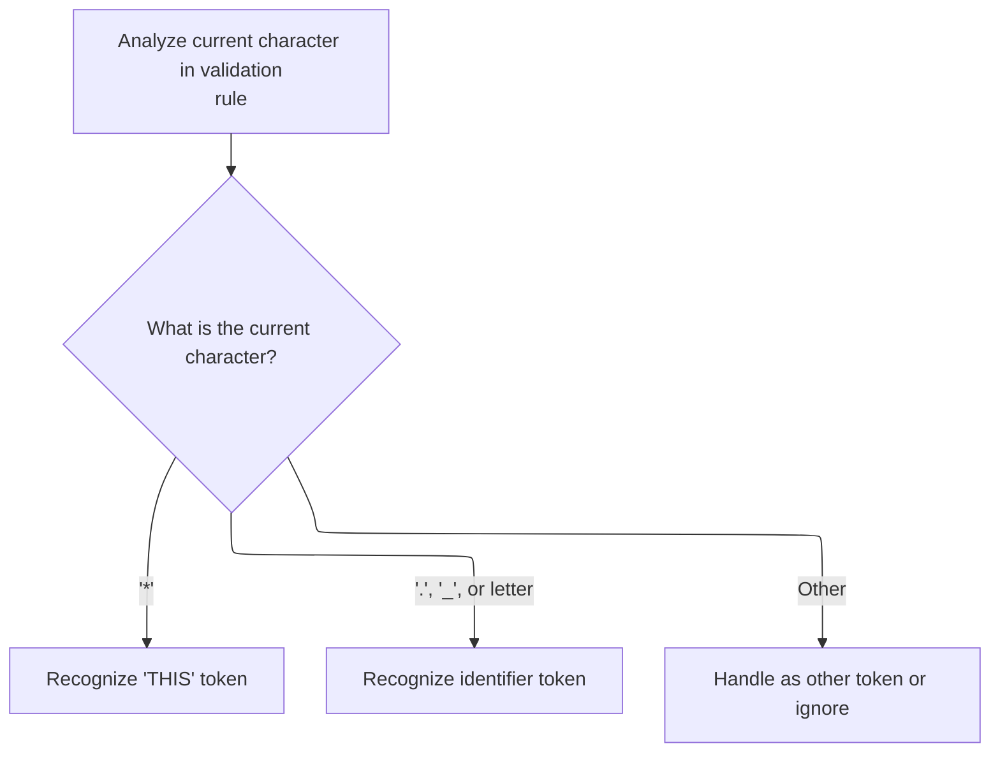
```mermaid
%%{init: {"flowchart": {"defaultRenderer": "elk"}} }%%
flowchart TD
    node1["Analyze current character in validation
rule"]
    click node1 openCode "core/src/main/java/org/apache/struts/validator/validwhen/ValidWhenLexer.java:129:140"
    node1 --> node2{"What is the current character?"}
    click node2 openCode "core/src/main/java/org/apache/struts/validator/validwhen/ValidWhenLexer.java:129:140"
    node2 -->|"'*'"| node3["Recognize 'THIS' token"]
    click node3 openCode "core/src/main/java/org/apache/struts/validator/validwhen/ValidWhenLexer.java:131:133"
    node2 -->|"'.', '_', or letter"| node4["Recognize identifier token"]
    click node4 openCode "core/src/main/java/org/apache/struts/validator/validwhen/ValidWhenLexer.java:135:140"
    node2 -->|"Other"| node5["Handle as other token or ignore"]
    click node5 openCode "core/src/main/java/org/apache/struts/validator/validwhen/ValidWhenLexer.java:129:140"

classDef HeadingStyle fill:#777777,stroke:#333,stroke-width:2px;

%% Swimm:
%% %%{init: {"flowchart": {"defaultRenderer": "elk"}} }%%
%% flowchart TD
%%     node1["Analyze current character in validation
%% rule"]
%%     click node1 openCode "<SwmPath>[core/…/validwhen/ValidWhenLexer.java](core/src/main/java/org/apache/struts/validator/validwhen/ValidWhenLexer.java)</SwmPath>:129:140"
%%     node1 --> node2{"What is the current character?"}
%%     click node2 openCode "<SwmPath>[core/…/validwhen/ValidWhenLexer.java](core/src/main/java/org/apache/struts/validator/validwhen/ValidWhenLexer.java)</SwmPath>:129:140"
%%     node2 -->|"'*'"| node3["Recognize 'THIS' token"]
%%     click node3 openCode "<SwmPath>[core/…/validwhen/ValidWhenLexer.java](core/src/main/java/org/apache/struts/validator/validwhen/ValidWhenLexer.java)</SwmPath>:131:133"
%%     node2 -->|"'.', '_', or letter"| node4["Recognize identifier token"]
%%     click node4 openCode "<SwmPath>[core/…/validwhen/ValidWhenLexer.java](core/src/main/java/org/apache/struts/validator/validwhen/ValidWhenLexer.java)</SwmPath>:135:140"
%%     node2 -->|"Other"| node5["Handle as other token or ignore"]
%%     click node5 openCode "<SwmPath>[core/…/validwhen/ValidWhenLexer.java](core/src/main/java/org/apache/struts/validator/validwhen/ValidWhenLexer.java)</SwmPath>:129:140"
%% 
%% classDef HeadingStyle fill:#777777,stroke:#333,stroke-width:2px;
```

<SwmSnippet path="/core/src/main/java/org/apache/struts/validator/validwhen/ValidWhenLexer.java" line="129">

---

Just returned from <SwmToken path="core/src/main/java/org/apache/struts/validator/validwhen/ValidWhenLexer.java" pos="125:1:1" line-data="					mRPAREN(true);">`mRPAREN`</SwmToken> in <SwmToken path="taglib/src/main/java/org/apache/struts/taglib/logic/PresentTag.java" pos="91:11:11" line-data="                present = request.isUserInRole(st.nextToken());">`nextToken`</SwmToken>. Now we check for '\*', and if found, call <SwmToken path="core/src/main/java/org/apache/struts/validator/validwhen/ValidWhenLexer.java" pos="131:1:1" line-data="					mTHIS(true);">`mTHIS`</SwmToken> to tokenize the special identifier and keep the lexer moving.

```java
				case '*':
				{
					mTHIS(true);
					theRetToken=_returnToken;
					break;
				}
				case '.':  case '_':  case 'a':  case 'b':
				case 'c':  case 'd':  case 'e':  case 'f':
				case 'g':  case 'h':  case 'i':  case 'j':
				case 'k':  case 'l':  case 'm':  case 'n':
				case 'o':  case 'p':  case 'q':  case 'r':
				case 's':  case 't':  case 'u':  case 'v':
```

---

</SwmSnippet>

### Tokenizing Special Identifier

<SwmSnippet path="/core/src/main/java/org/apache/struts/validator/validwhen/ValidWhenLexer.java" line="616">

---

In <SwmToken path="core/src/main/java/org/apache/struts/validator/validwhen/ValidWhenLexer.java" pos="616:7:7" line-data="	public final void mTHIS(boolean _createToken) throws RecognitionException, CharStreamException, TokenStreamException {">`mTHIS`</SwmToken>, we match the '*this*' keyword and prep it as a token. After this, we call ActionConfigMatcher to keep parsing the rule.

```java
	public final void mTHIS(boolean _createToken) throws RecognitionException, CharStreamException, TokenStreamException {
		int _ttype; Token _token=null; int _begin=text.length();
		_ttype = THIS;
		int _saveIndex;
		
		match("*this*");
```

---

</SwmSnippet>

<SwmSnippet path="/core/src/main/java/org/apache/struts/validator/validwhen/ValidWhenLexer.java" line="622">

---

Just returned from ActionConfigMatcher. At the end of <SwmToken path="core/src/main/java/org/apache/struts/validator/validwhen/ValidWhenLexer.java" pos="131:1:1" line-data="					mTHIS(true);">`mTHIS`</SwmToken>, we finalize the special identifier token so the parser can process it as a reserved keyword.

```java
		if ( _createToken && _token==null && _ttype!=Token.SKIP ) {
			_token = makeToken(_ttype);
			_token.setText(new String(text.getBuffer(), _begin, text.length()-_begin));
		}
		_returnToken = _token;
	}
```

---

</SwmSnippet>

### Switching to Identifiers

<SwmSnippet path="/core/src/main/java/org/apache/struts/validator/validwhen/ValidWhenLexer.java" line="141">

---

Just returned from <SwmToken path="core/src/main/java/org/apache/struts/validator/validwhen/ValidWhenLexer.java" pos="131:1:1" line-data="					mTHIS(true);">`mTHIS`</SwmToken> in <SwmToken path="taglib/src/main/java/org/apache/struts/taglib/logic/PresentTag.java" pos="91:11:11" line-data="                present = request.isUserInRole(st.nextToken());">`nextToken`</SwmToken>. Now we check for identifier characters, and if found, call <SwmToken path="core/src/main/java/org/apache/struts/validator/validwhen/ValidWhenLexer.java" pos="143:1:1" line-data="					mIDENTIFIER(true);">`mIDENTIFIER`</SwmToken> to tokenize them and keep the lexer moving.

```java
				case 'w':  case 'x':  case 'y':  case 'z':
				{
					mIDENTIFIER(true);
					theRetToken=_returnToken;
					break;
				}
```

---

</SwmSnippet>

### Tokenizing Identifiers

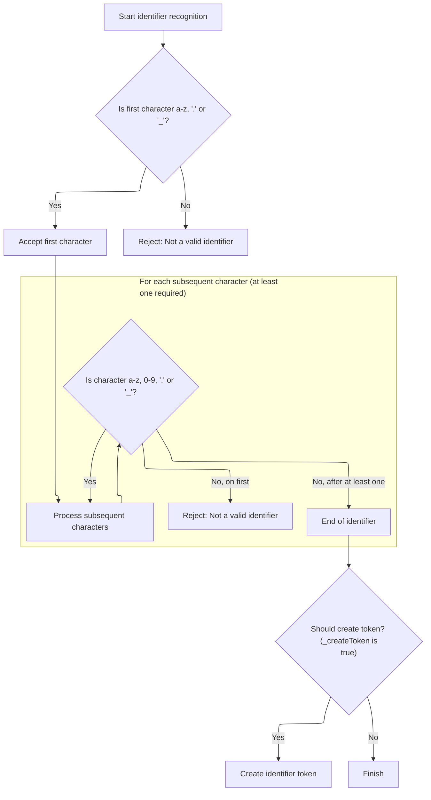
```mermaid
%%{init: {"flowchart": {"defaultRenderer": "elk"}} }%%
flowchart TD
    node1["Start identifier recognition"] --> node2{"Is first character a-z, '.' or '_'?"}
    click node1 openCode "core/src/main/java/org/apache/struts/validator/validwhen/ValidWhenLexer.java:629:634"
    node2 -->|"Yes"| node3["Accept first character"]
    click node2 openCode "core/src/main/java/org/apache/struts/validator/validwhen/ValidWhenLexer.java:635:646"
    node2 -->|"No"| node7["Reject: Not a valid identifier"]
    click node7 openCode "core/src/main/java/org/apache/struts/validator/validwhen/ValidWhenLexer.java:657:660"
    node3 --> node4["Process subsequent characters"]
    click node3 openCode "core/src/main/java/org/apache/struts/validator/validwhen/ValidWhenLexer.java:647:655"
    subgraph loop1["For each subsequent character (at least
one required)"]
      node4 --> node5{"Is character a-z, 0-9, '.' or '_'?"}
      click node5 openCode "core/src/main/java/org/apache/struts/validator/validwhen/ValidWhenLexer.java:667:695"
      node5 -->|"Yes"| node4
      node5 -->|"No, after at least one"| node8["End of identifier"]
      node5 -->|"No, on first"| node12["Reject: Not a valid identifier"]
      click node8 openCode "core/src/main/java/org/apache/struts/validator/validwhen/ValidWhenLexer.java:698:703"
      click node12 openCode "core/src/main/java/org/apache/struts/validator/validwhen/ValidWhenLexer.java:698:699"
    end
    node8 --> node9{"Should create token? (_createToken is
true)"}
    click node9 openCode "core/src/main/java/org/apache/struts/validator/validwhen/ValidWhenLexer.java:704:707"
    node9 -->|"Yes"| node10["Create identifier token"]
    click node10 openCode "core/src/main/java/org/apache/struts/validator/validwhen/ValidWhenLexer.java:705:706"
    node9 -->|"No"| node11["Finish"]
    click node11 openCode "core/src/main/java/org/apache/struts/validator/validwhen/ValidWhenLexer.java:708:709"

classDef HeadingStyle fill:#777777,stroke:#333,stroke-width:2px;

%% Swimm:
%% %%{init: {"flowchart": {"defaultRenderer": "elk"}} }%%
%% flowchart TD
%%     node1["Start identifier recognition"] --> node2{"Is first character a-z, '.' or '_'?"}
%%     click node1 openCode "<SwmPath>[core/…/validwhen/ValidWhenLexer.java](core/src/main/java/org/apache/struts/validator/validwhen/ValidWhenLexer.java)</SwmPath>:629:634"
%%     node2 -->|"Yes"| node3["Accept first character"]
%%     click node2 openCode "<SwmPath>[core/…/validwhen/ValidWhenLexer.java](core/src/main/java/org/apache/struts/validator/validwhen/ValidWhenLexer.java)</SwmPath>:635:646"
%%     node2 -->|"No"| node7["Reject: Not a valid identifier"]
%%     click node7 openCode "<SwmPath>[core/…/validwhen/ValidWhenLexer.java](core/src/main/java/org/apache/struts/validator/validwhen/ValidWhenLexer.java)</SwmPath>:657:660"
%%     node3 --> node4["Process subsequent characters"]
%%     click node3 openCode "<SwmPath>[core/…/validwhen/ValidWhenLexer.java](core/src/main/java/org/apache/struts/validator/validwhen/ValidWhenLexer.java)</SwmPath>:647:655"
%%     subgraph loop1["For each subsequent character (at least
%% one required)"]
%%       node4 --> node5{"Is character a-z, 0-9, '.' or '_'?"}
%%       click node5 openCode "<SwmPath>[core/…/validwhen/ValidWhenLexer.java](core/src/main/java/org/apache/struts/validator/validwhen/ValidWhenLexer.java)</SwmPath>:667:695"
%%       node5 -->|"Yes"| node4
%%       node5 -->|"No, after at least one"| node8["End of identifier"]
%%       node5 -->|"No, on first"| node12["Reject: Not a valid identifier"]
%%       click node8 openCode "<SwmPath>[core/…/validwhen/ValidWhenLexer.java](core/src/main/java/org/apache/struts/validator/validwhen/ValidWhenLexer.java)</SwmPath>:698:703"
%%       click node12 openCode "<SwmPath>[core/…/validwhen/ValidWhenLexer.java](core/src/main/java/org/apache/struts/validator/validwhen/ValidWhenLexer.java)</SwmPath>:698:699"
%%     end
%%     node8 --> node9{"Should create token? (<SwmToken path="core/src/main/java/org/apache/struts/validator/validwhen/ValidWhenLexer.java" pos="250:11:11" line-data="	public final void mDECIMAL_LITERAL(boolean _createToken) throws RecognitionException, CharStreamException, TokenStreamException {">`_createToken`</SwmToken> is
%% true)"}
%%     click node9 openCode "<SwmPath>[core/…/validwhen/ValidWhenLexer.java](core/src/main/java/org/apache/struts/validator/validwhen/ValidWhenLexer.java)</SwmPath>:704:707"
%%     node9 -->|"Yes"| node10["Create identifier token"]
%%     click node10 openCode "<SwmPath>[core/…/validwhen/ValidWhenLexer.java](core/src/main/java/org/apache/struts/validator/validwhen/ValidWhenLexer.java)</SwmPath>:705:706"
%%     node9 -->|"No"| node11["Finish"]
%%     click node11 openCode "<SwmPath>[core/…/validwhen/ValidWhenLexer.java](core/src/main/java/org/apache/struts/validator/validwhen/ValidWhenLexer.java)</SwmPath>:708:709"
%% 
%% classDef HeadingStyle fill:#777777,stroke:#333,stroke-width:2px;
```

<SwmSnippet path="/core/src/main/java/org/apache/struts/validator/validwhen/ValidWhenLexer.java" line="629">

---

In <SwmToken path="core/src/main/java/org/apache/struts/validator/validwhen/ValidWhenLexer.java" pos="629:7:7" line-data="	public final void mIDENTIFIER(boolean _createToken) throws RecognitionException, CharStreamException, TokenStreamException {">`mIDENTIFIER`</SwmToken>, we match letters, digits, dots, and underscores to support property paths and method names. After this, we call ActionConfigMatcher to keep parsing the rule.

```java
	public final void mIDENTIFIER(boolean _createToken) throws RecognitionException, CharStreamException, TokenStreamException {
		int _ttype; Token _token=null; int _begin=text.length();
		_ttype = IDENTIFIER;
		int _saveIndex;
		
		{
		switch ( LA(1)) {
		case 'a':  case 'b':  case 'c':  case 'd':
		case 'e':  case 'f':  case 'g':  case 'h':
		case 'i':  case 'j':  case 'k':  case 'l':
		case 'm':  case 'n':  case 'o':  case 'p':
		case 'q':  case 'r':  case 's':  case 't':
		case 'u':  case 'v':  case 'w':  case 'x':
		case 'y':  case 'z':
		{
			matchRange('a','z');
			break;
		}
		case '.':
		{
			match('.');
			break;
		}
		case '_':
		{
			match('_');
			break;
		}
		default:
		{
			throw new NoViableAltForCharException((char)LA(1), getFilename(), getLine(), getColumn());
		}
		}
		}
		{
		int _cnt62=0;
		_loop62:
		do {
			switch ( LA(1)) {
			case 'a':  case 'b':  case 'c':  case 'd':
			case 'e':  case 'f':  case 'g':  case 'h':
			case 'i':  case 'j':  case 'k':  case 'l':
			case 'm':  case 'n':  case 'o':  case 'p':
			case 'q':  case 'r':  case 's':  case 't':
			case 'u':  case 'v':  case 'w':  case 'x':
			case 'y':  case 'z':
			{
				matchRange('a','z');
				break;
			}
			case '0':  case '1':  case '2':  case '3':
			case '4':  case '5':  case '6':  case '7':
			case '8':  case '9':
			{
				matchRange('0','9');
				break;
			}
			case '.':
			{
				match('.');
				break;
			}
			case '_':
			{
				match('_');
				break;
			}
			default:
			{
				if ( _cnt62>=1 ) { break _loop62; } else {throw new NoViableAltForCharException((char)LA(1), getFilename(), getLine(), getColumn());}
			}
			}
			_cnt62++;
		} while (true);
		}
```

---

</SwmSnippet>

<SwmSnippet path="/core/src/main/java/org/apache/struts/validator/validwhen/ValidWhenLexer.java" line="704">

---

Just returned from ActionConfigMatcher. At the end of <SwmToken path="core/src/main/java/org/apache/struts/validator/validwhen/ValidWhenLexer.java" pos="143:1:1" line-data="					mIDENTIFIER(true);">`mIDENTIFIER`</SwmToken>, we finalize the identifier token so the parser can process variable names or property paths.

```java
		if ( _createToken && _token==null && _ttype!=Token.SKIP ) {
			_token = makeToken(_ttype);
			_token.setText(new String(text.getBuffer(), _begin, text.length()-_begin));
		}
		_returnToken = _token;
	}
```

---

</SwmSnippet>

### Switching to Equality Operators

<SwmSnippet path="/core/src/main/java/org/apache/struts/validator/validwhen/ValidWhenLexer.java" line="147">

---

Just returned from <SwmToken path="core/src/main/java/org/apache/struts/validator/validwhen/ValidWhenLexer.java" pos="143:1:1" line-data="					mIDENTIFIER(true);">`mIDENTIFIER`</SwmToken> in <SwmToken path="taglib/src/main/java/org/apache/struts/taglib/logic/PresentTag.java" pos="91:11:11" line-data="                present = request.isUserInRole(st.nextToken());">`nextToken`</SwmToken>. Now we check for '=', and if found, call <SwmToken path="core/src/main/java/org/apache/struts/validator/validwhen/ValidWhenLexer.java" pos="149:1:1" line-data="					mEQUALSIGN(true);">`mEQUALSIGN`</SwmToken> to tokenize the equality operator and keep the lexer moving.

```java
				case '=':
				{
					mEQUALSIGN(true);
					theRetToken=_returnToken;
					break;
				}
```

---

</SwmSnippet>

### Tokenizing Equality Operator

<SwmSnippet path="/core/src/main/java/org/apache/struts/validator/validwhen/ValidWhenLexer.java" line="711">

---

In <SwmToken path="core/src/main/java/org/apache/struts/validator/validwhen/ValidWhenLexer.java" pos="711:7:7" line-data="	public final void mEQUALSIGN(boolean _createToken) throws RecognitionException, CharStreamException, TokenStreamException {">`mEQUALSIGN`</SwmToken>, we match two '=' characters for the equality operator. After this, we call ActionConfigMatcher to keep parsing the rule.

```java
	public final void mEQUALSIGN(boolean _createToken) throws RecognitionException, CharStreamException, TokenStreamException {
		int _ttype; Token _token=null; int _begin=text.length();
		_ttype = EQUALSIGN;
		int _saveIndex;
		
		match('=');
		match('=');
```

---

</SwmSnippet>

<SwmSnippet path="/core/src/main/java/org/apache/struts/validator/validwhen/ValidWhenLexer.java" line="718">

---

Just returned from ActionConfigMatcher. At the end of <SwmToken path="core/src/main/java/org/apache/struts/validator/validwhen/ValidWhenLexer.java" pos="149:1:1" line-data="					mEQUALSIGN(true);">`mEQUALSIGN`</SwmToken>, we finalize the equality operator token so the parser can process equality checks.

```java
		if ( _createToken && _token==null && _ttype!=Token.SKIP ) {
			_token = makeToken(_ttype);
			_token.setText(new String(text.getBuffer(), _begin, text.length()-_begin));
		}
		_returnToken = _token;
	}
```

---

</SwmSnippet>

### Switching to Not-Equal Operator

<SwmSnippet path="/core/src/main/java/org/apache/struts/validator/validwhen/ValidWhenLexer.java" line="153">

---

After handling '=', we check if the next char is '!' to see if we need to tokenize a not-equal operator. If so, we call <SwmToken path="core/src/main/java/org/apache/struts/validator/validwhen/ValidWhenLexer.java" pos="155:1:1" line-data="					mNOTEQUALSIGN(true);">`mNOTEQUALSIGN`</SwmToken> in <SwmToken path="core/src/main/java/org/apache/struts/validator/validwhen/ValidWhenLexer.java" pos="1:25:25" line-data="// $ANTLR 2.7.7 (20060906): &quot;ValidWhenParser.g&quot; -&gt; &quot;ValidWhenLexer.java&quot;$">`ValidWhenLexer`</SwmToken> to handle it. This modular approach lets the lexer cleanly switch between operators as it parses the input.

```java
				case '!':
				{
					mNOTEQUALSIGN(true);
					theRetToken=_returnToken;
					break;
				}
```

---

</SwmSnippet>

### Tokenizing Not-Equal Operator

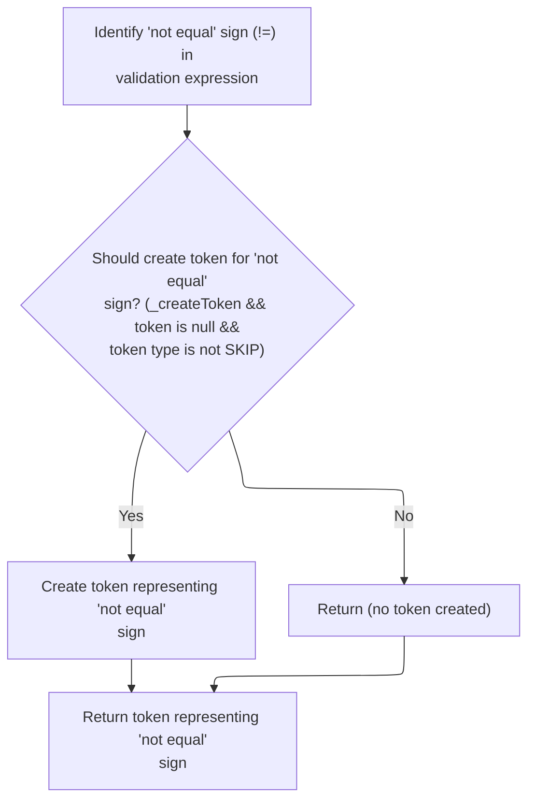
```mermaid
%%{init: {"flowchart": {"defaultRenderer": "elk"}} }%%
flowchart TD
    node1["Identify 'not equal' sign (!=) in
validation expression"] --> node2{"Should create token for 'not equal'
sign? (_createToken && token is null &&
token type is not SKIP)"}
    click node1 openCode "core/src/main/java/org/apache/struts/validator/validwhen/ValidWhenLexer.java:730:731"
    node2 -->|"Yes"| node3["Create token representing 'not equal'
sign"]
    click node2 openCode "core/src/main/java/org/apache/struts/validator/validwhen/ValidWhenLexer.java:732:735"
    click node3 openCode "core/src/main/java/org/apache/struts/validator/validwhen/ValidWhenLexer.java:733:734"
    node2 -->|"No"| node4["Return (no token created)"]
    click node4 openCode "core/src/main/java/org/apache/struts/validator/validwhen/ValidWhenLexer.java:736:737"
    node3 --> node5["Return token representing 'not equal'
sign"]
    click node5 openCode "core/src/main/java/org/apache/struts/validator/validwhen/ValidWhenLexer.java:736:737"
    node4 --> node5

classDef HeadingStyle fill:#777777,stroke:#333,stroke-width:2px;

%% Swimm:
%% %%{init: {"flowchart": {"defaultRenderer": "elk"}} }%%
%% flowchart TD
%%     node1["Identify 'not equal' sign (!=) in
%% validation expression"] --> node2{"Should create token for 'not equal'
%% sign? (<SwmToken path="core/src/main/java/org/apache/struts/validator/validwhen/ValidWhenLexer.java" pos="250:11:11" line-data="	public final void mDECIMAL_LITERAL(boolean _createToken) throws RecognitionException, CharStreamException, TokenStreamException {">`_createToken`</SwmToken> && token is null &&
%% token type is not SKIP)"}
%%     click node1 openCode "<SwmPath>[core/…/validwhen/ValidWhenLexer.java](core/src/main/java/org/apache/struts/validator/validwhen/ValidWhenLexer.java)</SwmPath>:730:731"
%%     node2 -->|"Yes"| node3["Create token representing 'not equal'
%% sign"]
%%     click node2 openCode "<SwmPath>[core/…/validwhen/ValidWhenLexer.java](core/src/main/java/org/apache/struts/validator/validwhen/ValidWhenLexer.java)</SwmPath>:732:735"
%%     click node3 openCode "<SwmPath>[core/…/validwhen/ValidWhenLexer.java](core/src/main/java/org/apache/struts/validator/validwhen/ValidWhenLexer.java)</SwmPath>:733:734"
%%     node2 -->|"No"| node4["Return (no token created)"]
%%     click node4 openCode "<SwmPath>[core/…/validwhen/ValidWhenLexer.java](core/src/main/java/org/apache/struts/validator/validwhen/ValidWhenLexer.java)</SwmPath>:736:737"
%%     node3 --> node5["Return token representing 'not equal'
%% sign"]
%%     click node5 openCode "<SwmPath>[core/…/validwhen/ValidWhenLexer.java](core/src/main/java/org/apache/struts/validator/validwhen/ValidWhenLexer.java)</SwmPath>:736:737"
%%     node4 --> node5
%% 
%% classDef HeadingStyle fill:#777777,stroke:#333,stroke-width:2px;
```

<SwmSnippet path="/core/src/main/java/org/apache/struts/validator/validwhen/ValidWhenLexer.java" line="725">

---

In <SwmToken path="core/src/main/java/org/apache/struts/validator/validwhen/ValidWhenLexer.java" pos="725:7:7" line-data="	public final void mNOTEQUALSIGN(boolean _createToken) throws RecognitionException, CharStreamException, TokenStreamException {">`mNOTEQUALSIGN`</SwmToken>, we match the '!' and '=' characters to recognize the not-equal operator. After this, we call ActionConfigMatcher so the parser can process the token as part of the rule's logic.

```java
	public final void mNOTEQUALSIGN(boolean _createToken) throws RecognitionException, CharStreamException, TokenStreamException {
		int _ttype; Token _token=null; int _begin=text.length();
		_ttype = NOTEQUALSIGN;
		int _saveIndex;
		
		match('!');
		match('=');
```

---

</SwmSnippet>

<SwmSnippet path="/core/src/main/java/org/apache/struts/validator/validwhen/ValidWhenLexer.java" line="732">

---

After ActionConfigMatcher, <SwmToken path="core/src/main/java/org/apache/struts/validator/validwhen/ValidWhenLexer.java" pos="155:1:1" line-data="					mNOTEQUALSIGN(true);">`mNOTEQUALSIGN`</SwmToken> creates the token for '!=', sets its text, and stores it in <SwmToken path="core/src/main/java/org/apache/struts/validator/validwhen/ValidWhenLexer.java" pos="736:1:1" line-data="		_returnToken = _token;">`_returnToken`</SwmToken>. This wraps up the not-equal operator so the parser can use it.

```java
		if ( _createToken && _token==null && _ttype!=Token.SKIP ) {
			_token = makeToken(_ttype);
			_token.setText(new String(text.getBuffer(), _begin, text.length()-_begin));
		}
		_returnToken = _token;
	}
```

---

</SwmSnippet>

### Switching to Less-Than-Or-Equal Operator

<SwmSnippet path="/core/src/main/java/org/apache/struts/validator/validwhen/ValidWhenLexer.java" line="159">

---

After handling '!=', ValidWhenLexer.nextToken checks if the next two chars are '<='. If so, it calls <SwmToken path="core/src/main/java/org/apache/struts/validator/validwhen/ValidWhenLexer.java" pos="161:1:1" line-data="						mLESSEQUALSIGN(true);">`mLESSEQUALSIGN`</SwmToken> to tokenize the less-than-or-equal operator. This lets the lexer handle both single and double character operators cleanly.

```java
				default:
					if ((LA(1)=='<') && (LA(2)=='=')) {
						mLESSEQUALSIGN(true);
```

---

</SwmSnippet>

### Tokenizing Less-Than-Or-Equal Operator

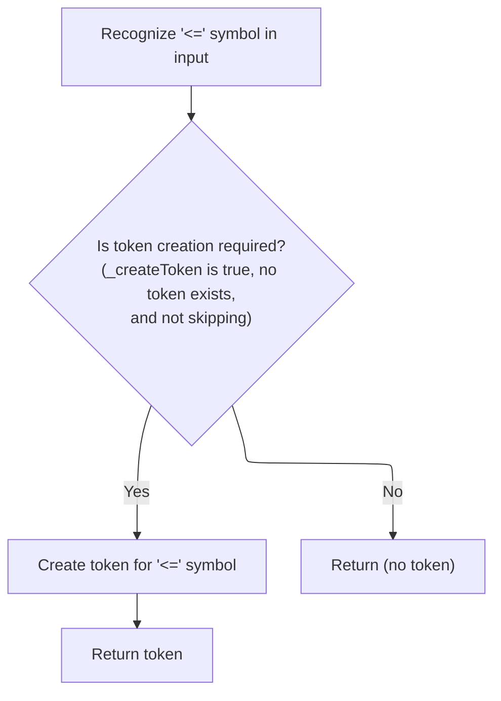
```mermaid
%%{init: {"flowchart": {"defaultRenderer": "elk"}} }%%
flowchart TD
  node1["Recognize '<=' symbol in input"]
  click node1 openCode "core/src/main/java/org/apache/struts/validator/validwhen/ValidWhenLexer.java:770:771"
  node1 --> node2{"Is token creation required?
(_createToken is true, no token exists,
and not skipping)"}
  click node2 openCode "core/src/main/java/org/apache/struts/validator/validwhen/ValidWhenLexer.java:772:775"
  node2 -->|"Yes"| node3["Create token for '<=' symbol"]
  click node3 openCode "core/src/main/java/org/apache/struts/validator/validwhen/ValidWhenLexer.java:773:774"
  node2 -->|"No"| node4["Return (no token)"]
  click node4 openCode "core/src/main/java/org/apache/struts/validator/validwhen/ValidWhenLexer.java:775:777"
  node3 --> node5["Return token"]
  click node5 openCode "core/src/main/java/org/apache/struts/validator/validwhen/ValidWhenLexer.java:776:777"

classDef HeadingStyle fill:#777777,stroke:#333,stroke-width:2px;

%% Swimm:
%% %%{init: {"flowchart": {"defaultRenderer": "elk"}} }%%
%% flowchart TD
%%   node1["Recognize '<=' symbol in input"]
%%   click node1 openCode "<SwmPath>[core/…/validwhen/ValidWhenLexer.java](core/src/main/java/org/apache/struts/validator/validwhen/ValidWhenLexer.java)</SwmPath>:770:771"
%%   node1 --> node2{"Is token creation required?
%% (<SwmToken path="core/src/main/java/org/apache/struts/validator/validwhen/ValidWhenLexer.java" pos="250:11:11" line-data="	public final void mDECIMAL_LITERAL(boolean _createToken) throws RecognitionException, CharStreamException, TokenStreamException {">`_createToken`</SwmToken> is true, no token exists,
%% and not skipping)"}
%%   click node2 openCode "<SwmPath>[core/…/validwhen/ValidWhenLexer.java](core/src/main/java/org/apache/struts/validator/validwhen/ValidWhenLexer.java)</SwmPath>:772:775"
%%   node2 -->|"Yes"| node3["Create token for '<=' symbol"]
%%   click node3 openCode "<SwmPath>[core/…/validwhen/ValidWhenLexer.java](core/src/main/java/org/apache/struts/validator/validwhen/ValidWhenLexer.java)</SwmPath>:773:774"
%%   node2 -->|"No"| node4["Return (no token)"]
%%   click node4 openCode "<SwmPath>[core/…/validwhen/ValidWhenLexer.java](core/src/main/java/org/apache/struts/validator/validwhen/ValidWhenLexer.java)</SwmPath>:775:777"
%%   node3 --> node5["Return token"]
%%   click node5 openCode "<SwmPath>[core/…/validwhen/ValidWhenLexer.java](core/src/main/java/org/apache/struts/validator/validwhen/ValidWhenLexer.java)</SwmPath>:776:777"
%% 
%% classDef HeadingStyle fill:#777777,stroke:#333,stroke-width:2px;
```

<SwmSnippet path="/core/src/main/java/org/apache/struts/validator/validwhen/ValidWhenLexer.java" line="765">

---

In <SwmToken path="core/src/main/java/org/apache/struts/validator/validwhen/ValidWhenLexer.java" pos="765:7:7" line-data="	public final void mLESSEQUALSIGN(boolean _createToken) throws RecognitionException, CharStreamException, TokenStreamException {">`mLESSEQUALSIGN`</SwmToken>, we match '<' and '=' to recognize the less-than-or-equal operator. After this, we call ActionConfigMatcher so the parser can process the token as part of the rule.

```java
	public final void mLESSEQUALSIGN(boolean _createToken) throws RecognitionException, CharStreamException, TokenStreamException {
		int _ttype; Token _token=null; int _begin=text.length();
		_ttype = LESSEQUALSIGN;
		int _saveIndex;
		
		match('<');
		match('=');
```

---

</SwmSnippet>

<SwmSnippet path="/core/src/main/java/org/apache/struts/validator/validwhen/ValidWhenLexer.java" line="772">

---

After ActionConfigMatcher, <SwmToken path="core/src/main/java/org/apache/struts/validator/validwhen/ValidWhenLexer.java" pos="161:1:1" line-data="						mLESSEQUALSIGN(true);">`mLESSEQUALSIGN`</SwmToken> creates the token for '<=', sets its text, and stores it in <SwmToken path="core/src/main/java/org/apache/struts/validator/validwhen/ValidWhenLexer.java" pos="776:1:1" line-data="		_returnToken = _token;">`_returnToken`</SwmToken>. This finalizes the less-than-or-equal operator for the parser.

```java
		if ( _createToken && _token==null && _ttype!=Token.SKIP ) {
			_token = makeToken(_ttype);
			_token.setText(new String(text.getBuffer(), _begin, text.length()-_begin));
		}
		_returnToken = _token;
	}
```

---

</SwmSnippet>

### Switching to Greater-Than-Or-Equal Operator

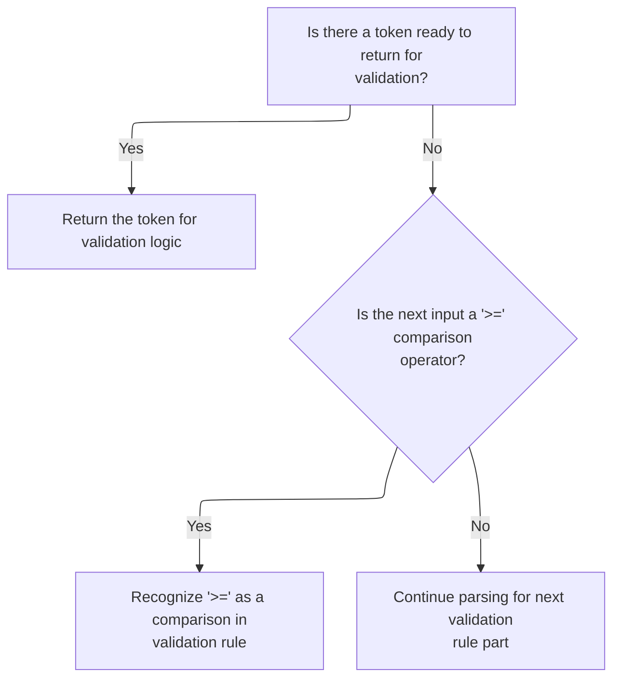
```mermaid
%%{init: {"flowchart": {"defaultRenderer": "elk"}} }%%
flowchart TD
    node1["Is there a token ready to return for
validation?"]
    click node1 openCode "core/src/main/java/org/apache/struts/validator/validwhen/ValidWhenLexer.java:162:163"
    node1 -->|"Yes"| node2["Return the token for validation logic"]
    click node2 openCode "core/src/main/java/org/apache/struts/validator/validwhen/ValidWhenLexer.java:162:163"
    node1 -->|"No"| node3{"Is the next input a '>=' comparison
operator?"}
    click node3 openCode "core/src/main/java/org/apache/struts/validator/validwhen/ValidWhenLexer.java:164:165"
    node3 -->|"Yes"| node4["Recognize '>=' as a comparison in
validation rule"]
    click node4 openCode "core/src/main/java/org/apache/struts/validator/validwhen/ValidWhenLexer.java:165:165"
    node3 -->|"No"| node5["Continue parsing for next validation
rule part"]
    click node5 openCode "core/src/main/java/org/apache/struts/validator/validwhen/ValidWhenLexer.java:163:165"

classDef HeadingStyle fill:#777777,stroke:#333,stroke-width:2px;

%% Swimm:
%% %%{init: {"flowchart": {"defaultRenderer": "elk"}} }%%
%% flowchart TD
%%     node1["Is there a token ready to return for
%% validation?"]
%%     click node1 openCode "<SwmPath>[core/…/validwhen/ValidWhenLexer.java](core/src/main/java/org/apache/struts/validator/validwhen/ValidWhenLexer.java)</SwmPath>:162:163"
%%     node1 -->|"Yes"| node2["Return the token for validation logic"]
%%     click node2 openCode "<SwmPath>[core/…/validwhen/ValidWhenLexer.java](core/src/main/java/org/apache/struts/validator/validwhen/ValidWhenLexer.java)</SwmPath>:162:163"
%%     node1 -->|"No"| node3{"Is the next input a '>=' comparison
%% operator?"}
%%     click node3 openCode "<SwmPath>[core/…/validwhen/ValidWhenLexer.java](core/src/main/java/org/apache/struts/validator/validwhen/ValidWhenLexer.java)</SwmPath>:164:165"
%%     node3 -->|"Yes"| node4["Recognize '>=' as a comparison in
%% validation rule"]
%%     click node4 openCode "<SwmPath>[core/…/validwhen/ValidWhenLexer.java](core/src/main/java/org/apache/struts/validator/validwhen/ValidWhenLexer.java)</SwmPath>:165:165"
%%     node3 -->|"No"| node5["Continue parsing for next validation
%% rule part"]
%%     click node5 openCode "<SwmPath>[core/…/validwhen/ValidWhenLexer.java](core/src/main/java/org/apache/struts/validator/validwhen/ValidWhenLexer.java)</SwmPath>:163:165"
%% 
%% classDef HeadingStyle fill:#777777,stroke:#333,stroke-width:2px;
```

<SwmSnippet path="/core/src/main/java/org/apache/struts/validator/validwhen/ValidWhenLexer.java" line="162">

---

After handling '<=', ValidWhenLexer.nextToken checks if the next two chars are '>=', and calls <SwmToken path="core/src/main/java/org/apache/struts/validator/validwhen/ValidWhenLexer.java" pos="165:1:1" line-data="						mGREATEREQUALSIGN(true);">`mGREATEREQUALSIGN`</SwmToken> if so. This lets the lexer handle both single and double character operators without ambiguity.

```java
						theRetToken=_returnToken;
					}
					else if ((LA(1)=='>') && (LA(2)=='=')) {
						mGREATEREQUALSIGN(true);
```

---

</SwmSnippet>

### Tokenizing Greater-Than-Or-Equal Operator

<SwmSnippet path="/core/src/main/java/org/apache/struts/validator/validwhen/ValidWhenLexer.java" line="779">

---

In <SwmToken path="core/src/main/java/org/apache/struts/validator/validwhen/ValidWhenLexer.java" pos="779:7:7" line-data="	public final void mGREATEREQUALSIGN(boolean _createToken) throws RecognitionException, CharStreamException, TokenStreamException {">`mGREATEREQUALSIGN`</SwmToken>, we match '>' and '=' to recognize the greater-than-or-equal operator. After this, we call ActionConfigMatcher so the parser can process the token as part of the rule.

```java
	public final void mGREATEREQUALSIGN(boolean _createToken) throws RecognitionException, CharStreamException, TokenStreamException {
		int _ttype; Token _token=null; int _begin=text.length();
		_ttype = GREATEREQUALSIGN;
		int _saveIndex;
		
		match('>');
		match('=');
```

---

</SwmSnippet>

<SwmSnippet path="/core/src/main/java/org/apache/struts/validator/validwhen/ValidWhenLexer.java" line="786">

---

After ActionConfigMatcher, <SwmToken path="core/src/main/java/org/apache/struts/validator/validwhen/ValidWhenLexer.java" pos="165:1:1" line-data="						mGREATEREQUALSIGN(true);">`mGREATEREQUALSIGN`</SwmToken> creates the token for '>=', sets its text, and stores it in <SwmToken path="core/src/main/java/org/apache/struts/validator/validwhen/ValidWhenLexer.java" pos="790:1:1" line-data="		_returnToken = _token;">`_returnToken`</SwmToken>. This finalizes the greater-than-or-equal operator for the parser.

```java
		if ( _createToken && _token==null && _ttype!=Token.SKIP ) {
			_token = makeToken(_ttype);
			_token.setText(new String(text.getBuffer(), _begin, text.length()-_begin));
		}
		_returnToken = _token;
	}
```

---

</SwmSnippet>

### Switching to Less-Than or Greater-Than Operators

<SwmSnippet path="/core/src/main/java/org/apache/struts/validator/validwhen/ValidWhenLexer.java" line="166">

---

After handling '>=', ValidWhenLexer.nextToken checks for single '<' or '>' characters and calls <SwmToken path="core/src/main/java/org/apache/struts/validator/validwhen/ValidWhenLexer.java" pos="169:1:1" line-data="						mLESSTHANSIGN(true);">`mLESSTHANSIGN`</SwmToken> or <SwmToken path="core/src/main/java/org/apache/struts/validator/validwhen/ValidWhenLexer.java" pos="173:1:1" line-data="						mGREATERTHANSIGN(true);">`mGREATERTHANSIGN`</SwmToken> as needed. If the input doesn't match, it checks for EOF or throws an exception for unknown input.

```java
						theRetToken=_returnToken;
					}
					else if ((LA(1)=='<') && (true)) {
						mLESSTHANSIGN(true);
```

---

</SwmSnippet>

### Tokenizing Less-Than Operator

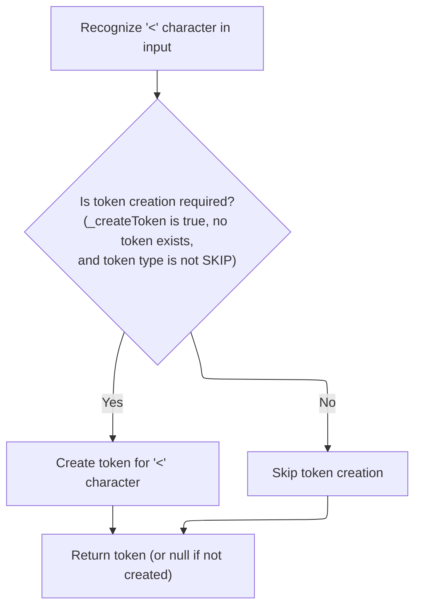
```mermaid
%%{init: {"flowchart": {"defaultRenderer": "elk"}} }%%
flowchart TD
  node1["Recognize '<' character in input"]
  click node1 openCode "core/src/main/java/org/apache/struts/validator/validwhen/ValidWhenLexer.java:744:744"
  node1 --> node2{"Is token creation required?
(_createToken is true, no token exists,
and token type is not SKIP)"}
  click node2 openCode "core/src/main/java/org/apache/struts/validator/validwhen/ValidWhenLexer.java:745:745"
  node2 -->|"Yes"| node3["Create token for '<' character"]
  click node3 openCode "core/src/main/java/org/apache/struts/validator/validwhen/ValidWhenLexer.java:746:747"
  node2 -->|"No"| node4["Skip token creation"]
  click node4 openCode "core/src/main/java/org/apache/struts/validator/validwhen/ValidWhenLexer.java:749:750"
  node3 --> node5["Return token (or null if not created)"]
  node4 --> node5
  click node5 openCode "core/src/main/java/org/apache/struts/validator/validwhen/ValidWhenLexer.java:749:750"
classDef HeadingStyle fill:#777777,stroke:#333,stroke-width:2px;

%% Swimm:
%% %%{init: {"flowchart": {"defaultRenderer": "elk"}} }%%
%% flowchart TD
%%   node1["Recognize '<' character in input"]
%%   click node1 openCode "<SwmPath>[core/…/validwhen/ValidWhenLexer.java](core/src/main/java/org/apache/struts/validator/validwhen/ValidWhenLexer.java)</SwmPath>:744:744"
%%   node1 --> node2{"Is token creation required?
%% (<SwmToken path="core/src/main/java/org/apache/struts/validator/validwhen/ValidWhenLexer.java" pos="250:11:11" line-data="	public final void mDECIMAL_LITERAL(boolean _createToken) throws RecognitionException, CharStreamException, TokenStreamException {">`_createToken`</SwmToken> is true, no token exists,
%% and token type is not SKIP)"}
%%   click node2 openCode "<SwmPath>[core/…/validwhen/ValidWhenLexer.java](core/src/main/java/org/apache/struts/validator/validwhen/ValidWhenLexer.java)</SwmPath>:745:745"
%%   node2 -->|"Yes"| node3["Create token for '<' character"]
%%   click node3 openCode "<SwmPath>[core/…/validwhen/ValidWhenLexer.java](core/src/main/java/org/apache/struts/validator/validwhen/ValidWhenLexer.java)</SwmPath>:746:747"
%%   node2 -->|"No"| node4["Skip token creation"]
%%   click node4 openCode "<SwmPath>[core/…/validwhen/ValidWhenLexer.java](core/src/main/java/org/apache/struts/validator/validwhen/ValidWhenLexer.java)</SwmPath>:749:750"
%%   node3 --> node5["Return token (or null if not created)"]
%%   node4 --> node5
%%   click node5 openCode "<SwmPath>[core/…/validwhen/ValidWhenLexer.java](core/src/main/java/org/apache/struts/validator/validwhen/ValidWhenLexer.java)</SwmPath>:749:750"
%% classDef HeadingStyle fill:#777777,stroke:#333,stroke-width:2px;
```

<SwmSnippet path="/core/src/main/java/org/apache/struts/validator/validwhen/ValidWhenLexer.java" line="739">

---

In <SwmToken path="core/src/main/java/org/apache/struts/validator/validwhen/ValidWhenLexer.java" pos="739:7:7" line-data="	public final void mLESSTHANSIGN(boolean _createToken) throws RecognitionException, CharStreamException, TokenStreamException {">`mLESSTHANSIGN`</SwmToken>, we match just the '<' character for the less-than operator. After this, we call ActionConfigMatcher so the parser can process the token as part of the rule.

```java
	public final void mLESSTHANSIGN(boolean _createToken) throws RecognitionException, CharStreamException, TokenStreamException {
		int _ttype; Token _token=null; int _begin=text.length();
		_ttype = LESSTHANSIGN;
		int _saveIndex;
		
		match('<');
```

---

</SwmSnippet>

<SwmSnippet path="/core/src/main/java/org/apache/struts/validator/validwhen/ValidWhenLexer.java" line="745">

---

After ActionConfigMatcher, <SwmToken path="core/src/main/java/org/apache/struts/validator/validwhen/ValidWhenLexer.java" pos="169:1:1" line-data="						mLESSTHANSIGN(true);">`mLESSTHANSIGN`</SwmToken> creates the token for '<', sets its text, and stores it in <SwmToken path="core/src/main/java/org/apache/struts/validator/validwhen/ValidWhenLexer.java" pos="749:1:1" line-data="		_returnToken = _token;">`_returnToken`</SwmToken>. This finalizes the less-than operator for the parser.

```java
		if ( _createToken && _token==null && _ttype!=Token.SKIP ) {
			_token = makeToken(_ttype);
			_token.setText(new String(text.getBuffer(), _begin, text.length()-_begin));
		}
		_returnToken = _token;
	}
```

---

</SwmSnippet>

### Switching to Greater-Than Operator

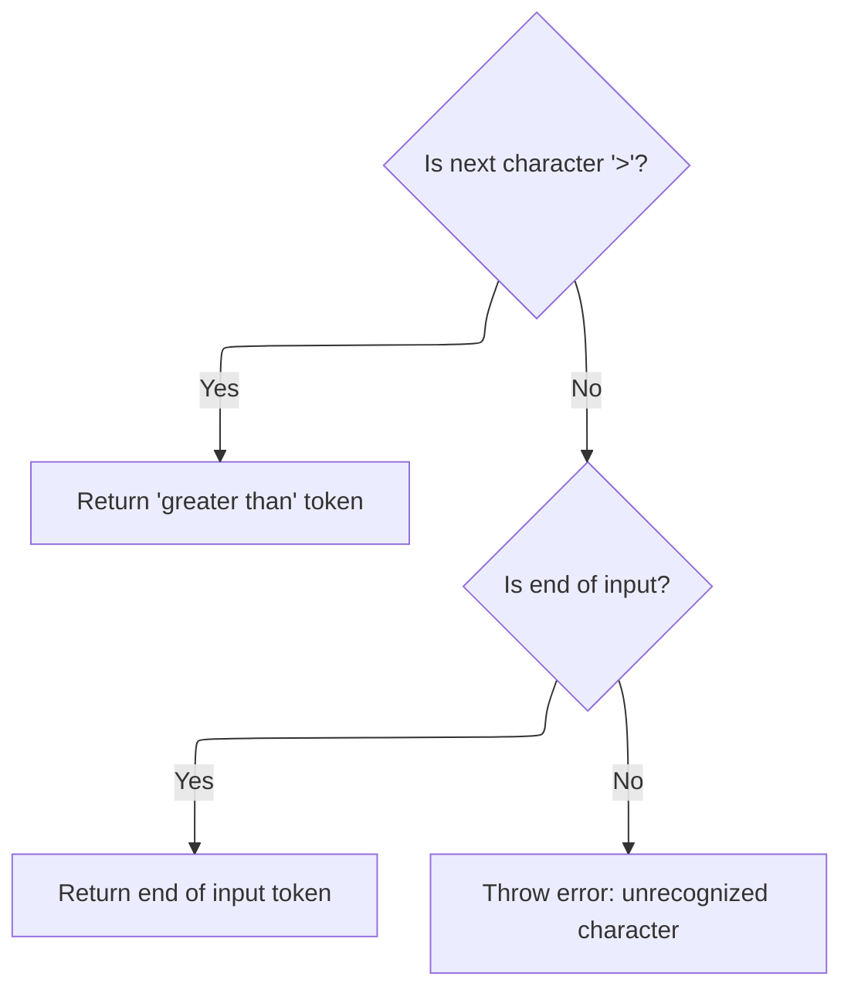
```mermaid
%%{init: {"flowchart": {"defaultRenderer": "elk"}} }%%
flowchart TD
    node1{"Is next character '>'?"}
    click node1 openCode "core/src/main/java/org/apache/struts/validator/validwhen/ValidWhenLexer.java:172:175"
    node1 -->|"Yes"| node2["Return 'greater than' token"]
    click node2 openCode "core/src/main/java/org/apache/struts/validator/validwhen/ValidWhenLexer.java:173:174"
    node1 -->|"No"| node3{"Is end of input?"}
    click node3 openCode "core/src/main/java/org/apache/struts/validator/validwhen/ValidWhenLexer.java:176:177"
    node3 -->|"Yes"| node4["Return end of input token"]
    click node4 openCode "core/src/main/java/org/apache/struts/validator/validwhen/ValidWhenLexer.java:177:177"
    node3 -->|"No"| node5["Throw error: unrecognized character"]
    click node5 openCode "core/src/main/java/org/apache/struts/validator/validwhen/ValidWhenLexer.java:178:178"

classDef HeadingStyle fill:#777777,stroke:#333,stroke-width:2px;

%% Swimm:
%% %%{init: {"flowchart": {"defaultRenderer": "elk"}} }%%
%% flowchart TD
%%     node1{"Is next character '>'?"}
%%     click node1 openCode "<SwmPath>[core/…/validwhen/ValidWhenLexer.java](core/src/main/java/org/apache/struts/validator/validwhen/ValidWhenLexer.java)</SwmPath>:172:175"
%%     node1 -->|"Yes"| node2["Return 'greater than' token"]
%%     click node2 openCode "<SwmPath>[core/…/validwhen/ValidWhenLexer.java](core/src/main/java/org/apache/struts/validator/validwhen/ValidWhenLexer.java)</SwmPath>:173:174"
%%     node1 -->|"No"| node3{"Is end of input?"}
%%     click node3 openCode "<SwmPath>[core/…/validwhen/ValidWhenLexer.java](core/src/main/java/org/apache/struts/validator/validwhen/ValidWhenLexer.java)</SwmPath>:176:177"
%%     node3 -->|"Yes"| node4["Return end of input token"]
%%     click node4 openCode "<SwmPath>[core/…/validwhen/ValidWhenLexer.java](core/src/main/java/org/apache/struts/validator/validwhen/ValidWhenLexer.java)</SwmPath>:177:177"
%%     node3 -->|"No"| node5["Throw error: unrecognized character"]
%%     click node5 openCode "<SwmPath>[core/…/validwhen/ValidWhenLexer.java](core/src/main/java/org/apache/struts/validator/validwhen/ValidWhenLexer.java)</SwmPath>:178:178"
%% 
%% classDef HeadingStyle fill:#777777,stroke:#333,stroke-width:2px;
```

<SwmSnippet path="/core/src/main/java/org/apache/struts/validator/validwhen/ValidWhenLexer.java" line="170">

---

After handling '<', ValidWhenLexer.nextToken checks for a single '>' character and calls <SwmToken path="core/src/main/java/org/apache/struts/validator/validwhen/ValidWhenLexer.java" pos="173:1:1" line-data="						mGREATERTHANSIGN(true);">`mGREATERTHANSIGN`</SwmToken> if found. If the input doesn't match, it checks for EOF or throws an exception for unknown input.

```java
						theRetToken=_returnToken;
					}
					else if ((LA(1)=='>') && (true)) {
						mGREATERTHANSIGN(true);
						theRetToken=_returnToken;
					}
				else {
					if (LA(1)==EOF_CHAR) {uponEOF(); _returnToken = makeToken(Token.EOF_TYPE);}
				else {throw new NoViableAltForCharException((char)LA(1), getFilename(), getLine(), getColumn());}
				}
				}
```

---

</SwmSnippet>

### Tokenizing Greater-Than Operator

<SwmSnippet path="/core/src/main/java/org/apache/struts/validator/validwhen/ValidWhenLexer.java" line="752">

---

In <SwmToken path="core/src/main/java/org/apache/struts/validator/validwhen/ValidWhenLexer.java" pos="752:7:7" line-data="	public final void mGREATERTHANSIGN(boolean _createToken) throws RecognitionException, CharStreamException, TokenStreamException {">`mGREATERTHANSIGN`</SwmToken>, we match just the '>' character for the greater-than operator. After this, we call ActionConfigMatcher so the parser can process the token as part of the rule.

```java
	public final void mGREATERTHANSIGN(boolean _createToken) throws RecognitionException, CharStreamException, TokenStreamException {
		int _ttype; Token _token=null; int _begin=text.length();
		_ttype = GREATERTHANSIGN;
		int _saveIndex;
		
		match('>');
```

---

</SwmSnippet>

<SwmSnippet path="/core/src/main/java/org/apache/struts/validator/validwhen/ValidWhenLexer.java" line="758">

---

After ActionConfigMatcher, <SwmToken path="core/src/main/java/org/apache/struts/validator/validwhen/ValidWhenLexer.java" pos="173:1:1" line-data="						mGREATERTHANSIGN(true);">`mGREATERTHANSIGN`</SwmToken> creates the token for '>', sets its text, and stores it in <SwmToken path="core/src/main/java/org/apache/struts/validator/validwhen/ValidWhenLexer.java" pos="762:1:1" line-data="		_returnToken = _token;">`_returnToken`</SwmToken>. This finalizes the greater-than operator for the parser.

```java
		if ( _createToken && _token==null && _ttype!=Token.SKIP ) {
			_token = makeToken(_ttype);
			_token.setText(new String(text.getBuffer(), _begin, text.length()-_begin));
		}
		_returnToken = _token;
	}
```

---

</SwmSnippet>

### Finalizing and Returning the Token

<SwmSnippet path="/core/src/main/java/org/apache/struts/validator/validwhen/ValidWhenLexer.java" line="181">

---

At the end of ValidWhenLexer.nextToken, we finalize the token type, update it if needed, and return the token to the parser. Any exceptions are wrapped and rethrown so the caller can handle them.

```java
				if ( _returnToken==null ) continue tryAgain; // found SKIP token
				_ttype = _returnToken.getType();
				_ttype = testLiteralsTable(_ttype);
				_returnToken.setType(_ttype);
				return _returnToken;
			}
			catch (RecognitionException e) {
				throw new TokenStreamRecognitionException(e);
			}
		}
		catch (CharStreamException cse) {
			if ( cse instanceof CharStreamIOException ) {
				throw new TokenStreamIOException(((CharStreamIOException)cse).io);
			}
			else {
				throw new TokenStreamException(cse.getMessage());
			}
		}
	}
}
```

---

</SwmSnippet>

## Handling User Presence and Error Cases

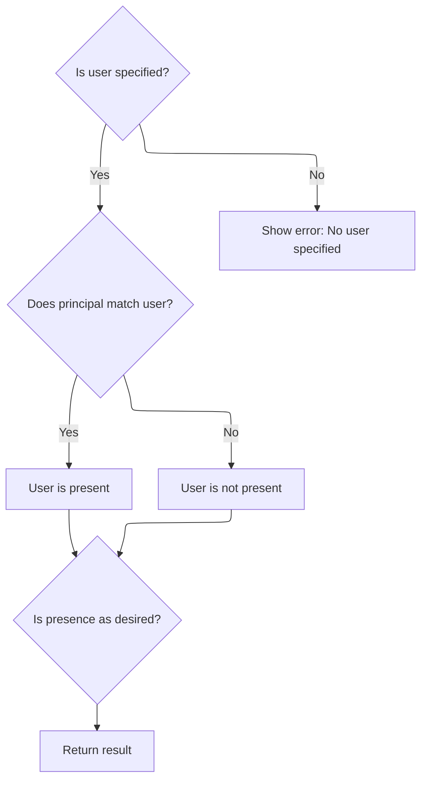
```mermaid
%%{init: {"flowchart": {"defaultRenderer": "elk"}} }%%
flowchart TD
    node1{"Is user specified?"}
    click node1 openCode "taglib/src/main/java/org/apache/struts/taglib/logic/PresentTag.java:93:97"
    node1 -->|"Yes"| node2{"Does principal match user?"}
    click node2 openCode "taglib/src/main/java/org/apache/struts/taglib/logic/PresentTag.java:94:96"
    node2 -->|"Yes"| node3["User is present"]
    click node3 openCode "taglib/src/main/java/org/apache/struts/taglib/logic/PresentTag.java:96:96"
    node2 -->|"No"| node4["User is not present"]
    click node4 openCode "taglib/src/main/java/org/apache/struts/taglib/logic/PresentTag.java:96:96"
    node1 -->|"No"| node5["Show error: No user specified"]
    click node5 openCode "taglib/src/main/java/org/apache/struts/taglib/logic/PresentTag.java:98:102"
    node3 --> node6{"Is presence as desired?"}
    click node6 openCode "taglib/src/main/java/org/apache/struts/taglib/logic/PresentTag.java:105:106"
    node4 --> node6
    node6 --> node7["Return result"]
    click node7 openCode "taglib/src/main/java/org/apache/struts/taglib/logic/PresentTag.java:105:106"

classDef HeadingStyle fill:#777777,stroke:#333,stroke-width:2px;

%% Swimm:
%% %%{init: {"flowchart": {"defaultRenderer": "elk"}} }%%
%% flowchart TD
%%     node1{"Is user specified?"}
%%     click node1 openCode "<SwmPath>[taglib/…/logic/PresentTag.java](taglib/src/main/java/org/apache/struts/taglib/logic/PresentTag.java)</SwmPath>:93:97"
%%     node1 -->|"Yes"| node2{"Does principal match user?"}
%%     click node2 openCode "<SwmPath>[taglib/…/logic/PresentTag.java](taglib/src/main/java/org/apache/struts/taglib/logic/PresentTag.java)</SwmPath>:94:96"
%%     node2 -->|"Yes"| node3["User is present"]
%%     click node3 openCode "<SwmPath>[taglib/…/logic/PresentTag.java](taglib/src/main/java/org/apache/struts/taglib/logic/PresentTag.java)</SwmPath>:96:96"
%%     node2 -->|"No"| node4["User is not present"]
%%     click node4 openCode "<SwmPath>[taglib/…/logic/PresentTag.java](taglib/src/main/java/org/apache/struts/taglib/logic/PresentTag.java)</SwmPath>:96:96"
%%     node1 -->|"No"| node5["Show error: No user specified"]
%%     click node5 openCode "<SwmPath>[taglib/…/logic/PresentTag.java](taglib/src/main/java/org/apache/struts/taglib/logic/PresentTag.java)</SwmPath>:98:102"
%%     node3 --> node6{"Is presence as desired?"}
%%     click node6 openCode "<SwmPath>[taglib/…/logic/PresentTag.java](taglib/src/main/java/org/apache/struts/taglib/logic/PresentTag.java)</SwmPath>:105:106"
%%     node4 --> node6
%%     node6 --> node7["Return result"]
%%     click node7 openCode "<SwmPath>[taglib/…/logic/PresentTag.java](taglib/src/main/java/org/apache/struts/taglib/logic/PresentTag.java)</SwmPath>:105:106"
%% 
%% classDef HeadingStyle fill:#777777,stroke:#333,stroke-width:2px;
```

<SwmSnippet path="/taglib/src/main/java/org/apache/struts/taglib/logic/PresentTag.java" line="93">

---

After all the presence checks, PresentTag.condition handles the user presence check and, if no fields are set, throws a <SwmToken path="taglib/src/main/java/org/apache/struts/taglib/logic/PresentTag.java" pos="98:1:1" line-data="            JspException e =">`JspException`</SwmToken> with a message from <SwmToken path="taglib/src/main/java/org/apache/struts/taglib/logic/PresentTag.java" pos="99:5:7" line-data="                new JspException(messages.getMessage(&quot;logic.selector&quot;));">`messages.getMessage`</SwmToken>. This covers the error case where the tag is misconfigured.

```java
        } else if (user != null) {
            Principal principal = request.getUserPrincipal();

            present = (principal != null) && user.equals(principal.getName());
        } else {
            JspException e =
                new JspException(messages.getMessage("logic.selector"));

```

---

</SwmSnippet>

<SwmSnippet path="/core/src/main/java/org/apache/struts/util/MessageResources.java" line="196">

---

GetMessage just fetches the error message string for the given key. PresentTag.condition uses this to get the exception message when the tag is misconfigured.

```java
    public String getMessage(String key) {
        return this.getMessage((Locale) null, key, null);
    }
```

---

</SwmSnippet>

<SwmSnippet path="/taglib/src/main/java/org/apache/struts/taglib/logic/PresentTag.java" line="101">

---

At the end of PresentTag.condition, if a <SwmToken path="taglib/src/main/java/org/apache/struts/taglib/logic/PresentTag.java" pos="68:3:3" line-data="        throws JspException {">`JspException`</SwmToken> is thrown, we call TagUtils.saveException to stash the exception in the page context. Then we rethrow. The function finally returns whether the presence check matched the desired value.

```java
            TagUtils.getInstance().saveException(pageContext, e);
            throw e;
        }

        return (present == desired);
    }
```

---

</SwmSnippet>

<SwmSnippet path="/tiles/src/main/java/org/apache/struts/tiles/taglib/util/TagUtils.java" line="301">

---

SaveException just puts the exception in the page context under a known key. This makes it available for error pages or handlers to pick up and display or log.

```java
    public static void saveException(PageContext pageContext, Throwable exception) {
        pageContext.setAttribute(Globals.EXCEPTION_KEY, exception, PageContext.REQUEST_SCOPE);
    }
```

---

</SwmSnippet>

&nbsp;

*This is an auto-generated document by Swimm 🌊 and has not yet been verified by a human*

<SwmMeta version="3.0.0" repo-id="Z2l0aHViJTNBJTNBc3RydXRzMSUzQSUzQVN3aW1tLURlbW8=" repo-name="struts1"><sup>Powered by [Swimm](https://app.swimm.io/)</sup></SwmMeta>
