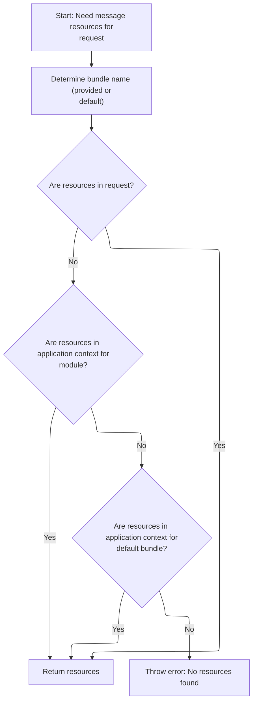
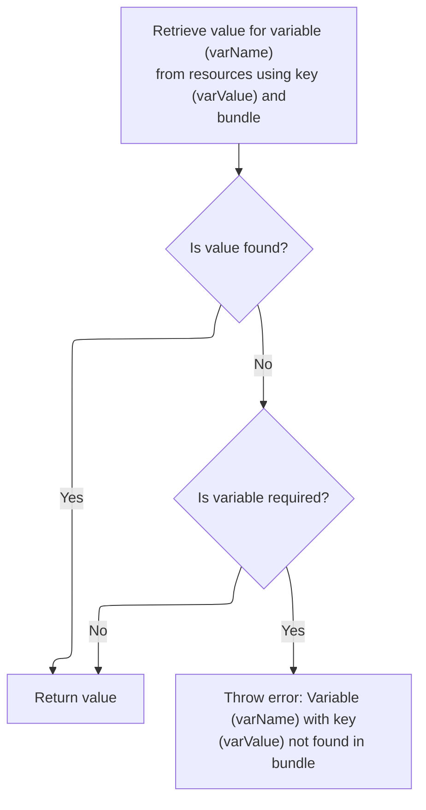
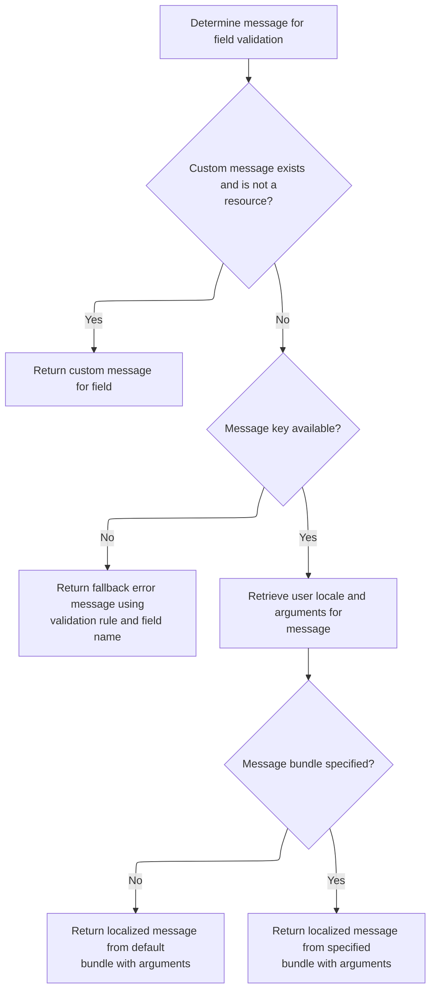

This document describes how the system determines if a form field is required based on configurable conditions involving other fields. Multiple conditions can be combined using AND/OR logic. If a required field is left blank, a localized error message is generated using resource bundles, with support for localizing message arguments.

# Evaluating Conditional Required Logic

<SwmSnippet path="/core/src/main/java/org/apache/struts/validator/FieldChecks.java" line="159">

---

In <SwmToken path="core/src/main/java/org/apache/struts/validator/FieldChecks.java" pos="159:7:7" line-data="    public static boolean validateRequiredIf(Object bean, ValidatorAction va,">`validateRequiredIf`</SwmToken>, we're setting up the logic for whether a field is required based on other fields. The <SwmToken path="core/src/main/java/org/apache/struts/validator/FieldChecks.java" pos="175:3:3" line-data="        String fieldJoin = &quot;AND&quot;;">`fieldJoin`</SwmToken> variable decides if all conditions ('AND') or any condition ('OR') triggers the requirement. We loop through dependent fields using indexed names like 'field\[0\]', '<SwmToken path="core/src/main/java/org/apache/struts/validator/FieldChecks.java" pos="188:12:12" line-data="            String dependTest = field.getVarValue(&quot;fieldTest[&quot; + i + &quot;]&quot;);">`fieldTest`</SwmToken>\[0\]', etc., so you can have multiple dynamic conditions. Once we've figured out if the field is required, we need to fetch error messages and localized values, which is why we call into <SwmPath>[core/…/validator/Resources.java](core/src/main/java/org/apache/struts/validator/Resources.java)</SwmPath> next.

```java
    public static boolean validateRequiredIf(Object bean, ValidatorAction va,
        Field field, ActionMessages errors, Validator validator,
        HttpServletRequest request) {
        Object form =
            validator.getParameterValue(org.apache.commons.validator.Validator.BEAN_PARAM);
        String value = null;
        boolean required = false;

        try {
            value = evaluateBean(bean, field);
        } catch (Exception e) {
            processFailure(errors, field, validator.getFormName(), "requiredif", e);
            return false;
        }

        int i = 0;
        String fieldJoin = "AND";

        if (!GenericValidator.isBlankOrNull(field.getVarValue("fieldJoin"))) {
            fieldJoin = field.getVarValue("fieldJoin");
        }

        if (fieldJoin.equalsIgnoreCase("AND")) {
            required = true;
        }

        while (!GenericValidator.isBlankOrNull(field.getVarValue("field[" + i
                    + "]"))) {
            String dependProp = field.getVarValue("field[" + i + "]");
            String dependTest = field.getVarValue("fieldTest[" + i + "]");
            String dependTestValue = field.getVarValue("fieldValue[" + i + "]");
            String dependIndexed = field.getVarValue("fieldIndexed[" + i + "]");

```

---

</SwmSnippet>

## Resolving Variable Values and Resources

<SwmSnippet path="/core/src/main/java/org/apache/struts/validator/Resources.java" line="190">

---

In <SwmToken path="core/src/main/java/org/apache/struts/validator/Resources.java" pos="190:7:7" line-data="    public static String getVarValue(Var var, ServletContext application,">`getVarValue`</SwmToken>, we're checking if the variable is a resource. If it isn't, we just use its value. If it is, we need to fetch the localized value from <SwmToken path="core/src/main/java/org/apache/struts/validator/Resources.java" pos="202:1:1" line-data="        MessageResources messages =">`MessageResources`</SwmToken>, which means we need to call <SwmToken path="core/src/main/java/org/apache/struts/validator/Resources.java" pos="203:1:1" line-data="            getMessageResources(application, request, bundle);">`getMessageResources`</SwmToken> next to get the right resource bundle.

```java
    public static String getVarValue(Var var, ServletContext application,
        HttpServletRequest request, boolean required) {
        String varName = var.getName();
        String varValue = var.getValue();

        // Non-resource variable
        if (!var.isResource()) {
            return varValue;
        }

        // Get the message resources
        String bundle = var.getBundle();
        MessageResources messages =
            getMessageResources(application, request, bundle);

```

---

</SwmSnippet>

### Locating Message Resources Across Scopes



<SwmSnippet path="/core/src/main/java/org/apache/struts/validator/Resources.java" line="117">

---

In <SwmToken path="core/src/main/java/org/apache/struts/validator/Resources.java" pos="117:7:7" line-data="    public static MessageResources getMessageResources(">`getMessageResources`</SwmToken>, we're looking for the resource bundle in the request first, then in the application context with a module prefix, and finally just the bundle key. If we can't find it, we call <SwmToken path="core/src/main/java/org/apache/struts/validator/Resources.java" pos="128:1:1" line-data="                ModuleUtils.getInstance().getModuleConfig(request, application);">`ModuleUtils`</SwmToken> to get the module config and prefix, which helps us build the right key for resource lookup.

```java
    public static MessageResources getMessageResources(
        ServletContext application, HttpServletRequest request, String bundle) {
        if (bundle == null) {
            bundle = Globals.MESSAGES_KEY;
        }

        MessageResources resources =
            (MessageResources) request.getAttribute(bundle);

        if (resources == null) {
            ModuleConfig moduleConfig =
                ModuleUtils.getInstance().getModuleConfig(request, application);

            resources =
                (MessageResources) application.getAttribute(bundle
                    + moduleConfig.getPrefix());
        }

```

---

</SwmSnippet>

<SwmSnippet path="/core/src/main/java/org/apache/struts/util/ModuleUtils.java" line="130">

---

<SwmToken path="core/src/main/java/org/apache/struts/util/ModuleUtils.java" pos="130:5:5" line-data="    public ModuleConfig getModuleConfig(HttpServletRequest request,">`getModuleConfig`</SwmToken> first tries to grab the config from the request. If that's missing, it falls back to the context and uses an empty string as the module name, then stores the result in the request for later. This fallback ensures we always have a <SwmToken path="core/src/main/java/org/apache/struts/util/ModuleUtils.java" pos="130:3:3" line-data="    public ModuleConfig getModuleConfig(HttpServletRequest request,">`ModuleConfig`</SwmToken>, even if the request wasn't set up right.

```java
    public ModuleConfig getModuleConfig(HttpServletRequest request,
        ServletContext context) {
        ModuleConfig moduleConfig = this.getModuleConfig(request);

        if (moduleConfig == null) {
            moduleConfig = this.getModuleConfig("", context);
            request.setAttribute(Globals.MODULE_KEY, moduleConfig);
        }

        return moduleConfig;
    }
```

---

</SwmSnippet>

<SwmSnippet path="/core/src/main/java/org/apache/struts/validator/Resources.java" line="135">

---

Back in <SwmToken path="core/src/main/java/org/apache/struts/validator/Resources.java" pos="117:7:7" line-data="    public static MessageResources getMessageResources(">`getMessageResources`</SwmToken>, after returning from <SwmToken path="core/src/main/java/org/apache/struts/validator/Resources.java" pos="128:1:1" line-data="                ModuleUtils.getInstance().getModuleConfig(request, application);">`ModuleUtils`</SwmToken>, we finish the lookup by checking the application context with just the bundle key. If nothing is found, we throw an exception. The lookup order here ensures we check all relevant scopes and prefixes before failing.

```java
        if (resources == null) {
            resources = (MessageResources) application.getAttribute(bundle);
        }

        if (resources == null) {
            throw new NullPointerException(
                "No message resources found for bundle: " + bundle);
        }

        return resources;
    }
```

---

</SwmSnippet>

### Fetching Localized Variable Values



<SwmSnippet path="/core/src/main/java/org/apache/struts/validator/Resources.java" line="205">

---

Back in <SwmToken path="core/src/main/java/org/apache/struts/validator/FieldChecks.java" pos="177:11:11" line-data="        if (!GenericValidator.isBlankOrNull(field.getVarValue(&quot;fieldJoin&quot;))) {">`getVarValue`</SwmToken>, after getting <SwmToken path="core/src/main/java/org/apache/struts/validator/Resources.java" pos="117:5:5" line-data="    public static MessageResources getMessageResources(">`MessageResources`</SwmToken>, we fetch the localized value using the user's locale. If the value isn't found and it's required, we throw an exception. Debug logging here helps track down missing keys.

```java
        // Retrieve variable's value from message resources
        Locale locale = RequestUtils.getUserLocale(request, null);
        String value = messages.getMessage(locale, varValue, null);

        // Not found in message resources
        if ((value == null) && required) {
            throw new IllegalArgumentException(sysmsgs.getMessage(
                    "variable.resource.notfound", varName, varValue, bundle));
        }

        if (log.isDebugEnabled()) {
            log.debug("Var=[" + varName + "], " + "bundle=[" + bundle + "], "
                + "key=[" + varValue + "], " + "value=[" + value + "]");
        }

        return value;
    }
```

---

</SwmSnippet>

## Evaluating Dependent Field Conditions

```mermaid
%%{init: {"flowchart": {"defaultRenderer": "elk"}} }%%
flowchart TD
    node1["Start validation for required-if rule"]
    click node1 openCode "core/src/main/java/org/apache/struts/validator/FieldChecks.java:192:198"
    node1 --> node2["Evaluate dependency conditions"]
    click node2 openCode "core/src/main/java/org/apache/struts/validator/FieldChecks.java:199:238"
    subgraph loop1["For each dependency condition"]
        node2 --> node3{"Does dependency test (NULL, NOTNULL,
EQUAL) require field?"}
        click node3 openCode "core/src/main/java/org/apache/struts/validator/FieldChecks.java:211:229"
        node3 -->|"Yes"| node4["Update required status using AND/OR"]
        click node4 openCode "core/src/main/java/org/apache/struts/validator/FieldChecks.java:231:235"
        node3 -->|"No"| node4
        node4 --> node2
    end
    node2 --> node5{"Is field required after all conditions?"}
    click node5 openCode "core/src/main/java/org/apache/struts/validator/FieldChecks.java:240:249"
    node5 -->|"Yes"| node6{"Is field blank?"}
    click node6 openCode "core/src/main/java/org/apache/struts/validator/FieldChecks.java:241:248"
    node6 -->|"Yes"| node7["Add validation error and return false"]
    click node7 openCode "core/src/main/java/org/apache/struts/validator/FieldChecks.java:242:246"
    node6 -->|"No"| node8["Return true"]
    click node8 openCode "core/src/main/java/org/apache/struts/validator/FieldChecks.java:247:248"
    node5 -->|"No"| node8
classDef HeadingStyle fill:#777777,stroke:#333,stroke-width:2px;

%% Swimm:
%% %%{init: {"flowchart": {"defaultRenderer": "elk"}} }%%
%% flowchart TD
%%     node1["Start validation for required-if rule"]
%%     click node1 openCode "<SwmPath>[core/…/validator/FieldChecks.java](core/src/main/java/org/apache/struts/validator/FieldChecks.java)</SwmPath>:192:198"
%%     node1 --> node2["Evaluate dependency conditions"]
%%     click node2 openCode "<SwmPath>[core/…/validator/FieldChecks.java](core/src/main/java/org/apache/struts/validator/FieldChecks.java)</SwmPath>:199:238"
%%     subgraph loop1["For each dependency condition"]
%%         node2 --> node3{"Does dependency test (NULL, NOTNULL,
%% EQUAL) require field?"}
%%         click node3 openCode "<SwmPath>[core/…/validator/FieldChecks.java](core/src/main/java/org/apache/struts/validator/FieldChecks.java)</SwmPath>:211:229"
%%         node3 -->|"Yes"| node4["Update required status using AND/OR"]
%%         click node4 openCode "<SwmPath>[core/…/validator/FieldChecks.java](core/src/main/java/org/apache/struts/validator/FieldChecks.java)</SwmPath>:231:235"
%%         node3 -->|"No"| node4
%%         node4 --> node2
%%     end
%%     node2 --> node5{"Is field required after all conditions?"}
%%     click node5 openCode "<SwmPath>[core/…/validator/FieldChecks.java](core/src/main/java/org/apache/struts/validator/FieldChecks.java)</SwmPath>:240:249"
%%     node5 -->|"Yes"| node6{"Is field blank?"}
%%     click node6 openCode "<SwmPath>[core/…/validator/FieldChecks.java](core/src/main/java/org/apache/struts/validator/FieldChecks.java)</SwmPath>:241:248"
%%     node6 -->|"Yes"| node7["Add validation error and return false"]
%%     click node7 openCode "<SwmPath>[core/…/validator/FieldChecks.java](core/src/main/java/org/apache/struts/validator/FieldChecks.java)</SwmPath>:242:246"
%%     node6 -->|"No"| node8["Return true"]
%%     click node8 openCode "<SwmPath>[core/…/validator/FieldChecks.java](core/src/main/java/org/apache/struts/validator/FieldChecks.java)</SwmPath>:247:248"
%%     node5 -->|"No"| node8
%% classDef HeadingStyle fill:#777777,stroke:#333,stroke-width:2px;
```



<SwmSnippet path="/core/src/main/java/org/apache/struts/validator/FieldChecks.java" line="192">

---

Back in <SwmToken path="core/src/main/java/org/apache/struts/validator/FieldChecks.java" pos="159:7:7" line-data="    public static boolean validateRequiredIf(Object bean, ValidatorAction va,">`validateRequiredIf`</SwmToken>, after getting values from Resources, we loop through each dependent field, adjust for indexing if needed, and evaluate conditions like 'null', 'notnull', or 'equal'. The AND/OR logic combines these results. If the field is required and blank, we call <SwmToken path="core/src/main/java/org/apache/struts/validator/FieldChecks.java" pos="243:1:3" line-data="                    Resources.getActionMessage(validator, request, va, field));">`Resources.getActionMessage`</SwmToken> to add an error.

```java
            if (dependIndexed == null) {
                dependIndexed = "false";
            }

            String dependVal = null;
            boolean thisRequired = false;

            if (field.isIndexed() && dependIndexed.equalsIgnoreCase("true")) {
                String key = field.getKey();

                if ((key.indexOf("[") > -1) && (key.indexOf("]") > -1)) {
                    String ind = key.substring(0, key.indexOf(".") + 1);

                    dependProp = ind + dependProp;
                }
            }

            dependVal = ValidatorUtils.getValueAsString(form, dependProp);

            if (dependTest.equals(FIELD_TEST_NULL)) {
                if ((dependVal != null) && (dependVal.length() > 0)) {
                    thisRequired = false;
                } else {
                    thisRequired = true;
                }
            }

            if (dependTest.equals(FIELD_TEST_NOTNULL)) {
                if ((dependVal != null) && (dependVal.length() > 0)) {
                    thisRequired = true;
                } else {
                    thisRequired = false;
                }
            }

            if (dependTest.equals(FIELD_TEST_EQUAL)) {
                thisRequired = dependTestValue.equalsIgnoreCase(dependVal);
            }

            if (fieldJoin.equalsIgnoreCase("AND")) {
                required = required && thisRequired;
            } else {
                required = required || thisRequired;
            }

            i++;
        }

        if (required) {
            if (GenericValidator.isBlankOrNull(value)) {
                errors.add(field.getKey(),
                    Resources.getActionMessage(validator, request, va, field));

                return false;
            } else {
                return true;
            }
        }

        return true;
    }
```

---

</SwmSnippet>

# Building Action Messages with Arguments



<SwmSnippet path="/core/src/main/java/org/apache/struts/validator/Resources.java" line="365">

---

In <SwmToken path="core/src/main/java/org/apache/struts/validator/Resources.java" pos="365:7:7" line-data="    public static ActionMessage getActionMessage(Validator validator,">`getActionMessage`</SwmToken>, we figure out which message key and bundle to use based on the field and <SwmToken path="core/src/main/java/org/apache/struts/validator/Resources.java" pos="366:6:6" line-data="        HttpServletRequest request, ValidatorAction va, Field field) {">`ValidatorAction`</SwmToken>. If the message isn't a resource, we return it directly. Otherwise, we fetch <SwmToken path="core/src/main/java/org/apache/struts/validator/Resources.java" pos="390:1:1" line-data="        MessageResources messages =">`MessageResources`</SwmToken> again for localization, then move on to get arguments for the message.

```java
    public static ActionMessage getActionMessage(Validator validator,
        HttpServletRequest request, ValidatorAction va, Field field) {
        Msg msg = field.getMessage(va.getName());

        if ((msg != null) && !msg.isResource()) {
            return new ActionMessage(msg.getKey(), false);
        }

        String msgKey = null;
        String msgBundle = null;

        if (msg == null) {
            msgKey = va.getMsg();
        } else {
            msgKey = msg.getKey();
            msgBundle = msg.getBundle();
        }

        if ((msgKey == null) || (msgKey.length() == 0)) {
            return new ActionMessage("??? " + va.getName() + "."
                + field.getProperty() + " ???", false);
        }

        ServletContext application =
            (ServletContext) validator.getParameterValue(SERVLET_CONTEXT_PARAM);
        MessageResources messages =
            getMessageResources(application, request, msgBundle);
```

---

</SwmSnippet>

<SwmSnippet path="/core/src/main/java/org/apache/struts/validator/Resources.java" line="392">

---

Back in <SwmToken path="core/src/main/java/org/apache/struts/validator/FieldChecks.java" pos="243:3:3" line-data="                    Resources.getActionMessage(validator, request, va, field));">`getActionMessage`</SwmToken>, after getting <SwmToken path="core/src/main/java/org/apache/struts/validator/Resources.java" pos="117:5:5" line-data="    public static MessageResources getMessageResources(">`MessageResources`</SwmToken>, we grab the user's locale and fetch up to four arguments from the field. These arguments are used to fill in placeholders in the error message.

```java
        Locale locale = RequestUtils.getUserLocale(request, null);

        Arg[] args = field.getArgs(va.getName());
```

---

</SwmSnippet>

<SwmSnippet path="/core/src/main/java/org/apache/struts/validator/Resources.java" line="420">

---

<SwmToken path="core/src/main/java/org/apache/struts/validator/Resources.java" pos="420:9:9" line-data="    public static String[] getArgs(String actionName,">`getArgs`</SwmToken> grabs up to four arguments from the field, checks if each is a resource, and fetches the localized message if needed. If not, it just uses the key. This fixed-size approach limits the number of arguments you can use in messages.

```java
    public static String[] getArgs(String actionName,
        MessageResources messages, Locale locale, Field field) {
        String[] argMessages = new String[4];

        Arg[] args =
            new Arg[] {
                field.getArg(actionName, 0), field.getArg(actionName, 1),
                field.getArg(actionName, 2), field.getArg(actionName, 3)
            };

        for (int i = 0; i < args.length; i++) {
            if (args[i] == null) {
                continue;
            }

            if (args[i].isResource()) {
                argMessages[i] = getMessage(messages, locale, args[i].getKey());
            } else {
                argMessages[i] = args[i].getKey();
            }
        }
```

---

</SwmSnippet>

<SwmSnippet path="/core/src/main/java/org/apache/struts/validator/Resources.java" line="395">

---

Back in <SwmToken path="core/src/main/java/org/apache/struts/validator/FieldChecks.java" pos="243:3:3" line-data="                    Resources.getActionMessage(validator, request, va, field));">`getActionMessage`</SwmToken>, after getting argument messages, we call <SwmToken path="core/src/main/java/org/apache/struts/validator/Resources.java" pos="396:1:1" line-data="            getArgValues(application, request, messages, locale, args);">`getArgValues`</SwmToken> to fetch the actual values for those arguments, handling localization and bundle overrides if needed.

```java
        String[] argValues =
            getArgValues(application, request, messages, locale, args);

```

---

</SwmSnippet>

<SwmSnippet path="/core/src/main/java/org/apache/struts/validator/Resources.java" line="455">

---

<SwmToken path="core/src/main/java/org/apache/struts/validator/Resources.java" pos="455:9:9" line-data="    private static String[] getArgValues(ServletContext application,">`getArgValues`</SwmToken> loops through each argument, checks if it's a resource, and fetches the value from the specified bundle if present. Otherwise, it uses the key directly. This lets you localize argument values across different bundles.

```java
    private static String[] getArgValues(ServletContext application,
        HttpServletRequest request, MessageResources defaultMessages,
        Locale locale, Arg[] args) {
        if ((args == null) || (args.length == 0)) {
            return null;
        }

        String[] values = new String[args.length];

        for (int i = 0; i < args.length; i++) {
            if (args[i] != null) {
                if (args[i].isResource()) {
                    MessageResources messages = defaultMessages;

                    if (args[i].getBundle() != null) {
                        messages =
                            getMessageResources(application, request,
                                args[i].getBundle());
                    }

                    values[i] = messages.getMessage(locale, args[i].getKey());
                } else {
                    values[i] = args[i].getKey();
                }
            }
        }

        return values;
    }
```

---

</SwmSnippet>

<SwmSnippet path="/core/src/main/java/org/apache/struts/validator/Resources.java" line="398">

---

Back in <SwmToken path="core/src/main/java/org/apache/struts/validator/FieldChecks.java" pos="243:3:3" line-data="                    Resources.getActionMessage(validator, request, va, field));">`getActionMessage`</SwmToken>, after getting argument values, we build the <SwmToken path="core/src/main/java/org/apache/struts/validator/Resources.java" pos="398:1:1" line-data="        ActionMessage actionMessage = null;">`ActionMessage`</SwmToken>. If there's no bundle, we use the key and values; if there is, we fetch the localized message and use that. This wraps up the error message creation for validation.

```java
        ActionMessage actionMessage = null;

        if (msgBundle == null) {
            actionMessage = new ActionMessage(msgKey, argValues);
        } else {
            String message = messages.getMessage(locale, msgKey, argValues);

            actionMessage = new ActionMessage(message, false);
        }

        return actionMessage;
    }
```

---

</SwmSnippet>

&nbsp;

*This is an auto-generated document by Swimm 🌊 and has not yet been verified by a human*

<SwmMeta version="3.0.0" repo-id="Z2l0aHViJTNBJTNBc3RydXRzMSUzQSUzQVN3aW1tLURlbW8=" repo-name="struts1"><sup>Powered by [Swimm](https://app.swimm.io/)</sup></SwmMeta>
