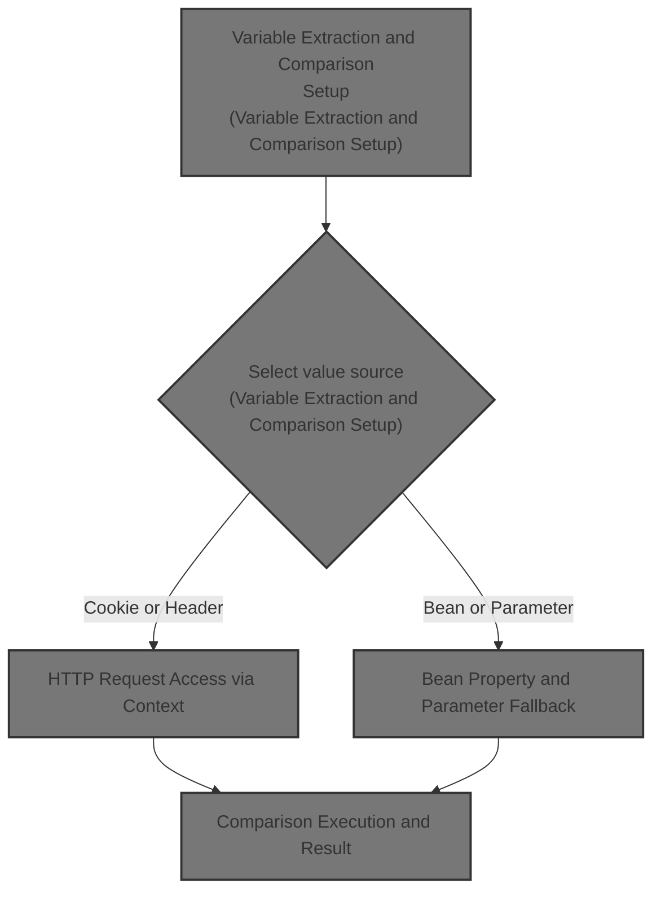
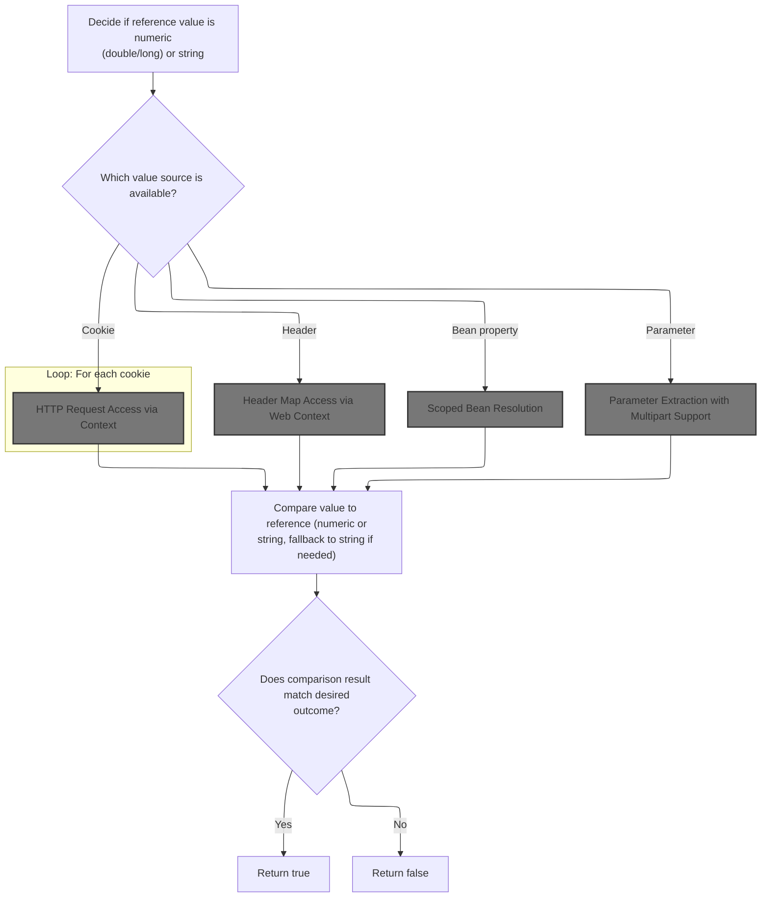
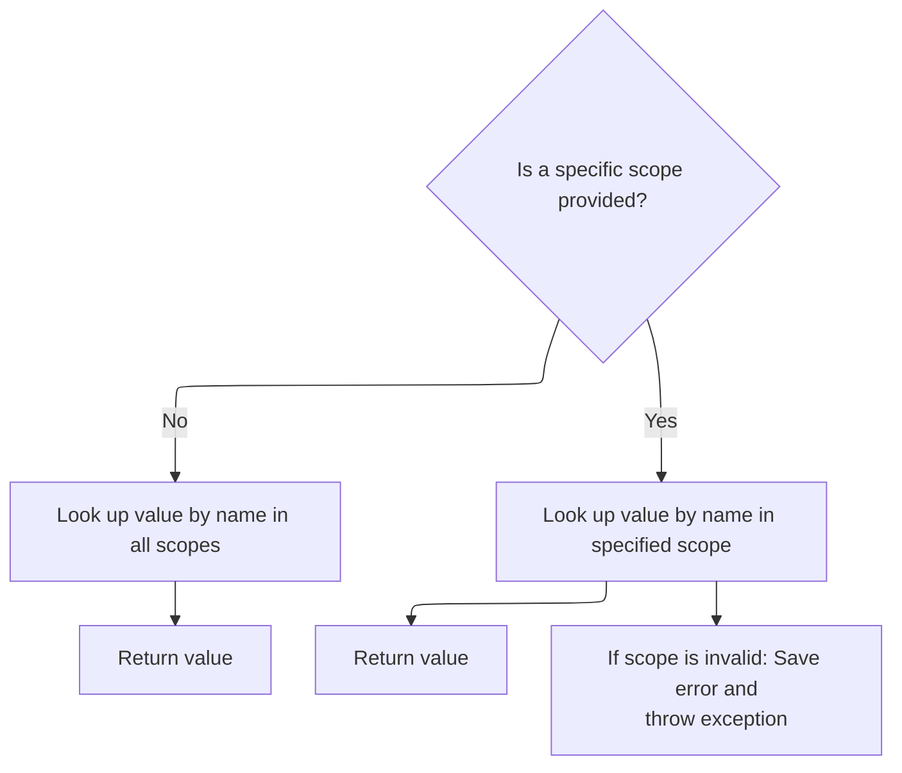
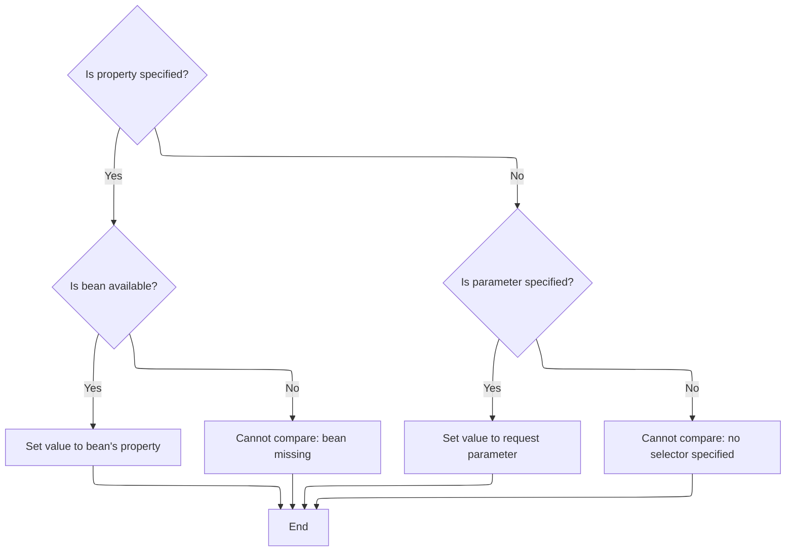
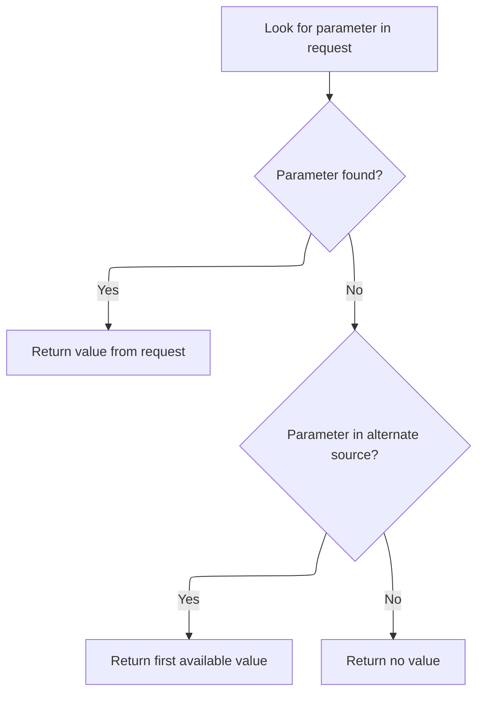

This document explains how the system enables flexible conditional logic in JSP pages by comparing a reference value to a value retrieved from cookies, headers, beans, or parameters. The flow determines the comparison type, extracts the value, and returns a boolean indicating if the condition is met.



# Variable Extraction and Comparison Setup



<SwmSnippet path="/taglib/src/main/java/org/apache/struts/taglib/logic/CompareTagBase.java" line="114">

---

In <SwmToken path="taglib/src/main/java/org/apache/struts/taglib/logic/CompareTagBase.java" pos="114:5:5" line-data="    protected boolean condition(int desired1, int desired2)">`condition`</SwmToken>, the code figures out if the comparison should be numeric (double or long) or string-based by trying to parse the 'value' field. Then it grabs the variable to compare from cookies, headers, beans, or parameters, depending on which selector is set. This setup is what lets the tag handle a bunch of use cases in JSPs without extra code.

```java
    protected boolean condition(int desired1, int desired2)
        throws JspException {
        // Acquire the value and determine the test type
        int type = -1;
        double doubleValue = 0.0;
        long longValue = 0;

        if ((type < 0) && (value.length() > 0)) {
            try {
                doubleValue = Double.parseDouble(value);
                type = DOUBLE_COMPARE;
            } catch (NumberFormatException e) {
                ;
            }
        }

        if ((type < 0) && (value.length() > 0)) {
            try {
                longValue = Long.parseLong(value);
                type = LONG_COMPARE;
            } catch (NumberFormatException e) {
                ;
            }
        }

        if (type < 0) {
            type = STRING_COMPARE;
        }

        // Acquire the unconverted variable value
        Object variable = null;

        if (cookie != null) {
            Cookie[] cookies =
                ((HttpServletRequest) pageContext.getRequest()).getCookies();

            if (cookies == null) {
                cookies = new Cookie[0];
            }

            for (int i = 0; i < cookies.length; i++) {
                if (cookie.equals(cookies[i].getName())) {
                    variable = cookies[i].getValue();

                    break;
                }
            }
```

---

</SwmSnippet>

<SwmSnippet path="/taglib/src/main/java/org/apache/struts/taglib/logic/CompareTagBase.java" line="161">

---

Next, if no cookie is specified, the code checks if a header is requested and fetches it from the HTTP request. This means we need to access the request object, which is why the flow heads to <SwmToken path="core/src/main/java/org/apache/struts/chain/contexts/ServletActionContext.java" pos="39:4:4" line-data="public class ServletActionContext extends WebActionContext {">`ServletActionContext`</SwmToken> for request access.

```java
        } else if (header != null) {
            variable =
                ((HttpServletRequest) pageContext.getRequest()).getHeader(header);
```

---

</SwmSnippet>

## HTTP Request Access via Context

<SwmSnippet path="/core/src/main/java/org/apache/struts/chain/contexts/ServletActionContext.java" line="94">

---

GetRequest() just delegates to <SwmToken path="core/src/main/java/org/apache/struts/chain/contexts/ServletActionContext.java" pos="95:3:5" line-data="        return servletWebContext().getRequest();">`servletWebContext()`</SwmToken><SwmToken path="core/src/main/java/org/apache/struts/chain/contexts/ServletActionContext.java" pos="95:6:9" line-data="        return servletWebContext().getRequest();">`.getRequest()`</SwmToken>, so it always pulls the current HTTP request from the context object. This indirection is what lets Struts swap in different request wrappers if needed.

```java
    public HttpServletRequest getRequest() {
        return servletWebContext().getRequest();
    }
```

---

</SwmSnippet>

<SwmSnippet path="/core/src/main/java/org/apache/struts/chain/contexts/ServletActionContext.java" line="67">

---

ServletWebContext() casts the base context to <SwmToken path="core/src/main/java/org/apache/struts/chain/contexts/ServletActionContext.java" pos="67:3:3" line-data="    protected ServletWebContext servletWebContext() {">`ServletWebContext`</SwmToken>. This only works if the context is set up right—otherwise, you'll get a <SwmToken path="taglib/src/main/java/org/apache/struts/taglib/TagUtils.java" pos="209:8:8" line-data="            //        } catch (ClassCastException e) {">`ClassCastException`</SwmToken>. It's a common pattern but not type-safe.

```java
    protected ServletWebContext servletWebContext() {
        return (ServletWebContext) this.getBaseContext();
    }
```

---

</SwmSnippet>

## Header Retrieval from HTTP Request

<SwmSnippet path="/taglib/src/main/java/org/apache/struts/taglib/logic/CompareTagBase.java" line="163">

---

Back in CompareTagBase.condition, after getting the request, the code fetches the header value. If the context is more abstract (like in a chain), it might need to go through <SwmToken path="core/src/main/java/org/apache/struts/chain/contexts/ServletActionContext.java" pos="39:8:8" line-data="public class ServletActionContext extends WebActionContext {">`WebActionContext`</SwmToken> to get the header map, so that's the next stop.

```java
                ((HttpServletRequest) pageContext.getRequest()).getHeader(header);
```

---

</SwmSnippet>

## Header Map Access via Web Context

<SwmSnippet path="/core/src/main/java/org/apache/struts/chain/contexts/WebActionContext.java" line="67">

---

GetHeader() on <SwmToken path="core/src/main/java/org/apache/struts/chain/contexts/ServletActionContext.java" pos="39:8:8" line-data="public class ServletActionContext extends WebActionContext {">`WebActionContext`</SwmToken> just returns the header map from the web context. This abstraction means headers can come from anywhere, not just the servlet API.

```java
    public Map getHeader() {
        return webContext().getHeader();
    }
```

---

</SwmSnippet>

<SwmSnippet path="/core/src/main/java/org/apache/struts/chain/contexts/WebActionContext.java" line="49">

---

WebContext() just casts the base context to <SwmToken path="core/src/main/java/org/apache/struts/chain/contexts/WebActionContext.java" pos="49:3:3" line-data="    protected WebContext webContext() {">`WebContext`</SwmToken>. If the context isn't set up right, this will blow up with a <SwmToken path="taglib/src/main/java/org/apache/struts/taglib/TagUtils.java" pos="209:8:8" line-data="            //        } catch (ClassCastException e) {">`ClassCastException`</SwmToken>.

```java
    protected WebContext webContext() {
        return (WebContext) this.getBaseContext();
    }
```

---

</SwmSnippet>

## Bean Lookup for Variable Value

<SwmSnippet path="/taglib/src/main/java/org/apache/struts/taglib/logic/CompareTagBase.java" line="164">

---

Back in CompareTagBase.condition, if we're looking for a bean, the code calls TagUtils.lookup to find it in the right scope. This is needed because beans aren't always in the same place—<SwmToken path="taglib/src/main/java/org/apache/struts/taglib/logic/CompareTagBase.java" pos="166:1:1" line-data="                TagUtils.getInstance().lookup(pageContext, name, scope);">`TagUtils`</SwmToken> abstracts that search.

```java
        } else if (name != null) {
            Object bean =
                TagUtils.getInstance().lookup(pageContext, name, scope);

```

---

</SwmSnippet>

## Scoped Bean Resolution



<SwmSnippet path="/taglib/src/main/java/org/apache/struts/taglib/TagUtils.java" line="863">

---

Lookup() checks if <SwmToken path="taglib/src/main/java/org/apache/struts/taglib/TagUtils.java" pos="863:19:19" line-data="    public Object lookup(PageContext pageContext, String name, String scopeName)">`scopeName`</SwmToken> is null. If so, it searches all scopes for the bean name. If not, it resolves the scope string to an integer and looks in that specific scope. This is how the tag can find beans no matter where they're stored.

```java
    public Object lookup(PageContext pageContext, String name, String scopeName)
        throws JspException {
        if (scopeName == null) {
            return pageContext.findAttribute(name);
        }

        try {
            return pageContext.getAttribute(name, instance.getScope(scopeName));
        } catch (JspException e) {
            saveException(pageContext, e);
            throw e;
        }
    }
```

---

</SwmSnippet>

<SwmSnippet path="/taglib/src/main/java/org/apache/struts/taglib/TagUtils.java" line="809">

---

GetScope() lowercases the <SwmToken path="taglib/src/main/java/org/apache/struts/taglib/TagUtils.java" pos="809:9:9" line-data="    public int getScope(String scopeName)">`scopeName`</SwmToken> before looking it up in the scopes map. If the scope isn't found, it throws an exception with a message that includes the null scope variable—probably a minor bug in the error handling.

```java
    public int getScope(String scopeName)
        throws JspException {
        Integer scope = (Integer) scopes.get(scopeName.toLowerCase());

        if (scope == null) {
            throw new JspException(messages.getMessage("lookup.scope", scope));
        }

        return scope.intValue();
    }
```

---

</SwmSnippet>

## Bean Property and Parameter Fallback



<SwmSnippet path="/taglib/src/main/java/org/apache/struts/taglib/logic/CompareTagBase.java" line="168">

---

Back in CompareTagBase.condition, after bean lookup, if a property is specified, the code tries to extract it using <SwmToken path="taglib/src/main/java/org/apache/struts/taglib/logic/CompareTagBase.java" pos="178:5:5" line-data="                    variable = PropertyUtils.getProperty(bean, property);">`PropertyUtils`</SwmToken>. If there's no bean or property, it falls back to grabbing a request parameter. If none of these selectors are set, it throws an exception.

```java
            if (property != null) {
                if (bean == null) {
                    JspException e =
                        new JspException(messages.getMessage("logic.bean", name));

                    TagUtils.getInstance().saveException(pageContext, e);
                    throw e;
                }

                try {
                    variable = PropertyUtils.getProperty(bean, property);
                } catch (InvocationTargetException e) {
                    Throwable t = e.getTargetException();

                    if (t == null) {
                        t = e;
                    }

                    TagUtils.getInstance().saveException(pageContext, t);
                    throw new JspException(messages.getMessage(
                            "logic.property", name, property, t.toString()), t);
                } catch (Throwable t) {
                    TagUtils.getInstance().saveException(pageContext, t);
                    throw new JspException(messages.getMessage(
                            "logic.property", name, property, t.toString()), t);
                }
            } else {
                variable = bean;
            }
        } else if (parameter != null) {
            variable = pageContext.getRequest().getParameter(parameter);
```

---

</SwmSnippet>

<SwmSnippet path="/taglib/src/main/java/org/apache/struts/taglib/logic/CompareTagBase.java" line="198">

---

Back in CompareTagBase.condition, if we're looking for a parameter, the code calls <SwmToken path="taglib/src/main/java/org/apache/struts/taglib/logic/CompareTagBase.java" pos="198:11:11" line-data="            variable = pageContext.getRequest().getParameter(parameter);">`getParameter`</SwmToken> on the request. If the request is a multipart upload, this might be handled by <SwmToken path="core/src/main/java/org/apache/struts/upload/MultipartRequestWrapper.java" pos="38:4:4" line-data="public class MultipartRequestWrapper extends HttpServletRequestWrapper {">`MultipartRequestWrapper`</SwmToken>, which knows how to extract parameters from file upload requests.

```java
            variable = pageContext.getRequest().getParameter(parameter);
        } else {
            JspException e =
                new JspException(messages.getMessage("logic.selector"));

            TagUtils.getInstance().saveException(pageContext, e);
            throw e;
        }

```

---

</SwmSnippet>

## Parameter Extraction with Multipart Support



<SwmSnippet path="/core/src/main/java/org/apache/struts/upload/MultipartRequestWrapper.java" line="75">

---

In <SwmToken path="core/src/main/java/org/apache/struts/upload/MultipartRequestWrapper.java" pos="75:5:5" line-data="    public String getParameter(String name) {">`getParameter`</SwmToken>, the code first tries the wrapped request's <SwmToken path="core/src/main/java/org/apache/struts/upload/MultipartRequestWrapper.java" pos="75:5:5" line-data="    public String getParameter(String name) {">`getParameter`</SwmToken>. If that's null (like in a multipart upload), it checks its own parameters map for the value. This way, parameters from file uploads aren't missed.

```java
    public String getParameter(String name) {
        String value = getRequest().getParameter(name);

```

---

</SwmSnippet>

<SwmSnippet path="/core/src/main/java/org/apache/struts/upload/MultipartRequestWrapper.java" line="78">

---

Back in MultipartRequestWrapper.getParameter, if the wrapped request didn't have the parameter, the code checks the parameters map. It expects String arrays and returns the first value if present. If the map isn't set up right, this could throw a <SwmToken path="taglib/src/main/java/org/apache/struts/taglib/TagUtils.java" pos="209:8:8" line-data="            //        } catch (ClassCastException e) {">`ClassCastException`</SwmToken>.

```java
        if (value == null) {
            String[] mValue = (String[]) parameters.get(name);

            if ((mValue != null) && (mValue.length > 0)) {
                value = mValue[0];
            }
        }

        return value;
    }
```

---

</SwmSnippet>

## Comparison Execution and Result

```mermaid
%%{init: {"flowchart": {"defaultRenderer": "elk"}} }%%
flowchart TD
  node1{"Is variable null?"}
  click node1 openCode "taglib/src/main/java/org/apache/struts/taglib/logic/CompareTagBase.java:207:209"
  node2["Coerce variable to empty string"]
  click node2 openCode "taglib/src/main/java/org/apache/struts/taglib/logic/CompareTagBase.java:208:209"
  node3{"Comparison type? (Double, Long,
String)"}
  click node3 openCode "taglib/src/main/java/org/apache/struts/taglib/logic/CompareTagBase.java:214:240"
  node4{"Can variable be parsed as number?"}
  click node4 openCode "taglib/src/main/java/org/apache/struts/taglib/logic/CompareTagBase.java:215:223"
  node5["Compare as double"]
  click node5 openCode "taglib/src/main/java/org/apache/struts/taglib/logic/CompareTagBase.java:218:222"
  node6{"Can variable be parsed as number?"}
  click node6 openCode "taglib/src/main/java/org/apache/struts/taglib/logic/CompareTagBase.java:227:235"
  node7["Compare as long"]
  click node7 openCode "taglib/src/main/java/org/apache/struts/taglib/logic/CompareTagBase.java:230:234"
  node8["Compare as string"]
  click node8 openCode "taglib/src/main/java/org/apache/struts/taglib/logic/CompareTagBase.java:224:225"
  node9["Compare as string"]
  click node9 openCode "taglib/src/main/java/org/apache/struts/taglib/logic/CompareTagBase.java:236:237"
  node10["Compare as string"]
  click node10 openCode "taglib/src/main/java/org/apache/struts/taglib/logic/CompareTagBase.java:239:240"
  node11["Normalize result to -1, 0, +1"]
  click node11 openCode "taglib/src/main/java/org/apache/struts/taglib/logic/CompareTagBase.java:243:247"
  node12{"Does result match desired outcome
(desired1 or desired2)?"}
  click node12 openCode "taglib/src/main/java/org/apache/struts/taglib/logic/CompareTagBase.java:250:250"
  node13["Return true"]
  click node13 openCode "taglib/src/main/java/org/apache/struts/taglib/logic/CompareTagBase.java:250:251"
  node14["Return false"]
  click node14 openCode "taglib/src/main/java/org/apache/struts/taglib/logic/CompareTagBase.java:250:251"

  node1 -- Yes --> node2
  node1 -- No --> node3
  node2 --> node3
  node3 -- Double --> node4
  node3 -- Long --> node6
  node3 -- String --> node10
  node4 -- Yes --> node5
  node4 -- No --> node8
  node5 --> node11
  node8 --> node11
  node6 -- Yes --> node7
  node6 -- No --> node9
  node7 --> node11
  node9 --> node11
  node10 --> node11
  node11 --> node12
  node12 -- Yes --> node13
  node12 -- No --> node14
classDef HeadingStyle fill:#777777,stroke:#333,stroke-width:2px;

%% Swimm:
%% %%{init: {"flowchart": {"defaultRenderer": "elk"}} }%%
%% flowchart TD
%%   node1{"Is variable null?"}
%%   click node1 openCode "<SwmPath>[taglib/…/logic/CompareTagBase.java](taglib/src/main/java/org/apache/struts/taglib/logic/CompareTagBase.java)</SwmPath>:207:209"
%%   node2["Coerce variable to empty string"]
%%   click node2 openCode "<SwmPath>[taglib/…/logic/CompareTagBase.java](taglib/src/main/java/org/apache/struts/taglib/logic/CompareTagBase.java)</SwmPath>:208:209"
%%   node3{"Comparison type? (Double, Long,
%% String)"}
%%   click node3 openCode "<SwmPath>[taglib/…/logic/CompareTagBase.java](taglib/src/main/java/org/apache/struts/taglib/logic/CompareTagBase.java)</SwmPath>:214:240"
%%   node4{"Can variable be parsed as number?"}
%%   click node4 openCode "<SwmPath>[taglib/…/logic/CompareTagBase.java](taglib/src/main/java/org/apache/struts/taglib/logic/CompareTagBase.java)</SwmPath>:215:223"
%%   node5["Compare as double"]
%%   click node5 openCode "<SwmPath>[taglib/…/logic/CompareTagBase.java](taglib/src/main/java/org/apache/struts/taglib/logic/CompareTagBase.java)</SwmPath>:218:222"
%%   node6{"Can variable be parsed as number?"}
%%   click node6 openCode "<SwmPath>[taglib/…/logic/CompareTagBase.java](taglib/src/main/java/org/apache/struts/taglib/logic/CompareTagBase.java)</SwmPath>:227:235"
%%   node7["Compare as long"]
%%   click node7 openCode "<SwmPath>[taglib/…/logic/CompareTagBase.java](taglib/src/main/java/org/apache/struts/taglib/logic/CompareTagBase.java)</SwmPath>:230:234"
%%   node8["Compare as string"]
%%   click node8 openCode "<SwmPath>[taglib/…/logic/CompareTagBase.java](taglib/src/main/java/org/apache/struts/taglib/logic/CompareTagBase.java)</SwmPath>:224:225"
%%   node9["Compare as string"]
%%   click node9 openCode "<SwmPath>[taglib/…/logic/CompareTagBase.java](taglib/src/main/java/org/apache/struts/taglib/logic/CompareTagBase.java)</SwmPath>:236:237"
%%   node10["Compare as string"]
%%   click node10 openCode "<SwmPath>[taglib/…/logic/CompareTagBase.java](taglib/src/main/java/org/apache/struts/taglib/logic/CompareTagBase.java)</SwmPath>:239:240"
%%   node11["Normalize result to -1, 0, +1"]
%%   click node11 openCode "<SwmPath>[taglib/…/logic/CompareTagBase.java](taglib/src/main/java/org/apache/struts/taglib/logic/CompareTagBase.java)</SwmPath>:243:247"
%%   node12{"Does result match desired outcome
%% (<SwmToken path="taglib/src/main/java/org/apache/struts/taglib/logic/CompareTagBase.java" pos="114:9:9" line-data="    protected boolean condition(int desired1, int desired2)">`desired1`</SwmToken> or <SwmToken path="taglib/src/main/java/org/apache/struts/taglib/logic/CompareTagBase.java" pos="114:14:14" line-data="    protected boolean condition(int desired1, int desired2)">`desired2`</SwmToken>)?"}
%%   click node12 openCode "<SwmPath>[taglib/…/logic/CompareTagBase.java](taglib/src/main/java/org/apache/struts/taglib/logic/CompareTagBase.java)</SwmPath>:250:250"
%%   node13["Return true"]
%%   click node13 openCode "<SwmPath>[taglib/…/logic/CompareTagBase.java](taglib/src/main/java/org/apache/struts/taglib/logic/CompareTagBase.java)</SwmPath>:250:251"
%%   node14["Return false"]
%%   click node14 openCode "<SwmPath>[taglib/…/logic/CompareTagBase.java](taglib/src/main/java/org/apache/struts/taglib/logic/CompareTagBase.java)</SwmPath>:250:251"
%% 
%%   node1 -- Yes --> node2
%%   node1 -- No --> node3
%%   node2 --> node3
%%   node3 -- Double --> node4
%%   node3 -- Long --> node6
%%   node3 -- String --> node10
%%   node4 -- Yes --> node5
%%   node4 -- No --> node8
%%   node5 --> node11
%%   node8 --> node11
%%   node6 -- Yes --> node7
%%   node6 -- No --> node9
%%   node7 --> node11
%%   node9 --> node11
%%   node10 --> node11
%%   node11 --> node12
%%   node12 -- Yes --> node13
%%   node12 -- No --> node14
%% classDef HeadingStyle fill:#777777,stroke:#333,stroke-width:2px;
```



<SwmSnippet path="/taglib/src/main/java/org/apache/struts/taglib/logic/CompareTagBase.java" line="207">

---

Back in CompareTagBase.condition, after getting the variable (possibly from a multipart request), the code coerces nulls to empty strings, does the comparison (numeric or string), normalizes the result, and returns true if it matches the expected outcome. If parsing fails, it falls back to string comparison.

```java
        if (variable == null) {
            variable = ""; // Coerce null to a zero-length String
        }

        // Perform the appropriate comparison
        int result = 0;

        if (type == DOUBLE_COMPARE) {
            try {
                double doubleVariable = Double.parseDouble(variable.toString());

                if (doubleVariable < doubleValue) {
                    result = -1;
                } else if (doubleVariable > doubleValue) {
                    result = +1;
                }
            } catch (NumberFormatException e) {
                result = variable.toString().compareTo(value);
            }
        } else if (type == LONG_COMPARE) {
            try {
                long longVariable = Long.parseLong(variable.toString());

                if (longVariable < longValue) {
                    result = -1;
                } else if (longVariable > longValue) {
                    result = +1;
                }
            } catch (NumberFormatException e) {
                result = variable.toString().compareTo(value);
            }
        } else {
            result = variable.toString().compareTo(value);
        }

        // Normalize the result
        if (result < 0) {
            result = -1;
        } else if (result > 0) {
            result = +1;
        }

        // Return true if the result matches either desired value
        return ((result == desired1) || (result == desired2));
    }
```

---

</SwmSnippet>

&nbsp;

*This is an auto-generated document by Swimm 🌊 and has not yet been verified by a human*

<SwmMeta version="3.0.0" repo-id="Z2l0aHViJTNBJTNBc3RydXRzMSUzQSUzQVN3aW1tLURlbW8=" repo-name="struts1"><sup>Powered by [Swimm](https://app.swimm.io/)</sup></SwmMeta>
