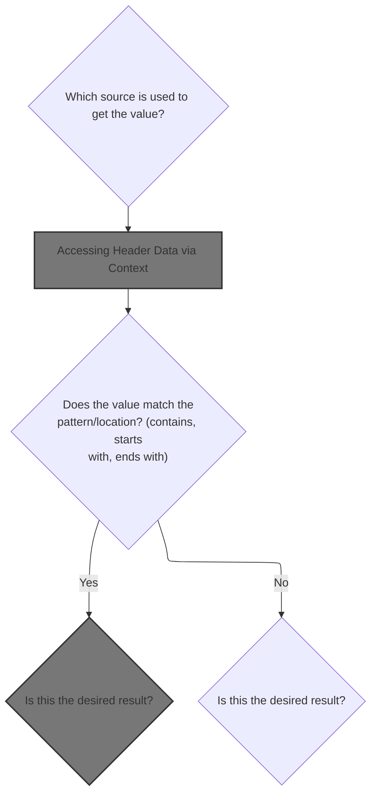
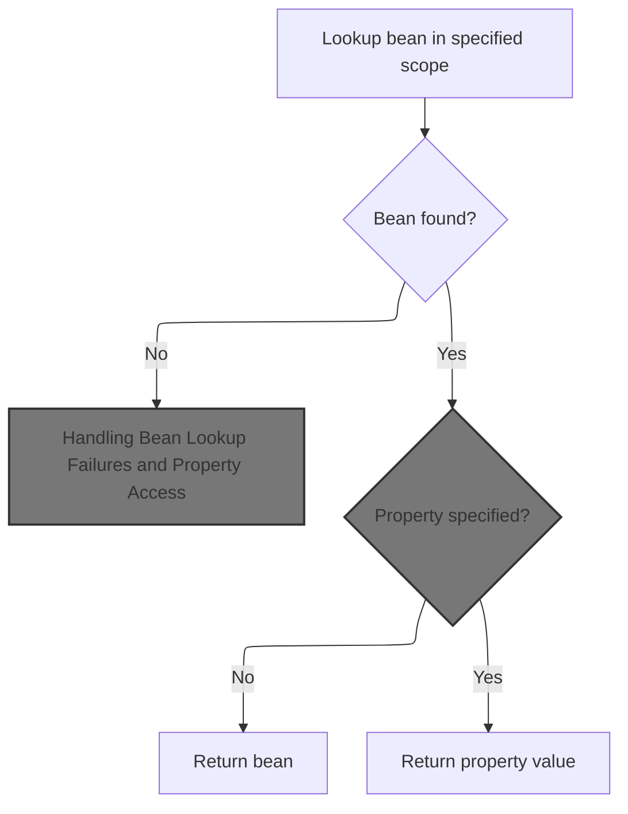
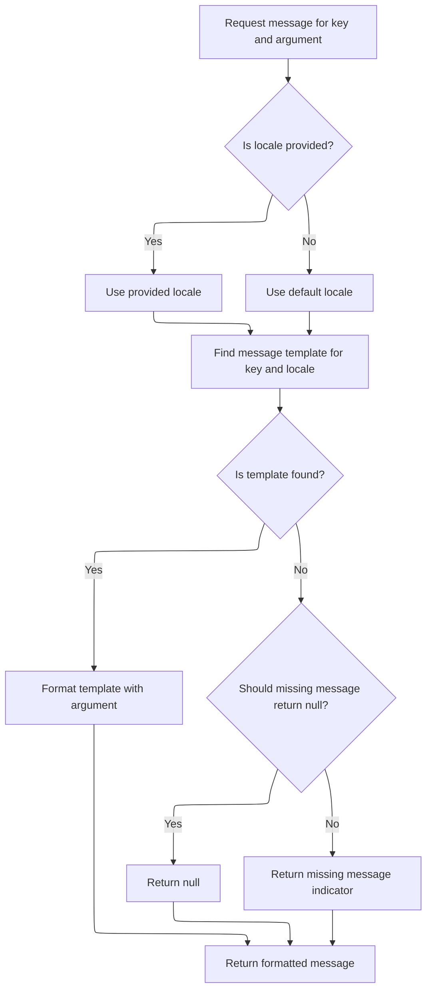
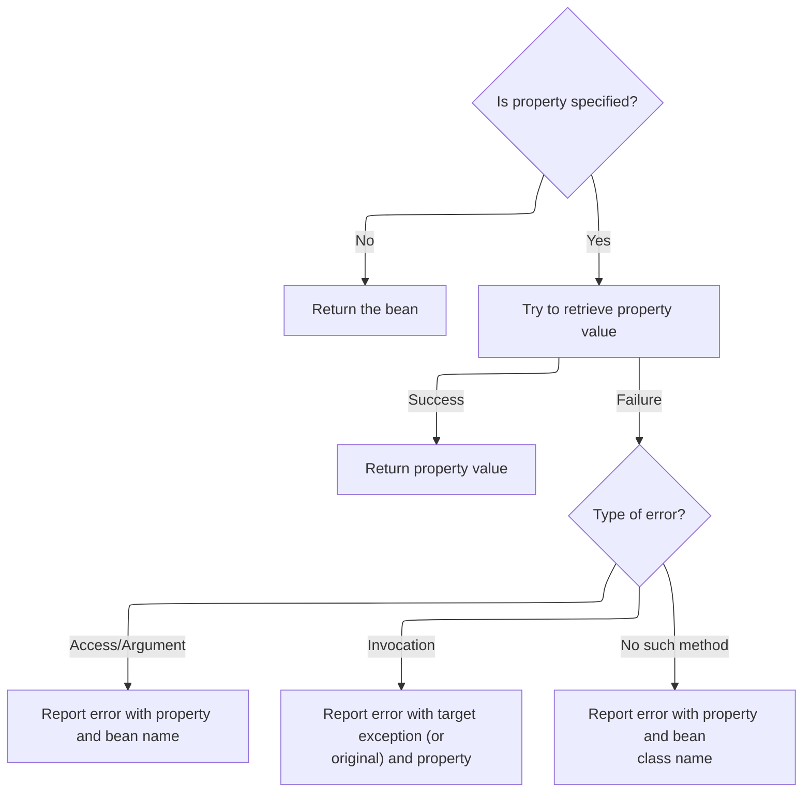

This document explains how a value is dynamically retrieved from a request, header, cookie, or scoped variable and compared to a specified value using different matching strategies. This enables flexible conditional logic in web pages, allowing developers to control page behavior based on user input or request data.

# Acquiring the Variable for Matching



<SwmSnippet path="/taglib/src/main/java/org/apache/struts/taglib/logic/MatchTag.java" line="102">

---

In <SwmToken path="taglib/src/main/java/org/apache/struts/taglib/logic/MatchTag.java" pos="102:5:5" line-data="    protected boolean condition(boolean desired)">`condition`</SwmToken>, the code checks which attribute (cookie, header, name, parameter) is set and pulls the variable from the corresponding source. Here, it handles the cookie case by looping through request cookies to find a match and grab its value.

```java
    protected boolean condition(boolean desired)
        throws JspException {
        // Acquire the specified variable
        String variable = null;

        if (cookie != null) {
            Cookie[] cookies =
                ((HttpServletRequest) pageContext.getRequest()).getCookies();

            if (cookies == null) {
                cookies = new Cookie[0];
            }

            for (int i = 0; i < cookies.length; i++) {
                if (cookie.equals(cookies[i].getName())) {
                    variable = cookies[i].getValue();

                    break;
                }
            }
```

---

</SwmSnippet>

<SwmSnippet path="/taglib/src/main/java/org/apache/struts/taglib/logic/MatchTag.java" line="122">

---

Next, if the header attribute is set, the code fetches the header value from the request. This is where we'd use a context abstraction (like <SwmToken path="core/src/main/java/org/apache/struts/chain/contexts/WebActionContext.java" pos="34:4:4" line-data="public class WebActionContext extends ActionContextBase {">`WebActionContext`</SwmToken>) if we needed to support more than just the raw servlet API.

```java
        } else if (header != null) {
            variable =
                ((HttpServletRequest) pageContext.getRequest()).getHeader(header);
```

---

</SwmSnippet>

## Accessing Header Data via Context

<SwmSnippet path="/core/src/main/java/org/apache/struts/chain/contexts/WebActionContext.java" line="67">

---

GetHeader() just delegates to <SwmToken path="core/src/main/java/org/apache/struts/chain/contexts/WebActionContext.java" pos="68:3:5" line-data="        return webContext().getHeader();">`webContext()`</SwmToken><SwmToken path="core/src/main/java/org/apache/struts/chain/contexts/WebActionContext.java" pos="68:6:9" line-data="        return webContext().getHeader();">`.getHeader()`</SwmToken>, so all header retrieval is funneled through the context abstraction. This keeps things flexible if the underlying request changes.

```java
    public Map getHeader() {
        return webContext().getHeader();
    }
```

---

</SwmSnippet>

<SwmSnippet path="/core/src/main/java/org/apache/struts/chain/contexts/WebActionContext.java" line="49">

---

WebContext() just casts <SwmToken path="core/src/main/java/org/apache/struts/chain/contexts/WebActionContext.java" pos="50:9:11" line-data="        return (WebContext) this.getBaseContext();">`getBaseContext()`</SwmToken> to <SwmToken path="core/src/main/java/org/apache/struts/chain/contexts/WebActionContext.java" pos="49:3:3" line-data="    protected WebContext webContext() {">`WebContext`</SwmToken>. If <SwmToken path="core/src/main/java/org/apache/struts/chain/contexts/WebActionContext.java" pos="50:9:11" line-data="        return (WebContext) this.getBaseContext();">`getBaseContext()`</SwmToken> isn't actually a <SwmToken path="core/src/main/java/org/apache/struts/chain/contexts/WebActionContext.java" pos="49:3:3" line-data="    protected WebContext webContext() {">`WebContext`</SwmToken>, this will blow up at runtime, but otherwise it's a straight pass-through.

```java
    protected WebContext webContext() {
        return (WebContext) this.getBaseContext();
    }
```

---

</SwmSnippet>

## Looking Up Scoped Variables

<SwmSnippet path="/taglib/src/main/java/org/apache/struts/taglib/logic/MatchTag.java" line="125">

---

Back in MatchTag.condition, after checking headers, if the name attribute is set, the code uses <SwmToken path="taglib/src/main/java/org/apache/struts/taglib/logic/MatchTag.java" pos="127:1:1" line-data="                TagUtils.getInstance().lookup(pageContext, name, property, scope);">`TagUtils`</SwmToken> to look up a variable from the appropriate scope. This lets the tag work with variables stored in different places (page, request, session, application).

```java
        } else if (name != null) {
            Object value =
                TagUtils.getInstance().lookup(pageContext, name, property, scope);

```

---

</SwmSnippet>

## Resolving Bean References



<SwmSnippet path="/taglib/src/main/java/org/apache/struts/taglib/TagUtils.java" line="897">

---

In lookup, if the bean isn't found, the code calls <SwmToken path="taglib/src/main/java/org/apache/struts/taglib/TagUtils.java" pos="906:9:11" line-data="                e = new JspException(messages.getMessage(&quot;lookup.bean.any&quot;, name));">`messages.getMessage`</SwmToken> to build an error message and throws a <SwmToken path="taglib/src/main/java/org/apache/struts/taglib/TagUtils.java" pos="898:8:8" line-data="        String scope) throws JspException {">`JspException`</SwmToken>. This makes missing beans obvious and localizable.

```java
    public Object lookup(PageContext pageContext, String name, String property,
        String scope) throws JspException {
        // Look up the requested bean, and return if requested
        Object bean = lookup(pageContext, name, scope);

        if (bean == null) {
            JspException e = null;

            if (scope == null) {
                e = new JspException(messages.getMessage("lookup.bean.any", name));
            } else {
```

---

</SwmSnippet>

### Formatting Error Messages

<SwmSnippet path="/core/src/main/java/org/apache/struts/util/MessageResources.java" line="218">

---

GetMessage(key, <SwmToken path="core/src/main/java/org/apache/struts/util/MessageResources.java" pos="218:14:14" line-data="    public String getMessage(String key, Object arg0) {">`arg0`</SwmToken>) just passes the call to the main <SwmToken path="core/src/main/java/org/apache/struts/util/MessageResources.java" pos="218:5:5" line-data="    public String getMessage(String key, Object arg0) {">`getMessage`</SwmToken> method with a null locale and a single argument. This is how we get error messages with details like the bean name.

```java
    public String getMessage(String key, Object arg0) {
        return this.getMessage((Locale) null, key, arg0);
    }
```

---

</SwmSnippet>

### Preparing Message Arguments



<SwmSnippet path="/core/src/main/java/org/apache/struts/util/MessageResources.java" line="324">

---

GetMessage(locale, key, <SwmToken path="core/src/main/java/org/apache/struts/util/MessageResources.java" pos="324:19:19" line-data="    public String getMessage(Locale locale, String key, Object arg0) {">`arg0`</SwmToken>) just wraps the argument in an array and calls the main <SwmToken path="core/src/main/java/org/apache/struts/util/MessageResources.java" pos="324:5:5" line-data="    public String getMessage(Locale locale, String key, Object arg0) {">`getMessage`</SwmToken> method. This keeps the formatting logic consistent.

```java
    public String getMessage(Locale locale, String key, Object arg0) {
        return this.getMessage(locale, key, new Object[] { arg0 });
    }
```

---

</SwmSnippet>

<SwmSnippet path="/core/src/main/java/org/apache/struts/util/MessageResources.java" line="286">

---

GetMessage(locale, key, args) handles the actual message formatting. It uses a synchronized cache for <SwmToken path="core/src/main/java/org/apache/struts/util/MessageResources.java" pos="287:5:5" line-data="        // Cache MessageFormat instances as they are accessed">`MessageFormat`</SwmToken> instances, defaults the locale if needed, escapes the format string, and returns a formatted message or a placeholder if the key is missing.

```java
    public String getMessage(Locale locale, String key, Object[] args) {
        // Cache MessageFormat instances as they are accessed
        if (locale == null) {
            locale = defaultLocale;
        }

        MessageFormat format = null;
        String formatKey = messageKey(locale, key);

        synchronized (formats) {
            format = (MessageFormat) formats.get(formatKey);

            if (format == null) {
                String formatString = getMessage(locale, key);

                if (formatString == null) {
                    return returnNull ? null : ("???" + formatKey + "???");
                }

                format = new MessageFormat(escape(formatString));
                format.setLocale(locale);
                formats.put(formatKey, format);
            }
        }

        return format.format(args);
    }
```

---

</SwmSnippet>

### Handling Bean Lookup Failures and Property Access



<SwmSnippet path="/taglib/src/main/java/org/apache/struts/taglib/TagUtils.java" line="908">

---

Back from <SwmToken path="taglib/src/main/java/org/apache/struts/taglib/TagUtils.java" pos="34:10:10" line-data="import org.apache.struts.util.MessageResources;">`MessageResources`</SwmToken>, TagUtils.lookup either returns the bean/property or throws a <SwmToken path="taglib/src/main/java/org/apache/struts/taglib/TagUtils.java" pos="908:7:7" line-data="                e = new JspException(messages.getMessage(&quot;lookup.bean&quot;, name,">`JspException`</SwmToken> with a detailed, localized error message for each failure case (access, argument, target, method).

```java
                e = new JspException(messages.getMessage("lookup.bean", name,
                            scope));
            }

            saveException(pageContext, e);
            throw e;
        }

        if (property == null) {
            return bean;
        }

        // Locate and return the specified property
        try {
            return PropertyUtils.getProperty(bean, property);
        } catch (IllegalAccessException e) {
            saveException(pageContext, e);
            throw new JspException(messages.getMessage("lookup.access",
                    property, name), e);
        } catch (IllegalArgumentException e) {
            saveException(pageContext, e);
            throw new JspException(messages.getMessage("lookup.argument",
                    property, name), e);
        } catch (InvocationTargetException e) {
            Throwable t = e.getTargetException();

            if (t == null) {
                t = e;
            }

            saveException(pageContext, t);
            throw new JspException(messages.getMessage("lookup.target",
                    property, name), e);
        } catch (NoSuchMethodException e) {
            saveException(pageContext, e);

            String beanName = name;

            // Name defaults to Contants.BEAN_KEY if no name is specified by
            // an input tag. Thus lookup the bean under the key and use
            // its class name for the exception message.
            if (Constants.BEAN_KEY.equals(name)) {
                Object obj = pageContext.findAttribute(Constants.BEAN_KEY);

                if (obj != null) {
                    beanName = obj.getClass().getName();
                }
            }

            throw new JspException(messages.getMessage("lookup.method",
                    property, beanName), e);
        }
    }
```

---

</SwmSnippet>

## Retrieving Request Parameters

```mermaid
%%{init: {"flowchart": {"defaultRenderer": "elk"}} }%%
flowchart TD
  node1{"Is a value provided?"}
  click node1 openCode "taglib/src/main/java/org/apache/struts/taglib/logic/MatchTag.java:129:131"
  node2["Use value as variable"]
  click node2 openCode "taglib/src/main/java/org/apache/struts/taglib/logic/MatchTag.java:130:130"
  node3{"Is a parameter provided?"}
  click node3 openCode "taglib/src/main/java/org/apache/struts/taglib/logic/MatchTag.java:132:133"
  node4["Use parameter value as variable"]
  click node4 openCode "taglib/src/main/java/org/apache/struts/taglib/logic/MatchTag.java:133:133"
  node5["Error: No value or parameter"]
  click node5 openCode "taglib/src/main/java/org/apache/struts/taglib/logic/MatchTag.java:135:140"
  node6{"Is variable available?"}
  click node6 openCode "taglib/src/main/java/org/apache/struts/taglib/logic/MatchTag.java:142:142"
  node7["Error: Variable not found"]
  click node7 openCode "taglib/src/main/java/org/apache/struts/taglib/logic/MatchTag.java:143:148"
  node8{"How to match? (location)"}
  click node8 openCode "taglib/src/main/java/org/apache/struts/taglib/logic/MatchTag.java:153:159"
  node9["Check if variable contains value"]
  click node9 openCode "taglib/src/main/java/org/apache/struts/taglib/logic/MatchTag.java:154:154"
  node10["Check if variable starts with value"]
  click node10 openCode "taglib/src/main/java/org/apache/struts/taglib/logic/MatchTag.java:156:156"
  node11["Check if variable ends with value"]
  click node11 openCode "taglib/src/main/java/org/apache/struts/taglib/logic/MatchTag.java:158:158"
  node12["Error: Invalid location"]
  click node12 openCode "taglib/src/main/java/org/apache/struts/taglib/logic/MatchTag.java:160:165"
  node13{"Does match result equal desired
outcome?"}
  click node13 openCode "taglib/src/main/java/org/apache/struts/taglib/logic/MatchTag.java:168:168"
  node14["Return true"]
  click node14 openCode "taglib/src/main/java/org/apache/struts/taglib/logic/MatchTag.java:168:168"
  node15["Return false"]
  click node15 openCode "taglib/src/main/java/org/apache/struts/taglib/logic/MatchTag.java:168:168"

  node1 -->|"Yes"| node2
  node1 -->|"No"| node3
  node2 --> node6
  node3 -->|"Yes"| node4
  node3 -->|"No"| node5
  node4 --> node6
  node6 -->|"Yes"| node8
  node6 -->|"No"| node7
  node8 -->|"Contains"| node9
  node8 -->|"Start"| node10
  node8 -->|"End"| node11
  node8 -->|"Invalid"| node12
  node9 --> node13
  node10 --> node13
  node11 --> node13
  node12 --> node15
  node13 -->|"Yes"| node14
  node13 -->|"No"| node15

classDef HeadingStyle fill:#777777,stroke:#333,stroke-width:2px;

%% Swimm:
%% %%{init: {"flowchart": {"defaultRenderer": "elk"}} }%%
%% flowchart TD
%%   node1{"Is a value provided?"}
%%   click node1 openCode "<SwmPath>[taglib/…/logic/MatchTag.java](taglib/src/main/java/org/apache/struts/taglib/logic/MatchTag.java)</SwmPath>:129:131"
%%   node2["Use value as variable"]
%%   click node2 openCode "<SwmPath>[taglib/…/logic/MatchTag.java](taglib/src/main/java/org/apache/struts/taglib/logic/MatchTag.java)</SwmPath>:130:130"
%%   node3{"Is a parameter provided?"}
%%   click node3 openCode "<SwmPath>[taglib/…/logic/MatchTag.java](taglib/src/main/java/org/apache/struts/taglib/logic/MatchTag.java)</SwmPath>:132:133"
%%   node4["Use parameter value as variable"]
%%   click node4 openCode "<SwmPath>[taglib/…/logic/MatchTag.java](taglib/src/main/java/org/apache/struts/taglib/logic/MatchTag.java)</SwmPath>:133:133"
%%   node5["Error: No value or parameter"]
%%   click node5 openCode "<SwmPath>[taglib/…/logic/MatchTag.java](taglib/src/main/java/org/apache/struts/taglib/logic/MatchTag.java)</SwmPath>:135:140"
%%   node6{"Is variable available?"}
%%   click node6 openCode "<SwmPath>[taglib/…/logic/MatchTag.java](taglib/src/main/java/org/apache/struts/taglib/logic/MatchTag.java)</SwmPath>:142:142"
%%   node7["Error: Variable not found"]
%%   click node7 openCode "<SwmPath>[taglib/…/logic/MatchTag.java](taglib/src/main/java/org/apache/struts/taglib/logic/MatchTag.java)</SwmPath>:143:148"
%%   node8{"How to match? (location)"}
%%   click node8 openCode "<SwmPath>[taglib/…/logic/MatchTag.java](taglib/src/main/java/org/apache/struts/taglib/logic/MatchTag.java)</SwmPath>:153:159"
%%   node9["Check if variable contains value"]
%%   click node9 openCode "<SwmPath>[taglib/…/logic/MatchTag.java](taglib/src/main/java/org/apache/struts/taglib/logic/MatchTag.java)</SwmPath>:154:154"
%%   node10["Check if variable starts with value"]
%%   click node10 openCode "<SwmPath>[taglib/…/logic/MatchTag.java](taglib/src/main/java/org/apache/struts/taglib/logic/MatchTag.java)</SwmPath>:156:156"
%%   node11["Check if variable ends with value"]
%%   click node11 openCode "<SwmPath>[taglib/…/logic/MatchTag.java](taglib/src/main/java/org/apache/struts/taglib/logic/MatchTag.java)</SwmPath>:158:158"
%%   node12["Error: Invalid location"]
%%   click node12 openCode "<SwmPath>[taglib/…/logic/MatchTag.java](taglib/src/main/java/org/apache/struts/taglib/logic/MatchTag.java)</SwmPath>:160:165"
%%   node13{"Does match result equal desired
%% outcome?"}
%%   click node13 openCode "<SwmPath>[taglib/…/logic/MatchTag.java](taglib/src/main/java/org/apache/struts/taglib/logic/MatchTag.java)</SwmPath>:168:168"
%%   node14["Return true"]
%%   click node14 openCode "<SwmPath>[taglib/…/logic/MatchTag.java](taglib/src/main/java/org/apache/struts/taglib/logic/MatchTag.java)</SwmPath>:168:168"
%%   node15["Return false"]
%%   click node15 openCode "<SwmPath>[taglib/…/logic/MatchTag.java](taglib/src/main/java/org/apache/struts/taglib/logic/MatchTag.java)</SwmPath>:168:168"
%% 
%%   node1 -->|"Yes"| node2
%%   node1 -->|"No"| node3
%%   node2 --> node6
%%   node3 -->|"Yes"| node4
%%   node3 -->|"No"| node5
%%   node4 --> node6
%%   node6 -->|"Yes"| node8
%%   node6 -->|"No"| node7
%%   node8 -->|"Contains"| node9
%%   node8 -->|"Start"| node10
%%   node8 -->|"End"| node11
%%   node8 -->|"Invalid"| node12
%%   node9 --> node13
%%   node10 --> node13
%%   node11 --> node13
%%   node12 --> node15
%%   node13 -->|"Yes"| node14
%%   node13 -->|"No"| node15
%% 
%% classDef HeadingStyle fill:#777777,stroke:#333,stroke-width:2px;
```



<SwmSnippet path="/taglib/src/main/java/org/apache/struts/taglib/logic/MatchTag.java" line="129">

---

Back from TagUtils.lookup, if the parameter attribute is set, MatchTag.condition fetches the parameter value from the request. For multipart forms, this means using <SwmToken path="core/src/main/java/org/apache/struts/upload/MultipartRequestWrapper.java" pos="38:4:4" line-data="public class MultipartRequestWrapper extends HttpServletRequestWrapper {">`MultipartRequestWrapper`</SwmToken> to handle file upload parameters.

```java
            if (value != null) {
                variable = value.toString();
            }
        } else if (parameter != null) {
            variable = pageContext.getRequest().getParameter(parameter);
        } else {
```

---

</SwmSnippet>

<SwmSnippet path="/core/src/main/java/org/apache/struts/upload/MultipartRequestWrapper.java" line="75">

---

GetParameter tries the standard request first, then falls back to a parameters map (assuming String arrays) for multipart requests. Only the first value is returned if multiple are present.

```java
    public String getParameter(String name) {
        String value = getRequest().getParameter(name);

        if (value == null) {
            String[] mValue = (String[]) parameters.get(name);

            if ((mValue != null) && (mValue.length > 0)) {
                value = mValue[0];
            }
        }

        return value;
    }
```

---

</SwmSnippet>

<SwmSnippet path="/taglib/src/main/java/org/apache/struts/taglib/logic/MatchTag.java" line="135">

---

Back from <SwmToken path="core/src/main/java/org/apache/struts/upload/MultipartRequestWrapper.java" pos="38:4:4" line-data="public class MultipartRequestWrapper extends HttpServletRequestWrapper {">`MultipartRequestWrapper`</SwmToken>, if none of the attributes are set, MatchTag.condition throws a <SwmToken path="taglib/src/main/java/org/apache/struts/taglib/logic/MatchTag.java" pos="135:1:1" line-data="            JspException e =">`JspException`</SwmToken> with a localized error message, so misconfiguration is obvious.

```java
            JspException e =
                new JspException(messages.getMessage("logic.selector"));

            TagUtils.getInstance().saveException(pageContext, e);
            throw e;
        }

```

---

</SwmSnippet>

<SwmSnippet path="/core/src/main/java/org/apache/struts/util/MessageResources.java" line="196">

---

GetMessage(key) fetches a simple message string (possibly localized) for generic errors, passing null for locale and arguments.

```java
    public String getMessage(String key) {
        return this.getMessage((Locale) null, key, null);
    }
```

---

</SwmSnippet>

<SwmSnippet path="/taglib/src/main/java/org/apache/struts/taglib/logic/MatchTag.java" line="142">

---

Back from <SwmToken path="taglib/src/main/java/org/apache/struts/taglib/TagUtils.java" pos="34:10:10" line-data="import org.apache.struts.util.MessageResources;">`MessageResources`</SwmToken>, MatchTag.condition checks the location attribute to decide how to match the variable against the value (anywhere, start, end). If the variable is missing or location is invalid, it throws a localized error. The function returns true if the match result equals the desired flag.

```java
        if (variable == null) {
            JspException e =
                new JspException(messages.getMessage("logic.variable", value));

            TagUtils.getInstance().saveException(pageContext, e);
            throw e;
        }

        // Perform the comparison requested by the location attribute
        boolean matched = false;

        if (location == null) {
            matched = (variable.indexOf(value) >= 0);
        } else if (location.equals("start")) {
            matched = variable.startsWith(value);
        } else if (location.equals("end")) {
            matched = variable.endsWith(value);
        } else {
            JspException e =
                new JspException(messages.getMessage("logic.location", location));

            TagUtils.getInstance().saveException(pageContext, e);
            throw e;
        }

        // Return the final result
        return (matched == desired);
    }
```

---

</SwmSnippet>

&nbsp;

*This is an auto-generated document by Swimm 🌊 and has not yet been verified by a human*

<SwmMeta version="3.0.0" repo-id="Z2l0aHViJTNBJTNBc3RydXRzMSUzQSUzQVN3aW1tLURlbW8=" repo-name="struts1"><sup>Powered by [Swimm](https://app.swimm.io/)</sup></SwmMeta>
