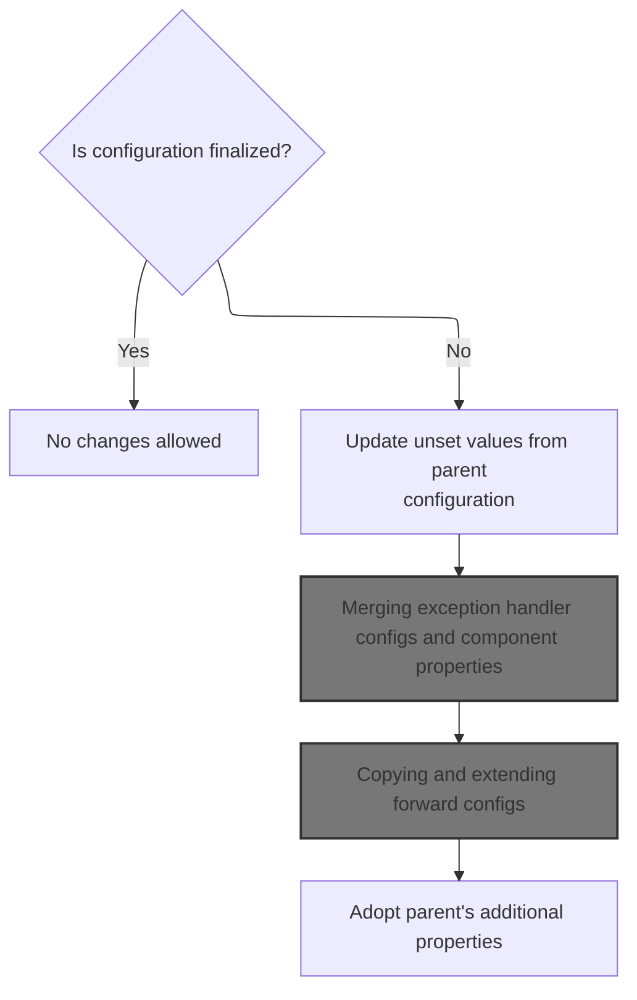
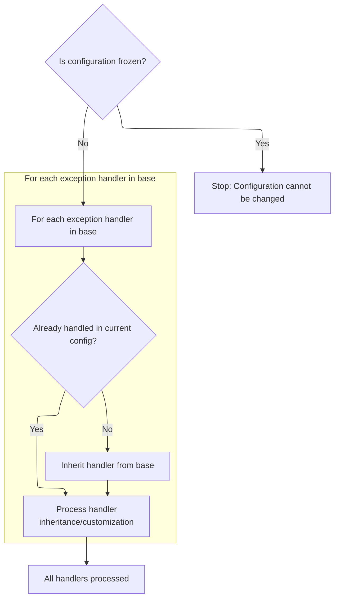
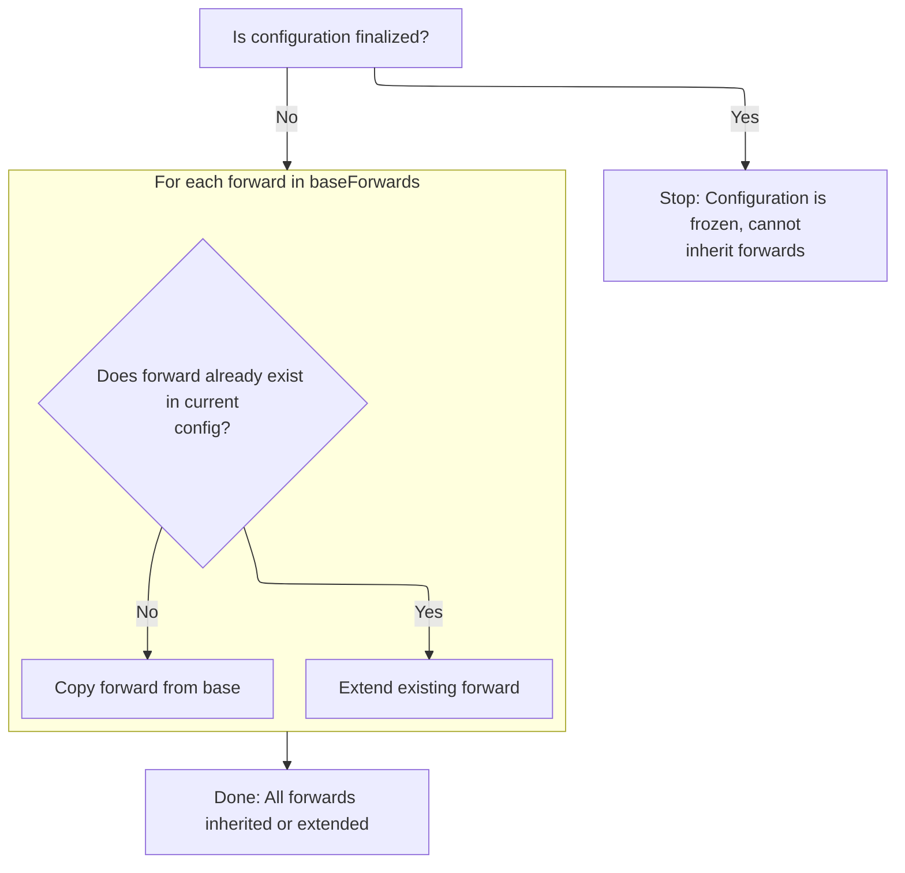
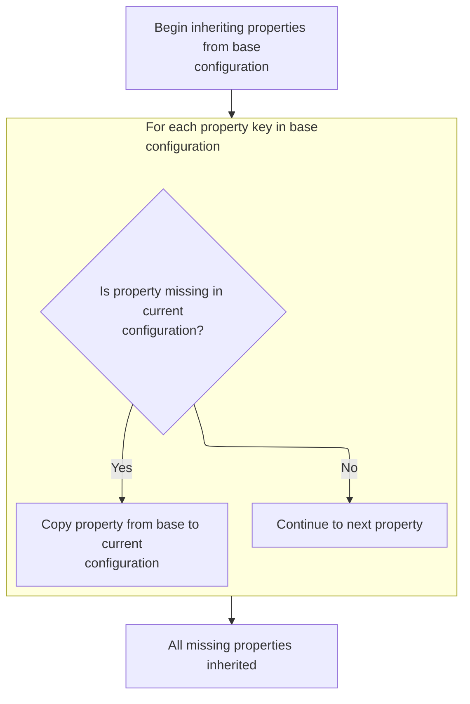

This document describes how configuration inheritance is achieved by merging missing properties, exception handlers, navigation forwards, and custom properties from a base configuration. This supports modular and reusable configuration management by allowing new configurations to extend existing ones, filling in only what is missing.

# Copying unset properties and flags from another <SwmToken path="core/src/main/java/org/apache/struts/config/ActionConfig.java" pos="961:7:7" line-data="    protected void inheritExceptionHandlers(ActionConfig baseConfig)">`ActionConfig`</SwmToken>



<SwmSnippet path="/core/src/main/java/org/apache/struts/config/ActionConfig.java" line="1199">

---

In <SwmToken path="core/src/main/java/org/apache/struts/config/ActionConfig.java" pos="1199:5:5" line-data="    public void inheritFrom(ActionConfig config)">`inheritFrom`</SwmToken>, we start by checking if the configuration is frozen, then look at each property. If <SwmToken path="core/src/main/java/org/apache/struts/config/ActionConfig.java" pos="67:19:19" line-data="     * &lt;p&gt; The request-scope or session-scope attribute name under which our">`attribute`</SwmToken> isn't set, we copy it from the provided config using <SwmToken path="core/src/main/java/org/apache/struts/config/ActionConfig.java" pos="1208:1:1" line-data="            setAttribute(config.getAttribute());">`setAttribute`</SwmToken>. This ensures we only fill in missing values, not overwrite anything already set.

```java
    public void inheritFrom(ActionConfig config)
        throws ClassNotFoundException, IllegalAccessException,
            InstantiationException, InvocationTargetException {
        if (configured) {
            throw new IllegalStateException("Configuration is frozen");
        }

        // Inherit values that have not been overridden
        if (getAttribute() == null) {
            setAttribute(config.getAttribute());
        }

```

---

</SwmSnippet>

<SwmSnippet path="/core/src/main/java/org/apache/struts/config/ActionConfig.java" line="1211">

---

Back in <SwmToken path="core/src/main/java/org/apache/struts/config/ActionConfig.java" pos="1199:5:5" line-data="    public void inheritFrom(ActionConfig config)">`inheritFrom`</SwmToken>, after handling the attribute, we check if <SwmToken path="core/src/main/java/org/apache/struts/config/ActionConfig.java" pos="1211:5:5" line-data="        if (!cancellableSet) {">`cancellableSet`</SwmToken> is false. If so, we inherit the cancellable property from the base config. This avoids overwriting any explicit setting and only fills in missing info.

```java
        if (!cancellableSet) {
            setCancellable(config.getCancellable());
        }

```

---

</SwmSnippet>

<SwmSnippet path="/core/src/main/java/org/apache/struts/config/ActionConfig.java" line="359">

---

<SwmToken path="core/src/main/java/org/apache/struts/config/ActionConfig.java" pos="359:5:5" line-data="    public void setCancellable(boolean cancellable) {">`setCancellable`</SwmToken> checks if the config is frozen and throws if so, then sets both the cancellable property and the <SwmToken path="core/src/main/java/org/apache/struts/config/ActionConfig.java" pos="365:3:3" line-data="        this.cancellableSet = true;">`cancellableSet`</SwmToken> flag. This makes sure the property can't be changed after finalization and tracks if it's been explicitly set.

```java
    public void setCancellable(boolean cancellable) {
        if (configured) {
            throw new IllegalStateException("Configuration is frozen");
        }

        this.cancellable = cancellable;
        this.cancellableSet = true;
    }
```

---

</SwmSnippet>

<SwmSnippet path="/core/src/main/java/org/apache/struts/config/ActionConfig.java" line="1215">

---

After returning from <SwmToken path="core/src/main/java/org/apache/struts/config/ActionConfig.java" pos="359:5:5" line-data="    public void setCancellable(boolean cancellable) {">`setCancellable`</SwmToken>, <SwmToken path="core/src/main/java/org/apache/struts/config/ActionConfig.java" pos="1199:5:5" line-data="    public void inheritFrom(ActionConfig config)">`inheritFrom`</SwmToken> checks if catalog is unset and copies it from the base config. This keeps any explicit catalog untouched and fills in missing values.

```java
        if (getCatalog() == null) {
            setCatalog(config.getCatalog());
        }

```

---

</SwmSnippet>

<SwmSnippet path="/core/src/main/java/org/apache/struts/config/ActionConfig.java" line="1219">

---

After <SwmToken path="core/src/main/java/org/apache/struts/config/ActionConfig.java" pos="1216:1:1" line-data="            setCatalog(config.getCatalog());">`setCatalog`</SwmToken>, <SwmToken path="core/src/main/java/org/apache/struts/config/ActionConfig.java" pos="1199:5:5" line-data="    public void inheritFrom(ActionConfig config)">`inheritFrom`</SwmToken> checks if command is unset and copies it from the base config. This keeps any explicit command untouched and fills in missing values.

```java
        if (getCommand() == null) {
            setCommand(config.getCommand());
        }

```

---

</SwmSnippet>

<SwmSnippet path="/core/src/main/java/org/apache/struts/config/ActionConfig.java" line="1223">

---

After <SwmToken path="core/src/main/java/org/apache/struts/config/ActionConfig.java" pos="1220:1:1" line-data="            setCommand(config.getCommand());">`setCommand`</SwmToken>, <SwmToken path="core/src/main/java/org/apache/struts/config/ActionConfig.java" pos="1199:5:5" line-data="    public void inheritFrom(ActionConfig config)">`inheritFrom`</SwmToken> checks if forward is unset and copies it from the base config. This keeps any explicit forward untouched and fills in missing values.

```java
        if (getForward() == null) {
            setForward(config.getForward());
        }

```

---

</SwmSnippet>

<SwmSnippet path="/core/src/main/java/org/apache/struts/config/ActionConfig.java" line="1227">

---

After <SwmToken path="core/src/main/java/org/apache/struts/config/ActionConfig.java" pos="1224:1:1" line-data="            setForward(config.getForward());">`setForward`</SwmToken>, <SwmToken path="core/src/main/java/org/apache/struts/config/ActionConfig.java" pos="1199:5:5" line-data="    public void inheritFrom(ActionConfig config)">`inheritFrom`</SwmToken> checks if include is unset and copies it from the base config. This keeps any explicit include untouched and fills in missing values.

```java
        if (getInclude() == null) {
            setInclude(config.getInclude());
        }

```

---

</SwmSnippet>

<SwmSnippet path="/core/src/main/java/org/apache/struts/config/ActionConfig.java" line="1231">

---

After <SwmToken path="core/src/main/java/org/apache/struts/config/ActionConfig.java" pos="1228:1:1" line-data="            setInclude(config.getInclude());">`setInclude`</SwmToken>, <SwmToken path="core/src/main/java/org/apache/struts/config/ActionConfig.java" pos="1199:5:5" line-data="    public void inheritFrom(ActionConfig config)">`inheritFrom`</SwmToken> checks if input is unset and copies it from the base config. This keeps any explicit input untouched and fills in missing values.

```java
        if (getInput() == null) {
            setInput(config.getInput());
        }

```

---

</SwmSnippet>

<SwmSnippet path="/core/src/main/java/org/apache/struts/config/ActionConfig.java" line="1235">

---

After <SwmToken path="core/src/main/java/org/apache/struts/config/ActionConfig.java" pos="1232:1:1" line-data="            setInput(config.getInput());">`setInput`</SwmToken>, <SwmToken path="core/src/main/java/org/apache/struts/config/ActionConfig.java" pos="1199:5:5" line-data="    public void inheritFrom(ActionConfig config)">`inheritFrom`</SwmToken> checks if <SwmToken path="core/src/main/java/org/apache/struts/config/ActionConfig.java" pos="136:5:5" line-data="    protected String multipartClass = null;">`multipartClass`</SwmToken> and name are unset and copies them from the base config. This keeps any explicit values untouched and fills in missing values.

```java
        if (getMultipartClass() == null) {
            setMultipartClass(config.getMultipartClass());
        }

        if (getName() == null) {
            setName(config.getName());
        }

```

---

</SwmSnippet>

<SwmSnippet path="/core/src/main/java/org/apache/struts/config/ActionConfig.java" line="1243">

---

After <SwmToken path="core/src/main/java/org/apache/struts/config/ActionConfig.java" pos="1240:1:1" line-data="            setName(config.getName());">`setName`</SwmToken>, <SwmToken path="core/src/main/java/org/apache/struts/config/ActionConfig.java" pos="1199:5:5" line-data="    public void inheritFrom(ActionConfig config)">`inheritFrom`</SwmToken> checks if parameter is unset and copies it from the base config. This keeps any explicit parameter untouched and fills in missing values.

```java
        if (getParameter() == null) {
            setParameter(config.getParameter());
        }

```

---

</SwmSnippet>

<SwmSnippet path="/core/src/main/java/org/apache/struts/config/ActionConfig.java" line="1247">

---

After <SwmToken path="core/src/main/java/org/apache/struts/config/ActionConfig.java" pos="1244:1:1" line-data="            setParameter(config.getParameter());">`setParameter`</SwmToken>, <SwmToken path="core/src/main/java/org/apache/struts/config/ActionConfig.java" pos="1199:5:5" line-data="    public void inheritFrom(ActionConfig config)">`inheritFrom`</SwmToken> checks if path is unset and copies it from the base config. This keeps any explicit path untouched and fills in missing values.

```java
        if (getPath() == null) {
            setPath(config.getPath());
        }

```

---

</SwmSnippet>

<SwmSnippet path="/core/src/main/java/org/apache/struts/config/ActionConfig.java" line="1251">

---

After <SwmToken path="core/src/main/java/org/apache/struts/config/ActionConfig.java" pos="1248:1:1" line-data="            setPath(config.getPath());">`setPath`</SwmToken>, <SwmToken path="core/src/main/java/org/apache/struts/config/ActionConfig.java" pos="1199:5:5" line-data="    public void inheritFrom(ActionConfig config)">`inheritFrom`</SwmToken> checks if prefix is unset and copies it from the base config. This keeps any explicit prefix untouched and fills in missing values.

```java
        if (getPrefix() == null) {
            setPrefix(config.getPrefix());
        }

```

---

</SwmSnippet>

<SwmSnippet path="/core/src/main/java/org/apache/struts/config/ActionConfig.java" line="1255">

---

After <SwmToken path="core/src/main/java/org/apache/struts/config/ActionConfig.java" pos="1252:1:1" line-data="            setPrefix(config.getPrefix());">`setPrefix`</SwmToken>, <SwmToken path="core/src/main/java/org/apache/struts/config/ActionConfig.java" pos="1199:5:5" line-data="    public void inheritFrom(ActionConfig config)">`inheritFrom`</SwmToken> checks if roles is unset and copies it from the base config. This keeps any explicit roles untouched and fills in missing values.

```java
        if (getRoles() == null) {
            setRoles(config.getRoles());
        }

```

---

</SwmSnippet>

<SwmSnippet path="/core/src/main/java/org/apache/struts/config/ActionConfig.java" line="1259">

---

After <SwmToken path="core/src/main/java/org/apache/struts/config/ActionConfig.java" pos="1256:1:1" line-data="            setRoles(config.getRoles());">`setRoles`</SwmToken>, <SwmToken path="core/src/main/java/org/apache/struts/config/ActionConfig.java" pos="1199:5:5" line-data="    public void inheritFrom(ActionConfig config)">`inheritFrom`</SwmToken> checks if scope is 'session' and only then copies it from the base config. This is a special case, probably to preserve session-specific logic.

```java
        if (getScope().equals("session")) {
            setScope(config.getScope());
        }

```

---

</SwmSnippet>

<SwmSnippet path="/core/src/main/java/org/apache/struts/config/ActionConfig.java" line="652">

---

<SwmToken path="core/src/main/java/org/apache/struts/config/ActionConfig.java" pos="652:5:5" line-data="    public void setScope(String scope) {">`setScope`</SwmToken> checks if the config is frozen and throws if so, then sets the scope. This makes sure the property can't be changed after finalization.

```java
    public void setScope(String scope) {
        if (configured) {
            throw new IllegalStateException("Configuration is frozen");
        }

        this.scope = scope;
    }
```

---

</SwmSnippet>

<SwmSnippet path="/core/src/main/java/org/apache/struts/config/ActionConfig.java" line="1263">

---

After <SwmToken path="core/src/main/java/org/apache/struts/config/ActionConfig.java" pos="652:5:5" line-data="    public void setScope(String scope) {">`setScope`</SwmToken>, <SwmToken path="core/src/main/java/org/apache/struts/config/ActionConfig.java" pos="1199:5:5" line-data="    public void inheritFrom(ActionConfig config)">`inheritFrom`</SwmToken> checks if suffix is unset and copies it from the base config. This keeps any explicit suffix untouched and fills in missing values.

```java
        if (getSuffix() == null) {
            setSuffix(config.getSuffix());
        }

```

---

</SwmSnippet>

<SwmSnippet path="/core/src/main/java/org/apache/struts/config/ActionConfig.java" line="1267">

---

After <SwmToken path="core/src/main/java/org/apache/struts/config/ActionConfig.java" pos="1264:1:1" line-data="            setSuffix(config.getSuffix());">`setSuffix`</SwmToken>, <SwmToken path="core/src/main/java/org/apache/struts/config/ActionConfig.java" pos="1199:5:5" line-data="    public void inheritFrom(ActionConfig config)">`inheritFrom`</SwmToken> checks if type is unset and copies it from the base config. This keeps any explicit type untouched and fills in missing values.

```java
        if (getType() == null) {
            setType(config.getType());
        }

```

---

</SwmSnippet>

<SwmSnippet path="/core/src/main/java/org/apache/struts/config/ActionConfig.java" line="1271">

---

After <SwmToken path="core/src/main/java/org/apache/struts/config/ActionConfig.java" pos="1268:1:1" line-data="            setType(config.getType());">`setType`</SwmToken>, <SwmToken path="core/src/main/java/org/apache/struts/config/ActionConfig.java" pos="1199:5:5" line-data="    public void inheritFrom(ActionConfig config)">`inheritFrom`</SwmToken> checks if unknown is false and copies it from the base config. This keeps any explicit unknown untouched and fills in missing values.

```java
        if (!getUnknown()) {
            setUnknown(config.getUnknown());
        }

```

---

</SwmSnippet>

<SwmSnippet path="/core/src/main/java/org/apache/struts/config/ActionConfig.java" line="808">

---

<SwmToken path="core/src/main/java/org/apache/struts/config/ActionConfig.java" pos="808:5:5" line-data="    public void setUnknown(boolean unknown) {">`setUnknown`</SwmToken> checks if the config is frozen and throws if so, then sets the unknown property. This makes sure the property can't be changed after finalization.

```java
    public void setUnknown(boolean unknown) {
        if (configured) {
            throw new IllegalStateException("Configuration is frozen");
        }

        this.unknown = unknown;
    }
```

---

</SwmSnippet>

<SwmSnippet path="/core/src/main/java/org/apache/struts/config/ActionConfig.java" line="1275">

---

After <SwmToken path="core/src/main/java/org/apache/struts/config/ActionConfig.java" pos="808:5:5" line-data="    public void setUnknown(boolean unknown) {">`setUnknown`</SwmToken>, <SwmToken path="core/src/main/java/org/apache/struts/config/ActionConfig.java" pos="1199:5:5" line-data="    public void inheritFrom(ActionConfig config)">`inheritFrom`</SwmToken> checks if <SwmToken path="core/src/main/java/org/apache/struts/config/ActionConfig.java" pos="1275:5:5" line-data="        if (!validateSet) {">`validateSet`</SwmToken> is false. If so, it inherits the validate property from the base config. This avoids overwriting any explicit setting and only fills in missing info.

```java
        if (!validateSet) {
            setValidate(config.getValidate());
        }

```

---

</SwmSnippet>

<SwmSnippet path="/core/src/main/java/org/apache/struts/config/ActionConfig.java" line="820">

---

<SwmToken path="core/src/main/java/org/apache/struts/config/ActionConfig.java" pos="820:5:5" line-data="    public void setValidate(boolean validate) {">`setValidate`</SwmToken> checks if the config is frozen and throws if so, then sets both the validate property and the <SwmToken path="core/src/main/java/org/apache/struts/config/ActionConfig.java" pos="826:3:3" line-data="        this.validateSet = true;">`validateSet`</SwmToken> flag. This makes sure the property can't be changed after finalization and tracks if it's been explicitly set.

```java
    public void setValidate(boolean validate) {
        if (configured) {
            throw new IllegalStateException("Configuration is frozen");
        }

        this.validate = validate;
        this.validateSet = true;
    }
```

---

</SwmSnippet>

<SwmSnippet path="/core/src/main/java/org/apache/struts/config/ActionConfig.java" line="1279">

---

After <SwmToken path="core/src/main/java/org/apache/struts/config/ActionConfig.java" pos="820:5:5" line-data="    public void setValidate(boolean validate) {">`setValidate`</SwmToken>, <SwmToken path="core/src/main/java/org/apache/struts/config/ActionConfig.java" pos="1199:5:5" line-data="    public void inheritFrom(ActionConfig config)">`inheritFrom`</SwmToken> calls <SwmToken path="core/src/main/java/org/apache/struts/config/ActionConfig.java" pos="1279:1:1" line-data="        inheritExceptionHandlers(config);">`inheritExceptionHandlers`</SwmToken> to merge exception handler configs from the base config, filling in any missing error handling logic.

```java
        inheritExceptionHandlers(config);
```

---

</SwmSnippet>

## Merging exception handler configs and component properties



<SwmSnippet path="/core/src/main/java/org/apache/struts/config/ActionConfig.java" line="961">

---

In <SwmToken path="core/src/main/java/org/apache/struts/config/ActionConfig.java" pos="961:5:5" line-data="    protected void inheritExceptionHandlers(ActionConfig baseConfig)">`inheritExceptionHandlers`</SwmToken>, we check if the config is frozen, then iterate over base exception handlers. If a handler isn't present, we create a new instance using reflection, copy its properties, and add it. This lets us inherit missing handlers dynamically.

```java
    protected void inheritExceptionHandlers(ActionConfig baseConfig)
        throws ClassNotFoundException, IllegalAccessException,
            InstantiationException, InvocationTargetException {
        if (configured) {
            throw new IllegalStateException("Configuration is frozen");
        }

        // Inherit exception handler configs
        ExceptionConfig[] baseHandlers = baseConfig.findExceptionConfigs();

        for (int i = 0; i < baseHandlers.length; i++) {
            ExceptionConfig baseHandler = baseHandlers[i];

            // Do we have this handler?
            ExceptionConfig copy =
                this.findExceptionConfig(baseHandler.getType());

            if (copy == null) {
                // We don't have this, so let's copy it
                copy =
                    (ExceptionConfig) RequestUtils.applicationInstance(baseHandler.getClass()
                                                                                  .getName());

                BeanUtils.copyProperties(copy, baseHandler);
                this.addExceptionConfig(copy);
                copy.setProperties(baseHandler.copyProperties());
```

---

</SwmSnippet>

<SwmSnippet path="/core/src/main/java/org/apache/struts/config/ActionConfig.java" line="986">

---

After copying the exception handler config, <SwmToken path="core/src/main/java/org/apache/struts/config/ActionConfig.java" pos="961:5:5" line-data="    protected void inheritExceptionHandlers(ActionConfig baseConfig)">`inheritExceptionHandlers`</SwmToken> calls <SwmToken path="core/src/main/java/org/apache/struts/config/ActionConfig.java" pos="986:3:3" line-data="                copy.setProperties(baseHandler.copyProperties());">`setProperties`</SwmToken> to initialize any extra properties, making sure the handler is fully set up.

```java
                copy.setProperties(baseHandler.copyProperties());
            } else {
```

---

</SwmSnippet>

<SwmSnippet path="/apps/faces-example1/src/main/java/org/apache/struts/webapp/example/LinkSubscriptionTag.java" line="109">

---

<SwmToken path="apps/faces-example1/src/main/java/org/apache/struts/webapp/example/LinkSubscriptionTag.java" pos="109:5:5" line-data="    protected void setProperties(UIComponent component) {">`setProperties`</SwmToken> checks if 'name' and 'page' are expressions or literals. If they're expressions, it creates a <SwmToken path="apps/faces-example1/src/main/java/org/apache/struts/webapp/example/LinkSubscriptionTag.java" pos="115:1:1" line-data="                ValueBinding vb =">`ValueBinding`</SwmToken>; otherwise, it sets them directly. This lets the component handle both static and dynamic values.

```java
    protected void setProperties(UIComponent component) {

        super.setProperties(component);
        FacesContext context = getFacesContext();
        if (name != null) {
            if (isValueReference(name)) {
                ValueBinding vb =
                    context.getApplication().createValueBinding(name);
                component.setValueBinding("name", vb);
            } else {
                component.getAttributes().put("name", name);
            }
        }
        if (page != null) {
            if (isValueReference(page)) {
                ValueBinding vb =
                    context.getApplication().createValueBinding(page);
                component.setValueBinding("page", vb);
            } else {
                component.getAttributes().put("page", page);
            }
        }

    }
```

---

</SwmSnippet>

<SwmSnippet path="/core/src/main/java/org/apache/struts/config/ActionConfig.java" line="988">

---

After setting up the handler properties, <SwmToken path="core/src/main/java/org/apache/struts/config/ActionConfig.java" pos="961:5:5" line-data="    protected void inheritExceptionHandlers(ActionConfig baseConfig)">`inheritExceptionHandlers`</SwmToken> calls <SwmToken path="core/src/main/java/org/apache/struts/config/ActionConfig.java" pos="989:3:3" line-data="                copy.processExtends(getModuleConfig(), this);">`processExtends`</SwmToken> to handle any extension logic, making sure inherited handlers can be further customized.

```java
                // process any extension that this config might have
                copy.processExtends(getModuleConfig(), this);
            }
        }
    }
```

---

</SwmSnippet>

## Merging forward configs after exception handlers

<SwmSnippet path="/core/src/main/java/org/apache/struts/config/ActionConfig.java" line="1280">

---

After <SwmToken path="core/src/main/java/org/apache/struts/config/ActionConfig.java" pos="961:5:5" line-data="    protected void inheritExceptionHandlers(ActionConfig baseConfig)">`inheritExceptionHandlers`</SwmToken>, <SwmToken path="core/src/main/java/org/apache/struts/config/ActionConfig.java" pos="1199:5:5" line-data="    public void inheritFrom(ActionConfig config)">`inheritFrom`</SwmToken> calls <SwmToken path="core/src/main/java/org/apache/struts/config/ActionConfig.java" pos="1280:1:1" line-data="        inheritForwards(config);">`inheritForwards`</SwmToken> to merge navigation configs from the base config, filling in any missing forward logic.

```java
        inheritForwards(config);
```

---

</SwmSnippet>

## Copying and extending forward configs



<SwmSnippet path="/core/src/main/java/org/apache/struts/config/ActionConfig.java" line="1001">

---

In <SwmToken path="core/src/main/java/org/apache/struts/config/ActionConfig.java" pos="1001:5:5" line-data="    protected void inheritForwards(ActionConfig baseConfig)">`inheritForwards`</SwmToken>, we check if the config is frozen, then iterate over base forward configs. If a forward isn't present, we create a new instance using reflection, copy its properties, and add it. This lets us inherit missing forwards dynamically.

```java
    protected void inheritForwards(ActionConfig baseConfig)
        throws ClassNotFoundException, IllegalAccessException,
            InstantiationException, InvocationTargetException {
        if (configured) {
            throw new IllegalStateException("Configuration is frozen");
        }

        // Inherit forward configs
        ForwardConfig[] baseForwards = baseConfig.findForwardConfigs();

        for (int i = 0; i < baseForwards.length; i++) {
            ForwardConfig baseForward = baseForwards[i];

            // Do we have this forward?
            ForwardConfig copy = this.findForwardConfig(baseForward.getName());

            if (copy == null) {
                // We don't have this, so let's copy it
                copy =
                    (ForwardConfig) RequestUtils.applicationInstance(baseForward.getClass()
                                                                                .getName());
                BeanUtils.copyProperties(copy, baseForward);

```

---

</SwmSnippet>

<SwmSnippet path="/core/src/main/java/org/apache/struts/config/ActionConfig.java" line="1024">

---

After copying the forward config, <SwmToken path="core/src/main/java/org/apache/struts/config/ActionConfig.java" pos="1001:5:5" line-data="    protected void inheritForwards(ActionConfig baseConfig)">`inheritForwards`</SwmToken> calls <SwmToken path="core/src/main/java/org/apache/struts/config/ActionConfig.java" pos="1024:3:3" line-data="                this.addForwardConfig(copy);">`addForwardConfig`</SwmToken> to register the new forward, making it available for navigation.

```java
                this.addForwardConfig(copy);
```

---

</SwmSnippet>

<SwmSnippet path="/core/src/main/java/org/apache/struts/config/ActionConfig.java" line="1025">

---

After adding the forward, <SwmToken path="core/src/main/java/org/apache/struts/config/ActionConfig.java" pos="1001:5:5" line-data="    protected void inheritForwards(ActionConfig baseConfig)">`inheritForwards`</SwmToken> calls <SwmToken path="core/src/main/java/org/apache/struts/config/ActionConfig.java" pos="1025:3:3" line-data="                copy.setProperties(baseForward.copyProperties());">`setProperties`</SwmToken> to initialize any extra properties, making sure the forward is fully set up.

```java
                copy.setProperties(baseForward.copyProperties());
```

---

</SwmSnippet>

<SwmSnippet path="/core/src/main/java/org/apache/struts/config/ActionConfig.java" line="1025">

---

After setting up the forward properties, <SwmToken path="core/src/main/java/org/apache/struts/config/ActionConfig.java" pos="1001:5:5" line-data="    protected void inheritForwards(ActionConfig baseConfig)">`inheritForwards`</SwmToken> moves on to handle any extension logic if the forward already exists.

```java
                copy.setProperties(baseForward.copyProperties());
            } else {
```

---

</SwmSnippet>

<SwmSnippet path="/core/src/main/java/org/apache/struts/config/ActionConfig.java" line="1027">

---

After setting up the forward properties, <SwmToken path="core/src/main/java/org/apache/struts/config/ActionConfig.java" pos="1001:5:5" line-data="    protected void inheritForwards(ActionConfig baseConfig)">`inheritForwards`</SwmToken> calls <SwmToken path="core/src/main/java/org/apache/struts/config/ActionConfig.java" pos="1028:3:3" line-data="                copy.processExtends(getModuleConfig(), this);">`processExtends`</SwmToken> to handle any extension logic, making sure inherited forwards can be further customized.

```java
                // process any extension for this forward
                copy.processExtends(getModuleConfig(), this);
            }
        }
    }
```

---

</SwmSnippet>

## Merging custom properties after forwards



<SwmSnippet path="/core/src/main/java/org/apache/struts/config/ActionConfig.java" line="1281">

---

After <SwmToken path="core/src/main/java/org/apache/struts/config/ActionConfig.java" pos="1001:5:5" line-data="    protected void inheritForwards(ActionConfig baseConfig)">`inheritForwards`</SwmToken>, <SwmToken path="core/src/main/java/org/apache/struts/config/ActionConfig.java" pos="1199:5:5" line-data="    public void inheritFrom(ActionConfig config)">`inheritFrom`</SwmToken> calls <SwmToken path="core/src/main/java/org/apache/struts/config/ActionConfig.java" pos="1281:1:1" line-data="        inheritProperties(config);">`inheritProperties`</SwmToken> to merge any custom properties from the base config, filling in missing values without overwriting explicit settings.

```java
        inheritProperties(config);
    }
```

---

</SwmSnippet>

<SwmSnippet path="/core/src/main/java/org/apache/struts/config/BaseConfig.java" line="132">

---

<SwmToken path="core/src/main/java/org/apache/struts/config/BaseConfig.java" pos="132:5:5" line-data="    protected void inheritProperties(BaseConfig baseConfig) {">`inheritProperties`</SwmToken> checks if the config is frozen, then iterates over base properties. If a property isn't present, it copies it from the base config. This fills in missing custom properties without overwriting anything already set.

```java
    protected void inheritProperties(BaseConfig baseConfig) {
        throwIfConfigured();

        // Inherit forward properties
        Properties baseProperties = baseConfig.getProperties();
        Enumeration keys = baseProperties.propertyNames();

        while (keys.hasMoreElements()) {
            String key = (String) keys.nextElement();

            // Check if we have this property before copying it
            String value = this.getProperty(key);

            if (value == null) {
                value = baseProperties.getProperty(key);
                setProperty(key, value);
            }
        }
    }
```

---

</SwmSnippet>

&nbsp;

*This is an auto-generated document by Swimm 🌊 and has not yet been verified by a human*

<SwmMeta version="3.0.0" repo-id="Z2l0aHViJTNBJTNBc3RydXRzMSUzQSUzQVN3aW1tLURlbW8=" repo-name="struts1"><sup>Powered by [Swimm](https://app.swimm.io/)</sup></SwmMeta>
