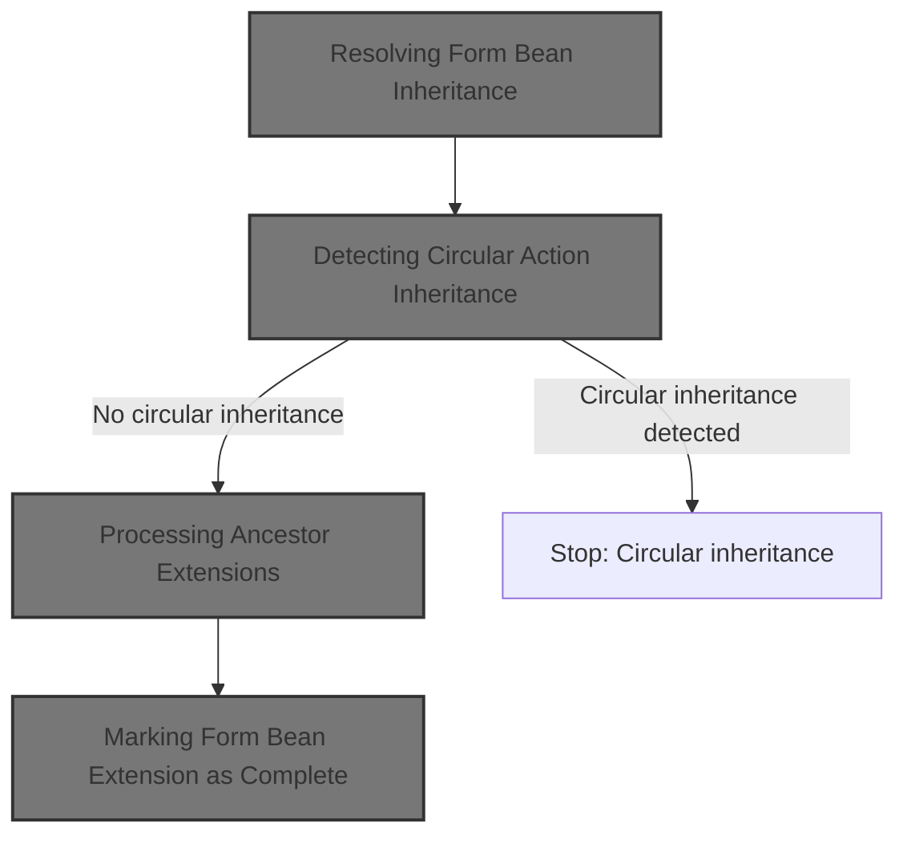
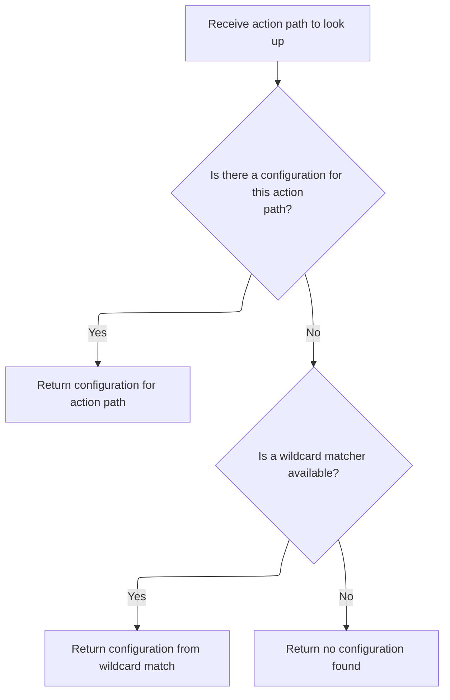
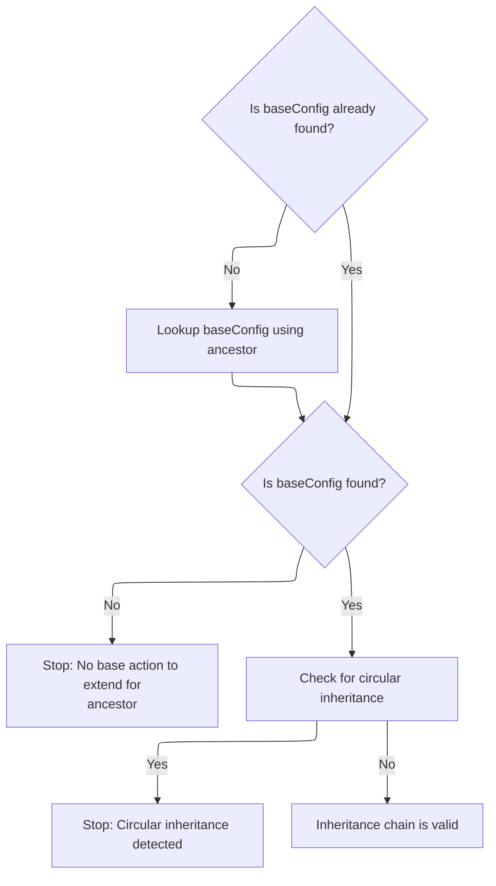
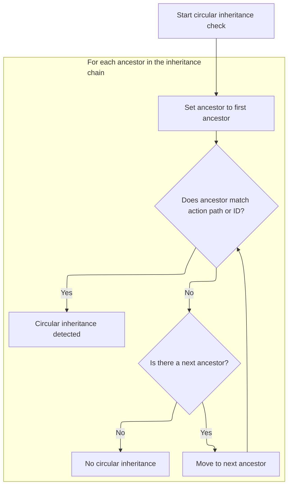
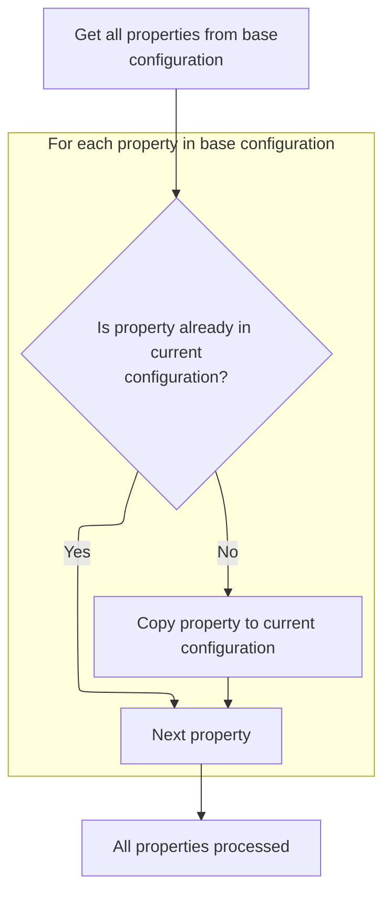
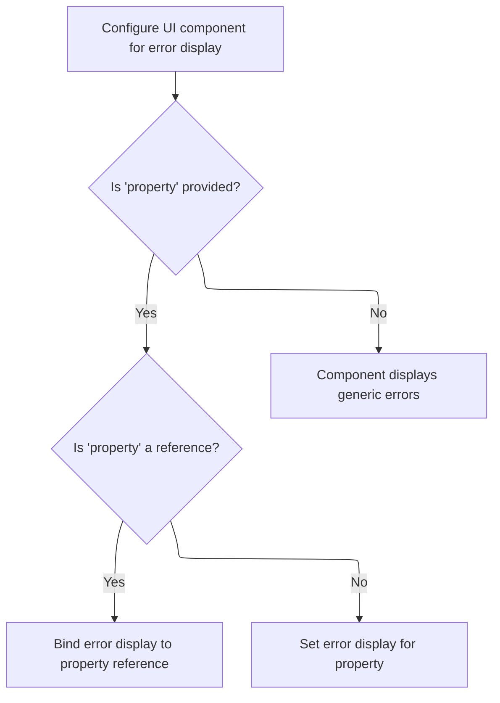

This document explains how configuration inheritance is resolved for form beans and actions. The flow ensures that all inherited properties are applied, circular references are avoided, and dependencies are processed in the correct order. The input is a configuration that may extend another, and the output is a fully resolved configuration with all inherited settings.



# Resolving Form Bean Inheritance

```mermaid
%%{init: {"flowchart": {"defaultRenderer": "elk"}} }%%
flowchart TD
    node1{"Is configuration frozen?"}
    click node1 openCode "core/src/main/java/org/apache/struts/config/FormBeanConfig.java:531:533"
    node1 -->|"Yes"| node5["Stop: Configuration is frozen"]
    click node5 openCode "core/src/main/java/org/apache/struts/config/FormBeanConfig.java:532:533"
    node1 -->|"No"| node2{"Does this config extend another and not
yet processed?"}
    click node2 openCode "core/src/main/java/org/apache/struts/config/FormBeanConfig.java:535:537"
    node2 -->|"No"| node6["Mark extension as processed"]
    click node6 openCode "core/src/main/java/org/apache/struts/config/FormBeanConfig.java:562:563"
    node2 -->|"Yes"| node3{"Is ancestor config found?"}
    click node3 openCode "core/src/main/java/org/apache/struts/config/FormBeanConfig.java:538:544"
    node3 -->|"No"| node7["Stop: Ancestor not found"]
    click node7 openCode "core/src/main/java/org/apache/struts/config/FormBeanConfig.java:542:544"
    node3 -->|"Yes"| node8{"Is there circular inheritance?"}
    click node8 openCode "core/src/main/java/org/apache/struts/config/FormBeanConfig.java:548:551"
    node8 -->|"Yes"| node9["Stop: Circular inheritance detected"]
    click node9 openCode "core/src/main/java/org/apache/struts/config/FormBeanConfig.java:549:551"
    node8 -->|"No"| node10{"Has ancestor's extension been
processed?"}
    click node10 openCode "core/src/main/java/org/apache/struts/config/FormBeanConfig.java:554:556"
    node10 -->|"No"| node2b["Resolving Action Inheritance"]
    
    node10 -->|"Yes"| node4["Copying Form Bean Properties"]
    
    node2b --> node4
    node4 --> node6
classDef HeadingStyle fill:#777777,stroke:#333,stroke-width:2px;
click node4 goToHeading "Copying Form Bean Properties"
node4:::HeadingStyle
click node2b goToHeading "Resolving Action Inheritance"
node2b:::HeadingStyle

%% Swimm:
%% %%{init: {"flowchart": {"defaultRenderer": "elk"}} }%%
%% flowchart TD
%%     node1{"Is configuration frozen?"}
%%     click node1 openCode "<SwmPath>[core/…/config/FormBeanConfig.java](core/src/main/java/org/apache/struts/config/FormBeanConfig.java)</SwmPath>:531:533"
%%     node1 -->|"Yes"| node5["Stop: Configuration is frozen"]
%%     click node5 openCode "<SwmPath>[core/…/config/FormBeanConfig.java](core/src/main/java/org/apache/struts/config/FormBeanConfig.java)</SwmPath>:532:533"
%%     node1 -->|"No"| node2{"Does this config extend another and not
%% yet processed?"}
%%     click node2 openCode "<SwmPath>[core/…/config/FormBeanConfig.java](core/src/main/java/org/apache/struts/config/FormBeanConfig.java)</SwmPath>:535:537"
%%     node2 -->|"No"| node6["Mark extension as processed"]
%%     click node6 openCode "<SwmPath>[core/…/config/FormBeanConfig.java](core/src/main/java/org/apache/struts/config/FormBeanConfig.java)</SwmPath>:562:563"
%%     node2 -->|"Yes"| node3{"Is ancestor config found?"}
%%     click node3 openCode "<SwmPath>[core/…/config/FormBeanConfig.java](core/src/main/java/org/apache/struts/config/FormBeanConfig.java)</SwmPath>:538:544"
%%     node3 -->|"No"| node7["Stop: Ancestor not found"]
%%     click node7 openCode "<SwmPath>[core/…/config/FormBeanConfig.java](core/src/main/java/org/apache/struts/config/FormBeanConfig.java)</SwmPath>:542:544"
%%     node3 -->|"Yes"| node8{"Is there circular inheritance?"}
%%     click node8 openCode "<SwmPath>[core/…/config/FormBeanConfig.java](core/src/main/java/org/apache/struts/config/FormBeanConfig.java)</SwmPath>:548:551"
%%     node8 -->|"Yes"| node9["Stop: Circular inheritance detected"]
%%     click node9 openCode "<SwmPath>[core/…/config/FormBeanConfig.java](core/src/main/java/org/apache/struts/config/FormBeanConfig.java)</SwmPath>:549:551"
%%     node8 -->|"No"| node10{"Has ancestor's extension been
%% processed?"}
%%     click node10 openCode "<SwmPath>[core/…/config/FormBeanConfig.java](core/src/main/java/org/apache/struts/config/FormBeanConfig.java)</SwmPath>:554:556"
%%     node10 -->|"No"| node2b["Resolving Action Inheritance"]
%%     
%%     node10 -->|"Yes"| node4["Copying Form Bean Properties"]
%%     
%%     node2b --> node4
%%     node4 --> node6
%% classDef HeadingStyle fill:#777777,stroke:#333,stroke-width:2px;
%% click node4 goToHeading "Copying Form Bean Properties"
%% node4:::HeadingStyle
%% click node2b goToHeading "Resolving Action Inheritance"
%% node2b:::HeadingStyle
```



<SwmSnippet path="/core/src/main/java/org/apache/struts/config/FormBeanConfig.java" line="528">

---

In <SwmToken path="core/src/main/java/org/apache/struts/config/FormBeanConfig.java" pos="528:5:5" line-data="    public void processExtends(ModuleConfig moduleConfig)">`processExtends`</SwmToken>, we check if the config is frozen, grab the ancestor name, and if we haven't processed the extension yet and there's an ancestor, we look up the ancestor config in the module. If it's missing, we throw. We check for circular inheritance to avoid infinite loops. If the ancestor's extension isn't processed, we recursively process it. After all that, we inherit properties from the ancestor. Next up, we need to call <SwmToken path="core/src/main/java/org/apache/struts/config/ActionConfig.java" pos="939:1:1" line-data="            ActionConfig baseConfig = moduleConfig.findActionConfig(ancestor);">`ActionConfig`</SwmToken> because the inheritance logic for actions follows a similar pattern and needs to be resolved before we can finish processing form bean inheritance.

```java
    public void processExtends(ModuleConfig moduleConfig)
        throws ClassNotFoundException, IllegalAccessException,
            InstantiationException, InvocationTargetException {
        if (configured) {
            throw new IllegalStateException("Configuration is frozen");
        }

        String ancestor = getExtends();

        if ((!extensionProcessed) && (ancestor != null)) {
            FormBeanConfig baseConfig =
                moduleConfig.findFormBeanConfig(ancestor);

            if (baseConfig == null) {
                throw new NullPointerException("Unable to find "
                    + "form bean '" + ancestor + "' to extend.");
            }

            // Check against circule inheritance and make sure the base config's
            //  own extends have been processed already
            if (checkCircularInheritance(moduleConfig)) {
                throw new IllegalArgumentException(
                    "Circular inheritance detected for form bean " + getName());
            }

            // Make sure the ancestor's own extension has been processed.
            if (!baseConfig.isExtensionProcessed()) {
                baseConfig.processExtends(moduleConfig);
            }

```

---

</SwmSnippet>

## Resolving Action Inheritance

```mermaid
%%{init: {"flowchart": {"defaultRenderer": "elk"}} }%%
flowchart TD
    node1{"Is configuration frozen?"}
    click node1 openCode "core/src/main/java/org/apache/struts/config/ActionConfig.java:1296:1298"
    node1 -->|"Yes"| node9["Stop: Configuration is frozen"]
    click node9 openCode "core/src/main/java/org/apache/struts/config/ActionConfig.java:1297:1298"
    node1 -->|"No"| node2{"Does this action extend another?"}
    click node2 openCode "core/src/main/java/org/apache/struts/config/ActionConfig.java:1300:1302"
    node2 -->|"No"| node8["Mark inheritance as processed"]
    click node8 openCode "core/src/main/java/org/apache/struts/config/ActionConfig.java:1330:1331"
    node2 -->|"Yes"| node3["Locating Action Configurations"]
    
    node3 --> node4{"Is ancestor found?"}
    click node4 openCode "core/src/main/java/org/apache/struts/config/ActionConfig.java:1305:1312"
    node4 -->|"No"| node9
    node4 -->|"Yes"| node5["Detecting Circular Action Inheritance"]
    
    node5 --> node6{"Is there a circular inheritance?"}
    click node6 openCode "core/src/main/java/org/apache/struts/config/ActionConfig.java:1316:1319"
    node6 -->|"Yes"| node9
    node6 -->|"No"| node7{"Has ancestor's inheritance been
processed?"}
    click node7 openCode "core/src/main/java/org/apache/struts/config/ActionConfig.java:1322:1324"
    node7 -->|"No"| node10["Process ancestor's inheritance"]
    click node10 openCode "core/src/main/java/org/apache/struts/config/ActionConfig.java:1323:1324"
    node7 -->|"Yes"| node11["Copying Action Properties"]
    
    node10 --> node11
    node11 --> node8
classDef HeadingStyle fill:#777777,stroke:#333,stroke-width:2px;
click node3 goToHeading "Locating Action Configurations"
node3:::HeadingStyle
click node5 goToHeading "Detecting Circular Action Inheritance"
node5:::HeadingStyle
click node11 goToHeading "Copying Action Properties"
node11:::HeadingStyle

%% Swimm:
%% %%{init: {"flowchart": {"defaultRenderer": "elk"}} }%%
%% flowchart TD
%%     node1{"Is configuration frozen?"}
%%     click node1 openCode "<SwmPath>[core/…/config/ActionConfig.java](core/src/main/java/org/apache/struts/config/ActionConfig.java)</SwmPath>:1296:1298"
%%     node1 -->|"Yes"| node9["Stop: Configuration is frozen"]
%%     click node9 openCode "<SwmPath>[core/…/config/ActionConfig.java](core/src/main/java/org/apache/struts/config/ActionConfig.java)</SwmPath>:1297:1298"
%%     node1 -->|"No"| node2{"Does this action extend another?"}
%%     click node2 openCode "<SwmPath>[core/…/config/ActionConfig.java](core/src/main/java/org/apache/struts/config/ActionConfig.java)</SwmPath>:1300:1302"
%%     node2 -->|"No"| node8["Mark inheritance as processed"]
%%     click node8 openCode "<SwmPath>[core/…/config/ActionConfig.java](core/src/main/java/org/apache/struts/config/ActionConfig.java)</SwmPath>:1330:1331"
%%     node2 -->|"Yes"| node3["Locating Action Configurations"]
%%     
%%     node3 --> node4{"Is ancestor found?"}
%%     click node4 openCode "<SwmPath>[core/…/config/ActionConfig.java](core/src/main/java/org/apache/struts/config/ActionConfig.java)</SwmPath>:1305:1312"
%%     node4 -->|"No"| node9
%%     node4 -->|"Yes"| node5["Detecting Circular Action Inheritance"]
%%     
%%     node5 --> node6{"Is there a circular inheritance?"}
%%     click node6 openCode "<SwmPath>[core/…/config/ActionConfig.java](core/src/main/java/org/apache/struts/config/ActionConfig.java)</SwmPath>:1316:1319"
%%     node6 -->|"Yes"| node9
%%     node6 -->|"No"| node7{"Has ancestor's inheritance been
%% processed?"}
%%     click node7 openCode "<SwmPath>[core/…/config/ActionConfig.java](core/src/main/java/org/apache/struts/config/ActionConfig.java)</SwmPath>:1322:1324"
%%     node7 -->|"No"| node10["Process ancestor's inheritance"]
%%     click node10 openCode "<SwmPath>[core/…/config/ActionConfig.java](core/src/main/java/org/apache/struts/config/ActionConfig.java)</SwmPath>:1323:1324"
%%     node7 -->|"Yes"| node11["Copying Action Properties"]
%%     
%%     node10 --> node11
%%     node11 --> node8
%% classDef HeadingStyle fill:#777777,stroke:#333,stroke-width:2px;
%% click node3 goToHeading "Locating Action Configurations"
%% node3:::HeadingStyle
%% click node5 goToHeading "Detecting Circular Action Inheritance"
%% node5:::HeadingStyle
%% click node11 goToHeading "Copying Action Properties"
%% node11:::HeadingStyle
```



<SwmSnippet path="/core/src/main/java/org/apache/struts/config/ActionConfig.java" line="1293">

---

In <SwmToken path="core/src/main/java/org/apache/struts/config/ActionConfig.java" pos="1293:5:5" line-data="    public void processExtends(ModuleConfig moduleConfig)">`processExtends`</SwmToken>, we check if the config is frozen, grab the ancestor name, and if we haven't processed the extension yet and there's an ancestor, we try to find the ancestor config in the module by path. If it's not found, we try by ID. If still missing, we throw. We check for circular inheritance, and if the ancestor's extension isn't processed, we recursively process it. Next, we need <SwmToken path="core/src/main/java/org/apache/struts/config/impl/ModuleConfigImpl.java" pos="58:4:4" line-data="public class ModuleConfigImpl extends BaseConfig implements Serializable,">`ModuleConfigImpl`</SwmToken> to actually perform the lookup for the ancestor action config, since that's where the action configs are stored and matched.

```java
    public void processExtends(ModuleConfig moduleConfig)
        throws ClassNotFoundException, IllegalAccessException,
            InstantiationException, InvocationTargetException {
        if (configured) {
            throw new IllegalStateException("Configuration is frozen");
        }

        String ancestor = getExtends();

        if ((!extensionProcessed) && (ancestor != null)) {
            ActionConfig baseConfig =
                moduleConfig.findActionConfig(ancestor);
```

---

</SwmSnippet>

### Locating Action Configurations



<SwmSnippet path="/core/src/main/java/org/apache/struts/config/impl/ModuleConfigImpl.java" line="436">

---

<SwmToken path="core/src/main/java/org/apache/struts/config/impl/ModuleConfigImpl.java" pos="436:5:5" line-data="    public ActionConfig findActionConfig(String path) {">`findActionConfig`</SwmToken> looks up the action config by path in the map. If there's no direct match and a matcher exists, it tries to match using wildcards. We need to call <SwmToken path="core/src/main/java/org/apache/struts/config/impl/ModuleConfigImpl.java" pos="27:10:10" line-data="import org.apache.struts.config.ActionConfigMatcher;">`ActionConfigMatcher`</SwmToken> next because that's where the wildcard matching logic is implemented, so we can resolve flexible action paths.

```java
    public ActionConfig findActionConfig(String path) {
        ActionConfig config = (ActionConfig) actionConfigs.get(path);

        // If a direct match cannot be found, try to match action configs
        // containing wildcard patterns only if a matcher exists.
        if ((config == null) && (matcher != null)) {
            config = matcher.match(path);
        }

        return config;
    }
```

---

</SwmSnippet>

### Wildcard Action Matching

See <SwmLink doc-title="Matching an incoming path to an action configuration">[Matching an incoming path to an action configuration](/.swm/matching-an-incoming-path-to-an-action-configuration.1425b6pr.sw.md)</SwmLink>

### Converting Matched Action Configurations

See <SwmLink doc-title="Customizing Action Configurations with Variable Substitution">[Customizing Action Configurations with Variable Substitution](/.swm/customizing-action-configurations-with-variable-substitution.ughzrs2l.sw.md)</SwmLink>

### Validating Ancestor Action Config



<SwmSnippet path="/core/src/main/java/org/apache/struts/config/ActionConfig.java" line="1305">

---

We just got back from <SwmToken path="core/src/main/java/org/apache/struts/config/impl/ModuleConfigImpl.java" pos="58:4:4" line-data="public class ModuleConfigImpl extends BaseConfig implements Serializable,">`ModuleConfigImpl`</SwmToken>, so now in <SwmToken path="core/src/main/java/org/apache/struts/config/ActionConfig.java" pos="939:1:1" line-data="            ActionConfig baseConfig = moduleConfig.findActionConfig(ancestor);">`ActionConfig`</SwmToken>, if the ancestor config wasn't found by path, we try by ID. If still missing, we throw. Then we check for circular inheritance. We need to call <SwmToken path="core/src/main/java/org/apache/struts/config/ActionConfig.java" pos="939:1:1" line-data="            ActionConfig baseConfig = moduleConfig.findActionConfig(ancestor);">`ActionConfig`</SwmToken> again because that's where the circular check and further inheritance logic are handled.

```java
            if (baseConfig == null) {
                baseConfig = moduleConfig.findActionConfigId(ancestor); 
            }
            
            if (baseConfig == null) {
                throw new NullPointerException("Unable to find "
                    + "action for '" + ancestor + "' to extend.");
            }

            // Check against circular inheritance and make sure the base
            //  config's own extends has been processed already
            if (checkCircularInheritance(moduleConfig)) {
                throw new IllegalArgumentException(
                    "Circular inheritance detected for action " + getPath());
            }

```

---

</SwmSnippet>

### Detecting Circular Action Inheritance



<SwmSnippet path="/core/src/main/java/org/apache/struts/config/ActionConfig.java" line="929">

---

In <SwmToken path="core/src/main/java/org/apache/struts/config/ActionConfig.java" pos="929:5:5" line-data="    protected boolean checkCircularInheritance(ModuleConfig moduleConfig) {">`checkCircularInheritance`</SwmToken>, we loop through the ancestor chain, comparing path and action ID to catch circular references. If we find a match, we return true. We call <SwmToken path="core/src/main/java/org/apache/struts/config/impl/ModuleConfigImpl.java" pos="58:4:4" line-data="public class ModuleConfigImpl extends BaseConfig implements Serializable,">`ModuleConfigImpl`</SwmToken> again to fetch each ancestor config as we traverse the chain.

```java
    protected boolean checkCircularInheritance(ModuleConfig moduleConfig) {
        String ancestor = getExtends();

        while (ancestor != null) {
            // check if we have the same path or id as an ancestor
            if (getPath().equals(ancestor) || ancestor.equals(getActionId())) {
                return true;
            }

            // get our ancestor's config
            ActionConfig baseConfig = moduleConfig.findActionConfig(ancestor);
```

---

</SwmSnippet>

<SwmSnippet path="/core/src/main/java/org/apache/struts/config/ActionConfig.java" line="940">

---

We just got back from <SwmToken path="core/src/main/java/org/apache/struts/config/impl/ModuleConfigImpl.java" pos="58:4:4" line-data="public class ModuleConfigImpl extends BaseConfig implements Serializable,">`ModuleConfigImpl`</SwmToken>, so at the end of <SwmToken path="core/src/main/java/org/apache/struts/config/ActionConfig.java" pos="939:1:1" line-data="            ActionConfig baseConfig = moduleConfig.findActionConfig(ancestor);">`ActionConfig`</SwmToken>, if the ancestor config isn't found, we set ancestor to null and exit the loop. If no circular reference is detected, we return false.

```java
            if (baseConfig == null) {
                baseConfig = moduleConfig.findActionConfigId(ancestor); 
            }

            if (baseConfig != null) {
                ancestor = baseConfig.getExtends();
            } else {
                ancestor = null;
            }
        }

        return false;
    }
```

---

</SwmSnippet>

### Processing Ancestor Extensions

<SwmSnippet path="/core/src/main/java/org/apache/struts/config/ActionConfig.java" line="1321">

---

We just got back from <SwmToken path="core/src/main/java/org/apache/struts/config/ActionConfig.java" pos="939:1:1" line-data="            ActionConfig baseConfig = moduleConfig.findActionConfig(ancestor);">`ActionConfig`</SwmToken>, so now if the ancestor's extension isn't processed, we call <SwmToken path="core/src/main/java/org/apache/struts/config/ActionConfig.java" pos="1323:3:3" line-data="                baseConfig.processExtends(moduleConfig);">`processExtends`</SwmToken> on it. Then we copy values from the ancestor using <SwmToken path="core/src/main/java/org/apache/struts/config/ActionConfig.java" pos="1327:1:1" line-data="            inheritFrom(baseConfig);">`inheritFrom`</SwmToken>. This ensures all inherited properties are set before we mark the extension as processed.

```java
            // Make sure the ancestor's own extension has been processed.
            if (!baseConfig.isExtensionProcessed()) {
                baseConfig.processExtends(moduleConfig);
            }

            // Copy values from the base config
            inheritFrom(baseConfig);
        }

```

---

</SwmSnippet>

### Copying Action Properties

See <SwmLink doc-title="Configuration Inheritance Flow">[Configuration Inheritance Flow](/.swm/configuration-inheritance-flow.ehoxvooy.sw.md)</SwmLink>

### Finalizing Action Extension

<SwmSnippet path="/core/src/main/java/org/apache/struts/config/ActionConfig.java" line="1330">

---

We just got back from <SwmToken path="core/src/main/java/org/apache/struts/config/ActionConfig.java" pos="939:1:1" line-data="            ActionConfig baseConfig = moduleConfig.findActionConfig(ancestor);">`ActionConfig`</SwmToken>, so at the end, we mark <SwmToken path="core/src/main/java/org/apache/struts/config/ActionConfig.java" pos="1330:1:1" line-data="        extensionProcessed = true;">`extensionProcessed`</SwmToken> as true. This prevents the same extension from being processed again and avoids recursion.

```java
        extensionProcessed = true;
    }
```

---

</SwmSnippet>

## Completing Form Bean Extension

<SwmSnippet path="/core/src/main/java/org/apache/struts/config/FormBeanConfig.java" line="558">

---

We just got back from <SwmToken path="core/src/main/java/org/apache/struts/config/ActionConfig.java" pos="939:1:1" line-data="            ActionConfig baseConfig = moduleConfig.findActionConfig(ancestor);">`ActionConfig`</SwmToken>, so in FormBeanConfig.processExtends, we call <SwmToken path="core/src/main/java/org/apache/struts/config/FormBeanConfig.java" pos="559:1:1" line-data="            inheritFrom(baseConfig);">`inheritFrom`</SwmToken> to copy values from the ancestor config. This happens after all ancestor extensions are processed to make sure everything is up to date.

```java
            // Copy values from the base config
            inheritFrom(baseConfig);
        }

```

---

</SwmSnippet>

## Copying Form Bean Properties

<SwmSnippet path="/core/src/main/java/org/apache/struts/config/FormBeanConfig.java" line="497">

---

In <SwmToken path="core/src/main/java/org/apache/struts/config/FormBeanConfig.java" pos="497:5:5" line-data="    public void inheritFrom(FormBeanConfig config)">`inheritFrom`</SwmToken>, we check if the name is null, and if so, we set it from the ancestor config. Next, we call <SwmToken path="core/src/main/java/org/apache/struts/config/FormBeanConfig.java" pos="504:1:1" line-data="            setName(config.getName());">`setName`</SwmToken> to actually assign the name, but only if it hasn't been set already.

```java
    public void inheritFrom(FormBeanConfig config)
        throws ClassNotFoundException, IllegalAccessException,
            InstantiationException, InvocationTargetException {
        throwIfConfigured();

        // Inherit values that have not been overridden
        if (getName() == null) {
            setName(config.getName());
        }

```

---

</SwmSnippet>

<SwmSnippet path="/core/src/main/java/org/apache/struts/config/FormBeanConfig.java" line="152">

---

<SwmToken path="core/src/main/java/org/apache/struts/config/FormBeanConfig.java" pos="152:5:5" line-data="    public void setName(String name) {">`setName`</SwmToken> assigns the name, but first checks if the config is finalized using <SwmToken path="core/src/main/java/org/apache/struts/config/FormBeanConfig.java" pos="153:1:1" line-data="        throwIfConfigured();">`throwIfConfigured`</SwmToken>. If it's locked, it throws, so you can't change the name after setup.

```java
    public void setName(String name) {
        throwIfConfigured();
        this.name = name;
    }
```

---

</SwmSnippet>

<SwmSnippet path="/core/src/main/java/org/apache/struts/config/FormBeanConfig.java" line="507">

---

We just got back from <SwmToken path="core/src/main/java/org/apache/struts/config/FormBeanConfig.java" pos="152:5:5" line-data="    public void setName(String name) {">`setName`</SwmToken>, so in <SwmToken path="core/src/main/java/org/apache/struts/config/FormBeanConfig.java" pos="497:5:5" line-data="    public void inheritFrom(FormBeanConfig config)">`inheritFrom`</SwmToken>, if the type isn't set, we call <SwmToken path="core/src/main/java/org/apache/struts/config/FormBeanConfig.java" pos="512:1:1" line-data="            setType(config.getType());">`setType`</SwmToken> to assign it from the ancestor. This also sets up dynamic behavior based on the class.

```java
        if (!isRestricted()) {
            setRestricted(config.isRestricted());
        }

        if (getType() == null) {
            setType(config.getType());
        }

```

---

</SwmSnippet>

<SwmSnippet path="/core/src/main/java/org/apache/struts/config/FormBeanConfig.java" line="161">

---

<SwmToken path="core/src/main/java/org/apache/struts/config/FormBeanConfig.java" pos="161:5:5" line-data="    public void setType(String type) {">`setType`</SwmToken> assigns the type string, checks if the config is finalized, and sets a dynamic flag based on whether the form bean class is a <SwmToken path="core/src/main/java/org/apache/struts/config/FormBeanConfig.java" pos="165:7:7" line-data="        Class dynaBeanClass = DynaActionForm.class;">`DynaActionForm`</SwmToken>. This controls runtime behavior for dynamic forms.

```java
    public void setType(String type) {
        throwIfConfigured();
        this.type = type;

        Class dynaBeanClass = DynaActionForm.class;
        Class formBeanClass = formBeanClass();

        if (formBeanClass != null) {
            if (dynaBeanClass.isAssignableFrom(formBeanClass)) {
                this.dynamic = true;
            } else {
                this.dynamic = false;
            }
        } else {
            this.dynamic = false;
        }
    }
```

---

</SwmSnippet>

<SwmSnippet path="/core/src/main/java/org/apache/struts/config/FormBeanConfig.java" line="515">

---

We just got back from <SwmToken path="core/src/main/java/org/apache/struts/config/FormBeanConfig.java" pos="161:5:5" line-data="    public void setType(String type) {">`setType`</SwmToken>, so in <SwmToken path="core/src/main/java/org/apache/struts/config/FormBeanConfig.java" pos="497:5:5" line-data="    public void inheritFrom(FormBeanConfig config)">`inheritFrom`</SwmToken>, we call <SwmToken path="core/src/main/java/org/apache/struts/config/FormBeanConfig.java" pos="515:1:1" line-data="        inheritFormProperties(config);">`inheritFormProperties`</SwmToken> to copy property configs from the ancestor. This happens after type assignment so property handling is correct.

```java
        inheritFormProperties(config);
```

---

</SwmSnippet>

### Copying Form Property Configurations



<SwmSnippet path="/core/src/main/java/org/apache/struts/config/FormBeanConfig.java" line="232">

---

In <SwmToken path="core/src/main/java/org/apache/struts/config/FormBeanConfig.java" pos="232:5:5" line-data="    protected void inheritFormProperties(FormBeanConfig config)">`inheritFormProperties`</SwmToken>, we loop through the ancestor's property configs and call <SwmToken path="core/src/main/java/org/apache/struts/config/FormBeanConfig.java" pos="245:3:3" line-data="                this.findFormPropertyConfig(baseFpc.getName());">`findFormPropertyConfig`</SwmToken> to see if each property already exists. If not, we copy it.

```java
    protected void inheritFormProperties(FormBeanConfig config)
        throws ClassNotFoundException, IllegalAccessException,
            InstantiationException, InvocationTargetException {
        throwIfConfigured();

        // Inherit form property configs
        FormPropertyConfig[] baseFpcs = config.findFormPropertyConfigs();

        for (int i = 0; i < baseFpcs.length; i++) {
            FormPropertyConfig baseFpc = baseFpcs[i];

            // Do we have this prop?
            FormPropertyConfig prop =
                this.findFormPropertyConfig(baseFpc.getName());

```

---

</SwmSnippet>

<SwmSnippet path="/core/src/main/java/org/apache/struts/config/FormBeanConfig.java" line="444">

---

<SwmToken path="core/src/main/java/org/apache/struts/config/FormBeanConfig.java" pos="444:5:5" line-data="    public FormPropertyConfig findFormPropertyConfig(String name) {">`findFormPropertyConfig`</SwmToken> looks up the property by name in the map and casts it to <SwmToken path="core/src/main/java/org/apache/struts/config/FormBeanConfig.java" pos="444:3:3" line-data="    public FormPropertyConfig findFormPropertyConfig(String name) {">`FormPropertyConfig`</SwmToken>. If it's not found, we return null so we know to copy it from the ancestor.

```java
    public FormPropertyConfig findFormPropertyConfig(String name) {
        return ((FormPropertyConfig) formProperties.get(name));
    }
```

---

</SwmSnippet>

<SwmSnippet path="/core/src/main/java/org/apache/struts/config/FormBeanConfig.java" line="247">

---

We just got back from <SwmToken path="core/src/main/java/org/apache/struts/config/FormBeanConfig.java" pos="245:3:3" line-data="                this.findFormPropertyConfig(baseFpc.getName());">`findFormPropertyConfig`</SwmToken>, so in <SwmToken path="core/src/main/java/org/apache/struts/config/FormBeanConfig.java" pos="232:5:5" line-data="    protected void inheritFormProperties(FormBeanConfig config)">`inheritFormProperties`</SwmToken>, if the property is missing, we create a new instance using <SwmToken path="core/src/main/java/org/apache/struts/config/FormBeanConfig.java" pos="250:7:7" line-data="                    (FormPropertyConfig) RequestUtils.applicationInstance(baseFpc.getClass()">`applicationInstance`</SwmToken> and copy values from the ancestor using <SwmToken path="core/src/main/java/org/apache/struts/config/FormBeanConfig.java" pos="253:1:1" line-data="                BeanUtils.copyProperties(prop, baseFpc);">`BeanUtils`</SwmToken>.

```java
            if (prop == null) {
                // We don't have this, so let's copy it
                prop =
                    (FormPropertyConfig) RequestUtils.applicationInstance(baseFpc.getClass()
                                                                                 .getName());

                BeanUtils.copyProperties(prop, baseFpc);
```

---

</SwmSnippet>

<SwmSnippet path="/core/src/main/java/org/apache/struts/config/FormBeanConfig.java" line="254">

---

We just got back from <SwmToken path="core/src/main/java/org/apache/struts/config/FormBeanConfig.java" pos="50:8:8" line-data="public class FormBeanConfig extends BaseConfig {">`BaseConfig`</SwmToken>, so in <SwmToken path="core/src/main/java/org/apache/struts/config/FormBeanConfig.java" pos="232:5:5" line-data="    protected void inheritFormProperties(FormBeanConfig config)">`inheritFormProperties`</SwmToken>, after copying the property, we add it to the current config so it's tracked and usable.

```java
                this.addFormPropertyConfig(prop);
```

---

</SwmSnippet>

<SwmSnippet path="/core/src/main/java/org/apache/struts/config/FormBeanConfig.java" line="255">

---

We just got back from <SwmToken path="core/src/main/java/org/apache/struts/config/FormBeanConfig.java" pos="254:3:3" line-data="                this.addFormPropertyConfig(prop);">`addFormPropertyConfig`</SwmToken>, so in <SwmToken path="core/src/main/java/org/apache/struts/config/FormBeanConfig.java" pos="232:5:5" line-data="    protected void inheritFormProperties(FormBeanConfig config)">`inheritFormProperties`</SwmToken>, we call <SwmToken path="core/src/main/java/org/apache/struts/config/FormBeanConfig.java" pos="255:3:3" line-data="                prop.setProperties(baseFpc.copyProperties());">`setProperties`</SwmToken> on the new property config to copy over all the values from the ancestor.

```java
                prop.setProperties(baseFpc.copyProperties());
```

---

</SwmSnippet>

<SwmSnippet path="/core/src/main/java/org/apache/struts/config/FormBeanConfig.java" line="255">

---

We just got back from <SwmToken path="core/src/main/java/org/apache/struts/config/FormBeanConfig.java" pos="50:8:8" line-data="public class FormBeanConfig extends BaseConfig {">`BaseConfig`</SwmToken>, so at the end of <SwmToken path="core/src/main/java/org/apache/struts/config/FormBeanConfig.java" pos="232:5:5" line-data="    protected void inheritFormProperties(FormBeanConfig config)">`inheritFormProperties`</SwmToken>, we finish the loop. Next, we call <SwmToken path="faces/src/main/java/org/apache/struts/faces/taglib/ErrorsTag.java" pos="36:4:4" line-data="public class ErrorsTag extends AbstractFacesTag {">`ErrorsTag`</SwmToken> to handle error display using the inherited property configs.

```java
                prop.setProperties(baseFpc.copyProperties());
            }
        }
    }
```

---

</SwmSnippet>

### Setting Error Tag Attributes



<SwmSnippet path="/faces/src/main/java/org/apache/struts/faces/taglib/ErrorsTag.java" line="95">

---

In <SwmToken path="faces/src/main/java/org/apache/struts/faces/taglib/ErrorsTag.java" pos="95:5:5" line-data="    protected void setProperties(UIComponent component) {">`setProperties`</SwmToken>, we call the superclass to set up base attributes, then set the 'property' attribute. Next, we need LinkSubscriptionTag because it handles similar tag logic for subscriptions.

```java
    protected void setProperties(UIComponent component) {

        super.setProperties(component);
```

---

</SwmSnippet>

<SwmSnippet path="/faces/src/main/java/org/apache/struts/faces/taglib/ErrorsTag.java" line="98">

---

We just got back from LinkSubscriptionTag, so at the end of <SwmToken path="faces/src/main/java/org/apache/struts/faces/taglib/ErrorsTag.java" pos="36:4:4" line-data="public class ErrorsTag extends AbstractFacesTag {">`ErrorsTag`</SwmToken>, we call <SwmToken path="faces/src/main/java/org/apache/struts/faces/taglib/ErrorsTag.java" pos="98:1:1" line-data="        setStringAttribute(component, &quot;property&quot;, property);">`setStringAttribute`</SwmToken> to set the 'property' attribute. The real logic is in <SwmToken path="faces/src/main/java/org/apache/struts/faces/taglib/ErrorsTag.java" pos="36:8:8" line-data="public class ErrorsTag extends AbstractFacesTag {">`AbstractFacesTag`</SwmToken>, so that's where we go next.

```java
        setStringAttribute(component, "property", property);

    }
```

---

</SwmSnippet>

<SwmSnippet path="/faces/src/main/java/org/apache/struts/faces/taglib/AbstractFacesTag.java" line="218">

---

<SwmToken path="faces/src/main/java/org/apache/struts/faces/taglib/AbstractFacesTag.java" pos="218:5:5" line-data="    protected void setStringAttribute(UIComponent component,">`setStringAttribute`</SwmToken> checks if the value is a reference. If so, it creates a <SwmToken path="faces/src/main/java/org/apache/struts/faces/taglib/AbstractFacesTag.java" pos="225:1:1" line-data="            ValueBinding vb =">`ValueBinding`</SwmToken> for runtime evaluation; otherwise, it sets the value directly as a static attribute. This lets components handle both dynamic and static values.

```java
    protected void setStringAttribute(UIComponent component,
                                      String name, String value) {

        if (value == null) {
            return;
        }
        if (isValueReference(value)) {
            ValueBinding vb =
                getFacesContext().getApplication().createValueBinding(value);
            component.setValueBinding(name, vb);
        } else {
            component.getAttributes().put(name, value);
        }

    }
```

---

</SwmSnippet>

### Copying Additional Form Bean Properties

<SwmSnippet path="/core/src/main/java/org/apache/struts/config/FormBeanConfig.java" line="516">

---

We just got back from <SwmToken path="core/src/main/java/org/apache/struts/config/FormBeanConfig.java" pos="232:5:5" line-data="    protected void inheritFormProperties(FormBeanConfig config)">`inheritFormProperties`</SwmToken>, so at the end of <SwmToken path="core/src/main/java/org/apache/struts/config/FormBeanConfig.java" pos="497:5:5" line-data="    public void inheritFrom(FormBeanConfig config)">`inheritFrom`</SwmToken>, we call <SwmToken path="core/src/main/java/org/apache/struts/config/FormBeanConfig.java" pos="516:1:1" line-data="        inheritProperties(config);">`inheritProperties`</SwmToken> to copy any extra attributes from the ancestor config.

```java
        inheritProperties(config);
    }
```

---

</SwmSnippet>

## Marking Form Bean Extension as Complete

<SwmSnippet path="/core/src/main/java/org/apache/struts/config/FormBeanConfig.java" line="562">

---

We just returned from FormBeanConfig.inheritFrom, so at the end of FormBeanConfig.processExtends, we set <SwmToken path="core/src/main/java/org/apache/struts/config/FormBeanConfig.java" pos="562:1:1" line-data="        extensionProcessed = true;">`extensionProcessed`</SwmToken> to true. This marks the config as done with inheritance, so future calls skip all the checks and copying. It's the last step in the extension algorithm to prevent reprocessing or recursion.

```java
        extensionProcessed = true;
    }
```

---

</SwmSnippet>

&nbsp;

*This is an auto-generated document by Swimm 🌊 and has not yet been verified by a human*

<SwmMeta version="3.0.0" repo-id="Z2l0aHViJTNBJTNBc3RydXRzMSUzQSUzQVN3aW1tLURlbW8=" repo-name="struts1"><sup>Powered by [Swimm](https://app.swimm.io/)</sup></SwmMeta>
