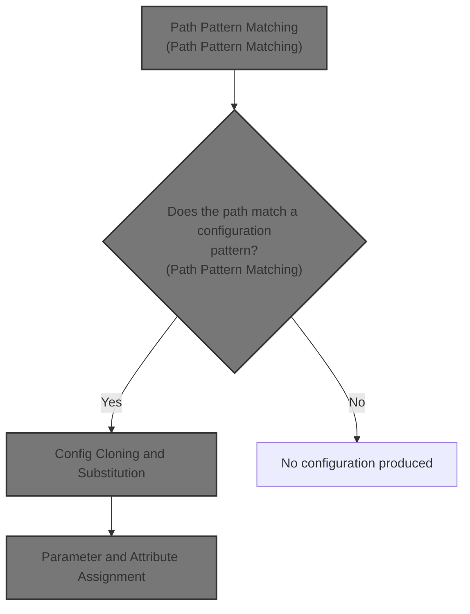
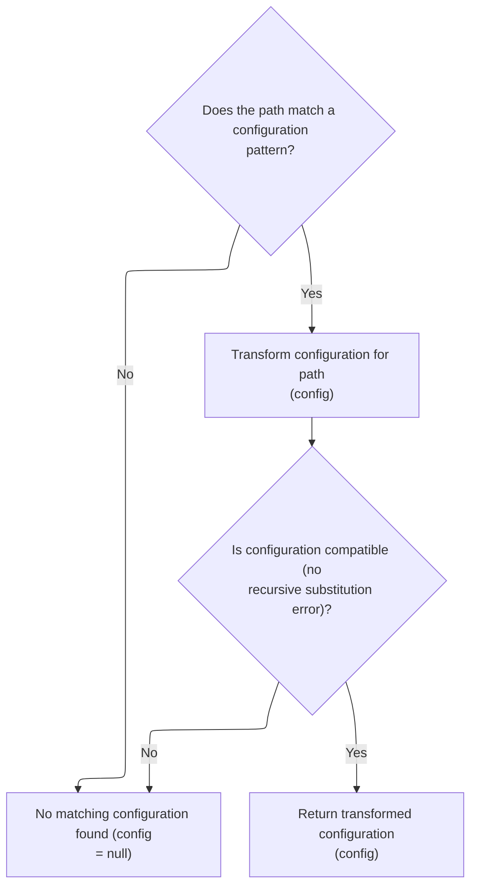
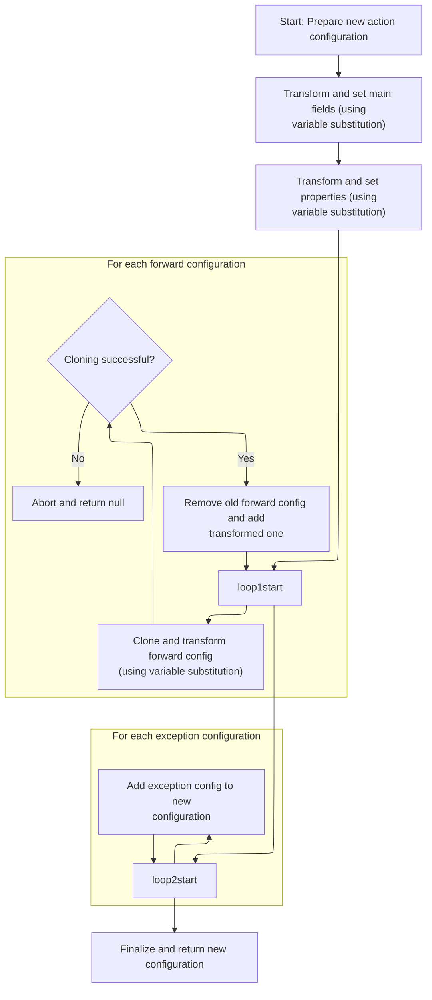
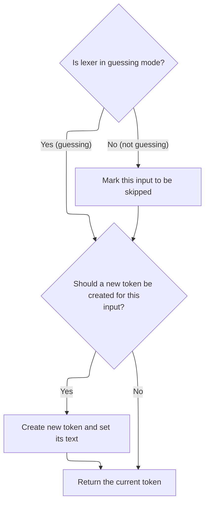

This document describes how a configuration path is matched against patterns, variables are extracted, and a fully resolved configuration object is produced. Whitespace is handled to ensure only meaningful tokens are processed. After a pattern match, variables are substituted throughout the configuration, and roles, parameters, and attributes are set, resulting in a configuration ready for routing or processing.



# Whitespace Matching Loop

<SwmSnippet path="/core/src/main/java/org/apache/struts/validator/validwhen/ValidWhenLexer.java" line="202">

---

In <SwmToken path="core/src/main/java/org/apache/struts/validator/validwhen/ValidWhenLexer.java" pos="202:7:7" line-data="	public final void mWS(boolean _createToken) throws RecognitionException, CharStreamException, TokenStreamException {">`mWS`</SwmToken>, the code loops through the input, matching spaces, tabs, newlines, or carriage returns, and stops when it hits a non-whitespace character. This ensures that all contiguous whitespace is consumed as a single token or skipped, depending on the lexer state. After this, we move to <SwmToken path="core/src/main/java/org/apache/struts/config/ActionConfigMatcher.java" pos="47:4:4" line-data="public class ActionConfigMatcher implements Serializable {">`ActionConfigMatcher`</SwmToken> to process the next meaningful token, since whitespace is not relevant for configuration matching.

```java
	public final void mWS(boolean _createToken) throws RecognitionException, CharStreamException, TokenStreamException {
		int _ttype; Token _token=null; int _begin=text.length();
		_ttype = WS;
		int _saveIndex;
		
		{
		int _cnt17=0;
		_loop17:
		do {
			switch ( LA(1)) {
			case ' ':
			{
				match(' ');
				break;
			}
			case '\t':
			{
				match('\t');
				break;
			}
			case '\n':
			{
				match('\n');
				break;
			}
			case '\r':
			{
				match('\r');
				break;
			}
			default:
			{
				if ( _cnt17>=1 ) { break _loop17; } else {throw new NoViableAltForCharException((char)LA(1), getFilename(), getLine(), getColumn());}
			}
			}
			_cnt17++;
		} while (true);
		}
```

---

</SwmSnippet>

## Path Pattern Matching

<SwmSnippet path="/core/src/main/java/org/apache/struts/config/ActionConfigMatcher.java" line="101">

---

In <SwmToken path="core/src/main/java/org/apache/struts/config/ActionConfigMatcher.java" pos="101:5:5" line-data="    public ActionConfig match(String path) {">`match`</SwmToken>, the code iterates over all compiled path patterns, strips the leading slash from the input path, and prepares a map for variable extraction. It then calls <SwmToken path="core/src/main/java/org/apache/struts/config/ActionConfigMatcher.java" pos="27:10:10" line-data="import org.apache.struts.util.WildcardHelper;">`WildcardHelper`</SwmToken> to check if the path matches any pattern, which is needed to extract variables for later substitution.

```java
    public ActionConfig match(String path) {
        ActionConfig config = null;

        if (compiledPaths.size() > 0) {
            if (log.isDebugEnabled()) {
                log.debug("Attempting to match '" + path
                    + "' to a wildcard pattern");
            }

            if ((path.length() > 0) && (path.charAt(0) == '/')) {
                path = path.substring(1);
            }

            Mapping m;
            HashMap vars = new HashMap();

            for (Iterator i = compiledPaths.iterator(); i.hasNext();) {
                m = (Mapping) i.next();

                if (wildcard.match(vars, path, m.getPattern())) {
                    if (log.isDebugEnabled()) {
                        log.debug("Path matches pattern '"
                            + m.getActionConfig().getPath() + "'");
                    }

```

---

</SwmSnippet>

### Wildcard Pattern Evaluation

See <SwmLink doc-title="Wildcard pattern matching flow">[Wildcard pattern matching flow](/.swm/wildcard-pattern-matching-flow.8o6e5ecx.sw.md)</SwmLink>

### Config Cloning and Substitution



<SwmSnippet path="/core/src/main/java/org/apache/struts/config/ActionConfigMatcher.java" line="126">

---

Back in `ActionConfigMatcher.match`, after getting a match from <SwmToken path="core/src/main/java/org/apache/struts/config/ActionConfigMatcher.java" pos="27:10:10" line-data="import org.apache.struts.util.WildcardHelper;">`WildcardHelper`</SwmToken>, the code clones the matched <SwmToken path="core/src/main/java/org/apache/struts/config/ActionConfigMatcher.java" pos="129:2:2" line-data="                		    (ActionConfig) m.getActionConfig(), vars);">`ActionConfig`</SwmToken> and substitutes variables using <SwmToken path="core/src/main/java/org/apache/struts/config/ActionConfigMatcher.java" pos="128:1:1" line-data="                	    convertActionConfig(path,">`convertActionConfig`</SwmToken>. This step is needed to generate a config instance with all pattern variables resolved for the current path.

```java
                    try {
                	config =
                	    convertActionConfig(path,
                		    (ActionConfig) m.getActionConfig(), vars);
                    } catch (IllegalStateException e) {
                	log.warn("Path matches pattern '"
                		+ m.getActionConfig().getPath() + "' but is "
                		+ "incompatible with the matching config due "
                		+ "to recursive substitution: "
                		+ path);
                	config = null;
                    }
                }
            }
        }

        return config;
    }
```

---

</SwmSnippet>

## Config Variable Substitution

<SwmSnippet path="/core/src/main/java/org/apache/struts/config/ActionConfigMatcher.java" line="157">

---

In <SwmToken path="core/src/main/java/org/apache/struts/config/ActionConfigMatcher.java" pos="157:5:5" line-data="    protected ActionConfig convertActionConfig(String path, ActionConfig orig,">`convertActionConfig`</SwmToken>, the code clones the original <SwmToken path="core/src/main/java/org/apache/struts/config/ActionConfigMatcher.java" pos="157:3:3" line-data="    protected ActionConfig convertActionConfig(String path, ActionConfig orig,">`ActionConfig`</SwmToken> and starts substituting variables in the config fields, beginning with the name. This prepares a config instance tailored to the matched path, and then calls <SwmToken path="core/src/main/java/org/apache/struts/config/ActionConfigMatcher.java" pos="170:3:3" line-data="        config.setName(convertParam(orig.getName(), vars));">`setName`</SwmToken> to update the config with the substituted value.

```java
    protected ActionConfig convertActionConfig(String path, ActionConfig orig,
        Map vars) {
        ActionConfig config = null;

        try {
            config = (ActionConfig) BeanUtils.cloneBean(orig);
        } catch (Exception ex) {
            log.warn("Unable to clone action config, recommend not using "
                + "wildcards", ex);

            return null;
        }

        config.setName(convertParam(orig.getName(), vars));
```

---

</SwmSnippet>

<SwmSnippet path="/core/src/main/java/org/apache/struts/config/ActionConfigMatcher.java" line="258">

---

<SwmToken path="core/src/main/java/org/apache/struts/config/ActionConfigMatcher.java" pos="258:5:5" line-data="    protected String convertParam(String val, Map vars) {">`convertParam`</SwmToken> handles replacing placeholders like '{x}' in the config fields with values from the vars map. It checks for recursive substitutions and only uses the first character of each key, so the placeholder format is tightly controlled. This step ensures all config fields are resolved before setting them.

```java
    protected String convertParam(String val, Map vars) {
        if (val == null) {
            return null;
        } else if (val.indexOf("{") == -1) {
            return val;
        }

        Map.Entry entry;
        StringBuffer key = new StringBuffer("{0}");
        StringBuffer ret = new StringBuffer(val);
        String keyStr;
        int x;

        for (Iterator i = vars.entrySet().iterator(); i.hasNext();) {
            entry = (Map.Entry) i.next();
            key.setCharAt(1, ((String) entry.getKey()).charAt(0));
            keyStr = key.toString();
            
            // STR-3169
            // Prevent an infinite loop by retaining the placeholders
            // that contain itself in the substitution value
            if (((String) entry.getValue()).contains(keyStr)) {
        	throw new IllegalStateException();
            }
            
            // Replace all instances of the placeholder
            while ((x = ret.toString().indexOf(keyStr)) > -1) {
                ret.replace(x, x + 3, (String) entry.getValue());
            }
        }
```

---

</SwmSnippet>

<SwmSnippet path="/core/src/main/java/org/apache/struts/config/ActionConfigMatcher.java" line="170">

---

Back in <SwmToken path="core/src/main/java/org/apache/struts/config/ActionConfigMatcher.java" pos="128:1:1" line-data="                	    convertActionConfig(path,">`convertActionConfig`</SwmToken>, after resolving the name with <SwmToken path="core/src/main/java/org/apache/struts/config/ActionConfigMatcher.java" pos="170:5:5" line-data="        config.setName(convertParam(orig.getName(), vars));">`convertParam`</SwmToken>, the code updates the config's name using <SwmToken path="core/src/main/java/org/apache/struts/config/ActionConfigMatcher.java" pos="170:3:3" line-data="        config.setName(convertParam(orig.getName(), vars));">`setName`</SwmToken>. This step finalizes the config's identity before moving on to set other fields.

```java
        config.setName(convertParam(orig.getName(), vars));

```

---

</SwmSnippet>

<SwmSnippet path="/core/src/main/java/org/apache/struts/config/ActionConfig.java" line="517">

---

<SwmToken path="core/src/main/java/org/apache/struts/config/ActionConfig.java" pos="517:5:5" line-data="    public void setName(String name) {">`setName`</SwmToken> updates the config's name, but only if the configuration isn't frozen. If the 'configured' flag is true, it throws an exception to prevent changes after setup.

```java
    public void setName(String name) {
        if (configured) {
            throw new IllegalStateException("Configuration is frozen");
        }

        this.name = name;
    }
```

---

</SwmSnippet>

<SwmSnippet path="/core/src/main/java/org/apache/struts/config/ActionConfigMatcher.java" line="172">

---

Back in <SwmToken path="core/src/main/java/org/apache/struts/config/ActionConfigMatcher.java" pos="128:1:1" line-data="                	    convertActionConfig(path,">`convertActionConfig`</SwmToken>, after setting the name, the code normalizes the path (adds a leading slash if missing) and sets it on the config. This ensures the config path is always in the expected format before updating other fields.

```java
        if ((path.length() == 0) || (path.charAt(0) != '/')) {
            path = "/" + path;
        }

        config.setPath(path);
        config.setType(convertParam(orig.getType(), vars));
```

---

</SwmSnippet>

<SwmSnippet path="/core/src/main/java/org/apache/struts/config/ActionConfigMatcher.java" line="177">

---

Back in <SwmToken path="core/src/main/java/org/apache/struts/config/ActionConfigMatcher.java" pos="128:1:1" line-data="                	    convertActionConfig(path,">`convertActionConfig`</SwmToken>, after updating the path, the code sets the type field using the resolved value. This keeps the config fields in sync with the matched pattern and extracted variables.

```java
        config.setType(convertParam(orig.getType(), vars));
```

---

</SwmSnippet>

<SwmSnippet path="/core/src/main/java/org/apache/struts/config/ActionConfig.java" line="788">

---

<SwmToken path="core/src/main/java/org/apache/struts/config/ActionConfig.java" pos="788:5:5" line-data="    public void setType(String type) {">`setType`</SwmToken> updates the config's type, but only if the configuration isn't frozen. If 'configured' is true, it throws an exception to block changes after setup.

```java
    public void setType(String type) {
        if (configured) {
            throw new IllegalStateException("Configuration is frozen");
        }

        this.type = type;
    }
```

---

</SwmSnippet>

<SwmSnippet path="/core/src/main/java/org/apache/struts/config/ActionConfigMatcher.java" line="178">

---

Back in <SwmToken path="core/src/main/java/org/apache/struts/config/ActionConfigMatcher.java" pos="128:1:1" line-data="                	    convertActionConfig(path,">`convertActionConfig`</SwmToken>, after setting the type, the code updates the roles field using the resolved value. This step ensures that role-based access control is configured with the correct values before moving on.

```java
        config.setRoles(convertParam(orig.getRoles(), vars));
```

---

</SwmSnippet>

<SwmSnippet path="/core/src/main/java/org/apache/struts/config/ActionConfigMatcher.java" line="178">

---

Back in <SwmToken path="core/src/main/java/org/apache/struts/config/ActionConfigMatcher.java" pos="128:1:1" line-data="                	    convertActionConfig(path,">`convertActionConfig`</SwmToken>, after updating the roles field, the code calls <SwmToken path="core/src/main/java/org/apache/struts/config/ActionConfigMatcher.java" pos="178:3:3" line-data="        config.setRoles(convertParam(orig.getRoles(), vars));">`setRoles`</SwmToken> to parse and store the roles as an array. This prepares the config for role-based checks later.

```java
        config.setRoles(convertParam(orig.getRoles(), vars));
```

---

</SwmSnippet>

### Parsing and Storing Roles

```mermaid
%%{init: {"flowchart": {"defaultRenderer": "elk"}} }%%
flowchart TD
    node1{"Is configuration frozen?"}
    click node1 openCode "core/src/main/java/org/apache/struts/config/ActionConfig.java:598:600"
    node1 -->|"Yes"| node2["Throw exception: Configuration is frozen"]
    click node2 openCode "core/src/main/java/org/apache/struts/config/ActionConfig.java:599:600"
    node1 -->|"No"| node3["Assign roles string to internal variable"]
    click node3 openCode "core/src/main/java/org/apache/struts/config/ActionConfig.java:602:602"
    node3 --> node4{"Is roles null?"}
    click node4 openCode "core/src/main/java/org/apache/struts/config/ActionConfig.java:604:608"
    node4 -->|"Yes"| node5["Set allowed roles to empty"]
    click node5 openCode "core/src/main/java/org/apache/struts/config/ActionConfig.java:605:607"
    node4 -->|"No"| node6["Prepare to extract roles"]
    click node6 openCode "core/src/main/java/org/apache/struts/config/ActionConfig.java:610:611"
    
    subgraph loop1["While roles contains a comma"]
        node6 --> node7["Extract role before comma and add to
list"]
        click node7 openCode "core/src/main/java/org/apache/struts/config/ActionConfig.java:613:620"
        node7 --> node8{"Are there more commas?"}
        click node8 openCode "core/src/main/java/org/apache/struts/config/ActionConfig.java:613:617"
        node8 -->|"Yes"| node7
        node8 -->|"No"| node9["Trim remaining role string"]
        click node9 openCode "core/src/main/java/org/apache/struts/config/ActionConfig.java:623:623"
    end
    node9 --> node10{"Is there a non-empty role left?"}
    click node10 openCode "core/src/main/java/org/apache/struts/config/ActionConfig.java:625:627"
    node10 -->|"Yes"| node11["Add remaining role to list"]
    click node11 openCode "core/src/main/java/org/apache/struts/config/ActionConfig.java:626:626"
    node10 -->|"No"| node12["Skip adding"]
    click node12 openCode "core/src/main/java/org/apache/struts/config/ActionConfig.java:627:627"
    node11 --> node13["Set allowed roles to extracted list"]
    click node13 openCode "core/src/main/java/org/apache/struts/config/ActionConfig.java:629:629"
    node12 --> node13
    node5 --> node13
classDef HeadingStyle fill:#777777,stroke:#333,stroke-width:2px;

%% Swimm:
%% %%{init: {"flowchart": {"defaultRenderer": "elk"}} }%%
%% flowchart TD
%%     node1{"Is configuration frozen?"}
%%     click node1 openCode "<SwmPath>[core/…/config/ActionConfig.java](core/src/main/java/org/apache/struts/config/ActionConfig.java)</SwmPath>:598:600"
%%     node1 -->|"Yes"| node2["Throw exception: Configuration is frozen"]
%%     click node2 openCode "<SwmPath>[core/…/config/ActionConfig.java](core/src/main/java/org/apache/struts/config/ActionConfig.java)</SwmPath>:599:600"
%%     node1 -->|"No"| node3["Assign roles string to internal variable"]
%%     click node3 openCode "<SwmPath>[core/…/config/ActionConfig.java](core/src/main/java/org/apache/struts/config/ActionConfig.java)</SwmPath>:602:602"
%%     node3 --> node4{"Is roles null?"}
%%     click node4 openCode "<SwmPath>[core/…/config/ActionConfig.java](core/src/main/java/org/apache/struts/config/ActionConfig.java)</SwmPath>:604:608"
%%     node4 -->|"Yes"| node5["Set allowed roles to empty"]
%%     click node5 openCode "<SwmPath>[core/…/config/ActionConfig.java](core/src/main/java/org/apache/struts/config/ActionConfig.java)</SwmPath>:605:607"
%%     node4 -->|"No"| node6["Prepare to extract roles"]
%%     click node6 openCode "<SwmPath>[core/…/config/ActionConfig.java](core/src/main/java/org/apache/struts/config/ActionConfig.java)</SwmPath>:610:611"
%%     
%%     subgraph loop1["While roles contains a comma"]
%%         node6 --> node7["Extract role before comma and add to
%% list"]
%%         click node7 openCode "<SwmPath>[core/…/config/ActionConfig.java](core/src/main/java/org/apache/struts/config/ActionConfig.java)</SwmPath>:613:620"
%%         node7 --> node8{"Are there more commas?"}
%%         click node8 openCode "<SwmPath>[core/…/config/ActionConfig.java](core/src/main/java/org/apache/struts/config/ActionConfig.java)</SwmPath>:613:617"
%%         node8 -->|"Yes"| node7
%%         node8 -->|"No"| node9["Trim remaining role string"]
%%         click node9 openCode "<SwmPath>[core/…/config/ActionConfig.java](core/src/main/java/org/apache/struts/config/ActionConfig.java)</SwmPath>:623:623"
%%     end
%%     node9 --> node10{"Is there a non-empty role left?"}
%%     click node10 openCode "<SwmPath>[core/…/config/ActionConfig.java](core/src/main/java/org/apache/struts/config/ActionConfig.java)</SwmPath>:625:627"
%%     node10 -->|"Yes"| node11["Add remaining role to list"]
%%     click node11 openCode "<SwmPath>[core/…/config/ActionConfig.java](core/src/main/java/org/apache/struts/config/ActionConfig.java)</SwmPath>:626:626"
%%     node10 -->|"No"| node12["Skip adding"]
%%     click node12 openCode "<SwmPath>[core/…/config/ActionConfig.java](core/src/main/java/org/apache/struts/config/ActionConfig.java)</SwmPath>:627:627"
%%     node11 --> node13["Set allowed roles to extracted list"]
%%     click node13 openCode "<SwmPath>[core/…/config/ActionConfig.java](core/src/main/java/org/apache/struts/config/ActionConfig.java)</SwmPath>:629:629"
%%     node12 --> node13
%%     node5 --> node13
%% classDef HeadingStyle fill:#777777,stroke:#333,stroke-width:2px;
```



<SwmSnippet path="/core/src/main/java/org/apache/struts/config/ActionConfig.java" line="597">

---

In <SwmToken path="core/src/main/java/org/apache/struts/config/ActionConfig.java" pos="597:5:5" line-data="    public void setRoles(String roles) {">`setRoles`</SwmToken>, the code splits the comma-separated roles string, trims each role, and stores them in an array. If the config is frozen, it throws an exception to prevent changes.

```java
    public void setRoles(String roles) {
        if (configured) {
            throw new IllegalStateException("Configuration is frozen");
        }

        this.roles = roles;

        if (roles == null) {
            roleNames = new String[0];

            return;
        }

        ArrayList list = new ArrayList();

        while (true) {
            int comma = roles.indexOf(',');

            if (comma < 0) {
                break;
            }

            list.add(roles.substring(0, comma).trim());
            roles = roles.substring(comma + 1);
        }
```

---

</SwmSnippet>

<SwmSnippet path="/core/src/main/java/org/apache/struts/config/ActionConfig.java" line="623">

---

Finally, the function trims any remaining role string, adds it to the list if not empty, and converts the list to an array for efficient access.

```java
        roles = roles.trim();

        if (roles.length() > 0) {
            list.add(roles);
        }

        roleNames = (String[]) list.toArray(new String[list.size()]);
    }
```

---

</SwmSnippet>

### Parameter and Attribute Assignment



<SwmSnippet path="/core/src/main/java/org/apache/struts/config/ActionConfigMatcher.java" line="179">

---

Back in <SwmToken path="core/src/main/java/org/apache/struts/config/ActionConfigMatcher.java" pos="128:1:1" line-data="                	    convertActionConfig(path,">`convertActionConfig`</SwmToken>, after setting roles, the code updates the parameter field using the resolved value. This step ensures the config is ready for any parameter-based logic.

```java
        config.setParameter(convertParam(orig.getParameter(), vars));
```

---

</SwmSnippet>

<SwmSnippet path="/core/src/main/java/org/apache/struts/config/ActionConfigMatcher.java" line="179">

---

Back in <SwmToken path="core/src/main/java/org/apache/struts/config/ActionConfigMatcher.java" pos="128:1:1" line-data="                	    convertActionConfig(path,">`convertActionConfig`</SwmToken>, after updating the parameter, the code calls <SwmToken path="core/src/main/java/org/apache/struts/config/ActionConfigMatcher.java" pos="179:3:3" line-data="        config.setParameter(convertParam(orig.getParameter(), vars));">`setParameter`</SwmToken> to store the value, enforcing the frozen state if needed.

```java
        config.setParameter(convertParam(orig.getParameter(), vars));
```

---

</SwmSnippet>

<SwmSnippet path="/core/src/main/java/org/apache/struts/config/ActionConfig.java" line="541">

---

<SwmToken path="core/src/main/java/org/apache/struts/config/ActionConfig.java" pos="541:5:5" line-data="    public void setParameter(String parameter) {">`setParameter`</SwmToken> updates the config's parameter, but only if the configuration isn't frozen. If 'configured' is true, it throws an exception to block changes after setup.

```java
    public void setParameter(String parameter) {
        if (configured) {
            throw new IllegalStateException("Configuration is frozen");
        }

        this.parameter = parameter;
    }
```

---

</SwmSnippet>

<SwmSnippet path="/core/src/main/java/org/apache/struts/config/ActionConfigMatcher.java" line="180">

---

Back in <SwmToken path="core/src/main/java/org/apache/struts/config/ActionConfigMatcher.java" pos="128:1:1" line-data="                	    convertActionConfig(path,">`convertActionConfig`</SwmToken>, after setting the parameter, the code updates the attribute field using the resolved value. This step ensures the config is ready for attribute-based logic.

```java
        config.setAttribute(convertParam(orig.getAttribute(), vars));
```

---

</SwmSnippet>

<SwmSnippet path="/core/src/main/java/org/apache/struts/config/ActionConfig.java" line="321">

---

<SwmToken path="core/src/main/java/org/apache/struts/config/ActionConfig.java" pos="321:5:5" line-data="    public String getAttribute() {">`getAttribute`</SwmToken> returns the attribute if it's set; otherwise, it falls back to returning the name. This ensures there's always a value available for downstream logic.

```java
    public String getAttribute() {
        if (this.attribute == null) {
            return (this.name);
        } else {
            return (this.attribute);
        }
    }
```

---

</SwmSnippet>

<SwmSnippet path="/core/src/main/java/org/apache/struts/config/ActionConfigMatcher.java" line="180">

---

Back in <SwmToken path="core/src/main/java/org/apache/struts/config/ActionConfigMatcher.java" pos="128:1:1" line-data="                	    convertActionConfig(path,">`convertActionConfig`</SwmToken>, after updating the attribute, the code calls <SwmToken path="core/src/main/java/org/apache/struts/config/ActionConfigMatcher.java" pos="180:3:3" line-data="        config.setAttribute(convertParam(orig.getAttribute(), vars));">`setAttribute`</SwmToken> to store the value, enforcing the frozen state if needed.

```java
        config.setAttribute(convertParam(orig.getAttribute(), vars));
```

---

</SwmSnippet>

<SwmSnippet path="/core/src/main/java/org/apache/struts/config/ActionConfigMatcher.java" line="180">

---

Back in <SwmToken path="core/src/main/java/org/apache/struts/config/ActionConfigMatcher.java" pos="128:1:1" line-data="                	    convertActionConfig(path,">`convertActionConfig`</SwmToken>, after setting the attribute, the code updates the config with the resolved attribute value

```java
        config.setAttribute(convertParam(orig.getAttribute(), vars));
```

---

</SwmSnippet>

<SwmSnippet path="/core/src/main/java/org/apache/struts/config/ActionConfig.java" line="337">

---

<SwmToken path="core/src/main/java/org/apache/struts/config/ActionConfig.java" pos="337:5:5" line-data="    public void setAttribute(String attribute) {">`setAttribute`</SwmToken> updates the config's attribute, but only if the configuration isn't frozen. If 'configured' is true, it throws an exception to block changes after setup.

```java
    public void setAttribute(String attribute) {
        if (configured) {
            throw new IllegalStateException("Configuration is frozen");
        }

        this.attribute = attribute;
    }
```

---

</SwmSnippet>

<SwmSnippet path="/core/src/main/java/org/apache/struts/config/ActionConfigMatcher.java" line="181">

---

Back in <SwmToken path="core/src/main/java/org/apache/struts/config/ActionConfigMatcher.java" pos="128:1:1" line-data="                	    convertActionConfig(path,">`convertActionConfig`</SwmToken>, after setting the attribute, the code updates the forward field using the resolved value. This step ensures the config is ready for forward-based logic.

```java
        config.setForward(convertParam(orig.getForward(), vars));
```

---

</SwmSnippet>

<SwmSnippet path="/core/src/main/java/org/apache/struts/config/ActionConfigMatcher.java" line="181">

---

Back in <SwmToken path="core/src/main/java/org/apache/struts/config/ActionConfigMatcher.java" pos="128:1:1" line-data="                	    convertActionConfig(path,">`convertActionConfig`</SwmToken>, after updating the forward, the code calls <SwmToken path="core/src/main/java/org/apache/struts/config/ActionConfigMatcher.java" pos="181:3:3" line-data="        config.setForward(convertParam(orig.getForward(), vars));">`setForward`</SwmToken> to store the value, enforcing the frozen state if needed.

```java
        config.setForward(convertParam(orig.getForward(), vars));
```

---

</SwmSnippet>

<SwmSnippet path="/core/src/main/java/org/apache/struts/config/ActionConfig.java" line="419">

---

<SwmToken path="core/src/main/java/org/apache/struts/config/ActionConfig.java" pos="419:5:5" line-data="    public void setForward(String forward) {">`setForward`</SwmToken> updates the config's forward value, but only if the configuration isn't frozen. If 'configured' is true, it throws an exception to block changes after setup.

```java
    public void setForward(String forward) {
        if (configured) {
            throw new IllegalStateException("Configuration is frozen");
        }

        this.forward = forward;
    }
```

---

</SwmSnippet>

<SwmSnippet path="/core/src/main/java/org/apache/struts/config/ActionConfigMatcher.java" line="182">

---

Back in <SwmToken path="core/src/main/java/org/apache/struts/config/ActionConfigMatcher.java" pos="128:1:1" line-data="                	    convertActionConfig(path,">`convertActionConfig`</SwmToken>, after setting forward, the code updates the include and input fields using the resolved values. This step ensures the config is ready for include/input-based logic.

```java
        config.setInclude(convertParam(orig.getInclude(), vars));
        config.setInput(convertParam(orig.getInput(), vars));
```

---

</SwmSnippet>

<SwmSnippet path="/core/src/main/java/org/apache/struts/config/ActionConfigMatcher.java" line="183">

---

Back in <SwmToken path="core/src/main/java/org/apache/struts/config/ActionConfigMatcher.java" pos="128:1:1" line-data="                	    convertActionConfig(path,">`convertActionConfig`</SwmToken>, after updating input, the code calls <SwmToken path="core/src/main/java/org/apache/struts/config/ActionConfigMatcher.java" pos="183:3:3" line-data="        config.setInput(convertParam(orig.getInput(), vars));">`setInput`</SwmToken> to store the value, enforcing the frozen state if needed.

```java
        config.setInput(convertParam(orig.getInput(), vars));
```

---

</SwmSnippet>

<SwmSnippet path="/core/src/main/java/org/apache/struts/config/ActionConfig.java" line="473">

---

<SwmToken path="core/src/main/java/org/apache/struts/config/ActionConfig.java" pos="473:5:5" line-data="    public void setInput(String input) {">`setInput`</SwmToken> updates the config's input value, but only if the configuration isn't frozen. If 'configured' is true, it throws an exception to block changes after setup.

```java
    public void setInput(String input) {
        if (configured) {
            throw new IllegalStateException("Configuration is frozen");
        }

        this.input = input;
    }
```

---

</SwmSnippet>

<SwmSnippet path="/core/src/main/java/org/apache/struts/config/ActionConfigMatcher.java" line="184">

---

Back in <SwmToken path="core/src/main/java/org/apache/struts/config/ActionConfigMatcher.java" pos="128:1:1" line-data="                	    convertActionConfig(path,">`convertActionConfig`</SwmToken>, after setting input, the code updates the catalog field using the resolved value. This step ensures the config is ready for catalog-based logic.

```java
        config.setCatalog(convertParam(orig.getCatalog(), vars));
```

---

</SwmSnippet>

<SwmSnippet path="/core/src/main/java/org/apache/struts/config/ActionConfigMatcher.java" line="184">

---

Back in <SwmToken path="core/src/main/java/org/apache/struts/config/ActionConfigMatcher.java" pos="128:1:1" line-data="                	    convertActionConfig(path,">`convertActionConfig`</SwmToken>, after updating the catalog, the code calls <SwmToken path="core/src/main/java/org/apache/struts/config/ActionConfigMatcher.java" pos="184:3:3" line-data="        config.setCatalog(convertParam(orig.getCatalog(), vars));">`setCatalog`</SwmToken> to store the value, enforcing the frozen state if needed.

```java
        config.setCatalog(convertParam(orig.getCatalog(), vars));
```

---

</SwmSnippet>

<SwmSnippet path="/core/src/main/java/org/apache/struts/config/ActionConfig.java" line="882">

---

<SwmToken path="core/src/main/java/org/apache/struts/config/ActionConfig.java" pos="882:5:5" line-data="    public void setCatalog(String catalog) {">`setCatalog`</SwmToken> updates the config's catalog value, but only if the configuration isn't frozen. If 'configured' is true, it throws an exception to block changes after setup.

```java
    public void setCatalog(String catalog) {
        if (configured) {
            throw new IllegalStateException("Configuration is frozen");
        }

        this.catalog = catalog;
    }
```

---

</SwmSnippet>

<SwmSnippet path="/core/src/main/java/org/apache/struts/config/ActionConfigMatcher.java" line="185">

---

Back in <SwmToken path="core/src/main/java/org/apache/struts/config/ActionConfigMatcher.java" pos="128:1:1" line-data="                	    convertActionConfig(path,">`convertActionConfig`</SwmToken>, after setting catalog, the code updates the command field using the resolved value. This step ensures the config is ready for command-based logic.

```java
        config.setCommand(convertParam(orig.getCommand(), vars));
```

---

</SwmSnippet>

<SwmSnippet path="/core/src/main/java/org/apache/struts/config/ActionConfigMatcher.java" line="185">

---

Back in <SwmToken path="core/src/main/java/org/apache/struts/config/ActionConfigMatcher.java" pos="128:1:1" line-data="                	    convertActionConfig(path,">`convertActionConfig`</SwmToken>, after updating the command, the code calls <SwmToken path="core/src/main/java/org/apache/struts/config/ActionConfigMatcher.java" pos="185:3:3" line-data="        config.setCommand(convertParam(orig.getCommand(), vars));">`setCommand`</SwmToken> to store the value, enforcing the frozen state if needed.

```java
        config.setCommand(convertParam(orig.getCommand(), vars));
```

---

</SwmSnippet>

<SwmSnippet path="/core/src/main/java/org/apache/struts/config/ActionConfig.java" line="864">

---

SetCommand enforces immutability by throwing if 'configured' is true, so you can't change the command after freezing. Otherwise, it just sets the value.

```java
    public void setCommand(String command) {
        if (configured) {
            throw new IllegalStateException("Configuration is frozen");
        }

        this.command = command;
    }
```

---

</SwmSnippet>

<SwmSnippet path="/core/src/main/java/org/apache/struts/config/ActionConfigMatcher.java" line="186">

---

Next, ActionConfigMatcher.convertActionConfig sets <SwmToken path="core/src/main/java/org/apache/struts/config/ActionConfig.java" pos="136:5:5" line-data="    protected String multipartClass = null;">`multipartClass`</SwmToken>, prefix, and suffix using <SwmToken path="core/src/main/java/org/apache/struts/config/ActionConfigMatcher.java" pos="186:5:5" line-data="        config.setMultipartClass(convertParam(orig.getMultipartClass(), vars));">`convertParam`</SwmToken> to resolve any variables, keeping all config fields in sync before freezing.

```java
        config.setMultipartClass(convertParam(orig.getMultipartClass(), vars));
        config.setPrefix(convertParam(orig.getPrefix(), vars));
        config.setSuffix(convertParam(orig.getSuffix(), vars));
```

---

</SwmSnippet>

<SwmSnippet path="/core/src/main/java/org/apache/struts/config/ActionConfigMatcher.java" line="188">

---

Back in ActionConfigMatcher.convertActionConfig, after updating prefix, we set the suffix to make sure the action mapping is fully resolved.

```java
        config.setSuffix(convertParam(orig.getSuffix(), vars));

```

---

</SwmSnippet>

<SwmSnippet path="/core/src/main/java/org/apache/struts/config/ActionConfig.java" line="776">

---

SetSuffix blocks changes if the config is frozen, so the suffix can't be updated after finalization. Otherwise, it just sets the value.

```java
    public void setSuffix(String suffix) {
        if (configured) {
            throw new IllegalStateException("Configuration is frozen");
        }

        this.suffix = suffix;
    }
```

---

</SwmSnippet>

<SwmSnippet path="/core/src/main/java/org/apache/struts/config/ActionConfigMatcher.java" line="190">

---

Next, ActionConfigMatcher.convertActionConfig loops through forward configs, cloning and updating them with resolved variables to keep everything consistent.

```java
        ForwardConfig[] fConfigs = orig.findForwardConfigs();
        ForwardConfig cfg;

        for (int x = 0; x < fConfigs.length; x++) {
            try {
                cfg = (ActionForward) BeanUtils.cloneBean(fConfigs[x]);
            } catch (Exception ex) {
                log.warn("Unable to clone action config, recommend not using "
                        + "wildcards", ex);
                return null;
            }
            cfg.setName(fConfigs[x].getName());
            cfg.setPath(convertParam(fConfigs[x].getPath(), vars));
```

---

</SwmSnippet>

<SwmSnippet path="/core/src/main/java/org/apache/struts/config/ActionConfigMatcher.java" line="202">

---

Back in ActionConfigMatcher.convertActionConfig, after cloning the forward config, we update its path with resolved variables to make sure it routes correctly.

```java
            cfg.setPath(convertParam(fConfigs[x].getPath(), vars));
```

---

</SwmSnippet>

<SwmSnippet path="/core/src/main/java/org/apache/struts/config/ExceptionConfig.java" line="141">

---

SetPath in <SwmToken path="core/src/main/java/org/apache/struts/config/ActionConfigMatcher.java" pos="217:1:1" line-data="        ExceptionConfig[] exConfigs = orig.findExceptionConfigs();">`ExceptionConfig`</SwmToken> blocks changes if the config is frozen, so the path can't be updated after finalization. Otherwise, it just sets the value.

```java
    public void setPath(String path) {
        if (configured) {
            throw new IllegalStateException("Configuration is frozen");
        }

        this.path = path;
    }
```

---

</SwmSnippet>

<SwmSnippet path="/core/src/main/java/org/apache/struts/config/ActionConfigMatcher.java" line="203">

---

Back in ActionConfigMatcher.convertActionConfig, after updating the path, we set the redirect flag to control whether the forward triggers a redirect or not.

```java
            cfg.setRedirect(fConfigs[x].getRedirect());
```

---

</SwmSnippet>

<SwmSnippet path="/core/src/main/java/org/apache/struts/config/ForwardConfig.java" line="222">

---

SetRedirect blocks changes if the config is frozen, so you can't change redirect behavior after finalization. Otherwise, it just sets the value.

```java
    public void setRedirect(boolean redirect) {
        if (configured) {
            throw new IllegalStateException("Configuration is frozen");
        }

        this.redirect = redirect;
    }
```

---

</SwmSnippet>

<SwmSnippet path="/core/src/main/java/org/apache/struts/config/ActionConfigMatcher.java" line="204">

---

Back in ActionConfigMatcher.convertActionConfig, after setting redirect, we update the command field to make sure any command logic is in sync with the resolved variables.

```java
            cfg.setCommand(convertParam(fConfigs[x].getCommand(), vars));
```

---

</SwmSnippet>

<SwmSnippet path="/core/src/main/java/org/apache/struts/config/ActionConfigMatcher.java" line="204">

---

Back in ActionConfigMatcher.convertActionConfig, after updating the <SwmToken path="core/src/main/java/org/apache/struts/config/ActionConfigMatcher.java" pos="190:1:1" line-data="        ForwardConfig[] fConfigs = orig.findForwardConfigs();">`ForwardConfig`</SwmToken>, we call <SwmToken path="core/src/main/java/org/apache/struts/config/ActionConfigMatcher.java" pos="204:3:3" line-data="            cfg.setCommand(convertParam(fConfigs[x].getCommand(), vars));">`setCommand`</SwmToken> to store the resolved command value for this forward.

```java
            cfg.setCommand(convertParam(fConfigs[x].getCommand(), vars));
```

---

</SwmSnippet>

<SwmSnippet path="/core/src/main/java/org/apache/struts/config/ActionConfigMatcher.java" line="205">

---

Back in ActionConfigMatcher.convertActionConfig, after setting command, we update the catalog field to keep the forward's grouping in sync with the resolved variables.

```java
            cfg.setCatalog(convertParam(fConfigs[x].getCatalog(), vars));
```

---

</SwmSnippet>

<SwmSnippet path="/core/src/main/java/org/apache/struts/config/ActionConfigMatcher.java" line="205">

---

Back in ActionConfigMatcher.convertActionConfig, after updating the <SwmToken path="core/src/main/java/org/apache/struts/config/ActionConfigMatcher.java" pos="190:1:1" line-data="        ForwardConfig[] fConfigs = orig.findForwardConfigs();">`ForwardConfig`</SwmToken>, we call <SwmToken path="core/src/main/java/org/apache/struts/config/ActionConfigMatcher.java" pos="205:3:3" line-data="            cfg.setCatalog(convertParam(fConfigs[x].getCatalog(), vars));">`setCatalog`</SwmToken> to store the resolved catalog value for this forward.

```java
            cfg.setCatalog(convertParam(fConfigs[x].getCatalog(), vars));
```

---

</SwmSnippet>

<SwmSnippet path="/core/src/main/java/org/apache/struts/config/ActionConfigMatcher.java" line="206">

---

Back in ActionConfigMatcher.convertActionConfig, after setting catalog, we update the module field to make sure the forward is routed to the right module.

```java
            cfg.setModule(convertParam(fConfigs[x].getModule(), vars));
```

---

</SwmSnippet>

<SwmSnippet path="/core/src/main/java/org/apache/struts/config/ActionConfigMatcher.java" line="206">

---

Back in ActionConfigMatcher.convertActionConfig, after updating the <SwmToken path="core/src/main/java/org/apache/struts/config/ActionConfigMatcher.java" pos="190:1:1" line-data="        ForwardConfig[] fConfigs = orig.findForwardConfigs();">`ForwardConfig`</SwmToken>, we call <SwmToken path="core/src/main/java/org/apache/struts/config/ActionConfigMatcher.java" pos="206:3:3" line-data="            cfg.setModule(convertParam(fConfigs[x].getModule(), vars));">`setModule`</SwmToken> to store the resolved module value for this forward.

```java
            cfg.setModule(convertParam(fConfigs[x].getModule(), vars));

```

---

</SwmSnippet>

<SwmSnippet path="/core/src/main/java/org/apache/struts/config/ForwardConfig.java" line="210">

---

SetModule blocks changes if the config is frozen, so you can't change the module after finalization. Otherwise, it just sets the value.

```java
    public void setModule(String module) {
        if (configured) {
            throw new IllegalStateException("Configuration is frozen");
        }

        this.module = module;
    }
```

---

</SwmSnippet>

<SwmSnippet path="/core/src/main/java/org/apache/struts/config/ActionConfigMatcher.java" line="208">

---

Back in ActionConfigMatcher.convertActionConfig, after setting all the fields, we call <SwmToken path="core/src/main/java/org/apache/struts/config/ActionConfigMatcher.java" pos="208:1:1" line-data="            replaceProperties(fConfigs[x].getProperties(), cfg.getProperties(),">`replaceProperties`</SwmToken> to update the properties map with resolved variables.

```java
            replaceProperties(fConfigs[x].getProperties(), cfg.getProperties(),
                vars);

```

---

</SwmSnippet>

<SwmSnippet path="/core/src/main/java/org/apache/struts/config/ActionConfigMatcher.java" line="238">

---

ReplaceProperties copies each property from the original, resolving variables with <SwmToken path="core/src/main/java/org/apache/struts/config/ActionConfigMatcher.java" pos="244:1:1" line-data="                convertParam((String) entry.getValue(), vars));">`convertParam`</SwmToken>, so the new config's properties are fully updated.

```java
    protected void replaceProperties(Properties orig, Properties props, Map vars) {
        Map.Entry entry = null;

        for (Iterator i = orig.entrySet().iterator(); i.hasNext();) {
            entry = (Map.Entry) i.next();
            props.setProperty((String) entry.getKey(),
                convertParam((String) entry.getValue(), vars));
        }
    }
```

---

</SwmSnippet>

<SwmSnippet path="/core/src/main/java/org/apache/struts/config/ActionConfigMatcher.java" line="211">

---

Back in ActionConfigMatcher.convertActionConfig, after updating the forward, we remove the original forward config to avoid stale or conflicting entries.

```java
            config.removeForwardConfig(fConfigs[x]);
```

---

</SwmSnippet>

<SwmSnippet path="/core/src/main/java/org/apache/struts/config/ActionConfig.java" line="1355">

---

RemoveForwardConfig blocks removal if the config is frozen, and otherwise removes the forward by name from the forwards map.

```java
    public void removeForwardConfig(ForwardConfig config) {
        if (configured) {
            throw new IllegalStateException("Configuration is frozen");
        }

        forwards.remove(config.getName());
    }
```

---

</SwmSnippet>

<SwmSnippet path="/core/src/main/java/org/apache/struts/config/ActionConfigMatcher.java" line="212">

---

Back in ActionConfigMatcher.convertActionConfig, after removing the old forward, we add the updated forward config to the forwards map.

```java
            config.addForwardConfig(cfg);
        }

```

---

</SwmSnippet>

<SwmSnippet path="/core/src/main/java/org/apache/struts/config/ActionConfig.java" line="1059">

---

AddForwardConfig blocks changes if the config is frozen, and otherwise adds the <SwmToken path="core/src/main/java/org/apache/struts/config/ActionConfig.java" pos="1059:7:7" line-data="    public void addForwardConfig(ForwardConfig config) {">`ForwardConfig`</SwmToken> to the forwards map by name.

```java
    public void addForwardConfig(ForwardConfig config) {
        if (configured) {
            throw new IllegalStateException("Configuration is frozen");
        }

        forwards.put(config.getName(), config);
    }
```

---

</SwmSnippet>

<SwmSnippet path="/core/src/main/java/org/apache/struts/config/ActionConfigMatcher.java" line="215">

---

Back in ActionConfigMatcher.convertActionConfig, after updating forwards, we call <SwmToken path="core/src/main/java/org/apache/struts/config/ActionConfigMatcher.java" pos="215:1:1" line-data="        replaceProperties(orig.getProperties(), config.getProperties(), vars);">`replaceProperties`</SwmToken> again to update the main config's properties with resolved variables.

```java
        replaceProperties(orig.getProperties(), config.getProperties(), vars);

```

---

</SwmSnippet>

<SwmSnippet path="/core/src/main/java/org/apache/struts/config/ActionConfigMatcher.java" line="217">

---

Back in ActionConfigMatcher.convertActionConfig, after updating forwards and properties, we add exception configs to make sure error handling is set up for the resolved config.

```java
        ExceptionConfig[] exConfigs = orig.findExceptionConfigs();

        for (int x = 0; x < exConfigs.length; x++) {
            config.addExceptionConfig(exConfigs[x]);
        }
```

---

</SwmSnippet>

<SwmSnippet path="/core/src/main/java/org/apache/struts/config/ActionConfigMatcher.java" line="223">

---

Finally, ActionConfigMatcher.convertActionConfig freezes the config to lock all fields, then returns the fully resolved, immutable config.

```java
        config.freeze();

        return config;
    }
```

---

</SwmSnippet>

## Whitespace Token Handling in Lexer



<SwmSnippet path="/core/src/main/java/org/apache/struts/validator/validwhen/ValidWhenLexer.java" line="240">

---

Back in ValidWhenLexer.mWS, after matching whitespace and processing config, the lexer checks <SwmToken path="core/src/main/java/org/apache/struts/validator/validwhen/ValidWhenLexer.java" pos="240:5:7" line-data="		if ( inputState.guessing==0 ) {">`inputState.guessing`</SwmToken> to decide if whitespace should be skipped or emitted as a token. If guessing is off, whitespace is skipped.

```java
		if ( inputState.guessing==0 ) {
			_ttype = Token.SKIP;
		}
		if ( _createToken && _token==null && _ttype!=Token.SKIP ) {
			_token = makeToken(_ttype);
			_token.setText(new String(text.getBuffer(), _begin, text.length()-_begin));
		}
		_returnToken = _token;
	}
```

---

</SwmSnippet>

&nbsp;

*This is an auto-generated document by Swimm 🌊 and has not yet been verified by a human*

<SwmMeta version="3.0.0" repo-id="Z2l0aHViJTNBJTNBc3RydXRzMSUzQSUzQVN3aW1tLURlbW8=" repo-name="struts1"><sup>Powered by [Swimm](https://app.swimm.io/)</sup></SwmMeta>
