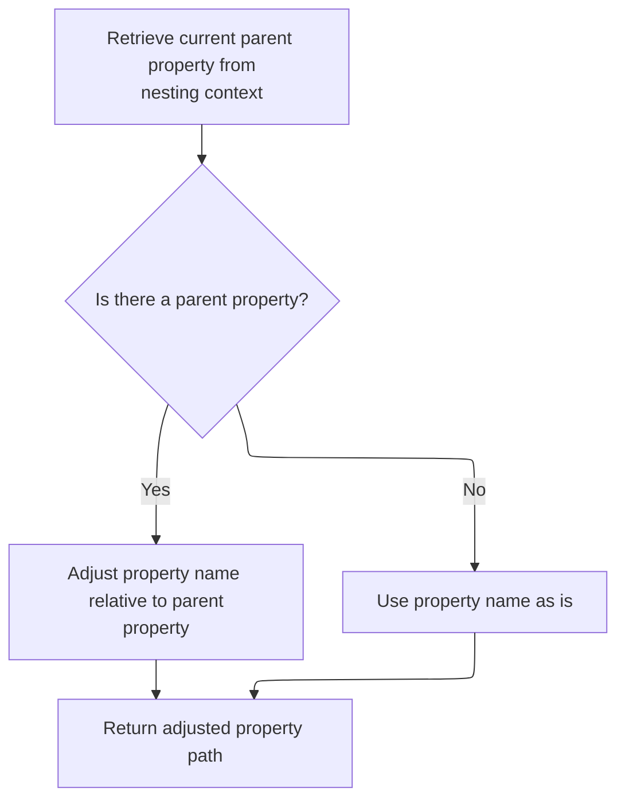
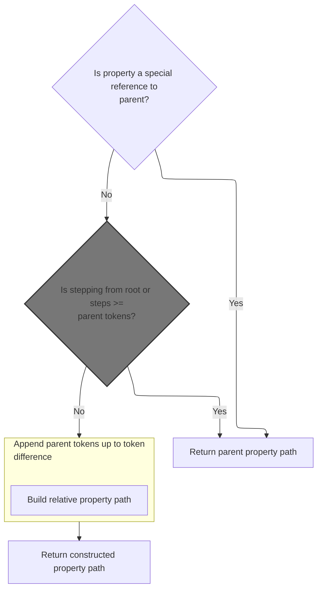

This document explains how tags within nested contexts are configured to reference the correct data. By setting the appropriate name and property path, the system ensures that each tag interacts with the right bean property, supporting dynamic forms and nested data structures.

# Where is this flow used?

This flow is used multiple times in the codebase as represented in the following diagram:

(Note - these are only some of the entry points of this flow)

```mermaid
graph TD;
      2a2f9513cbb02a07a418db6710bfd4000d7fe6d6588bf97ea3d57de50a8872e6(taglib/…/logic/NestedIterateTag.java::NestedIterateTag.doStartTag) --> b19d992fdd880149cdcce47b903a13c2e50663f2dd3b95cd63794022ff0cd409(taglib/…/nested/NestedPropertyHelper.java::NestedPropertyHelper.setNestedProperties)

2b2b21443b50fff2d167e05f9a396a8acffed93630620f6578e0d575ee4d457c(taglib/…/html/NestedOptionsTag.java::NestedOptionsTag.doStartTag) --> b19d992fdd880149cdcce47b903a13c2e50663f2dd3b95cd63794022ff0cd409(taglib/…/nested/NestedPropertyHelper.java::NestedPropertyHelper.setNestedProperties)

d100e787fbcc913ff09826fc31239fa750b41271b1662484f359847451b6d56b(taglib/…/html/NestedCheckboxTag.java::NestedCheckboxTag.doStartTag) --> b19d992fdd880149cdcce47b903a13c2e50663f2dd3b95cd63794022ff0cd409(taglib/…/nested/NestedPropertyHelper.java::NestedPropertyHelper.setNestedProperties)

da873aa218d9ebc7b71444dfe0ba6428ae7b0047f8d6ecce30de52cfd29c276a(taglib/…/html/NestedErrorsTag.java::NestedErrorsTag.doStartTag) --> b19d992fdd880149cdcce47b903a13c2e50663f2dd3b95cd63794022ff0cd409(taglib/…/nested/NestedPropertyHelper.java::NestedPropertyHelper.setNestedProperties)

bf0f0f5250c147b47b1bd98d548aaa7050617b448b699c046f0579ef8d2af1e6(taglib/…/html/NestedFileTag.java::NestedFileTag.doStartTag) --> b19d992fdd880149cdcce47b903a13c2e50663f2dd3b95cd63794022ff0cd409(taglib/…/nested/NestedPropertyHelper.java::NestedPropertyHelper.setNestedProperties)


classDef mainFlowStyle color:#000000,fill:#7CB9F4
classDef rootsStyle color:#000000,fill:#00FFF4
classDef Style1 color:#000000,fill:#00FFAA
classDef Style2 color:#000000,fill:#FFFF00
classDef Style3 color:#000000,fill:#AA7CB9

%% Swimm:
%% graph TD;
%%       2a2f9513cbb02a07a418db6710bfd4000d7fe6d6588bf97ea3d57de50a8872e6(<SwmPath>[taglib/…/logic/NestedIterateTag.java](taglib/src/main/java/org/apache/struts/taglib/nested/logic/NestedIterateTag.java)</SwmPath>::NestedIterateTag.doStartTag) --> b19d992fdd880149cdcce47b903a13c2e50663f2dd3b95cd63794022ff0cd409(<SwmPath>[taglib/…/nested/NestedPropertyHelper.java](taglib/src/main/java/org/apache/struts/taglib/nested/NestedPropertyHelper.java)</SwmPath>::NestedPropertyHelper.setNestedProperties)
%% 
%% 2b2b21443b50fff2d167e05f9a396a8acffed93630620f6578e0d575ee4d457c(<SwmPath>[taglib/…/html/NestedOptionsTag.java](taglib/src/main/java/org/apache/struts/taglib/nested/html/NestedOptionsTag.java)</SwmPath>::NestedOptionsTag.doStartTag) --> b19d992fdd880149cdcce47b903a13c2e50663f2dd3b95cd63794022ff0cd409(<SwmPath>[taglib/…/nested/NestedPropertyHelper.java](taglib/src/main/java/org/apache/struts/taglib/nested/NestedPropertyHelper.java)</SwmPath>::NestedPropertyHelper.setNestedProperties)
%% 
%% d100e787fbcc913ff09826fc31239fa750b41271b1662484f359847451b6d56b(<SwmPath>[taglib/…/html/NestedCheckboxTag.java](taglib/src/main/java/org/apache/struts/taglib/nested/html/NestedCheckboxTag.java)</SwmPath>::NestedCheckboxTag.doStartTag) --> b19d992fdd880149cdcce47b903a13c2e50663f2dd3b95cd63794022ff0cd409(<SwmPath>[taglib/…/nested/NestedPropertyHelper.java](taglib/src/main/java/org/apache/struts/taglib/nested/NestedPropertyHelper.java)</SwmPath>::NestedPropertyHelper.setNestedProperties)
%% 
%% da873aa218d9ebc7b71444dfe0ba6428ae7b0047f8d6ecce30de52cfd29c276a(<SwmPath>[taglib/…/html/NestedErrorsTag.java](taglib/src/main/java/org/apache/struts/taglib/nested/html/NestedErrorsTag.java)</SwmPath>::NestedErrorsTag.doStartTag) --> b19d992fdd880149cdcce47b903a13c2e50663f2dd3b95cd63794022ff0cd409(<SwmPath>[taglib/…/nested/NestedPropertyHelper.java](taglib/src/main/java/org/apache/struts/taglib/nested/NestedPropertyHelper.java)</SwmPath>::NestedPropertyHelper.setNestedProperties)
%% 
%% bf0f0f5250c147b47b1bd98d548aaa7050617b448b699c046f0579ef8d2af1e6(<SwmPath>[taglib/…/html/NestedFileTag.java](taglib/src/main/java/org/apache/struts/taglib/nested/html/NestedFileTag.java)</SwmPath>::NestedFileTag.doStartTag) --> b19d992fdd880149cdcce47b903a13c2e50663f2dd3b95cd63794022ff0cd409(<SwmPath>[taglib/…/nested/NestedPropertyHelper.java](taglib/src/main/java/org/apache/struts/taglib/nested/NestedPropertyHelper.java)</SwmPath>::NestedPropertyHelper.setNestedProperties)
%% 
%% 
%% classDef mainFlowStyle color:#000000,fill:#7CB9F4
%% classDef rootsStyle color:#000000,fill:#00FFF4
%% classDef Style1 color:#000000,fill:#00FFAA
%% classDef Style2 color:#000000,fill:#FFFF00
%% classDef Style3 color:#000000,fill:#AA7CB9
```



# Setting Up Tag Names and Properties

<SwmSnippet path="/taglib/src/main/java/org/apache/struts/taglib/nested/NestedPropertyHelper.java" line="175">

---

In <SwmToken path="taglib/src/main/java/org/apache/struts/taglib/nested/NestedPropertyHelper.java" pos="175:7:7" line-data="    public static void setNestedProperties(HttpServletRequest request,">`setNestedProperties`</SwmToken>, we check if the tag supports nested names and, if so, whether its name is unset or just the default. If that's the case, we set the name using <SwmToken path="taglib/src/main/java/org/apache/struts/taglib/nested/NestedPropertyHelper.java" pos="185:5:5" line-data="                nameTag.setName(getCurrentName(request, (NestedNameSupport) tag));">`getCurrentName`</SwmToken> to make sure it's context-aware. If the name is already set, we skip property adjustment later.

```java
    public static void setNestedProperties(HttpServletRequest request,
        NestedPropertySupport tag) {
        boolean adjustProperty = true;

        /* if the tag implements NestedNameSupport, set the name for the tag also */
        if (tag instanceof NestedNameSupport) {
            NestedNameSupport nameTag = (NestedNameSupport) tag;

            if ((nameTag.getName() == null)
                || Constants.BEAN_KEY.equals(nameTag.getName())) {
                nameTag.setName(getCurrentName(request, (NestedNameSupport) tag));
            } else {
                adjustProperty = false;
            }
        }

```

---

</SwmSnippet>

<SwmSnippet path="/taglib/src/main/java/org/apache/struts/taglib/nested/NestedPropertyHelper.java" line="81">

---

<SwmToken path="taglib/src/main/java/org/apache/struts/taglib/nested/NestedPropertyHelper.java" pos="81:9:9" line-data="    public static final String getCurrentName(HttpServletRequest request,">`getCurrentName`</SwmToken> first tries to grab a <SwmToken path="taglib/src/main/java/org/apache/struts/taglib/nested/NestedPropertyHelper.java" pos="84:1:1" line-data="        NestedReference nr =">`NestedReference`</SwmToken> from the request using a special key. If it finds one, it returns its bean name. If not, it walks up the tag hierarchy to find a <SwmToken path="taglib/src/main/java/org/apache/struts/taglib/nested/NestedPropertyHelper.java" pos="99:18:18" line-data="                if ((tag != null) &amp;&amp; tag instanceof FormTag) {">`FormTag`</SwmToken> and uses its bean name, or returns an empty string if none is found.

```java
    public static final String getCurrentName(HttpServletRequest request,
        NestedNameSupport nested) {
        // get the old one if any
        NestedReference nr =
            (NestedReference) request.getAttribute(NESTED_INCLUDES_KEY);

        // return null or the property
        if (nr != null) {
            return nr.getBeanName();
        } else {
            // need to look for a form tag...
            Tag tag = (Tag) nested;
            Tag formTag = null;

            // loop all parent tags until we get one that can be nested against
            do {
                tag = tag.getParent();

                if ((tag != null) && tag instanceof FormTag) {
                    formTag = tag;
                }
            } while ((formTag == null) && (tag != null));
```

---

</SwmSnippet>

<SwmSnippet path="/taglib/src/main/java/org/apache/struts/taglib/nested/NestedPropertyHelper.java" line="191">

---

Back in <SwmToken path="taglib/src/main/java/org/apache/struts/taglib/nested/NestedPropertyHelper.java" pos="175:7:7" line-data="    public static void setNestedProperties(HttpServletRequest request,">`setNestedProperties`</SwmToken>, after possibly updating the tag's name, we grab the property value. If we're allowed to adjust it, we call <SwmToken path="taglib/src/main/java/org/apache/struts/taglib/nested/NestedPropertyHelper.java" pos="195:5:5" line-data="            property = getAdjustedProperty(request, property);">`getAdjustedProperty`</SwmToken> to make sure the property path fits the current nesting context.

```java
        /* get and set the relative property, adjust if required */
        String property = tag.getProperty();

        if (adjustProperty) {
            property = getAdjustedProperty(request, property);
        }

```

---

</SwmSnippet>

## Resolving the Property Path



<SwmSnippet path="/taglib/src/main/java/org/apache/struts/taglib/nested/NestedPropertyHelper.java" line="121">

---

<SwmToken path="taglib/src/main/java/org/apache/struts/taglib/nested/NestedPropertyHelper.java" pos="121:9:9" line-data="    public static final String getAdjustedProperty(HttpServletRequest request,">`getAdjustedProperty`</SwmToken> fetches the parent property context from the request, then calls <SwmToken path="taglib/src/main/java/org/apache/struts/taglib/nested/NestedPropertyHelper.java" pos="126:3:3" line-data="        return calculateRelativeProperty(property, parent);">`calculateRelativeProperty`</SwmToken> to merge the current property with the parent path.

```java
    public static final String getAdjustedProperty(HttpServletRequest request,
        String property) {
        // get the old one if any
        String parent = getCurrentProperty(request);

        return calculateRelativeProperty(property, parent);
    }
```

---

</SwmSnippet>

## Calculating the Relative Property String



<SwmSnippet path="/taglib/src/main/java/org/apache/struts/taglib/nested/NestedPropertyHelper.java" line="232">

---

In <SwmToken path="taglib/src/main/java/org/apache/struts/taglib/nested/NestedPropertyHelper.java" pos="232:7:7" line-data="    private static String calculateRelativeProperty(String property,">`calculateRelativeProperty`</SwmToken>, we handle special property values that just mean 'use the parent', split the property string into path and leaf segments, and tokenize both the parent and stepping parts to figure out how to combine them. The next step is to merge these tokens to get the final property path.

```java
    private static String calculateRelativeProperty(String property,
        String parent) {
        if (parent == null) {
            parent = "";
        }

        if (property == null) {
            property = "";
        }

        /* Special case... reference my parent's nested property.
        Otherwise impossible for things like indexed properties */
        if ("./".equals(property) || "this/".equals(property)) {
            return parent;
        }

        /* remove the stepping from the property */
        String stepping;

        /* isolate a parent reference */
        if (property.endsWith("/")) {
            stepping = property;
            property = "";
        } else {
            stepping = property.substring(0, property.lastIndexOf('/') + 1);

            /* isolate the property */
            property =
                property.substring(property.lastIndexOf('/') + 1,
                    property.length());
        }

        if (stepping.startsWith("/")) {
            /* return from root */
            return property;
        } else {
            /* tokenize the nested property */
            StringTokenizer proT = new StringTokenizer(parent, ".");
            int propCount = proT.countTokens();

            /* tokenize the stepping */
            StringTokenizer strT = new StringTokenizer(stepping, "/");
            int count = strT.countTokens();

            if (count >= propCount) {
                /* return from root */
                return property;
            } else {
                /* append the tokens up to the token difference */
                count = propCount - count;

                StringBuffer result = new StringBuffer();

                for (int i = 0; i < count; i++) {
                    result.append(proT.nextToken());
                    result.append('.');
                }

```

---

</SwmSnippet>

### Tokenizing Property Expressions

See <SwmLink doc-title="Tokenization of validation rules">[Tokenization of validation rules](/.swm/tokenization-of-validation-rules.e7bock4z.sw.md)</SwmLink>

### Building the Final Property Path

<SwmSnippet path="/taglib/src/main/java/org/apache/struts/taglib/nested/NestedPropertyHelper.java" line="290">

---

Back in <SwmToken path="taglib/src/main/java/org/apache/struts/taglib/nested/NestedPropertyHelper.java" pos="126:3:3" line-data="        return calculateRelativeProperty(property, parent);">`calculateRelativeProperty`</SwmToken>, after merging the tokens, we append the property segment and make sure to strip any trailing dot. This gives us a clean property path to use for the tag.

```java
                result.append(property);

                /* parent reference will have a dot on the end. Leave it off */
                if (result.charAt(result.length() - 1) == '.') {
                    return result.substring(0, result.length() - 1);
                } else {
                    return result.toString();
                }
            }
        }
    }
```

---

</SwmSnippet>

## Applying the Final Property to the Tag

<SwmSnippet path="/taglib/src/main/java/org/apache/struts/taglib/nested/NestedPropertyHelper.java" line="198">

---

Finally, in <SwmToken path="taglib/src/main/java/org/apache/struts/taglib/nested/NestedPropertyHelper.java" pos="175:7:7" line-data="    public static void setNestedProperties(HttpServletRequest request,">`setNestedProperties`</SwmToken>, after adjusting the property, we set it back on the tag so it points to the right bean property for the current context.

```java
        tag.setProperty(property);
    }
```

---

</SwmSnippet>

&nbsp;

*This is an auto-generated document by Swimm 🌊 and has not yet been verified by a human*

<SwmMeta version="3.0.0" repo-id="Z2l0aHViJTNBJTNBc3RydXRzMSUzQSUzQVN3aW1tLURlbW8=" repo-name="struts1"><sup>Powered by [Swimm](https://app.swimm.io/)</sup></SwmMeta>
