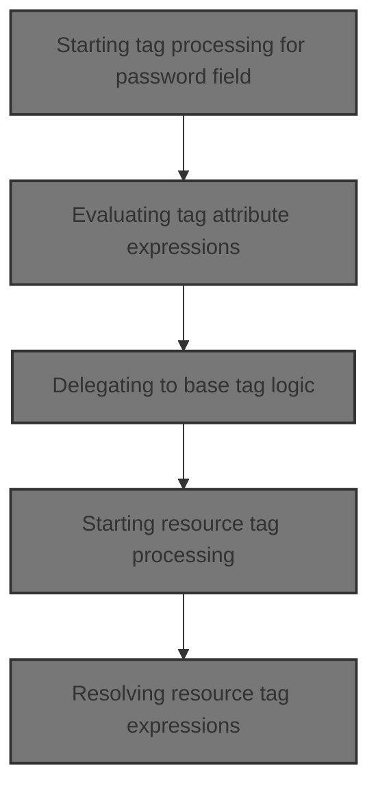
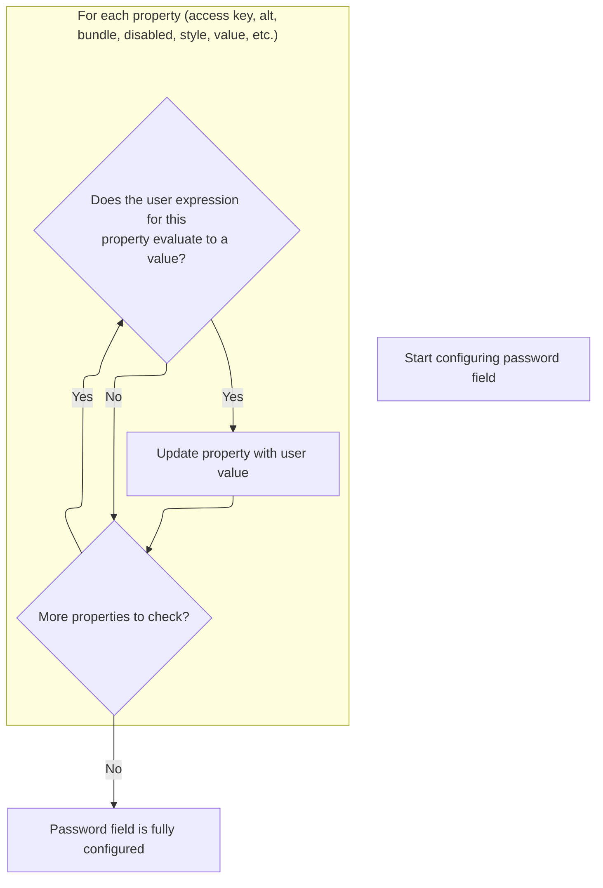

This document describes how password and resource fields in forms are dynamically configured. By evaluating user-provided expressions for each tag attribute, the system updates the tag configuration, enabling customization based on user input or application state. After all attributes are resolved, the tags are ready for rendering.



# Starting tag processing for password field

<SwmSnippet path="/el/src/main/java/org/apache/strutsel/taglib/html/ELPasswordTag.java" line="947">

---

In <SwmToken path="el/src/main/java/org/apache/strutsel/taglib/html/ELPasswordTag.java" pos="947:5:5" line-data="    public int doStartTag() throws JspException {">`doStartTag`</SwmToken>, we kick off tag processing by resolving all dynamic attributes using <SwmToken path="el/src/main/java/org/apache/strutsel/taglib/html/ELPasswordTag.java" pos="948:1:1" line-data="        evaluateExpressions();">`evaluateExpressions`</SwmToken>. This ensures the tag is set up with the right values before any further logic or rendering happens.

```java
    public int doStartTag() throws JspException {
        evaluateExpressions();

```

---

</SwmSnippet>

## Evaluating tag attribute expressions



<SwmSnippet path="/el/src/main/java/org/apache/strutsel/taglib/html/ELPasswordTag.java" line="959">

---

In <SwmToken path="el/src/main/java/org/apache/strutsel/taglib/html/ELPasswordTag.java" pos="959:5:5" line-data="    private void evaluateExpressions()">`evaluateExpressions`</SwmToken>, we resolve each tag attribute from its expression and set it if present. When the bundle expression is evaluated, <SwmToken path="el/src/main/java/org/apache/strutsel/taglib/html/ELPasswordTag.java" pos="984:1:1" line-data="            setBundle(string);">`setBundle`</SwmToken> is called to update the resource bundle, which may affect localization or error handling.

```java
    private void evaluateExpressions()
        throws JspException {
        String string = null;
        Boolean bool = null;

        if ((string =
                EvalHelper.evalString("accessKey", getAccesskeyExpr(), this,
                    pageContext)) != null) {
            setAccesskey(string);
        }

        if ((string =
                EvalHelper.evalString("alt", getAltExpr(), this, pageContext)) != null) {
            setAlt(string);
        }

        if ((string =
                EvalHelper.evalString("altKey", getAltKeyExpr(), this,
                    pageContext)) != null) {
            setAltKey(string);
        }

        if ((string =
                EvalHelper.evalString("bundle", getBundleExpr(), this,
                    pageContext)) != null) {
            setBundle(string);
        }

```

---

</SwmSnippet>

<SwmSnippet path="/core/src/main/java/org/apache/struts/config/ExceptionConfig.java" line="89">

---

SetBundle checks if the configuration is frozen using the 'configured' flag. If it's frozen, it throws an exception to block any changes, enforcing immutability for the bundle setting.

```java
    public void setBundle(String bundle) {
        if (configured) {
            throw new IllegalStateException("Configuration is frozen");
        }

        this.bundle = bundle;
    }
```

---

</SwmSnippet>

<SwmSnippet path="/el/src/main/java/org/apache/strutsel/taglib/html/ELPasswordTag.java" line="987">

---

Back in ELPasswordTag.evaluateExpressions, after updating the bundle, we keep resolving and setting other tag attributes. When the size expression is evaluated, <SwmToken path="el/src/main/java/org/apache/strutsel/taglib/html/ELPasswordTag.java" pos="1167:1:1" line-data="            setSize(string);">`setSize`</SwmToken> is called to update the field size, which triggers validation and may throw if the value is invalid.

```java
        if ((string =
        		EvalHelper.evalString("dir", getDirExpr(), this,
        			pageContext)) != null) {
        	setDir(string);
        }
        
        if ((bool =
                EvalHelper.evalBoolean("disabled", getDisabledExpr(), this,
                    pageContext)) != null) {
            setDisabled(bool.booleanValue());
        }

        if ((string =
                EvalHelper.evalString("errorKey", getErrorKeyExpr(), this,
                    pageContext)) != null) {
            setErrorKey(string);
        }

        if ((string =
                EvalHelper.evalString("errorStyle", getErrorStyleExpr(), this,
                    pageContext)) != null) {
            setErrorStyle(string);
        }

        if ((string =
                EvalHelper.evalString("errorStyleClass",
                    getErrorStyleClassExpr(), this, pageContext)) != null) {
            setErrorStyleClass(string);
        }

        if ((string =
                EvalHelper.evalString("errorStyleId", getErrorStyleIdExpr(),
                    this, pageContext)) != null) {
            setErrorStyleId(string);
        }

        if ((bool =
                EvalHelper.evalBoolean("indexed", getIndexedExpr(), this,
                    pageContext)) != null) {
            setIndexed(bool.booleanValue());
        }

        if ((string =
            	EvalHelper.evalString("lang", getLangExpr(), this,
            		pageContext)) != null) {
        	setLang(string);
        }

        if ((string =
                EvalHelper.evalString("maxlength", getMaxlengthExpr(), this,
                    pageContext)) != null) {
            setMaxlength(string);
        }

        if ((string =
                EvalHelper.evalString("name", getNameExpr(), this, pageContext)) != null) {
            setName(string);
        }

        if ((string =
                EvalHelper.evalString("onblur", getOnblurExpr(), this,
                    pageContext)) != null) {
            setOnblur(string);
        }

        if ((string =
                EvalHelper.evalString("onchange", getOnchangeExpr(), this,
                    pageContext)) != null) {
            setOnchange(string);
        }

        if ((string =
                EvalHelper.evalString("onclick", getOnclickExpr(), this,
                    pageContext)) != null) {
            setOnclick(string);
        }

        if ((string =
                EvalHelper.evalString("ondblclick", getOndblclickExpr(), this,
                    pageContext)) != null) {
            setOndblclick(string);
        }

        if ((string =
                EvalHelper.evalString("onfocus", getOnfocusExpr(), this,
                    pageContext)) != null) {
            setOnfocus(string);
        }

        if ((string =
                EvalHelper.evalString("onkeydown", getOnkeydownExpr(), this,
                    pageContext)) != null) {
            setOnkeydown(string);
        }

        if ((string =
                EvalHelper.evalString("onkeypress", getOnkeypressExpr(), this,
                    pageContext)) != null) {
            setOnkeypress(string);
        }

        if ((string =
                EvalHelper.evalString("onkeyup", getOnkeyupExpr(), this,
                    pageContext)) != null) {
            setOnkeyup(string);
        }

        if ((string =
                EvalHelper.evalString("onmousedown", getOnmousedownExpr(),
                    this, pageContext)) != null) {
            setOnmousedown(string);
        }

        if ((string =
                EvalHelper.evalString("onmousemove", getOnmousemoveExpr(),
                    this, pageContext)) != null) {
            setOnmousemove(string);
        }

        if ((string =
                EvalHelper.evalString("onmouseout", getOnmouseoutExpr(), this,
                    pageContext)) != null) {
            setOnmouseout(string);
        }

        if ((string =
                EvalHelper.evalString("onmouseover", getOnmouseoverExpr(),
                    this, pageContext)) != null) {
            setOnmouseover(string);
        }

        if ((string =
                EvalHelper.evalString("onmouseup", getOnmouseupExpr(), this,
                    pageContext)) != null) {
            setOnmouseup(string);
        }

        if ((string =
                EvalHelper.evalString("onselect", getOnselectExpr(), this,
                    pageContext)) != null) {
            setOnselect(string);
        }

        if ((string =
                EvalHelper.evalString("property", getPropertyExpr(), this,
                    pageContext)) != null) {
            setProperty(string);
        }

        if ((bool =
                EvalHelper.evalBoolean("readonly", getReadonlyExpr(), this,
                    pageContext)) != null) {
            setReadonly(bool.booleanValue());
        }

        if ((bool =
                EvalHelper.evalBoolean("redisplay", getRedisplayExpr(), this,
                    pageContext)) != null) {
            setRedisplay(bool.booleanValue());
        }

        if ((string =
                EvalHelper.evalString("style", getStyleExpr(), this, pageContext)) != null) {
            setStyle(string);
        }

        if ((string =
                EvalHelper.evalString("styleClass", getStyleClassExpr(), this,
                    pageContext)) != null) {
            setStyleClass(string);
        }

        if ((string =
                EvalHelper.evalString("styleId", getStyleIdExpr(), this,
                    pageContext)) != null) {
            setStyleId(string);
        }

        if ((string =
                EvalHelper.evalString("size", getSizeExpr(), this, pageContext)) != null) {
            setSize(string);
        }

```

---

</SwmSnippet>

<SwmSnippet path="/core/src/main/java/org/apache/struts/config/FormPropertyConfig.java" line="192">

---

SetSize checks for frozen configuration and negative values. If either is true, it throws an exception, so only valid, <SwmToken path="core/src/main/java/org/apache/struts/config/FormPropertyConfig.java" pos="71:7:9" line-data="     * must be non-negative.&lt;/p&gt;">`non-negative`</SwmToken> sizes are accepted and no changes are allowed after freezing.

```java
    public void setSize(int size) {
        if (configured) {
            throw new IllegalStateException("Configuration is frozen");
        }

        if (size < 0) {
            throw new IllegalArgumentException("size < 0");
        }

        this.size = size;
    }
```

---

</SwmSnippet>

<SwmSnippet path="/el/src/main/java/org/apache/strutsel/taglib/html/ELPasswordTag.java" line="1170">

---

Finally, after returning from <SwmToken path="el/src/main/java/org/apache/strutsel/taglib/html/ELPasswordTag.java" pos="1167:1:1" line-data="            setSize(string);">`setSize`</SwmToken>, ELPasswordTag.evaluateExpressions finishes by resolving and setting the remaining attributes. At this point, the tag is fully configured for rendering.

```java
        if ((string =
                EvalHelper.evalString("tabindex", getTabindexExpr(), this,
                    pageContext)) != null) {
            setTabindex(string);
        }

        if ((string =
                EvalHelper.evalString("title", getTitleExpr(), this, pageContext)) != null) {
            setTitle(string);
        }

        if ((string =
                EvalHelper.evalString("titleKey", getTitleKeyExpr(), this,
                    pageContext)) != null) {
            setTitleKey(string);
        }

        if ((string =
                EvalHelper.evalString("value", getValueExpr(), this, pageContext)) != null) {
            setValue(string);
        }
    }
```

---

</SwmSnippet>

## Delegating to base tag logic

<SwmSnippet path="/el/src/main/java/org/apache/strutsel/taglib/html/ELPasswordTag.java" line="950">

---

Back in ELPasswordTag.doStartTag, after resolving all expressions, we hand off to the base tag logic by calling <SwmToken path="el/src/main/java/org/apache/strutsel/taglib/html/ELPasswordTag.java" pos="950:4:6" line-data="        return (super.doStartTag());">`super.doStartTag`</SwmToken>. This triggers standard tag processing, and then we move on to <SwmToken path="el/src/main/java/org/apache/strutsel/taglib/bean/ELResourceTag.java" pos="38:4:4" line-data="public class ELResourceTag extends ResourceTag {">`ELResourceTag`</SwmToken> for further resource handling.

```java
        return (super.doStartTag());
    }
```

---

</SwmSnippet>

# Starting resource tag processing

<SwmSnippet path="/el/src/main/java/org/apache/strutsel/taglib/bean/ELResourceTag.java" line="120">

---

ELResourceTag.doStartTag starts by resolving tag attributes using <SwmToken path="el/src/main/java/org/apache/strutsel/taglib/bean/ELResourceTag.java" pos="121:1:1" line-data="        evaluateExpressions();">`evaluateExpressions`</SwmToken>, making sure the resource tag is configured before delegating to base logic.

```java
    public int doStartTag() throws JspException {
        evaluateExpressions();

        return (super.doStartTag());
    }
```

---

</SwmSnippet>

# Resolving resource tag expressions

```mermaid
%%{init: {"flowchart": {"defaultRenderer": "elk"}} }%%
flowchart TD
    node1["Start expression evaluation"]
    click node1 openCode "el/src/main/java/org/apache/strutsel/taglib/bean/ELResourceTag.java:132:135"
    node1 --> node2{"Is 'id' expression present?"}
    click node2 openCode "el/src/main/java/org/apache/strutsel/taglib/bean/ELResourceTag.java:136:139"
    node2 -->|"Yes"| node3["Update resource 'id'"]
    click node3 openCode "el/src/main/java/org/apache/strutsel/taglib/bean/ELResourceTag.java:138:139"
    node2 -->|"No"| node4
    node3 --> node4
    node4{"Is 'input' expression present?"}
    click node4 openCode "el/src/main/java/org/apache/strutsel/taglib/bean/ELResourceTag.java:141:144"
    node4 -->|"Yes"| node5["Update resource 'input'"]
    click node5 openCode "el/src/main/java/org/apache/strutsel/taglib/bean/ELResourceTag.java:143:144"
    node4 -->|"No"| node6
    node5 --> node6
    node6{"Is 'name' expression present?"}
    click node6 openCode "el/src/main/java/org/apache/strutsel/taglib/bean/ELResourceTag.java:146:149"
    node6 -->|"Yes"| node7["Update resource 'name'"]
    click node7 openCode "el/src/main/java/org/apache/strutsel/taglib/bean/ELResourceTag.java:148:149"
    node6 -->|"No"| node8
    node7 --> node8
classDef HeadingStyle fill:#777777,stroke:#333,stroke-width:2px;

%% Swimm:
%% %%{init: {"flowchart": {"defaultRenderer": "elk"}} }%%
%% flowchart TD
%%     node1["Start expression evaluation"]
%%     click node1 openCode "<SwmPath>[el/…/bean/ELResourceTag.java](el/src/main/java/org/apache/strutsel/taglib/bean/ELResourceTag.java)</SwmPath>:132:135"
%%     node1 --> node2{"Is 'id' expression present?"}
%%     click node2 openCode "<SwmPath>[el/…/bean/ELResourceTag.java](el/src/main/java/org/apache/strutsel/taglib/bean/ELResourceTag.java)</SwmPath>:136:139"
%%     node2 -->|"Yes"| node3["Update resource 'id'"]
%%     click node3 openCode "<SwmPath>[el/…/bean/ELResourceTag.java](el/src/main/java/org/apache/strutsel/taglib/bean/ELResourceTag.java)</SwmPath>:138:139"
%%     node2 -->|"No"| node4
%%     node3 --> node4
%%     node4{"Is 'input' expression present?"}
%%     click node4 openCode "<SwmPath>[el/…/bean/ELResourceTag.java](el/src/main/java/org/apache/strutsel/taglib/bean/ELResourceTag.java)</SwmPath>:141:144"
%%     node4 -->|"Yes"| node5["Update resource 'input'"]
%%     click node5 openCode "<SwmPath>[el/…/bean/ELResourceTag.java](el/src/main/java/org/apache/strutsel/taglib/bean/ELResourceTag.java)</SwmPath>:143:144"
%%     node4 -->|"No"| node6
%%     node5 --> node6
%%     node6{"Is 'name' expression present?"}
%%     click node6 openCode "<SwmPath>[el/…/bean/ELResourceTag.java](el/src/main/java/org/apache/strutsel/taglib/bean/ELResourceTag.java)</SwmPath>:146:149"
%%     node6 -->|"Yes"| node7["Update resource 'name'"]
%%     click node7 openCode "<SwmPath>[el/…/bean/ELResourceTag.java](el/src/main/java/org/apache/strutsel/taglib/bean/ELResourceTag.java)</SwmPath>:148:149"
%%     node6 -->|"No"| node8
%%     node7 --> node8
%% classDef HeadingStyle fill:#777777,stroke:#333,stroke-width:2px;
```



<SwmSnippet path="/el/src/main/java/org/apache/strutsel/taglib/bean/ELResourceTag.java" line="132">

---

In <SwmToken path="el/src/main/java/org/apache/strutsel/taglib/bean/ELResourceTag.java" pos="132:5:5" line-data="    private void evaluateExpressions()">`evaluateExpressions`</SwmToken>, we resolve the 'id' and 'input' attributes from their expressions. If the input expression is present, <SwmToken path="el/src/main/java/org/apache/strutsel/taglib/bean/ELResourceTag.java" pos="143:1:1" line-data="            setInput(string);">`setInput`</SwmToken> is called to update the resource tag's input configuration.

```java
    private void evaluateExpressions()
        throws JspException {
        String string = null;

        if ((string =
                EvalHelper.evalString("id", getIdExpr(), this, pageContext)) != null) {
            setId(string);
        }

        if ((string =
                EvalHelper.evalString("input", getInputExpr(), this, pageContext)) != null) {
            setInput(string);
        }

```

---

</SwmSnippet>

<SwmSnippet path="/core/src/main/java/org/apache/struts/config/ActionConfig.java" line="473">

---

SetInput checks the 'configured' flag to see if configuration is frozen. If so, it throws an exception, so input can't be changed after setup is finalized.

```java
    public void setInput(String input) {
        if (configured) {
            throw new IllegalStateException("Configuration is frozen");
        }

        this.input = input;
    }
```

---

</SwmSnippet>

<SwmSnippet path="/el/src/main/java/org/apache/strutsel/taglib/bean/ELResourceTag.java" line="146">

---

Finally, after returning from <SwmToken path="el/src/main/java/org/apache/strutsel/taglib/bean/ELResourceTag.java" pos="143:1:1" line-data="            setInput(string);">`setInput`</SwmToken>, ELResourceTag.evaluateExpressions finishes by resolving and setting the remaining attributes. The resource tag is now fully configured for rendering.

```java
        if ((string =
                EvalHelper.evalString("name", getNameExpr(), this, pageContext)) != null) {
            setName(string);
        }
    }
```

---

</SwmSnippet>

&nbsp;

*This is an auto-generated document by Swimm 🌊 and has not yet been verified by a human*

<SwmMeta version="3.0.0" repo-id="Z2l0aHViJTNBJTNBc3RydXRzMSUzQSUzQVN3aW1tLURlbW8=" repo-name="struts1"><sup>Powered by [Swimm](https://app.swimm.io/)</sup></SwmMeta>
