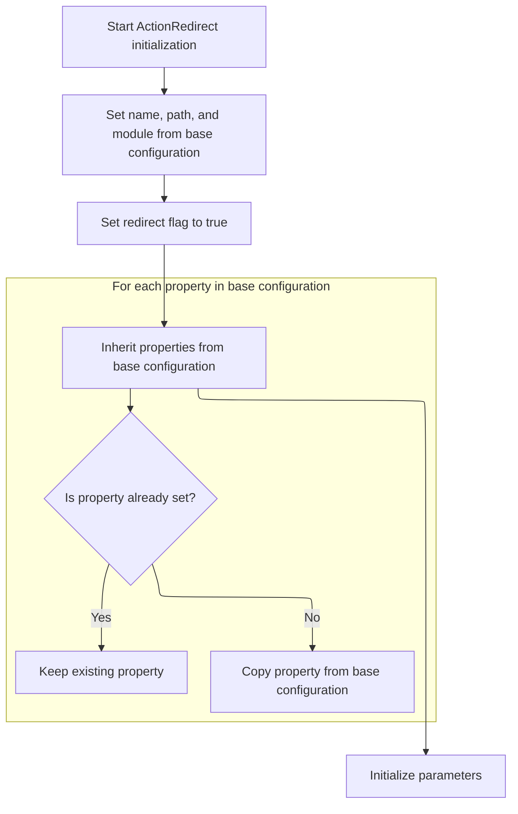

Redirect actions guide users to a new URL after completing operations like form submissions. This flow explains how a redirect action is configured from a base configuration, resulting in a redirect that includes the correct path, parameters, and inherited settings.

# Configuring Redirect Action from <SwmToken path="core/src/main/java/org/apache/struts/action/ActionRedirect.java" pos="130:5:5" line-data="    public ActionRedirect(ForwardConfig baseConfig) {">`ForwardConfig`</SwmToken>



<SwmSnippet path="/core/src/main/java/org/apache/struts/action/ActionRedirect.java" line="130">

---

In `ActionRedirect.ActionRedirect`, we start by pulling the name and path from the <SwmToken path="core/src/main/java/org/apache/struts/action/ActionRedirect.java" pos="130:5:5" line-data="    public ActionRedirect(ForwardConfig baseConfig) {">`ForwardConfig`</SwmToken> and setting them on the <SwmToken path="core/src/main/java/org/apache/struts/action/ActionRedirect.java" pos="130:3:3" line-data="    public ActionRedirect(ForwardConfig baseConfig) {">`ActionRedirect`</SwmToken>. This sets up the basic redirect info. We need to call <SwmToken path="core/src/main/java/org/apache/struts/action/ActionRedirect.java" pos="132:5:5" line-data="        setPath(baseConfig.getPath());">`getPath`</SwmToken> next because the path might need parameters or anchors appended, so just copying the path isn't enough for the redirect to work.

```java
    public ActionRedirect(ForwardConfig baseConfig) {
        setName(baseConfig.getName());
        setPath(baseConfig.getPath());
```

---

</SwmSnippet>

<SwmSnippet path="/core/src/main/java/org/apache/struts/action/ActionRedirect.java" line="230">

---

<SwmToken path="core/src/main/java/org/apache/struts/action/ActionRedirect.java" pos="230:5:5" line-data="    public String getPath() {">`getPath`</SwmToken> builds the redirect URL by adding parameters and anchors to the original path. It checks if parameters need to be appended and picks the right separator ('?' or '&'), then adds the anchor at the end. This makes sure the redirect URL is complete and valid.

```java
    public String getPath() {
        // get the original path and the parameter string that was formed
        String originalPath = getOriginalPath();
        String parameterString = getParameterString();
        String anchorString = getAnchorString();

        StringBuffer result = new StringBuffer(originalPath);

        if ((parameterString != null) && (parameterString.length() > 0)) {
            // the parameter separator we're going to use
            String paramSeparator = "?";

            // true if we need to use a parameter separator after originalPath
            boolean needsParamSeparator = true;

            // does the original path already have a "?"?
            int paramStartIndex = originalPath.indexOf("?");

            if (paramStartIndex > 0) {
                // did the path end with "?"?
                needsParamSeparator = (paramStartIndex != (originalPath.length()
                    - 1));

                if (needsParamSeparator) {
                    paramSeparator = "&";
                }
            }

            if (needsParamSeparator) {
                result.append(paramSeparator);
            }

            result.append(parameterString);
        }

        // append anchor string (or blank if none was set)
        result.append(anchorString);


        return result.toString();
    }
```

---

</SwmSnippet>

<SwmSnippet path="/core/src/main/java/org/apache/struts/action/ActionRedirect.java" line="133">

---

Back in `ActionRedirect.ActionRedirect`, after setting the main properties and building the path, we call the config inheritance logic. This pulls in any extra settings from <SwmToken path="core/src/main/java/org/apache/struts/action/ActionRedirect.java" pos="130:5:5" line-data="    public ActionRedirect(ForwardConfig baseConfig) {">`ForwardConfig`</SwmToken> that aren't already set, so the redirect has everything it needs.

```java
        setModule(baseConfig.getModule());
        setRedirect(true);
        inheritProperties(baseConfig);
```

---

</SwmSnippet>

<SwmSnippet path="/core/src/main/java/org/apache/struts/config/BaseConfig.java" line="132">

---

<SwmToken path="core/src/main/java/org/apache/struts/config/BaseConfig.java" pos="132:5:5" line-data="    protected void inheritProperties(BaseConfig baseConfig) {">`inheritProperties`</SwmToken> checks if each property is already set on the current config. If not, it copies it from the base config. This keeps custom settings intact and fills in any gaps with defaults.

```java
    protected void inheritProperties(BaseConfig baseConfig) {
        throwIfConfigured();

        // Inherit forward properties
        Properties baseProperties = baseConfig.getProperties();
        Enumeration keys = baseProperties.propertyNames();

        while (keys.hasMoreElements()) {
            String key = (String) keys.nextElement();

            // Check if we have this property before copying it
            String value = this.getProperty(key);

            if (value == null) {
                value = baseProperties.getProperty(key);
                setProperty(key, value);
            }
        }
```

---

</SwmSnippet>

<SwmSnippet path="/core/src/main/java/org/apache/struts/action/ActionRedirect.java" line="136">

---

Finally in `ActionRedirect.ActionRedirect`, after inheriting properties, we initialize parameters for the redirect. This makes sure the <SwmToken path="core/src/main/java/org/apache/struts/action/ActionRedirect.java" pos="130:3:3" line-data="    public ActionRedirect(ForwardConfig baseConfig) {">`ActionRedirect`</SwmToken> is ready to handle the redirect with all necessary settings.

```java
        initializeParameters();
    }
```

---

</SwmSnippet>

&nbsp;

*This is an auto-generated document by Swimm 🌊 and has not yet been verified by a human*

<SwmMeta version="3.0.0" repo-id="Z2l0aHViJTNBJTNBc3RydXRzMSUzQSUzQVN3aW1tLURlbW8=" repo-name="struts1"><sup>Powered by [Swimm](https://app.swimm.io/)</sup></SwmMeta>
