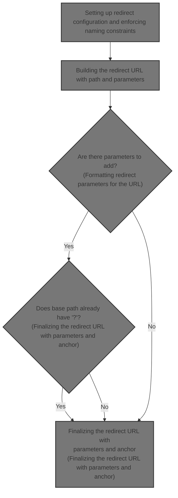
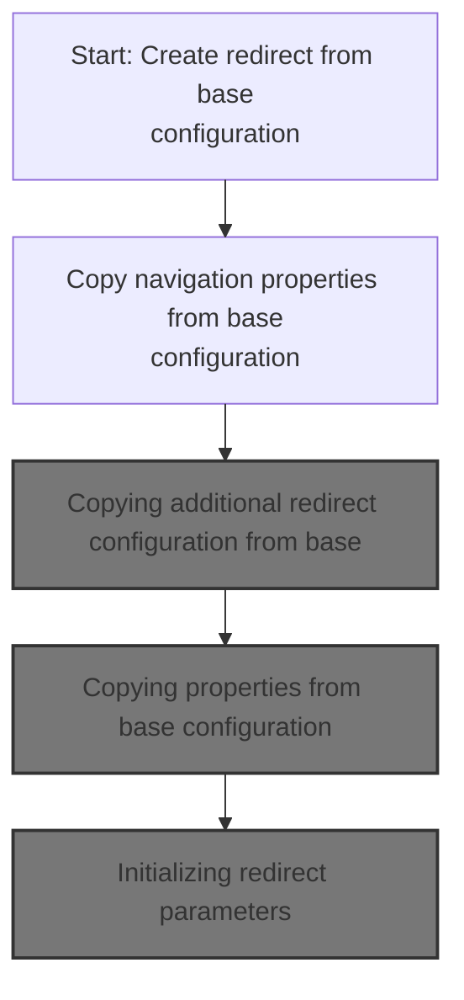
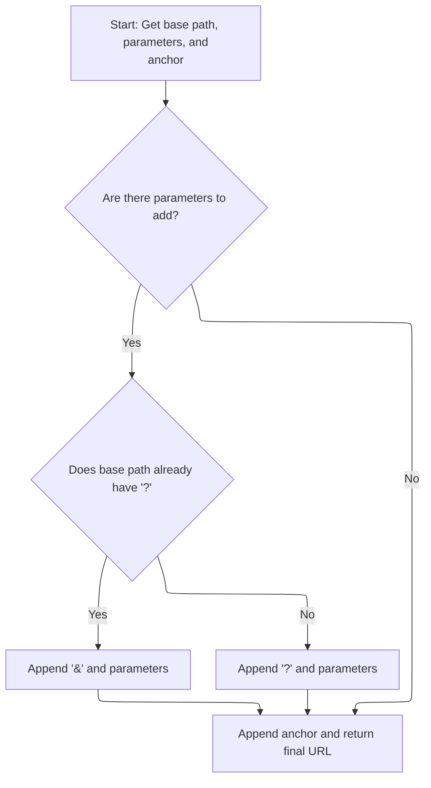
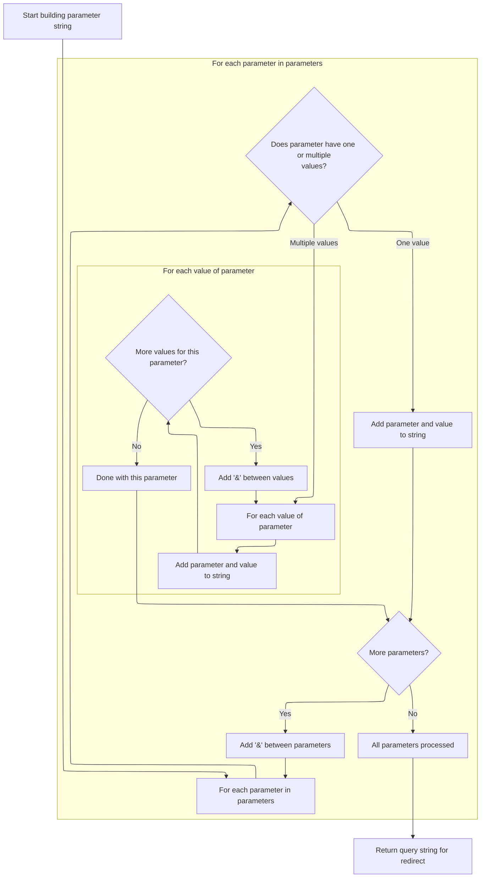
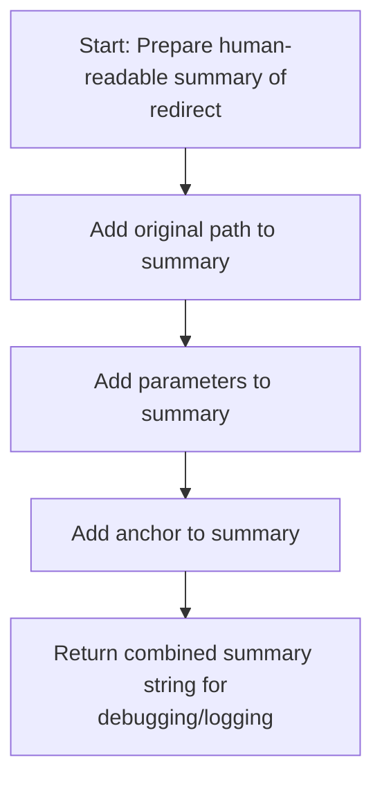
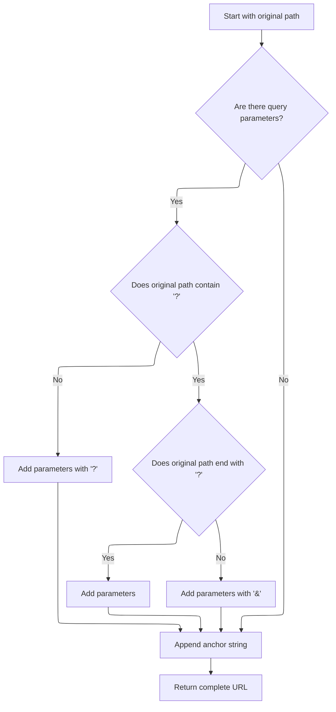
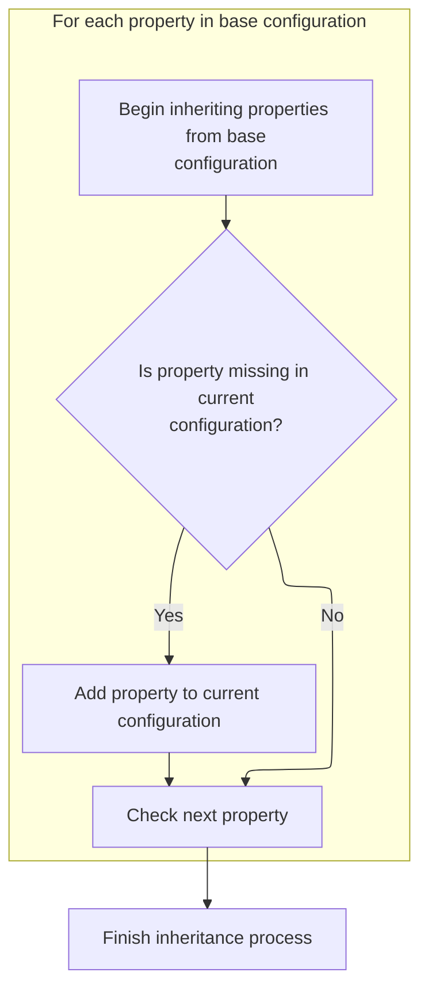

This document explains how a redirect URL is created by inheriting settings from a base configuration and adding parameters and anchor information. The resulting URL enables the system to redirect users to the appropriate destination with all required context.



# Setting up redirect configuration and enforcing naming constraints



<SwmSnippet path="/core/src/main/java/org/apache/struts/action/ActionRedirect.java" line="130">

---

In ActionRedirect.ActionRedirect, we start by copying the name from the base configuration. This sets up the redirect object to match the original config, and we need to call FormBeanConfig.setName next to enforce any constraints on changing the name, like immutability after configuration.

```java
    public ActionRedirect(ForwardConfig baseConfig) {
        setName(baseConfig.getName());
```

---

</SwmSnippet>

<SwmSnippet path="/core/src/main/java/org/apache/struts/config/FormBeanConfig.java" line="152">

---

FormBeanConfig.setName enforces that the name can't be changed after configuration by calling <SwmToken path="core/src/main/java/org/apache/struts/config/FormBeanConfig.java" pos="153:1:3" line-data="        throwIfConfigured();">`throwIfConfigured()`</SwmToken> first. This keeps the object's lifecycle predictable and prevents accidental changes.

```java
    public void setName(String name) {
        throwIfConfigured();
        this.name = name;
    }
```

---

</SwmSnippet>

<SwmSnippet path="/core/src/main/java/org/apache/struts/action/ActionRedirect.java" line="132">

---

Back in ActionRedirect.ActionRedirect, after setting the name, we copy the path from the base config. This sets up the destination for the redirect, and we need to call <SwmToken path="core/src/main/java/org/apache/struts/action/ActionRedirect.java" pos="132:5:5" line-data="        setPath(baseConfig.getPath());">`getPath`</SwmToken> next to handle any path-specific logic.

```java
        setPath(baseConfig.getPath());
```

---

</SwmSnippet>

## Building the redirect URL with path and parameters



<SwmSnippet path="/core/src/main/java/org/apache/struts/action/ActionRedirect.java" line="230">

---

In ActionRedirect.getPath, we grab the original path first. This gives us the base URL before we start appending parameters or anchors, so we call <SwmToken path="core/src/main/java/org/apache/struts/action/ActionRedirect.java" pos="232:7:7" line-data="        String originalPath = getOriginalPath();">`getOriginalPath`</SwmToken> next.

```java
    public String getPath() {
        // get the original path and the parameter string that was formed
        String originalPath = getOriginalPath();
```

---

</SwmSnippet>

<SwmSnippet path="/core/src/main/java/org/apache/struts/action/ActionRedirect.java" line="220">

---

ActionRedirect.getOriginalPath just returns the path from the superclass. This keeps the base URL intact for further processing in <SwmToken path="core/src/main/java/org/apache/struts/action/ActionRedirect.java" pos="221:5:5" line-data="        return super.getPath();">`getPath`</SwmToken>.

```java
    public String getOriginalPath() {
        return super.getPath();
    }
```

---

</SwmSnippet>

<SwmSnippet path="/core/src/main/java/org/apache/struts/action/ActionRedirect.java" line="233">

---

Back in ActionRedirect.getPath, after fetching the original path, we call <SwmToken path="core/src/main/java/org/apache/struts/action/ActionRedirect.java" pos="233:7:7" line-data="        String parameterString = getParameterString();">`getParameterString`</SwmToken> to build the query string for the redirect URL.

```java
        String parameterString = getParameterString();
```

---

</SwmSnippet>

### Formatting redirect parameters for the URL



<SwmSnippet path="/core/src/main/java/org/apache/struts/action/ActionRedirect.java" line="295">

---

In ActionRedirect.getParameterString, we loop through <SwmToken path="core/src/main/java/org/apache/struts/action/ActionRedirect.java" pos="299:7:7" line-data="        Iterator iterator = parameterValues.keySet().iterator();">`parameterValues`</SwmToken> and build a query string. Single values are appended directly, arrays are handled by appending each value with the parameter name, all separated by '&'.

```java
    public String getParameterString() {
        StringBuffer strParam = new StringBuffer(DEFAULT_BUFFER_SIZE);

        // loop through all parameters
        Iterator iterator = parameterValues.keySet().iterator();

        while (iterator.hasNext()) {
            // get the parameter name
            String paramName = (String) iterator.next();

            // get the value for this parameter
            Object value = parameterValues.get(paramName);

            if (value instanceof String) {
                // just one value for this param
                strParam.append(paramName).append("=").append(value);
            } else if (value instanceof String[]) {
                // loop through all values for this param
                String[] values = (String[]) value;

                for (int i = 0; i < values.length; i++) {
                    strParam.append(paramName).append("=").append(values[i]);

                    if (i < (values.length - 1)) {
                        strParam.append("&");
                    }
                }
            }

            if (iterator.hasNext()) {
                strParam.append("&");
            }
        }
```

---

</SwmSnippet>

<SwmSnippet path="/core/src/main/java/org/apache/struts/action/ActionRedirect.java" line="329">

---

Finally, after building the parameter string, we return it so ActionRedirect.toString can include it in the object's debug output.

```java
        return strParam.toString();
    }
```

---

</SwmSnippet>

### Generating a debug string for the redirect



<SwmSnippet path="/core/src/main/java/org/apache/struts/action/ActionRedirect.java" line="340">

---

In ActionRedirect.toString, we start building the debug string by appending the original path. This gives context for where the redirect originates, so we call <SwmToken path="core/src/main/java/org/apache/struts/action/ActionRedirect.java" pos="344:13:13" line-data="        result.append(&quot;originalPath=&quot;).append(getOriginalPath()).append(&quot;;&quot;);">`getOriginalPath`</SwmToken> next.

```java
    public String toString() {
        StringBuffer result = new StringBuffer(DEFAULT_BUFFER_SIZE);

        result.append("ActionRedirect [");
        result.append("originalPath=").append(getOriginalPath()).append(";");
```

---

</SwmSnippet>

<SwmSnippet path="/core/src/main/java/org/apache/struts/action/ActionRedirect.java" line="345">

---

Back in ActionRedirect.toString, after appending the original path, we add the parameter string to show what data is included in the redirect.

```java
        result.append("parameterString=").append(getParameterString()).append("]");
```

---

</SwmSnippet>

<SwmSnippet path="/core/src/main/java/org/apache/struts/action/ActionRedirect.java" line="346">

---

Back in ActionRedirect.toString, after adding the parameter string, we append the anchor string to capture any fragment identifier used in the redirect.

```java
        result.append("anchorString=").append(getAnchorString()).append("]");

        return result.toString();
    }
```

---

</SwmSnippet>

### Finalizing the redirect URL with parameters and anchor



<SwmSnippet path="/core/src/main/java/org/apache/struts/action/ActionRedirect.java" line="234">

---

Back in ActionRedirect.getPath, after getting the parameter string, we handle combining the original path, parameters, and anchor. The method checks for existing query separators and appends everything to build the final URL.

```java
        String anchorString = getAnchorString();

        StringBuffer result = new StringBuffer(originalPath);

        if ((parameterString != null) && (parameterString.length() > 0)) {
            // the parameter separator we're going to use
            String paramSeparator = "?";

            // true if we need to use a parameter separator after originalPath
            boolean needsParamSeparator = true;

            // does the original path already have a "?"?
            int paramStartIndex = originalPath.indexOf("?");

            if (paramStartIndex > 0) {
                // did the path end with "?"?
                needsParamSeparator = (paramStartIndex != (originalPath.length()
                    - 1));

                if (needsParamSeparator) {
                    paramSeparator = "&";
                }
            }

            if (needsParamSeparator) {
                result.append(paramSeparator);
            }

            result.append(parameterString);
        }

        // append anchor string (or blank if none was set)
        result.append(anchorString);


        return result.toString();
    }
```

---

</SwmSnippet>

## Copying additional redirect configuration from base

<SwmSnippet path="/core/src/main/java/org/apache/struts/action/ActionRedirect.java" line="132">

---

Back in ActionRedirect.ActionRedirect, after setting the path, we copy the module from the base config. This keeps routing consistent with the original configuration, so we call ForwardConfig.setModule next.

```java
        setPath(baseConfig.getPath());
```

---

</SwmSnippet>

<SwmSnippet path="/core/src/main/java/org/apache/struts/config/ForwardConfig.java" line="198">

---

ForwardConfig.setPath checks if configuration is frozen before setting the path. If configured, it throws an exception to prevent changes.

```java
    public void setPath(String path) {
        if (configured) {
            throw new IllegalStateException("Configuration is frozen");
        }

        this.path = path;
    }
```

---

</SwmSnippet>

<SwmSnippet path="/core/src/main/java/org/apache/struts/action/ActionRedirect.java" line="133">

---

Back in ActionRedirect.ActionRedirect, after setting the path, we copy the module from the base config. This keeps routing consistent with the original configuration, so we call ForwardConfig.setModule next.

```java
        setModule(baseConfig.getModule());
```

---

</SwmSnippet>

<SwmSnippet path="/core/src/main/java/org/apache/struts/config/ForwardConfig.java" line="210">

---

ForwardConfig.setModule checks if configuration is frozen before setting the module. If configured, it throws an exception to prevent changes.

```java
    public void setModule(String module) {
        if (configured) {
            throw new IllegalStateException("Configuration is frozen");
        }

        this.module = module;
    }
```

---

</SwmSnippet>

<SwmSnippet path="/core/src/main/java/org/apache/struts/action/ActionRedirect.java" line="134">

---

Back in ActionRedirect.ActionRedirect, after setting the module, we copy the redirect flag from the base config. This controls whether the response is a redirect or forward, so we call ForwardConfig.setRedirect next.

```java
        setRedirect(true);
```

---

</SwmSnippet>

<SwmSnippet path="/core/src/main/java/org/apache/struts/config/ForwardConfig.java" line="222">

---

ForwardConfig.setRedirect checks if configuration is frozen before setting the redirect flag. If configured, it throws an exception to prevent changes.

```java
    public void setRedirect(boolean redirect) {
        if (configured) {
            throw new IllegalStateException("Configuration is frozen");
        }

        this.redirect = redirect;
    }
```

---

</SwmSnippet>

<SwmSnippet path="/core/src/main/java/org/apache/struts/action/ActionRedirect.java" line="135">

---

Back in ActionRedirect.ActionRedirect, after setting the redirect flag, we inherit properties from the base config. This copies any additional settings needed for the redirect, so we call BaseConfig.inheritProperties next.

```java
        inheritProperties(baseConfig);
```

---

</SwmSnippet>

## Copying properties from base configuration



<SwmSnippet path="/core/src/main/java/org/apache/struts/config/BaseConfig.java" line="132">

---

BaseConfig.inheritProperties checks for configuration state, then copies properties from the base config only if they're not already set. This avoids overwriting existing values, and we call <SwmToken path="core/src/main/java/org/apache/struts/config/BaseConfig.java" pos="147:1:1" line-data="                setProperty(key, value);">`setProperty`</SwmToken> next to actually copy each property.

```java
    protected void inheritProperties(BaseConfig baseConfig) {
        throwIfConfigured();

        // Inherit forward properties
        Properties baseProperties = baseConfig.getProperties();
        Enumeration keys = baseProperties.propertyNames();

        while (keys.hasMoreElements()) {
            String key = (String) keys.nextElement();

            // Check if we have this property before copying it
            String value = this.getProperty(key);

            if (value == null) {
                value = baseProperties.getProperty(key);
                setProperty(key, value);
            }
        }
    }
```

---

</SwmSnippet>

<SwmSnippet path="/core/src/main/java/org/apache/struts/config/BaseConfig.java" line="88">

---

BaseConfig.setProperty checks for configuration state before setting a property. If not configured, it sets the property in the Properties object.

```java
    public void setProperty(String key, String value) {
        throwIfConfigured();
        properties.setProperty(key, value);
    }
```

---

</SwmSnippet>

## Initializing redirect parameters

<SwmSnippet path="/core/src/main/java/org/apache/struts/action/ActionRedirect.java" line="136">

---

Back in ActionRedirect.ActionRedirect, after inheriting properties, we initialize parameters to make sure the redirect is ready to handle any data passed to the client.

```java
        initializeParameters();
    }
```

---

</SwmSnippet>

&nbsp;

*This is an auto-generated document by Swimm 🌊 and has not yet been verified by a human*

<SwmMeta version="3.0.0" repo-id="Z2l0aHViJTNBJTNBc3RydXRzMSUzQSUzQVN3aW1tLURlbW8=" repo-name="struts1"><sup>Powered by [Swimm](https://app.swimm.io/)</sup></SwmMeta>
