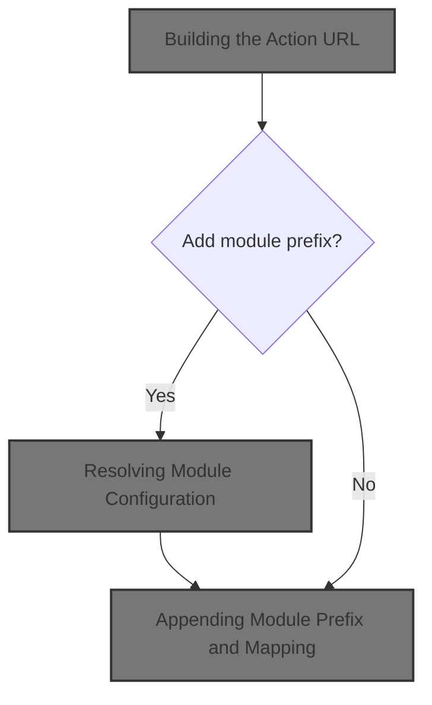

This document explains how a URL is constructed to route requests to the correct action within a modular web application. The process adapts the URL based on module and servlet mapping configurations, ensuring accurate routing.



# Building the Action URL

<SwmSnippet path="/taglib/src/main/java/org/apache/struts/taglib/TagUtils.java" line="654">

---

In <SwmToken path="taglib/src/main/java/org/apache/struts/taglib/TagUtils.java" pos="654:5:5" line-data="    public String getActionMappingURL(String action, String module,">`getActionMappingURL`</SwmToken>, we grab the <SwmToken path="taglib/src/main/java/org/apache/struts/taglib/TagUtils.java" pos="656:1:1" line-data="        HttpServletRequest request =">`HttpServletRequest`</SwmToken> from the <SwmToken path="taglib/src/main/java/org/apache/struts/taglib/TagUtils.java" pos="655:1:1" line-data="        PageContext pageContext, boolean contextRelative) {">`PageContext`</SwmToken> so we can use servlet context info for URL assembly. Next, we need to call ServletActionContext to get module-specific context, which helps us figure out which module config to use for the URL.

```java
    public String getActionMappingURL(String action, String module,
        PageContext pageContext, boolean contextRelative) {
        HttpServletRequest request =
            (HttpServletRequest) pageContext.getRequest();

```

---

</SwmSnippet>

<SwmSnippet path="/taglib/src/main/java/org/apache/struts/taglib/TagUtils.java" line="659">

---

Back in <SwmToken path="taglib/src/main/java/org/apache/struts/taglib/TagUtils.java" pos="654:5:5" line-data="    public String getActionMappingURL(String action, String module,">`getActionMappingURL`</SwmToken>, after getting servlet context info, we append the context path if it's not root. Then we call <SwmToken path="taglib/src/main/java/org/apache/struts/taglib/TagUtils.java" pos="669:7:7" line-data="        ModuleConfig moduleConfig = getModuleConfig(module, pageContext);">`getModuleConfig`</SwmToken> to fetch the module prefix, which is needed to build the correct URL for the current module.

```java
        String contextPath = request.getContextPath();
        StringBuffer value = new StringBuffer();

        // Avoid setting two slashes at the beginning of an action:
        //  the length of contextPath should be more than 1
        //  in case of non-root context, otherwise length==1 (the slash)
        if (contextPath.length() > 1) {
            value.append(contextPath);
        }

        ModuleConfig moduleConfig = getModuleConfig(module, pageContext);

```

---

</SwmSnippet>

## Resolving Module Configuration

<SwmSnippet path="/taglib/src/main/java/org/apache/struts/taglib/TagUtils.java" line="786">

---

In <SwmToken path="taglib/src/main/java/org/apache/struts/taglib/TagUtils.java" pos="786:5:5" line-data="    public ModuleConfig getModuleConfig(String module, PageContext pageContext) {">`getModuleConfig`</SwmToken>, we delegate to <SwmToken path="taglib/src/main/java/org/apache/struts/taglib/TagUtils.java" pos="788:1:1" line-data="            ModuleUtils.getInstance().getModuleConfig(module,">`ModuleUtils`</SwmToken> to fetch the module config using the module name, request, and servlet context. This ensures we get the right config for the current module and context.

```java
    public ModuleConfig getModuleConfig(String module, PageContext pageContext) {
        ModuleConfig config =
            ModuleUtils.getInstance().getModuleConfig(module,
                (HttpServletRequest) pageContext.getRequest(),
                pageContext.getServletContext());
```

---

</SwmSnippet>

<SwmSnippet path="/taglib/src/main/java/org/apache/struts/taglib/TagUtils.java" line="788">

---

Next, after getting the config from <SwmToken path="taglib/src/main/java/org/apache/struts/taglib/TagUtils.java" pos="788:1:1" line-data="            ModuleUtils.getInstance().getModuleConfig(module,">`ModuleUtils`</SwmToken>, we check if it's null. If so, we throw an exception to catch misconfigurations early. Otherwise, we return the config for further processing.

```java
            ModuleUtils.getInstance().getModuleConfig(module,
                (HttpServletRequest) pageContext.getRequest(),
                pageContext.getServletContext());

```

---

</SwmSnippet>

<SwmSnippet path="/taglib/src/main/java/org/apache/struts/taglib/TagUtils.java" line="792">

---

Finally, after using ServletActionContext info, we return the module config from <SwmToken path="taglib/src/main/java/org/apache/struts/taglib/TagUtils.java" pos="669:7:7" line-data="        ModuleConfig moduleConfig = getModuleConfig(module, pageContext);">`getModuleConfig`</SwmToken>. This config is used by the calling function to build the action URL.

```java
        // ModuleConfig not found
        if (config == null) {
            throw new NullPointerException("Module '" + module + "' not found.");
        }

        return config;
    }
```

---

</SwmSnippet>

## Appending Module Prefix and Mapping

```mermaid
%%{init: {"flowchart": {"defaultRenderer": "elk"}} }%%
flowchart TD
    node1["Start: Need to generate action URL"] --> node2{"Is module config present and not
context-relative?"}
    click node1 openCode "taglib/src/main/java/org/apache/struts/taglib/TagUtils.java:671:671"
    node2 -->|"Yes"| node3["Add module prefix to URL"]
    click node2 openCode "taglib/src/main/java/org/apache/struts/taglib/TagUtils.java:671:673"
    node2 -->|"No"| node4
    node3 --> node4
    node4{"Is servlet mapping defined?"}
    click node3 openCode "taglib/src/main/java/org/apache/struts/taglib/TagUtils.java:671:673"
    click node4 openCode "taglib/src/main/java/org/apache/struts/taglib/TagUtils.java:676:679"
    node4 -->|"Yes"| node5["Extract action mapping name"]
    node4 -->|"No"| node10{"Does action start with '/'?"}
    click node5 openCode "taglib/src/main/java/org/apache/struts/taglib/TagUtils.java:688:688"
    node5 --> node6{"What type of servlet mapping?"}
    click node6 openCode "taglib/src/main/java/org/apache/struts/taglib/TagUtils.java:690:699"
    node6 -->|"Extension mapping"| node7["Build URL with action mapping and
extension"]
    node6 -->|"Path mapping"| node8["Build URL with servlet path and action
mapping"]
    node6 -->|"Root mapping"| node9["Build URL with action mapping only"]
    click node7 openCode "taglib/src/main/java/org/apache/struts/taglib/TagUtils.java:690:692"
    click node8 openCode "taglib/src/main/java/org/apache/struts/taglib/TagUtils.java:693:696"
    click node9 openCode "taglib/src/main/java/org/apache/struts/taglib/TagUtils.java:697:699"
    node7 --> node11{"Does action have query string?"}
    node8 --> node11
    node9 --> node11
    click node11 openCode "taglib/src/main/java/org/apache/struts/taglib/TagUtils.java:681:686"
    node11 -->|"Yes"| node12["Append query string to URL"]
    node11 -->|"No"| node13["Return constructed URL"]
    click node12 openCode "taglib/src/main/java/org/apache/struts/taglib/TagUtils.java:701:703"
    click node13 openCode "taglib/src/main/java/org/apache/struts/taglib/TagUtils.java:715:716"
    node12 --> node13
    node10 -->|"No"| node14["Add leading slash to action"]
    node10 -->|"Yes"| node15["Use action as is"]
    click node10 openCode "taglib/src/main/java/org/apache/struts/taglib/TagUtils.java:708:710"
    click node14 openCode "taglib/src/main/java/org/apache/struts/taglib/TagUtils.java:709:710"
    click node15 openCode "taglib/src/main/java/org/apache/struts/taglib/TagUtils.java:712:712"
    node14 --> node13
    node15 --> node13
classDef HeadingStyle fill:#777777,stroke:#333,stroke-width:2px;

%% Swimm:
%% %%{init: {"flowchart": {"defaultRenderer": "elk"}} }%%
%% flowchart TD
%%     node1["Start: Need to generate action URL"] --> node2{"Is module config present and not
%% <SwmToken path="taglib/src/main/java/org/apache/struts/taglib/TagUtils.java" pos="306:3:5" line-data="     *                    context-relative URI (if specified)">`context-relative`</SwmToken>?"}
%%     click node1 openCode "<SwmPath>[taglib/…/taglib/TagUtils.java](taglib/src/main/java/org/apache/struts/taglib/TagUtils.java)</SwmPath>:671:671"
%%     node2 -->|"Yes"| node3["Add module prefix to URL"]
%%     click node2 openCode "<SwmPath>[taglib/…/taglib/TagUtils.java](taglib/src/main/java/org/apache/struts/taglib/TagUtils.java)</SwmPath>:671:673"
%%     node2 -->|"No"| node4
%%     node3 --> node4
%%     node4{"Is servlet mapping defined?"}
%%     click node3 openCode "<SwmPath>[taglib/…/taglib/TagUtils.java](taglib/src/main/java/org/apache/struts/taglib/TagUtils.java)</SwmPath>:671:673"
%%     click node4 openCode "<SwmPath>[taglib/…/taglib/TagUtils.java](taglib/src/main/java/org/apache/struts/taglib/TagUtils.java)</SwmPath>:676:679"
%%     node4 -->|"Yes"| node5["Extract action mapping name"]
%%     node4 -->|"No"| node10{"Does action start with '/'?"}
%%     click node5 openCode "<SwmPath>[taglib/…/taglib/TagUtils.java](taglib/src/main/java/org/apache/struts/taglib/TagUtils.java)</SwmPath>:688:688"
%%     node5 --> node6{"What type of servlet mapping?"}
%%     click node6 openCode "<SwmPath>[taglib/…/taglib/TagUtils.java](taglib/src/main/java/org/apache/struts/taglib/TagUtils.java)</SwmPath>:690:699"
%%     node6 -->|"Extension mapping"| node7["Build URL with action mapping and
%% extension"]
%%     node6 -->|"Path mapping"| node8["Build URL with servlet path and action
%% mapping"]
%%     node6 -->|"Root mapping"| node9["Build URL with action mapping only"]
%%     click node7 openCode "<SwmPath>[taglib/…/taglib/TagUtils.java](taglib/src/main/java/org/apache/struts/taglib/TagUtils.java)</SwmPath>:690:692"
%%     click node8 openCode "<SwmPath>[taglib/…/taglib/TagUtils.java](taglib/src/main/java/org/apache/struts/taglib/TagUtils.java)</SwmPath>:693:696"
%%     click node9 openCode "<SwmPath>[taglib/…/taglib/TagUtils.java](taglib/src/main/java/org/apache/struts/taglib/TagUtils.java)</SwmPath>:697:699"
%%     node7 --> node11{"Does action have query string?"}
%%     node8 --> node11
%%     node9 --> node11
%%     click node11 openCode "<SwmPath>[taglib/…/taglib/TagUtils.java](taglib/src/main/java/org/apache/struts/taglib/TagUtils.java)</SwmPath>:681:686"
%%     node11 -->|"Yes"| node12["Append query string to URL"]
%%     node11 -->|"No"| node13["Return constructed URL"]
%%     click node12 openCode "<SwmPath>[taglib/…/taglib/TagUtils.java](taglib/src/main/java/org/apache/struts/taglib/TagUtils.java)</SwmPath>:701:703"
%%     click node13 openCode "<SwmPath>[taglib/…/taglib/TagUtils.java](taglib/src/main/java/org/apache/struts/taglib/TagUtils.java)</SwmPath>:715:716"
%%     node12 --> node13
%%     node10 -->|"No"| node14["Add leading slash to action"]
%%     node10 -->|"Yes"| node15["Use action as is"]
%%     click node10 openCode "<SwmPath>[taglib/…/taglib/TagUtils.java](taglib/src/main/java/org/apache/struts/taglib/TagUtils.java)</SwmPath>:708:710"
%%     click node14 openCode "<SwmPath>[taglib/…/taglib/TagUtils.java](taglib/src/main/java/org/apache/struts/taglib/TagUtils.java)</SwmPath>:709:710"
%%     click node15 openCode "<SwmPath>[taglib/…/taglib/TagUtils.java](taglib/src/main/java/org/apache/struts/taglib/TagUtils.java)</SwmPath>:712:712"
%%     node14 --> node13
%%     node15 --> node13
%% classDef HeadingStyle fill:#777777,stroke:#333,stroke-width:2px;
```



<SwmSnippet path="/taglib/src/main/java/org/apache/struts/taglib/TagUtils.java" line="671">

---

Back in <SwmToken path="taglib/src/main/java/org/apache/struts/taglib/TagUtils.java" pos="654:5:5" line-data="    public String getActionMappingURL(String action, String module,">`getActionMappingURL`</SwmToken>, after getting the module config, we append the module prefix if needed. Then we check for servlet mapping and prepare to call <SwmToken path="taglib/src/main/java/org/apache/struts/taglib/TagUtils.java" pos="688:7:7" line-data="            String actionMapping = getActionMappingName(action);">`getActionMappingName`</SwmToken> to clean up the action string for proper URL routing.

```java
        if ((moduleConfig != null) && (!contextRelative)) {
            value.append(moduleConfig.getPrefix());
        }

        // Use our servlet mapping, if one is specified
        String servletMapping =
            (String) pageContext.getAttribute(Globals.SERVLET_KEY,
                PageContext.APPLICATION_SCOPE);

        if (servletMapping != null) {
            String queryString = null;
            int question = action.indexOf("?");

            if (question >= 0) {
                queryString = action.substring(question);
            }

            String actionMapping = getActionMappingName(action);

```

---

</SwmSnippet>

<SwmSnippet path="/taglib/src/main/java/org/apache/struts/taglib/TagUtils.java" line="620">

---

<SwmToken path="taglib/src/main/java/org/apache/struts/taglib/TagUtils.java" pos="620:5:5" line-data="    public String getActionMappingName(String action) {">`getActionMappingName`</SwmToken> strips query parameters, fragments, and file extensions from the action string, then ensures it starts with '/'. This produces a clean mapping name for servlet routing.

```java
    public String getActionMappingName(String action) {
        String value = action;
        int question = action.indexOf("?");

        if (question >= 0) {
            value = value.substring(0, question);
        }

        int pound = value.indexOf("#");

        if (pound >= 0) {
            value = value.substring(0, pound);
        }

        int slash = value.lastIndexOf("/");
        int period = value.lastIndexOf(".");

        if ((period >= 0) && (period > slash)) {
            value = value.substring(0, period);
        }

        return value.startsWith("/") ? value : ("/" + value);
    }
```

---

</SwmSnippet>

<SwmSnippet path="/taglib/src/main/java/org/apache/struts/taglib/TagUtils.java" line="690">

---

Back in <SwmToken path="taglib/src/main/java/org/apache/struts/taglib/TagUtils.java" pos="654:5:5" line-data="    public String getActionMappingURL(String action, String module,">`getActionMappingURL`</SwmToken>, after getting the cleaned action mapping, we assemble the final URL based on the servlet mapping pattern and append any query string if present. This ensures the URL is correctly formatted for Struts routing.

```java
            if (servletMapping.startsWith("*.")) {
                value.append(actionMapping);
                value.append(servletMapping.substring(1));
            } else if (servletMapping.endsWith("/*")) {
                value.append(servletMapping.substring(0,
                        servletMapping.length() - 2));
                value.append(actionMapping);
            } else if (servletMapping.equals("/")) {
                value.append(actionMapping);
            }

            if (queryString != null) {
                value.append(queryString);
            }
        }
        // Otherwise, assume extension mapping is in use and extension is
        // already included in the action property
        else {
            if (!action.startsWith("/")) {
                value.append("/");
            }

            value.append(action);
        }

        return value.toString();
    }
```

---

</SwmSnippet>

&nbsp;

*This is an auto-generated document by Swimm 🌊 and has not yet been verified by a human*

<SwmMeta version="3.0.0" repo-id="Z2l0aHViJTNBJTNBc3RydXRzMSUzQSUzQVN3aW1tLURlbW8=" repo-name="struts1"><sup>Powered by [Swimm](https://app.swimm.io/)</sup></SwmMeta>
