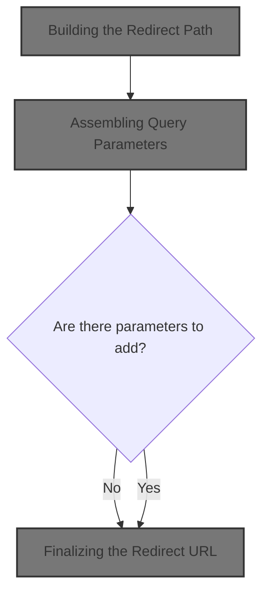
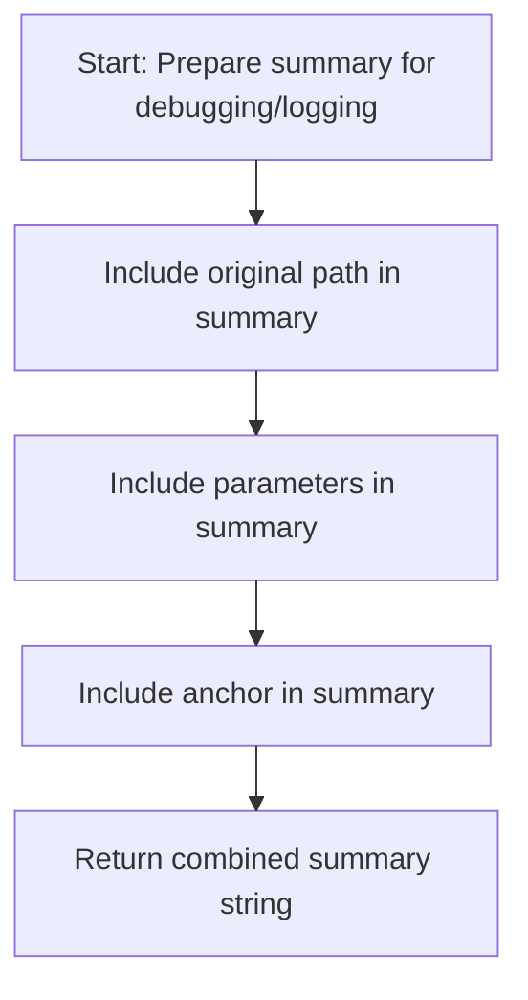
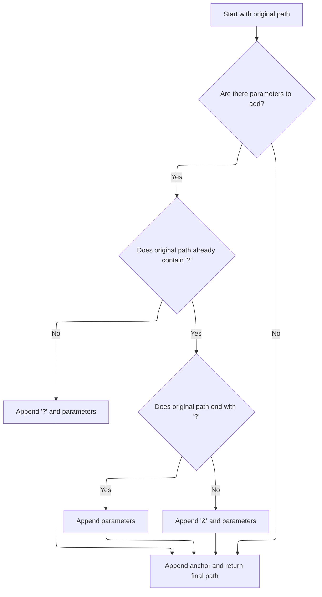

This document describes how a redirect URL is constructed by combining a base path, query parameters, and an optional anchor. The flow handles formatting details for parameters and supports both single and multiple values, producing a URL suitable for redirects or debugging.



# Building the Redirect Path

<SwmSnippet path="/core/src/main/java/org/apache/struts/action/ActionRedirect.java" line="230">

---

In <SwmToken path="core/src/main/java/org/apache/struts/action/ActionRedirect.java" pos="230:5:5" line-data="    public String getPath() {">`getPath`</SwmToken>, we grab the base path for the redirect by calling <SwmToken path="core/src/main/java/org/apache/struts/action/ActionRedirect.java" pos="232:7:7" line-data="        String originalPath = getOriginalPath();">`getOriginalPath`</SwmToken>. This sets up the starting point for building the full redirect URL, before we add parameters or anchors.

```java
    public String getPath() {
        // get the original path and the parameter string that was formed
        String originalPath = getOriginalPath();
```

---

</SwmSnippet>

<SwmSnippet path="/core/src/main/java/org/apache/struts/action/ActionRedirect.java" line="220">

---

<SwmToken path="core/src/main/java/org/apache/struts/action/ActionRedirect.java" pos="220:5:5" line-data="    public String getOriginalPath() {">`getOriginalPath`</SwmToken> just fetches the base path from the superclass. This keeps the base path logic isolated, so <SwmToken path="core/src/main/java/org/apache/struts/action/ActionRedirect.java" pos="221:5:5" line-data="        return super.getPath();">`getPath`</SwmToken> can focus on assembling the full redirect URL.

```java
    public String getOriginalPath() {
        return super.getPath();
    }
```

---

</SwmSnippet>

<SwmSnippet path="/core/src/main/java/org/apache/struts/action/ActionRedirect.java" line="233">

---

Back in <SwmToken path="core/src/main/java/org/apache/struts/action/ActionRedirect.java" pos="221:5:5" line-data="        return super.getPath();">`getPath`</SwmToken>, after grabbing the original path, we call <SwmToken path="core/src/main/java/org/apache/struts/action/ActionRedirect.java" pos="233:7:7" line-data="        String parameterString = getParameterString();">`getParameterString`</SwmToken> to build the query parameters that will be appended to the redirect URL.

```java
        String parameterString = getParameterString();
```

---

</SwmSnippet>

## Assembling Query Parameters

```mermaid
%%{init: {"flowchart": {"defaultRenderer": "elk"}} }%%
flowchart TD
  node1["Start building URL parameter string"]
  click node1 openCode "core/src/main/java/org/apache/struts/action/ActionRedirect.java:295:296"
  node1 --> node2["For each parameter"]
  click node2 openCode "core/src/main/java/org/apache/struts/action/ActionRedirect.java:299:327"
  subgraph loop1["For each parameter"]
    node2 --> node3{"Does parameter have one or multiple
values?"}
    click node3 openCode "core/src/main/java/org/apache/struts/action/ActionRedirect.java:308:322"
    node3 -->|"One value"| node4["Append parameter and value to query
string"]
    click node4 openCode "core/src/main/java/org/apache/struts/action/ActionRedirect.java:310:310"
    node4 --> node6{"Are there more parameters?"}
    click node6 openCode "core/src/main/java/org/apache/struts/action/ActionRedirect.java:324:326"
    node6 -->|"Yes"| node2
    node6 -->|"No"| node7["Return complete URL parameter string"]
    click node7 openCode "core/src/main/java/org/apache/struts/action/ActionRedirect.java:329:330"
    node3 -->|"Multiple values"| node5["For each value, append parameter and
value to query string"]
    click node5 openCode "core/src/main/java/org/apache/struts/action/ActionRedirect.java:315:321"
    subgraph loop2["For each value of the parameter"]
      node5 --> node8["Append parameter and value to query
string"]
      click node8 openCode "core/src/main/java/org/apache/struts/action/ActionRedirect.java:316:316"
      node8 --> node9{"Are there more values?"}
      click node9 openCode "core/src/main/java/org/apache/struts/action/ActionRedirect.java:318:320"
      node9 -->|"Yes"| node5
      node9 -->|"No"| node6
    end
  end
classDef HeadingStyle fill:#777777,stroke:#333,stroke-width:2px;

%% Swimm:
%% %%{init: {"flowchart": {"defaultRenderer": "elk"}} }%%
%% flowchart TD
%%   node1["Start building URL parameter string"]
%%   click node1 openCode "<SwmPath>[core/…/action/ActionRedirect.java](core/src/main/java/org/apache/struts/action/ActionRedirect.java)</SwmPath>:295:296"
%%   node1 --> node2["For each parameter"]
%%   click node2 openCode "<SwmPath>[core/…/action/ActionRedirect.java](core/src/main/java/org/apache/struts/action/ActionRedirect.java)</SwmPath>:299:327"
%%   subgraph loop1["For each parameter"]
%%     node2 --> node3{"Does parameter have one or multiple
%% values?"}
%%     click node3 openCode "<SwmPath>[core/…/action/ActionRedirect.java](core/src/main/java/org/apache/struts/action/ActionRedirect.java)</SwmPath>:308:322"
%%     node3 -->|"One value"| node4["Append parameter and value to query
%% string"]
%%     click node4 openCode "<SwmPath>[core/…/action/ActionRedirect.java](core/src/main/java/org/apache/struts/action/ActionRedirect.java)</SwmPath>:310:310"
%%     node4 --> node6{"Are there more parameters?"}
%%     click node6 openCode "<SwmPath>[core/…/action/ActionRedirect.java](core/src/main/java/org/apache/struts/action/ActionRedirect.java)</SwmPath>:324:326"
%%     node6 -->|"Yes"| node2
%%     node6 -->|"No"| node7["Return complete URL parameter string"]
%%     click node7 openCode "<SwmPath>[core/…/action/ActionRedirect.java](core/src/main/java/org/apache/struts/action/ActionRedirect.java)</SwmPath>:329:330"
%%     node3 -->|"Multiple values"| node5["For each value, append parameter and
%% value to query string"]
%%     click node5 openCode "<SwmPath>[core/…/action/ActionRedirect.java](core/src/main/java/org/apache/struts/action/ActionRedirect.java)</SwmPath>:315:321"
%%     subgraph loop2["For each value of the parameter"]
%%       node5 --> node8["Append parameter and value to query
%% string"]
%%       click node8 openCode "<SwmPath>[core/…/action/ActionRedirect.java](core/src/main/java/org/apache/struts/action/ActionRedirect.java)</SwmPath>:316:316"
%%       node8 --> node9{"Are there more values?"}
%%       click node9 openCode "<SwmPath>[core/…/action/ActionRedirect.java](core/src/main/java/org/apache/struts/action/ActionRedirect.java)</SwmPath>:318:320"
%%       node9 -->|"Yes"| node5
%%       node9 -->|"No"| node6
%%     end
%%   end
%% classDef HeadingStyle fill:#777777,stroke:#333,stroke-width:2px;
```



<SwmSnippet path="/core/src/main/java/org/apache/struts/action/ActionRedirect.java" line="295">

---

In <SwmToken path="core/src/main/java/org/apache/struts/action/ActionRedirect.java" pos="295:5:5" line-data="    public String getParameterString() {">`getParameterString`</SwmToken>, we loop through <SwmToken path="core/src/main/java/org/apache/struts/action/ActionRedirect.java" pos="299:7:7" line-data="        Iterator iterator = parameterValues.keySet().iterator();">`parameterValues`</SwmToken>, handling both single values and arrays, to build a properly formatted query string for the redirect URL.

```java
    public String getParameterString() {
        StringBuffer strParam = new StringBuffer(DEFAULT_BUFFER_SIZE);

        // loop through all parameters
        Iterator iterator = parameterValues.keySet().iterator();

        while (iterator.hasNext()) {
            // get the parameter name
            String paramName = (String) iterator.next();

            // get the value for this parameter
            Object value = parameterValues.get(paramName);

            if (value instanceof String) {
                // just one value for this param
                strParam.append(paramName).append("=").append(value);
            } else if (value instanceof String[]) {
                // loop through all values for this param
                String[] values = (String[]) value;

                for (int i = 0; i < values.length; i++) {
                    strParam.append(paramName).append("=").append(values[i]);

                    if (i < (values.length - 1)) {
                        strParam.append("&");
                    }
                }
            }

            if (iterator.hasNext()) {
                strParam.append("&");
            }
        }
```

---

</SwmSnippet>

<SwmSnippet path="/core/src/main/java/org/apache/struts/action/ActionRedirect.java" line="329">

---

Finally, <SwmToken path="core/src/main/java/org/apache/struts/action/ActionRedirect.java" pos="233:7:7" line-data="        String parameterString = getParameterString();">`getParameterString`</SwmToken> returns the assembled query string, which is used both in building the redirect URL and in the object's string output via <SwmToken path="core/src/main/java/org/apache/struts/action/ActionRedirect.java" pos="329:5:5" line-data="        return strParam.toString();">`toString`</SwmToken>.

```java
        return strParam.toString();
    }
```

---

</SwmSnippet>

## Generating Redirect Debug Output



<SwmSnippet path="/core/src/main/java/org/apache/struts/action/ActionRedirect.java" line="340">

---

In <SwmToken path="core/src/main/java/org/apache/struts/action/ActionRedirect.java" pos="340:5:5" line-data="    public String toString() {">`toString`</SwmToken>, we start building a debug string for the redirect, including the original path by calling <SwmToken path="core/src/main/java/org/apache/struts/action/ActionRedirect.java" pos="344:13:13" line-data="        result.append(&quot;originalPath=&quot;).append(getOriginalPath()).append(&quot;;&quot;);">`getOriginalPath`</SwmToken> to show the base URL.

```java
    public String toString() {
        StringBuffer result = new StringBuffer(DEFAULT_BUFFER_SIZE);

        result.append("ActionRedirect [");
        result.append("originalPath=").append(getOriginalPath()).append(";");
```

---

</SwmSnippet>

<SwmSnippet path="/core/src/main/java/org/apache/struts/action/ActionRedirect.java" line="345">

---

Back in <SwmToken path="core/src/main/java/org/apache/struts/action/ActionRedirect.java" pos="269:5:5" line-data="        return result.toString();">`toString`</SwmToken>, after getting the original path, we append the parameter string to the debug output so you can see what parameters are included in the redirect.

```java
        result.append("parameterString=").append(getParameterString()).append("]");
```

---

</SwmSnippet>

<SwmSnippet path="/core/src/main/java/org/apache/struts/action/ActionRedirect.java" line="346">

---

Back in <SwmToken path="core/src/main/java/org/apache/struts/action/ActionRedirect.java" pos="348:5:5" line-data="        return result.toString();">`toString`</SwmToken>, after adding the parameter string, we append the anchor string to show the full redirect target, including any fragment identifier.

```java
        result.append("anchorString=").append(getAnchorString()).append("]");

        return result.toString();
    }
```

---

</SwmSnippet>

## Finalizing the Redirect URL



<SwmSnippet path="/core/src/main/java/org/apache/struts/action/ActionRedirect.java" line="234">

---

Back in <SwmToken path="core/src/main/java/org/apache/struts/action/ActionRedirect.java" pos="221:5:5" line-data="        return super.getPath();">`getPath`</SwmToken>, after building the parameter string, we append it and the anchor to the base path, handling existing query strings so everything is formatted right. The result is ready for use or debugging via <SwmToken path="core/src/main/java/org/apache/struts/action/ActionRedirect.java" pos="269:5:5" line-data="        return result.toString();">`toString`</SwmToken>.

```java
        String anchorString = getAnchorString();

        StringBuffer result = new StringBuffer(originalPath);

        if ((parameterString != null) && (parameterString.length() > 0)) {
            // the parameter separator we're going to use
            String paramSeparator = "?";

            // true if we need to use a parameter separator after originalPath
            boolean needsParamSeparator = true;

            // does the original path already have a "?"?
            int paramStartIndex = originalPath.indexOf("?");

            if (paramStartIndex > 0) {
                // did the path end with "?"?
                needsParamSeparator = (paramStartIndex != (originalPath.length()
                    - 1));

                if (needsParamSeparator) {
                    paramSeparator = "&";
                }
            }

            if (needsParamSeparator) {
                result.append(paramSeparator);
            }

            result.append(parameterString);
        }

        // append anchor string (or blank if none was set)
        result.append(anchorString);


        return result.toString();
    }
```

---

</SwmSnippet>

&nbsp;

*This is an auto-generated document by Swimm 🌊 and has not yet been verified by a human*

<SwmMeta version="3.0.0" repo-id="Z2l0aHViJTNBJTNBc3RydXRzMSUzQSUzQVN3aW1tLURlbW8=" repo-name="struts1"><sup>Powered by [Swimm](https://app.swimm.io/)</sup></SwmMeta>
