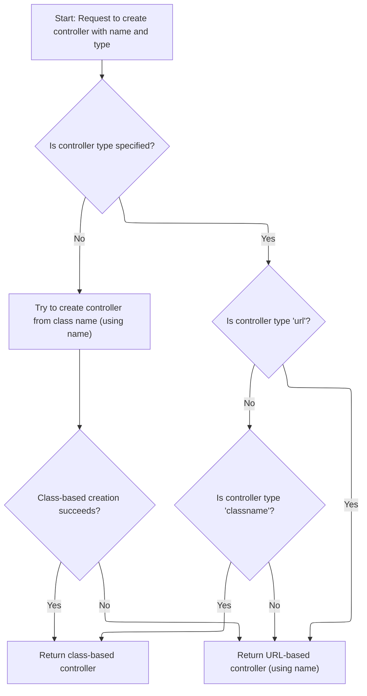
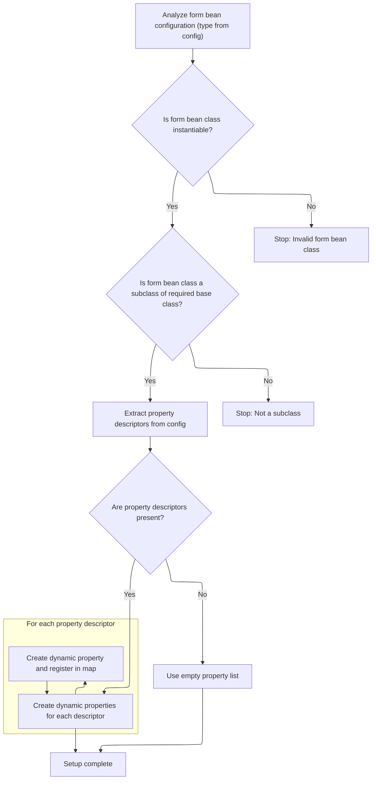
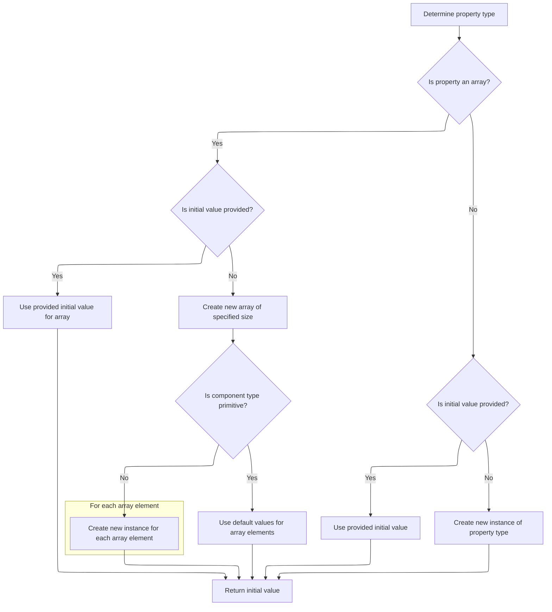

This document outlines how controllers or dynamic form beans are created and initialized based on configuration. The system decides between class-based, URL-based, or dynamic form bean instantiation, ensuring the resulting component is ready for use.

# Where is this flow used?

This flow is used multiple times in the codebase as represented in the following diagram:

(Note - these are only some of the entry points of this flow)

```mermaid
graph TD;
      d6dcb9d9f2cb580d0dc489500d4a18bfcf11466f6d539327b122df4a143b876b(tiles/…/taglib/InsertTag.java::InsertTag.doStartTag) --> 8bbc922afcbe42da81f466fb99815a98fff97a94d962af9b1ab91b484036e23e(tiles/…/taglib/InsertTag.java::InsertTag.createTagHandler)

8bbc922afcbe42da81f466fb99815a98fff97a94d962af9b1ab91b484036e23e(tiles/…/taglib/InsertTag.java::InsertTag.createTagHandler) --> ffff0a0607f40ddf1307cf4f70f044878f3a0eba08c38e84ca7df71f06f6aa1b(tiles/…/taglib/InsertTag.java::InsertTag.processName)

8bbc922afcbe42da81f466fb99815a98fff97a94d962af9b1ab91b484036e23e(tiles/…/taglib/InsertTag.java::InsertTag.createTagHandler) --> 7437b527edd6146d3b255dfc823bbb22c73e7ea43be502f8639c6fadacaee208(tiles/…/taglib/InsertTag.java::InsertTag.processBean)

8bbc922afcbe42da81f466fb99815a98fff97a94d962af9b1ab91b484036e23e(tiles/…/taglib/InsertTag.java::InsertTag.createTagHandler) --> cdc77618829cc61cf4fe5ac608ffe27065a800b7369a7ef4727c031906a6fb51(tiles/…/taglib/InsertTag.java::InsertTag.processAttribute)

8bbc922afcbe42da81f466fb99815a98fff97a94d962af9b1ab91b484036e23e(tiles/…/taglib/InsertTag.java::InsertTag.createTagHandler) --> ae183d2d50d30d67d89a4314067ba3f8cf7575e81f1e58d78b23ec9489a0cab6(tiles/…/taglib/InsertTag.java::InsertTag.processDefinitionName)

8bbc922afcbe42da81f466fb99815a98fff97a94d962af9b1ab91b484036e23e(tiles/…/taglib/InsertTag.java::InsertTag.createTagHandler) --> ba22d7932daf60eeaefb4f90e441f14ee62ee545253ebd436c7f966cf57578d8(tiles/…/taglib/InsertTag.java::InsertTag.processUrl)

ffff0a0607f40ddf1307cf4f70f044878f3a0eba08c38e84ca7df71f06f6aa1b(tiles/…/taglib/InsertTag.java::InsertTag.processName) --> 6a79fb0fe653d3e05015e9c607aa72e675b67cae0d438d7a39ad681c07965acb(tiles/…/taglib/InsertTag.java::InsertTag.processObjectValue)

ffff0a0607f40ddf1307cf4f70f044878f3a0eba08c38e84ca7df71f06f6aa1b(tiles/…/taglib/InsertTag.java::InsertTag.processName) --> 85fc76e671c8b194306022e9ad327cddda5a5e8b3dc5dcc048a7346561fefe35(tiles/…/taglib/InsertTag.java::InsertTag.processAsDefinitionOrURL)

6a79fb0fe653d3e05015e9c607aa72e675b67cae0d438d7a39ad681c07965acb(tiles/…/taglib/InsertTag.java::InsertTag.processObjectValue) --> 9ef17570804de900ef07367b67d76ca28a8e8a3145f462f1e7c32e4cd0826ef0(tiles/…/taglib/InsertTag.java::InsertTag.processDefinition)

6a79fb0fe653d3e05015e9c607aa72e675b67cae0d438d7a39ad681c07965acb(tiles/…/taglib/InsertTag.java::InsertTag.processObjectValue) --> a1b34b2cb217001aed79289ef78ee3ca9c70f2ad3a859f337f0c4d063cc3ff97(tiles/…/taglib/InsertTag.java::InsertTag.processTypedAttribute)

6a79fb0fe653d3e05015e9c607aa72e675b67cae0d438d7a39ad681c07965acb(tiles/…/taglib/InsertTag.java::InsertTag.processObjectValue) --> 85fc76e671c8b194306022e9ad327cddda5a5e8b3dc5dcc048a7346561fefe35(tiles/…/taglib/InsertTag.java::InsertTag.processAsDefinitionOrURL)

9ef17570804de900ef07367b67d76ca28a8e8a3145f462f1e7c32e4cd0826ef0(tiles/…/taglib/InsertTag.java::InsertTag.processDefinition) --> a77f515cc1642882236dcd1cb5c8bd877519ce7eae0fe8b15c0dd64abd7a861d(tiles/…/tiles/ComponentDefinition.java::ComponentDefinition.getOrCreateController)

9ef17570804de900ef07367b67d76ca28a8e8a3145f462f1e7c32e4cd0826ef0(tiles/…/taglib/InsertTag.java::InsertTag.processDefinition) --> 9c85167d85e432f4ca0a436fa343d4c2b4d23c50c3e0b816e570b7780dfe1275(tiles/…/tiles/ComponentDefinition.java::ComponentDefinition.createController)

a77f515cc1642882236dcd1cb5c8bd877519ce7eae0fe8b15c0dd64abd7a861d(tiles/…/tiles/ComponentDefinition.java::ComponentDefinition.getOrCreateController) --> 9c85167d85e432f4ca0a436fa343d4c2b4d23c50c3e0b816e570b7780dfe1275(tiles/…/tiles/ComponentDefinition.java::ComponentDefinition.createController)

a1b34b2cb217001aed79289ef78ee3ca9c70f2ad3a859f337f0c4d063cc3ff97(tiles/…/taglib/InsertTag.java::InsertTag.processTypedAttribute) --> ae183d2d50d30d67d89a4314067ba3f8cf7575e81f1e58d78b23ec9489a0cab6(tiles/…/taglib/InsertTag.java::InsertTag.processDefinitionName)

a1b34b2cb217001aed79289ef78ee3ca9c70f2ad3a859f337f0c4d063cc3ff97(tiles/…/taglib/InsertTag.java::InsertTag.processTypedAttribute) --> 9ef17570804de900ef07367b67d76ca28a8e8a3145f462f1e7c32e4cd0826ef0(tiles/…/taglib/InsertTag.java::InsertTag.processDefinition)

a1b34b2cb217001aed79289ef78ee3ca9c70f2ad3a859f337f0c4d063cc3ff97(tiles/…/taglib/InsertTag.java::InsertTag.processTypedAttribute) --> 6e51c7429ce149f6960ebf25a760fd8a50963d32e24a6119c8c102710d4ed46a(tiles/…/taglib/InsertTag.java::InsertTag.getController)

ae183d2d50d30d67d89a4314067ba3f8cf7575e81f1e58d78b23ec9489a0cab6(tiles/…/taglib/InsertTag.java::InsertTag.processDefinitionName) --> 9ef17570804de900ef07367b67d76ca28a8e8a3145f462f1e7c32e4cd0826ef0(tiles/…/taglib/InsertTag.java::InsertTag.processDefinition)

6e51c7429ce149f6960ebf25a760fd8a50963d32e24a6119c8c102710d4ed46a(tiles/…/taglib/InsertTag.java::InsertTag.getController) --> 9c85167d85e432f4ca0a436fa343d4c2b4d23c50c3e0b816e570b7780dfe1275(tiles/…/tiles/ComponentDefinition.java::ComponentDefinition.createController)

85fc76e671c8b194306022e9ad327cddda5a5e8b3dc5dcc048a7346561fefe35(tiles/…/taglib/InsertTag.java::InsertTag.processAsDefinitionOrURL) --> 9ef17570804de900ef07367b67d76ca28a8e8a3145f462f1e7c32e4cd0826ef0(tiles/…/taglib/InsertTag.java::InsertTag.processDefinition)

85fc76e671c8b194306022e9ad327cddda5a5e8b3dc5dcc048a7346561fefe35(tiles/…/taglib/InsertTag.java::InsertTag.processAsDefinitionOrURL) --> ba22d7932daf60eeaefb4f90e441f14ee62ee545253ebd436c7f966cf57578d8(tiles/…/taglib/InsertTag.java::InsertTag.processUrl)

ba22d7932daf60eeaefb4f90e441f14ee62ee545253ebd436c7f966cf57578d8(tiles/…/taglib/InsertTag.java::InsertTag.processUrl) --> 6e51c7429ce149f6960ebf25a760fd8a50963d32e24a6119c8c102710d4ed46a(tiles/…/taglib/InsertTag.java::InsertTag.getController)

7437b527edd6146d3b255dfc823bbb22c73e7ea43be502f8639c6fadacaee208(tiles/…/taglib/InsertTag.java::InsertTag.processBean) --> 6a79fb0fe653d3e05015e9c607aa72e675b67cae0d438d7a39ad681c07965acb(tiles/…/taglib/InsertTag.java::InsertTag.processObjectValue)

cdc77618829cc61cf4fe5ac608ffe27065a800b7369a7ef4727c031906a6fb51(tiles/…/taglib/InsertTag.java::InsertTag.processAttribute) --> 6a79fb0fe653d3e05015e9c607aa72e675b67cae0d438d7a39ad681c07965acb(tiles/…/taglib/InsertTag.java::InsertTag.processObjectValue)

f41336748c7d2964d11b81a9ae6e9df7063b7b69caa2d3e3f156384195800418(tiles/…/commands/TilesPreProcessor.java::TilesPreProcessor.execute) --> a77f515cc1642882236dcd1cb5c8bd877519ce7eae0fe8b15c0dd64abd7a861d(tiles/…/tiles/ComponentDefinition.java::ComponentDefinition.getOrCreateController)

a22fe784c1b4058cbeb1bcd2b0bef3a69206b3cab2bb9ebe027294ba13657bf9(tiles/…/xmlDefinition/I18nFactorySet.java::I18nFactorySet.createFactory) --> 5d6f11334d5437fed2f208b8e7c684d1269ded31737324d71a90d44a0d4915b8(tiles/…/xmlDefinition/XmlDefinitionsSet.java::XmlDefinitionsSet.extend)

5d6f11334d5437fed2f208b8e7c684d1269ded31737324d71a90d44a0d4915b8(tiles/…/xmlDefinition/XmlDefinitionsSet.java::XmlDefinitionsSet.extend) --> 9504d53b863b2c32b0b97f5a557d18c7930337598a5c7b5514d0fe9d873bc3db(tiles/…/xmlDefinition/XmlDefinition.java::XmlDefinition.overload)

9504d53b863b2c32b0b97f5a557d18c7930337598a5c7b5514d0fe9d873bc3db(tiles/…/xmlDefinition/XmlDefinition.java::XmlDefinition.overload) --> 6e51c7429ce149f6960ebf25a760fd8a50963d32e24a6119c8c102710d4ed46a(tiles/…/taglib/InsertTag.java::InsertTag.getController)

aae3a15db7d4f0622041e8bd370edfb45fb3c73534bf177c7d86263eea1b3771(tiles/…/tiles/TilesRequestProcessor.java::TilesRequestProcessor.processForwardConfig) --> 5e4d8b9be11f0982d8bc540fbb686f1db6129563a9154020d727982e32572261(tiles/…/tiles/TilesRequestProcessor.java::TilesRequestProcessor.processTilesDefinition)

5e4d8b9be11f0982d8bc540fbb686f1db6129563a9154020d727982e32572261(tiles/…/tiles/TilesRequestProcessor.java::TilesRequestProcessor.processTilesDefinition) --> a77f515cc1642882236dcd1cb5c8bd877519ce7eae0fe8b15c0dd64abd7a861d(tiles/…/tiles/ComponentDefinition.java::ComponentDefinition.getOrCreateController)

c7ab44356ea54a6a46a0c087c12921f700ed2724242fce63a68981875e459857(tiles/…/tiles/TilesRequestProcessor.java::TilesRequestProcessor.internalModuleRelativeForward) --> 5e4d8b9be11f0982d8bc540fbb686f1db6129563a9154020d727982e32572261(tiles/…/tiles/TilesRequestProcessor.java::TilesRequestProcessor.processTilesDefinition)


classDef mainFlowStyle color:#000000,fill:#7CB9F4
classDef rootsStyle color:#000000,fill:#00FFF4
classDef Style1 color:#000000,fill:#00FFAA
classDef Style2 color:#000000,fill:#FFFF00
classDef Style3 color:#000000,fill:#AA7CB9

%% Swimm:
%% graph TD;
%%       d6dcb9d9f2cb580d0dc489500d4a18bfcf11466f6d539327b122df4a143b876b(<SwmPath>[tiles/…/taglib/InsertTag.java](tiles/src/main/java/org/apache/struts/tiles/taglib/InsertTag.java)</SwmPath>::InsertTag.doStartTag) --> 8bbc922afcbe42da81f466fb99815a98fff97a94d962af9b1ab91b484036e23e(<SwmPath>[tiles/…/taglib/InsertTag.java](tiles/src/main/java/org/apache/struts/tiles/taglib/InsertTag.java)</SwmPath>::InsertTag.createTagHandler)
%% 
%% 8bbc922afcbe42da81f466fb99815a98fff97a94d962af9b1ab91b484036e23e(<SwmPath>[tiles/…/taglib/InsertTag.java](tiles/src/main/java/org/apache/struts/tiles/taglib/InsertTag.java)</SwmPath>::InsertTag.createTagHandler) --> ffff0a0607f40ddf1307cf4f70f044878f3a0eba08c38e84ca7df71f06f6aa1b(<SwmPath>[tiles/…/taglib/InsertTag.java](tiles/src/main/java/org/apache/struts/tiles/taglib/InsertTag.java)</SwmPath>::InsertTag.processName)
%% 
%% 8bbc922afcbe42da81f466fb99815a98fff97a94d962af9b1ab91b484036e23e(<SwmPath>[tiles/…/taglib/InsertTag.java](tiles/src/main/java/org/apache/struts/tiles/taglib/InsertTag.java)</SwmPath>::InsertTag.createTagHandler) --> 7437b527edd6146d3b255dfc823bbb22c73e7ea43be502f8639c6fadacaee208(<SwmPath>[tiles/…/taglib/InsertTag.java](tiles/src/main/java/org/apache/struts/tiles/taglib/InsertTag.java)</SwmPath>::InsertTag.processBean)
%% 
%% 8bbc922afcbe42da81f466fb99815a98fff97a94d962af9b1ab91b484036e23e(<SwmPath>[tiles/…/taglib/InsertTag.java](tiles/src/main/java/org/apache/struts/tiles/taglib/InsertTag.java)</SwmPath>::InsertTag.createTagHandler) --> cdc77618829cc61cf4fe5ac608ffe27065a800b7369a7ef4727c031906a6fb51(<SwmPath>[tiles/…/taglib/InsertTag.java](tiles/src/main/java/org/apache/struts/tiles/taglib/InsertTag.java)</SwmPath>::InsertTag.processAttribute)
%% 
%% 8bbc922afcbe42da81f466fb99815a98fff97a94d962af9b1ab91b484036e23e(<SwmPath>[tiles/…/taglib/InsertTag.java](tiles/src/main/java/org/apache/struts/tiles/taglib/InsertTag.java)</SwmPath>::InsertTag.createTagHandler) --> ae183d2d50d30d67d89a4314067ba3f8cf7575e81f1e58d78b23ec9489a0cab6(<SwmPath>[tiles/…/taglib/InsertTag.java](tiles/src/main/java/org/apache/struts/tiles/taglib/InsertTag.java)</SwmPath>::InsertTag.processDefinitionName)
%% 
%% 8bbc922afcbe42da81f466fb99815a98fff97a94d962af9b1ab91b484036e23e(<SwmPath>[tiles/…/taglib/InsertTag.java](tiles/src/main/java/org/apache/struts/tiles/taglib/InsertTag.java)</SwmPath>::InsertTag.createTagHandler) --> ba22d7932daf60eeaefb4f90e441f14ee62ee545253ebd436c7f966cf57578d8(<SwmPath>[tiles/…/taglib/InsertTag.java](tiles/src/main/java/org/apache/struts/tiles/taglib/InsertTag.java)</SwmPath>::InsertTag.processUrl)
%% 
%% ffff0a0607f40ddf1307cf4f70f044878f3a0eba08c38e84ca7df71f06f6aa1b(<SwmPath>[tiles/…/taglib/InsertTag.java](tiles/src/main/java/org/apache/struts/tiles/taglib/InsertTag.java)</SwmPath>::InsertTag.processName) --> 6a79fb0fe653d3e05015e9c607aa72e675b67cae0d438d7a39ad681c07965acb(<SwmPath>[tiles/…/taglib/InsertTag.java](tiles/src/main/java/org/apache/struts/tiles/taglib/InsertTag.java)</SwmPath>::InsertTag.processObjectValue)
%% 
%% ffff0a0607f40ddf1307cf4f70f044878f3a0eba08c38e84ca7df71f06f6aa1b(<SwmPath>[tiles/…/taglib/InsertTag.java](tiles/src/main/java/org/apache/struts/tiles/taglib/InsertTag.java)</SwmPath>::InsertTag.processName) --> 85fc76e671c8b194306022e9ad327cddda5a5e8b3dc5dcc048a7346561fefe35(<SwmPath>[tiles/…/taglib/InsertTag.java](tiles/src/main/java/org/apache/struts/tiles/taglib/InsertTag.java)</SwmPath>::InsertTag.processAsDefinitionOrURL)
%% 
%% 6a79fb0fe653d3e05015e9c607aa72e675b67cae0d438d7a39ad681c07965acb(<SwmPath>[tiles/…/taglib/InsertTag.java](tiles/src/main/java/org/apache/struts/tiles/taglib/InsertTag.java)</SwmPath>::InsertTag.processObjectValue) --> 9ef17570804de900ef07367b67d76ca28a8e8a3145f462f1e7c32e4cd0826ef0(<SwmPath>[tiles/…/taglib/InsertTag.java](tiles/src/main/java/org/apache/struts/tiles/taglib/InsertTag.java)</SwmPath>::InsertTag.processDefinition)
%% 
%% 6a79fb0fe653d3e05015e9c607aa72e675b67cae0d438d7a39ad681c07965acb(<SwmPath>[tiles/…/taglib/InsertTag.java](tiles/src/main/java/org/apache/struts/tiles/taglib/InsertTag.java)</SwmPath>::InsertTag.processObjectValue) --> a1b34b2cb217001aed79289ef78ee3ca9c70f2ad3a859f337f0c4d063cc3ff97(<SwmPath>[tiles/…/taglib/InsertTag.java](tiles/src/main/java/org/apache/struts/tiles/taglib/InsertTag.java)</SwmPath>::InsertTag.processTypedAttribute)
%% 
%% 6a79fb0fe653d3e05015e9c607aa72e675b67cae0d438d7a39ad681c07965acb(<SwmPath>[tiles/…/taglib/InsertTag.java](tiles/src/main/java/org/apache/struts/tiles/taglib/InsertTag.java)</SwmPath>::InsertTag.processObjectValue) --> 85fc76e671c8b194306022e9ad327cddda5a5e8b3dc5dcc048a7346561fefe35(<SwmPath>[tiles/…/taglib/InsertTag.java](tiles/src/main/java/org/apache/struts/tiles/taglib/InsertTag.java)</SwmPath>::InsertTag.processAsDefinitionOrURL)
%% 
%% 9ef17570804de900ef07367b67d76ca28a8e8a3145f462f1e7c32e4cd0826ef0(<SwmPath>[tiles/…/taglib/InsertTag.java](tiles/src/main/java/org/apache/struts/tiles/taglib/InsertTag.java)</SwmPath>::InsertTag.processDefinition) --> a77f515cc1642882236dcd1cb5c8bd877519ce7eae0fe8b15c0dd64abd7a861d(<SwmPath>[tiles/…/tiles/ComponentDefinition.java](tiles/src/main/java/org/apache/struts/tiles/ComponentDefinition.java)</SwmPath>::ComponentDefinition.getOrCreateController)
%% 
%% 9ef17570804de900ef07367b67d76ca28a8e8a3145f462f1e7c32e4cd0826ef0(<SwmPath>[tiles/…/taglib/InsertTag.java](tiles/src/main/java/org/apache/struts/tiles/taglib/InsertTag.java)</SwmPath>::InsertTag.processDefinition) --> 9c85167d85e432f4ca0a436fa343d4c2b4d23c50c3e0b816e570b7780dfe1275(<SwmPath>[tiles/…/tiles/ComponentDefinition.java](tiles/src/main/java/org/apache/struts/tiles/ComponentDefinition.java)</SwmPath>::ComponentDefinition.createController)
%% 
%% a77f515cc1642882236dcd1cb5c8bd877519ce7eae0fe8b15c0dd64abd7a861d(<SwmPath>[tiles/…/tiles/ComponentDefinition.java](tiles/src/main/java/org/apache/struts/tiles/ComponentDefinition.java)</SwmPath>::ComponentDefinition.getOrCreateController) --> 9c85167d85e432f4ca0a436fa343d4c2b4d23c50c3e0b816e570b7780dfe1275(<SwmPath>[tiles/…/tiles/ComponentDefinition.java](tiles/src/main/java/org/apache/struts/tiles/ComponentDefinition.java)</SwmPath>::ComponentDefinition.createController)
%% 
%% a1b34b2cb217001aed79289ef78ee3ca9c70f2ad3a859f337f0c4d063cc3ff97(<SwmPath>[tiles/…/taglib/InsertTag.java](tiles/src/main/java/org/apache/struts/tiles/taglib/InsertTag.java)</SwmPath>::InsertTag.processTypedAttribute) --> ae183d2d50d30d67d89a4314067ba3f8cf7575e81f1e58d78b23ec9489a0cab6(<SwmPath>[tiles/…/taglib/InsertTag.java](tiles/src/main/java/org/apache/struts/tiles/taglib/InsertTag.java)</SwmPath>::InsertTag.processDefinitionName)
%% 
%% a1b34b2cb217001aed79289ef78ee3ca9c70f2ad3a859f337f0c4d063cc3ff97(<SwmPath>[tiles/…/taglib/InsertTag.java](tiles/src/main/java/org/apache/struts/tiles/taglib/InsertTag.java)</SwmPath>::InsertTag.processTypedAttribute) --> 9ef17570804de900ef07367b67d76ca28a8e8a3145f462f1e7c32e4cd0826ef0(<SwmPath>[tiles/…/taglib/InsertTag.java](tiles/src/main/java/org/apache/struts/tiles/taglib/InsertTag.java)</SwmPath>::InsertTag.processDefinition)
%% 
%% a1b34b2cb217001aed79289ef78ee3ca9c70f2ad3a859f337f0c4d063cc3ff97(<SwmPath>[tiles/…/taglib/InsertTag.java](tiles/src/main/java/org/apache/struts/tiles/taglib/InsertTag.java)</SwmPath>::InsertTag.processTypedAttribute) --> 6e51c7429ce149f6960ebf25a760fd8a50963d32e24a6119c8c102710d4ed46a(<SwmPath>[tiles/…/taglib/InsertTag.java](tiles/src/main/java/org/apache/struts/tiles/taglib/InsertTag.java)</SwmPath>::InsertTag.getController)
%% 
%% ae183d2d50d30d67d89a4314067ba3f8cf7575e81f1e58d78b23ec9489a0cab6(<SwmPath>[tiles/…/taglib/InsertTag.java](tiles/src/main/java/org/apache/struts/tiles/taglib/InsertTag.java)</SwmPath>::InsertTag.processDefinitionName) --> 9ef17570804de900ef07367b67d76ca28a8e8a3145f462f1e7c32e4cd0826ef0(<SwmPath>[tiles/…/taglib/InsertTag.java](tiles/src/main/java/org/apache/struts/tiles/taglib/InsertTag.java)</SwmPath>::InsertTag.processDefinition)
%% 
%% 6e51c7429ce149f6960ebf25a760fd8a50963d32e24a6119c8c102710d4ed46a(<SwmPath>[tiles/…/taglib/InsertTag.java](tiles/src/main/java/org/apache/struts/tiles/taglib/InsertTag.java)</SwmPath>::InsertTag.getController) --> 9c85167d85e432f4ca0a436fa343d4c2b4d23c50c3e0b816e570b7780dfe1275(<SwmPath>[tiles/…/tiles/ComponentDefinition.java](tiles/src/main/java/org/apache/struts/tiles/ComponentDefinition.java)</SwmPath>::ComponentDefinition.createController)
%% 
%% 85fc76e671c8b194306022e9ad327cddda5a5e8b3dc5dcc048a7346561fefe35(<SwmPath>[tiles/…/taglib/InsertTag.java](tiles/src/main/java/org/apache/struts/tiles/taglib/InsertTag.java)</SwmPath>::InsertTag.processAsDefinitionOrURL) --> 9ef17570804de900ef07367b67d76ca28a8e8a3145f462f1e7c32e4cd0826ef0(<SwmPath>[tiles/…/taglib/InsertTag.java](tiles/src/main/java/org/apache/struts/tiles/taglib/InsertTag.java)</SwmPath>::InsertTag.processDefinition)
%% 
%% 85fc76e671c8b194306022e9ad327cddda5a5e8b3dc5dcc048a7346561fefe35(<SwmPath>[tiles/…/taglib/InsertTag.java](tiles/src/main/java/org/apache/struts/tiles/taglib/InsertTag.java)</SwmPath>::InsertTag.processAsDefinitionOrURL) --> ba22d7932daf60eeaefb4f90e441f14ee62ee545253ebd436c7f966cf57578d8(<SwmPath>[tiles/…/taglib/InsertTag.java](tiles/src/main/java/org/apache/struts/tiles/taglib/InsertTag.java)</SwmPath>::InsertTag.processUrl)
%% 
%% ba22d7932daf60eeaefb4f90e441f14ee62ee545253ebd436c7f966cf57578d8(<SwmPath>[tiles/…/taglib/InsertTag.java](tiles/src/main/java/org/apache/struts/tiles/taglib/InsertTag.java)</SwmPath>::InsertTag.processUrl) --> 6e51c7429ce149f6960ebf25a760fd8a50963d32e24a6119c8c102710d4ed46a(<SwmPath>[tiles/…/taglib/InsertTag.java](tiles/src/main/java/org/apache/struts/tiles/taglib/InsertTag.java)</SwmPath>::InsertTag.getController)
%% 
%% 7437b527edd6146d3b255dfc823bbb22c73e7ea43be502f8639c6fadacaee208(<SwmPath>[tiles/…/taglib/InsertTag.java](tiles/src/main/java/org/apache/struts/tiles/taglib/InsertTag.java)</SwmPath>::InsertTag.processBean) --> 6a79fb0fe653d3e05015e9c607aa72e675b67cae0d438d7a39ad681c07965acb(<SwmPath>[tiles/…/taglib/InsertTag.java](tiles/src/main/java/org/apache/struts/tiles/taglib/InsertTag.java)</SwmPath>::InsertTag.processObjectValue)
%% 
%% cdc77618829cc61cf4fe5ac608ffe27065a800b7369a7ef4727c031906a6fb51(<SwmPath>[tiles/…/taglib/InsertTag.java](tiles/src/main/java/org/apache/struts/tiles/taglib/InsertTag.java)</SwmPath>::InsertTag.processAttribute) --> 6a79fb0fe653d3e05015e9c607aa72e675b67cae0d438d7a39ad681c07965acb(<SwmPath>[tiles/…/taglib/InsertTag.java](tiles/src/main/java/org/apache/struts/tiles/taglib/InsertTag.java)</SwmPath>::InsertTag.processObjectValue)
%% 
%% f41336748c7d2964d11b81a9ae6e9df7063b7b69caa2d3e3f156384195800418(<SwmPath>[tiles/…/commands/TilesPreProcessor.java](tiles/src/main/java/org/apache/struts/tiles/commands/TilesPreProcessor.java)</SwmPath>::TilesPreProcessor.execute) --> a77f515cc1642882236dcd1cb5c8bd877519ce7eae0fe8b15c0dd64abd7a861d(<SwmPath>[tiles/…/tiles/ComponentDefinition.java](tiles/src/main/java/org/apache/struts/tiles/ComponentDefinition.java)</SwmPath>::ComponentDefinition.getOrCreateController)
%% 
%% a22fe784c1b4058cbeb1bcd2b0bef3a69206b3cab2bb9ebe027294ba13657bf9(<SwmPath>[tiles/…/xmlDefinition/I18nFactorySet.java](tiles/src/main/java/org/apache/struts/tiles/xmlDefinition/I18nFactorySet.java)</SwmPath>::I18nFactorySet.createFactory) --> 5d6f11334d5437fed2f208b8e7c684d1269ded31737324d71a90d44a0d4915b8(<SwmPath>[tiles/…/xmlDefinition/XmlDefinitionsSet.java](tiles/src/main/java/org/apache/struts/tiles/xmlDefinition/XmlDefinitionsSet.java)</SwmPath>::XmlDefinitionsSet.extend)
%% 
%% 5d6f11334d5437fed2f208b8e7c684d1269ded31737324d71a90d44a0d4915b8(<SwmPath>[tiles/…/xmlDefinition/XmlDefinitionsSet.java](tiles/src/main/java/org/apache/struts/tiles/xmlDefinition/XmlDefinitionsSet.java)</SwmPath>::XmlDefinitionsSet.extend) --> 9504d53b863b2c32b0b97f5a557d18c7930337598a5c7b5514d0fe9d873bc3db(<SwmPath>[tiles/…/xmlDefinition/XmlDefinition.java](tiles/src/main/java/org/apache/struts/tiles/xmlDefinition/XmlDefinition.java)</SwmPath>::XmlDefinition.overload)
%% 
%% 9504d53b863b2c32b0b97f5a557d18c7930337598a5c7b5514d0fe9d873bc3db(<SwmPath>[tiles/…/xmlDefinition/XmlDefinition.java](tiles/src/main/java/org/apache/struts/tiles/xmlDefinition/XmlDefinition.java)</SwmPath>::XmlDefinition.overload) --> 6e51c7429ce149f6960ebf25a760fd8a50963d32e24a6119c8c102710d4ed46a(<SwmPath>[tiles/…/taglib/InsertTag.java](tiles/src/main/java/org/apache/struts/tiles/taglib/InsertTag.java)</SwmPath>::InsertTag.getController)
%% 
%% aae3a15db7d4f0622041e8bd370edfb45fb3c73534bf177c7d86263eea1b3771(<SwmPath>[tiles/…/tiles/TilesRequestProcessor.java](tiles/src/main/java/org/apache/struts/tiles/TilesRequestProcessor.java)</SwmPath>::TilesRequestProcessor.processForwardConfig) --> 5e4d8b9be11f0982d8bc540fbb686f1db6129563a9154020d727982e32572261(<SwmPath>[tiles/…/tiles/TilesRequestProcessor.java](tiles/src/main/java/org/apache/struts/tiles/TilesRequestProcessor.java)</SwmPath>::TilesRequestProcessor.processTilesDefinition)
%% 
%% 5e4d8b9be11f0982d8bc540fbb686f1db6129563a9154020d727982e32572261(<SwmPath>[tiles/…/tiles/TilesRequestProcessor.java](tiles/src/main/java/org/apache/struts/tiles/TilesRequestProcessor.java)</SwmPath>::TilesRequestProcessor.processTilesDefinition) --> a77f515cc1642882236dcd1cb5c8bd877519ce7eae0fe8b15c0dd64abd7a861d(<SwmPath>[tiles/…/tiles/ComponentDefinition.java](tiles/src/main/java/org/apache/struts/tiles/ComponentDefinition.java)</SwmPath>::ComponentDefinition.getOrCreateController)
%% 
%% c7ab44356ea54a6a46a0c087c12921f700ed2724242fce63a68981875e459857(<SwmPath>[tiles/…/tiles/TilesRequestProcessor.java](tiles/src/main/java/org/apache/struts/tiles/TilesRequestProcessor.java)</SwmPath>::TilesRequestProcessor.internalModuleRelativeForward) --> 5e4d8b9be11f0982d8bc540fbb686f1db6129563a9154020d727982e32572261(<SwmPath>[tiles/…/tiles/TilesRequestProcessor.java](tiles/src/main/java/org/apache/struts/tiles/TilesRequestProcessor.java)</SwmPath>::TilesRequestProcessor.processTilesDefinition)
%% 
%% 
%% classDef mainFlowStyle color:#000000,fill:#7CB9F4
%% classDef rootsStyle color:#000000,fill:#00FFF4
%% classDef Style1 color:#000000,fill:#00FFAA
%% classDef Style2 color:#000000,fill:#FFFF00
%% classDef Style3 color:#000000,fill:#AA7CB9
```

# Choosing and Instantiating the Controller Implementation



<SwmSnippet path="/tiles/src/main/java/org/apache/struts/tiles/ComponentDefinition.java" line="481">

---

<SwmToken path="tiles/src/main/java/org/apache/struts/tiles/ComponentDefinition.java" pos="481:7:7" line-data="    public static Controller createController(String name, String controllerType)">`createController`</SwmToken> kicks off the controller creation logic. If <SwmToken path="tiles/src/main/java/org/apache/struts/tiles/ComponentDefinition.java" pos="481:16:16" line-data="    public static Controller createController(String name, String controllerType)">`controllerType`</SwmToken> is null, it first tries to treat 'name' as a class name and calls <SwmToken path="tiles/src/main/java/org/apache/struts/tiles/ComponentDefinition.java" pos="492:3:6" line-data="                return createControllerFromClassname(name);">`createControllerFromClassname(name)`</SwmToken>. If that fails, it falls back to making a <SwmToken path="tiles/src/main/java/org/apache/struts/tiles/ComponentDefinition.java" pos="495:7:7" line-data="                controller = new UrlController(name);">`UrlController`</SwmToken>. If <SwmToken path="tiles/src/main/java/org/apache/struts/tiles/ComponentDefinition.java" pos="481:16:16" line-data="    public static Controller createController(String name, String controllerType)">`controllerType`</SwmToken> is 'url' or 'classname', it handles those explicitly. This setup means the function is flexible about how controllers are specified, but only supports 'url' and 'classname' types (case-insensitive).

```java
    public static Controller createController(String name, String controllerType)
        throws InstantiationException {

        if (log.isDebugEnabled()) {
            log.debug("Create controller name=" + name + ", type=" + controllerType);
        }

        Controller controller = null;

        if (controllerType == null) { // first try as a classname
            try {
                return createControllerFromClassname(name);

            } catch (InstantiationException ex) { // ok, try something else
                controller = new UrlController(name);
            }

        } else if ("url".equalsIgnoreCase(controllerType)) {
            controller = new UrlController(name);

        } else if ("classname".equalsIgnoreCase(controllerType)) {
            controller = createControllerFromClassname(name);
        }

        return controller;
    }
```

---

</SwmSnippet>

# Loading the Controller Class Dynamically

<SwmSnippet path="/tiles/src/main/java/org/apache/struts/tiles/ComponentDefinition.java" line="516">

---

In <SwmToken path="tiles/src/main/java/org/apache/struts/tiles/ComponentDefinition.java" pos="516:7:7" line-data="    public static Controller createControllerFromClassname(String classname)">`createControllerFromClassname`</SwmToken>, we load the class by name and instantiate it. The next step (if the class is a <SwmToken path="core/src/main/java/org/apache/struts/action/DynaActionFormClass.java" pos="45:4:4" line-data="public class DynaActionFormClass implements DynaClass, Serializable {">`DynaActionFormClass`</SwmToken>) is to call its <SwmToken path="tiles/src/main/java/org/apache/struts/tiles/ComponentDefinition.java" pos="521:9:9" line-data="            Object instance = requestedClass.newInstance();">`newInstance`</SwmToken> method, which actually creates the form/controller instance. This is where the dynamic instantiation happens.

```java
    public static Controller createControllerFromClassname(String classname)
        throws InstantiationException {

        try {
            Class requestedClass = RequestUtils.applicationClass(classname);
            Object instance = requestedClass.newInstance();

            if (log.isDebugEnabled()) {
                log.debug("Controller created : " + instance);
            }
            return (Controller) instance;

```

---

</SwmSnippet>

## Instantiating the Dynamic Form Bean

<SwmSnippet path="/core/src/main/java/org/apache/struts/action/DynaActionFormClass.java" line="158">

---

In <SwmToken path="core/src/main/java/org/apache/struts/action/DynaActionFormClass.java" pos="158:5:5" line-data="    public DynaBean newInstance()">`newInstance`</SwmToken>, we create a new <SwmToken path="core/src/main/java/org/apache/struts/action/DynaActionFormClass.java" pos="160:1:1" line-data="        DynaActionForm dynaBean = (DynaActionForm) getBeanClass().newInstance();">`DynaActionForm`</SwmToken> by instantiating the class returned from <SwmToken path="core/src/main/java/org/apache/struts/action/DynaActionFormClass.java" pos="160:11:11" line-data="        DynaActionForm dynaBean = (DynaActionForm) getBeanClass().newInstance();">`getBeanClass`</SwmToken>. The next step is to actually resolve what that class is, which is why <SwmToken path="core/src/main/java/org/apache/struts/action/DynaActionFormClass.java" pos="160:11:11" line-data="        DynaActionForm dynaBean = (DynaActionForm) getBeanClass().newInstance();">`getBeanClass`</SwmToken> is called.

```java
    public DynaBean newInstance()
        throws IllegalAccessException, InstantiationException {
        DynaActionForm dynaBean = (DynaActionForm) getBeanClass().newInstance();

```

---

</SwmSnippet>

### Resolving the Bean Class for the Form

<SwmSnippet path="/core/src/main/java/org/apache/struts/action/DynaActionFormClass.java" line="227">

---

<SwmToken path="core/src/main/java/org/apache/struts/action/DynaActionFormClass.java" pos="227:5:5" line-data="    protected Class getBeanClass() {">`getBeanClass`</SwmToken> checks if we've already resolved the bean class; if not, it calls introspect to load and validate the class from config. This sets up everything needed for instantiating the form bean.

```java
    protected Class getBeanClass() {
        if (beanClass == null) {
            introspect(config);
        }

        return (beanClass);
    }
```

---

</SwmSnippet>

### Analyzing Form Bean Metadata and Property Types



<SwmSnippet path="/core/src/main/java/org/apache/struts/action/DynaActionFormClass.java" line="246">

---

<SwmToken path="core/src/main/java/org/apache/struts/action/DynaActionFormClass.java" pos="246:5:5" line-data="    protected void introspect(FormBeanConfig config) {">`introspect`</SwmToken> loads the bean class from config, checks it's a <SwmToken path="core/src/main/java/org/apache/struts/action/DynaActionFormClass.java" pos="260:5:5" line-data="        if (!DynaActionForm.class.isAssignableFrom(beanClass)) {">`DynaActionForm`</SwmToken> subclass, and builds up the dynamic property definitions from the <SwmToken path="core/src/main/java/org/apache/struts/action/DynaActionFormClass.java" pos="270:1:1" line-data="        FormPropertyConfig[] descriptors = config.findFormPropertyConfigs();">`FormPropertyConfig`</SwmToken> descriptors. For each property, it calls <SwmToken path="core/src/main/java/org/apache/struts/action/DynaActionFormClass.java" pos="282:6:6" line-data="                    descriptors[i].getTypeClass());">`getTypeClass`</SwmToken> to resolve the Java type, so we need to jump into <SwmToken path="core/src/main/java/org/apache/struts/action/DynaActionFormClass.java" pos="270:1:1" line-data="        FormPropertyConfig[] descriptors = config.findFormPropertyConfigs();">`FormPropertyConfig`</SwmToken> next.

```java
    protected void introspect(FormBeanConfig config) {
        this.config = config;

        // Validate the ActionFormBean implementation class
        try {
            beanClass = RequestUtils.applicationClass(config.getType());
        } catch (Throwable t) {
        	IllegalArgumentException t2 = new IllegalArgumentException(
                "Cannot instantiate ActionFormBean class '" + config.getType()
                + "'");
        	t2.initCause(t);
        	throw t2;
        }

        if (!DynaActionForm.class.isAssignableFrom(beanClass)) {
            throw new IllegalArgumentException("Class '" + config.getType()
                + "' is not a subclass of "
                + "'org.apache.struts.action.DynaActionForm'");
        }

        // Set the name we will know ourselves by from the form bean name
        this.name = config.getName();

        // Look up the property descriptors for this bean class
        FormPropertyConfig[] descriptors = config.findFormPropertyConfigs();

        if (descriptors == null) {
            descriptors = new FormPropertyConfig[0];
        }

        // Create corresponding dynamic property definitions
        properties = new DynaProperty[descriptors.length];

        for (int i = 0; i < descriptors.length; i++) {
            properties[i] =
                new DynaProperty(descriptors[i].getName(),
                    descriptors[i].getTypeClass());
            propertiesMap.put(properties[i].getName(), properties[i]);
        }
    }
```

---

</SwmSnippet>

<SwmSnippet path="/core/src/main/java/org/apache/struts/config/FormPropertyConfig.java" line="221">

---

<SwmToken path="core/src/main/java/org/apache/struts/config/FormPropertyConfig.java" pos="221:5:5" line-data="    public Class getTypeClass() {">`getTypeClass`</SwmToken> figures out the Java Class for a property type, handling primitives, arrays, and regular classes. Once the type is resolved, we go back to <SwmToken path="core/src/main/java/org/apache/struts/action/DynaActionFormClass.java" pos="45:4:4" line-data="public class DynaActionFormClass implements DynaClass, Serializable {">`DynaActionFormClass`</SwmToken> to use this type info for property setup.

```java
    public Class getTypeClass() {
        // Identify the base class (in case an array was specified)
        String baseType = getType();
        boolean indexed = false;

        if (baseType.endsWith("[]")) {
            baseType = baseType.substring(0, baseType.length() - 2);
            indexed = true;
        }

        // Construct an appropriate Class instance for the base class
        Class baseClass = null;

        if ("boolean".equals(baseType)) {
            baseClass = Boolean.TYPE;
        } else if ("byte".equals(baseType)) {
            baseClass = Byte.TYPE;
        } else if ("char".equals(baseType)) {
            baseClass = Character.TYPE;
        } else if ("double".equals(baseType)) {
            baseClass = Double.TYPE;
        } else if ("float".equals(baseType)) {
            baseClass = Float.TYPE;
        } else if ("int".equals(baseType)) {
            baseClass = Integer.TYPE;
        } else if ("long".equals(baseType)) {
            baseClass = Long.TYPE;
        } else if ("short".equals(baseType)) {
            baseClass = Short.TYPE;
        } else {
            ClassLoader classLoader =
                Thread.currentThread().getContextClassLoader();

            if (classLoader == null) {
                classLoader = this.getClass().getClassLoader();
            }

            try {
                baseClass = classLoader.loadClass(baseType);
            } catch (ClassNotFoundException ex) {
                log.error("Class '" + baseType +
                          "' not found for property '" + name + "'");
                baseClass = null;
            }
        }

        // Return the base class or an array appropriately
        if (indexed) {
            return (Array.newInstance(baseClass, 0).getClass());
        } else {
            return (baseClass);
        }
    }
```

---

</SwmSnippet>

### Populating the Dynamic Form with Initial Values

<SwmSnippet path="/core/src/main/java/org/apache/struts/action/DynaActionFormClass.java" line="162">

---

Back in `DynaActionFormClass.newInstance`, after creating the bean, we loop through all property configs and set their initial values by calling FormPropertyConfig.initial(). This step ensures the form bean is ready with all properties initialized.

```java
        dynaBean.setDynaActionFormClass(this);

        FormPropertyConfig[] props = config.findFormPropertyConfigs();

        for (int i = 0; i < props.length; i++) {
            dynaBean.set(props[i].getName(), props[i].initial());
        }

        return (dynaBean);
    }
```

---

</SwmSnippet>

## Creating Initial Values for Form Properties



<SwmSnippet path="/core/src/main/java/org/apache/struts/config/FormPropertyConfig.java" line="318">

---

In <SwmToken path="core/src/main/java/org/apache/struts/config/FormPropertyConfig.java" pos="318:5:5" line-data="    public Object initial() {">`initial`</SwmToken>, we figure out the initial value for a property. If it's an array, we either convert the configured value or create a new array and fill it. If not, we handle single values. The next lines handle the array case in detail.

```java
    public Object initial() {
        Object initialValue = null;

        try {
            Class clazz = getTypeClass();

```

---

</SwmSnippet>

<SwmSnippet path="/core/src/main/java/org/apache/struts/config/FormPropertyConfig.java" line="324">

---

Back in `FormPropertyConfig.initial`, if the property type is an array and no initial value is set, we create a new array and fill it with default instances for each element. If instantiation fails, we just log the error and keep going.

```java
            if (clazz.isArray()) {
                if (initial != null) {
                    initialValue = ConvertUtils.convert(initial, clazz);
                } else {
                    initialValue =
                        Array.newInstance(clazz.getComponentType(), size);

                    if (!(clazz.getComponentType().isPrimitive())) {
                        for (int i = 0; i < size; i++) {
                            try {
                                Array.set(initialValue, i,
                                    clazz.getComponentType().newInstance());
                            } catch (Throwable t) {
                                log.error("Unable to create instance of "
                                    + clazz.getName() + " for property=" + name
                                    + ", type=" + type + ", initial=" + initial
                                    + ", size=" + size + ".");

                                //FIXME: Should we just dump the entire application/module ?
                            }
                        }
```

---

</SwmSnippet>

<SwmSnippet path="/core/src/main/java/org/apache/struts/config/FormPropertyConfig.java" line="348">

---

Finishing up in `FormPropertyConfig.initial`, for non-array types we either convert the initial value or create a new instance. If anything fails, we just return null. Now we go back to <SwmToken path="core/src/main/java/org/apache/struts/action/DynaActionFormClass.java" pos="45:4:4" line-data="public class DynaActionFormClass implements DynaClass, Serializable {">`DynaActionFormClass`</SwmToken> to finish setting up the form bean.

```java
                if (initial != null) {
                    initialValue = ConvertUtils.convert(initial, clazz);
                } else {
                    initialValue = clazz.newInstance();
                }
            }
        } catch (Throwable t) {
            initialValue = null;
        }

        return (initialValue);
    }
```

---

</SwmSnippet>

## Handling Instantiation Errors and Returning the Controller

```mermaid
%%{init: {"flowchart": {"defaultRenderer": "elk"}} }%%
flowchart TD
    node1["Try to create controller from class name"] --> node2{"Is class found?"}
    click node1 openCode "tiles/src/main/java/org/apache/struts/tiles/ComponentDefinition.java:528:551"
    node2 -->|"No"| node3["Fail: Class not found (classname)
Throws InstantiationException"]
    click node2 openCode "tiles/src/main/java/org/apache/struts/tiles/ComponentDefinition.java:528:533"
    click node3 openCode "tiles/src/main/java/org/apache/struts/tiles/ComponentDefinition.java:528:533"
    node2 -->|"Yes"| node4{"Is class accessible?"}
    click node4 openCode "tiles/src/main/java/org/apache/struts/tiles/ComponentDefinition.java:534:539"
    node4 -->|"No"| node5["Fail: Illegal access (classname)
Throws InstantiationException"]
    click node5 openCode "tiles/src/main/java/org/apache/struts/tiles/ComponentDefinition.java:534:539"
    node4 -->|"Yes"| node6{"Can instantiate class?"}
    click node6 openCode "tiles/src/main/java/org/apache/struts/tiles/ComponentDefinition.java:540:541"
    node6 -->|"No"| node7["Fail: Cannot instantiate (classname)
Throws InstantiationException"]
    click node7 openCode "tiles/src/main/java/org/apache/struts/tiles/ComponentDefinition.java:540:541"
    node6 -->|"Yes"| node8{"Is class a valid controller?"}
    click node8 openCode "tiles/src/main/java/org/apache/struts/tiles/ComponentDefinition.java:543:550"
    node8 -->|"No"| node9["Fail: Not a valid controller (classname)
Throws InstantiationException"]
    click node9 openCode "tiles/src/main/java/org/apache/struts/tiles/ComponentDefinition.java:543:550"
    node8 -->|"Yes"| node10["Controller created"]
    click node10 openCode "tiles/src/main/java/org/apache/struts/tiles/ComponentDefinition.java:551:551"

classDef HeadingStyle fill:#777777,stroke:#333,stroke-width:2px;

%% Swimm:
%% %%{init: {"flowchart": {"defaultRenderer": "elk"}} }%%
%% flowchart TD
%%     node1["Try to create controller from class name"] --> node2{"Is class found?"}
%%     click node1 openCode "<SwmPath>[tiles/…/tiles/ComponentDefinition.java](tiles/src/main/java/org/apache/struts/tiles/ComponentDefinition.java)</SwmPath>:528:551"
%%     node2 -->|"No"| node3["Fail: Class not found (classname)
%% Throws <SwmToken path="tiles/src/main/java/org/apache/struts/tiles/ComponentDefinition.java" pos="482:3:3" line-data="        throws InstantiationException {">`InstantiationException`</SwmToken>"]
%%     click node2 openCode "<SwmPath>[tiles/…/tiles/ComponentDefinition.java](tiles/src/main/java/org/apache/struts/tiles/ComponentDefinition.java)</SwmPath>:528:533"
%%     click node3 openCode "<SwmPath>[tiles/…/tiles/ComponentDefinition.java](tiles/src/main/java/org/apache/struts/tiles/ComponentDefinition.java)</SwmPath>:528:533"
%%     node2 -->|"Yes"| node4{"Is class accessible?"}
%%     click node4 openCode "<SwmPath>[tiles/…/tiles/ComponentDefinition.java](tiles/src/main/java/org/apache/struts/tiles/ComponentDefinition.java)</SwmPath>:534:539"
%%     node4 -->|"No"| node5["Fail: Illegal access (classname)
%% Throws <SwmToken path="tiles/src/main/java/org/apache/struts/tiles/ComponentDefinition.java" pos="482:3:3" line-data="        throws InstantiationException {">`InstantiationException`</SwmToken>"]
%%     click node5 openCode "<SwmPath>[tiles/…/tiles/ComponentDefinition.java](tiles/src/main/java/org/apache/struts/tiles/ComponentDefinition.java)</SwmPath>:534:539"
%%     node4 -->|"Yes"| node6{"Can instantiate class?"}
%%     click node6 openCode "<SwmPath>[tiles/…/tiles/ComponentDefinition.java](tiles/src/main/java/org/apache/struts/tiles/ComponentDefinition.java)</SwmPath>:540:541"
%%     node6 -->|"No"| node7["Fail: Cannot instantiate (classname)
%% Throws <SwmToken path="tiles/src/main/java/org/apache/struts/tiles/ComponentDefinition.java" pos="482:3:3" line-data="        throws InstantiationException {">`InstantiationException`</SwmToken>"]
%%     click node7 openCode "<SwmPath>[tiles/…/tiles/ComponentDefinition.java](tiles/src/main/java/org/apache/struts/tiles/ComponentDefinition.java)</SwmPath>:540:541"
%%     node6 -->|"Yes"| node8{"Is class a valid controller?"}
%%     click node8 openCode "<SwmPath>[tiles/…/tiles/ComponentDefinition.java](tiles/src/main/java/org/apache/struts/tiles/ComponentDefinition.java)</SwmPath>:543:550"
%%     node8 -->|"No"| node9["Fail: Not a valid controller (classname)
%% Throws <SwmToken path="tiles/src/main/java/org/apache/struts/tiles/ComponentDefinition.java" pos="482:3:3" line-data="        throws InstantiationException {">`InstantiationException`</SwmToken>"]
%%     click node9 openCode "<SwmPath>[tiles/…/tiles/ComponentDefinition.java](tiles/src/main/java/org/apache/struts/tiles/ComponentDefinition.java)</SwmPath>:543:550"
%%     node8 -->|"Yes"| node10["Controller created"]
%%     click node10 openCode "<SwmPath>[tiles/…/tiles/ComponentDefinition.java](tiles/src/main/java/org/apache/struts/tiles/ComponentDefinition.java)</SwmPath>:551:551"
%% 
%% classDef HeadingStyle fill:#777777,stroke:#333,stroke-width:2px;
```



<SwmSnippet path="/tiles/src/main/java/org/apache/struts/tiles/ComponentDefinition.java" line="528">

---

Back in <SwmToken path="tiles/src/main/java/org/apache/struts/tiles/ComponentDefinition.java" pos="492:3:3" line-data="                return createControllerFromClassname(name);">`createControllerFromClassname`</SwmToken>, we handle all the possible errors from class loading and instantiation. If anything goes wrong—class not found, illegal access, not a Controller—we wrap it as <SwmToken path="tiles/src/main/java/org/apache/struts/tiles/ComponentDefinition.java" pos="529:1:1" line-data="        	InstantiationException e2 = new InstantiationException(">`InstantiationException`</SwmToken> and throw it, so the caller can handle the failure cleanly.

```java
        } catch (java.lang.ClassNotFoundException ex) {
        	InstantiationException e2 = new InstantiationException(
                "Error - Class not found :" + classname);
        	e2.initCause(ex);
        	throw e2;

        } catch (java.lang.IllegalAccessException ex) {
        	InstantiationException e2 = new InstantiationException(
                "Error - Illegal class access :" + classname);
        	e2.initCause(ex);
        	throw e2;

        } catch (java.lang.InstantiationException ex) {
            throw ex;

        } catch (java.lang.ClassCastException ex) {
        	InstantiationException e2 = new InstantiationException(
                "Controller of class '"
                    + classname
                    + "' should implements 'Controller' or extends 'Action'");
        	e2.initCause(ex);
        	throw e2;
        }
    }
```

---

</SwmSnippet>

&nbsp;

*This is an auto-generated document by Swimm 🌊 and has not yet been verified by a human*

<SwmMeta version="3.0.0" repo-id="Z2l0aHViJTNBJTNBc3RydXRzMSUzQSUzQVN3aW1tLURlbW8=" repo-name="struts1"><sup>Powered by [Swimm](https://app.swimm.io/)</sup></SwmMeta>
