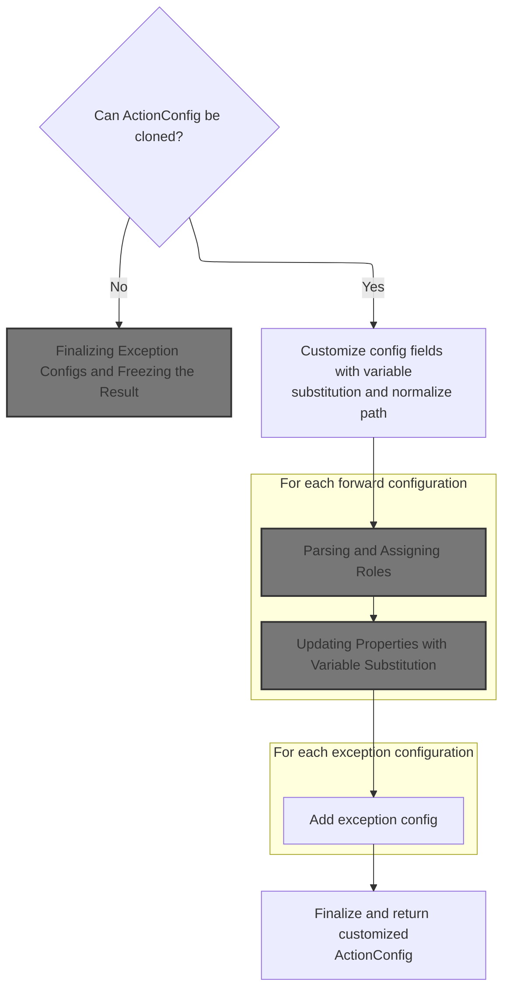
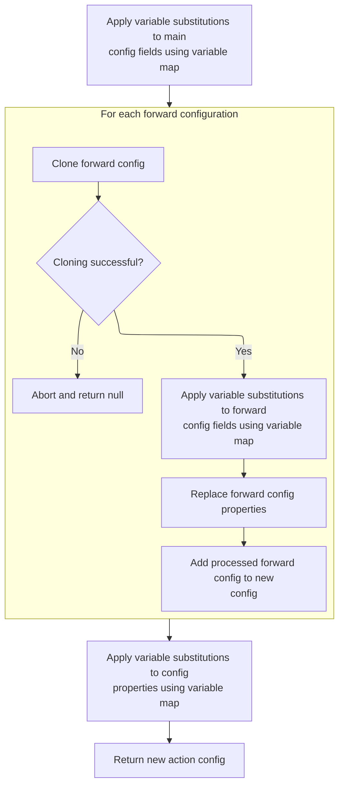

This document describes how a new action configuration is created by applying variable substitutions to an existing configuration. The process updates all fields and properties to match the current variable context, enabling flexible and dynamic request routing.

# Building a New <SwmToken path="core/src/main/java/org/apache/struts/config/ActionConfigMatcher.java" pos="157:3:3" line-data="    protected ActionConfig convertActionConfig(String path, ActionConfig orig,">`ActionConfig`</SwmToken> with Variable Substitution



<SwmSnippet path="/core/src/main/java/org/apache/struts/config/ActionConfigMatcher.java" line="157">

---

In <SwmToken path="core/src/main/java/org/apache/struts/config/ActionConfigMatcher.java" pos="157:5:5" line-data="    protected ActionConfig convertActionConfig(String path, ActionConfig orig,">`convertActionConfig`</SwmToken>, we clone the original <SwmToken path="core/src/main/java/org/apache/struts/config/ActionConfigMatcher.java" pos="157:3:3" line-data="    protected ActionConfig convertActionConfig(String path, ActionConfig orig,">`ActionConfig`</SwmToken> to get a mutable copy. Next, we call <SwmToken path="core/src/main/java/org/apache/struts/config/ActionConfigMatcher.java" pos="170:5:5" line-data="        config.setName(convertParam(orig.getName(), vars));">`convertParam`</SwmToken> on the name field to replace any placeholders with values from the vars map, so the config reflects the current variable context.

```java
    protected ActionConfig convertActionConfig(String path, ActionConfig orig,
        Map vars) {
        ActionConfig config = null;

        try {
            config = (ActionConfig) BeanUtils.cloneBean(orig);
        } catch (Exception ex) {
            log.warn("Unable to clone action config, recommend not using "
                + "wildcards", ex);

            return null;
        }

        config.setName(convertParam(orig.getName(), vars));
```

---

</SwmSnippet>

<SwmSnippet path="/core/src/main/java/org/apache/struts/config/ActionConfigMatcher.java" line="258">

---

<SwmToken path="core/src/main/java/org/apache/struts/config/ActionConfigMatcher.java" pos="258:5:5" line-data="    protected String convertParam(String val, Map vars) {">`convertParam`</SwmToken> handles placeholder substitution in strings like '{0}', '{1}', etc., using single-character keys from the vars map. It replaces all matching placeholders with their values, but throws if a value would cause a recursive loop. This keeps substitutions safe and predictable.

```java
    protected String convertParam(String val, Map vars) {
        if (val == null) {
            return null;
        } else if (val.indexOf("{") == -1) {
            return val;
        }

        Map.Entry entry;
        StringBuffer key = new StringBuffer("{0}");
        StringBuffer ret = new StringBuffer(val);
        String keyStr;
        int x;

        for (Iterator i = vars.entrySet().iterator(); i.hasNext();) {
            entry = (Map.Entry) i.next();
            key.setCharAt(1, ((String) entry.getKey()).charAt(0));
            keyStr = key.toString();
            
            // STR-3169
            // Prevent an infinite loop by retaining the placeholders
            // that contain itself in the substitution value
            if (((String) entry.getValue()).contains(keyStr)) {
        	throw new IllegalStateException();
            }
            
            // Replace all instances of the placeholder
            while ((x = ret.toString().indexOf(keyStr)) > -1) {
                ret.replace(x, x + 3, (String) entry.getValue());
            }
        }
```

---

</SwmSnippet>

<SwmSnippet path="/core/src/main/java/org/apache/struts/config/ActionConfigMatcher.java" line="170">

---

Back in <SwmToken path="core/src/main/java/org/apache/struts/config/ActionConfigMatcher.java" pos="157:5:5" line-data="    protected ActionConfig convertActionConfig(String path, ActionConfig orig,">`convertActionConfig`</SwmToken>, after getting the substituted name, we set it on the config to update the instance with the resolved value.

```java
        config.setName(convertParam(orig.getName(), vars));

```

---

</SwmSnippet>

<SwmSnippet path="/core/src/main/java/org/apache/struts/config/ActionConfig.java" line="517">

---

<SwmToken path="core/src/main/java/org/apache/struts/config/ActionConfig.java" pos="517:5:5" line-data="    public void setName(String name) {">`setName`</SwmToken> updates the config's name, but only if the configuration isn't frozen (checked by the 'configured' flag). If it's frozen, it throws, so you can't change the name after finalization.

```java
    public void setName(String name) {
        if (configured) {
            throw new IllegalStateException("Configuration is frozen");
        }

        this.name = name;
    }
```

---

</SwmSnippet>

<SwmSnippet path="/core/src/main/java/org/apache/struts/config/ActionConfigMatcher.java" line="172">

---

Back in <SwmToken path="core/src/main/java/org/apache/struts/config/ActionConfigMatcher.java" pos="157:5:5" line-data="    protected ActionConfig convertActionConfig(String path, ActionConfig orig,">`convertActionConfig`</SwmToken>, after updating the name, we make sure the path is in the right format (starts with '/') and set it on the config so routing works as expected.

```java
        if ((path.length() == 0) || (path.charAt(0) != '/')) {
            path = "/" + path;
        }

        config.setPath(path);
```

---

</SwmSnippet>

<SwmSnippet path="/core/src/main/java/org/apache/struts/config/ActionConfig.java" line="565">

---

<SwmToken path="core/src/main/java/org/apache/struts/config/ActionConfig.java" pos="565:5:5" line-data="    public void setPath(String path) {">`setPath`</SwmToken> assigns the path to the config, but only if the configuration isn't frozen. If you try to change it after freezing, it throws.

```java
    public void setPath(String path) {
        if (configured) {
            throw new IllegalStateException("Configuration is frozen");
        }

        this.path = path;
    }
```

---

</SwmSnippet>

<SwmSnippet path="/core/src/main/java/org/apache/struts/config/ActionConfigMatcher.java" line="177">

---

Back in <SwmToken path="core/src/main/java/org/apache/struts/config/ActionConfigMatcher.java" pos="157:5:5" line-data="    protected ActionConfig convertActionConfig(String path, ActionConfig orig,">`convertActionConfig`</SwmToken>, after setting the path, we substitute variables in the type field using <SwmToken path="core/src/main/java/org/apache/struts/config/ActionConfigMatcher.java" pos="177:5:5" line-data="        config.setType(convertParam(orig.getType(), vars));">`convertParam`</SwmToken> to make sure the config uses the correct type for this context.

```java
        config.setType(convertParam(orig.getType(), vars));
```

---

</SwmSnippet>

<SwmSnippet path="/core/src/main/java/org/apache/struts/config/ActionConfigMatcher.java" line="177">

---

Back in <SwmToken path="core/src/main/java/org/apache/struts/config/ActionConfigMatcher.java" pos="157:5:5" line-data="    protected ActionConfig convertActionConfig(String path, ActionConfig orig,">`convertActionConfig`</SwmToken>, after substituting the type, we set it on the config so it reflects the resolved type value.

```java
        config.setType(convertParam(orig.getType(), vars));
```

---

</SwmSnippet>

<SwmSnippet path="/core/src/main/java/org/apache/struts/config/ActionConfig.java" line="788">

---

<SwmToken path="core/src/main/java/org/apache/struts/config/ActionConfig.java" pos="788:5:5" line-data="    public void setType(String type) {">`setType`</SwmToken> updates the type field, but only if the config isn't frozen. If you try to change it after freezing, it throws.

```java
    public void setType(String type) {
        if (configured) {
            throw new IllegalStateException("Configuration is frozen");
        }

        this.type = type;
    }
```

---

</SwmSnippet>

<SwmSnippet path="/core/src/main/java/org/apache/struts/config/ActionConfigMatcher.java" line="178">

---

Back in <SwmToken path="core/src/main/java/org/apache/struts/config/ActionConfigMatcher.java" pos="157:5:5" line-data="    protected ActionConfig convertActionConfig(String path, ActionConfig orig,">`convertActionConfig`</SwmToken>, after setting the type, we substitute variables in the roles field using <SwmToken path="core/src/main/java/org/apache/struts/config/ActionConfigMatcher.java" pos="178:5:5" line-data="        config.setRoles(convertParam(orig.getRoles(), vars));">`convertParam`</SwmToken> to ensure the config has the correct roles for this context.

```java
        config.setRoles(convertParam(orig.getRoles(), vars));
```

---

</SwmSnippet>

<SwmSnippet path="/core/src/main/java/org/apache/struts/config/ActionConfigMatcher.java" line="178">

---

Back in <SwmToken path="core/src/main/java/org/apache/struts/config/ActionConfigMatcher.java" pos="157:5:5" line-data="    protected ActionConfig convertActionConfig(String path, ActionConfig orig,">`convertActionConfig`</SwmToken>, after substituting the roles, we set them on the config, which also parses the string into a list of role names.

```java
        config.setRoles(convertParam(orig.getRoles(), vars));
```

---

</SwmSnippet>

## Parsing and Assigning Roles

```mermaid
%%{init: {"flowchart": {"defaultRenderer": "elk"}} }%%
flowchart TD
    node1["Start: Set allowed roles"] --> node2{"Is configuration frozen?"}
    click node1 openCode "core/src/main/java/org/apache/struts/config/ActionConfig.java:597:630"
    node2 -->|"Yes"| node3["Reject change: Configuration is frozen"]
    click node2 openCode "core/src/main/java/org/apache/struts/config/ActionConfig.java:598:600"
    node2 -->|"No"| node4{"Is roles value null?"}
    click node3 openCode "core/src/main/java/org/apache/struts/config/ActionConfig.java:599:600"
    node4 -->|"Yes"| node5["Set allowed roles list to empty"]
    click node4 openCode "core/src/main/java/org/apache/struts/config/ActionConfig.java:604:607"
    node4 -->|"No"| node6["Prepare to update allowed roles list"]
    click node5 openCode "core/src/main/java/org/apache/struts/config/ActionConfig.java:605:607"
    node6 --> loop1
    click node6 openCode "core/src/main/java/org/apache/struts/config/ActionConfig.java:610:611"
    
    subgraph loop1["For each comma in roles string"]
        loop1a["Extract next role before comma"]
        click loop1a openCode "core/src/main/java/org/apache/struts/config/ActionConfig.java:612:620"
        loop1b["Add role to allowed roles list"]
        click loop1b openCode "core/src/main/java/org/apache/struts/config/ActionConfig.java:619:620"
        loop1a --> loop1b
        loop1b --> loop1a
    end
    loop1 --> node7{"Is there a non-empty role left?"}
    click node7 openCode "core/src/main/java/org/apache/struts/config/ActionConfig.java:623:625"
    node7 -->|"Yes"| node8["Add last role to allowed roles list"]
    click node8 openCode "core/src/main/java/org/apache/struts/config/ActionConfig.java:626:627"
    node7 -->|"No"| node9["Update allowed roles list"]
    click node9 openCode "core/src/main/java/org/apache/struts/config/ActionConfig.java:629:630"
    node8 --> node9
classDef HeadingStyle fill:#777777,stroke:#333,stroke-width:2px;

%% Swimm:
%% %%{init: {"flowchart": {"defaultRenderer": "elk"}} }%%
%% flowchart TD
%%     node1["Start: Set allowed roles"] --> node2{"Is configuration frozen?"}
%%     click node1 openCode "<SwmPath>[core/…/config/ActionConfig.java](core/src/main/java/org/apache/struts/config/ActionConfig.java)</SwmPath>:597:630"
%%     node2 -->|"Yes"| node3["Reject change: Configuration is frozen"]
%%     click node2 openCode "<SwmPath>[core/…/config/ActionConfig.java](core/src/main/java/org/apache/struts/config/ActionConfig.java)</SwmPath>:598:600"
%%     node2 -->|"No"| node4{"Is roles value null?"}
%%     click node3 openCode "<SwmPath>[core/…/config/ActionConfig.java](core/src/main/java/org/apache/struts/config/ActionConfig.java)</SwmPath>:599:600"
%%     node4 -->|"Yes"| node5["Set allowed roles list to empty"]
%%     click node4 openCode "<SwmPath>[core/…/config/ActionConfig.java](core/src/main/java/org/apache/struts/config/ActionConfig.java)</SwmPath>:604:607"
%%     node4 -->|"No"| node6["Prepare to update allowed roles list"]
%%     click node5 openCode "<SwmPath>[core/…/config/ActionConfig.java](core/src/main/java/org/apache/struts/config/ActionConfig.java)</SwmPath>:605:607"
%%     node6 --> loop1
%%     click node6 openCode "<SwmPath>[core/…/config/ActionConfig.java](core/src/main/java/org/apache/struts/config/ActionConfig.java)</SwmPath>:610:611"
%%     
%%     subgraph loop1["For each comma in roles string"]
%%         loop1a["Extract next role before comma"]
%%         click loop1a openCode "<SwmPath>[core/…/config/ActionConfig.java](core/src/main/java/org/apache/struts/config/ActionConfig.java)</SwmPath>:612:620"
%%         loop1b["Add role to allowed roles list"]
%%         click loop1b openCode "<SwmPath>[core/…/config/ActionConfig.java](core/src/main/java/org/apache/struts/config/ActionConfig.java)</SwmPath>:619:620"
%%         loop1a --> loop1b
%%         loop1b --> loop1a
%%     end
%%     loop1 --> node7{"Is there a non-empty role left?"}
%%     click node7 openCode "<SwmPath>[core/…/config/ActionConfig.java](core/src/main/java/org/apache/struts/config/ActionConfig.java)</SwmPath>:623:625"
%%     node7 -->|"Yes"| node8["Add last role to allowed roles list"]
%%     click node8 openCode "<SwmPath>[core/…/config/ActionConfig.java](core/src/main/java/org/apache/struts/config/ActionConfig.java)</SwmPath>:626:627"
%%     node7 -->|"No"| node9["Update allowed roles list"]
%%     click node9 openCode "<SwmPath>[core/…/config/ActionConfig.java](core/src/main/java/org/apache/struts/config/ActionConfig.java)</SwmPath>:629:630"
%%     node8 --> node9
%% classDef HeadingStyle fill:#777777,stroke:#333,stroke-width:2px;
```



<SwmSnippet path="/core/src/main/java/org/apache/struts/config/ActionConfig.java" line="597">

---

In <SwmToken path="core/src/main/java/org/apache/struts/config/ActionConfig.java" pos="597:5:5" line-data="    public void setRoles(String roles) {">`setRoles`</SwmToken>, the roles string is split by commas, trimmed, and stored as an array for easier role checks. The method throws if the config is frozen.

```java
    public void setRoles(String roles) {
        if (configured) {
            throw new IllegalStateException("Configuration is frozen");
        }

        this.roles = roles;

        if (roles == null) {
            roleNames = new String[0];

            return;
        }

        ArrayList list = new ArrayList();

        while (true) {
            int comma = roles.indexOf(',');

            if (comma < 0) {
                break;
            }

            list.add(roles.substring(0, comma).trim());
            roles = roles.substring(comma + 1);
        }
```

---

</SwmSnippet>

<SwmSnippet path="/core/src/main/java/org/apache/struts/config/ActionConfig.java" line="623">

---

Finally, <SwmToken path="core/src/main/java/org/apache/struts/config/ActionConfigMatcher.java" pos="178:3:3" line-data="        config.setRoles(convertParam(orig.getRoles(), vars));">`setRoles`</SwmToken> trims and adds the last role (if present) and updates the <SwmToken path="core/src/main/java/org/apache/struts/config/ActionConfig.java" pos="629:1:1" line-data="        roleNames = (String[]) list.toArray(new String[list.size()]);">`roleNames`</SwmToken> array. If roles is null or empty, <SwmToken path="core/src/main/java/org/apache/struts/config/ActionConfig.java" pos="629:1:1" line-data="        roleNames = (String[]) list.toArray(new String[list.size()]);">`roleNames`</SwmToken> is just an empty array.

```java
        roles = roles.trim();

        if (roles.length() > 0) {
            list.add(roles);
        }

        roleNames = (String[]) list.toArray(new String[list.size()]);
    }
```

---

</SwmSnippet>

## Assigning Additional <SwmToken path="core/src/main/java/org/apache/struts/config/ActionConfigMatcher.java" pos="157:3:3" line-data="    protected ActionConfig convertActionConfig(String path, ActionConfig orig,">`ActionConfig`</SwmToken> Properties



<SwmSnippet path="/core/src/main/java/org/apache/struts/config/ActionConfigMatcher.java" line="179">

---

Back in <SwmToken path="core/src/main/java/org/apache/struts/config/ActionConfigMatcher.java" pos="157:5:5" line-data="    protected ActionConfig convertActionConfig(String path, ActionConfig orig,">`convertActionConfig`</SwmToken>, after setting roles, we substitute variables in the parameter field using <SwmToken path="core/src/main/java/org/apache/struts/config/ActionConfigMatcher.java" pos="179:5:5" line-data="        config.setParameter(convertParam(orig.getParameter(), vars));">`convertParam`</SwmToken> to ensure the config uses the correct parameter value.

```java
        config.setParameter(convertParam(orig.getParameter(), vars));
```

---

</SwmSnippet>

<SwmSnippet path="/core/src/main/java/org/apache/struts/config/ActionConfigMatcher.java" line="179">

---

Back in <SwmToken path="core/src/main/java/org/apache/struts/config/ActionConfigMatcher.java" pos="157:5:5" line-data="    protected ActionConfig convertActionConfig(String path, ActionConfig orig,">`convertActionConfig`</SwmToken>, after substituting the parameter, we set it on the config so it reflects the resolved value.

```java
        config.setParameter(convertParam(orig.getParameter(), vars));
```

---

</SwmSnippet>

<SwmSnippet path="/core/src/main/java/org/apache/struts/config/ActionConfig.java" line="541">

---

<SwmToken path="core/src/main/java/org/apache/struts/config/ActionConfig.java" pos="541:5:5" line-data="    public void setParameter(String parameter) {">`setParameter`</SwmToken> updates the parameter field, but only if the config isn't frozen. If you try to change it after freezing, it throws.

```java
    public void setParameter(String parameter) {
        if (configured) {
            throw new IllegalStateException("Configuration is frozen");
        }

        this.parameter = parameter;
    }
```

---

</SwmSnippet>

<SwmSnippet path="/core/src/main/java/org/apache/struts/config/ActionConfigMatcher.java" line="180">

---

Back in <SwmToken path="core/src/main/java/org/apache/struts/config/ActionConfigMatcher.java" pos="157:5:5" line-data="    protected ActionConfig convertActionConfig(String path, ActionConfig orig,">`convertActionConfig`</SwmToken>, after setting the parameter, we substitute variables in the attribute field using <SwmToken path="core/src/main/java/org/apache/struts/config/ActionConfigMatcher.java" pos="180:5:5" line-data="        config.setAttribute(convertParam(orig.getAttribute(), vars));">`convertParam`</SwmToken> to ensure the config uses the correct attribute value.

```java
        config.setAttribute(convertParam(orig.getAttribute(), vars));
```

---

</SwmSnippet>

<SwmSnippet path="/core/src/main/java/org/apache/struts/config/ActionConfig.java" line="321">

---

<SwmToken path="core/src/main/java/org/apache/struts/config/ActionConfig.java" pos="321:5:5" line-data="    public String getAttribute() {">`getAttribute`</SwmToken> returns the attribute if set, otherwise falls back to the name. This ensures there's always a usable value.

```java
    public String getAttribute() {
        if (this.attribute == null) {
            return (this.name);
        } else {
            return (this.attribute);
        }
    }
```

---

</SwmSnippet>

<SwmSnippet path="/core/src/main/java/org/apache/struts/config/ActionConfigMatcher.java" line="180">

---

Back in <SwmToken path="core/src/main/java/org/apache/struts/config/ActionConfigMatcher.java" pos="157:5:5" line-data="    protected ActionConfig convertActionConfig(String path, ActionConfig orig,">`convertActionConfig`</SwmToken>, after getting the attribute, we substitute variables using <SwmToken path="core/src/main/java/org/apache/struts/config/ActionConfigMatcher.java" pos="180:5:5" line-data="        config.setAttribute(convertParam(orig.getAttribute(), vars));">`convertParam`</SwmToken> to ensure the config uses the correct attribute value.

```java
        config.setAttribute(convertParam(orig.getAttribute(), vars));
```

---

</SwmSnippet>

<SwmSnippet path="/core/src/main/java/org/apache/struts/config/ActionConfigMatcher.java" line="180">

---

Back in <SwmToken path="core/src/main/java/org/apache/struts/config/ActionConfigMatcher.java" pos="157:5:5" line-data="    protected ActionConfig convertActionConfig(String path, ActionConfig orig,">`convertActionConfig`</SwmToken>, after substituting the attribute, we set it on the config so it reflects the resolved value.

```java
        config.setAttribute(convertParam(orig.getAttribute(), vars));
```

---

</SwmSnippet>

<SwmSnippet path="/core/src/main/java/org/apache/struts/config/ActionConfig.java" line="337">

---

<SwmToken path="core/src/main/java/org/apache/struts/config/ActionConfig.java" pos="337:5:5" line-data="    public void setAttribute(String attribute) {">`setAttribute`</SwmToken> updates the attribute field, but only if the config isn't frozen. If you try to change it after freezing, it throws.

```java
    public void setAttribute(String attribute) {
        if (configured) {
            throw new IllegalStateException("Configuration is frozen");
        }

        this.attribute = attribute;
    }
```

---

</SwmSnippet>

<SwmSnippet path="/core/src/main/java/org/apache/struts/config/ActionConfigMatcher.java" line="181">

---

Back in <SwmToken path="core/src/main/java/org/apache/struts/config/ActionConfigMatcher.java" pos="157:5:5" line-data="    protected ActionConfig convertActionConfig(String path, ActionConfig orig,">`convertActionConfig`</SwmToken>, after setting the attribute, we substitute variables in the forward field using <SwmToken path="core/src/main/java/org/apache/struts/config/ActionConfigMatcher.java" pos="181:5:5" line-data="        config.setForward(convertParam(orig.getForward(), vars));">`convertParam`</SwmToken> to ensure the config uses the correct forward value.

```java
        config.setForward(convertParam(orig.getForward(), vars));
```

---

</SwmSnippet>

<SwmSnippet path="/core/src/main/java/org/apache/struts/config/ActionConfigMatcher.java" line="181">

---

Back in <SwmToken path="core/src/main/java/org/apache/struts/config/ActionConfigMatcher.java" pos="157:5:5" line-data="    protected ActionConfig convertActionConfig(String path, ActionConfig orig,">`convertActionConfig`</SwmToken>, after substituting the forward value, we set it on the config so it reflects the resolved value.

```java
        config.setForward(convertParam(orig.getForward(), vars));
```

---

</SwmSnippet>

<SwmSnippet path="/core/src/main/java/org/apache/struts/config/ActionConfig.java" line="419">

---

<SwmToken path="core/src/main/java/org/apache/struts/config/ActionConfig.java" pos="419:5:5" line-data="    public void setForward(String forward) {">`setForward`</SwmToken> updates the forward field, but only if the config isn't frozen. If you try to change it after freezing, it throws.

```java
    public void setForward(String forward) {
        if (configured) {
            throw new IllegalStateException("Configuration is frozen");
        }

        this.forward = forward;
    }
```

---

</SwmSnippet>

<SwmSnippet path="/core/src/main/java/org/apache/struts/config/ActionConfigMatcher.java" line="182">

---

Back in <SwmToken path="core/src/main/java/org/apache/struts/config/ActionConfigMatcher.java" pos="157:5:5" line-data="    protected ActionConfig convertActionConfig(String path, ActionConfig orig,">`convertActionConfig`</SwmToken>, after setting the forward value, we substitute variables in the include field using <SwmToken path="core/src/main/java/org/apache/struts/config/ActionConfigMatcher.java" pos="182:5:5" line-data="        config.setInclude(convertParam(orig.getInclude(), vars));">`convertParam`</SwmToken> to ensure the config uses the correct include value.

```java
        config.setInclude(convertParam(orig.getInclude(), vars));
```

---

</SwmSnippet>

<SwmSnippet path="/core/src/main/java/org/apache/struts/config/ActionConfigMatcher.java" line="182">

---

Back in <SwmToken path="core/src/main/java/org/apache/struts/config/ActionConfigMatcher.java" pos="157:5:5" line-data="    protected ActionConfig convertActionConfig(String path, ActionConfig orig,">`convertActionConfig`</SwmToken>, after substituting the include value, we set it on the config so it reflects the resolved value.

```java
        config.setInclude(convertParam(orig.getInclude(), vars));
```

---

</SwmSnippet>

<SwmSnippet path="/core/src/main/java/org/apache/struts/config/ActionConfig.java" line="446">

---

<SwmToken path="core/src/main/java/org/apache/struts/config/ActionConfig.java" pos="446:5:5" line-data="    public void setInclude(String include) {">`setInclude`</SwmToken> updates the include field, but only if the config isn't frozen. If you try to change it after freezing, it throws.

```java
    public void setInclude(String include) {
        if (configured) {
            throw new IllegalStateException("Configuration is frozen");
        }

        this.include = include;
    }
```

---

</SwmSnippet>

<SwmSnippet path="/core/src/main/java/org/apache/struts/config/ActionConfigMatcher.java" line="183">

---

Back in <SwmToken path="core/src/main/java/org/apache/struts/config/ActionConfigMatcher.java" pos="157:5:5" line-data="    protected ActionConfig convertActionConfig(String path, ActionConfig orig,">`convertActionConfig`</SwmToken>, after setting the include value, we substitute variables in the input field using <SwmToken path="core/src/main/java/org/apache/struts/config/ActionConfigMatcher.java" pos="183:5:5" line-data="        config.setInput(convertParam(orig.getInput(), vars));">`convertParam`</SwmToken> to ensure the config uses the correct input value.

```java
        config.setInput(convertParam(orig.getInput(), vars));
```

---

</SwmSnippet>

<SwmSnippet path="/core/src/main/java/org/apache/struts/config/ActionConfigMatcher.java" line="183">

---

Back in <SwmToken path="core/src/main/java/org/apache/struts/config/ActionConfigMatcher.java" pos="157:5:5" line-data="    protected ActionConfig convertActionConfig(String path, ActionConfig orig,">`convertActionConfig`</SwmToken>, after substituting the input value, we set it on the config so it reflects the resolved value.

```java
        config.setInput(convertParam(orig.getInput(), vars));
```

---

</SwmSnippet>

<SwmSnippet path="/core/src/main/java/org/apache/struts/config/ActionConfig.java" line="473">

---

<SwmToken path="core/src/main/java/org/apache/struts/config/ActionConfig.java" pos="473:5:5" line-data="    public void setInput(String input) {">`setInput`</SwmToken> updates the input field, but only if the config isn't frozen. If you try to change it after freezing, it throws.

```java
    public void setInput(String input) {
        if (configured) {
            throw new IllegalStateException("Configuration is frozen");
        }

        this.input = input;
    }
```

---

</SwmSnippet>

<SwmSnippet path="/core/src/main/java/org/apache/struts/config/ActionConfigMatcher.java" line="184">

---

Back in <SwmToken path="core/src/main/java/org/apache/struts/config/ActionConfigMatcher.java" pos="157:5:5" line-data="    protected ActionConfig convertActionConfig(String path, ActionConfig orig,">`convertActionConfig`</SwmToken>, after setting the input value, we substitute variables in the catalog field using <SwmToken path="core/src/main/java/org/apache/struts/config/ActionConfigMatcher.java" pos="184:5:5" line-data="        config.setCatalog(convertParam(orig.getCatalog(), vars));">`convertParam`</SwmToken> to ensure the config uses the correct catalog value.

```java
        config.setCatalog(convertParam(orig.getCatalog(), vars));
```

---

</SwmSnippet>

<SwmSnippet path="/core/src/main/java/org/apache/struts/config/ActionConfigMatcher.java" line="184">

---

Back in <SwmToken path="core/src/main/java/org/apache/struts/config/ActionConfigMatcher.java" pos="157:5:5" line-data="    protected ActionConfig convertActionConfig(String path, ActionConfig orig,">`convertActionConfig`</SwmToken>, after substituting the catalog value, we set it on the config so it reflects the resolved value.

```java
        config.setCatalog(convertParam(orig.getCatalog(), vars));
```

---

</SwmSnippet>

<SwmSnippet path="/core/src/main/java/org/apache/struts/config/ActionConfig.java" line="882">

---

<SwmToken path="core/src/main/java/org/apache/struts/config/ActionConfig.java" pos="882:5:5" line-data="    public void setCatalog(String catalog) {">`setCatalog`</SwmToken> updates the catalog field, but only if the config isn't frozen. If you try to change it after freezing, it throws.

```java
    public void setCatalog(String catalog) {
        if (configured) {
            throw new IllegalStateException("Configuration is frozen");
        }

        this.catalog = catalog;
    }
```

---

</SwmSnippet>

<SwmSnippet path="/core/src/main/java/org/apache/struts/config/ActionConfigMatcher.java" line="185">

---

Back in <SwmToken path="core/src/main/java/org/apache/struts/config/ActionConfigMatcher.java" pos="157:5:5" line-data="    protected ActionConfig convertActionConfig(String path, ActionConfig orig,">`convertActionConfig`</SwmToken>, after setting the catalog value, we substitute variables in the command field using <SwmToken path="core/src/main/java/org/apache/struts/config/ActionConfigMatcher.java" pos="185:5:5" line-data="        config.setCommand(convertParam(orig.getCommand(), vars));">`convertParam`</SwmToken> to ensure the config uses the correct command value.

```java
        config.setCommand(convertParam(orig.getCommand(), vars));
```

---

</SwmSnippet>

<SwmSnippet path="/core/src/main/java/org/apache/struts/config/ActionConfigMatcher.java" line="185">

---

Back in <SwmToken path="core/src/main/java/org/apache/struts/config/ActionConfigMatcher.java" pos="157:5:5" line-data="    protected ActionConfig convertActionConfig(String path, ActionConfig orig,">`convertActionConfig`</SwmToken>, after substituting the command value, we set it on the config so it reflects the resolved value.

```java
        config.setCommand(convertParam(orig.getCommand(), vars));
```

---

</SwmSnippet>

<SwmSnippet path="/core/src/main/java/org/apache/struts/config/ActionConfig.java" line="864">

---

<SwmToken path="core/src/main/java/org/apache/struts/config/ActionConfig.java" pos="864:5:5" line-data="    public void setCommand(String command) {">`setCommand`</SwmToken> updates the command field, but only if the config isn't frozen. If you try to change it after freezing, it throws.

```java
    public void setCommand(String command) {
        if (configured) {
            throw new IllegalStateException("Configuration is frozen");
        }

        this.command = command;
    }
```

---

</SwmSnippet>

<SwmSnippet path="/core/src/main/java/org/apache/struts/config/ActionConfigMatcher.java" line="186">

---

Back in <SwmToken path="core/src/main/java/org/apache/struts/config/ActionConfigMatcher.java" pos="157:5:5" line-data="    protected ActionConfig convertActionConfig(String path, ActionConfig orig,">`convertActionConfig`</SwmToken>, after setting the command value, we substitute variables in the <SwmToken path="core/src/main/java/org/apache/struts/config/ActionConfig.java" pos="499:9:9" line-data="    public void setMultipartClass(String multipartClass) {">`multipartClass`</SwmToken> field using <SwmToken path="core/src/main/java/org/apache/struts/config/ActionConfigMatcher.java" pos="186:5:5" line-data="        config.setMultipartClass(convertParam(orig.getMultipartClass(), vars));">`convertParam`</SwmToken> to ensure the config uses the correct <SwmToken path="core/src/main/java/org/apache/struts/config/ActionConfig.java" pos="499:9:9" line-data="    public void setMultipartClass(String multipartClass) {">`multipartClass`</SwmToken> value.

```java
        config.setMultipartClass(convertParam(orig.getMultipartClass(), vars));
```

---

</SwmSnippet>

<SwmSnippet path="/core/src/main/java/org/apache/struts/config/ActionConfigMatcher.java" line="186">

---

After getting the substituted <SwmToken path="core/src/main/java/org/apache/struts/config/ActionConfig.java" pos="499:9:9" line-data="    public void setMultipartClass(String multipartClass) {">`multipartClass`</SwmToken> value from <SwmToken path="core/src/main/java/org/apache/struts/config/ActionConfigMatcher.java" pos="186:5:5" line-data="        config.setMultipartClass(convertParam(orig.getMultipartClass(), vars));">`convertParam`</SwmToken>, we call <SwmToken path="core/src/main/java/org/apache/struts/config/ActionConfigMatcher.java" pos="186:3:3" line-data="        config.setMultipartClass(convertParam(orig.getMultipartClass(), vars));">`setMultipartClass`</SwmToken> on the config. This step in ActionConfigMatcher.convertActionConfig ensures the config uses the resolved class name for handling multipart requests, reflecting any variable substitutions.

```java
        config.setMultipartClass(convertParam(orig.getMultipartClass(), vars));
```

---

</SwmSnippet>

<SwmSnippet path="/core/src/main/java/org/apache/struts/config/ActionConfig.java" line="499">

---

SetMultipartClass only updates the field if the config isn't frozen (checked by the configured flag). If the config is finalized, it throws, so you can't change <SwmToken path="core/src/main/java/org/apache/struts/config/ActionConfig.java" pos="499:9:9" line-data="    public void setMultipartClass(String multipartClass) {">`multipartClass`</SwmToken> after that point.

```java
    public void setMultipartClass(String multipartClass) {
        if (configured) {
            throw new IllegalStateException("Configuration is frozen");
        }

        this.multipartClass = multipartClass;
    }
```

---

</SwmSnippet>

<SwmSnippet path="/core/src/main/java/org/apache/struts/config/ActionConfigMatcher.java" line="187">

---

After setting <SwmToken path="core/src/main/java/org/apache/struts/config/ActionConfig.java" pos="499:9:9" line-data="    public void setMultipartClass(String multipartClass) {">`multipartClass`</SwmToken>, ActionConfigMatcher.convertActionConfig substitutes variables in the prefix field using <SwmToken path="core/src/main/java/org/apache/struts/config/ActionConfigMatcher.java" pos="187:5:5" line-data="        config.setPrefix(convertParam(orig.getPrefix(), vars));">`convertParam`</SwmToken>. This makes sure the config gets the right prefix value for the current variable context.

```java
        config.setPrefix(convertParam(orig.getPrefix(), vars));
```

---

</SwmSnippet>

<SwmSnippet path="/core/src/main/java/org/apache/struts/config/ActionConfigMatcher.java" line="187">

---

After getting the substituted prefix, ActionConfigMatcher.convertActionConfig sets it on the config. This updates the config with the resolved prefix value, reflecting any variable substitutions.

```java
        config.setPrefix(convertParam(orig.getPrefix(), vars));
```

---

</SwmSnippet>

<SwmSnippet path="/core/src/main/java/org/apache/struts/config/ActionConfig.java" line="585">

---

SetPrefix only updates the prefix if the config isn't frozen (checked by the configured flag). If the config is finalized, it throws, so you can't change the prefix after that point.

```java
    public void setPrefix(String prefix) {
        if (configured) {
            throw new IllegalStateException("Configuration is frozen");
        }

        this.prefix = prefix;
    }
```

---

</SwmSnippet>

<SwmSnippet path="/core/src/main/java/org/apache/struts/config/ActionConfigMatcher.java" line="188">

---

After setting the prefix, ActionConfigMatcher.convertActionConfig substitutes variables in the suffix field using <SwmToken path="core/src/main/java/org/apache/struts/config/ActionConfigMatcher.java" pos="188:5:5" line-data="        config.setSuffix(convertParam(orig.getSuffix(), vars));">`convertParam`</SwmToken>. This ensures the config gets the right suffix value for the current variable context.

```java
        config.setSuffix(convertParam(orig.getSuffix(), vars));
```

---

</SwmSnippet>

<SwmSnippet path="/core/src/main/java/org/apache/struts/config/ActionConfigMatcher.java" line="188">

---

After getting the substituted suffix, ActionConfigMatcher.convertActionConfig sets it on the config. This updates the config with the resolved suffix value, reflecting any variable substitutions.

```java
        config.setSuffix(convertParam(orig.getSuffix(), vars));

```

---

</SwmSnippet>

<SwmSnippet path="/core/src/main/java/org/apache/struts/config/ActionConfig.java" line="776">

---

SetSuffix only updates the suffix if the config isn't frozen (checked by the configured flag). If the config is finalized, it throws, so you can't change the suffix after that point.

```java
    public void setSuffix(String suffix) {
        if (configured) {
            throw new IllegalStateException("Configuration is frozen");
        }

        this.suffix = suffix;
    }
```

---

</SwmSnippet>

<SwmSnippet path="/core/src/main/java/org/apache/struts/config/ActionConfigMatcher.java" line="190">

---

After setting the suffix, ActionConfigMatcher.convertActionConfig loops through each forward config, clones it, and prepares to substitute variables in its fields. This way, each forward config can be customized for the current variable context without touching the originals.

```java
        ForwardConfig[] fConfigs = orig.findForwardConfigs();
        ForwardConfig cfg;

        for (int x = 0; x < fConfigs.length; x++) {
            try {
                cfg = (ActionForward) BeanUtils.cloneBean(fConfigs[x]);
            } catch (Exception ex) {
                log.warn("Unable to clone action config, recommend not using "
                        + "wildcards", ex);
                return null;
            }
            cfg.setName(fConfigs[x].getName());
            cfg.setPath(convertParam(fConfigs[x].getPath(), vars));
```

---

</SwmSnippet>

<SwmSnippet path="/core/src/main/java/org/apache/struts/config/ActionConfigMatcher.java" line="202">

---

After substituting the path in the forward config, ActionConfigMatcher.convertActionConfig sets it on the cloned config. This updates the forward config with the resolved path value, reflecting any variable substitutions.

```java
            cfg.setPath(convertParam(fConfigs[x].getPath(), vars));
```

---

</SwmSnippet>

<SwmSnippet path="/core/src/main/java/org/apache/struts/config/ExceptionConfig.java" line="141">

---

SetPath only updates the path if the config isn't frozen (checked by the configured flag). If the config is finalized, it throws, so you can't change the path after that point.

```java
    public void setPath(String path) {
        if (configured) {
            throw new IllegalStateException("Configuration is frozen");
        }

        this.path = path;
    }
```

---

</SwmSnippet>

<SwmSnippet path="/core/src/main/java/org/apache/struts/config/ActionConfigMatcher.java" line="203">

---

After setting the path, ActionConfigMatcher.convertActionConfig sets the redirect flag on the forward config. This determines if the forward should trigger a redirect or just a forward, matching the original config's intent.

```java
            cfg.setRedirect(fConfigs[x].getRedirect());
```

---

</SwmSnippet>

<SwmSnippet path="/core/src/main/java/org/apache/struts/config/ForwardConfig.java" line="222">

---

SetRedirect only updates the redirect flag if the config isn't frozen (checked by the configured flag). If the config is finalized, it throws, so you can't change redirect after that point.

```java
    public void setRedirect(boolean redirect) {
        if (configured) {
            throw new IllegalStateException("Configuration is frozen");
        }

        this.redirect = redirect;
    }
```

---

</SwmSnippet>

<SwmSnippet path="/core/src/main/java/org/apache/struts/config/ActionConfigMatcher.java" line="204">

---

After setting the redirect flag, ActionConfigMatcher.convertActionConfig substitutes variables in the command field of the forward config using <SwmToken path="core/src/main/java/org/apache/struts/config/ActionConfigMatcher.java" pos="204:5:5" line-data="            cfg.setCommand(convertParam(fConfigs[x].getCommand(), vars));">`convertParam`</SwmToken>. This ensures the config gets the right command value for the current variable context.

```java
            cfg.setCommand(convertParam(fConfigs[x].getCommand(), vars));
```

---

</SwmSnippet>

<SwmSnippet path="/core/src/main/java/org/apache/struts/config/ActionConfigMatcher.java" line="204">

---

After getting the substituted command, ActionConfigMatcher.convertActionConfig sets it on the forward config. This updates the config with the resolved command value, reflecting any variable substitutions.

```java
            cfg.setCommand(convertParam(fConfigs[x].getCommand(), vars));
```

---

</SwmSnippet>

<SwmSnippet path="/core/src/main/java/org/apache/struts/config/ActionConfigMatcher.java" line="205">

---

After setting the command, ActionConfigMatcher.convertActionConfig substitutes variables in the catalog field of the forward config using <SwmToken path="core/src/main/java/org/apache/struts/config/ActionConfigMatcher.java" pos="205:5:5" line-data="            cfg.setCatalog(convertParam(fConfigs[x].getCatalog(), vars));">`convertParam`</SwmToken>. This ensures the config gets the right catalog value for the current variable context.

```java
            cfg.setCatalog(convertParam(fConfigs[x].getCatalog(), vars));
```

---

</SwmSnippet>

<SwmSnippet path="/core/src/main/java/org/apache/struts/config/ActionConfigMatcher.java" line="205">

---

After getting the substituted catalog, ActionConfigMatcher.convertActionConfig sets it on the forward config. This updates the config with the resolved catalog value, reflecting any variable substitutions.

```java
            cfg.setCatalog(convertParam(fConfigs[x].getCatalog(), vars));
```

---

</SwmSnippet>

<SwmSnippet path="/core/src/main/java/org/apache/struts/config/ActionConfigMatcher.java" line="206">

---

After setting the catalog, ActionConfigMatcher.convertActionConfig substitutes variables in the module field of the forward config using <SwmToken path="core/src/main/java/org/apache/struts/config/ActionConfigMatcher.java" pos="206:5:5" line-data="            cfg.setModule(convertParam(fConfigs[x].getModule(), vars));">`convertParam`</SwmToken>. This ensures the config gets the right module value for the current variable context.

```java
            cfg.setModule(convertParam(fConfigs[x].getModule(), vars));

```

---

</SwmSnippet>

<SwmSnippet path="/core/src/main/java/org/apache/struts/config/ActionConfigMatcher.java" line="208">

---

After setting all the main fields on the forward config, ActionConfigMatcher.convertActionConfig calls <SwmToken path="core/src/main/java/org/apache/struts/config/ActionConfigMatcher.java" pos="208:1:1" line-data="            replaceProperties(fConfigs[x].getProperties(), cfg.getProperties(),">`replaceProperties`</SwmToken> to update all property values with variable substitutions. This keeps the properties in sync with the current variable context.

```java
            replaceProperties(fConfigs[x].getProperties(), cfg.getProperties(),
                vars);

            config.removeForwardConfig(fConfigs[x]);
            config.addForwardConfig(cfg);
        }

        replaceProperties(orig.getProperties(), config.getProperties(), vars);

```

---

</SwmSnippet>

## Updating Properties with Variable Substitution

<SwmSnippet path="/core/src/main/java/org/apache/struts/config/ActionConfigMatcher.java" line="238">

---

In <SwmToken path="core/src/main/java/org/apache/struts/config/ActionConfigMatcher.java" pos="238:5:5" line-data="    protected void replaceProperties(Properties orig, Properties props, Map vars) {">`replaceProperties`</SwmToken>, we loop through each property in orig, substitute variables in the value using <SwmToken path="core/src/main/java/org/apache/struts/config/ActionConfigMatcher.java" pos="244:1:1" line-data="                convertParam((String) entry.getValue(), vars));">`convertParam`</SwmToken>, and set the result in props. This way, all properties reflect the current variable context.

```java
    protected void replaceProperties(Properties orig, Properties props, Map vars) {
        Map.Entry entry = null;

        for (Iterator i = orig.entrySet().iterator(); i.hasNext();) {
            entry = (Map.Entry) i.next();
            props.setProperty((String) entry.getKey(),
                convertParam((String) entry.getValue(), vars));
```

---

</SwmSnippet>

<SwmSnippet path="/core/src/main/java/org/apache/struts/config/ActionConfigMatcher.java" line="243">

---

After substituting and setting all property values in props, <SwmToken path="core/src/main/java/org/apache/struts/config/ActionConfigMatcher.java" pos="208:1:1" line-data="            replaceProperties(fConfigs[x].getProperties(), cfg.getProperties(),">`replaceProperties`</SwmToken> is done. This guarantees all properties are current for the variable context. Next, the flow continues with any additional property handling or downstream logic that depends on these updated properties.

```java
            props.setProperty((String) entry.getKey(),
                convertParam((String) entry.getValue(), vars));
        }
    }
```

---

</SwmSnippet>

## Finalizing Exception Configs and Freezing the Result

<SwmSnippet path="/core/src/main/java/org/apache/struts/config/ActionConfigMatcher.java" line="217">

---

After updating all properties, ActionConfigMatcher.convertActionConfig copies over the exception configs from the original. This keeps error handling consistent in the new config.

```java
        ExceptionConfig[] exConfigs = orig.findExceptionConfigs();

        for (int x = 0; x < exConfigs.length; x++) {
            config.addExceptionConfig(exConfigs[x]);
        }
```

---

</SwmSnippet>

<SwmSnippet path="/core/src/main/java/org/apache/struts/config/ActionConfigMatcher.java" line="223">

---

ConvertActionConfig freezes the config to prevent any more changes and returns it. The result is a fully resolved, immutable <SwmToken path="core/src/main/java/org/apache/struts/config/ActionConfigMatcher.java" pos="157:3:3" line-data="    protected ActionConfig convertActionConfig(String path, ActionConfig orig,">`ActionConfig`</SwmToken> ready for use.

```java
        config.freeze();

        return config;
    }
```

---

</SwmSnippet>

&nbsp;

*This is an auto-generated document by Swimm 🌊 and has not yet been verified by a human*

<SwmMeta version="3.0.0" repo-id="Z2l0aHViJTNBJTNBc3RydXRzMSUzQSUzQVN3aW1tLURlbW8=" repo-name="struts1"><sup>Powered by [Swimm](https://app.swimm.io/)</sup></SwmMeta>
