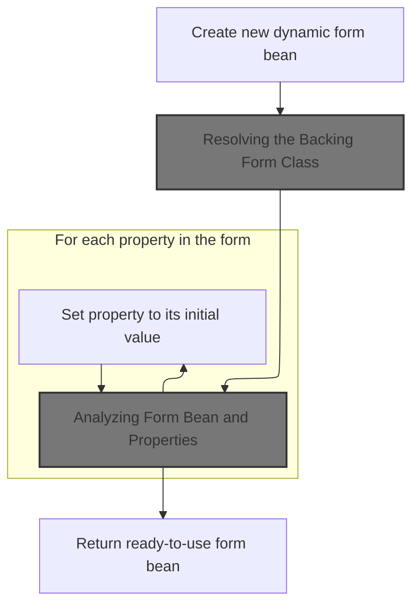
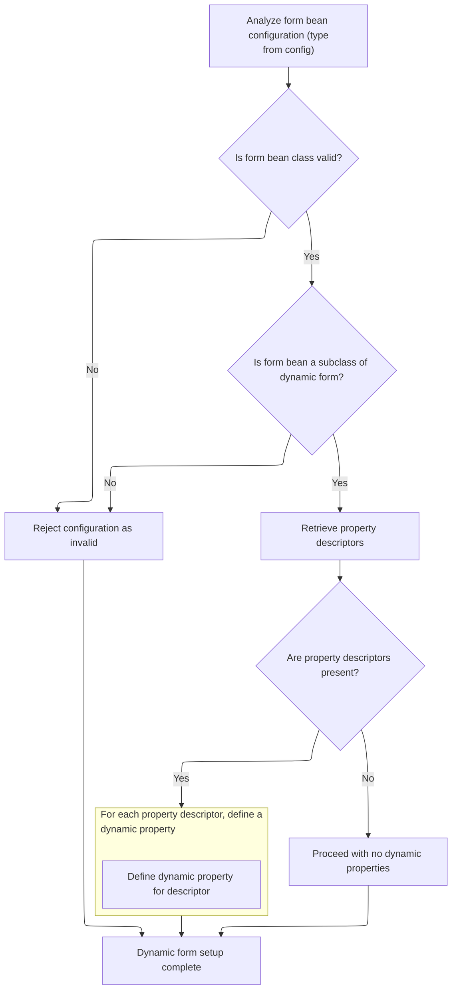

This document explains how the system creates a dynamic form instance from configuration. The process interprets property definitions and produces a form ready to collect user input, supporting flexible and reusable form handling.

# Creating a Dynamic Form Instance



<SwmSnippet path="/core/src/main/java/org/apache/struts/action/DynaActionFormClass.java" line="158">

---

In <SwmToken path="core/src/main/java/org/apache/struts/action/DynaActionFormClass.java" pos="158:5:5" line-data="    public DynaBean newInstance()">`newInstance`</SwmToken>, we create a new <SwmToken path="core/src/main/java/org/apache/struts/action/DynaActionFormClass.java" pos="160:1:1" line-data="        DynaActionForm dynaBean = (DynaActionForm) getBeanClass().newInstance();">`DynaActionForm`</SwmToken> by instantiating the class returned from <SwmToken path="core/src/main/java/org/apache/struts/action/DynaActionFormClass.java" pos="160:11:11" line-data="        DynaActionForm dynaBean = (DynaActionForm) getBeanClass().newInstance();">`getBeanClass`</SwmToken>. We call <SwmToken path="core/src/main/java/org/apache/struts/action/DynaActionFormClass.java" pos="160:11:11" line-data="        DynaActionForm dynaBean = (DynaActionForm) getBeanClass().newInstance();">`getBeanClass`</SwmToken> here to make sure we're using the right implementation class, which could be set up lazily based on the config.

```java
    public DynaBean newInstance()
        throws IllegalAccessException, InstantiationException {
        DynaActionForm dynaBean = (DynaActionForm) getBeanClass().newInstance();

```

---

</SwmSnippet>

## Resolving the Backing Form Class

<SwmSnippet path="/core/src/main/java/org/apache/struts/action/DynaActionFormClass.java" line="227">

---

<SwmToken path="core/src/main/java/org/apache/struts/action/DynaActionFormClass.java" pos="227:5:5" line-data="    protected Class getBeanClass() {">`getBeanClass`</SwmToken> checks if <SwmToken path="core/src/main/java/org/apache/struts/action/DynaActionFormClass.java" pos="228:4:4" line-data="        if (beanClass == null) {">`beanClass`</SwmToken> is already set; if not, it calls introspect(config) to load and validate the class based on the current config. This means we only do the work of setting up the bean class when it's actually needed.

```java
    protected Class getBeanClass() {
        if (beanClass == null) {
            introspect(config);
        }

        return (beanClass);
    }
```

---

</SwmSnippet>

## Analyzing Form Bean and Properties



<SwmSnippet path="/core/src/main/java/org/apache/struts/action/DynaActionFormClass.java" line="246">

---

<SwmToken path="core/src/main/java/org/apache/struts/action/DynaActionFormClass.java" pos="246:5:5" line-data="    protected void introspect(FormBeanConfig config) {">`introspect`</SwmToken> loads the form bean class, checks it's a <SwmToken path="core/src/main/java/org/apache/struts/action/DynaActionFormClass.java" pos="260:5:5" line-data="        if (!DynaActionForm.class.isAssignableFrom(beanClass)) {">`DynaActionForm`</SwmToken>, sets the bean's name, and builds up the property definitions from the config. For each property, it uses <SwmToken path="core/src/main/java/org/apache/struts/action/DynaActionFormClass.java" pos="282:6:6" line-data="                    descriptors[i].getTypeClass());">`getTypeClass`</SwmToken> to figure out the actual Java type, which is needed for dynamic property handling.

```java
    protected void introspect(FormBeanConfig config) {
        this.config = config;

        // Validate the ActionFormBean implementation class
        try {
            beanClass = RequestUtils.applicationClass(config.getType());
        } catch (Throwable t) {
        	IllegalArgumentException t2 = new IllegalArgumentException(
                "Cannot instantiate ActionFormBean class '" + config.getType()
                + "'");
        	t2.initCause(t);
        	throw t2;
        }

        if (!DynaActionForm.class.isAssignableFrom(beanClass)) {
            throw new IllegalArgumentException("Class '" + config.getType()
                + "' is not a subclass of "
                + "'org.apache.struts.action.DynaActionForm'");
        }

        // Set the name we will know ourselves by from the form bean name
        this.name = config.getName();

        // Look up the property descriptors for this bean class
        FormPropertyConfig[] descriptors = config.findFormPropertyConfigs();

        if (descriptors == null) {
            descriptors = new FormPropertyConfig[0];
        }

        // Create corresponding dynamic property definitions
        properties = new DynaProperty[descriptors.length];

        for (int i = 0; i < descriptors.length; i++) {
            properties[i] =
                new DynaProperty(descriptors[i].getName(),
                    descriptors[i].getTypeClass());
            propertiesMap.put(properties[i].getName(), properties[i]);
        }
    }
```

---

</SwmSnippet>

<SwmSnippet path="/core/src/main/java/org/apache/struts/config/FormPropertyConfig.java" line="221">

---

<SwmToken path="core/src/main/java/org/apache/struts/config/FormPropertyConfig.java" pos="221:5:5" line-data="    public Class getTypeClass() {">`getTypeClass`</SwmToken> figures out the Java Class for a property type, handling primitives, arrays, and custom types. This info is used by <SwmToken path="core/src/main/java/org/apache/struts/action/DynaActionFormClass.java" pos="45:4:4" line-data="public class DynaActionFormClass implements DynaClass, Serializable {">`DynaActionFormClass`</SwmToken> to set up the dynamic properties when creating a new instance.

```java
    public Class getTypeClass() {
        // Identify the base class (in case an array was specified)
        String baseType = getType();
        boolean indexed = false;

        if (baseType.endsWith("[]")) {
            baseType = baseType.substring(0, baseType.length() - 2);
            indexed = true;
        }

        // Construct an appropriate Class instance for the base class
        Class baseClass = null;

        if ("boolean".equals(baseType)) {
            baseClass = Boolean.TYPE;
        } else if ("byte".equals(baseType)) {
            baseClass = Byte.TYPE;
        } else if ("char".equals(baseType)) {
            baseClass = Character.TYPE;
        } else if ("double".equals(baseType)) {
            baseClass = Double.TYPE;
        } else if ("float".equals(baseType)) {
            baseClass = Float.TYPE;
        } else if ("int".equals(baseType)) {
            baseClass = Integer.TYPE;
        } else if ("long".equals(baseType)) {
            baseClass = Long.TYPE;
        } else if ("short".equals(baseType)) {
            baseClass = Short.TYPE;
        } else {
            ClassLoader classLoader =
                Thread.currentThread().getContextClassLoader();

            if (classLoader == null) {
                classLoader = this.getClass().getClassLoader();
            }

            try {
                baseClass = classLoader.loadClass(baseType);
            } catch (ClassNotFoundException ex) {
                log.error("Class '" + baseType +
                          "' not found for property '" + name + "'");
                baseClass = null;
            }
        }

        // Return the base class or an array appropriately
        if (indexed) {
            return (Array.newInstance(baseClass, 0).getClass());
        } else {
            return (baseClass);
        }
    }
```

---

</SwmSnippet>

## Populating the Dynamic Form Instance

<SwmSnippet path="/core/src/main/java/org/apache/struts/action/DynaActionFormClass.java" line="162">

---

Back in DynaActionFormClass.newInstance, after getting the bean class, we set up the new <SwmToken path="core/src/main/java/org/apache/struts/action/DynaActionFormClass.java" pos="160:1:1" line-data="        DynaActionForm dynaBean = (DynaActionForm) getBeanClass().newInstance();">`DynaActionForm`</SwmToken> with a reference to this class and populate its properties using the config. For each property, we use <SwmToken path="core/src/main/java/org/apache/struts/action/DynaActionFormClass.java" pos="164:1:1" line-data="        FormPropertyConfig[] props = config.findFormPropertyConfigs();">`FormPropertyConfig`</SwmToken> to get the name and initial value, so the bean starts with the right defaults.

```java
        dynaBean.setDynaActionFormClass(this);

        FormPropertyConfig[] props = config.findFormPropertyConfigs();

        for (int i = 0; i < props.length; i++) {
            dynaBean.set(props[i].getName(), props[i].initial());
        }

        return (dynaBean);
    }
```

---

</SwmSnippet>

&nbsp;

*This is an auto-generated document by Swimm 🌊 and has not yet been verified by a human*

<SwmMeta version="3.0.0" repo-id="Z2l0aHViJTNBJTNBc3RydXRzMSUzQSUzQVN3aW1tLURlbW8=" repo-name="struts1"><sup>Powered by [Swimm](https://app.swimm.io/)</sup></SwmMeta>
