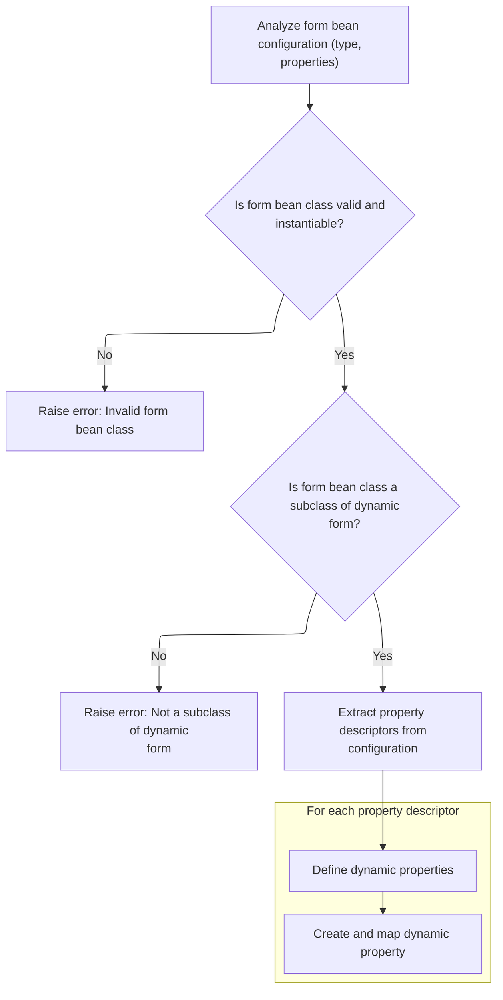
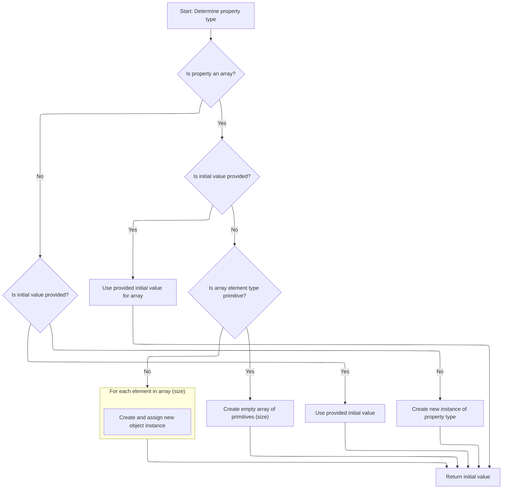

This document describes how a new dynamic form instance is created based on configuration. The process analyzes the form bean's type and property definitions, generates a new form object, and initializes each property to its starting value. This enables flexible and dynamic form handling.

# Creating a Dynamic Form Instance

<SwmSnippet path="/core/src/main/java/org/apache/struts/action/DynaActionFormClass.java" line="158">

---

In <SwmToken path="core/src/main/java/org/apache/struts/action/DynaActionFormClass.java" pos="158:5:5" line-data="    public DynaBean newInstance()">`newInstance`</SwmToken>, we create a new <SwmToken path="core/src/main/java/org/apache/struts/action/DynaActionFormClass.java" pos="160:1:1" line-data="        DynaActionForm dynaBean = (DynaActionForm) getBeanClass().newInstance();">`DynaActionForm`</SwmToken> by instantiating the class returned from <SwmToken path="core/src/main/java/org/apache/struts/action/DynaActionFormClass.java" pos="160:11:11" line-data="        DynaActionForm dynaBean = (DynaActionForm) getBeanClass().newInstance();">`getBeanClass`</SwmToken>. We call <SwmToken path="core/src/main/java/org/apache/struts/action/DynaActionFormClass.java" pos="160:11:11" line-data="        DynaActionForm dynaBean = (DynaActionForm) getBeanClass().newInstance();">`getBeanClass`</SwmToken> next to make sure we're using the right class type, which could be set up dynamically based on the configuration.

```java
    public DynaBean newInstance()
        throws IllegalAccessException, InstantiationException {
        DynaActionForm dynaBean = (DynaActionForm) getBeanClass().newInstance();

```

---

</SwmSnippet>

## Resolving the Backing Form Class

<SwmSnippet path="/core/src/main/java/org/apache/struts/action/DynaActionFormClass.java" line="227">

---

<SwmToken path="core/src/main/java/org/apache/struts/action/DynaActionFormClass.java" pos="227:5:5" line-data="    protected Class getBeanClass() {">`getBeanClass`</SwmToken> checks if <SwmToken path="core/src/main/java/org/apache/struts/action/DynaActionFormClass.java" pos="228:4:4" line-data="        if (beanClass == null) {">`beanClass`</SwmToken> is already set. If not, it calls introspect to figure out and assign the correct class based on the config. This ensures we always return the right class for dynamic form creation.

```java
    protected Class getBeanClass() {
        if (beanClass == null) {
            introspect(config);
        }

        return (beanClass);
    }
```

---

</SwmSnippet>

## Analyzing Form Bean and Property Types



<SwmSnippet path="/core/src/main/java/org/apache/struts/action/DynaActionFormClass.java" line="246">

---

<SwmToken path="core/src/main/java/org/apache/struts/action/DynaActionFormClass.java" pos="246:5:5" line-data="    protected void introspect(FormBeanConfig config) {">`introspect`</SwmToken> loads the class specified in the config, checks it's a <SwmToken path="core/src/main/java/org/apache/struts/action/DynaActionFormClass.java" pos="260:5:5" line-data="        if (!DynaActionForm.class.isAssignableFrom(beanClass)) {">`DynaActionForm`</SwmToken> subclass, sets the internal name, and builds up the property definitions using <SwmToken path="core/src/main/java/org/apache/struts/action/DynaActionFormClass.java" pos="270:1:1" line-data="        FormPropertyConfig[] descriptors = config.findFormPropertyConfigs();">`FormPropertyConfig`</SwmToken>. We call <SwmToken path="core/src/main/java/org/apache/struts/action/DynaActionFormClass.java" pos="270:1:1" line-data="        FormPropertyConfig[] descriptors = config.findFormPropertyConfigs();">`FormPropertyConfig`</SwmToken> next to resolve the type for each property and set up the dynamic property structure.

```java
    protected void introspect(FormBeanConfig config) {
        this.config = config;

        // Validate the ActionFormBean implementation class
        try {
            beanClass = RequestUtils.applicationClass(config.getType());
        } catch (Throwable t) {
        	IllegalArgumentException t2 = new IllegalArgumentException(
                "Cannot instantiate ActionFormBean class '" + config.getType()
                + "'");
        	t2.initCause(t);
        	throw t2;
        }

        if (!DynaActionForm.class.isAssignableFrom(beanClass)) {
            throw new IllegalArgumentException("Class '" + config.getType()
                + "' is not a subclass of "
                + "'org.apache.struts.action.DynaActionForm'");
        }

        // Set the name we will know ourselves by from the form bean name
        this.name = config.getName();

        // Look up the property descriptors for this bean class
        FormPropertyConfig[] descriptors = config.findFormPropertyConfigs();

        if (descriptors == null) {
            descriptors = new FormPropertyConfig[0];
        }

        // Create corresponding dynamic property definitions
        properties = new DynaProperty[descriptors.length];

        for (int i = 0; i < descriptors.length; i++) {
            properties[i] =
                new DynaProperty(descriptors[i].getName(),
                    descriptors[i].getTypeClass());
            propertiesMap.put(properties[i].getName(), properties[i]);
        }
    }
```

---

</SwmSnippet>

<SwmSnippet path="/core/src/main/java/org/apache/struts/config/FormPropertyConfig.java" line="221">

---

<SwmToken path="core/src/main/java/org/apache/struts/config/FormPropertyConfig.java" pos="221:5:5" line-data="    public Class getTypeClass() {">`getTypeClass`</SwmToken> figures out the Java Class for a property type, handling primitives, arrays, and regular classes. We call DynaActionFormClass.newInstance next to actually use these resolved types when creating and initializing the dynamic form bean.

```java
    public Class getTypeClass() {
        // Identify the base class (in case an array was specified)
        String baseType = getType();
        boolean indexed = false;

        if (baseType.endsWith("[]")) {
            baseType = baseType.substring(0, baseType.length() - 2);
            indexed = true;
        }

        // Construct an appropriate Class instance for the base class
        Class baseClass = null;

        if ("boolean".equals(baseType)) {
            baseClass = Boolean.TYPE;
        } else if ("byte".equals(baseType)) {
            baseClass = Byte.TYPE;
        } else if ("char".equals(baseType)) {
            baseClass = Character.TYPE;
        } else if ("double".equals(baseType)) {
            baseClass = Double.TYPE;
        } else if ("float".equals(baseType)) {
            baseClass = Float.TYPE;
        } else if ("int".equals(baseType)) {
            baseClass = Integer.TYPE;
        } else if ("long".equals(baseType)) {
            baseClass = Long.TYPE;
        } else if ("short".equals(baseType)) {
            baseClass = Short.TYPE;
        } else {
            ClassLoader classLoader =
                Thread.currentThread().getContextClassLoader();

            if (classLoader == null) {
                classLoader = this.getClass().getClassLoader();
            }

            try {
                baseClass = classLoader.loadClass(baseType);
            } catch (ClassNotFoundException ex) {
                log.error("Class '" + baseType +
                          "' not found for property '" + name + "'");
                baseClass = null;
            }
        }

        // Return the base class or an array appropriately
        if (indexed) {
            return (Array.newInstance(baseClass, 0).getClass());
        } else {
            return (baseClass);
        }
    }
```

---

</SwmSnippet>

## Populating the Dynamic Form Properties

<SwmSnippet path="/core/src/main/java/org/apache/struts/action/DynaActionFormClass.java" line="162">

---

Back in DynaActionFormClass.newInstance, after getting the bean class, we set up the <SwmToken path="core/src/main/java/org/apache/struts/action/DynaActionFormClass.java" pos="45:4:4" line-data="public class DynaActionFormClass implements DynaClass, Serializable {">`DynaActionFormClass`</SwmToken> reference and loop through all property configs, initializing each property using FormPropertyConfig.initial. We need to call <SwmToken path="core/src/main/java/org/apache/struts/action/DynaActionFormClass.java" pos="164:1:1" line-data="        FormPropertyConfig[] props = config.findFormPropertyConfigs();">`FormPropertyConfig`</SwmToken> here to get the right starting value for each property.

```java
        dynaBean.setDynaActionFormClass(this);

        FormPropertyConfig[] props = config.findFormPropertyConfigs();

        for (int i = 0; i < props.length; i++) {
            dynaBean.set(props[i].getName(), props[i].initial());
        }

        return (dynaBean);
    }
```

---

</SwmSnippet>

# Determining Initial Property Values



<SwmSnippet path="/core/src/main/java/org/apache/struts/config/FormPropertyConfig.java" line="318">

---

In initial(), we start figuring out the initial value for a property by getting its type class. We need to call <SwmToken path="core/src/main/java/org/apache/struts/config/FormPropertyConfig.java" pos="322:7:7" line-data="            Class clazz = getTypeClass();">`getTypeClass`</SwmToken> next to know what kind of object or array to create or convert to.

```java
    public Object initial() {
        Object initialValue = null;

        try {
            Class clazz = getTypeClass();

```

---

</SwmSnippet>

<SwmSnippet path="/core/src/main/java/org/apache/struts/config/FormPropertyConfig.java" line="324">

---

Just back from <SwmToken path="core/src/main/java/org/apache/struts/action/DynaActionFormClass.java" pos="282:6:6" line-data="                    descriptors[i].getTypeClass());">`getTypeClass`</SwmToken> in initial(), if the type is an array, we either convert the initial value or create a new array. For non-primitive arrays, we loop and instantiate each element so they're not just nulls.

```java
            if (clazz.isArray()) {
                if (initial != null) {
                    initialValue = ConvertUtils.convert(initial, clazz);
                } else {
                    initialValue =
                        Array.newInstance(clazz.getComponentType(), size);

                    if (!(clazz.getComponentType().isPrimitive())) {
                        for (int i = 0; i < size; i++) {
                            try {
                                Array.set(initialValue, i,
                                    clazz.getComponentType().newInstance());
                            } catch (Throwable t) {
                                log.error("Unable to create instance of "
                                    + clazz.getName() + " for property=" + name
                                    + ", type=" + type + ", initial=" + initial
                                    + ", size=" + size + ".");

                                //FIXME: Should we just dump the entire application/module ?
                            }
                        }
```

---

</SwmSnippet>

<SwmSnippet path="/core/src/main/java/org/apache/struts/config/FormPropertyConfig.java" line="348">

---

Finishing up initial(), for non-array types, we convert the initial value if present, or just create a new instance. We return this to DynaActionFormClass.newInstance so it can assign the right starting value to each property.

```java
                if (initial != null) {
                    initialValue = ConvertUtils.convert(initial, clazz);
                } else {
                    initialValue = clazz.newInstance();
                }
            }
        } catch (Throwable t) {
            initialValue = null;
        }

        return (initialValue);
    }
```

---

</SwmSnippet>

&nbsp;

*This is an auto-generated document by Swimm 🌊 and has not yet been verified by a human*

<SwmMeta version="3.0.0" repo-id="Z2l0aHViJTNBJTNBc3RydXRzMSUzQSUzQVN3aW1tLURlbW8=" repo-name="struts1"><sup>Powered by [Swimm](https://app.swimm.io/)</sup></SwmMeta>
