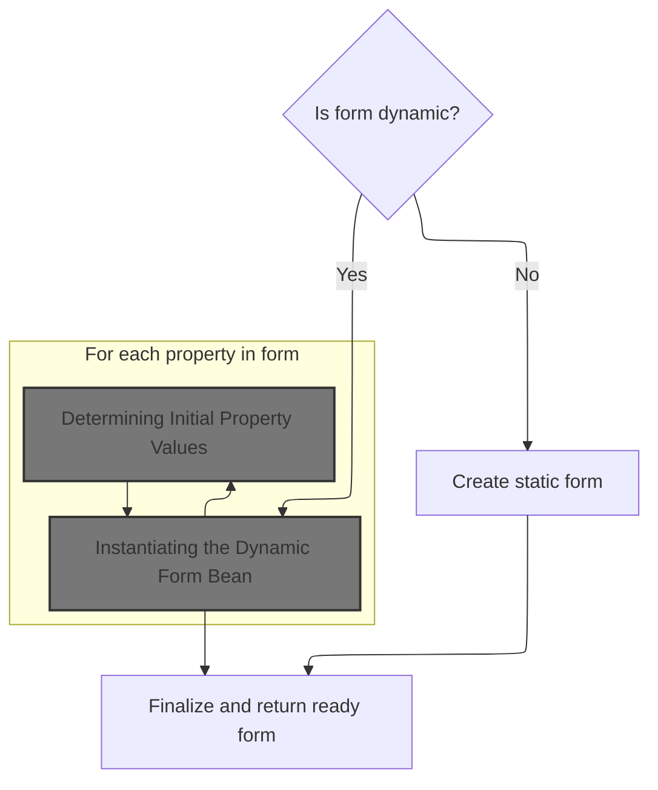
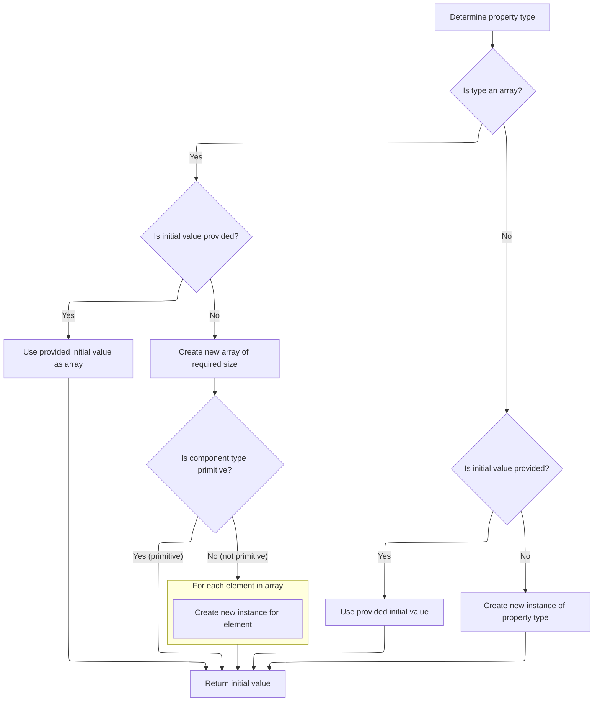

This document describes how a form bean instance is created and configured to capture user input in web requests. The process selects between static and dynamic forms, sets up the necessary class and properties, and prepares the form for validation and use. The flow receives form configuration and servlet context as input, and outputs a ready-to-use form bean.

# Choosing and Instantiating the Form Bean



<SwmSnippet path="/core/src/main/java/org/apache/struts/config/FormBeanConfig.java" line="281">

---

In <SwmToken path="core/src/main/java/org/apache/struts/config/FormBeanConfig.java" pos="281:5:5" line-data="    public ActionForm createActionForm(ActionServlet servlet)">`createActionForm`</SwmToken>, we kick off by checking if the form bean should be dynamic or static. If dynamic, we call DynaActionFormClass.newInstance() to get a runtime-configured bean; otherwise, we instantiate a static class. This sets up the right type of form bean for the rest of the flow, and that's why we need to jump into <SwmToken path="core/src/main/java/org/apache/struts/config/FormBeanConfig.java" pos="31:10:10" line-data="import org.apache.struts.action.DynaActionFormClass;">`DynaActionFormClass`</SwmToken> next—to handle the dynamic case.

```java
    public ActionForm createActionForm(ActionServlet servlet)
        throws IllegalAccessException, InstantiationException {
        Object obj = null;

        // Create a new form bean instance
        if (getDynamic()) {
            obj = getDynaActionFormClass().newInstance();
        } else {
            obj = formBeanClass().newInstance();
        }

```

---

</SwmSnippet>

## Instantiating the Dynamic Form Bean

<SwmSnippet path="/core/src/main/java/org/apache/struts/action/DynaActionFormClass.java" line="158">

---

In <SwmToken path="core/src/main/java/org/apache/struts/action/DynaActionFormClass.java" pos="158:5:5" line-data="    public DynaBean newInstance()">`newInstance`</SwmToken>, we use reflection to create a new <SwmToken path="core/src/main/java/org/apache/struts/action/DynaActionFormClass.java" pos="160:1:1" line-data="        DynaActionForm dynaBean = (DynaActionForm) getBeanClass().newInstance();">`DynaActionForm`</SwmToken> based on the bean class returned by <SwmToken path="core/src/main/java/org/apache/struts/action/DynaActionFormClass.java" pos="160:11:13" line-data="        DynaActionForm dynaBean = (DynaActionForm) getBeanClass().newInstance();">`getBeanClass()`</SwmToken>. This lets us handle forms whose structure is defined at runtime, and that's why we need to call <SwmToken path="core/src/main/java/org/apache/struts/action/DynaActionFormClass.java" pos="160:11:11" line-data="        DynaActionForm dynaBean = (DynaActionForm) getBeanClass().newInstance();">`getBeanClass`</SwmToken> next—to figure out which class to instantiate.

```java
    public DynaBean newInstance()
        throws IllegalAccessException, InstantiationException {
        DynaActionForm dynaBean = (DynaActionForm) getBeanClass().newInstance();

```

---

</SwmSnippet>

### Resolving and Validating the Bean Class

<SwmSnippet path="/core/src/main/java/org/apache/struts/action/DynaActionFormClass.java" line="227">

---

<SwmToken path="core/src/main/java/org/apache/struts/action/DynaActionFormClass.java" pos="227:5:5" line-data="    protected Class getBeanClass() {">`getBeanClass`</SwmToken> checks if the bean class is already resolved; if not, it calls introspect to load the class from config, validate it's a <SwmToken path="core/src/main/java/org/apache/struts/action/DynaActionFormClass.java" pos="160:1:1" line-data="        DynaActionForm dynaBean = (DynaActionForm) getBeanClass().newInstance();">`DynaActionForm`</SwmToken>, and set up property descriptors. This step ensures we're working with a valid dynamic form bean class before instantiation.

```java
    protected Class getBeanClass() {
        if (beanClass == null) {
            introspect(config);
        }

        return (beanClass);
    }
```

---

</SwmSnippet>

<SwmSnippet path="/core/src/main/java/org/apache/struts/action/DynaActionFormClass.java" line="246">

---

<SwmToken path="core/src/main/java/org/apache/struts/action/DynaActionFormClass.java" pos="246:5:5" line-data="    protected void introspect(FormBeanConfig config) {">`introspect`</SwmToken> loads the class from config, checks it's a <SwmToken path="core/src/main/java/org/apache/struts/action/DynaActionFormClass.java" pos="260:5:5" line-data="        if (!DynaActionForm.class.isAssignableFrom(beanClass)) {">`DynaActionForm`</SwmToken>, and builds up the dynamic property definitions from the property configs. This sets up the metadata needed for the dynamic bean instantiation.

```java
    protected void introspect(FormBeanConfig config) {
        this.config = config;

        // Validate the ActionFormBean implementation class
        try {
            beanClass = RequestUtils.applicationClass(config.getType());
        } catch (Throwable t) {
        	IllegalArgumentException t2 = new IllegalArgumentException(
                "Cannot instantiate ActionFormBean class '" + config.getType()
                + "'");
        	t2.initCause(t);
        	throw t2;
        }

        if (!DynaActionForm.class.isAssignableFrom(beanClass)) {
            throw new IllegalArgumentException("Class '" + config.getType()
                + "' is not a subclass of "
                + "'org.apache.struts.action.DynaActionForm'");
        }

        // Set the name we will know ourselves by from the form bean name
        this.name = config.getName();

        // Look up the property descriptors for this bean class
        FormPropertyConfig[] descriptors = config.findFormPropertyConfigs();

        if (descriptors == null) {
            descriptors = new FormPropertyConfig[0];
        }

        // Create corresponding dynamic property definitions
        properties = new DynaProperty[descriptors.length];

        for (int i = 0; i < descriptors.length; i++) {
            properties[i] =
                new DynaProperty(descriptors[i].getName(),
                    descriptors[i].getTypeClass());
            propertiesMap.put(properties[i].getName(), properties[i]);
        }
```

---

</SwmSnippet>

### Initializing Dynamic Bean Properties

<SwmSnippet path="/core/src/main/java/org/apache/struts/action/DynaActionFormClass.java" line="162">

---

Back in DynaActionFormClass.newInstance, we link the new bean to its class metadata and initialize its properties using FormPropertyConfig.initial. We need to call <SwmToken path="core/src/main/java/org/apache/struts/action/DynaActionFormClass.java" pos="164:1:1" line-data="        FormPropertyConfig[] props = config.findFormPropertyConfigs();">`FormPropertyConfig`</SwmToken> next to figure out what the initial values for each property should be.

```java
        dynaBean.setDynaActionFormClass(this);

        FormPropertyConfig[] props = config.findFormPropertyConfigs();

        for (int i = 0; i < props.length; i++) {
            dynaBean.set(props[i].getName(), props[i].initial());
        }

        return (dynaBean);
    }
```

---

</SwmSnippet>

## Determining Initial Property Values



<SwmSnippet path="/core/src/main/java/org/apache/struts/config/FormPropertyConfig.java" line="318">

---

In <SwmToken path="core/src/main/java/org/apache/struts/config/FormPropertyConfig.java" pos="318:5:5" line-data="    public Object initial() {">`initial`</SwmToken>, we check if the property type is an array or not. If it's an array, we either convert the 'initial' value or build a new array and fill it. For non-arrays, we convert or instantiate as needed. The fields 'initial', 'size', 'name', and 'type' all affect how this works, but aren't obvious from the method signature.

```java
    public Object initial() {
        Object initialValue = null;

        try {
            Class clazz = getTypeClass();

            if (clazz.isArray()) {
                if (initial != null) {
                    initialValue = ConvertUtils.convert(initial, clazz);
                } else {
                    initialValue =
                        Array.newInstance(clazz.getComponentType(), size);

                    if (!(clazz.getComponentType().isPrimitive())) {
                        for (int i = 0; i < size; i++) {
                            try {
                                Array.set(initialValue, i,
                                    clazz.getComponentType().newInstance());
                            } catch (Throwable t) {
                                log.error("Unable to create instance of "
                                    + clazz.getName() + " for property=" + name
                                    + ", type=" + type + ", initial=" + initial
                                    + ", size=" + size + ".");

                                //FIXME: Should we just dump the entire application/module ?
                            }
                        }
```

---

</SwmSnippet>

<SwmSnippet path="/core/src/main/java/org/apache/struts/config/FormPropertyConfig.java" line="348">

---

The return from <SwmToken path="core/src/main/java/org/apache/struts/config/FormPropertyConfig.java" pos="348:4:4" line-data="                if (initial != null) {">`initial`</SwmToken> is either a converted value, a new instance, or an array (with elements initialized as needed). If anything fails, it returns null. This result is used to set up the initial state of each property in the form bean.

```java
                if (initial != null) {
                    initialValue = ConvertUtils.convert(initial, clazz);
                } else {
                    initialValue = clazz.newInstance();
                }
            }
        } catch (Throwable t) {
            initialValue = null;
        }

        return (initialValue);
    }
```

---

</SwmSnippet>

## Wrapping and Configuring the Form Bean

```mermaid
%%{init: {"flowchart": {"defaultRenderer": "elk"}} }%%
flowchart TD
    node1["Start: Prepare form object"] --> node2{"Is object already a form?"}
    click node1 openCode "core/src/main/java/org/apache/struts/config/FormBeanConfig.java:292:294"
    node2 -->|"Yes"| node3["Use object as form (ActionForm)"]
    click node2 openCode "core/src/main/java/org/apache/struts/config/FormBeanConfig.java:294:296"
    node2 -->|"No"| node4["Wrap object as BeanValidatorForm"]
    click node3 openCode "core/src/main/java/org/apache/struts/config/FormBeanConfig.java:295:296"
    click node4 openCode "core/src/main/java/org/apache/struts/config/FormBeanConfig.java:297:298"
    node3 --> node5["Set servlet on form"]
    node4 --> node5
    click node5 openCode "core/src/main/java/org/apache/struts/config/FormBeanConfig.java:300:301"
    node5 --> node6{"Is form a dynamic bean?"}
    click node6 openCode "core/src/main/java/org/apache/struts/config/FormBeanConfig.java:302:303"
    node6 -->|"Yes"| node7["Allow property setup (unrestricted)"]
    click node7 openCode "core/src/main/java/org/apache/struts/config/FormBeanConfig.java:309:309"
    node7 --> node8
    subgraph loop1["For each property in form configuration"]
      node8["Add property and set initial value"]
      click node8 openCode "core/src/main/java/org/apache/struts/config/FormBeanConfig.java:313:316"
    end
    node8 --> node9["Restrict property changes if needed"]
    click node9 openCode "core/src/main/java/org/apache/struts/config/FormBeanConfig.java:318:319"
    node9 --> node10{"Is form a BeanValidatorForm?"}
    click node10 openCode "core/src/main/java/org/apache/struts/config/FormBeanConfig.java:321:321"
    node6 -->|"No"| node10
    node10 -->|"Yes"| node11["Initialize validation"]
    click node11 openCode "core/src/main/java/org/apache/struts/config/FormBeanConfig.java:322:323"
    node10 -->|"No"| node12["Return configured form"]
    click node12 openCode "core/src/main/java/org/apache/struts/config/FormBeanConfig.java:325:326"
    node11 --> node12

classDef HeadingStyle fill:#777777,stroke:#333,stroke-width:2px;

%% Swimm:
%% %%{init: {"flowchart": {"defaultRenderer": "elk"}} }%%
%% flowchart TD
%%     node1["Start: Prepare form object"] --> node2{"Is object already a form?"}
%%     click node1 openCode "<SwmPath>[core/…/config/FormBeanConfig.java](core/src/main/java/org/apache/struts/config/FormBeanConfig.java)</SwmPath>:292:294"
%%     node2 -->|"Yes"| node3["Use object as form (<SwmToken path="core/src/main/java/org/apache/struts/config/FormBeanConfig.java" pos="281:3:3" line-data="    public ActionForm createActionForm(ActionServlet servlet)">`ActionForm`</SwmToken>)"]
%%     click node2 openCode "<SwmPath>[core/…/config/FormBeanConfig.java](core/src/main/java/org/apache/struts/config/FormBeanConfig.java)</SwmPath>:294:296"
%%     node2 -->|"No"| node4["Wrap object as <SwmToken path="core/src/main/java/org/apache/struts/config/FormBeanConfig.java" pos="297:7:7" line-data="            form = new BeanValidatorForm(obj);">`BeanValidatorForm`</SwmToken>"]
%%     click node3 openCode "<SwmPath>[core/…/config/FormBeanConfig.java](core/src/main/java/org/apache/struts/config/FormBeanConfig.java)</SwmPath>:295:296"
%%     click node4 openCode "<SwmPath>[core/…/config/FormBeanConfig.java](core/src/main/java/org/apache/struts/config/FormBeanConfig.java)</SwmPath>:297:298"
%%     node3 --> node5["Set servlet on form"]
%%     node4 --> node5
%%     click node5 openCode "<SwmPath>[core/…/config/FormBeanConfig.java](core/src/main/java/org/apache/struts/config/FormBeanConfig.java)</SwmPath>:300:301"
%%     node5 --> node6{"Is form a dynamic bean?"}
%%     click node6 openCode "<SwmPath>[core/…/config/FormBeanConfig.java](core/src/main/java/org/apache/struts/config/FormBeanConfig.java)</SwmPath>:302:303"
%%     node6 -->|"Yes"| node7["Allow property setup (unrestricted)"]
%%     click node7 openCode "<SwmPath>[core/…/config/FormBeanConfig.java](core/src/main/java/org/apache/struts/config/FormBeanConfig.java)</SwmPath>:309:309"
%%     node7 --> node8
%%     subgraph loop1["For each property in form configuration"]
%%       node8["Add property and set initial value"]
%%       click node8 openCode "<SwmPath>[core/…/config/FormBeanConfig.java](core/src/main/java/org/apache/struts/config/FormBeanConfig.java)</SwmPath>:313:316"
%%     end
%%     node8 --> node9["Restrict property changes if needed"]
%%     click node9 openCode "<SwmPath>[core/…/config/FormBeanConfig.java](core/src/main/java/org/apache/struts/config/FormBeanConfig.java)</SwmPath>:318:319"
%%     node9 --> node10{"Is form a <SwmToken path="core/src/main/java/org/apache/struts/config/FormBeanConfig.java" pos="297:7:7" line-data="            form = new BeanValidatorForm(obj);">`BeanValidatorForm`</SwmToken>?"}
%%     click node10 openCode "<SwmPath>[core/…/config/FormBeanConfig.java](core/src/main/java/org/apache/struts/config/FormBeanConfig.java)</SwmPath>:321:321"
%%     node6 -->|"No"| node10
%%     node10 -->|"Yes"| node11["Initialize validation"]
%%     click node11 openCode "<SwmPath>[core/…/config/FormBeanConfig.java](core/src/main/java/org/apache/struts/config/FormBeanConfig.java)</SwmPath>:322:323"
%%     node10 -->|"No"| node12["Return configured form"]
%%     click node12 openCode "<SwmPath>[core/…/config/FormBeanConfig.java](core/src/main/java/org/apache/struts/config/FormBeanConfig.java)</SwmPath>:325:326"
%%     node11 --> node12
%% 
%% classDef HeadingStyle fill:#777777,stroke:#333,stroke-width:2px;
```



<SwmSnippet path="/core/src/main/java/org/apache/struts/config/FormBeanConfig.java" line="292">

---

Just returned from DynaActionFormClass.newInstance, FormBeanConfig.createActionForm checks if the object is an <SwmToken path="core/src/main/java/org/apache/struts/config/FormBeanConfig.java" pos="292:1:1" line-data="        ActionForm form = null;">`ActionForm`</SwmToken>. If not, it wraps it in <SwmToken path="core/src/main/java/org/apache/struts/config/FormBeanConfig.java" pos="297:7:7" line-data="            form = new BeanValidatorForm(obj);">`BeanValidatorForm`</SwmToken>. For dynamic beans, it adds properties and sets initial values, temporarily lifting restrictions to do so. This keeps everything compatible with Struts form handling.

```java
        ActionForm form = null;

        if (obj instanceof ActionForm) {
            form = (ActionForm) obj;
        } else {
            form = new BeanValidatorForm(obj);
        }

        form.setServlet(servlet);

        if (form instanceof DynaBean
            && ((DynaBean) form).getDynaClass() instanceof MutableDynaClass) {
            DynaBean dynaBean = (DynaBean) form;
            MutableDynaClass dynaClass =
                (MutableDynaClass) dynaBean.getDynaClass();

            // Add properties
            dynaClass.setRestricted(false);

            FormPropertyConfig[] props = findFormPropertyConfigs();

            for (int i = 0; i < props.length; i++) {
                dynaClass.add(props[i].getName(), props[i].getTypeClass());
                dynaBean.set(props[i].getName(), props[i].initial());
            }
```

---

</SwmSnippet>

<SwmSnippet path="/core/src/main/java/org/apache/struts/config/FormBeanConfig.java" line="318">

---

The return from <SwmToken path="core/src/main/java/org/apache/struts/config/FormBeanConfig.java" pos="281:5:5" line-data="    public ActionForm createActionForm(ActionServlet servlet)">`createActionForm`</SwmToken> is always an <SwmToken path="core/src/main/java/org/apache/struts/config/FormBeanConfig.java" pos="281:3:3" line-data="    public ActionForm createActionForm(ActionServlet servlet)">`ActionForm`</SwmToken>—either the original object or a <SwmToken path="core/src/main/java/org/apache/struts/config/FormBeanConfig.java" pos="321:8:8" line-data="        if (form instanceof BeanValidatorForm) {">`BeanValidatorForm`</SwmToken> wrapper. Dynamic properties are set up and initialized, and validation is configured if needed. This makes the form ready for use in Struts.

```java
            dynaClass.setRestricted(isRestricted());
        }

        if (form instanceof BeanValidatorForm) {
            ((BeanValidatorForm)form).initialize(this);
        }

        return form;
    }
```

---

</SwmSnippet>

&nbsp;

*This is an auto-generated document by Swimm 🌊 and has not yet been verified by a human*

<SwmMeta version="3.0.0" repo-id="Z2l0aHViJTNBJTNBc3RydXRzMSUzQSUzQVN3aW1tLURlbW8=" repo-name="struts1"><sup>Powered by [Swimm](https://app.swimm.io/)</sup></SwmMeta>
