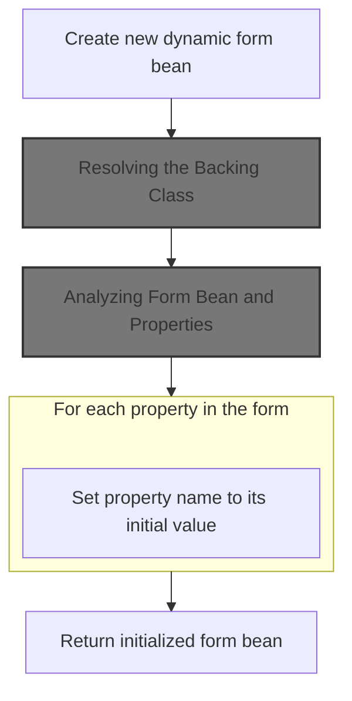
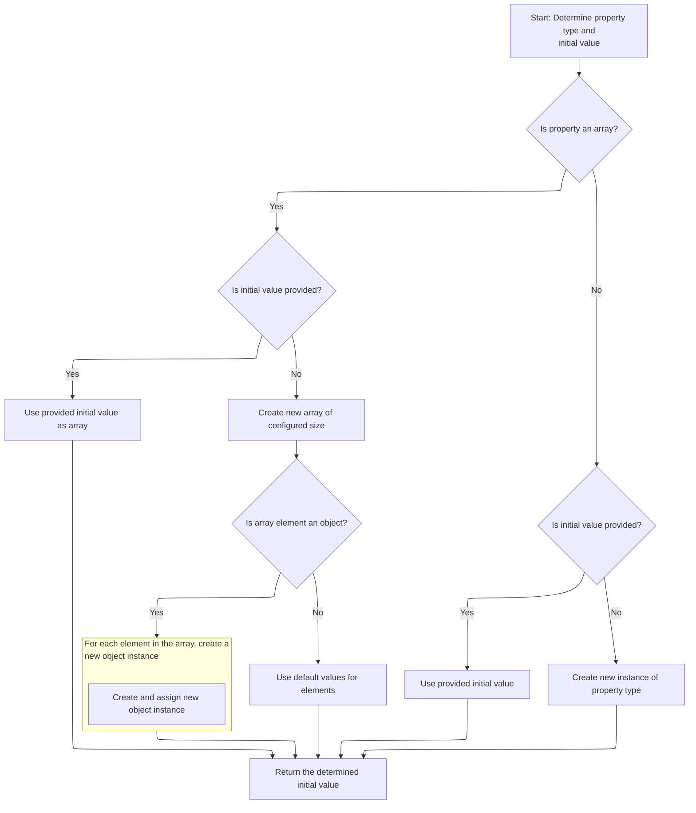

This document describes how a dynamic form instance is created and initialized. The flow starts with a form bean configuration, resolves the appropriate backing class, analyzes the defined properties, and sets each property to its initial value. The result is a fully initialized form instance that supports flexible and configurable form definitions.

# Creating a Dynamic Form Instance



<SwmSnippet path="/core/src/main/java/org/apache/struts/action/DynaActionFormClass.java" line="158">

---

In <SwmToken path="core/src/main/java/org/apache/struts/action/DynaActionFormClass.java" pos="158:5:5" line-data="    public DynaBean newInstance()">`newInstance`</SwmToken>, we use <SwmToken path="core/src/main/java/org/apache/struts/action/DynaActionFormClass.java" pos="160:11:13" line-data="        DynaActionForm dynaBean = (DynaActionForm) getBeanClass().newInstance();">`getBeanClass()`</SwmToken><SwmToken path="core/src/main/java/org/apache/struts/action/DynaActionFormClass.java" pos="160:14:17" line-data="        DynaActionForm dynaBean = (DynaActionForm) getBeanClass().newInstance();">`.newInstance()`</SwmToken> to create a new <SwmToken path="core/src/main/java/org/apache/struts/action/DynaActionFormClass.java" pos="160:1:1" line-data="        DynaActionForm dynaBean = (DynaActionForm) getBeanClass().newInstance();">`DynaActionForm`</SwmToken> via reflection. This means the actual class is picked based on config, not hardcoded. We call <SwmToken path="core/src/main/java/org/apache/struts/action/DynaActionFormClass.java" pos="160:11:11" line-data="        DynaActionForm dynaBean = (DynaActionForm) getBeanClass().newInstance();">`getBeanClass`</SwmToken> next to make sure we have the right class loaded and ready for instantiation.

```java
    public DynaBean newInstance()
        throws IllegalAccessException, InstantiationException {
        DynaActionForm dynaBean = (DynaActionForm) getBeanClass().newInstance();

```

---

</SwmSnippet>

## Resolving the Backing Class

<SwmSnippet path="/core/src/main/java/org/apache/struts/action/DynaActionFormClass.java" line="227">

---

<SwmToken path="core/src/main/java/org/apache/struts/action/DynaActionFormClass.java" pos="227:5:5" line-data="    protected Class getBeanClass() {">`getBeanClass`</SwmToken> checks if we've already resolved the class for this form. If not, it calls introspect(config) to load and validate the class, then returns it. This avoids reloading and revalidating the class every time.

```java
    protected Class getBeanClass() {
        if (beanClass == null) {
            introspect(config);
        }

        return (beanClass);
    }
```

---

</SwmSnippet>

## Analyzing Form Bean and Properties

```mermaid
%%{init: {"flowchart": {"defaultRenderer": "elk"}} }%%
flowchart TD
  node1["Analyze form bean configuration (type,
properties)"] --> node2{"Can form bean class be instantiated?"}
  click node1 openCode "core/src/main/java/org/apache/struts/action/DynaActionFormClass.java:246:251"
  node2 -->|"Yes"| node3{"Is form bean class a valid subclass?"}
  click node2 openCode "core/src/main/java/org/apache/struts/action/DynaActionFormClass.java:251:258"
  node2 -->|"No"| node8["Raise error: Invalid form bean class"]
  click node8 openCode "core/src/main/java/org/apache/struts/action/DynaActionFormClass.java:253:258"
  node3 -->|"Yes"| node4["Set form name and get property
descriptors"]
  click node3 openCode "core/src/main/java/org/apache/struts/action/DynaActionFormClass.java:260:271"
  node3 -->|"No"| node9["Raise error: Not a valid subclass"]
  click node9 openCode "core/src/main/java/org/apache/struts/action/DynaActionFormClass.java:261:264"
  node4 --> node5{"Are property descriptors present?"}
  click node4 openCode "core/src/main/java/org/apache/struts/action/DynaActionFormClass.java:267:271"
  node5 -->|"No"| node6["Use empty property list"]
  click node6 openCode "core/src/main/java/org/apache/struts/action/DynaActionFormClass.java:272:274"
  node5 -->|"Yes"| node7["Use provided property descriptors"]
  click node7 openCode "core/src/main/java/org/apache/struts/action/DynaActionFormClass.java:270:271"
  node6 --> node10["Create dynamic property definitions"]
  node7 --> node10
  subgraph loop1["For each property descriptor"]
    node10 --> node11["Create dynamic property definition and
add to map"]
    click node11 openCode "core/src/main/java/org/apache/struts/action/DynaActionFormClass.java:279:284"
    node11 --> node10
  end

classDef HeadingStyle fill:#777777,stroke:#333,stroke-width:2px;

%% Swimm:
%% %%{init: {"flowchart": {"defaultRenderer": "elk"}} }%%
%% flowchart TD
%%   node1["Analyze form bean configuration (type,
%% properties)"] --> node2{"Can form bean class be instantiated?"}
%%   click node1 openCode "<SwmPath>[core/…/action/DynaActionFormClass.java](core/src/main/java/org/apache/struts/action/DynaActionFormClass.java)</SwmPath>:246:251"
%%   node2 -->|"Yes"| node3{"Is form bean class a valid subclass?"}
%%   click node2 openCode "<SwmPath>[core/…/action/DynaActionFormClass.java](core/src/main/java/org/apache/struts/action/DynaActionFormClass.java)</SwmPath>:251:258"
%%   node2 -->|"No"| node8["Raise error: Invalid form bean class"]
%%   click node8 openCode "<SwmPath>[core/…/action/DynaActionFormClass.java](core/src/main/java/org/apache/struts/action/DynaActionFormClass.java)</SwmPath>:253:258"
%%   node3 -->|"Yes"| node4["Set form name and get property
%% descriptors"]
%%   click node3 openCode "<SwmPath>[core/…/action/DynaActionFormClass.java](core/src/main/java/org/apache/struts/action/DynaActionFormClass.java)</SwmPath>:260:271"
%%   node3 -->|"No"| node9["Raise error: Not a valid subclass"]
%%   click node9 openCode "<SwmPath>[core/…/action/DynaActionFormClass.java](core/src/main/java/org/apache/struts/action/DynaActionFormClass.java)</SwmPath>:261:264"
%%   node4 --> node5{"Are property descriptors present?"}
%%   click node4 openCode "<SwmPath>[core/…/action/DynaActionFormClass.java](core/src/main/java/org/apache/struts/action/DynaActionFormClass.java)</SwmPath>:267:271"
%%   node5 -->|"No"| node6["Use empty property list"]
%%   click node6 openCode "<SwmPath>[core/…/action/DynaActionFormClass.java](core/src/main/java/org/apache/struts/action/DynaActionFormClass.java)</SwmPath>:272:274"
%%   node5 -->|"Yes"| node7["Use provided property descriptors"]
%%   click node7 openCode "<SwmPath>[core/…/action/DynaActionFormClass.java](core/src/main/java/org/apache/struts/action/DynaActionFormClass.java)</SwmPath>:270:271"
%%   node6 --> node10["Create dynamic property definitions"]
%%   node7 --> node10
%%   subgraph loop1["For each property descriptor"]
%%     node10 --> node11["Create dynamic property definition and
%% add to map"]
%%     click node11 openCode "<SwmPath>[core/…/action/DynaActionFormClass.java](core/src/main/java/org/apache/struts/action/DynaActionFormClass.java)</SwmPath>:279:284"
%%     node11 --> node10
%%   end
%% 
%% classDef HeadingStyle fill:#777777,stroke:#333,stroke-width:2px;
```



<SwmSnippet path="/core/src/main/java/org/apache/struts/action/DynaActionFormClass.java" line="246">

---

<SwmToken path="core/src/main/java/org/apache/struts/action/DynaActionFormClass.java" pos="246:5:5" line-data="    protected void introspect(FormBeanConfig config) {">`introspect`</SwmToken> loads the form bean class, checks it's a <SwmToken path="core/src/main/java/org/apache/struts/action/DynaActionFormClass.java" pos="260:5:5" line-data="        if (!DynaActionForm.class.isAssignableFrom(beanClass)) {">`DynaActionForm`</SwmToken>, sets the name, and builds up the property definitions from the config. For each property, it uses FormPropertyConfig.getTypeClass to figure out the Java type, so we need to call into <SwmToken path="core/src/main/java/org/apache/struts/action/DynaActionFormClass.java" pos="270:1:1" line-data="        FormPropertyConfig[] descriptors = config.findFormPropertyConfigs();">`FormPropertyConfig`</SwmToken> next.

```java
    protected void introspect(FormBeanConfig config) {
        this.config = config;

        // Validate the ActionFormBean implementation class
        try {
            beanClass = RequestUtils.applicationClass(config.getType());
        } catch (Throwable t) {
        	IllegalArgumentException t2 = new IllegalArgumentException(
                "Cannot instantiate ActionFormBean class '" + config.getType()
                + "'");
        	t2.initCause(t);
        	throw t2;
        }

        if (!DynaActionForm.class.isAssignableFrom(beanClass)) {
            throw new IllegalArgumentException("Class '" + config.getType()
                + "' is not a subclass of "
                + "'org.apache.struts.action.DynaActionForm'");
        }

        // Set the name we will know ourselves by from the form bean name
        this.name = config.getName();

        // Look up the property descriptors for this bean class
        FormPropertyConfig[] descriptors = config.findFormPropertyConfigs();

        if (descriptors == null) {
            descriptors = new FormPropertyConfig[0];
        }

        // Create corresponding dynamic property definitions
        properties = new DynaProperty[descriptors.length];

        for (int i = 0; i < descriptors.length; i++) {
            properties[i] =
                new DynaProperty(descriptors[i].getName(),
                    descriptors[i].getTypeClass());
            propertiesMap.put(properties[i].getName(), properties[i]);
        }
    }
```

---

</SwmSnippet>

<SwmSnippet path="/core/src/main/java/org/apache/struts/config/FormPropertyConfig.java" line="221">

---

<SwmToken path="core/src/main/java/org/apache/struts/config/FormPropertyConfig.java" pos="221:5:5" line-data="    public Class getTypeClass() {">`getTypeClass`</SwmToken> figures out the Java class for a property, handling primitives, arrays, and custom types. Once the property types are resolved, DynaActionFormClass.newInstance can use this info to create and initialize the form bean.

```java
    public Class getTypeClass() {
        // Identify the base class (in case an array was specified)
        String baseType = getType();
        boolean indexed = false;

        if (baseType.endsWith("[]")) {
            baseType = baseType.substring(0, baseType.length() - 2);
            indexed = true;
        }

        // Construct an appropriate Class instance for the base class
        Class baseClass = null;

        if ("boolean".equals(baseType)) {
            baseClass = Boolean.TYPE;
        } else if ("byte".equals(baseType)) {
            baseClass = Byte.TYPE;
        } else if ("char".equals(baseType)) {
            baseClass = Character.TYPE;
        } else if ("double".equals(baseType)) {
            baseClass = Double.TYPE;
        } else if ("float".equals(baseType)) {
            baseClass = Float.TYPE;
        } else if ("int".equals(baseType)) {
            baseClass = Integer.TYPE;
        } else if ("long".equals(baseType)) {
            baseClass = Long.TYPE;
        } else if ("short".equals(baseType)) {
            baseClass = Short.TYPE;
        } else {
            ClassLoader classLoader =
                Thread.currentThread().getContextClassLoader();

            if (classLoader == null) {
                classLoader = this.getClass().getClassLoader();
            }

            try {
                baseClass = classLoader.loadClass(baseType);
            } catch (ClassNotFoundException ex) {
                log.error("Class '" + baseType +
                          "' not found for property '" + name + "'");
                baseClass = null;
            }
        }

        // Return the base class or an array appropriately
        if (indexed) {
            return (Array.newInstance(baseClass, 0).getClass());
        } else {
            return (baseClass);
        }
    }
```

---

</SwmSnippet>

## Initializing the Dynamic Form Properties

<SwmSnippet path="/core/src/main/java/org/apache/struts/action/DynaActionFormClass.java" line="162">

---

Back in DynaActionFormClass.newInstance, after getting the bean class and creating the bean, we link the <SwmToken path="core/src/main/java/org/apache/struts/action/DynaActionFormClass.java" pos="45:4:4" line-data="public class DynaActionFormClass implements DynaClass, Serializable {">`DynaActionFormClass`</SwmToken> to the bean and initialize each property using the initial value from <SwmToken path="core/src/main/java/org/apache/struts/action/DynaActionFormClass.java" pos="164:1:1" line-data="        FormPropertyConfig[] props = config.findFormPropertyConfigs();">`FormPropertyConfig`</SwmToken>. We need to call FormPropertyConfig.initial next to get the actual value for each property.

```java
        dynaBean.setDynaActionFormClass(this);

        FormPropertyConfig[] props = config.findFormPropertyConfigs();

        for (int i = 0; i < props.length; i++) {
            dynaBean.set(props[i].getName(), props[i].initial());
        }

        return (dynaBean);
    }
```

---

</SwmSnippet>

# Calculating Initial Property Values



<SwmSnippet path="/core/src/main/java/org/apache/struts/config/FormPropertyConfig.java" line="318">

---

In <SwmToken path="core/src/main/java/org/apache/struts/config/FormPropertyConfig.java" pos="318:5:5" line-data="    public Object initial() {">`initial`</SwmToken>, we start by getting the type class for the property. If it's an array, we check if there's an initial value to convert; otherwise, we create a new array and (for non-primitives) instantiate each element. Next, we need to handle the rest of the initialization logic for non-array types.

```java
    public Object initial() {
        Object initialValue = null;

        try {
            Class clazz = getTypeClass();

```

---

</SwmSnippet>

<SwmSnippet path="/core/src/main/java/org/apache/struts/config/FormPropertyConfig.java" line="324">

---

We just returned from the array handling logic in FormPropertyConfig.initial. If the property isn't an array, we now check for an initial value to convert or instantiate the type directly. This covers the rest of the property initialization cases.

```java
            if (clazz.isArray()) {
                if (initial != null) {
                    initialValue = ConvertUtils.convert(initial, clazz);
                } else {
                    initialValue =
                        Array.newInstance(clazz.getComponentType(), size);

                    if (!(clazz.getComponentType().isPrimitive())) {
                        for (int i = 0; i < size; i++) {
                            try {
                                Array.set(initialValue, i,
                                    clazz.getComponentType().newInstance());
                            } catch (Throwable t) {
                                log.error("Unable to create instance of "
                                    + clazz.getName() + " for property=" + name
                                    + ", type=" + type + ", initial=" + initial
                                    + ", size=" + size + ".");

                                //FIXME: Should we just dump the entire application/module ?
                            }
                        }
```

---

</SwmSnippet>

<SwmSnippet path="/core/src/main/java/org/apache/struts/config/FormPropertyConfig.java" line="348">

---

We finish up FormPropertyConfig.initial by handling non-array types: if there's an initial value, we convert it; otherwise, we instantiate the type. If anything fails, we just return null. DynaActionFormClass.newInstance will use this value to set up the property on the bean.

```java
                if (initial != null) {
                    initialValue = ConvertUtils.convert(initial, clazz);
                } else {
                    initialValue = clazz.newInstance();
                }
            }
        } catch (Throwable t) {
            initialValue = null;
        }

        return (initialValue);
    }
```

---

</SwmSnippet>

&nbsp;

*This is an auto-generated document by Swimm 🌊 and has not yet been verified by a human*

<SwmMeta version="3.0.0" repo-id="Z2l0aHViJTNBJTNBc3RydXRzMSUzQSUzQVN3aW1tLURlbW8=" repo-name="struts1"><sup>Powered by [Swimm](https://app.swimm.io/)</sup></SwmMeta>
