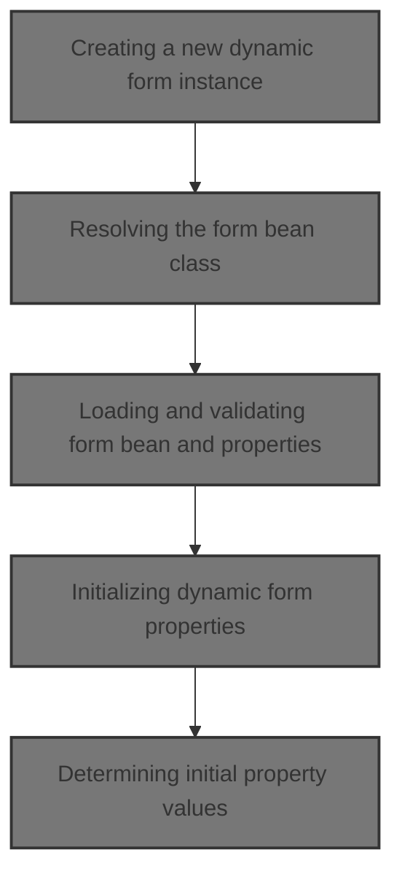
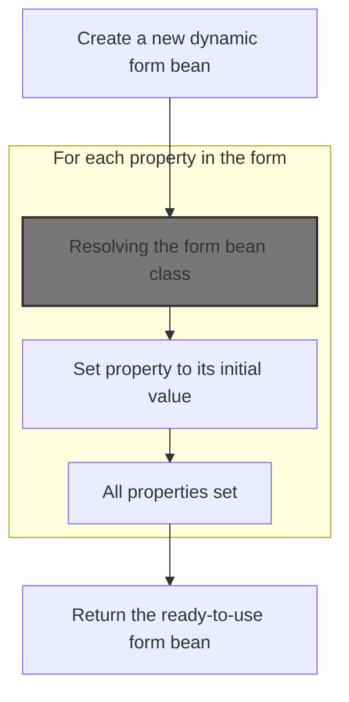
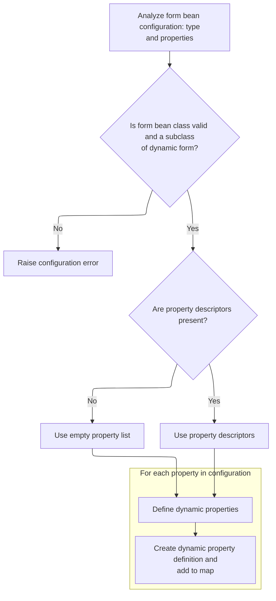
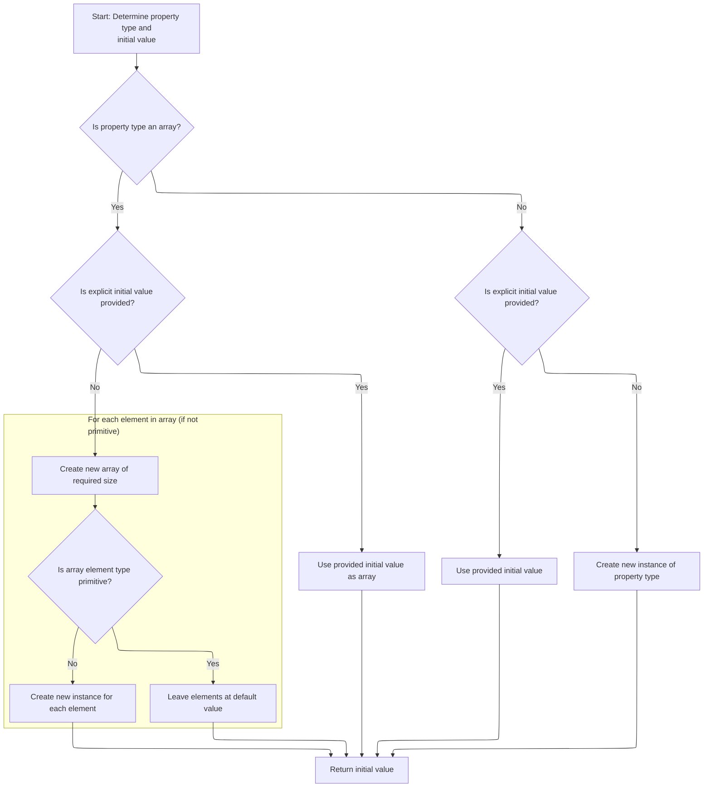

This document describes how a new dynamic form instance is created and initialized based on configuration. The process ensures that the correct form bean class is used, configuration is validated, and all properties are set to their initial values. This enables the application to support flexible forms defined through configuration.



# Creating a new dynamic form instance



<SwmSnippet path="/core/src/main/java/org/apache/struts/action/DynaActionFormClass.java" line="158">

---

In <SwmToken path="core/src/main/java/org/apache/struts/action/DynaActionFormClass.java" pos="158:5:5" line-data="    public DynaBean newInstance()">`newInstance`</SwmToken>, we kick off the creation of a new dynamic form by instantiating the class returned from <SwmToken path="core/src/main/java/org/apache/struts/action/DynaActionFormClass.java" pos="160:11:11" line-data="        DynaActionForm dynaBean = (DynaActionForm) getBeanClass().newInstance();">`getBeanClass`</SwmToken>. We call <SwmToken path="core/src/main/java/org/apache/struts/action/DynaActionFormClass.java" pos="160:11:11" line-data="        DynaActionForm dynaBean = (DynaActionForm) getBeanClass().newInstance();">`getBeanClass`</SwmToken> next to ensure we're using the correct class as defined by the configuration, not just a hardcoded <SwmToken path="core/src/main/java/org/apache/struts/action/DynaActionFormClass.java" pos="160:1:1" line-data="        DynaActionForm dynaBean = (DynaActionForm) getBeanClass().newInstance();">`DynaActionForm`</SwmToken>.

```java
    public DynaBean newInstance()
        throws IllegalAccessException, InstantiationException {
        DynaActionForm dynaBean = (DynaActionForm) getBeanClass().newInstance();

```

---

</SwmSnippet>

## Resolving the form bean class

<SwmSnippet path="/core/src/main/java/org/apache/struts/action/DynaActionFormClass.java" line="227">

---

<SwmToken path="core/src/main/java/org/apache/struts/action/DynaActionFormClass.java" pos="227:5:5" line-data="    protected Class getBeanClass() {">`getBeanClass`</SwmToken> checks if <SwmToken path="core/src/main/java/org/apache/struts/action/DynaActionFormClass.java" pos="228:4:4" line-data="        if (beanClass == null) {">`beanClass`</SwmToken> is already set; if not, it calls introspect to load and validate the class from config. We need introspect here to ensure <SwmToken path="core/src/main/java/org/apache/struts/action/DynaActionFormClass.java" pos="228:4:4" line-data="        if (beanClass == null) {">`beanClass`</SwmToken> is properly initialized based on the current configuration.

```java
    protected Class getBeanClass() {
        if (beanClass == null) {
            introspect(config);
        }

        return (beanClass);
    }
```

---

</SwmSnippet>

## Loading and validating form bean and properties



<SwmSnippet path="/core/src/main/java/org/apache/struts/action/DynaActionFormClass.java" line="246">

---

<SwmToken path="core/src/main/java/org/apache/struts/action/DynaActionFormClass.java" pos="246:5:5" line-data="    protected void introspect(FormBeanConfig config) {">`introspect`</SwmToken> loads the class specified in config, checks it's a <SwmToken path="core/src/main/java/org/apache/struts/action/DynaActionFormClass.java" pos="260:5:5" line-data="        if (!DynaActionForm.class.isAssignableFrom(beanClass)) {">`DynaActionForm`</SwmToken> subclass, sets the internal name, and builds property definitions using <SwmToken path="core/src/main/java/org/apache/struts/action/DynaActionFormClass.java" pos="270:1:1" line-data="        FormPropertyConfig[] descriptors = config.findFormPropertyConfigs();">`FormPropertyConfig`</SwmToken> descriptors. We call <SwmToken path="core/src/main/java/org/apache/struts/action/DynaActionFormClass.java" pos="270:1:1" line-data="        FormPropertyConfig[] descriptors = config.findFormPropertyConfigs();">`FormPropertyConfig`</SwmToken> next to resolve the type class for each property, which is needed to set up the dynamic properties.

```java
    protected void introspect(FormBeanConfig config) {
        this.config = config;

        // Validate the ActionFormBean implementation class
        try {
            beanClass = RequestUtils.applicationClass(config.getType());
        } catch (Throwable t) {
        	IllegalArgumentException t2 = new IllegalArgumentException(
                "Cannot instantiate ActionFormBean class '" + config.getType()
                + "'");
        	t2.initCause(t);
        	throw t2;
        }

        if (!DynaActionForm.class.isAssignableFrom(beanClass)) {
            throw new IllegalArgumentException("Class '" + config.getType()
                + "' is not a subclass of "
                + "'org.apache.struts.action.DynaActionForm'");
        }

        // Set the name we will know ourselves by from the form bean name
        this.name = config.getName();

        // Look up the property descriptors for this bean class
        FormPropertyConfig[] descriptors = config.findFormPropertyConfigs();

        if (descriptors == null) {
            descriptors = new FormPropertyConfig[0];
        }

        // Create corresponding dynamic property definitions
        properties = new DynaProperty[descriptors.length];

        for (int i = 0; i < descriptors.length; i++) {
            properties[i] =
                new DynaProperty(descriptors[i].getName(),
                    descriptors[i].getTypeClass());
            propertiesMap.put(properties[i].getName(), properties[i]);
        }
    }
```

---

</SwmSnippet>

<SwmSnippet path="/core/src/main/java/org/apache/struts/config/FormPropertyConfig.java" line="221">

---

<SwmToken path="core/src/main/java/org/apache/struts/config/FormPropertyConfig.java" pos="221:5:5" line-data="    public Class getTypeClass() {">`getTypeClass`</SwmToken> figures out the Class object for a property, handling primitives, arrays, and loading other types via <SwmToken path="core/src/main/java/org/apache/struts/config/FormPropertyConfig.java" pos="251:1:1" line-data="            ClassLoader classLoader =">`ClassLoader`</SwmToken>. We need this for DynaActionFormClass.newInstance so it knows how to instantiate and initialize each property correctly.

```java
    public Class getTypeClass() {
        // Identify the base class (in case an array was specified)
        String baseType = getType();
        boolean indexed = false;

        if (baseType.endsWith("[]")) {
            baseType = baseType.substring(0, baseType.length() - 2);
            indexed = true;
        }

        // Construct an appropriate Class instance for the base class
        Class baseClass = null;

        if ("boolean".equals(baseType)) {
            baseClass = Boolean.TYPE;
        } else if ("byte".equals(baseType)) {
            baseClass = Byte.TYPE;
        } else if ("char".equals(baseType)) {
            baseClass = Character.TYPE;
        } else if ("double".equals(baseType)) {
            baseClass = Double.TYPE;
        } else if ("float".equals(baseType)) {
            baseClass = Float.TYPE;
        } else if ("int".equals(baseType)) {
            baseClass = Integer.TYPE;
        } else if ("long".equals(baseType)) {
            baseClass = Long.TYPE;
        } else if ("short".equals(baseType)) {
            baseClass = Short.TYPE;
        } else {
            ClassLoader classLoader =
                Thread.currentThread().getContextClassLoader();

            if (classLoader == null) {
                classLoader = this.getClass().getClassLoader();
            }

            try {
                baseClass = classLoader.loadClass(baseType);
            } catch (ClassNotFoundException ex) {
                log.error("Class '" + baseType +
                          "' not found for property '" + name + "'");
                baseClass = null;
            }
        }

        // Return the base class or an array appropriately
        if (indexed) {
            return (Array.newInstance(baseClass, 0).getClass());
        } else {
            return (baseClass);
        }
    }
```

---

</SwmSnippet>

## Initializing dynamic form properties

<SwmSnippet path="/core/src/main/java/org/apache/struts/action/DynaActionFormClass.java" line="162">

---

Back in DynaActionFormClass.newInstance, after getting the bean class, we set up the form instance and initialize its properties using <SwmToken path="core/src/main/java/org/apache/struts/action/DynaActionFormClass.java" pos="164:1:1" line-data="        FormPropertyConfig[] props = config.findFormPropertyConfigs();">`FormPropertyConfig`</SwmToken> descriptors. We call FormPropertyConfig.initial next to get the starting value for each property, which is needed for proper form setup.

```java
        dynaBean.setDynaActionFormClass(this);

        FormPropertyConfig[] props = config.findFormPropertyConfigs();

        for (int i = 0; i < props.length; i++) {
            dynaBean.set(props[i].getName(), props[i].initial());
        }

        return (dynaBean);
    }
```

---

</SwmSnippet>

# Determining initial property values



<SwmSnippet path="/core/src/main/java/org/apache/struts/config/FormPropertyConfig.java" line="318">

---

In <SwmToken path="core/src/main/java/org/apache/struts/config/FormPropertyConfig.java" pos="318:5:5" line-data="    public Object initial() {">`initial`</SwmToken>, we figure out the starting value for a property, using the type class and config fields like 'initial' and 'size'. We call the next part to handle array types and their initialization, since that's a bit more involved.

```java
    public Object initial() {
        Object initialValue = null;

        try {
            Class clazz = getTypeClass();

```

---

</SwmSnippet>

<SwmSnippet path="/core/src/main/java/org/apache/struts/config/FormPropertyConfig.java" line="324">

---

Just returned from FormPropertyConfig.initial, here we handle array types: if 'initial' is set, we convert it; otherwise, we create a new array and fill it with new instances for non-primitives. This avoids nulls in the form bean's property arrays.

```java
            if (clazz.isArray()) {
                if (initial != null) {
                    initialValue = ConvertUtils.convert(initial, clazz);
                } else {
                    initialValue =
                        Array.newInstance(clazz.getComponentType(), size);

                    if (!(clazz.getComponentType().isPrimitive())) {
                        for (int i = 0; i < size; i++) {
                            try {
                                Array.set(initialValue, i,
                                    clazz.getComponentType().newInstance());
                            } catch (Throwable t) {
                                log.error("Unable to create instance of "
                                    + clazz.getName() + " for property=" + name
                                    + ", type=" + type + ", initial=" + initial
                                    + ", size=" + size + ".");

                                //FIXME: Should we just dump the entire application/module ?
                            }
                        }
```

---

</SwmSnippet>

<SwmSnippet path="/core/src/main/java/org/apache/struts/config/FormPropertyConfig.java" line="348">

---

Finishing up FormPropertyConfig.initial, for non-array types we either convert 'initial' or create a new instance. This value is then passed back to DynaActionFormClass.newInstance to set up the property in the dynamic form.

```java
                if (initial != null) {
                    initialValue = ConvertUtils.convert(initial, clazz);
                } else {
                    initialValue = clazz.newInstance();
                }
            }
        } catch (Throwable t) {
            initialValue = null;
        }

        return (initialValue);
    }
```

---

</SwmSnippet>

&nbsp;

*This is an auto-generated document by Swimm 🌊 and has not yet been verified by a human*

<SwmMeta version="3.0.0" repo-id="Z2l0aHViJTNBJTNBc3RydXRzMSUzQSUzQVN3aW1tLURlbW8=" repo-name="struts1"><sup>Powered by [Swimm](https://app.swimm.io/)</sup></SwmMeta>
