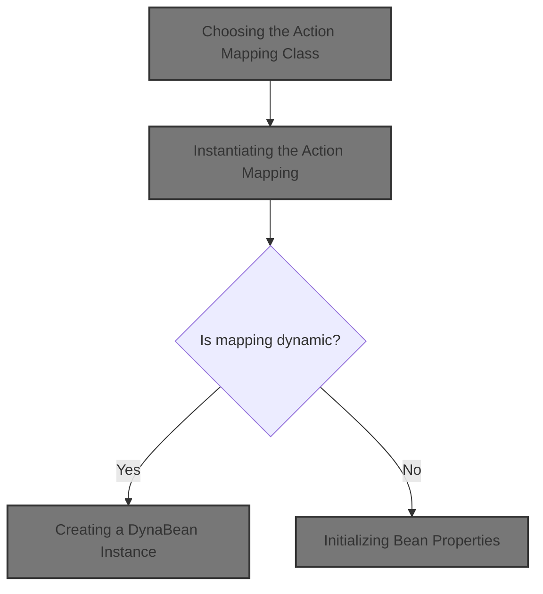
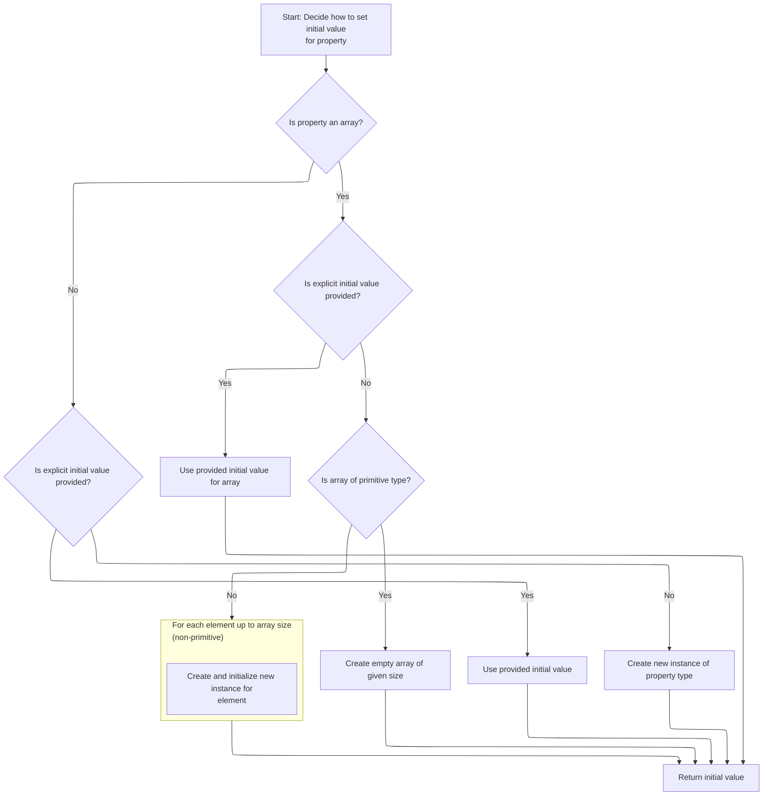

This document explains the flow for creating and initializing an action mapping object based on configuration. Action mappings determine how requests are processed and routed within the application. The flow ensures that each mapping is instantiated with the correct class and properties, supporting both static and dynamic configurations.

The main steps are:

- Choose the action mapping class from configuration
- Instantiate the action mapping
- For dynamic mappings, create and initialize a bean instance
- Initialize bean properties



# Choosing the Action Mapping Class

<SwmSnippet path="/core/src/main/java/org/apache/struts/config/ConfigRuleSet.java" line="333">

---

In <SwmToken path="core/src/main/java/org/apache/struts/config/ConfigRuleSet.java" pos="333:5:5" line-data="    public Object createObject(Attributes attributes) {">`createObject`</SwmToken>, we grab the <SwmToken path="core/src/main/java/org/apache/struts/config/ConfigRuleSet.java" pos="335:3:3" line-data="        String className = attributes.getValue(&quot;className&quot;);">`className`</SwmToken> from the attributes if present, otherwise we plan to fall back to the module config. This lets us support both per-mapping overrides and a default. Next, we need to resolve the actual value for <SwmToken path="core/src/main/java/org/apache/struts/config/ConfigRuleSet.java" pos="335:3:3" line-data="        String className = attributes.getValue(&quot;className&quot;);">`className`</SwmToken>, which can involve logic in <SwmToken path="tiles/src/main/java/org/apache/struts/tiles/xmlDefinition/XmlAttribute.java" pos="32:4:4" line-data="public class XmlAttribute {">`XmlAttribute`</SwmToken> (like handling indirection or type conversion), so we call into <SwmToken path="tiles/src/main/java/org/apache/struts/tiles/xmlDefinition/XmlAttribute.java" pos="32:4:4" line-data="public class XmlAttribute {">`XmlAttribute`</SwmToken> to get the resolved value.

```java
    public Object createObject(Attributes attributes) {
        // Identify the name of the class to instantiate
        String className = attributes.getValue("className");

```

---

</SwmSnippet>

## Resolving Attribute Values

<SwmSnippet path="/tiles/src/main/java/org/apache/struts/tiles/xmlDefinition/XmlAttribute.java" line="142">

---

<SwmToken path="tiles/src/main/java/org/apache/struts/tiles/xmlDefinition/XmlAttribute.java" pos="142:5:5" line-data="    public Object getValue() {">`getValue`</SwmToken> checks if we've already computed the real value for this attribute; if not, it calls <SwmToken path="tiles/src/main/java/org/apache/struts/tiles/xmlDefinition/XmlAttribute.java" pos="145:9:9" line-data="            this.realValue = this.computeRealValue();">`computeRealValue`</SwmToken> to resolve it (handling type, indirection, etc.), then caches and returns it. This ensures we only do the work once per attribute.

```java
    public Object getValue() {
        // Compatibility with JSP Template
        if (this.realValue == null) {
            this.realValue = this.computeRealValue();
        }

        return this.realValue;
    }
```

---

</SwmSnippet>

<SwmSnippet path="/tiles/src/main/java/org/apache/struts/tiles/xmlDefinition/XmlAttribute.java" line="204">

---

<SwmToken path="tiles/src/main/java/org/apache/struts/tiles/xmlDefinition/XmlAttribute.java" pos="204:5:5" line-data="    protected Object computeRealValue() {">`computeRealValue`</SwmToken> figures out what kind of attribute object to create based on the 'direct' and <SwmToken path="tiles/src/main/java/org/apache/struts/tiles/xmlDefinition/XmlAttribute.java" pos="207:22:22" line-data="        // First check direct attribute, and translate it to a valueType.">`valueType`</SwmToken> fields, mapping to different attribute classes. It also attaches a 'role' if present, and falls back to <SwmToken path="tiles/src/main/java/org/apache/struts/tiles/xmlDefinition/XmlAttribute.java" pos="232:3:3" line-data="                ((UntypedAttribute) realValue).setRole(role);">`UntypedAttribute`</SwmToken> if only 'role' is set. This logic standardizes how attribute values are wrapped and annotated for later use.

```java
    protected Object computeRealValue() {
        Object realValue = value;
        // Is there a type set ?
        // First check direct attribute, and translate it to a valueType.
        // Then, evaluate valueType, and create requested typed attribute.
        if (direct != null) {
            this.valueType =
                Boolean.valueOf(direct).booleanValue() ? "string" : "path";
        }

        if (value != null && valueType != null) {
            String strValue = value.toString();

            if (valueType.equalsIgnoreCase("string")) {
                realValue = new DirectStringAttribute(strValue);

            } else if (valueType.equalsIgnoreCase("page")) {
                realValue = new PathAttribute(strValue);

            } else if (valueType.equalsIgnoreCase("template")) {
                realValue = new PathAttribute(strValue);

            } else if (valueType.equalsIgnoreCase("instance")) {
                realValue = new DefinitionNameAttribute(strValue);
            }

            // Set realValue's role value if needed
            if (role != null) {
                ((UntypedAttribute) realValue).setRole(role);
            }
        }

        // Create attribute wrapper to hold role if role is set and no type
        // specified
        if (role != null && value != null && valueType == null) {
            realValue = new UntypedAttribute(value.toString(), role);
        }

        return realValue;
    }
```

---

</SwmSnippet>

## Instantiating the Action Mapping

<SwmSnippet path="/core/src/main/java/org/apache/struts/config/ConfigRuleSet.java" line="337">

---

Back in <SwmToken path="core/src/main/java/org/apache/struts/config/ConfigRuleSet.java" pos="349:10:12" line-data="            digester.getLogger().error(&quot;ActionMappingFactory.createObject: &quot;, e);">`ActionMappingFactory.createObject`</SwmToken>, after resolving the class name (possibly via <SwmToken path="tiles/src/main/java/org/apache/struts/tiles/xmlDefinition/XmlAttribute.java" pos="32:4:4" line-data="public class XmlAttribute {">`XmlAttribute`</SwmToken>), we check for a fallback in the module config if needed, then use <SwmToken path="core/src/main/java/org/apache/struts/config/ConfigRuleSet.java" pos="347:5:7" line-data="            actionMapping = RequestUtils.applicationInstance(className, cl);">`RequestUtils.applicationInstance`</SwmToken> to actually instantiate the class. This abstracts the instantiation and handles any class loader specifics.

```java
        if (className == null) {
            ModuleConfig mc = (ModuleConfig) digester.peek();

            className = mc.getActionMappingClass();
        }

        // Instantiate the new object and return it
        Object actionMapping = null;

        try {
            actionMapping = RequestUtils.applicationInstance(className, cl);
        } catch (Exception e) {
            digester.getLogger().error("ActionMappingFactory.createObject: ", e);
        }

        return actionMapping;
    }
```

---

</SwmSnippet>

# Dynamic Class Instantiation

<SwmSnippet path="/core/src/main/java/org/apache/struts/util/RequestUtils.java" line="169">

---

<SwmToken path="core/src/main/java/org/apache/struts/util/RequestUtils.java" pos="169:7:7" line-data="    public static Object applicationInstance(String className,">`applicationInstance`</SwmToken> uses reflection to load and instantiate the class by name, assuming a public no-arg constructor. Next, if the class is <SwmToken path="core/src/main/java/org/apache/struts/action/DynaActionFormClass.java" pos="45:4:4" line-data="public class DynaActionFormClass implements DynaClass, Serializable {">`DynaActionFormClass`</SwmToken>, we call its <SwmToken path="core/src/main/java/org/apache/struts/util/RequestUtils.java" pos="173:12:12" line-data="        return (applicationClass(className, classLoader).newInstance());">`newInstance`</SwmToken> method to get a properly initialized bean.

```java
    public static Object applicationInstance(String className,
        ClassLoader classLoader)
        throws ClassNotFoundException, IllegalAccessException,
            InstantiationException {
        return (applicationClass(className, classLoader).newInstance());
    }
```

---

</SwmSnippet>

# Creating a <SwmToken path="core/src/main/java/org/apache/struts/action/DynaActionFormClass.java" pos="158:3:3" line-data="    public DynaBean newInstance()">`DynaBean`</SwmToken> Instance

<SwmSnippet path="/core/src/main/java/org/apache/struts/action/DynaActionFormClass.java" line="158">

---

In <SwmToken path="core/src/main/java/org/apache/struts/action/DynaActionFormClass.java" pos="158:5:5" line-data="    public DynaBean newInstance()">`newInstance`</SwmToken>, we create a new <SwmToken path="core/src/main/java/org/apache/struts/action/DynaActionFormClass.java" pos="160:1:1" line-data="        DynaActionForm dynaBean = (DynaActionForm) getBeanClass().newInstance();">`DynaActionForm`</SwmToken>, set its class reference, and prepare to initialize its properties. Next, we need to resolve the actual bean class (via <SwmToken path="core/src/main/java/org/apache/struts/action/DynaActionFormClass.java" pos="160:11:11" line-data="        DynaActionForm dynaBean = (DynaActionForm) getBeanClass().newInstance();">`getBeanClass`</SwmToken>) before we can finish setup.

```java
    public DynaBean newInstance()
        throws IllegalAccessException, InstantiationException {
        DynaActionForm dynaBean = (DynaActionForm) getBeanClass().newInstance();

```

---

</SwmSnippet>

## Resolving the Bean Class

<SwmSnippet path="/core/src/main/java/org/apache/struts/action/DynaActionFormClass.java" line="227">

---

<SwmToken path="core/src/main/java/org/apache/struts/action/DynaActionFormClass.java" pos="227:5:5" line-data="    protected Class getBeanClass() {">`getBeanClass`</SwmToken> checks if we've already figured out the bean class for this config; if not, it introspects the config to resolve and cache it. This ensures we only do the work once per config.

```java
    protected Class getBeanClass() {
        if (beanClass == null) {
            introspect(config);
        }

        return (beanClass);
    }
```

---

</SwmSnippet>

## Analyzing Bean Properties

```mermaid
%%{init: {"flowchart": {"defaultRenderer": "elk"}} }%%
flowchart TD
  node1["Analyze form bean configuration (type,
name)"] --> node2{"Can instantiate form bean class?"}
  click node1 openCode "core/src/main/java/org/apache/struts/action/DynaActionFormClass.java:246:247"
  node2 -->|"No"| node3["Raise error: Cannot instantiate class"]
  click node2 openCode "core/src/main/java/org/apache/struts/action/DynaActionFormClass.java:250:258"
  click node3 openCode "core/src/main/java/org/apache/struts/action/DynaActionFormClass.java:253:258"
  node2 -->|"Yes"| node4{"Is class a subclass of required base?"}
  click node4 openCode "core/src/main/java/org/apache/struts/action/DynaActionFormClass.java:260:264"
  node4 -->|"No"| node5["Raise error: Not a valid subclass"]
  click node5 openCode "core/src/main/java/org/apache/struts/action/DynaActionFormClass.java:261:264"
  node4 -->|"Yes"| node6["Extract property descriptors from config"]
  click node6 openCode "core/src/main/java/org/apache/struts/action/DynaActionFormClass.java:270:271"
  node6 --> node7["Assign form name"]
  click node7 openCode "core/src/main/java/org/apache/struts/action/DynaActionFormClass.java:267:267"
  node7 --> node8{"Any property descriptors?"}
  click node8 openCode "core/src/main/java/org/apache/struts/action/DynaActionFormClass.java:272:274"
  node8 -->|"No"| node9["Finish setup with empty property list"]
  click node9 openCode "core/src/main/java/org/apache/struts/action/DynaActionFormClass.java:273:274"
  node8 -->|"Yes"| node10["Define dynamic properties"]
  click node10 openCode "core/src/main/java/org/apache/struts/action/DynaActionFormClass.java:277:284"
  subgraph loop1["For each property descriptor"]
    node10 --> node11["Create dynamic property definition"]
    click node11 openCode "core/src/main/java/org/apache/struts/action/DynaActionFormClass.java:280:283"
    node11 --> node10
  end
  node10 --> node12["Finish setup"]
  click node12 openCode "core/src/main/java/org/apache/struts/action/DynaActionFormClass.java:285:285"

classDef HeadingStyle fill:#777777,stroke:#333,stroke-width:2px;

%% Swimm:
%% %%{init: {"flowchart": {"defaultRenderer": "elk"}} }%%
%% flowchart TD
%%   node1["Analyze form bean configuration (type,
%% name)"] --> node2{"Can instantiate form bean class?"}
%%   click node1 openCode "<SwmPath>[core/…/action/DynaActionFormClass.java](core/src/main/java/org/apache/struts/action/DynaActionFormClass.java)</SwmPath>:246:247"
%%   node2 -->|"No"| node3["Raise error: Cannot instantiate class"]
%%   click node2 openCode "<SwmPath>[core/…/action/DynaActionFormClass.java](core/src/main/java/org/apache/struts/action/DynaActionFormClass.java)</SwmPath>:250:258"
%%   click node3 openCode "<SwmPath>[core/…/action/DynaActionFormClass.java](core/src/main/java/org/apache/struts/action/DynaActionFormClass.java)</SwmPath>:253:258"
%%   node2 -->|"Yes"| node4{"Is class a subclass of required base?"}
%%   click node4 openCode "<SwmPath>[core/…/action/DynaActionFormClass.java](core/src/main/java/org/apache/struts/action/DynaActionFormClass.java)</SwmPath>:260:264"
%%   node4 -->|"No"| node5["Raise error: Not a valid subclass"]
%%   click node5 openCode "<SwmPath>[core/…/action/DynaActionFormClass.java](core/src/main/java/org/apache/struts/action/DynaActionFormClass.java)</SwmPath>:261:264"
%%   node4 -->|"Yes"| node6["Extract property descriptors from config"]
%%   click node6 openCode "<SwmPath>[core/…/action/DynaActionFormClass.java](core/src/main/java/org/apache/struts/action/DynaActionFormClass.java)</SwmPath>:270:271"
%%   node6 --> node7["Assign form name"]
%%   click node7 openCode "<SwmPath>[core/…/action/DynaActionFormClass.java](core/src/main/java/org/apache/struts/action/DynaActionFormClass.java)</SwmPath>:267:267"
%%   node7 --> node8{"Any property descriptors?"}
%%   click node8 openCode "<SwmPath>[core/…/action/DynaActionFormClass.java](core/src/main/java/org/apache/struts/action/DynaActionFormClass.java)</SwmPath>:272:274"
%%   node8 -->|"No"| node9["Finish setup with empty property list"]
%%   click node9 openCode "<SwmPath>[core/…/action/DynaActionFormClass.java](core/src/main/java/org/apache/struts/action/DynaActionFormClass.java)</SwmPath>:273:274"
%%   node8 -->|"Yes"| node10["Define dynamic properties"]
%%   click node10 openCode "<SwmPath>[core/…/action/DynaActionFormClass.java](core/src/main/java/org/apache/struts/action/DynaActionFormClass.java)</SwmPath>:277:284"
%%   subgraph loop1["For each property descriptor"]
%%     node10 --> node11["Create dynamic property definition"]
%%     click node11 openCode "<SwmPath>[core/…/action/DynaActionFormClass.java](core/src/main/java/org/apache/struts/action/DynaActionFormClass.java)</SwmPath>:280:283"
%%     node11 --> node10
%%   end
%%   node10 --> node12["Finish setup"]
%%   click node12 openCode "<SwmPath>[core/…/action/DynaActionFormClass.java](core/src/main/java/org/apache/struts/action/DynaActionFormClass.java)</SwmPath>:285:285"
%% 
%% classDef HeadingStyle fill:#777777,stroke:#333,stroke-width:2px;
```



<SwmSnippet path="/core/src/main/java/org/apache/struts/action/DynaActionFormClass.java" line="246">

---

<SwmToken path="core/src/main/java/org/apache/struts/action/DynaActionFormClass.java" pos="246:5:5" line-data="    protected void introspect(FormBeanConfig config) {">`introspect`</SwmToken> validates the bean class, sets up the name, and builds <SwmToken path="core/src/main/java/org/apache/struts/action/DynaActionFormClass.java" pos="277:7:7" line-data="        properties = new DynaProperty[descriptors.length];">`DynaProperty`</SwmToken> definitions for each property config. For each property, it calls <SwmToken path="core/src/main/java/org/apache/struts/action/DynaActionFormClass.java" pos="282:6:6" line-data="                    descriptors[i].getTypeClass());">`getTypeClass`</SwmToken> on the <SwmToken path="core/src/main/java/org/apache/struts/action/DynaActionFormClass.java" pos="270:1:1" line-data="        FormPropertyConfig[] descriptors = config.findFormPropertyConfigs();">`FormPropertyConfig`</SwmToken> to resolve the type, so we jump there next.

```java
    protected void introspect(FormBeanConfig config) {
        this.config = config;

        // Validate the ActionFormBean implementation class
        try {
            beanClass = RequestUtils.applicationClass(config.getType());
        } catch (Throwable t) {
        	IllegalArgumentException t2 = new IllegalArgumentException(
                "Cannot instantiate ActionFormBean class '" + config.getType()
                + "'");
        	t2.initCause(t);
        	throw t2;
        }

        if (!DynaActionForm.class.isAssignableFrom(beanClass)) {
            throw new IllegalArgumentException("Class '" + config.getType()
                + "' is not a subclass of "
                + "'org.apache.struts.action.DynaActionForm'");
        }

        // Set the name we will know ourselves by from the form bean name
        this.name = config.getName();

        // Look up the property descriptors for this bean class
        FormPropertyConfig[] descriptors = config.findFormPropertyConfigs();

        if (descriptors == null) {
            descriptors = new FormPropertyConfig[0];
        }

        // Create corresponding dynamic property definitions
        properties = new DynaProperty[descriptors.length];

        for (int i = 0; i < descriptors.length; i++) {
            properties[i] =
                new DynaProperty(descriptors[i].getName(),
                    descriptors[i].getTypeClass());
            propertiesMap.put(properties[i].getName(), properties[i]);
        }
    }
```

---

</SwmSnippet>

<SwmSnippet path="/core/src/main/java/org/apache/struts/config/FormPropertyConfig.java" line="221">

---

<SwmToken path="core/src/main/java/org/apache/struts/config/FormPropertyConfig.java" pos="221:5:5" line-data="    public Class getTypeClass() {">`getTypeClass`</SwmToken> parses the type string, handles primitives, arrays, and loads classes as needed. Once the type is resolved, we return to <SwmToken path="core/src/main/java/org/apache/struts/action/DynaActionFormClass.java" pos="45:4:4" line-data="public class DynaActionFormClass implements DynaClass, Serializable {">`DynaActionFormClass`</SwmToken> to finish property setup.

```java
    public Class getTypeClass() {
        // Identify the base class (in case an array was specified)
        String baseType = getType();
        boolean indexed = false;

        if (baseType.endsWith("[]")) {
            baseType = baseType.substring(0, baseType.length() - 2);
            indexed = true;
        }

        // Construct an appropriate Class instance for the base class
        Class baseClass = null;

        if ("boolean".equals(baseType)) {
            baseClass = Boolean.TYPE;
        } else if ("byte".equals(baseType)) {
            baseClass = Byte.TYPE;
        } else if ("char".equals(baseType)) {
            baseClass = Character.TYPE;
        } else if ("double".equals(baseType)) {
            baseClass = Double.TYPE;
        } else if ("float".equals(baseType)) {
            baseClass = Float.TYPE;
        } else if ("int".equals(baseType)) {
            baseClass = Integer.TYPE;
        } else if ("long".equals(baseType)) {
            baseClass = Long.TYPE;
        } else if ("short".equals(baseType)) {
            baseClass = Short.TYPE;
        } else {
            ClassLoader classLoader =
                Thread.currentThread().getContextClassLoader();

            if (classLoader == null) {
                classLoader = this.getClass().getClassLoader();
            }

            try {
                baseClass = classLoader.loadClass(baseType);
            } catch (ClassNotFoundException ex) {
                log.error("Class '" + baseType +
                          "' not found for property '" + name + "'");
                baseClass = null;
            }
        }

        // Return the base class or an array appropriately
        if (indexed) {
            return (Array.newInstance(baseClass, 0).getClass());
        } else {
            return (baseClass);
        }
    }
```

---

</SwmSnippet>

## Initializing Bean Properties

<SwmSnippet path="/core/src/main/java/org/apache/struts/action/DynaActionFormClass.java" line="162">

---

Back in `DynaActionFormClass.newInstance`, after creating the bean and resolving its class, we loop through all property configs and set each property using its initial value. For each property, we call FormPropertyConfig.initial to get the value, so we jump there next.

```java
        dynaBean.setDynaActionFormClass(this);

        FormPropertyConfig[] props = config.findFormPropertyConfigs();

        for (int i = 0; i < props.length; i++) {
            dynaBean.set(props[i].getName(), props[i].initial());
        }

        return (dynaBean);
    }
```

---

</SwmSnippet>

# Creating Initial Property Values



<SwmSnippet path="/core/src/main/java/org/apache/struts/config/FormPropertyConfig.java" line="318">

---

In <SwmToken path="core/src/main/java/org/apache/struts/config/FormPropertyConfig.java" pos="318:5:5" line-data="    public Object initial() {">`initial`</SwmToken>, we figure out the type of the property, then branch: for arrays, we either convert the initial value or create and fill a new array; for non-arrays, we convert or instantiate as needed. This sets up the value we'll assign to the bean property.

```java
    public Object initial() {
        Object initialValue = null;

        try {
            Class clazz = getTypeClass();

```

---

</SwmSnippet>

<SwmSnippet path="/core/src/main/java/org/apache/struts/config/FormPropertyConfig.java" line="324">

---

We just returned from the earlier part of `FormPropertyConfig.initial`. Here, if the property isn't an array, we convert or instantiate the value directly. The method relies on the object's fields ('initial', 'size', etc.) to decide what to do and to log errors if something goes wrong.

```java
            if (clazz.isArray()) {
                if (initial != null) {
                    initialValue = ConvertUtils.convert(initial, clazz);
                } else {
                    initialValue =
                        Array.newInstance(clazz.getComponentType(), size);

                    if (!(clazz.getComponentType().isPrimitive())) {
                        for (int i = 0; i < size; i++) {
                            try {
                                Array.set(initialValue, i,
                                    clazz.getComponentType().newInstance());
                            } catch (Throwable t) {
                                log.error("Unable to create instance of "
                                    + clazz.getName() + " for property=" + name
                                    + ", type=" + type + ", initial=" + initial
                                    + ", size=" + size + ".");

                                //FIXME: Should we just dump the entire application/module ?
                            }
                        }
```

---

</SwmSnippet>

<SwmSnippet path="/core/src/main/java/org/apache/struts/config/FormPropertyConfig.java" line="348">

---

Now we're done with `FormPropertyConfig.initial`. We return to <SwmToken path="core/src/main/java/org/apache/struts/action/DynaActionFormClass.java" pos="45:4:4" line-data="public class DynaActionFormClass implements DynaClass, Serializable {">`DynaActionFormClass`</SwmToken>, which takes the value we just created and assigns it to the bean property. This wraps up the property initialization process.

```java
                if (initial != null) {
                    initialValue = ConvertUtils.convert(initial, clazz);
                } else {
                    initialValue = clazz.newInstance();
                }
            }
        } catch (Throwable t) {
            initialValue = null;
        }

        return (initialValue);
    }
```

---

</SwmSnippet>

&nbsp;

*This is an auto-generated document by Swimm 🌊 and has not yet been verified by a human*

<SwmMeta version="3.0.0" repo-id="Z2l0aHViJTNBJTNBc3RydXRzMSUzQSUzQVN3aW1tLURlbW8=" repo-name="struts1"><sup>Powered by [Swimm](https://app.swimm.io/)</sup></SwmMeta>
