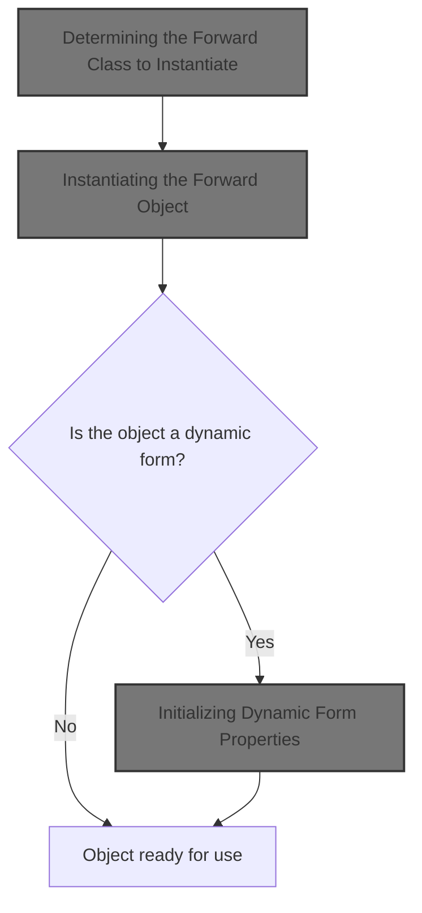
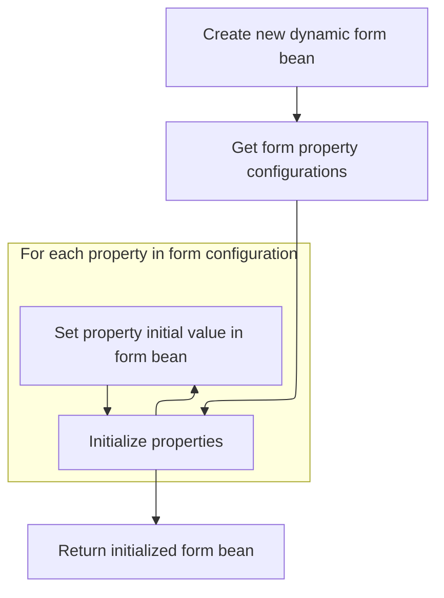
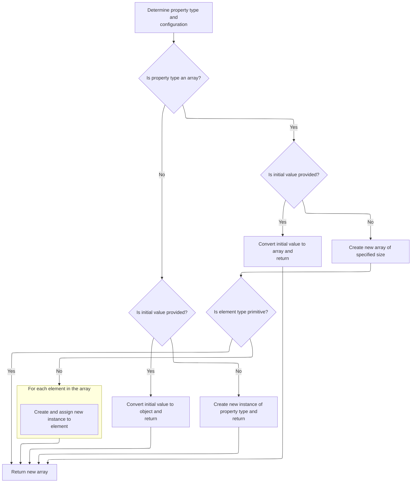

This document outlines how objects such as forms and forwards are created and initialized based on configuration. The process includes determining the class to instantiate, resolving dynamic attribute values, creating the object, and initializing all properties. This enables flexible application behavior driven by configuration.



# Determining the Forward Class to Instantiate

<SwmSnippet path="/core/src/main/java/org/apache/struts/config/ConfigRuleSet.java" line="395">

---

In <SwmToken path="core/src/main/java/org/apache/struts/config/ConfigRuleSet.java" pos="395:5:5" line-data="    public Object createObject(Attributes attributes) {">`createObject`</SwmToken>, we grab the <SwmToken path="core/src/main/java/org/apache/struts/config/ConfigRuleSet.java" pos="397:3:3" line-data="        String className = attributes.getValue(&quot;className&quot;);">`className`</SwmToken> from the attributes if it's there; if not, we pull the default from the <SwmToken path="core/src/main/java/org/apache/struts/config/ConfigRuleSet.java" pos="400:1:1" line-data="            ModuleConfig mc = (ModuleConfig) digester.peek();">`ModuleConfig`</SwmToken> on the digester stack. This lets us support both explicit and default configuration. Next, we need to resolve the value of any attributes (like <SwmToken path="core/src/main/java/org/apache/struts/config/ConfigRuleSet.java" pos="397:3:3" line-data="        String className = attributes.getValue(&quot;className&quot;);">`className`</SwmToken>) using <SwmToken path="tiles/src/main/java/org/apache/struts/tiles/xmlDefinition/XmlAttribute.java" pos="32:4:4" line-data="public class XmlAttribute {">`XmlAttribute`</SwmToken> logic, since those might be dynamic or templated.

```java
    public Object createObject(Attributes attributes) {
        // Identify the name of the class to instantiate
        String className = attributes.getValue("className");

```

---

</SwmSnippet>

## Resolving Attribute Values and Types

<SwmSnippet path="/tiles/src/main/java/org/apache/struts/tiles/xmlDefinition/XmlAttribute.java" line="142">

---

<SwmToken path="tiles/src/main/java/org/apache/struts/tiles/xmlDefinition/XmlAttribute.java" pos="142:5:5" line-data="    public Object getValue() {">`getValue`</SwmToken> checks if the resolved value is already computed and cached; if not, it calls <SwmToken path="tiles/src/main/java/org/apache/struts/tiles/xmlDefinition/XmlAttribute.java" pos="145:9:9" line-data="            this.realValue = this.computeRealValue();">`computeRealValue`</SwmToken> to process the attribute. This ensures we only resolve the value once

```java
    public Object getValue() {
        // Compatibility with JSP Template
        if (this.realValue == null) {
            this.realValue = this.computeRealValue();
        }

        return this.realValue;
    }
```

---

</SwmSnippet>

<SwmSnippet path="/tiles/src/main/java/org/apache/struts/tiles/xmlDefinition/XmlAttribute.java" line="204">

---

<SwmToken path="tiles/src/main/java/org/apache/struts/tiles/xmlDefinition/XmlAttribute.java" pos="204:5:5" line-data="    protected Object computeRealValue() {">`computeRealValue`</SwmToken> figures out how to wrap the attribute value based on 'direct', <SwmToken path="tiles/src/main/java/org/apache/struts/tiles/xmlDefinition/XmlAttribute.java" pos="207:22:22" line-data="        // First check direct attribute, and translate it to a valueType.">`valueType`</SwmToken>, and 'role'. It maps these to specific attribute classes, and if a role is set, it attaches it. If only a role is set with no type, it falls back to <SwmToken path="tiles/src/main/java/org/apache/struts/tiles/xmlDefinition/XmlAttribute.java" pos="232:3:3" line-data="                ((UntypedAttribute) realValue).setRole(role);">`UntypedAttribute`</SwmToken>. This logic decides how the attribute will be handled later.

```java
    protected Object computeRealValue() {
        Object realValue = value;
        // Is there a type set ?
        // First check direct attribute, and translate it to a valueType.
        // Then, evaluate valueType, and create requested typed attribute.
        if (direct != null) {
            this.valueType =
                Boolean.valueOf(direct).booleanValue() ? "string" : "path";
        }

        if (value != null && valueType != null) {
            String strValue = value.toString();

            if (valueType.equalsIgnoreCase("string")) {
                realValue = new DirectStringAttribute(strValue);

            } else if (valueType.equalsIgnoreCase("page")) {
                realValue = new PathAttribute(strValue);

            } else if (valueType.equalsIgnoreCase("template")) {
                realValue = new PathAttribute(strValue);

            } else if (valueType.equalsIgnoreCase("instance")) {
                realValue = new DefinitionNameAttribute(strValue);
            }

            // Set realValue's role value if needed
            if (role != null) {
                ((UntypedAttribute) realValue).setRole(role);
            }
        }

        // Create attribute wrapper to hold role if role is set and no type
        // specified
        if (role != null && value != null && valueType == null) {
            realValue = new UntypedAttribute(value.toString(), role);
        }

        return realValue;
    }
```

---

</SwmSnippet>

## Instantiating the Forward Object

<SwmSnippet path="/core/src/main/java/org/apache/struts/config/ConfigRuleSet.java" line="399">

---

Back in <SwmToken path="core/src/main/java/org/apache/struts/config/ConfigRuleSet.java" pos="411:10:12" line-data="            digester.getLogger().error(&quot;GlobalForwardFactory.createObject: &quot;, e);">`GlobalForwardFactory.createObject`</SwmToken>, after resolving the class name (possibly using <SwmToken path="tiles/src/main/java/org/apache/struts/tiles/xmlDefinition/XmlAttribute.java" pos="32:4:4" line-data="public class XmlAttribute {">`XmlAttribute`</SwmToken> logic), we check for a fallback in <SwmToken path="core/src/main/java/org/apache/struts/config/ConfigRuleSet.java" pos="400:1:1" line-data="            ModuleConfig mc = (ModuleConfig) digester.peek();">`ModuleConfig`</SwmToken> if needed. Then, we use <SwmToken path="core/src/main/java/org/apache/struts/config/ConfigRuleSet.java" pos="409:5:7" line-data="            globalForward = RequestUtils.applicationInstance(className, cl);">`RequestUtils.applicationInstance`</SwmToken> to actually instantiate the class, which handles class loading details. This is where the object is finally created.

```java
        if (className == null) {
            ModuleConfig mc = (ModuleConfig) digester.peek();

            className = mc.getActionForwardClass();
        }

        // Instantiate the new object and return it
        Object globalForward = null;

        try {
            globalForward = RequestUtils.applicationInstance(className, cl);
        } catch (Exception e) {
            digester.getLogger().error("GlobalForwardFactory.createObject: ", e);
        }

        return globalForward;
    }
```

---

</SwmSnippet>

# Creating an Instance via Reflection

<SwmSnippet path="/core/src/main/java/org/apache/struts/util/RequestUtils.java" line="169">

---

<SwmToken path="core/src/main/java/org/apache/struts/util/RequestUtils.java" pos="169:7:7" line-data="    public static Object applicationInstance(String className,">`applicationInstance`</SwmToken> gets the Class object using <SwmToken path="core/src/main/java/org/apache/struts/util/RequestUtils.java" pos="173:4:4" line-data="        return (applicationClass(className, classLoader).newInstance());">`applicationClass`</SwmToken> (which may do more than just Class.forName), then creates a new instance with <SwmToken path="core/src/main/java/org/apache/struts/util/RequestUtils.java" pos="173:12:12" line-data="        return (applicationClass(className, classLoader).newInstance());">`newInstance`</SwmToken>. This is the handoff point to any class-specific instantiation logic, like <SwmToken path="core/src/main/java/org/apache/struts/action/DynaActionFormClass.java" pos="45:4:4" line-data="public class DynaActionFormClass implements DynaClass, Serializable {">`DynaActionFormClass`</SwmToken>.

```java
    public static Object applicationInstance(String className,
        ClassLoader classLoader)
        throws ClassNotFoundException, IllegalAccessException,
            InstantiationException {
        return (applicationClass(className, classLoader).newInstance());
    }
```

---

</SwmSnippet>

# Building a Dynamic Form Instance

<SwmSnippet path="/core/src/main/java/org/apache/struts/action/DynaActionFormClass.java" line="158">

---

In <SwmToken path="core/src/main/java/org/apache/struts/action/DynaActionFormClass.java" pos="158:5:5" line-data="    public DynaBean newInstance()">`newInstance`</SwmToken>, we create a new <SwmToken path="core/src/main/java/org/apache/struts/action/DynaActionFormClass.java" pos="160:1:1" line-data="        DynaActionForm dynaBean = (DynaActionForm) getBeanClass().newInstance();">`DynaActionForm`</SwmToken> by instantiating the class returned by <SwmToken path="core/src/main/java/org/apache/struts/action/DynaActionFormClass.java" pos="160:11:11" line-data="        DynaActionForm dynaBean = (DynaActionForm) getBeanClass().newInstance();">`getBeanClass`</SwmToken>, then set up its reference to this <SwmToken path="core/src/main/java/org/apache/struts/action/DynaActionFormClass.java" pos="45:4:4" line-data="public class DynaActionFormClass implements DynaClass, Serializable {">`DynaActionFormClass`</SwmToken>. This supports dynamic form types and configuration-driven instantiation.

```java
    public DynaBean newInstance()
        throws IllegalAccessException, InstantiationException {
        DynaActionForm dynaBean = (DynaActionForm) getBeanClass().newInstance();

```

---

</SwmSnippet>

## Resolving the Bean Class for the Form

<SwmSnippet path="/core/src/main/java/org/apache/struts/action/DynaActionFormClass.java" line="227">

---

<SwmToken path="core/src/main/java/org/apache/struts/action/DynaActionFormClass.java" pos="227:5:5" line-data="    protected Class getBeanClass() {">`getBeanClass`</SwmToken> checks if the bean class is already set; if not, it runs introspect(config) to figure it out. This means the actual class is only resolved when needed, not upfront.

```java
    protected Class getBeanClass() {
        if (beanClass == null) {
            introspect(config);
        }

        return (beanClass);
    }
```

---

</SwmSnippet>

## Analyzing Form Bean and Property Types

```mermaid
%%{init: {"flowchart": {"defaultRenderer": "elk"}} }%%
flowchart TD
  node1["Analyze form bean configuration (type
from config)"] --> node2{"Is form bean class valid?"}
  click node1 openCode "core/src/main/java/org/apache/struts/action/DynaActionFormClass.java:246:251"
  node2 -->|"Yes"| node3{"Is form bean class a subclass of dynamic
form base class?"}
  click node2 openCode "core/src/main/java/org/apache/struts/action/DynaActionFormClass.java:251:258"
  node2 -->|"No"| node8["Error: Invalid form bean class"]
  click node8 openCode "core/src/main/java/org/apache/struts/action/DynaActionFormClass.java:253:258"
  node3 -->|"Yes"| node4["Set form name from config"]
  click node3 openCode "core/src/main/java/org/apache/struts/action/DynaActionFormClass.java:260:264"
  node3 -->|"No"| node9["Error: Not a subclass of dynamic form
base class"]
  click node9 openCode "core/src/main/java/org/apache/struts/action/DynaActionFormClass.java:261:264"
  node4 --> node5["Get property descriptors from config"]
  click node4 openCode "core/src/main/java/org/apache/struts/action/DynaActionFormClass.java:267:270"
  node5 --> node6{"Are property descriptors defined?"}
  click node5 openCode "core/src/main/java/org/apache/struts/action/DynaActionFormClass.java:270:274"
  node6 -->|"No"| node7["Use empty property list"]
  click node7 openCode "core/src/main/java/org/apache/struts/action/DynaActionFormClass.java:273:274"
  node6 -->|"Yes"| node10["Create dynamic property definitions"]
  click node10 openCode "core/src/main/java/org/apache/struts/action/DynaActionFormClass.java:277:284"

  subgraph loop1["For each property descriptor"]
    node10 --> node12["Create dynamic property definition and
add to map"]
    click node12 openCode "core/src/main/java/org/apache/struts/action/DynaActionFormClass.java:280:284"
  end
classDef HeadingStyle fill:#777777,stroke:#333,stroke-width:2px;

%% Swimm:
%% %%{init: {"flowchart": {"defaultRenderer": "elk"}} }%%
%% flowchart TD
%%   node1["Analyze form bean configuration (type
%% from config)"] --> node2{"Is form bean class valid?"}
%%   click node1 openCode "<SwmPath>[core/…/action/DynaActionFormClass.java](core/src/main/java/org/apache/struts/action/DynaActionFormClass.java)</SwmPath>:246:251"
%%   node2 -->|"Yes"| node3{"Is form bean class a subclass of dynamic
%% form base class?"}
%%   click node2 openCode "<SwmPath>[core/…/action/DynaActionFormClass.java](core/src/main/java/org/apache/struts/action/DynaActionFormClass.java)</SwmPath>:251:258"
%%   node2 -->|"No"| node8["Error: Invalid form bean class"]
%%   click node8 openCode "<SwmPath>[core/…/action/DynaActionFormClass.java](core/src/main/java/org/apache/struts/action/DynaActionFormClass.java)</SwmPath>:253:258"
%%   node3 -->|"Yes"| node4["Set form name from config"]
%%   click node3 openCode "<SwmPath>[core/…/action/DynaActionFormClass.java](core/src/main/java/org/apache/struts/action/DynaActionFormClass.java)</SwmPath>:260:264"
%%   node3 -->|"No"| node9["Error: Not a subclass of dynamic form
%% base class"]
%%   click node9 openCode "<SwmPath>[core/…/action/DynaActionFormClass.java](core/src/main/java/org/apache/struts/action/DynaActionFormClass.java)</SwmPath>:261:264"
%%   node4 --> node5["Get property descriptors from config"]
%%   click node4 openCode "<SwmPath>[core/…/action/DynaActionFormClass.java](core/src/main/java/org/apache/struts/action/DynaActionFormClass.java)</SwmPath>:267:270"
%%   node5 --> node6{"Are property descriptors defined?"}
%%   click node5 openCode "<SwmPath>[core/…/action/DynaActionFormClass.java](core/src/main/java/org/apache/struts/action/DynaActionFormClass.java)</SwmPath>:270:274"
%%   node6 -->|"No"| node7["Use empty property list"]
%%   click node7 openCode "<SwmPath>[core/…/action/DynaActionFormClass.java](core/src/main/java/org/apache/struts/action/DynaActionFormClass.java)</SwmPath>:273:274"
%%   node6 -->|"Yes"| node10["Create dynamic property definitions"]
%%   click node10 openCode "<SwmPath>[core/…/action/DynaActionFormClass.java](core/src/main/java/org/apache/struts/action/DynaActionFormClass.java)</SwmPath>:277:284"
%% 
%%   subgraph loop1["For each property descriptor"]
%%     node10 --> node12["Create dynamic property definition and
%% add to map"]
%%     click node12 openCode "<SwmPath>[core/…/action/DynaActionFormClass.java](core/src/main/java/org/apache/struts/action/DynaActionFormClass.java)</SwmPath>:280:284"
%%   end
%% classDef HeadingStyle fill:#777777,stroke:#333,stroke-width:2px;
```



<SwmSnippet path="/core/src/main/java/org/apache/struts/action/DynaActionFormClass.java" line="246">

---

<SwmToken path="core/src/main/java/org/apache/struts/action/DynaActionFormClass.java" pos="246:5:5" line-data="    protected void introspect(FormBeanConfig config) {">`introspect`</SwmToken> loads the bean class from config, checks it's a <SwmToken path="core/src/main/java/org/apache/struts/action/DynaActionFormClass.java" pos="260:5:5" line-data="        if (!DynaActionForm.class.isAssignableFrom(beanClass)) {">`DynaActionForm`</SwmToken> subclass, and builds up the property definitions from <SwmToken path="core/src/main/java/org/apache/struts/action/DynaActionFormClass.java" pos="270:1:1" line-data="        FormPropertyConfig[] descriptors = config.findFormPropertyConfigs();">`FormPropertyConfig`</SwmToken> descriptors. This sets up the dynamic form structure for later use.

```java
    protected void introspect(FormBeanConfig config) {
        this.config = config;

        // Validate the ActionFormBean implementation class
        try {
            beanClass = RequestUtils.applicationClass(config.getType());
        } catch (Throwable t) {
        	IllegalArgumentException t2 = new IllegalArgumentException(
                "Cannot instantiate ActionFormBean class '" + config.getType()
                + "'");
        	t2.initCause(t);
        	throw t2;
        }

        if (!DynaActionForm.class.isAssignableFrom(beanClass)) {
            throw new IllegalArgumentException("Class '" + config.getType()
                + "' is not a subclass of "
                + "'org.apache.struts.action.DynaActionForm'");
        }

        // Set the name we will know ourselves by from the form bean name
        this.name = config.getName();

        // Look up the property descriptors for this bean class
        FormPropertyConfig[] descriptors = config.findFormPropertyConfigs();

        if (descriptors == null) {
            descriptors = new FormPropertyConfig[0];
        }

        // Create corresponding dynamic property definitions
        properties = new DynaProperty[descriptors.length];

        for (int i = 0; i < descriptors.length; i++) {
            properties[i] =
                new DynaProperty(descriptors[i].getName(),
                    descriptors[i].getTypeClass());
            propertiesMap.put(properties[i].getName(), properties[i]);
        }
    }
```

---

</SwmSnippet>

<SwmSnippet path="/core/src/main/java/org/apache/struts/config/FormPropertyConfig.java" line="221">

---

<SwmToken path="core/src/main/java/org/apache/struts/config/FormPropertyConfig.java" pos="221:5:5" line-data="    public Class getTypeClass() {">`getTypeClass`</SwmToken> parses the type string, handles array types (with '\[\]'), maps primitives, and loads the class using the context class loader. This supports flexible property types for dynamic forms.

```java
    public Class getTypeClass() {
        // Identify the base class (in case an array was specified)
        String baseType = getType();
        boolean indexed = false;

        if (baseType.endsWith("[]")) {
            baseType = baseType.substring(0, baseType.length() - 2);
            indexed = true;
        }

        // Construct an appropriate Class instance for the base class
        Class baseClass = null;

        if ("boolean".equals(baseType)) {
            baseClass = Boolean.TYPE;
        } else if ("byte".equals(baseType)) {
            baseClass = Byte.TYPE;
        } else if ("char".equals(baseType)) {
            baseClass = Character.TYPE;
        } else if ("double".equals(baseType)) {
            baseClass = Double.TYPE;
        } else if ("float".equals(baseType)) {
            baseClass = Float.TYPE;
        } else if ("int".equals(baseType)) {
            baseClass = Integer.TYPE;
        } else if ("long".equals(baseType)) {
            baseClass = Long.TYPE;
        } else if ("short".equals(baseType)) {
            baseClass = Short.TYPE;
        } else {
            ClassLoader classLoader =
                Thread.currentThread().getContextClassLoader();

            if (classLoader == null) {
                classLoader = this.getClass().getClassLoader();
            }

            try {
                baseClass = classLoader.loadClass(baseType);
            } catch (ClassNotFoundException ex) {
                log.error("Class '" + baseType +
                          "' not found for property '" + name + "'");
                baseClass = null;
            }
        }

        // Return the base class or an array appropriately
        if (indexed) {
            return (Array.newInstance(baseClass, 0).getClass());
        } else {
            return (baseClass);
        }
    }
```

---

</SwmSnippet>

## Initializing Dynamic Form Properties



<SwmSnippet path="/core/src/main/java/org/apache/struts/action/DynaActionFormClass.java" line="162">

---

Back in DynaActionFormClass.newInstance, after creating the form instance, we loop through the property configs and set each property to its initial value. This step ensures the form is ready to use with all defaults set, and relies on FormPropertyConfig.initial to get those values.

```java
        dynaBean.setDynaActionFormClass(this);

        FormPropertyConfig[] props = config.findFormPropertyConfigs();

        for (int i = 0; i < props.length; i++) {
            dynaBean.set(props[i].getName(), props[i].initial());
        }

        return (dynaBean);
    }
```

---

</SwmSnippet>

# Determining Initial Property Values



<SwmSnippet path="/core/src/main/java/org/apache/struts/config/FormPropertyConfig.java" line="318">

---

In <SwmToken path="core/src/main/java/org/apache/struts/config/FormPropertyConfig.java" pos="318:5:5" line-data="    public Object initial() {">`initial`</SwmToken>, we figure out the starting value for a property using the type, initial value, and size fields. This setup is needed before we can handle array and non-array initialization logic.

```java
    public Object initial() {
        Object initialValue = null;

        try {
            Class clazz = getTypeClass();

```

---

</SwmSnippet>

<SwmSnippet path="/core/src/main/java/org/apache/struts/config/FormPropertyConfig.java" line="324">

---

Back in FormPropertyConfig.initial, if the property type is an array, we either convert the initial value or create a new array of the right size. For non-primitive arrays, we also instantiate each element so they're ready to use.

```java
            if (clazz.isArray()) {
                if (initial != null) {
                    initialValue = ConvertUtils.convert(initial, clazz);
                } else {
                    initialValue =
                        Array.newInstance(clazz.getComponentType(), size);

                    if (!(clazz.getComponentType().isPrimitive())) {
                        for (int i = 0; i < size; i++) {
                            try {
                                Array.set(initialValue, i,
                                    clazz.getComponentType().newInstance());
                            } catch (Throwable t) {
                                log.error("Unable to create instance of "
                                    + clazz.getName() + " for property=" + name
                                    + ", type=" + type + ", initial=" + initial
                                    + ", size=" + size + ".");

                                //FIXME: Should we just dump the entire application/module ?
                            }
                        }
```

---

</SwmSnippet>

<SwmSnippet path="/core/src/main/java/org/apache/struts/config/FormPropertyConfig.java" line="348">

---

Finally, in FormPropertyConfig.initial, if the property isn't an array, we either convert the initial value or just create a new instance of the type. This ensures every property is initialized before returning to <SwmToken path="core/src/main/java/org/apache/struts/action/DynaActionFormClass.java" pos="45:4:4" line-data="public class DynaActionFormClass implements DynaClass, Serializable {">`DynaActionFormClass`</SwmToken> for further setup.

```java
                if (initial != null) {
                    initialValue = ConvertUtils.convert(initial, clazz);
                } else {
                    initialValue = clazz.newInstance();
                }
            }
        } catch (Throwable t) {
            initialValue = null;
        }

        return (initialValue);
    }
```

---

</SwmSnippet>

&nbsp;

*This is an auto-generated document by Swimm 🌊 and has not yet been verified by a human*

<SwmMeta version="3.0.0" repo-id="Z2l0aHViJTNBJTNBc3RydXRzMSUzQSUzQVN3aW1tLURlbW8=" repo-name="struts1"><sup>Powered by [Swimm](https://app.swimm.io/)</sup></SwmMeta>
