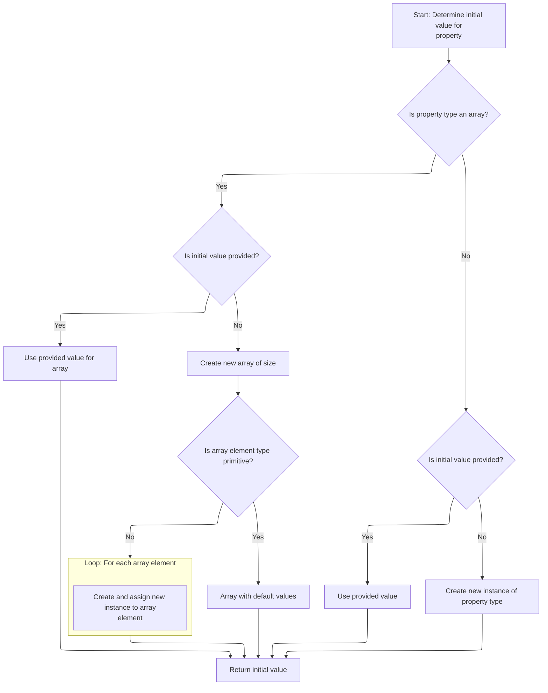

This document describes how a dynamic form instance is created and initialized using configuration data. The process involves analyzing the configuration, resolving the correct class, determining property types and initial values, and preparing a fully initialized form instance. This enables the application to generate flexible forms at runtime.

# Creating and Preparing a Dynamic Form Instance

<SwmSnippet path="/core/src/main/java/org/apache/struts/action/DynaActionFormClass.java" line="158">

---

In <SwmToken path="core/src/main/java/org/apache/struts/action/DynaActionFormClass.java" pos="158:5:5" line-data="    public DynaBean newInstance()">`newInstance`</SwmToken>, we're kicking off the creation of a new <SwmToken path="core/src/main/java/org/apache/struts/action/DynaActionFormClass.java" pos="160:1:1" line-data="        DynaActionForm dynaBean = (DynaActionForm) getBeanClass().newInstance();">`DynaActionForm`</SwmToken> by calling <SwmToken path="core/src/main/java/org/apache/struts/action/DynaActionFormClass.java" pos="160:11:17" line-data="        DynaActionForm dynaBean = (DynaActionForm) getBeanClass().newInstance();">`getBeanClass().newInstance()`</SwmToken>. This uses reflection, so whatever class is returned by <SwmToken path="core/src/main/java/org/apache/struts/action/DynaActionFormClass.java" pos="160:11:11" line-data="        DynaActionForm dynaBean = (DynaActionForm) getBeanClass().newInstance();">`getBeanClass`</SwmToken> needs a public no-arg constructor. We call <SwmToken path="core/src/main/java/org/apache/struts/action/DynaActionFormClass.java" pos="160:11:11" line-data="        DynaActionForm dynaBean = (DynaActionForm) getBeanClass().newInstance();">`getBeanClass`</SwmToken> next to make sure we get the right class type for the form, which is set up based on the configuration. Without this, we can't instantiate the form dynamically.

```java
    public DynaBean newInstance()
        throws IllegalAccessException, InstantiationException {
        DynaActionForm dynaBean = (DynaActionForm) getBeanClass().newInstance();

```

---

</SwmSnippet>

## Resolving the Backing Class for the Dynamic Form

<SwmSnippet path="/core/src/main/java/org/apache/struts/action/DynaActionFormClass.java" line="227">

---

<SwmToken path="core/src/main/java/org/apache/struts/action/DynaActionFormClass.java" pos="227:5:5" line-data="    protected Class getBeanClass() {">`getBeanClass`</SwmToken> checks if we've already figured out the class to use for the dynamic form. If not, it calls <SwmToken path="core/src/main/java/org/apache/struts/action/DynaActionFormClass.java" pos="229:1:1" line-data="            introspect(config);">`introspect`</SwmToken> to analyze the config and set up <SwmToken path="core/src/main/java/org/apache/struts/action/DynaActionFormClass.java" pos="228:4:4" line-data="        if (beanClass == null) {">`beanClass`</SwmToken>. This avoids repeating the introspection work every time we need a new instance.

```java
    protected Class getBeanClass() {
        if (beanClass == null) {
            introspect(config);
        }

        return (beanClass);
    }
```

---

</SwmSnippet>

## Analyzing Form Configuration and Property Types

```mermaid
%%{init: {"flowchart": {"defaultRenderer": "elk"}} }%%
flowchart TD
    node1["Analyze form bean configuration (type,
properties)"] --> node2{"Can form bean class be instantiated?"}
    click node1 openCode "core/src/main/java/org/apache/struts/action/DynaActionFormClass.java:246:251"
    node2 -->|"No"| node3["Error: Invalid form bean class"]
    click node2 openCode "core/src/main/java/org/apache/struts/action/DynaActionFormClass.java:251:258"
    click node3 openCode "core/src/main/java/org/apache/struts/action/DynaActionFormClass.java:253:258"
    node2 -->|"Yes"| node4{"Is form bean class a valid subclass?"}
    click node4 openCode "core/src/main/java/org/apache/struts/action/DynaActionFormClass.java:260:264"
    node4 -->|"No"| node5["Error: Not a valid form type"]
    click node5 openCode "core/src/main/java/org/apache/struts/action/DynaActionFormClass.java:261:264"
    node4 -->|"Yes"| node6["Set form name from configuration"]
    click node6 openCode "core/src/main/java/org/apache/struts/action/DynaActionFormClass.java:267:267"
    node6 --> node7{"Are property descriptors present?"}
    click node7 openCode "core/src/main/java/org/apache/struts/action/DynaActionFormClass.java:270:274"
    node7 -->|"No"| node8["No properties defined"]
    click node8 openCode "core/src/main/java/org/apache/struts/action/DynaActionFormClass.java:273:274"
    node7 -->|"Yes"| node9["Define dynamic properties"]
    click node9 openCode "core/src/main/java/org/apache/struts/action/DynaActionFormClass.java:277:284"
    
    subgraph loop1["For each property in configuration"]
      node9 --> node10["Create dynamic property definition
(name, type)"]
      click node10 openCode "core/src/main/java/org/apache/struts/action/DynaActionFormClass.java:280:282"
      node10 --> node11["Add property to property map"]
      click node11 openCode "core/src/main/java/org/apache/struts/action/DynaActionFormClass.java:283:283"
      node11 --> node12{"More properties?"}
      node12 -->|"Yes"| node10
      node12 -->|"No"| node13["All properties defined"]
      click node13 openCode "core/src/main/java/org/apache/struts/action/DynaActionFormClass.java:284:285"
    end
    node8 --> node14["End"]
    node13 --> node14
    click node14 openCode "core/src/main/java/org/apache/struts/action/DynaActionFormClass.java:285:285"

classDef HeadingStyle fill:#777777,stroke:#333,stroke-width:2px;

%% Swimm:
%% %%{init: {"flowchart": {"defaultRenderer": "elk"}} }%%
%% flowchart TD
%%     node1["Analyze form bean configuration (type,
%% properties)"] --> node2{"Can form bean class be instantiated?"}
%%     click node1 openCode "<SwmPath>[core/…/action/DynaActionFormClass.java](core/src/main/java/org/apache/struts/action/DynaActionFormClass.java)</SwmPath>:246:251"
%%     node2 -->|"No"| node3["Error: Invalid form bean class"]
%%     click node2 openCode "<SwmPath>[core/…/action/DynaActionFormClass.java](core/src/main/java/org/apache/struts/action/DynaActionFormClass.java)</SwmPath>:251:258"
%%     click node3 openCode "<SwmPath>[core/…/action/DynaActionFormClass.java](core/src/main/java/org/apache/struts/action/DynaActionFormClass.java)</SwmPath>:253:258"
%%     node2 -->|"Yes"| node4{"Is form bean class a valid subclass?"}
%%     click node4 openCode "<SwmPath>[core/…/action/DynaActionFormClass.java](core/src/main/java/org/apache/struts/action/DynaActionFormClass.java)</SwmPath>:260:264"
%%     node4 -->|"No"| node5["Error: Not a valid form type"]
%%     click node5 openCode "<SwmPath>[core/…/action/DynaActionFormClass.java](core/src/main/java/org/apache/struts/action/DynaActionFormClass.java)</SwmPath>:261:264"
%%     node4 -->|"Yes"| node6["Set form name from configuration"]
%%     click node6 openCode "<SwmPath>[core/…/action/DynaActionFormClass.java](core/src/main/java/org/apache/struts/action/DynaActionFormClass.java)</SwmPath>:267:267"
%%     node6 --> node7{"Are property descriptors present?"}
%%     click node7 openCode "<SwmPath>[core/…/action/DynaActionFormClass.java](core/src/main/java/org/apache/struts/action/DynaActionFormClass.java)</SwmPath>:270:274"
%%     node7 -->|"No"| node8["No properties defined"]
%%     click node8 openCode "<SwmPath>[core/…/action/DynaActionFormClass.java](core/src/main/java/org/apache/struts/action/DynaActionFormClass.java)</SwmPath>:273:274"
%%     node7 -->|"Yes"| node9["Define dynamic properties"]
%%     click node9 openCode "<SwmPath>[core/…/action/DynaActionFormClass.java](core/src/main/java/org/apache/struts/action/DynaActionFormClass.java)</SwmPath>:277:284"
%%     
%%     subgraph loop1["For each property in configuration"]
%%       node9 --> node10["Create dynamic property definition
%% (name, type)"]
%%       click node10 openCode "<SwmPath>[core/…/action/DynaActionFormClass.java](core/src/main/java/org/apache/struts/action/DynaActionFormClass.java)</SwmPath>:280:282"
%%       node10 --> node11["Add property to property map"]
%%       click node11 openCode "<SwmPath>[core/…/action/DynaActionFormClass.java](core/src/main/java/org/apache/struts/action/DynaActionFormClass.java)</SwmPath>:283:283"
%%       node11 --> node12{"More properties?"}
%%       node12 -->|"Yes"| node10
%%       node12 -->|"No"| node13["All properties defined"]
%%       click node13 openCode "<SwmPath>[core/…/action/DynaActionFormClass.java](core/src/main/java/org/apache/struts/action/DynaActionFormClass.java)</SwmPath>:284:285"
%%     end
%%     node8 --> node14["End"]
%%     node13 --> node14
%%     click node14 openCode "<SwmPath>[core/…/action/DynaActionFormClass.java](core/src/main/java/org/apache/struts/action/DynaActionFormClass.java)</SwmPath>:285:285"
%% 
%% classDef HeadingStyle fill:#777777,stroke:#333,stroke-width:2px;
```



<SwmSnippet path="/core/src/main/java/org/apache/struts/action/DynaActionFormClass.java" line="246">

---

<SwmToken path="core/src/main/java/org/apache/struts/action/DynaActionFormClass.java" pos="246:5:5" line-data="    protected void introspect(FormBeanConfig config) {">`introspect`</SwmToken> checks the config, loads the bean class, and validates it's a <SwmToken path="core/src/main/java/org/apache/struts/action/DynaActionFormClass.java" pos="260:5:5" line-data="        if (!DynaActionForm.class.isAssignableFrom(beanClass)) {">`DynaActionForm`</SwmToken> subclass. Then it grabs all property configs and, for each, figures out the property type by calling <SwmToken path="core/src/main/java/org/apache/struts/action/DynaActionFormClass.java" pos="282:6:6" line-data="                    descriptors[i].getTypeClass());">`getTypeClass`</SwmToken> on <SwmToken path="core/src/main/java/org/apache/struts/action/DynaActionFormClass.java" pos="270:1:1" line-data="        FormPropertyConfig[] descriptors = config.findFormPropertyConfigs();">`FormPropertyConfig`</SwmToken>. This sets up the dynamic property definitions for the form.

```java
    protected void introspect(FormBeanConfig config) {
        this.config = config;

        // Validate the ActionFormBean implementation class
        try {
            beanClass = RequestUtils.applicationClass(config.getType());
        } catch (Throwable t) {
        	IllegalArgumentException t2 = new IllegalArgumentException(
                "Cannot instantiate ActionFormBean class '" + config.getType()
                + "'");
        	t2.initCause(t);
        	throw t2;
        }

        if (!DynaActionForm.class.isAssignableFrom(beanClass)) {
            throw new IllegalArgumentException("Class '" + config.getType()
                + "' is not a subclass of "
                + "'org.apache.struts.action.DynaActionForm'");
        }

        // Set the name we will know ourselves by from the form bean name
        this.name = config.getName();

        // Look up the property descriptors for this bean class
        FormPropertyConfig[] descriptors = config.findFormPropertyConfigs();

        if (descriptors == null) {
            descriptors = new FormPropertyConfig[0];
        }

        // Create corresponding dynamic property definitions
        properties = new DynaProperty[descriptors.length];

        for (int i = 0; i < descriptors.length; i++) {
            properties[i] =
                new DynaProperty(descriptors[i].getName(),
                    descriptors[i].getTypeClass());
            propertiesMap.put(properties[i].getName(), properties[i]);
        }
    }
```

---

</SwmSnippet>

<SwmSnippet path="/core/src/main/java/org/apache/struts/config/FormPropertyConfig.java" line="221">

---

<SwmToken path="core/src/main/java/org/apache/struts/config/FormPropertyConfig.java" pos="221:5:5" line-data="    public Class getTypeClass() {">`getTypeClass`</SwmToken> in <SwmToken path="core/src/main/java/org/apache/struts/action/DynaActionFormClass.java" pos="164:1:1" line-data="        FormPropertyConfig[] props = config.findFormPropertyConfigs();">`FormPropertyConfig`</SwmToken> parses the type string for each property. It handles primitives, arrays (by checking for '\[\]'), and loads classes using the context class loader. This is needed before we can create and initialize form instances in <SwmToken path="core/src/main/java/org/apache/struts/config/FormPropertyConfig.java" pos="269:6:6" line-data="            return (Array.newInstance(baseClass, 0).getClass());">`newInstance`</SwmToken>.

```java
    public Class getTypeClass() {
        // Identify the base class (in case an array was specified)
        String baseType = getType();
        boolean indexed = false;

        if (baseType.endsWith("[]")) {
            baseType = baseType.substring(0, baseType.length() - 2);
            indexed = true;
        }

        // Construct an appropriate Class instance for the base class
        Class baseClass = null;

        if ("boolean".equals(baseType)) {
            baseClass = Boolean.TYPE;
        } else if ("byte".equals(baseType)) {
            baseClass = Byte.TYPE;
        } else if ("char".equals(baseType)) {
            baseClass = Character.TYPE;
        } else if ("double".equals(baseType)) {
            baseClass = Double.TYPE;
        } else if ("float".equals(baseType)) {
            baseClass = Float.TYPE;
        } else if ("int".equals(baseType)) {
            baseClass = Integer.TYPE;
        } else if ("long".equals(baseType)) {
            baseClass = Long.TYPE;
        } else if ("short".equals(baseType)) {
            baseClass = Short.TYPE;
        } else {
            ClassLoader classLoader =
                Thread.currentThread().getContextClassLoader();

            if (classLoader == null) {
                classLoader = this.getClass().getClassLoader();
            }

            try {
                baseClass = classLoader.loadClass(baseType);
            } catch (ClassNotFoundException ex) {
                log.error("Class '" + baseType +
                          "' not found for property '" + name + "'");
                baseClass = null;
            }
        }

        // Return the base class or an array appropriately
        if (indexed) {
            return (Array.newInstance(baseClass, 0).getClass());
        } else {
            return (baseClass);
        }
    }
```

---

</SwmSnippet>

## Initializing Dynamic Form Properties

<SwmSnippet path="/core/src/main/java/org/apache/struts/action/DynaActionFormClass.java" line="162">

---

Back in `DynaActionFormClass.newInstance`, after getting the bean class, we set up the new form instance by assigning the class reference and then looping through all property configs. For each, we call <SwmToken path="core/src/main/java/org/apache/struts/action/DynaActionFormClass.java" pos="167:20:22" line-data="            dynaBean.set(props[i].getName(), props[i].initial());">`initial()`</SwmToken> on <SwmToken path="core/src/main/java/org/apache/struts/action/DynaActionFormClass.java" pos="164:1:1" line-data="        FormPropertyConfig[] props = config.findFormPropertyConfigs();">`FormPropertyConfig`</SwmToken> to get the starting value, so the form is ready to use with all properties initialized.

```java
        dynaBean.setDynaActionFormClass(this);

        FormPropertyConfig[] props = config.findFormPropertyConfigs();

        for (int i = 0; i < props.length; i++) {
            dynaBean.set(props[i].getName(), props[i].initial());
        }

        return (dynaBean);
    }
```

---

</SwmSnippet>

# Calculating Initial Values for Form Properties



<SwmSnippet path="/core/src/main/java/org/apache/struts/config/FormPropertyConfig.java" line="318">

---

In <SwmToken path="core/src/main/java/org/apache/struts/config/FormPropertyConfig.java" pos="318:5:5" line-data="    public Object initial() {">`initial`</SwmToken>, we figure out the starting value for a property. If it's an array type, we either convert the initial value or create a new array and fill it. For non-arrays, we convert or instantiate as needed. Next, we keep going in this function to handle all the details.

```java
    public Object initial() {
        Object initialValue = null;

        try {
            Class clazz = getTypeClass();

```

---

</SwmSnippet>

<SwmSnippet path="/core/src/main/java/org/apache/struts/config/FormPropertyConfig.java" line="324">

---

After returning from the earlier part of <SwmToken path="core/src/main/java/org/apache/struts/config/FormPropertyConfig.java" pos="325:4:4" line-data="                if (initial != null) {">`initial`</SwmToken>, here we handle the actual instantiation for arrays and non-arrays. If the array's component type isn't primitive, we try to instantiate each element. If that fails, we log the error and keep going, so the form doesn't break completely even if some elements are missing.

```java
            if (clazz.isArray()) {
                if (initial != null) {
                    initialValue = ConvertUtils.convert(initial, clazz);
                } else {
                    initialValue =
                        Array.newInstance(clazz.getComponentType(), size);

                    if (!(clazz.getComponentType().isPrimitive())) {
                        for (int i = 0; i < size; i++) {
                            try {
                                Array.set(initialValue, i,
                                    clazz.getComponentType().newInstance());
                            } catch (Throwable t) {
                                log.error("Unable to create instance of "
                                    + clazz.getName() + " for property=" + name
                                    + ", type=" + type + ", initial=" + initial
                                    + ", size=" + size + ".");

                                //FIXME: Should we just dump the entire application/module ?
                            }
                        }
```

---

</SwmSnippet>

<SwmSnippet path="/core/src/main/java/org/apache/struts/config/FormPropertyConfig.java" line="348">

---

Finishing up in <SwmToken path="core/src/main/java/org/apache/struts/config/FormPropertyConfig.java" pos="348:4:4" line-data="                if (initial != null) {">`initial`</SwmToken>, we return the computed value—array or single object—based on the property type and config. If anything goes wrong, we just return null. Next, `DynaActionFormClass.newInstance` uses these values to set up the actual form instance.

```java
                if (initial != null) {
                    initialValue = ConvertUtils.convert(initial, clazz);
                } else {
                    initialValue = clazz.newInstance();
                }
            }
        } catch (Throwable t) {
            initialValue = null;
        }

        return (initialValue);
    }
```

---

</SwmSnippet>

&nbsp;

*This is an auto-generated document by Swimm 🌊 and has not yet been verified by a human*

<SwmMeta version="3.0.0" repo-id="Z2l0aHViJTNBJTNBc3RydXRzMSUzQSUzQVN3aW1tLURlbW8=" repo-name="struts1"><sup>Powered by [Swimm](https://app.swimm.io/)</sup></SwmMeta>
