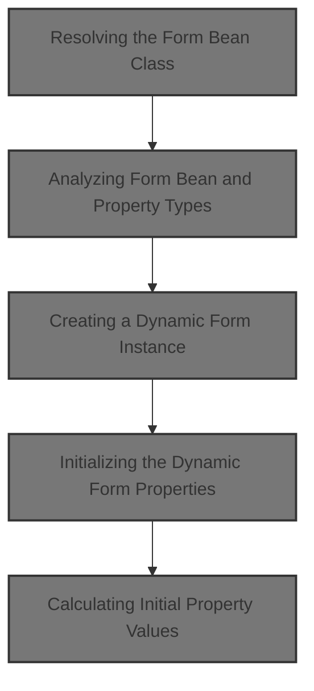
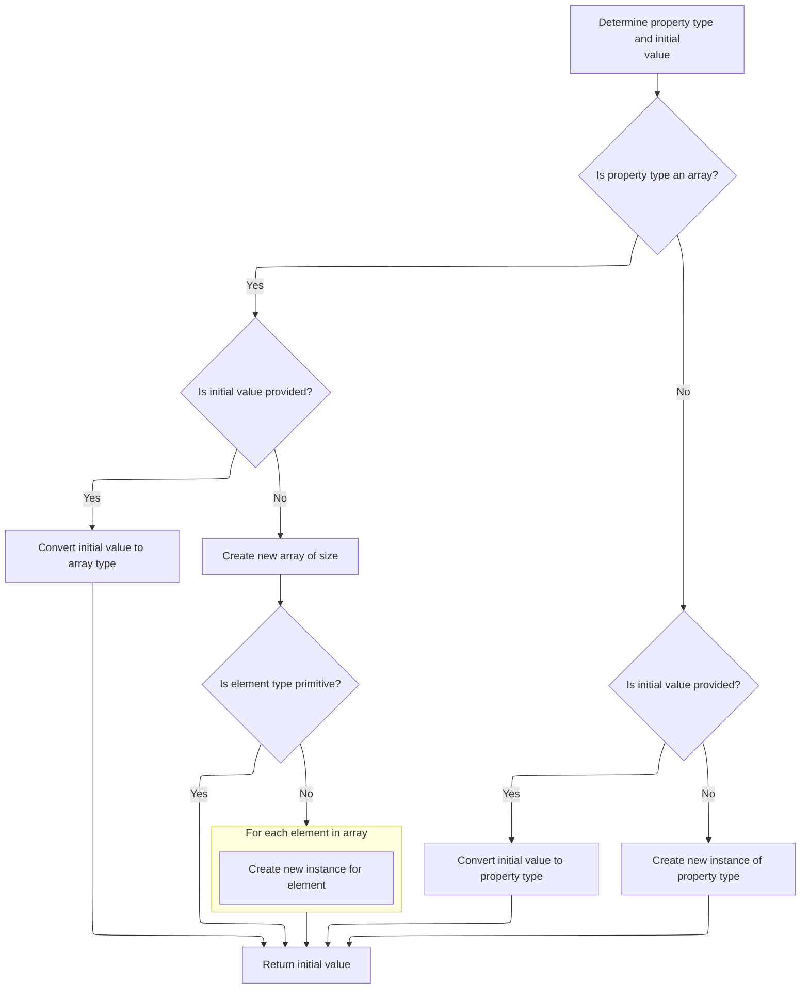

This document explains how a dynamic form instance is generated and initialized using configuration data. The flow receives a form bean configuration as input and produces a fully initialized form instance, enabling flexible, configurable forms at runtime.



# Creating a Dynamic Form Instance

<SwmSnippet path="/core/src/main/java/org/apache/struts/action/DynaActionFormClass.java" line="158">

---

In <SwmToken path="core/src/main/java/org/apache/struts/action/DynaActionFormClass.java" pos="158:5:5" line-data="    public DynaBean newInstance()">`newInstance`</SwmToken>, we're using reflection to create a new <SwmToken path="core/src/main/java/org/apache/struts/action/DynaActionFormClass.java" pos="160:1:1" line-data="        DynaActionForm dynaBean = (DynaActionForm) getBeanClass().newInstance();">`DynaActionForm`</SwmToken> by calling <SwmToken path="core/src/main/java/org/apache/struts/action/DynaActionFormClass.java" pos="160:11:13" line-data="        DynaActionForm dynaBean = (DynaActionForm) getBeanClass().newInstance();">`getBeanClass()`</SwmToken><SwmToken path="core/src/main/java/org/apache/struts/action/DynaActionFormClass.java" pos="160:14:17" line-data="        DynaActionForm dynaBean = (DynaActionForm) getBeanClass().newInstance();">`.newInstance()`</SwmToken>. This lets us instantiate whatever class is configured at runtime, as long as it extends <SwmToken path="core/src/main/java/org/apache/struts/action/DynaActionFormClass.java" pos="160:1:1" line-data="        DynaActionForm dynaBean = (DynaActionForm) getBeanClass().newInstance();">`DynaActionForm`</SwmToken>. We need to call <SwmToken path="core/src/main/java/org/apache/struts/action/DynaActionFormClass.java" pos="160:11:11" line-data="        DynaActionForm dynaBean = (DynaActionForm) getBeanClass().newInstance();">`getBeanClass`</SwmToken> next to figure out which class to actually instantiate, since it's not fixed in the code.

```java
    public DynaBean newInstance()
        throws IllegalAccessException, InstantiationException {
        DynaActionForm dynaBean = (DynaActionForm) getBeanClass().newInstance();

```

---

</SwmSnippet>

## Resolving the Form Bean Class

<SwmSnippet path="/core/src/main/java/org/apache/struts/action/DynaActionFormClass.java" line="227">

---

<SwmToken path="core/src/main/java/org/apache/struts/action/DynaActionFormClass.java" pos="227:5:5" line-data="    protected Class getBeanClass() {">`getBeanClass`</SwmToken> checks if <SwmToken path="core/src/main/java/org/apache/struts/action/DynaActionFormClass.java" pos="228:4:4" line-data="        if (beanClass == null) {">`beanClass`</SwmToken> is already set. If not, it calls introspect(config) to load and validate the class based on the configuration. This ensures we only do the expensive reflection and validation once, and always return the same class for this config.

```java
    protected Class getBeanClass() {
        if (beanClass == null) {
            introspect(config);
        }

        return (beanClass);
    }
```

---

</SwmSnippet>

## Analyzing Form Bean and Property Types

```mermaid
%%{init: {"flowchart": {"defaultRenderer": "elk"}} }%%
flowchart TD
    node1["Analyze form bean configuration"] --> node2{"Is form bean class valid?"}
    click node1 openCode "core/src/main/java/org/apache/struts/action/DynaActionFormClass.java:246:247"
    node2 -->|"Yes"| node3{"Is form bean class a DynaActionForm?"}
    click node2 openCode "core/src/main/java/org/apache/struts/action/DynaActionFormClass.java:250:258"
    node2 -->|"No"| node6["Raise error: Invalid class"]
    click node6 openCode "core/src/main/java/org/apache/struts/action/DynaActionFormClass.java:253:258"
    node3 -->|"Yes"| node4["Get property descriptors"]
    click node3 openCode "core/src/main/java/org/apache/struts/action/DynaActionFormClass.java:260:264"
    node3 -->|"No"| node7["Raise error: Not a DynaActionForm"]
    click node7 openCode "core/src/main/java/org/apache/struts/action/DynaActionFormClass.java:261:264"
    node4 --> node9{"Are property descriptors present?"}
    click node4 openCode "core/src/main/java/org/apache/struts/action/DynaActionFormClass.java:270:274"
    node9 -->|"Yes"| loop1
    node9 -->|"No"| node10["No properties to define"]
    click node10 openCode "core/src/main/java/org/apache/struts/action/DynaActionFormClass.java:273:274"
    
    subgraph loop1["For each property descriptor"]
      node11["Create dynamic property definition and
add to map"]
      click node11 openCode "core/src/main/java/org/apache/struts/action/DynaActionFormClass.java:279:284"
    end
    loop1 --> node8["Dynamic form ready"]
    click node8 openCode "core/src/main/java/org/apache/struts/action/DynaActionFormClass.java:285:285"
    node10 --> node8
classDef HeadingStyle fill:#777777,stroke:#333,stroke-width:2px;

%% Swimm:
%% %%{init: {"flowchart": {"defaultRenderer": "elk"}} }%%
%% flowchart TD
%%     node1["Analyze form bean configuration"] --> node2{"Is form bean class valid?"}
%%     click node1 openCode "<SwmPath>[core/…/action/DynaActionFormClass.java](core/src/main/java/org/apache/struts/action/DynaActionFormClass.java)</SwmPath>:246:247"
%%     node2 -->|"Yes"| node3{"Is form bean class a <SwmToken path="core/src/main/java/org/apache/struts/action/DynaActionFormClass.java" pos="160:1:1" line-data="        DynaActionForm dynaBean = (DynaActionForm) getBeanClass().newInstance();">`DynaActionForm`</SwmToken>?"}
%%     click node2 openCode "<SwmPath>[core/…/action/DynaActionFormClass.java](core/src/main/java/org/apache/struts/action/DynaActionFormClass.java)</SwmPath>:250:258"
%%     node2 -->|"No"| node6["Raise error: Invalid class"]
%%     click node6 openCode "<SwmPath>[core/…/action/DynaActionFormClass.java](core/src/main/java/org/apache/struts/action/DynaActionFormClass.java)</SwmPath>:253:258"
%%     node3 -->|"Yes"| node4["Get property descriptors"]
%%     click node3 openCode "<SwmPath>[core/…/action/DynaActionFormClass.java](core/src/main/java/org/apache/struts/action/DynaActionFormClass.java)</SwmPath>:260:264"
%%     node3 -->|"No"| node7["Raise error: Not a <SwmToken path="core/src/main/java/org/apache/struts/action/DynaActionFormClass.java" pos="160:1:1" line-data="        DynaActionForm dynaBean = (DynaActionForm) getBeanClass().newInstance();">`DynaActionForm`</SwmToken>"]
%%     click node7 openCode "<SwmPath>[core/…/action/DynaActionFormClass.java](core/src/main/java/org/apache/struts/action/DynaActionFormClass.java)</SwmPath>:261:264"
%%     node4 --> node9{"Are property descriptors present?"}
%%     click node4 openCode "<SwmPath>[core/…/action/DynaActionFormClass.java](core/src/main/java/org/apache/struts/action/DynaActionFormClass.java)</SwmPath>:270:274"
%%     node9 -->|"Yes"| loop1
%%     node9 -->|"No"| node10["No properties to define"]
%%     click node10 openCode "<SwmPath>[core/…/action/DynaActionFormClass.java](core/src/main/java/org/apache/struts/action/DynaActionFormClass.java)</SwmPath>:273:274"
%%     
%%     subgraph loop1["For each property descriptor"]
%%       node11["Create dynamic property definition and
%% add to map"]
%%       click node11 openCode "<SwmPath>[core/…/action/DynaActionFormClass.java](core/src/main/java/org/apache/struts/action/DynaActionFormClass.java)</SwmPath>:279:284"
%%     end
%%     loop1 --> node8["Dynamic form ready"]
%%     click node8 openCode "<SwmPath>[core/…/action/DynaActionFormClass.java](core/src/main/java/org/apache/struts/action/DynaActionFormClass.java)</SwmPath>:285:285"
%%     node10 --> node8
%% classDef HeadingStyle fill:#777777,stroke:#333,stroke-width:2px;
```



<SwmSnippet path="/core/src/main/java/org/apache/struts/action/DynaActionFormClass.java" line="246">

---

<SwmToken path="core/src/main/java/org/apache/struts/action/DynaActionFormClass.java" pos="246:5:5" line-data="    protected void introspect(FormBeanConfig config) {">`introspect`</SwmToken> loads the class for the form bean using the type from config, checks it's a <SwmToken path="core/src/main/java/org/apache/struts/action/DynaActionFormClass.java" pos="260:5:5" line-data="        if (!DynaActionForm.class.isAssignableFrom(beanClass)) {">`DynaActionForm`</SwmToken> subclass, and sets up the dynamic properties by creating <SwmToken path="core/src/main/java/org/apache/struts/action/DynaActionFormClass.java" pos="277:7:7" line-data="        properties = new DynaProperty[descriptors.length];">`DynaProperty`</SwmToken> objects for each property config. We call <SwmToken path="core/src/main/java/org/apache/struts/action/DynaActionFormClass.java" pos="270:1:1" line-data="        FormPropertyConfig[] descriptors = config.findFormPropertyConfigs();">`FormPropertyConfig`</SwmToken> next to resolve the type for each property, since each <SwmToken path="core/src/main/java/org/apache/struts/action/DynaActionFormClass.java" pos="277:7:7" line-data="        properties = new DynaProperty[descriptors.length];">`DynaProperty`</SwmToken> needs the actual Java class for its type.

```java
    protected void introspect(FormBeanConfig config) {
        this.config = config;

        // Validate the ActionFormBean implementation class
        try {
            beanClass = RequestUtils.applicationClass(config.getType());
        } catch (Throwable t) {
        	IllegalArgumentException t2 = new IllegalArgumentException(
                "Cannot instantiate ActionFormBean class '" + config.getType()
                + "'");
        	t2.initCause(t);
        	throw t2;
        }

        if (!DynaActionForm.class.isAssignableFrom(beanClass)) {
            throw new IllegalArgumentException("Class '" + config.getType()
                + "' is not a subclass of "
                + "'org.apache.struts.action.DynaActionForm'");
        }

        // Set the name we will know ourselves by from the form bean name
        this.name = config.getName();

        // Look up the property descriptors for this bean class
        FormPropertyConfig[] descriptors = config.findFormPropertyConfigs();

        if (descriptors == null) {
            descriptors = new FormPropertyConfig[0];
        }

        // Create corresponding dynamic property definitions
        properties = new DynaProperty[descriptors.length];

        for (int i = 0; i < descriptors.length; i++) {
            properties[i] =
                new DynaProperty(descriptors[i].getName(),
                    descriptors[i].getTypeClass());
            propertiesMap.put(properties[i].getName(), properties[i]);
        }
    }
```

---

</SwmSnippet>

<SwmSnippet path="/core/src/main/java/org/apache/struts/config/FormPropertyConfig.java" line="221">

---

<SwmToken path="core/src/main/java/org/apache/struts/config/FormPropertyConfig.java" pos="221:5:5" line-data="    public Class getTypeClass() {">`getTypeClass`</SwmToken> figures out the actual Java class for a property type, handling primitives, arrays, and regular classes. This is needed before we can create or initialize form bean instances, since we need to know the right type for each property when calling <SwmToken path="core/src/main/java/org/apache/struts/config/FormPropertyConfig.java" pos="269:6:6" line-data="            return (Array.newInstance(baseClass, 0).getClass());">`newInstance`</SwmToken>.

```java
    public Class getTypeClass() {
        // Identify the base class (in case an array was specified)
        String baseType = getType();
        boolean indexed = false;

        if (baseType.endsWith("[]")) {
            baseType = baseType.substring(0, baseType.length() - 2);
            indexed = true;
        }

        // Construct an appropriate Class instance for the base class
        Class baseClass = null;

        if ("boolean".equals(baseType)) {
            baseClass = Boolean.TYPE;
        } else if ("byte".equals(baseType)) {
            baseClass = Byte.TYPE;
        } else if ("char".equals(baseType)) {
            baseClass = Character.TYPE;
        } else if ("double".equals(baseType)) {
            baseClass = Double.TYPE;
        } else if ("float".equals(baseType)) {
            baseClass = Float.TYPE;
        } else if ("int".equals(baseType)) {
            baseClass = Integer.TYPE;
        } else if ("long".equals(baseType)) {
            baseClass = Long.TYPE;
        } else if ("short".equals(baseType)) {
            baseClass = Short.TYPE;
        } else {
            ClassLoader classLoader =
                Thread.currentThread().getContextClassLoader();

            if (classLoader == null) {
                classLoader = this.getClass().getClassLoader();
            }

            try {
                baseClass = classLoader.loadClass(baseType);
            } catch (ClassNotFoundException ex) {
                log.error("Class '" + baseType +
                          "' not found for property '" + name + "'");
                baseClass = null;
            }
        }

        // Return the base class or an array appropriately
        if (indexed) {
            return (Array.newInstance(baseClass, 0).getClass());
        } else {
            return (baseClass);
        }
    }
```

---

</SwmSnippet>

## Initializing the Dynamic Form Properties

<SwmSnippet path="/core/src/main/java/org/apache/struts/action/DynaActionFormClass.java" line="162">

---

Back in DynaActionFormClass.newInstance, after getting the bean class, we set up the new <SwmToken path="core/src/main/java/org/apache/struts/action/DynaActionFormClass.java" pos="160:1:1" line-data="        DynaActionForm dynaBean = (DynaActionForm) getBeanClass().newInstance();">`DynaActionForm`</SwmToken> instance by linking it to its class object and initializing all its properties using the configs. We call FormPropertyConfig.initial next to get the right starting value for each property, so the form is ready to use.

```java
        dynaBean.setDynaActionFormClass(this);

        FormPropertyConfig[] props = config.findFormPropertyConfigs();

        for (int i = 0; i < props.length; i++) {
            dynaBean.set(props[i].getName(), props[i].initial());
        }

        return (dynaBean);
    }
```

---

</SwmSnippet>

# Calculating Initial Property Values



<SwmSnippet path="/core/src/main/java/org/apache/struts/config/FormPropertyConfig.java" line="318">

---

In <SwmToken path="core/src/main/java/org/apache/struts/config/FormPropertyConfig.java" pos="318:5:5" line-data="    public Object initial() {">`initial`</SwmToken>, we figure out the starting value for a property by checking its type (array or not), and either converting an explicit initial value or creating a new instance/array. We need to keep going in this function to handle both array and non-array cases.

```java
    public Object initial() {
        Object initialValue = null;

        try {
            Class clazz = getTypeClass();

```

---

</SwmSnippet>

<SwmSnippet path="/core/src/main/java/org/apache/struts/config/FormPropertyConfig.java" line="324">

---

Just returned from <SwmToken path="core/src/main/java/org/apache/struts/action/DynaActionFormClass.java" pos="282:6:6" line-data="                    descriptors[i].getTypeClass());">`getTypeClass`</SwmToken> in FormPropertyConfig.initial. Here, if the property is an array, we either convert the initial value or create a new array and fill it with new instances (unless it's a primitive). If creating an element fails, we log the error and keep going.

```java
            if (clazz.isArray()) {
                if (initial != null) {
                    initialValue = ConvertUtils.convert(initial, clazz);
                } else {
                    initialValue =
                        Array.newInstance(clazz.getComponentType(), size);

                    if (!(clazz.getComponentType().isPrimitive())) {
                        for (int i = 0; i < size; i++) {
                            try {
                                Array.set(initialValue, i,
                                    clazz.getComponentType().newInstance());
                            } catch (Throwable t) {
                                log.error("Unable to create instance of "
                                    + clazz.getName() + " for property=" + name
                                    + ", type=" + type + ", initial=" + initial
                                    + ", size=" + size + ".");

                                //FIXME: Should we just dump the entire application/module ?
                            }
                        }
```

---

</SwmSnippet>

<SwmSnippet path="/core/src/main/java/org/apache/struts/config/FormPropertyConfig.java" line="348">

---

Finishing up in FormPropertyConfig.initial, if the property isn't an array, we either convert the initial value or just create a new instance. If anything fails, we return null. This value is then used by DynaActionFormClass.newInstance to initialize the property in the form bean.

```java
                if (initial != null) {
                    initialValue = ConvertUtils.convert(initial, clazz);
                } else {
                    initialValue = clazz.newInstance();
                }
            }
        } catch (Throwable t) {
            initialValue = null;
        }

        return (initialValue);
    }
```

---

</SwmSnippet>

&nbsp;

*This is an auto-generated document by Swimm 🌊 and has not yet been verified by a human*

<SwmMeta version="3.0.0" repo-id="Z2l0aHViJTNBJTNBc3RydXRzMSUzQSUzQVN3aW1tLURlbW8=" repo-name="struts1"><sup>Powered by [Swimm](https://app.swimm.io/)</sup></SwmMeta>
