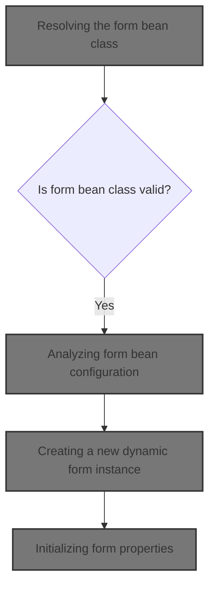

This document describes how the system creates and initializes a new dynamic form instance based on configuration. By resolving the form's structure and property definitions at runtime, the application can generate flexible forms tailored to different user input needs.



# Creating a new dynamic form instance

<SwmSnippet path="/core/src/main/java/org/apache/struts/action/DynaActionFormClass.java" line="158">

---

In <SwmToken path="core/src/main/java/org/apache/struts/action/DynaActionFormClass.java" pos="158:5:5" line-data="    public DynaBean newInstance()">`newInstance`</SwmToken>, we use reflection to create a new <SwmToken path="core/src/main/java/org/apache/struts/action/DynaActionFormClass.java" pos="160:1:1" line-data="        DynaActionForm dynaBean = (DynaActionForm) getBeanClass().newInstance();">`DynaActionForm`</SwmToken> by calling <SwmToken path="core/src/main/java/org/apache/struts/action/DynaActionFormClass.java" pos="160:11:13" line-data="        DynaActionForm dynaBean = (DynaActionForm) getBeanClass().newInstance();">`getBeanClass()`</SwmToken><SwmToken path="core/src/main/java/org/apache/struts/action/DynaActionFormClass.java" pos="160:14:17" line-data="        DynaActionForm dynaBean = (DynaActionForm) getBeanClass().newInstance();">`.newInstance()`</SwmToken> and casting it. This assumes <SwmToken path="core/src/main/java/org/apache/struts/action/DynaActionFormClass.java" pos="160:11:11" line-data="        DynaActionForm dynaBean = (DynaActionForm) getBeanClass().newInstance();">`getBeanClass`</SwmToken> always returns a subclass of <SwmToken path="core/src/main/java/org/apache/struts/action/DynaActionFormClass.java" pos="160:1:1" line-data="        DynaActionForm dynaBean = (DynaActionForm) getBeanClass().newInstance();">`DynaActionForm`</SwmToken>, otherwise we'll get a ClassCastException. We need to call <SwmToken path="core/src/main/java/org/apache/struts/action/DynaActionFormClass.java" pos="160:11:11" line-data="        DynaActionForm dynaBean = (DynaActionForm) getBeanClass().newInstance();">`getBeanClass`</SwmToken> next because it handles lazy initialization and ensures the correct class is ready for instantiation.

```java
    public DynaBean newInstance()
        throws IllegalAccessException, InstantiationException {
        DynaActionForm dynaBean = (DynaActionForm) getBeanClass().newInstance();

```

---

</SwmSnippet>

## Resolving the form bean class

<SwmSnippet path="/core/src/main/java/org/apache/struts/action/DynaActionFormClass.java" line="227">

---

<SwmToken path="core/src/main/java/org/apache/struts/action/DynaActionFormClass.java" pos="227:5:5" line-data="    protected Class getBeanClass() {">`getBeanClass`</SwmToken> checks if <SwmToken path="core/src/main/java/org/apache/struts/action/DynaActionFormClass.java" pos="228:4:4" line-data="        if (beanClass == null) {">`beanClass`</SwmToken> is null and, if so, calls introspect(config) to set it up. This lazy initialization means <SwmToken path="core/src/main/java/org/apache/struts/action/DynaActionFormClass.java" pos="228:4:4" line-data="        if (beanClass == null) {">`beanClass`</SwmToken> isn't created until it's needed. We call introspect next because that's where the actual class loading and validation happens.

```java
    protected Class getBeanClass() {
        if (beanClass == null) {
            introspect(config);
        }

        return (beanClass);
    }
```

---

</SwmSnippet>

## Analyzing form bean configuration

```mermaid
%%{init: {"flowchart": {"defaultRenderer": "elk"}} }%%
flowchart TD
    node1["Start introspection of form bean
configuration"]
    click node1 openCode "core/src/main/java/org/apache/struts/action/DynaActionFormClass.java:246:247"
    node1 --> node2{"Can the form bean class be instantiated?"}
    click node2 openCode "core/src/main/java/org/apache/struts/action/DynaActionFormClass.java:250:258"
    node2 -->|"No"| node3["Fail: Cannot instantiate form bean class"]
    click node3 openCode "core/src/main/java/org/apache/struts/action/DynaActionFormClass.java:253:258"
    node2 -->|"Yes"| node4{"Is the class a valid dynamic form?"}
    click node4 openCode "core/src/main/java/org/apache/struts/action/DynaActionFormClass.java:260:264"
    node4 -->|"No"| node5["Fail: Class is not a valid dynamic form"]
    click node5 openCode "core/src/main/java/org/apache/struts/action/DynaActionFormClass.java:261:264"
    node4 -->|"Yes"| node6["Assign form bean name"]
    click node6 openCode "core/src/main/java/org/apache/struts/action/DynaActionFormClass.java:267:267"
    node6 --> node7["Extract property descriptors"]
    click node7 openCode "core/src/main/java/org/apache/struts/action/DynaActionFormClass.java:270:270"
    node7 --> node8{"Are there property descriptors?"}
    click node8 openCode "core/src/main/java/org/apache/struts/action/DynaActionFormClass.java:272:274"
    node8 -->|"No"| node9["Use empty property list"]
    click node9 openCode "core/src/main/java/org/apache/struts/action/DynaActionFormClass.java:273:274"
    node8 -->|"Yes"| node10["Define properties for form"]
    click node10 openCode "core/src/main/java/org/apache/struts/action/DynaActionFormClass.java:277:284"
    
    subgraph loop1["For each property descriptor"]
        node10 --> node11["Create property definition for form"]
        click node11 openCode "core/src/main/java/org/apache/struts/action/DynaActionFormClass.java:280:283"
    end
    node9 --> node12["Finish introspection"]
    click node12 openCode "core/src/main/java/org/apache/struts/action/DynaActionFormClass.java:285:285"
    node11 --> node12

classDef HeadingStyle fill:#777777,stroke:#333,stroke-width:2px;

%% Swimm:
%% %%{init: {"flowchart": {"defaultRenderer": "elk"}} }%%
%% flowchart TD
%%     node1["Start introspection of form bean
%% configuration"]
%%     click node1 openCode "<SwmPath>[core/…/action/DynaActionFormClass.java](core/src/main/java/org/apache/struts/action/DynaActionFormClass.java)</SwmPath>:246:247"
%%     node1 --> node2{"Can the form bean class be instantiated?"}
%%     click node2 openCode "<SwmPath>[core/…/action/DynaActionFormClass.java](core/src/main/java/org/apache/struts/action/DynaActionFormClass.java)</SwmPath>:250:258"
%%     node2 -->|"No"| node3["Fail: Cannot instantiate form bean class"]
%%     click node3 openCode "<SwmPath>[core/…/action/DynaActionFormClass.java](core/src/main/java/org/apache/struts/action/DynaActionFormClass.java)</SwmPath>:253:258"
%%     node2 -->|"Yes"| node4{"Is the class a valid dynamic form?"}
%%     click node4 openCode "<SwmPath>[core/…/action/DynaActionFormClass.java](core/src/main/java/org/apache/struts/action/DynaActionFormClass.java)</SwmPath>:260:264"
%%     node4 -->|"No"| node5["Fail: Class is not a valid dynamic form"]
%%     click node5 openCode "<SwmPath>[core/…/action/DynaActionFormClass.java](core/src/main/java/org/apache/struts/action/DynaActionFormClass.java)</SwmPath>:261:264"
%%     node4 -->|"Yes"| node6["Assign form bean name"]
%%     click node6 openCode "<SwmPath>[core/…/action/DynaActionFormClass.java](core/src/main/java/org/apache/struts/action/DynaActionFormClass.java)</SwmPath>:267:267"
%%     node6 --> node7["Extract property descriptors"]
%%     click node7 openCode "<SwmPath>[core/…/action/DynaActionFormClass.java](core/src/main/java/org/apache/struts/action/DynaActionFormClass.java)</SwmPath>:270:270"
%%     node7 --> node8{"Are there property descriptors?"}
%%     click node8 openCode "<SwmPath>[core/…/action/DynaActionFormClass.java](core/src/main/java/org/apache/struts/action/DynaActionFormClass.java)</SwmPath>:272:274"
%%     node8 -->|"No"| node9["Use empty property list"]
%%     click node9 openCode "<SwmPath>[core/…/action/DynaActionFormClass.java](core/src/main/java/org/apache/struts/action/DynaActionFormClass.java)</SwmPath>:273:274"
%%     node8 -->|"Yes"| node10["Define properties for form"]
%%     click node10 openCode "<SwmPath>[core/…/action/DynaActionFormClass.java](core/src/main/java/org/apache/struts/action/DynaActionFormClass.java)</SwmPath>:277:284"
%%     
%%     subgraph loop1["For each property descriptor"]
%%         node10 --> node11["Create property definition for form"]
%%         click node11 openCode "<SwmPath>[core/…/action/DynaActionFormClass.java](core/src/main/java/org/apache/struts/action/DynaActionFormClass.java)</SwmPath>:280:283"
%%     end
%%     node9 --> node12["Finish introspection"]
%%     click node12 openCode "<SwmPath>[core/…/action/DynaActionFormClass.java](core/src/main/java/org/apache/struts/action/DynaActionFormClass.java)</SwmPath>:285:285"
%%     node11 --> node12
%% 
%% classDef HeadingStyle fill:#777777,stroke:#333,stroke-width:2px;
```



<SwmSnippet path="/core/src/main/java/org/apache/struts/action/DynaActionFormClass.java" line="246">

---

<SwmToken path="core/src/main/java/org/apache/struts/action/DynaActionFormClass.java" pos="246:5:5" line-data="    protected void introspect(FormBeanConfig config) {">`introspect`</SwmToken> loads the form bean class from config, checks it's a subclass of <SwmToken path="core/src/main/java/org/apache/struts/action/DynaActionFormClass.java" pos="260:5:5" line-data="        if (!DynaActionForm.class.isAssignableFrom(beanClass)) {">`DynaActionForm`</SwmToken>, and sets up property definitions using <SwmToken path="core/src/main/java/org/apache/struts/action/DynaActionFormClass.java" pos="270:1:1" line-data="        FormPropertyConfig[] descriptors = config.findFormPropertyConfigs();">`FormPropertyConfig`</SwmToken> descriptors. We need to call <SwmToken path="core/src/main/java/org/apache/struts/action/DynaActionFormClass.java" pos="270:1:1" line-data="        FormPropertyConfig[] descriptors = config.findFormPropertyConfigs();">`FormPropertyConfig`</SwmToken> next to get the type class for each property, which is used to build the <SwmToken path="core/src/main/java/org/apache/struts/action/DynaActionFormClass.java" pos="277:7:7" line-data="        properties = new DynaProperty[descriptors.length];">`DynaProperty`</SwmToken> array.

```java
    protected void introspect(FormBeanConfig config) {
        this.config = config;

        // Validate the ActionFormBean implementation class
        try {
            beanClass = RequestUtils.applicationClass(config.getType());
        } catch (Throwable t) {
        	IllegalArgumentException t2 = new IllegalArgumentException(
                "Cannot instantiate ActionFormBean class '" + config.getType()
                + "'");
        	t2.initCause(t);
        	throw t2;
        }

        if (!DynaActionForm.class.isAssignableFrom(beanClass)) {
            throw new IllegalArgumentException("Class '" + config.getType()
                + "' is not a subclass of "
                + "'org.apache.struts.action.DynaActionForm'");
        }

        // Set the name we will know ourselves by from the form bean name
        this.name = config.getName();

        // Look up the property descriptors for this bean class
        FormPropertyConfig[] descriptors = config.findFormPropertyConfigs();

        if (descriptors == null) {
            descriptors = new FormPropertyConfig[0];
        }

        // Create corresponding dynamic property definitions
        properties = new DynaProperty[descriptors.length];

        for (int i = 0; i < descriptors.length; i++) {
            properties[i] =
                new DynaProperty(descriptors[i].getName(),
                    descriptors[i].getTypeClass());
            propertiesMap.put(properties[i].getName(), properties[i]);
        }
    }
```

---

</SwmSnippet>

<SwmSnippet path="/core/src/main/java/org/apache/struts/config/FormPropertyConfig.java" line="221">

---

<SwmToken path="core/src/main/java/org/apache/struts/config/FormPropertyConfig.java" pos="221:5:5" line-data="    public Class getTypeClass() {">`getTypeClass`</SwmToken> figures out the actual class for a property, handling primitives and arrays. We need to call DynaActionFormClass.newInstance next because it uses this class info to set up the initial values for each property in the new form instance.

```java
    public Class getTypeClass() {
        // Identify the base class (in case an array was specified)
        String baseType = getType();
        boolean indexed = false;

        if (baseType.endsWith("[]")) {
            baseType = baseType.substring(0, baseType.length() - 2);
            indexed = true;
        }

        // Construct an appropriate Class instance for the base class
        Class baseClass = null;

        if ("boolean".equals(baseType)) {
            baseClass = Boolean.TYPE;
        } else if ("byte".equals(baseType)) {
            baseClass = Byte.TYPE;
        } else if ("char".equals(baseType)) {
            baseClass = Character.TYPE;
        } else if ("double".equals(baseType)) {
            baseClass = Double.TYPE;
        } else if ("float".equals(baseType)) {
            baseClass = Float.TYPE;
        } else if ("int".equals(baseType)) {
            baseClass = Integer.TYPE;
        } else if ("long".equals(baseType)) {
            baseClass = Long.TYPE;
        } else if ("short".equals(baseType)) {
            baseClass = Short.TYPE;
        } else {
            ClassLoader classLoader =
                Thread.currentThread().getContextClassLoader();

            if (classLoader == null) {
                classLoader = this.getClass().getClassLoader();
            }

            try {
                baseClass = classLoader.loadClass(baseType);
            } catch (ClassNotFoundException ex) {
                log.error("Class '" + baseType +
                          "' not found for property '" + name + "'");
                baseClass = null;
            }
        }

        // Return the base class or an array appropriately
        if (indexed) {
            return (Array.newInstance(baseClass, 0).getClass());
        } else {
            return (baseClass);
        }
    }
```

---

</SwmSnippet>

## Initializing form properties

<SwmSnippet path="/core/src/main/java/org/apache/struts/action/DynaActionFormClass.java" line="162">

---

Back in DynaActionFormClass.newInstance, after getting the bean class, we set up the new instance and initialize its properties using FormPropertyConfig.initial. We need to call <SwmToken path="core/src/main/java/org/apache/struts/action/DynaActionFormClass.java" pos="164:1:1" line-data="        FormPropertyConfig[] props = config.findFormPropertyConfigs();">`FormPropertyConfig`</SwmToken> next because that's where the logic for determining each property's initial value lives.

```java
        dynaBean.setDynaActionFormClass(this);

        FormPropertyConfig[] props = config.findFormPropertyConfigs();

        for (int i = 0; i < props.length; i++) {
            dynaBean.set(props[i].getName(), props[i].initial());
        }

        return (dynaBean);
    }
```

---

</SwmSnippet>

# Determining initial property values

```mermaid
%%{init: {"flowchart": {"defaultRenderer": "elk"}} }%%
flowchart TD
  node1["Start: Determine initial value for
property"] --> node2{"Is property type an array?"}
  click node1 openCode "core/src/main/java/org/apache/struts/config/FormPropertyConfig.java:318:322"
  node2 -->|"Yes"| node3{"Is initial value provided?"}
  click node2 openCode "core/src/main/java/org/apache/struts/config/FormPropertyConfig.java:324:324"
  node3 -->|"Yes"| node4["Convert provided value to array type"]
  click node3 openCode "core/src/main/java/org/apache/struts/config/FormPropertyConfig.java:325:326"
  node3 -->|"No"| node5["Create array of size N (size)"]
  click node5 openCode "core/src/main/java/org/apache/struts/config/FormPropertyConfig.java:328:329"
  node5 --> node6{"Is element type primitive?"}
  click node6 openCode "core/src/main/java/org/apache/struts/config/FormPropertyConfig.java:331:331"
  node6 -->|"No"| subgraph loop1["For each element in array of type T"]
    node7["Instantiate and assign element"]
    click node7 openCode "core/src/main/java/org/apache/struts/config/FormPropertyConfig.java:332:344"
  end
  node6 -->|"Yes"| node8["Array elements remain default"]
  click node8 openCode "core/src/main/java/org/apache/struts/config/FormPropertyConfig.java:329:331"
  node2 -->|"No"| node9{"Is initial value provided?"}
  click node9 openCode "core/src/main/java/org/apache/struts/config/FormPropertyConfig.java:348:349"
  node9 -->|"Yes"| node10["Convert provided value to property type"]
  click node10 openCode "core/src/main/java/org/apache/struts/config/FormPropertyConfig.java:349:350"
  node9 -->|"No"| node11["Create new instance of property type"]
  click node11 openCode "core/src/main/java/org/apache/struts/config/FormPropertyConfig.java:351:352"
  node4 --> node12["Return initial value"]
  node7 --> node12
  node8 --> node12
  node10 --> node12
  node11 --> node12
  click node12 openCode "core/src/main/java/org/apache/struts/config/FormPropertyConfig.java:358:359"
  node12 --> node13{"Was there an error during
initialization?"}
  click node13 openCode "core/src/main/java/org/apache/struts/config/FormPropertyConfig.java:354:356"
  node13 -->|"No"| node14["Return initial value"]
  click node14 openCode "core/src/main/java/org/apache/struts/config/FormPropertyConfig.java:358:359"
  node13 -->|"Yes"| node15["Return null (initialization failed)"]
  click node15 openCode "core/src/main/java/org/apache/struts/config/FormPropertyConfig.java:355:356"
classDef HeadingStyle fill:#777777,stroke:#333,stroke-width:2px;

%% Swimm:
%% %%{init: {"flowchart": {"defaultRenderer": "elk"}} }%%
%% flowchart TD
%%   node1["Start: Determine initial value for
%% property"] --> node2{"Is property type an array?"}
%%   click node1 openCode "<SwmPath>[core/…/config/FormPropertyConfig.java](core/src/main/java/org/apache/struts/config/FormPropertyConfig.java)</SwmPath>:318:322"
%%   node2 -->|"Yes"| node3{"Is initial value provided?"}
%%   click node2 openCode "<SwmPath>[core/…/config/FormPropertyConfig.java](core/src/main/java/org/apache/struts/config/FormPropertyConfig.java)</SwmPath>:324:324"
%%   node3 -->|"Yes"| node4["Convert provided value to array type"]
%%   click node3 openCode "<SwmPath>[core/…/config/FormPropertyConfig.java](core/src/main/java/org/apache/struts/config/FormPropertyConfig.java)</SwmPath>:325:326"
%%   node3 -->|"No"| node5["Create array of size N (size)"]
%%   click node5 openCode "<SwmPath>[core/…/config/FormPropertyConfig.java](core/src/main/java/org/apache/struts/config/FormPropertyConfig.java)</SwmPath>:328:329"
%%   node5 --> node6{"Is element type primitive?"}
%%   click node6 openCode "<SwmPath>[core/…/config/FormPropertyConfig.java](core/src/main/java/org/apache/struts/config/FormPropertyConfig.java)</SwmPath>:331:331"
%%   node6 -->|"No"| subgraph loop1["For each element in array of type T"]
%%     node7["Instantiate and assign element"]
%%     click node7 openCode "<SwmPath>[core/…/config/FormPropertyConfig.java](core/src/main/java/org/apache/struts/config/FormPropertyConfig.java)</SwmPath>:332:344"
%%   end
%%   node6 -->|"Yes"| node8["Array elements remain default"]
%%   click node8 openCode "<SwmPath>[core/…/config/FormPropertyConfig.java](core/src/main/java/org/apache/struts/config/FormPropertyConfig.java)</SwmPath>:329:331"
%%   node2 -->|"No"| node9{"Is initial value provided?"}
%%   click node9 openCode "<SwmPath>[core/…/config/FormPropertyConfig.java](core/src/main/java/org/apache/struts/config/FormPropertyConfig.java)</SwmPath>:348:349"
%%   node9 -->|"Yes"| node10["Convert provided value to property type"]
%%   click node10 openCode "<SwmPath>[core/…/config/FormPropertyConfig.java](core/src/main/java/org/apache/struts/config/FormPropertyConfig.java)</SwmPath>:349:350"
%%   node9 -->|"No"| node11["Create new instance of property type"]
%%   click node11 openCode "<SwmPath>[core/…/config/FormPropertyConfig.java](core/src/main/java/org/apache/struts/config/FormPropertyConfig.java)</SwmPath>:351:352"
%%   node4 --> node12["Return initial value"]
%%   node7 --> node12
%%   node8 --> node12
%%   node10 --> node12
%%   node11 --> node12
%%   click node12 openCode "<SwmPath>[core/…/config/FormPropertyConfig.java](core/src/main/java/org/apache/struts/config/FormPropertyConfig.java)</SwmPath>:358:359"
%%   node12 --> node13{"Was there an error during
%% initialization?"}
%%   click node13 openCode "<SwmPath>[core/…/config/FormPropertyConfig.java](core/src/main/java/org/apache/struts/config/FormPropertyConfig.java)</SwmPath>:354:356"
%%   node13 -->|"No"| node14["Return initial value"]
%%   click node14 openCode "<SwmPath>[core/…/config/FormPropertyConfig.java](core/src/main/java/org/apache/struts/config/FormPropertyConfig.java)</SwmPath>:358:359"
%%   node13 -->|"Yes"| node15["Return null (initialization failed)"]
%%   click node15 openCode "<SwmPath>[core/…/config/FormPropertyConfig.java](core/src/main/java/org/apache/struts/config/FormPropertyConfig.java)</SwmPath>:355:356"
%% classDef HeadingStyle fill:#777777,stroke:#333,stroke-width:2px;
```

<SwmSnippet path="/core/src/main/java/org/apache/struts/config/FormPropertyConfig.java" line="318">

---

In <SwmToken path="core/src/main/java/org/apache/struts/config/FormPropertyConfig.java" pos="318:5:5" line-data="    public Object initial() {">`initial`</SwmToken>, we figure out the starting value for a property based on its type and config. We need to call the next part of <SwmToken path="core/src/main/java/org/apache/struts/action/DynaActionFormClass.java" pos="164:1:1" line-data="        FormPropertyConfig[] props = config.findFormPropertyConfigs();">`FormPropertyConfig`</SwmToken> because that's where the actual array and non-array initialization logic happens.

```java
    public Object initial() {
        Object initialValue = null;

        try {
            Class clazz = getTypeClass();

```

---

</SwmSnippet>

<SwmSnippet path="/core/src/main/java/org/apache/struts/config/FormPropertyConfig.java" line="324">

---

Just returned from the earlier part of FormPropertyConfig.initial, here we handle array types. If the property is an array and no initial value is given, we create the array and fill it with new instances for non-primitive types, so the array isn't full of nulls.

```java
            if (clazz.isArray()) {
                if (initial != null) {
                    initialValue = ConvertUtils.convert(initial, clazz);
                } else {
                    initialValue =
                        Array.newInstance(clazz.getComponentType(), size);

                    if (!(clazz.getComponentType().isPrimitive())) {
                        for (int i = 0; i < size; i++) {
                            try {
                                Array.set(initialValue, i,
                                    clazz.getComponentType().newInstance());
                            } catch (Throwable t) {
                                log.error("Unable to create instance of "
                                    + clazz.getName() + " for property=" + name
                                    + ", type=" + type + ", initial=" + initial
                                    + ", size=" + size + ".");

                                //FIXME: Should we just dump the entire application/module ?
                            }
                        }
```

---

</SwmSnippet>

<SwmSnippet path="/core/src/main/java/org/apache/struts/config/FormPropertyConfig.java" line="348">

---

Finishing up FormPropertyConfig.initial, for non-array types we either convert the initial value or create a new instance. We need to call DynaActionFormClass.newInstance next because it uses these initial values to set up each property in the new form instance.

```java
                if (initial != null) {
                    initialValue = ConvertUtils.convert(initial, clazz);
                } else {
                    initialValue = clazz.newInstance();
                }
            }
        } catch (Throwable t) {
            initialValue = null;
        }

        return (initialValue);
    }
```

---

</SwmSnippet>

&nbsp;

*This is an auto-generated document by Swimm 🌊 and has not yet been verified by a human*

<SwmMeta version="3.0.0" repo-id="Z2l0aHViJTNBJTNBc3RydXRzMSUzQSUzQVN3aW1tLURlbW8=" repo-name="struts1"><sup>Powered by [Swimm](https://app.swimm.io/)</sup></SwmMeta>
