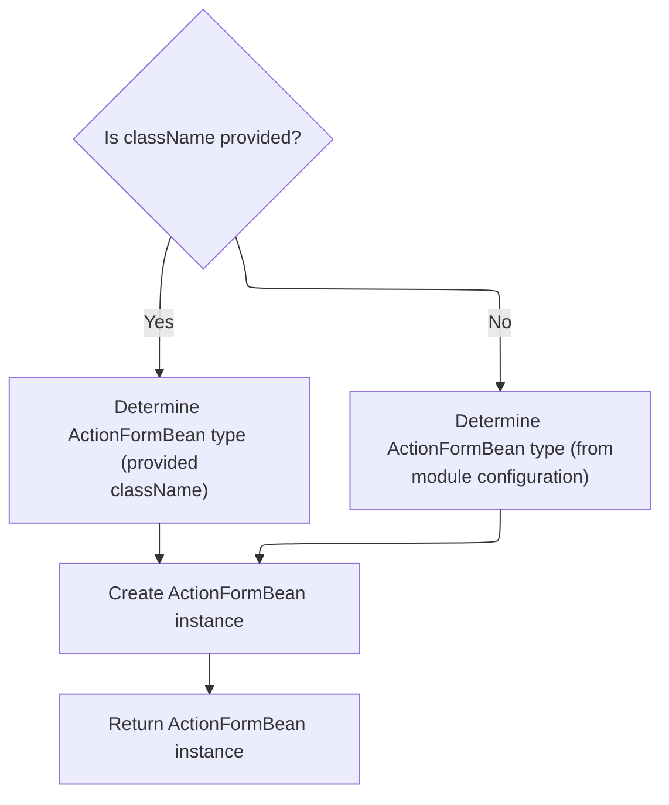
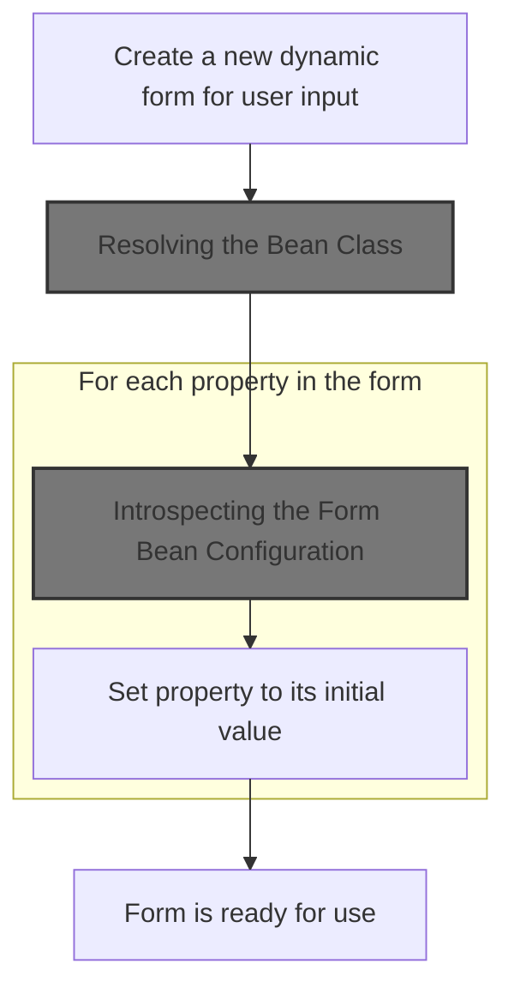
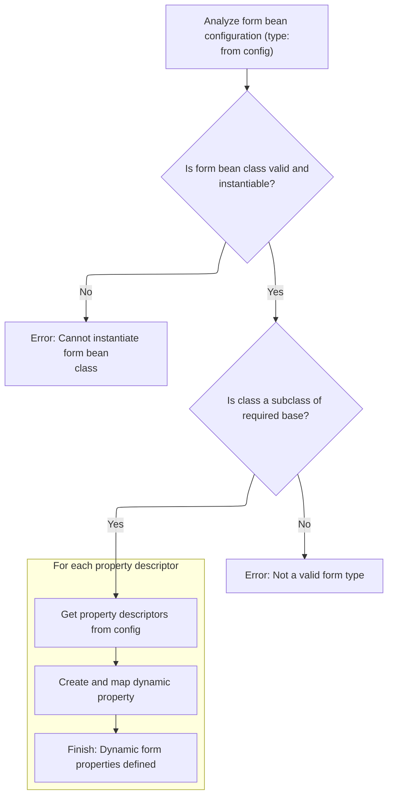
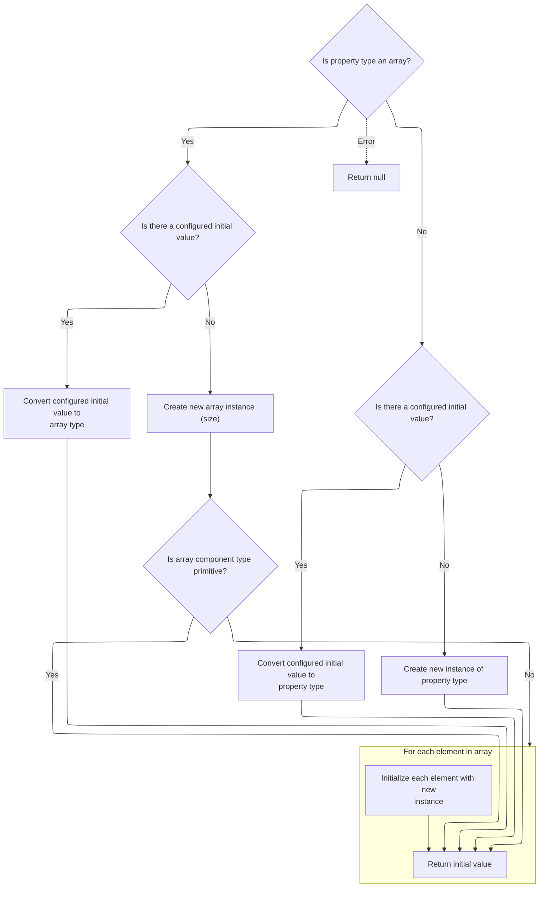

This document explains how a form bean instance is created and initialized based on configuration. Form beans are used to capture and process user input in forms. The flow determines the appropriate class, creates the instance, and sets up its properties for use in form handling.

# Choosing the Form Bean Class

<SwmSnippet path="/core/src/main/java/org/apache/struts/config/ConfigRuleSet.java" line="271">

---

In <SwmToken path="core/src/main/java/org/apache/struts/config/ConfigRuleSet.java" pos="271:5:5" line-data="    public Object createObject(Attributes attributes) {">`createObject`</SwmToken>, we're grabbing the <SwmToken path="core/src/main/java/org/apache/struts/config/ConfigRuleSet.java" pos="273:3:3" line-data="        String className = attributes.getValue(&quot;className&quot;);">`className`</SwmToken> from the attributes. If it's not there, we have to look elsewhere (the digester stack) for a default. Next, we need to resolve the value of <SwmToken path="core/src/main/java/org/apache/struts/config/ConfigRuleSet.java" pos="273:3:3" line-data="        String className = attributes.getValue(&quot;className&quot;);">`className`</SwmToken>, which is why we call into XmlAttribute.getValue—to handle any indirection or special logic around how the attribute value is actually determined.

```java
    public Object createObject(Attributes attributes) {
        // Identify the name of the class to instantiate
        String className = attributes.getValue("className");

```

---

</SwmSnippet>

## Resolving Attribute Values

<SwmSnippet path="/tiles/src/main/java/org/apache/struts/tiles/xmlDefinition/XmlAttribute.java" line="142">

---

<SwmToken path="tiles/src/main/java/org/apache/struts/tiles/xmlDefinition/XmlAttribute.java" pos="142:5:5" line-data="    public Object getValue() {">`getValue`</SwmToken> checks if we've already computed the real value for this attribute. If not, it calls <SwmToken path="tiles/src/main/java/org/apache/struts/tiles/xmlDefinition/XmlAttribute.java" pos="145:9:9" line-data="            this.realValue = this.computeRealValue();">`computeRealValue`</SwmToken> to figure it out, then caches it. This is where we handle any logic for resolving what the attribute actually means, before returning it.

```java
    public Object getValue() {
        // Compatibility with JSP Template
        if (this.realValue == null) {
            this.realValue = this.computeRealValue();
        }

        return this.realValue;
    }
```

---

</SwmSnippet>

<SwmSnippet path="/tiles/src/main/java/org/apache/struts/tiles/xmlDefinition/XmlAttribute.java" line="204">

---

<SwmToken path="tiles/src/main/java/org/apache/struts/tiles/xmlDefinition/XmlAttribute.java" pos="204:5:5" line-data="    protected Object computeRealValue() {">`computeRealValue`</SwmToken> figures out how to wrap the raw value based on the 'direct' and <SwmToken path="tiles/src/main/java/org/apache/struts/tiles/xmlDefinition/XmlAttribute.java" pos="207:22:22" line-data="        // First check direct attribute, and translate it to a valueType.">`valueType`</SwmToken> attributes. It creates the right kind of attribute object (string, path, etc.), attaches a role if needed, and falls back to <SwmToken path="tiles/src/main/java/org/apache/struts/tiles/xmlDefinition/XmlAttribute.java" pos="232:3:3" line-data="                ((UntypedAttribute) realValue).setRole(role);">`UntypedAttribute`</SwmToken> if only a role is set. This is where the attribute's type and role handling is locked in.

```java
    protected Object computeRealValue() {
        Object realValue = value;
        // Is there a type set ?
        // First check direct attribute, and translate it to a valueType.
        // Then, evaluate valueType, and create requested typed attribute.
        if (direct != null) {
            this.valueType =
                Boolean.valueOf(direct).booleanValue() ? "string" : "path";
        }

        if (value != null && valueType != null) {
            String strValue = value.toString();

            if (valueType.equalsIgnoreCase("string")) {
                realValue = new DirectStringAttribute(strValue);

            } else if (valueType.equalsIgnoreCase("page")) {
                realValue = new PathAttribute(strValue);

            } else if (valueType.equalsIgnoreCase("template")) {
                realValue = new PathAttribute(strValue);

            } else if (valueType.equalsIgnoreCase("instance")) {
                realValue = new DefinitionNameAttribute(strValue);
            }

            // Set realValue's role value if needed
            if (role != null) {
                ((UntypedAttribute) realValue).setRole(role);
            }
        }

        // Create attribute wrapper to hold role if role is set and no type
        // specified
        if (role != null && value != null && valueType == null) {
            realValue = new UntypedAttribute(value.toString(), role);
        }

        return realValue;
    }
```

---

</SwmSnippet>

## Instantiating the Form Bean



<SwmSnippet path="/core/src/main/java/org/apache/struts/config/ConfigRuleSet.java" line="275">

---

Back in <SwmToken path="core/src/main/java/org/apache/struts/config/ConfigRuleSet.java" pos="287:10:12" line-data="            digester.getLogger().error(&quot;ActionFormBeanFactory.createObject: &quot;, e);">`ActionFormBeanFactory.createObject`</SwmToken>, after resolving the class name (possibly via <SwmToken path="tiles/src/main/java/org/apache/struts/tiles/xmlDefinition/XmlAttribute.java" pos="32:4:4" line-data="public class XmlAttribute {">`XmlAttribute`</SwmToken>), we check if it's missing and grab a default from <SwmToken path="core/src/main/java/org/apache/struts/config/ConfigRuleSet.java" pos="276:1:1" line-data="            ModuleConfig mc = (ModuleConfig) digester.peek();">`ModuleConfig`</SwmToken> on the digester stack. Then, we use <SwmToken path="core/src/main/java/org/apache/struts/config/ConfigRuleSet.java" pos="285:5:7" line-data="            actionFormBean = RequestUtils.applicationInstance(className, cl);">`RequestUtils.applicationInstance`</SwmToken> to actually create the bean instance, which handles class loading and instantiation. This is where the object is finally created.

```java
        if (className == null) {
            ModuleConfig mc = (ModuleConfig) digester.peek();

            className = mc.getActionFormBeanClass();
        }

        // Instantiate the new object and return it
        Object actionFormBean = null;

        try {
            actionFormBean = RequestUtils.applicationInstance(className, cl);
        } catch (Exception e) {
            digester.getLogger().error("ActionFormBeanFactory.createObject: ", e);
        }

        return actionFormBean;
    }
```

---

</SwmSnippet>

# Creating the Instance via Reflection

<SwmSnippet path="/core/src/main/java/org/apache/struts/util/RequestUtils.java" line="169">

---

<SwmToken path="core/src/main/java/org/apache/struts/util/RequestUtils.java" pos="169:7:7" line-data="    public static Object applicationInstance(String className,">`applicationInstance`</SwmToken> loads the class using the given class loader and creates a new instance via reflection. If the class is a <SwmToken path="core/src/main/java/org/apache/struts/action/DynaActionFormClass.java" pos="45:4:4" line-data="public class DynaActionFormClass implements DynaClass, Serializable {">`DynaActionFormClass`</SwmToken>, we need to call its <SwmToken path="core/src/main/java/org/apache/struts/util/RequestUtils.java" pos="173:12:12" line-data="        return (applicationClass(className, classLoader).newInstance());">`newInstance`</SwmToken> method next to get the actual form bean object.

```java
    public static Object applicationInstance(String className,
        ClassLoader classLoader)
        throws ClassNotFoundException, IllegalAccessException,
            InstantiationException {
        return (applicationClass(className, classLoader).newInstance());
    }
```

---

</SwmSnippet>

# Building the <SwmToken path="core/src/main/java/org/apache/struts/action/DynaActionFormClass.java" pos="160:1:1" line-data="        DynaActionForm dynaBean = (DynaActionForm) getBeanClass().newInstance();">`DynaActionForm`</SwmToken> Object



<SwmSnippet path="/core/src/main/java/org/apache/struts/action/DynaActionFormClass.java" line="158">

---

In <SwmToken path="core/src/main/java/org/apache/struts/action/DynaActionFormClass.java" pos="158:5:5" line-data="    public DynaBean newInstance()">`newInstance`</SwmToken>, we use reflection to create a new <SwmToken path="core/src/main/java/org/apache/struts/action/DynaActionFormClass.java" pos="160:1:1" line-data="        DynaActionForm dynaBean = (DynaActionForm) getBeanClass().newInstance();">`DynaActionForm`</SwmToken> by calling <SwmToken path="core/src/main/java/org/apache/struts/action/DynaActionFormClass.java" pos="158:5:5" line-data="    public DynaBean newInstance()">`newInstance`</SwmToken> on the class returned by <SwmToken path="core/src/main/java/org/apache/struts/action/DynaActionFormClass.java" pos="160:11:11" line-data="        DynaActionForm dynaBean = (DynaActionForm) getBeanClass().newInstance();">`getBeanClass`</SwmToken>. If the bean class isn't set up right, this will blow up, so the config has to be correct. Next, we need to make sure <SwmToken path="core/src/main/java/org/apache/struts/action/DynaActionFormClass.java" pos="160:11:11" line-data="        DynaActionForm dynaBean = (DynaActionForm) getBeanClass().newInstance();">`getBeanClass`</SwmToken> returns the right class, so we call into that.

```java
    public DynaBean newInstance()
        throws IllegalAccessException, InstantiationException {
        DynaActionForm dynaBean = (DynaActionForm) getBeanClass().newInstance();

```

---

</SwmSnippet>

## Resolving the Bean Class

<SwmSnippet path="/core/src/main/java/org/apache/struts/action/DynaActionFormClass.java" line="227">

---

<SwmToken path="core/src/main/java/org/apache/struts/action/DynaActionFormClass.java" pos="227:5:5" line-data="    protected Class getBeanClass() {">`getBeanClass`</SwmToken> checks if we've already loaded the bean class. If not, it calls <SwmToken path="core/src/main/java/org/apache/struts/action/DynaActionFormClass.java" pos="229:1:1" line-data="            introspect(config);">`introspect`</SwmToken> to load and validate it. This keeps things fast after the first call. Next, we need to see how introspect actually loads and validates the class.

```java
    protected Class getBeanClass() {
        if (beanClass == null) {
            introspect(config);
        }

        return (beanClass);
    }
```

---

</SwmSnippet>

## Introspecting the Form Bean Configuration



<SwmSnippet path="/core/src/main/java/org/apache/struts/action/DynaActionFormClass.java" line="246">

---

<SwmToken path="core/src/main/java/org/apache/struts/action/DynaActionFormClass.java" pos="246:5:5" line-data="    protected void introspect(FormBeanConfig config) {">`introspect`</SwmToken> loads the bean class from the config, checks it's a <SwmToken path="core/src/main/java/org/apache/struts/action/DynaActionFormClass.java" pos="260:5:5" line-data="        if (!DynaActionForm.class.isAssignableFrom(beanClass)) {">`DynaActionForm`</SwmToken>, sets the bean name, and builds up the property definitions from the property configs. For each property, it grabs the type class, so we need to call into FormPropertyConfig.getTypeClass next.

```java
    protected void introspect(FormBeanConfig config) {
        this.config = config;

        // Validate the ActionFormBean implementation class
        try {
            beanClass = RequestUtils.applicationClass(config.getType());
        } catch (Throwable t) {
        	IllegalArgumentException t2 = new IllegalArgumentException(
                "Cannot instantiate ActionFormBean class '" + config.getType()
                + "'");
        	t2.initCause(t);
        	throw t2;
        }

        if (!DynaActionForm.class.isAssignableFrom(beanClass)) {
            throw new IllegalArgumentException("Class '" + config.getType()
                + "' is not a subclass of "
                + "'org.apache.struts.action.DynaActionForm'");
        }

        // Set the name we will know ourselves by from the form bean name
        this.name = config.getName();

        // Look up the property descriptors for this bean class
        FormPropertyConfig[] descriptors = config.findFormPropertyConfigs();

        if (descriptors == null) {
            descriptors = new FormPropertyConfig[0];
        }

        // Create corresponding dynamic property definitions
        properties = new DynaProperty[descriptors.length];

        for (int i = 0; i < descriptors.length; i++) {
            properties[i] =
                new DynaProperty(descriptors[i].getName(),
                    descriptors[i].getTypeClass());
            propertiesMap.put(properties[i].getName(), properties[i]);
        }
    }
```

---

</SwmSnippet>

<SwmSnippet path="/core/src/main/java/org/apache/struts/config/FormPropertyConfig.java" line="221">

---

<SwmToken path="core/src/main/java/org/apache/struts/config/FormPropertyConfig.java" pos="221:5:5" line-data="    public Class getTypeClass() {">`getTypeClass`</SwmToken> figures out the Java class for a property, handling primitives, arrays, and loading classes by name. If the type string is wrong or the class isn't found, it logs an error and returns null. After this, we go back to <SwmToken path="core/src/main/java/org/apache/struts/action/DynaActionFormClass.java" pos="45:4:4" line-data="public class DynaActionFormClass implements DynaClass, Serializable {">`DynaActionFormClass`</SwmToken> to finish property setup.

```java
    public Class getTypeClass() {
        // Identify the base class (in case an array was specified)
        String baseType = getType();
        boolean indexed = false;

        if (baseType.endsWith("[]")) {
            baseType = baseType.substring(0, baseType.length() - 2);
            indexed = true;
        }

        // Construct an appropriate Class instance for the base class
        Class baseClass = null;

        if ("boolean".equals(baseType)) {
            baseClass = Boolean.TYPE;
        } else if ("byte".equals(baseType)) {
            baseClass = Byte.TYPE;
        } else if ("char".equals(baseType)) {
            baseClass = Character.TYPE;
        } else if ("double".equals(baseType)) {
            baseClass = Double.TYPE;
        } else if ("float".equals(baseType)) {
            baseClass = Float.TYPE;
        } else if ("int".equals(baseType)) {
            baseClass = Integer.TYPE;
        } else if ("long".equals(baseType)) {
            baseClass = Long.TYPE;
        } else if ("short".equals(baseType)) {
            baseClass = Short.TYPE;
        } else {
            ClassLoader classLoader =
                Thread.currentThread().getContextClassLoader();

            if (classLoader == null) {
                classLoader = this.getClass().getClassLoader();
            }

            try {
                baseClass = classLoader.loadClass(baseType);
            } catch (ClassNotFoundException ex) {
                log.error("Class '" + baseType +
                          "' not found for property '" + name + "'");
                baseClass = null;
            }
        }

        // Return the base class or an array appropriately
        if (indexed) {
            return (Array.newInstance(baseClass, 0).getClass());
        } else {
            return (baseClass);
        }
    }
```

---

</SwmSnippet>

## Initializing the <SwmToken path="core/src/main/java/org/apache/struts/action/DynaActionFormClass.java" pos="160:1:1" line-data="        DynaActionForm dynaBean = (DynaActionForm) getBeanClass().newInstance();">`DynaActionForm`</SwmToken> Properties

<SwmSnippet path="/core/src/main/java/org/apache/struts/action/DynaActionFormClass.java" line="162">

---

Just returned from `DynaActionFormClass.getBeanClass`, now in <SwmToken path="core/src/main/java/org/apache/struts/util/RequestUtils.java" pos="173:12:12" line-data="        return (applicationClass(className, classLoader).newInstance());">`newInstance`</SwmToken> we set the class reference on the new bean and loop through all property configs, initializing each property using FormPropertyConfig.initial. This is where the bean gets its starting values.

```java
        dynaBean.setDynaActionFormClass(this);

        FormPropertyConfig[] props = config.findFormPropertyConfigs();

        for (int i = 0; i < props.length; i++) {
            dynaBean.set(props[i].getName(), props[i].initial());
        }

        return (dynaBean);
    }
```

---

</SwmSnippet>

# Calculating Initial Property Values



<SwmSnippet path="/core/src/main/java/org/apache/struts/config/FormPropertyConfig.java" line="318">

---

In <SwmToken path="core/src/main/java/org/apache/struts/config/FormPropertyConfig.java" pos="318:5:5" line-data="    public Object initial() {">`initial`</SwmToken>, we figure out the starting value for a property. If it's an array, we either convert the initial value or create a new array and fill it. If not, we just convert or instantiate the value. Next, we handle the details for array types.

```java
    public Object initial() {
        Object initialValue = null;

        try {
            Class clazz = getTypeClass();

```

---

</SwmSnippet>

<SwmSnippet path="/core/src/main/java/org/apache/struts/config/FormPropertyConfig.java" line="324">

---

Just returned from `FormPropertyConfig.initial`, and if the property is an array, we either convert the initial value or create a new array and try to instantiate each element. If instantiation fails, we log it and move on, so you might get nulls in the array.

```java
            if (clazz.isArray()) {
                if (initial != null) {
                    initialValue = ConvertUtils.convert(initial, clazz);
                } else {
                    initialValue =
                        Array.newInstance(clazz.getComponentType(), size);

                    if (!(clazz.getComponentType().isPrimitive())) {
                        for (int i = 0; i < size; i++) {
                            try {
                                Array.set(initialValue, i,
                                    clazz.getComponentType().newInstance());
                            } catch (Throwable t) {
                                log.error("Unable to create instance of "
                                    + clazz.getName() + " for property=" + name
                                    + ", type=" + type + ", initial=" + initial
                                    + ", size=" + size + ".");

                                //FIXME: Should we just dump the entire application/module ?
                            }
                        }
```

---

</SwmSnippet>

<SwmSnippet path="/core/src/main/java/org/apache/struts/config/FormPropertyConfig.java" line="348">

---

Finishing up in `FormPropertyConfig.initial`, if the property isn't an array, we just convert or instantiate it. If anything fails, we return null. After this, we go back to <SwmToken path="core/src/main/java/org/apache/struts/action/DynaActionFormClass.java" pos="45:4:4" line-data="public class DynaActionFormClass implements DynaClass, Serializable {">`DynaActionFormClass`</SwmToken> to finish setting up the bean.

```java
                if (initial != null) {
                    initialValue = ConvertUtils.convert(initial, clazz);
                } else {
                    initialValue = clazz.newInstance();
                }
            }
        } catch (Throwable t) {
            initialValue = null;
        }

        return (initialValue);
    }
```

---

</SwmSnippet>

&nbsp;

*This is an auto-generated document by Swimm 🌊 and has not yet been verified by a human*

<SwmMeta version="3.0.0" repo-id="Z2l0aHViJTNBJTNBc3RydXRzMSUzQSUzQVN3aW1tLURlbW8=" repo-name="struts1"><sup>Powered by [Swimm](https://app.swimm.io/)</sup></SwmMeta>
