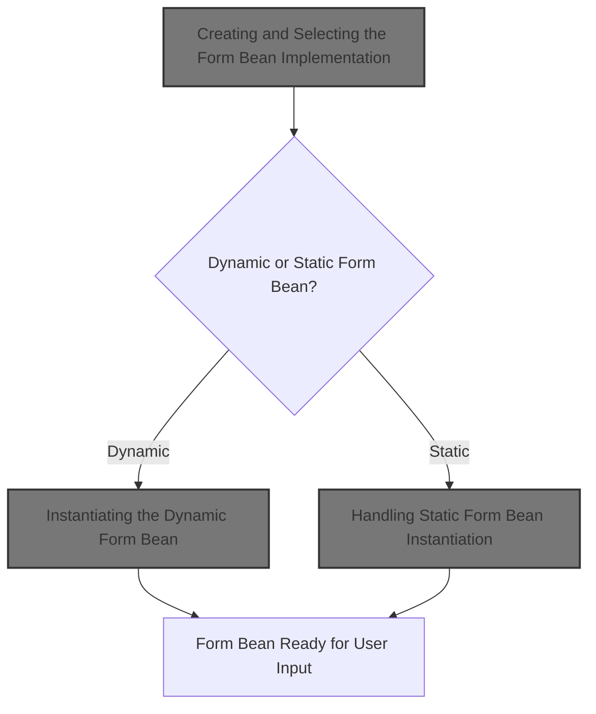
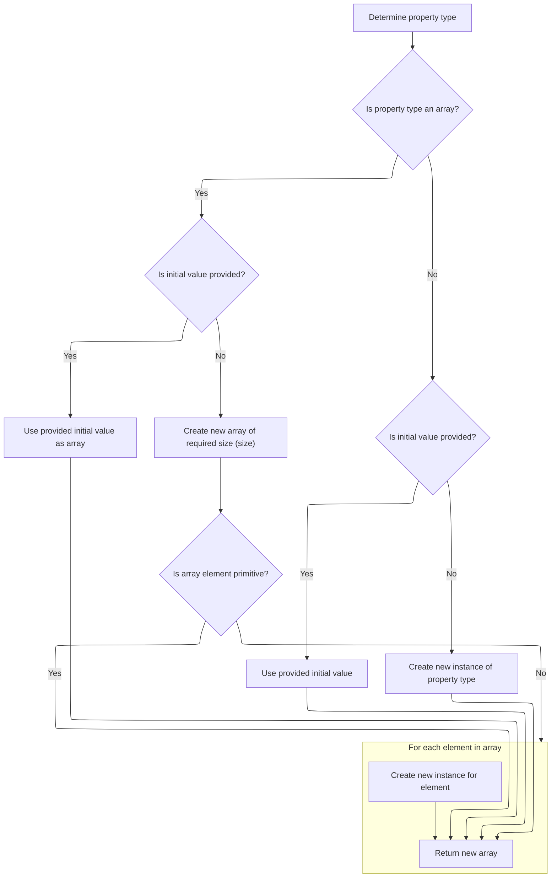

This document describes how the system creates and prepares a form bean instance for use in the web application. Depending on the configuration, the flow selects either a dynamic or static form bean, sets up its properties, and ensures it is ready to capture user input.



# Creating and Selecting the Form Bean Implementation

<SwmSnippet path="/core/src/main/java/org/apache/struts/config/FormBeanConfig.java" line="281">

---

In <SwmToken path="core/src/main/java/org/apache/struts/config/FormBeanConfig.java" pos="281:5:5" line-data="    public ActionForm createActionForm(ActionServlet servlet)">`createActionForm`</SwmToken>, we're branching based on <SwmToken path="core/src/main/java/org/apache/struts/config/FormBeanConfig.java" pos="286:4:6" line-data="        if (getDynamic()) {">`getDynamic()`</SwmToken> to decide if we need a dynamic or static form bean. If it's dynamic, we call <SwmToken path="core/src/main/java/org/apache/struts/config/FormBeanConfig.java" pos="287:5:7" line-data="            obj = getDynaActionFormClass().newInstance();">`getDynaActionFormClass()`</SwmToken><SwmToken path="core/src/main/java/org/apache/struts/config/FormBeanConfig.java" pos="287:8:11" line-data="            obj = getDynaActionFormClass().newInstance();">`.newInstance()`</SwmToken> to get a runtime-configured bean; otherwise, we use <SwmToken path="core/src/main/java/org/apache/struts/config/FormBeanConfig.java" pos="289:5:7" line-data="            obj = formBeanClass().newInstance();">`formBeanClass()`</SwmToken><SwmToken path="core/src/main/java/org/apache/struts/config/FormBeanConfig.java" pos="287:8:11" line-data="            obj = getDynaActionFormClass().newInstance();">`.newInstance()`</SwmToken> for a static one. Calling <SwmToken path="core/src/main/java/org/apache/struts/config/FormBeanConfig.java" pos="287:5:5" line-data="            obj = getDynaActionFormClass().newInstance();">`getDynaActionFormClass`</SwmToken> next is what actually gives us the dynamic class to instantiate, so we can handle forms defined in config instead of code.

```java
    public ActionForm createActionForm(ActionServlet servlet)
        throws IllegalAccessException, InstantiationException {
        Object obj = null;

        // Create a new form bean instance
        if (getDynamic()) {
            obj = getDynaActionFormClass().newInstance();
```

---

</SwmSnippet>

<SwmSnippet path="/core/src/main/java/org/apache/struts/config/FormBeanConfig.java" line="117">

---

<SwmToken path="core/src/main/java/org/apache/struts/config/FormBeanConfig.java" pos="117:5:5" line-data="    public DynaActionFormClass getDynaActionFormClass() {">`getDynaActionFormClass`</SwmToken> checks if the form is actually dynamic and throws if not. If it is, it lazily creates (thread-safe) and returns the <SwmToken path="core/src/main/java/org/apache/struts/config/FormBeanConfig.java" pos="117:3:3" line-data="    public DynaActionFormClass getDynaActionFormClass() {">`DynaActionFormClass`</SwmToken> instance, so we only build the dynamic class once per config.

```java
    public DynaActionFormClass getDynaActionFormClass() {
        if (dynamic == false) {
            throw new IllegalArgumentException("ActionForm is not dynamic");
        }

        synchronized (lock) {
            if (dynaActionFormClass == null) {
                dynaActionFormClass = new DynaActionFormClass(this);
            }
        }

        return dynaActionFormClass;
    }
```

---

</SwmSnippet>

<SwmSnippet path="/core/src/main/java/org/apache/struts/config/FormBeanConfig.java" line="287">

---

Back in <SwmToken path="core/src/main/java/org/apache/struts/config/FormBeanConfig.java" pos="281:5:5" line-data="    public ActionForm createActionForm(ActionServlet servlet)">`createActionForm`</SwmToken>, after getting the <SwmToken path="core/src/main/java/org/apache/struts/config/FormBeanConfig.java" pos="117:3:3" line-data="    public DynaActionFormClass getDynaActionFormClass() {">`DynaActionFormClass`</SwmToken>, we call <SwmToken path="core/src/main/java/org/apache/struts/config/FormBeanConfig.java" pos="287:9:11" line-data="            obj = getDynaActionFormClass().newInstance();">`newInstance()`</SwmToken> to actually create the dynamic form bean. This hands off control to the <SwmToken path="core/src/main/java/org/apache/struts/config/FormBeanConfig.java" pos="117:3:3" line-data="    public DynaActionFormClass getDynaActionFormClass() {">`DynaActionFormClass`</SwmToken> logic, which knows how to build the bean according to the config.

```java
            obj = getDynaActionFormClass().newInstance();
        } else {
```

---

</SwmSnippet>

## Instantiating the Dynamic Form Bean

<SwmSnippet path="/core/src/main/java/org/apache/struts/action/DynaActionFormClass.java" line="158">

---

In <SwmToken path="core/src/main/java/org/apache/struts/action/DynaActionFormClass.java" pos="158:5:5" line-data="    public DynaBean newInstance()">`newInstance`</SwmToken>, we create a new <SwmToken path="core/src/main/java/org/apache/struts/action/DynaActionFormClass.java" pos="160:1:1" line-data="        DynaActionForm dynaBean = (DynaActionForm) getBeanClass().newInstance();">`DynaActionForm`</SwmToken> by instantiating the class returned from <SwmToken path="core/src/main/java/org/apache/struts/action/DynaActionFormClass.java" pos="160:11:13" line-data="        DynaActionForm dynaBean = (DynaActionForm) getBeanClass().newInstance();">`getBeanClass()`</SwmToken>. This is where the actual dynamic form bean object is constructed, ready for property setup.

```java
    public DynaBean newInstance()
        throws IllegalAccessException, InstantiationException {
        DynaActionForm dynaBean = (DynaActionForm) getBeanClass().newInstance();

```

---

</SwmSnippet>

### Resolving the Dynamic Bean Class

<SwmSnippet path="/core/src/main/java/org/apache/struts/action/DynaActionFormClass.java" line="227">

---

<SwmToken path="core/src/main/java/org/apache/struts/action/DynaActionFormClass.java" pos="227:5:5" line-data="    protected Class getBeanClass() {">`getBeanClass`</SwmToken> checks if we've already resolved the bean class; if not, it calls introspect(config) to load and validate the class from config, then caches it for reuse.

```java
    protected Class getBeanClass() {
        if (beanClass == null) {
            introspect(config);
        }

        return (beanClass);
    }
```

---

</SwmSnippet>

### Analyzing Form Properties and Types

```mermaid
%%{init: {"flowchart": {"defaultRenderer": "elk"}} }%%
flowchart TD
    node1["Analyze form bean configuration (type,
properties)"] --> node2{"Is form bean class type valid?"}
    click node1 openCode "core/src/main/java/org/apache/struts/action/DynaActionFormClass.java:246:251"
    node2 -->|"No"| node3["Error: Cannot instantiate class"]
    click node2 openCode "core/src/main/java/org/apache/struts/action/DynaActionFormClass.java:251:258"
    click node3 openCode "core/src/main/java/org/apache/struts/action/DynaActionFormClass.java:253:258"
    node2 -->|"Yes"| node4{"Is class a subclass of required dynamic
form?"}
    click node4 openCode "core/src/main/java/org/apache/struts/action/DynaActionFormClass.java:260:264"
    node4 -->|"No"| node5["Error: Not a valid dynamic form"]
    click node5 openCode "core/src/main/java/org/apache/struts/action/DynaActionFormClass.java:261:264"
    node4 -->|"Yes"| node6["Set form name from configuration"]
    click node6 openCode "core/src/main/java/org/apache/struts/action/DynaActionFormClass.java:267:267"
    node6 --> node7{"Are property descriptors present?"}
    click node7 openCode "core/src/main/java/org/apache/struts/action/DynaActionFormClass.java:270:274"
    node7 -->|"No"| node8["Use empty property list"]
    click node8 openCode "core/src/main/java/org/apache/struts/action/DynaActionFormClass.java:273:274"
    node7 -->|"Yes"| node9["Define dynamic properties"]
    click node9 openCode "core/src/main/java/org/apache/struts/action/DynaActionFormClass.java:277:284"
    subgraph loop1["For each property descriptor"]
      node9 --> node10["Create dynamic property and add to map"]
      click node10 openCode "core/src/main/java/org/apache/struts/action/DynaActionFormClass.java:280:283"
    end
classDef HeadingStyle fill:#777777,stroke:#333,stroke-width:2px;

%% Swimm:
%% %%{init: {"flowchart": {"defaultRenderer": "elk"}} }%%
%% flowchart TD
%%     node1["Analyze form bean configuration (type,
%% properties)"] --> node2{"Is form bean class type valid?"}
%%     click node1 openCode "<SwmPath>[core/…/action/DynaActionFormClass.java](core/src/main/java/org/apache/struts/action/DynaActionFormClass.java)</SwmPath>:246:251"
%%     node2 -->|"No"| node3["Error: Cannot instantiate class"]
%%     click node2 openCode "<SwmPath>[core/…/action/DynaActionFormClass.java](core/src/main/java/org/apache/struts/action/DynaActionFormClass.java)</SwmPath>:251:258"
%%     click node3 openCode "<SwmPath>[core/…/action/DynaActionFormClass.java](core/src/main/java/org/apache/struts/action/DynaActionFormClass.java)</SwmPath>:253:258"
%%     node2 -->|"Yes"| node4{"Is class a subclass of required dynamic
%% form?"}
%%     click node4 openCode "<SwmPath>[core/…/action/DynaActionFormClass.java](core/src/main/java/org/apache/struts/action/DynaActionFormClass.java)</SwmPath>:260:264"
%%     node4 -->|"No"| node5["Error: Not a valid dynamic form"]
%%     click node5 openCode "<SwmPath>[core/…/action/DynaActionFormClass.java](core/src/main/java/org/apache/struts/action/DynaActionFormClass.java)</SwmPath>:261:264"
%%     node4 -->|"Yes"| node6["Set form name from configuration"]
%%     click node6 openCode "<SwmPath>[core/…/action/DynaActionFormClass.java](core/src/main/java/org/apache/struts/action/DynaActionFormClass.java)</SwmPath>:267:267"
%%     node6 --> node7{"Are property descriptors present?"}
%%     click node7 openCode "<SwmPath>[core/…/action/DynaActionFormClass.java](core/src/main/java/org/apache/struts/action/DynaActionFormClass.java)</SwmPath>:270:274"
%%     node7 -->|"No"| node8["Use empty property list"]
%%     click node8 openCode "<SwmPath>[core/…/action/DynaActionFormClass.java](core/src/main/java/org/apache/struts/action/DynaActionFormClass.java)</SwmPath>:273:274"
%%     node7 -->|"Yes"| node9["Define dynamic properties"]
%%     click node9 openCode "<SwmPath>[core/…/action/DynaActionFormClass.java](core/src/main/java/org/apache/struts/action/DynaActionFormClass.java)</SwmPath>:277:284"
%%     subgraph loop1["For each property descriptor"]
%%       node9 --> node10["Create dynamic property and add to map"]
%%       click node10 openCode "<SwmPath>[core/…/action/DynaActionFormClass.java](core/src/main/java/org/apache/struts/action/DynaActionFormClass.java)</SwmPath>:280:283"
%%     end
%% classDef HeadingStyle fill:#777777,stroke:#333,stroke-width:2px;
```



<SwmSnippet path="/core/src/main/java/org/apache/struts/action/DynaActionFormClass.java" line="246">

---

<SwmToken path="core/src/main/java/org/apache/struts/action/DynaActionFormClass.java" pos="246:5:5" line-data="    protected void introspect(FormBeanConfig config) {">`introspect`</SwmToken> loads and validates the bean class, sets the form bean's name, grabs all property configs, and creates <SwmToken path="core/src/main/java/org/apache/struts/action/DynaActionFormClass.java" pos="277:7:7" line-data="        properties = new DynaProperty[descriptors.length];">`DynaProperty`</SwmToken> definitions for each property. For each property, it calls <SwmToken path="core/src/main/java/org/apache/struts/action/DynaActionFormClass.java" pos="282:6:8" line-data="                    descriptors[i].getTypeClass());">`getTypeClass()`</SwmToken> to figure out the Java type, so we know how to handle the property at runtime.

```java
    protected void introspect(FormBeanConfig config) {
        this.config = config;

        // Validate the ActionFormBean implementation class
        try {
            beanClass = RequestUtils.applicationClass(config.getType());
        } catch (Throwable t) {
        	IllegalArgumentException t2 = new IllegalArgumentException(
                "Cannot instantiate ActionFormBean class '" + config.getType()
                + "'");
        	t2.initCause(t);
        	throw t2;
        }

        if (!DynaActionForm.class.isAssignableFrom(beanClass)) {
            throw new IllegalArgumentException("Class '" + config.getType()
                + "' is not a subclass of "
                + "'org.apache.struts.action.DynaActionForm'");
        }

        // Set the name we will know ourselves by from the form bean name
        this.name = config.getName();

        // Look up the property descriptors for this bean class
        FormPropertyConfig[] descriptors = config.findFormPropertyConfigs();

        if (descriptors == null) {
            descriptors = new FormPropertyConfig[0];
        }

        // Create corresponding dynamic property definitions
        properties = new DynaProperty[descriptors.length];

        for (int i = 0; i < descriptors.length; i++) {
            properties[i] =
                new DynaProperty(descriptors[i].getName(),
                    descriptors[i].getTypeClass());
            propertiesMap.put(properties[i].getName(), properties[i]);
        }
    }
```

---

</SwmSnippet>

<SwmSnippet path="/core/src/main/java/org/apache/struts/config/FormPropertyConfig.java" line="221">

---

<SwmToken path="core/src/main/java/org/apache/struts/config/FormPropertyConfig.java" pos="221:5:5" line-data="    public Class getTypeClass() {">`getTypeClass`</SwmToken> figures out the Java Class for a property, handling primitives, arrays (by checking for '\[\]'), and regular classes. It loads the class using the context class loader or a fallback, and returns an array Class if needed. This is how property types are resolved for dynamic forms.

```java
    public Class getTypeClass() {
        // Identify the base class (in case an array was specified)
        String baseType = getType();
        boolean indexed = false;

        if (baseType.endsWith("[]")) {
            baseType = baseType.substring(0, baseType.length() - 2);
            indexed = true;
        }

        // Construct an appropriate Class instance for the base class
        Class baseClass = null;

        if ("boolean".equals(baseType)) {
            baseClass = Boolean.TYPE;
        } else if ("byte".equals(baseType)) {
            baseClass = Byte.TYPE;
        } else if ("char".equals(baseType)) {
            baseClass = Character.TYPE;
        } else if ("double".equals(baseType)) {
            baseClass = Double.TYPE;
        } else if ("float".equals(baseType)) {
            baseClass = Float.TYPE;
        } else if ("int".equals(baseType)) {
            baseClass = Integer.TYPE;
        } else if ("long".equals(baseType)) {
            baseClass = Long.TYPE;
        } else if ("short".equals(baseType)) {
            baseClass = Short.TYPE;
        } else {
            ClassLoader classLoader =
                Thread.currentThread().getContextClassLoader();

            if (classLoader == null) {
                classLoader = this.getClass().getClassLoader();
            }

            try {
                baseClass = classLoader.loadClass(baseType);
            } catch (ClassNotFoundException ex) {
                log.error("Class '" + baseType +
                          "' not found for property '" + name + "'");
                baseClass = null;
            }
        }

        // Return the base class or an array appropriately
        if (indexed) {
            return (Array.newInstance(baseClass, 0).getClass());
        } else {
            return (baseClass);
        }
    }
```

---

</SwmSnippet>

### Populating the Dynamic Form Bean

<SwmSnippet path="/core/src/main/java/org/apache/struts/action/DynaActionFormClass.java" line="162">

---

After creating the <SwmToken path="core/src/main/java/org/apache/struts/action/DynaActionFormClass.java" pos="160:1:1" line-data="        DynaActionForm dynaBean = (DynaActionForm) getBeanClass().newInstance();">`DynaActionForm`</SwmToken>, <SwmToken path="core/src/main/java/org/apache/struts/config/FormBeanConfig.java" pos="287:9:9" line-data="            obj = getDynaActionFormClass().newInstance();">`newInstance`</SwmToken> sets up the <SwmToken path="core/src/main/java/org/apache/struts/config/FormBeanConfig.java" pos="117:3:3" line-data="    public DynaActionFormClass getDynaActionFormClass() {">`DynaActionFormClass`</SwmToken> reference and initializes all properties by calling initial() on each <SwmToken path="core/src/main/java/org/apache/struts/action/DynaActionFormClass.java" pos="164:1:1" line-data="        FormPropertyConfig[] props = config.findFormPropertyConfigs();">`FormPropertyConfig`</SwmToken>. This is where the bean gets its starting values for every property.

```java
        dynaBean.setDynaActionFormClass(this);

        FormPropertyConfig[] props = config.findFormPropertyConfigs();

        for (int i = 0; i < props.length; i++) {
            dynaBean.set(props[i].getName(), props[i].initial());
        }

        return (dynaBean);
    }
```

---

</SwmSnippet>

## Determining Initial Property Values



<SwmSnippet path="/core/src/main/java/org/apache/struts/config/FormPropertyConfig.java" line="318">

---

In <SwmToken path="core/src/main/java/org/apache/struts/config/FormPropertyConfig.java" pos="318:5:5" line-data="    public Object initial() {">`initial`</SwmToken>, we figure out the starting value for a property by checking its type (array or not) and either converting the configured value or creating a new instance. We call <SwmToken path="core/src/main/java/org/apache/struts/config/FormPropertyConfig.java" pos="322:7:9" line-data="            Class clazz = getTypeClass();">`getTypeClass()`</SwmToken> to know what type to work with.

```java
    public Object initial() {
        Object initialValue = null;

        try {
            Class clazz = getTypeClass();

```

---

</SwmSnippet>

<SwmSnippet path="/core/src/main/java/org/apache/struts/config/FormPropertyConfig.java" line="324">

---

After getting the type class in <SwmToken path="core/src/main/java/org/apache/struts/config/FormPropertyConfig.java" pos="325:4:4" line-data="                if (initial != null) {">`initial`</SwmToken>, if it's an array, we either convert the initial value or create a new array and fill it (for non-primitives). For non-arrays, we convert or instantiate a single value. This is how the function handles different property types.

```java
            if (clazz.isArray()) {
                if (initial != null) {
                    initialValue = ConvertUtils.convert(initial, clazz);
                } else {
                    initialValue =
                        Array.newInstance(clazz.getComponentType(), size);

                    if (!(clazz.getComponentType().isPrimitive())) {
                        for (int i = 0; i < size; i++) {
                            try {
                                Array.set(initialValue, i,
                                    clazz.getComponentType().newInstance());
                            } catch (Throwable t) {
                                log.error("Unable to create instance of "
                                    + clazz.getName() + " for property=" + name
                                    + ", type=" + type + ", initial=" + initial
                                    + ", size=" + size + ".");

                                //FIXME: Should we just dump the entire application/module ?
                            }
                        }
```

---

</SwmSnippet>

<SwmSnippet path="/core/src/main/java/org/apache/struts/config/FormPropertyConfig.java" line="348">

---

After initializing the property value in <SwmToken path="core/src/main/java/org/apache/struts/config/FormPropertyConfig.java" pos="348:4:4" line-data="                if (initial != null) {">`initial`</SwmToken>, we return to <SwmToken path="core/src/main/java/org/apache/struts/config/FormBeanConfig.java" pos="117:3:3" line-data="    public DynaActionFormClass getDynaActionFormClass() {">`DynaActionFormClass`</SwmToken> to actually set this value on the bean. This is where the property gets its starting value in the dynamic form.

```java
                if (initial != null) {
                    initialValue = ConvertUtils.convert(initial, clazz);
                } else {
                    initialValue = clazz.newInstance();
                }
            }
        } catch (Throwable t) {
            initialValue = null;
        }

        return (initialValue);
    }
```

---

</SwmSnippet>

## Handling Static Form Bean Instantiation

```mermaid
%%{init: {"flowchart": {"defaultRenderer": "elk"}} }%%
flowchart TD
    node1["Create form bean instance of specified
type"]
    click node1 openCode "core/src/main/java/org/apache/struts/config/FormBeanConfig.java:289:290"
    node1 --> node2{"Is the instance a standard form?"}
    click node2 openCode "core/src/main/java/org/apache/struts/config/FormBeanConfig.java:294:298"
    node2 -->|"Yes"| node3["Use as standard form"]
    node2 -->|"No"| node4["Wrap in validator form"]
    click node3 openCode "core/src/main/java/org/apache/struts/config/FormBeanConfig.java:295:296"
    click node4 openCode "core/src/main/java/org/apache/struts/config/FormBeanConfig.java:297:298"
    node3 --> node5["Associate form with web application"]
    node4 --> node5
    click node5 openCode "core/src/main/java/org/apache/struts/config/FormBeanConfig.java:300:300"
    node5 --> node6{"Is the form dynamic (supports flexible
properties)?"}
    click node6 openCode "core/src/main/java/org/apache/struts/config/FormBeanConfig.java:302:319"
    node6 -->|"Yes"| node7["Allow adding properties (set
restrictions off)"]
    click node7 openCode "core/src/main/java/org/apache/struts/config/FormBeanConfig.java:309:309"
    node7 --> node8["Find all form properties"]
    click node8 openCode "core/src/main/java/org/apache/struts/config/FormBeanConfig.java:311:312"
    subgraph loop1["For each property in form"]
      node8 --> node9["Add property to form"]
      click node9 openCode "core/src/main/java/org/apache/struts/config/FormBeanConfig.java:314:314"
      node9 --> node10["Set initial value"]
      click node10 openCode "core/src/main/java/org/apache/struts/config/FormBeanConfig.java:315:315"
    end
    node10 --> node11["Restore property restrictions if needed"]
    click node11 openCode "core/src/main/java/org/apache/struts/config/FormBeanConfig.java:318:318"
    node6 -->|"No"| node12{"Is the form a validator form?"}
    node11 --> node12
    click node12 openCode "core/src/main/java/org/apache/struts/config/FormBeanConfig.java:321:323"
    node12 -->|"Yes"| node13["Initialize validator form"]
    click node13 openCode "core/src/main/java/org/apache/struts/config/FormBeanConfig.java:322:322"
    node12 -->|"No"| node14["Return form"]
    node13 --> node14
    click node14 openCode "core/src/main/java/org/apache/struts/config/FormBeanConfig.java:325:326"

classDef HeadingStyle fill:#777777,stroke:#333,stroke-width:2px;

%% Swimm:
%% %%{init: {"flowchart": {"defaultRenderer": "elk"}} }%%
%% flowchart TD
%%     node1["Create form bean instance of specified
%% type"]
%%     click node1 openCode "<SwmPath>[core/…/config/FormBeanConfig.java](core/src/main/java/org/apache/struts/config/FormBeanConfig.java)</SwmPath>:289:290"
%%     node1 --> node2{"Is the instance a standard form?"}
%%     click node2 openCode "<SwmPath>[core/…/config/FormBeanConfig.java](core/src/main/java/org/apache/struts/config/FormBeanConfig.java)</SwmPath>:294:298"
%%     node2 -->|"Yes"| node3["Use as standard form"]
%%     node2 -->|"No"| node4["Wrap in validator form"]
%%     click node3 openCode "<SwmPath>[core/…/config/FormBeanConfig.java](core/src/main/java/org/apache/struts/config/FormBeanConfig.java)</SwmPath>:295:296"
%%     click node4 openCode "<SwmPath>[core/…/config/FormBeanConfig.java](core/src/main/java/org/apache/struts/config/FormBeanConfig.java)</SwmPath>:297:298"
%%     node3 --> node5["Associate form with web application"]
%%     node4 --> node5
%%     click node5 openCode "<SwmPath>[core/…/config/FormBeanConfig.java](core/src/main/java/org/apache/struts/config/FormBeanConfig.java)</SwmPath>:300:300"
%%     node5 --> node6{"Is the form dynamic (supports flexible
%% properties)?"}
%%     click node6 openCode "<SwmPath>[core/…/config/FormBeanConfig.java](core/src/main/java/org/apache/struts/config/FormBeanConfig.java)</SwmPath>:302:319"
%%     node6 -->|"Yes"| node7["Allow adding properties (set
%% restrictions off)"]
%%     click node7 openCode "<SwmPath>[core/…/config/FormBeanConfig.java](core/src/main/java/org/apache/struts/config/FormBeanConfig.java)</SwmPath>:309:309"
%%     node7 --> node8["Find all form properties"]
%%     click node8 openCode "<SwmPath>[core/…/config/FormBeanConfig.java](core/src/main/java/org/apache/struts/config/FormBeanConfig.java)</SwmPath>:311:312"
%%     subgraph loop1["For each property in form"]
%%       node8 --> node9["Add property to form"]
%%       click node9 openCode "<SwmPath>[core/…/config/FormBeanConfig.java](core/src/main/java/org/apache/struts/config/FormBeanConfig.java)</SwmPath>:314:314"
%%       node9 --> node10["Set initial value"]
%%       click node10 openCode "<SwmPath>[core/…/config/FormBeanConfig.java](core/src/main/java/org/apache/struts/config/FormBeanConfig.java)</SwmPath>:315:315"
%%     end
%%     node10 --> node11["Restore property restrictions if needed"]
%%     click node11 openCode "<SwmPath>[core/…/config/FormBeanConfig.java](core/src/main/java/org/apache/struts/config/FormBeanConfig.java)</SwmPath>:318:318"
%%     node6 -->|"No"| node12{"Is the form a validator form?"}
%%     node11 --> node12
%%     click node12 openCode "<SwmPath>[core/…/config/FormBeanConfig.java](core/src/main/java/org/apache/struts/config/FormBeanConfig.java)</SwmPath>:321:323"
%%     node12 -->|"Yes"| node13["Initialize validator form"]
%%     click node13 openCode "<SwmPath>[core/…/config/FormBeanConfig.java](core/src/main/java/org/apache/struts/config/FormBeanConfig.java)</SwmPath>:322:322"
%%     node12 -->|"No"| node14["Return form"]
%%     node13 --> node14
%%     click node14 openCode "<SwmPath>[core/…/config/FormBeanConfig.java](core/src/main/java/org/apache/struts/config/FormBeanConfig.java)</SwmPath>:325:326"
%% 
%% classDef HeadingStyle fill:#777777,stroke:#333,stroke-width:2px;
```



<SwmSnippet path="/core/src/main/java/org/apache/struts/config/FormBeanConfig.java" line="289">

---

After handling the dynamic path in <SwmToken path="core/src/main/java/org/apache/struts/config/FormBeanConfig.java" pos="281:5:5" line-data="    public ActionForm createActionForm(ActionServlet servlet)">`createActionForm`</SwmToken>, if the form isn't dynamic, we call <SwmToken path="core/src/main/java/org/apache/struts/config/FormBeanConfig.java" pos="289:5:7" line-data="            obj = formBeanClass().newInstance();">`formBeanClass()`</SwmToken><SwmToken path="core/src/main/java/org/apache/struts/config/FormBeanConfig.java" pos="289:8:11" line-data="            obj = formBeanClass().newInstance();">`.newInstance()`</SwmToken> to create a static form bean. This is the standard Java instantiation path.

```java
            obj = formBeanClass().newInstance();
```

---

</SwmSnippet>

<SwmSnippet path="/core/src/main/java/org/apache/struts/config/FormBeanConfig.java" line="603">

---

<SwmToken path="core/src/main/java/org/apache/struts/config/FormBeanConfig.java" pos="603:5:5" line-data="    protected Class formBeanClass() {">`formBeanClass`</SwmToken> loads the class for a static form bean using the thread context class loader, or falls back to the class's own loader if needed. It relies on <SwmToken path="core/src/main/java/org/apache/struts/config/FormBeanConfig.java" pos="612:8:10" line-data="            return (classLoader.loadClass(getType()));">`getType()`</SwmToken> for the class name and returns null if loading fails.

```java
    protected Class formBeanClass() {
        ClassLoader classLoader =
            Thread.currentThread().getContextClassLoader();

        if (classLoader == null) {
            classLoader = this.getClass().getClassLoader();
        }

        try {
            return (classLoader.loadClass(getType()));
        } catch (Exception e) {
            return (null);
        }
    }
```

---

</SwmSnippet>

<SwmSnippet path="/core/src/main/java/org/apache/struts/config/FormBeanConfig.java" line="289">

---

After getting the class from <SwmToken path="core/src/main/java/org/apache/struts/config/FormBeanConfig.java" pos="289:5:5" line-data="            obj = formBeanClass().newInstance();">`formBeanClass`</SwmToken>, <SwmToken path="core/src/main/java/org/apache/struts/config/FormBeanConfig.java" pos="281:5:5" line-data="    public ActionForm createActionForm(ActionServlet servlet)">`createActionForm`</SwmToken> tries to instantiate it. The function assumes the class is valid and instantiable, just like with the dynamic path.

```java
            obj = formBeanClass().newInstance();
        }

```

---

</SwmSnippet>

<SwmSnippet path="/core/src/main/java/org/apache/struts/config/FormBeanConfig.java" line="292">

---

After instantiating the form in <SwmToken path="core/src/main/java/org/apache/struts/config/FormBeanConfig.java" pos="281:5:5" line-data="    public ActionForm createActionForm(ActionServlet servlet)">`createActionForm`</SwmToken>, if it's not an <SwmToken path="core/src/main/java/org/apache/struts/config/FormBeanConfig.java" pos="292:1:1" line-data="        ActionForm form = null;">`ActionForm`</SwmToken>, we wrap it in <SwmToken path="core/src/main/java/org/apache/struts/config/FormBeanConfig.java" pos="297:7:7" line-data="            form = new BeanValidatorForm(obj);">`BeanValidatorForm`</SwmToken>. If it's a <SwmToken path="core/src/main/java/org/apache/struts/config/FormBeanConfig.java" pos="302:8:8" line-data="        if (form instanceof DynaBean">`DynaBean`</SwmToken> with a <SwmToken path="core/src/main/java/org/apache/struts/config/FormBeanConfig.java" pos="303:17:17" line-data="            &amp;&amp; ((DynaBean) form).getDynaClass() instanceof MutableDynaClass) {">`MutableDynaClass`</SwmToken>, we add properties and set initial values using <SwmToken path="core/src/main/java/org/apache/struts/config/FormBeanConfig.java" pos="311:1:1" line-data="            FormPropertyConfig[] props = findFormPropertyConfigs();">`FormPropertyConfig`</SwmToken>, making the dynamic form ready for use.

```java
        ActionForm form = null;

        if (obj instanceof ActionForm) {
            form = (ActionForm) obj;
        } else {
            form = new BeanValidatorForm(obj);
        }

        form.setServlet(servlet);

        if (form instanceof DynaBean
            && ((DynaBean) form).getDynaClass() instanceof MutableDynaClass) {
            DynaBean dynaBean = (DynaBean) form;
            MutableDynaClass dynaClass =
                (MutableDynaClass) dynaBean.getDynaClass();

            // Add properties
            dynaClass.setRestricted(false);

            FormPropertyConfig[] props = findFormPropertyConfigs();

            for (int i = 0; i < props.length; i++) {
                dynaClass.add(props[i].getName(), props[i].getTypeClass());
```

---

</SwmSnippet>

<SwmSnippet path="/core/src/main/java/org/apache/struts/config/FormBeanConfig.java" line="315">

---

After adding properties to the <SwmToken path="core/src/main/java/org/apache/struts/config/FormBeanConfig.java" pos="303:17:17" line-data="            &amp;&amp; ((DynaBean) form).getDynaClass() instanceof MutableDynaClass) {">`MutableDynaClass`</SwmToken> in <SwmToken path="core/src/main/java/org/apache/struts/config/FormBeanConfig.java" pos="281:5:5" line-data="    public ActionForm createActionForm(ActionServlet servlet)">`createActionForm`</SwmToken>, we set their initial values by calling initial() on each <SwmToken path="core/src/main/java/org/apache/struts/config/FormBeanConfig.java" pos="311:1:1" line-data="            FormPropertyConfig[] props = findFormPropertyConfigs();">`FormPropertyConfig`</SwmToken>. This finalizes the dynamic property setup before locking the class again.

```java
                dynaBean.set(props[i].getName(), props[i].initial());
            }

            dynaClass.setRestricted(isRestricted());
        }

```

---

</SwmSnippet>

<SwmSnippet path="/core/src/main/java/org/apache/struts/config/FormBeanConfig.java" line="321">

---

At the end of <SwmToken path="core/src/main/java/org/apache/struts/config/FormBeanConfig.java" pos="281:5:5" line-data="    public ActionForm createActionForm(ActionServlet servlet)">`createActionForm`</SwmToken>, if the form is a <SwmToken path="core/src/main/java/org/apache/struts/config/FormBeanConfig.java" pos="321:8:8" line-data="        if (form instanceof BeanValidatorForm) {">`BeanValidatorForm`</SwmToken>, we call initialize(this) to hook up the config. This ensures the validator form is ready to handle validation as configured.

```java
        if (form instanceof BeanValidatorForm) {
            ((BeanValidatorForm)form).initialize(this);
        }

        return form;
    }
```

---

</SwmSnippet>

&nbsp;

*This is an auto-generated document by Swimm 🌊 and has not yet been verified by a human*

<SwmMeta version="3.0.0" repo-id="Z2l0aHViJTNBJTNBc3RydXRzMSUzQSUzQVN3aW1tLURlbW8=" repo-name="struts1"><sup>Powered by [Swimm](https://app.swimm.io/)</sup></SwmMeta>
