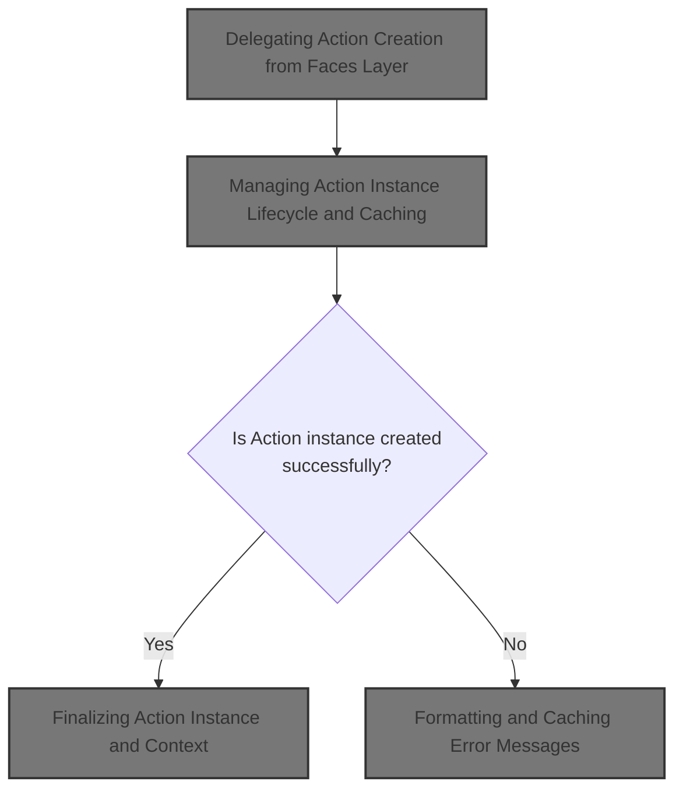
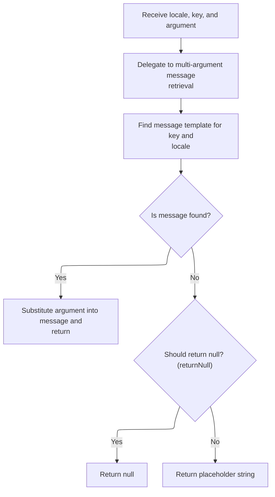

This document describes how Action instances are created and prepared to handle user requests. As part of the request handling infrastructure, the system delegates action creation, manages the lifecycle and caching of Action objects, and ensures each Action is ready for use. The flow receives an HTTP request and response, along with action mapping information, and outputs a prepared Action instance or an error response if creation fails.



# Delegating Action Creation from Faces Layer

<SwmSnippet path="/faces/src/main/java/org/apache/struts/faces/application/FacesRequestProcessor.java" line="175">

---

<SwmToken path="faces/src/main/java/org/apache/struts/faces/application/FacesRequestProcessor.java" pos="175:5:5" line-data="    protected Action processActionCreate(HttpServletRequest request,">`processActionCreate`</SwmToken> in <SwmToken path="faces/src/main/java/org/apache/struts/faces/application/FacesRequestProcessor.java" pos="65:4:4" line-data="public class FacesRequestProcessor extends RequestProcessor {">`FacesRequestProcessor`</SwmToken> just hands off the action creation to the core <SwmToken path="faces/src/main/java/org/apache/struts/faces/application/FacesRequestProcessor.java" pos="45:10:10" line-data="import org.apache.struts.action.RequestProcessor;">`RequestProcessor`</SwmToken> by calling its own superclass method. This keeps the Faces layer thin and lets the core logic handle instantiation, caching, and lifecycle. We need to call <SwmToken path="faces/src/main/java/org/apache/struts/faces/application/FacesRequestProcessor.java" pos="45:10:10" line-data="import org.apache.struts.action.RequestProcessor;">`RequestProcessor`</SwmToken> next because that's where the actual Action instance management happens.

```java
    protected Action processActionCreate(HttpServletRequest request,
                                         HttpServletResponse response,
                                         ActionMapping mapping)
        throws IOException {

        if (log.isTraceEnabled()) {
            log.trace("Performing standard action create");
        }
        Action result = super.processActionCreate(request, response, mapping);
        if (log.isDebugEnabled()) {
            log.debug("Standard action create returned " +
                      result.getClass().getName() + " instance");
        }
        return (result);

    }
```

---

</SwmSnippet>

# Managing Action Instance Lifecycle and Caching

<SwmSnippet path="/core/src/main/java/org/apache/struts/action/RequestProcessor.java" line="248">

---

In <SwmToken path="core/src/main/java/org/apache/struts/action/RequestProcessor.java" pos="248:5:5" line-data="    protected Action processActionCreate(HttpServletRequest request,">`processActionCreate`</SwmToken> of <SwmToken path="faces/src/main/java/org/apache/struts/faces/application/FacesRequestProcessor.java" pos="45:10:10" line-data="import org.apache.struts.action.RequestProcessor;">`RequestProcessor`</SwmToken>, we grab the Action class name from the mapping, then synchronize on the actions map to check if we already have an instance. If not, we create one and cache it. If instantiation fails, we log the error and use <SwmToken path="core/src/main/java/org/apache/struts/action/RequestProcessor.java" pos="31:10:10" line-data="import org.apache.struts.util.MessageResources;">`MessageResources`</SwmToken> to format the error message before sending an error response. That's why we need to call <SwmToken path="core/src/main/java/org/apache/struts/action/RequestProcessor.java" pos="31:10:10" line-data="import org.apache.struts.util.MessageResources;">`MessageResources`</SwmToken> next—to handle error messaging cleanly.

```java
    protected Action processActionCreate(HttpServletRequest request,
        HttpServletResponse response, ActionMapping mapping)
        throws IOException {
        // Acquire the Action instance we will be using (if there is one)
        String className = mapping.getType();

        if (log.isDebugEnabled()) {
            log.debug(" Looking for Action instance for class " + className);
        }

        // If there were a mapping property indicating whether
        // an Action were a singleton or not ([true]),
        // could we just instantiate and return a new instance here?
        Action instance;

        synchronized (actions) {
            // Return any existing Action instance of this class
            instance = (Action) actions.get(className);

            if (instance != null) {
                if (log.isTraceEnabled()) {
                    log.trace("  Returning existing Action instance");
                }

                return (instance);
            }

            // Create and return a new Action instance
            if (log.isTraceEnabled()) {
                log.trace("  Creating new Action instance");
            }

            try {
                instance = (Action) RequestUtils.applicationInstance(className);

                // Maybe we should propagate this exception
                // instead of returning null.
            } catch (Exception e) {
                log.error(getInternal().getMessage("actionCreate",
                        mapping.getPath(), mapping.toString()), e);

                response.sendError(HttpServletResponse.SC_INTERNAL_SERVER_ERROR,
                    getInternal().getMessage("actionCreate", mapping.getPath()));

                return (null);
            }

```

---

</SwmSnippet>

## Formatting and Caching Error Messages



<SwmSnippet path="/core/src/main/java/org/apache/struts/util/MessageResources.java" line="324">

---

<SwmToken path="core/src/main/java/org/apache/struts/util/MessageResources.java" pos="324:5:5" line-data="    public String getMessage(Locale locale, String key, Object arg0) {">`getMessage`</SwmToken> here just wraps the single argument in an array and calls the main overload. This keeps the interface simple and lets the main logic handle formatting and caching. We need to call the main <SwmToken path="core/src/main/java/org/apache/struts/util/MessageResources.java" pos="324:5:5" line-data="    public String getMessage(Locale locale, String key, Object arg0) {">`getMessage`</SwmToken> next because that's where the actual message lookup and formatting happens.

```java
    public String getMessage(Locale locale, String key, Object arg0) {
        return this.getMessage(locale, key, new Object[] { arg0 });
    }
```

---

</SwmSnippet>

<SwmSnippet path="/core/src/main/java/org/apache/struts/util/MessageResources.java" line="286">

---

<SwmToken path="core/src/main/java/org/apache/struts/util/MessageResources.java" pos="286:5:5" line-data="    public String getMessage(Locale locale, String key, Object[] args) {">`getMessage`</SwmToken> with the Object array handles message lookup, caching <SwmToken path="core/src/main/java/org/apache/struts/util/MessageResources.java" pos="287:5:5" line-data="        // Cache MessageFormat instances as they are accessed">`MessageFormat`</SwmToken> instances per locale and key for performance. If the message is missing, it returns a clear placeholder string. The escape step ensures the format string is safe for <SwmToken path="core/src/main/java/org/apache/struts/util/MessageResources.java" pos="287:5:5" line-data="        // Cache MessageFormat instances as they are accessed">`MessageFormat`</SwmToken>. This is where error messages are formatted before being sent back to <SwmToken path="faces/src/main/java/org/apache/struts/faces/application/FacesRequestProcessor.java" pos="45:10:10" line-data="import org.apache.struts.action.RequestProcessor;">`RequestProcessor`</SwmToken>.

```java
    public String getMessage(Locale locale, String key, Object[] args) {
        // Cache MessageFormat instances as they are accessed
        if (locale == null) {
            locale = defaultLocale;
        }

        MessageFormat format = null;
        String formatKey = messageKey(locale, key);

        synchronized (formats) {
            format = (MessageFormat) formats.get(formatKey);

            if (format == null) {
                String formatString = getMessage(locale, key);

                if (formatString == null) {
                    return returnNull ? null : ("???" + formatKey + "???");
                }

                format = new MessageFormat(escape(formatString));
                format.setLocale(locale);
                formats.put(formatKey, format);
            }
        }

        return format.format(args);
    }
```

---

</SwmSnippet>

## Finalizing Action Instance and Context

<SwmSnippet path="/core/src/main/java/org/apache/struts/action/RequestProcessor.java" line="295">

---

Back in RequestProcessor.processActionCreate, after formatting any error messages with <SwmToken path="core/src/main/java/org/apache/struts/action/RequestProcessor.java" pos="31:10:10" line-data="import org.apache.struts.util.MessageResources;">`MessageResources`</SwmToken>, we store the new Action instance in the actions map (thread-safe), and set its servlet if needed. This step ensures the Action is ready for use with the correct context and avoids duplicate instances.

```java
            actions.put(className, instance);

            if (instance.getServlet() == null) {
                instance.setServlet(this.servlet);
            }
        }

        return (instance);
    }
```

---

</SwmSnippet>

&nbsp;

*This is an auto-generated document by Swimm 🌊 and has not yet been verified by a human*

<SwmMeta version="3.0.0" repo-id="Z2l0aHViJTNBJTNBc3RydXRzMSUzQSUzQVN3aW1tLURlbW8=" repo-name="struts1"><sup>Powered by [Swimm](https://app.swimm.io/)</sup></SwmMeta>
