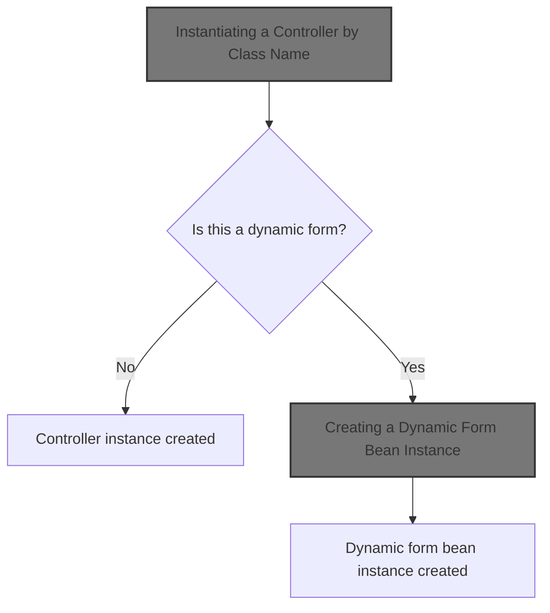
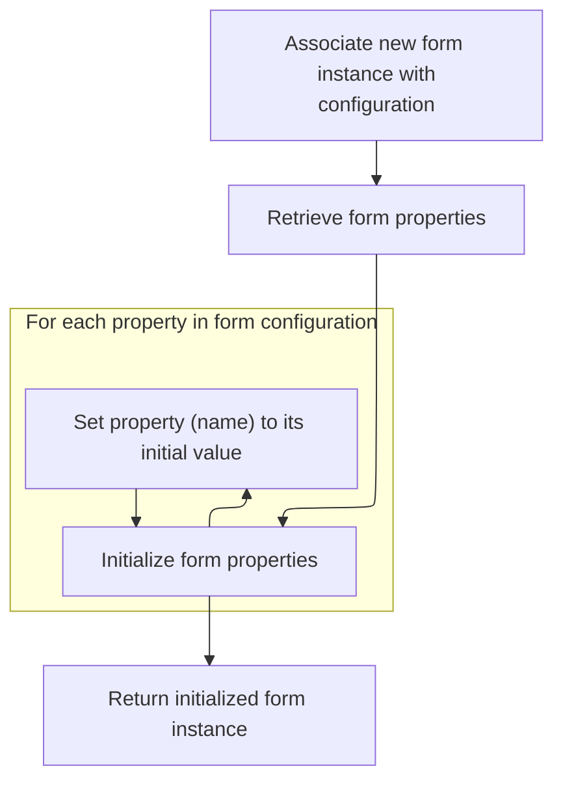
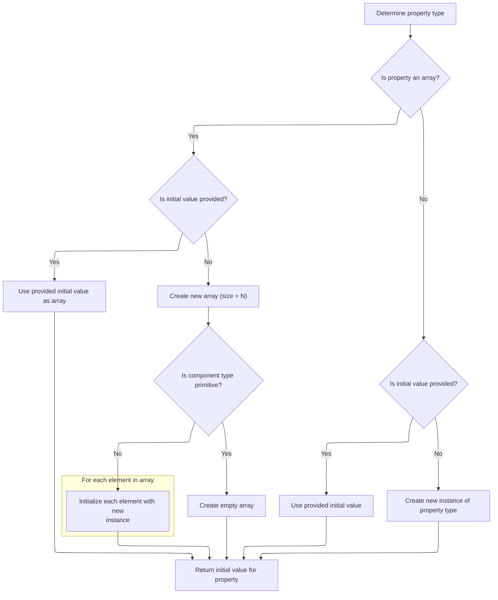

This document describes how the system creates and initializes a controller or dynamic form bean instance based on a provided class name. This enables flexible configuration and extension of application behavior by allowing controllers and forms to be defined dynamically. The flow receives a class name as input, determines if it is a regular controller or a dynamic form, initializes properties as needed, and returns the appropriate instance.



# Instantiating a Controller by Class Name

<SwmSnippet path="/tiles/src/main/java/org/apache/struts/tiles/ComponentDefinition.java" line="516">

---

In <SwmToken path="tiles/src/main/java/org/apache/struts/tiles/ComponentDefinition.java" pos="516:7:7" line-data="    public static Controller createControllerFromClassname(String classname)">`createControllerFromClassname`</SwmToken>, we load the class by name, instantiate it, and cast it to Controller. We need to call into <SwmToken path="core/src/main/java/org/apache/struts/action/DynaActionFormClass.java" pos="45:4:4" line-data="public class DynaActionFormClass implements DynaClass, Serializable {">`DynaActionFormClass`</SwmToken> next if the requested class is a dynamic form, since its instantiation logic is more involved than a plain <SwmToken path="tiles/src/main/java/org/apache/struts/tiles/ComponentDefinition.java" pos="521:9:11" line-data="            Object instance = requestedClass.newInstance();">`newInstance()`</SwmToken>.

```java
    public static Controller createControllerFromClassname(String classname)
        throws InstantiationException {

        try {
            Class requestedClass = RequestUtils.applicationClass(classname);
            Object instance = requestedClass.newInstance();

            if (log.isDebugEnabled()) {
                log.debug("Controller created : " + instance);
            }
            return (Controller) instance;

```

---

</SwmSnippet>

## Creating a Dynamic Form Bean Instance

<SwmSnippet path="/core/src/main/java/org/apache/struts/action/DynaActionFormClass.java" line="158">

---

In <SwmToken path="core/src/main/java/org/apache/struts/action/DynaActionFormClass.java" pos="158:5:5" line-data="    public DynaBean newInstance()">`newInstance`</SwmToken>, we create a new <SwmToken path="core/src/main/java/org/apache/struts/action/DynaActionFormClass.java" pos="160:1:1" line-data="        DynaActionForm dynaBean = (DynaActionForm) getBeanClass().newInstance();">`DynaActionForm`</SwmToken> (or subclass) using the resolved bean class. We need to call <SwmToken path="core/src/main/java/org/apache/struts/action/DynaActionFormClass.java" pos="160:11:11" line-data="        DynaActionForm dynaBean = (DynaActionForm) getBeanClass().newInstance();">`getBeanClass`</SwmToken> to ensure the correct class is used, which may trigger lazy initialization if not already set.

```java
    public DynaBean newInstance()
        throws IllegalAccessException, InstantiationException {
        DynaActionForm dynaBean = (DynaActionForm) getBeanClass().newInstance();

```

---

</SwmSnippet>

### Resolving the Bean Class for Dynamic Forms

<SwmSnippet path="/core/src/main/java/org/apache/struts/action/DynaActionFormClass.java" line="227">

---

GetBeanClass checks if the bean class is already set; if not, it calls introspect(config) to initialize it. This means the actual class resolution and validation only happen when first needed, not upfront.

```java
    protected Class getBeanClass() {
        if (beanClass == null) {
            introspect(config);
        }

        return (beanClass);
    }
```

---

</SwmSnippet>

### Introspecting Form Bean and Property Types

```mermaid
%%{init: {"flowchart": {"defaultRenderer": "elk"}} }%%
flowchart TD
    node1["Receive form bean configuration (type,
name)"] --> node2{"Can form bean class be loaded?"}
    click node1 openCode "core/src/main/java/org/apache/struts/action/DynaActionFormClass.java:246:247"
    node2 -->|"No"| node3["Error: Cannot instantiate form bean
class"]
    click node2 openCode "core/src/main/java/org/apache/struts/action/DynaActionFormClass.java:250:258"
    click node3 openCode "core/src/main/java/org/apache/struts/action/DynaActionFormClass.java:253:258"
    node2 -->|"Yes"| node4{"Is class a valid subclass?"}
    click node4 openCode "core/src/main/java/org/apache/struts/action/DynaActionFormClass.java:260:264"
    node4 -->|"No"| node5["Error: Not a valid subclass"]
    click node5 openCode "core/src/main/java/org/apache/struts/action/DynaActionFormClass.java:261:264"
    node4 -->|"Yes"| node6["Extract property descriptors from config"]
    click node6 openCode "core/src/main/java/org/apache/struts/action/DynaActionFormClass.java:270:271"
    node6 --> node7{"Any property descriptors?"}
    click node7 openCode "core/src/main/java/org/apache/struts/action/DynaActionFormClass.java:272:274"
    node7 -->|"No"| node10["Setup complete"]
    node7 -->|"Yes"| loop1
    subgraph loop1["For each property descriptor"]
      node9["Create and register dynamic property
definition"]
      click node9 openCode "core/src/main/java/org/apache/struts/action/DynaActionFormClass.java:279:284"
    end
    loop1 --> node10["Setup complete"]
    click node10 openCode "core/src/main/java/org/apache/struts/action/DynaActionFormClass.java:285:285"

classDef HeadingStyle fill:#777777,stroke:#333,stroke-width:2px;

%% Swimm:
%% %%{init: {"flowchart": {"defaultRenderer": "elk"}} }%%
%% flowchart TD
%%     node1["Receive form bean configuration (type,
%% name)"] --> node2{"Can form bean class be loaded?"}
%%     click node1 openCode "<SwmPath>[core/…/action/DynaActionFormClass.java](core/src/main/java/org/apache/struts/action/DynaActionFormClass.java)</SwmPath>:246:247"
%%     node2 -->|"No"| node3["Error: Cannot instantiate form bean
%% class"]
%%     click node2 openCode "<SwmPath>[core/…/action/DynaActionFormClass.java](core/src/main/java/org/apache/struts/action/DynaActionFormClass.java)</SwmPath>:250:258"
%%     click node3 openCode "<SwmPath>[core/…/action/DynaActionFormClass.java](core/src/main/java/org/apache/struts/action/DynaActionFormClass.java)</SwmPath>:253:258"
%%     node2 -->|"Yes"| node4{"Is class a valid subclass?"}
%%     click node4 openCode "<SwmPath>[core/…/action/DynaActionFormClass.java](core/src/main/java/org/apache/struts/action/DynaActionFormClass.java)</SwmPath>:260:264"
%%     node4 -->|"No"| node5["Error: Not a valid subclass"]
%%     click node5 openCode "<SwmPath>[core/…/action/DynaActionFormClass.java](core/src/main/java/org/apache/struts/action/DynaActionFormClass.java)</SwmPath>:261:264"
%%     node4 -->|"Yes"| node6["Extract property descriptors from config"]
%%     click node6 openCode "<SwmPath>[core/…/action/DynaActionFormClass.java](core/src/main/java/org/apache/struts/action/DynaActionFormClass.java)</SwmPath>:270:271"
%%     node6 --> node7{"Any property descriptors?"}
%%     click node7 openCode "<SwmPath>[core/…/action/DynaActionFormClass.java](core/src/main/java/org/apache/struts/action/DynaActionFormClass.java)</SwmPath>:272:274"
%%     node7 -->|"No"| node10["Setup complete"]
%%     node7 -->|"Yes"| loop1
%%     subgraph loop1["For each property descriptor"]
%%       node9["Create and register dynamic property
%% definition"]
%%       click node9 openCode "<SwmPath>[core/…/action/DynaActionFormClass.java](core/src/main/java/org/apache/struts/action/DynaActionFormClass.java)</SwmPath>:279:284"
%%     end
%%     loop1 --> node10["Setup complete"]
%%     click node10 openCode "<SwmPath>[core/…/action/DynaActionFormClass.java](core/src/main/java/org/apache/struts/action/DynaActionFormClass.java)</SwmPath>:285:285"
%% 
%% classDef HeadingStyle fill:#777777,stroke:#333,stroke-width:2px;
```



<SwmSnippet path="/core/src/main/java/org/apache/struts/action/DynaActionFormClass.java" line="246">

---

Introspect loads the bean class, checks it's a <SwmToken path="core/src/main/java/org/apache/struts/action/DynaActionFormClass.java" pos="260:5:5" line-data="        if (!DynaActionForm.class.isAssignableFrom(beanClass)) {">`DynaActionForm`</SwmToken> subclass, sets the internal name, and builds up the dynamic property definitions from the config. We call into <SwmToken path="core/src/main/java/org/apache/struts/action/DynaActionFormClass.java" pos="270:1:1" line-data="        FormPropertyConfig[] descriptors = config.findFormPropertyConfigs();">`FormPropertyConfig`</SwmToken> to resolve property types and build <SwmToken path="core/src/main/java/org/apache/struts/action/DynaActionFormClass.java" pos="277:7:7" line-data="        properties = new DynaProperty[descriptors.length];">`DynaProperty`</SwmToken> objects.

```java
    protected void introspect(FormBeanConfig config) {
        this.config = config;

        // Validate the ActionFormBean implementation class
        try {
            beanClass = RequestUtils.applicationClass(config.getType());
        } catch (Throwable t) {
        	IllegalArgumentException t2 = new IllegalArgumentException(
                "Cannot instantiate ActionFormBean class '" + config.getType()
                + "'");
        	t2.initCause(t);
        	throw t2;
        }

        if (!DynaActionForm.class.isAssignableFrom(beanClass)) {
            throw new IllegalArgumentException("Class '" + config.getType()
                + "' is not a subclass of "
                + "'org.apache.struts.action.DynaActionForm'");
        }

        // Set the name we will know ourselves by from the form bean name
        this.name = config.getName();

        // Look up the property descriptors for this bean class
        FormPropertyConfig[] descriptors = config.findFormPropertyConfigs();

        if (descriptors == null) {
            descriptors = new FormPropertyConfig[0];
        }

        // Create corresponding dynamic property definitions
        properties = new DynaProperty[descriptors.length];

        for (int i = 0; i < descriptors.length; i++) {
            properties[i] =
                new DynaProperty(descriptors[i].getName(),
                    descriptors[i].getTypeClass());
            propertiesMap.put(properties[i].getName(), properties[i]);
        }
    }
```

---

</SwmSnippet>

<SwmSnippet path="/core/src/main/java/org/apache/struts/config/FormPropertyConfig.java" line="221">

---

GetTypeClass figures out the actual Class for a property, handling primitives, arrays, and regular classes. This is needed so <SwmToken path="core/src/main/java/org/apache/struts/action/DynaActionFormClass.java" pos="45:4:4" line-data="public class DynaActionFormClass implements DynaClass, Serializable {">`DynaActionFormClass`</SwmToken> can create properties with the right types during introspection.

```java
    public Class getTypeClass() {
        // Identify the base class (in case an array was specified)
        String baseType = getType();
        boolean indexed = false;

        if (baseType.endsWith("[]")) {
            baseType = baseType.substring(0, baseType.length() - 2);
            indexed = true;
        }

        // Construct an appropriate Class instance for the base class
        Class baseClass = null;

        if ("boolean".equals(baseType)) {
            baseClass = Boolean.TYPE;
        } else if ("byte".equals(baseType)) {
            baseClass = Byte.TYPE;
        } else if ("char".equals(baseType)) {
            baseClass = Character.TYPE;
        } else if ("double".equals(baseType)) {
            baseClass = Double.TYPE;
        } else if ("float".equals(baseType)) {
            baseClass = Float.TYPE;
        } else if ("int".equals(baseType)) {
            baseClass = Integer.TYPE;
        } else if ("long".equals(baseType)) {
            baseClass = Long.TYPE;
        } else if ("short".equals(baseType)) {
            baseClass = Short.TYPE;
        } else {
            ClassLoader classLoader =
                Thread.currentThread().getContextClassLoader();

            if (classLoader == null) {
                classLoader = this.getClass().getClassLoader();
            }

            try {
                baseClass = classLoader.loadClass(baseType);
            } catch (ClassNotFoundException ex) {
                log.error("Class '" + baseType +
                          "' not found for property '" + name + "'");
                baseClass = null;
            }
        }

        // Return the base class or an array appropriately
        if (indexed) {
            return (Array.newInstance(baseClass, 0).getClass());
        } else {
            return (baseClass);
        }
    }
```

---

</SwmSnippet>

### Populating Dynamic Form Properties



<SwmSnippet path="/core/src/main/java/org/apache/struts/action/DynaActionFormClass.java" line="162">

---

Back in DynaActionFormClass.newInstance, after creating the bean, we set up each property using the initial value from <SwmToken path="core/src/main/java/org/apache/struts/action/DynaActionFormClass.java" pos="164:1:1" line-data="        FormPropertyConfig[] props = config.findFormPropertyConfigs();">`FormPropertyConfig`</SwmToken>. This means we need to call FormPropertyConfig.initial() for each property to get the right starting value.

```java
        dynaBean.setDynaActionFormClass(this);

        FormPropertyConfig[] props = config.findFormPropertyConfigs();

        for (int i = 0; i < props.length; i++) {
            dynaBean.set(props[i].getName(), props[i].initial());
        }

        return (dynaBean);
    }
```

---

</SwmSnippet>

## Resolving Initial Property Values



<SwmSnippet path="/core/src/main/java/org/apache/struts/config/FormPropertyConfig.java" line="318">

---

In initial, we figure out the starting value for a property. We call <SwmToken path="core/src/main/java/org/apache/struts/config/FormPropertyConfig.java" pos="322:7:7" line-data="            Class clazz = getTypeClass();">`getTypeClass`</SwmToken> to know what type to create or convert to, and handle arrays or single values accordingly.

```java
    public Object initial() {
        Object initialValue = null;

        try {
            Class clazz = getTypeClass();

```

---

</SwmSnippet>

<SwmSnippet path="/core/src/main/java/org/apache/struts/config/FormPropertyConfig.java" line="324">

---

We just returned from FormPropertyConfig.initial. If the property is an array, we either convert the initial value or create a new array of the right size. For non-primitive arrays, we fill each slot with a new instance so the array is ready to use.

```java
            if (clazz.isArray()) {
                if (initial != null) {
                    initialValue = ConvertUtils.convert(initial, clazz);
                } else {
                    initialValue =
                        Array.newInstance(clazz.getComponentType(), size);

                    if (!(clazz.getComponentType().isPrimitive())) {
                        for (int i = 0; i < size; i++) {
                            try {
                                Array.set(initialValue, i,
                                    clazz.getComponentType().newInstance());
                            } catch (Throwable t) {
                                log.error("Unable to create instance of "
                                    + clazz.getName() + " for property=" + name
                                    + ", type=" + type + ", initial=" + initial
                                    + ", size=" + size + ".");

                                //FIXME: Should we just dump the entire application/module ?
                            }
                        }
```

---

</SwmSnippet>

<SwmSnippet path="/core/src/main/java/org/apache/struts/config/FormPropertyConfig.java" line="348">

---

Wrapping up FormPropertyConfig.initial, for non-array types we either convert the initial value or create a new instance. If anything fails, we just return null. Next, we go back to <SwmToken path="core/src/main/java/org/apache/struts/action/DynaActionFormClass.java" pos="45:4:4" line-data="public class DynaActionFormClass implements DynaClass, Serializable {">`DynaActionFormClass`</SwmToken> to finish setting up the bean.

```java
                if (initial != null) {
                    initialValue = ConvertUtils.convert(initial, clazz);
                } else {
                    initialValue = clazz.newInstance();
                }
            }
        } catch (Throwable t) {
            initialValue = null;
        }

        return (initialValue);
    }
```

---

</SwmSnippet>

## Handling Controller Instantiation Errors

```mermaid
%%{init: {"flowchart": {"defaultRenderer": "elk"}} }%%
flowchart TD
    node1["Try to create controller from class
name"] --> node2{"Does the class exist?"}
    click node1 openCode "tiles/src/main/java/org/apache/struts/tiles/ComponentDefinition.java:528:551"
    node2 -->|"No"| node3["Fail: Class not found (classname)"]
    click node2 openCode "tiles/src/main/java/org/apache/struts/tiles/ComponentDefinition.java:528:533"
    node2 -->|"Yes"| node4{"Is the class accessible?"}
    click node3 openCode "tiles/src/main/java/org/apache/struts/tiles/ComponentDefinition.java:528:533"
    node4 -->|"No"| node5["Fail: Illegal class access (classname)"]
    click node4 openCode "tiles/src/main/java/org/apache/struts/tiles/ComponentDefinition.java:534:539"
    node4 -->|"Yes"| node6{"Can the class be instantiated?"}
    click node5 openCode "tiles/src/main/java/org/apache/struts/tiles/ComponentDefinition.java:534:539"
    node6 -->|"No"| node7["Fail: Cannot instantiate class
(classname)"]
    click node6 openCode "tiles/src/main/java/org/apache/struts/tiles/ComponentDefinition.java:540:541"
    node6 -->|"Yes"| node8{"Is the class a valid controller type?"}
    click node7 openCode "tiles/src/main/java/org/apache/struts/tiles/ComponentDefinition.java:540:541"
    node8 -->|"No"| node9["Fail: Must implement Controller or
extend Action (classname)"]
    click node8 openCode "tiles/src/main/java/org/apache/struts/tiles/ComponentDefinition.java:543:550"
    node8 -->|"Yes"| node10["Controller creation succeeds"]
    click node9 openCode "tiles/src/main/java/org/apache/struts/tiles/ComponentDefinition.java:543:550"
    click node10 openCode "tiles/src/main/java/org/apache/struts/tiles/ComponentDefinition.java:551:551"
classDef HeadingStyle fill:#777777,stroke:#333,stroke-width:2px;

%% Swimm:
%% %%{init: {"flowchart": {"defaultRenderer": "elk"}} }%%
%% flowchart TD
%%     node1["Try to create controller from class
%% name"] --> node2{"Does the class exist?"}
%%     click node1 openCode "<SwmPath>[tiles/…/tiles/ComponentDefinition.java](tiles/src/main/java/org/apache/struts/tiles/ComponentDefinition.java)</SwmPath>:528:551"
%%     node2 -->|"No"| node3["Fail: Class not found (classname)"]
%%     click node2 openCode "<SwmPath>[tiles/…/tiles/ComponentDefinition.java](tiles/src/main/java/org/apache/struts/tiles/ComponentDefinition.java)</SwmPath>:528:533"
%%     node2 -->|"Yes"| node4{"Is the class accessible?"}
%%     click node3 openCode "<SwmPath>[tiles/…/tiles/ComponentDefinition.java](tiles/src/main/java/org/apache/struts/tiles/ComponentDefinition.java)</SwmPath>:528:533"
%%     node4 -->|"No"| node5["Fail: Illegal class access (classname)"]
%%     click node4 openCode "<SwmPath>[tiles/…/tiles/ComponentDefinition.java](tiles/src/main/java/org/apache/struts/tiles/ComponentDefinition.java)</SwmPath>:534:539"
%%     node4 -->|"Yes"| node6{"Can the class be instantiated?"}
%%     click node5 openCode "<SwmPath>[tiles/…/tiles/ComponentDefinition.java](tiles/src/main/java/org/apache/struts/tiles/ComponentDefinition.java)</SwmPath>:534:539"
%%     node6 -->|"No"| node7["Fail: Cannot instantiate class
%% (classname)"]
%%     click node6 openCode "<SwmPath>[tiles/…/tiles/ComponentDefinition.java](tiles/src/main/java/org/apache/struts/tiles/ComponentDefinition.java)</SwmPath>:540:541"
%%     node6 -->|"Yes"| node8{"Is the class a valid controller type?"}
%%     click node7 openCode "<SwmPath>[tiles/…/tiles/ComponentDefinition.java](tiles/src/main/java/org/apache/struts/tiles/ComponentDefinition.java)</SwmPath>:540:541"
%%     node8 -->|"No"| node9["Fail: Must implement Controller or
%% extend Action (classname)"]
%%     click node8 openCode "<SwmPath>[tiles/…/tiles/ComponentDefinition.java](tiles/src/main/java/org/apache/struts/tiles/ComponentDefinition.java)</SwmPath>:543:550"
%%     node8 -->|"Yes"| node10["Controller creation succeeds"]
%%     click node9 openCode "<SwmPath>[tiles/…/tiles/ComponentDefinition.java](tiles/src/main/java/org/apache/struts/tiles/ComponentDefinition.java)</SwmPath>:543:550"
%%     click node10 openCode "<SwmPath>[tiles/…/tiles/ComponentDefinition.java](tiles/src/main/java/org/apache/struts/tiles/ComponentDefinition.java)</SwmPath>:551:551"
%% classDef HeadingStyle fill:#777777,stroke:#333,stroke-width:2px;
```



<SwmSnippet path="/tiles/src/main/java/org/apache/struts/tiles/ComponentDefinition.java" line="528">

---

We just returned from <SwmToken path="core/src/main/java/org/apache/struts/action/DynaActionFormClass.java" pos="45:4:4" line-data="public class DynaActionFormClass implements DynaClass, Serializable {">`DynaActionFormClass`</SwmToken>. At the end of <SwmToken path="tiles/src/main/java/org/apache/struts/tiles/ComponentDefinition.java" pos="516:7:7" line-data="    public static Controller createControllerFromClassname(String classname)">`createControllerFromClassname`</SwmToken>, we handle all the possible errors from class loading and instantiation, wrapping them in <SwmToken path="tiles/src/main/java/org/apache/struts/tiles/ComponentDefinition.java" pos="529:1:1" line-data="        	InstantiationException e2 = new InstantiationException(">`InstantiationException`</SwmToken> with clear messages so callers know exactly what went wrong.

```java
        } catch (java.lang.ClassNotFoundException ex) {
        	InstantiationException e2 = new InstantiationException(
                "Error - Class not found :" + classname);
        	e2.initCause(ex);
        	throw e2;

        } catch (java.lang.IllegalAccessException ex) {
        	InstantiationException e2 = new InstantiationException(
                "Error - Illegal class access :" + classname);
        	e2.initCause(ex);
        	throw e2;

        } catch (java.lang.InstantiationException ex) {
            throw ex;

        } catch (java.lang.ClassCastException ex) {
        	InstantiationException e2 = new InstantiationException(
                "Controller of class '"
                    + classname
                    + "' should implements 'Controller' or extends 'Action'");
        	e2.initCause(ex);
        	throw e2;
        }
    }
```

---

</SwmSnippet>

&nbsp;

*This is an auto-generated document by Swimm 🌊 and has not yet been verified by a human*

<SwmMeta version="3.0.0" repo-id="Z2l0aHViJTNBJTNBc3RydXRzMSUzQSUzQVN3aW1tLURlbW8=" repo-name="struts1"><sup>Powered by [Swimm](https://app.swimm.io/)</sup></SwmMeta>
