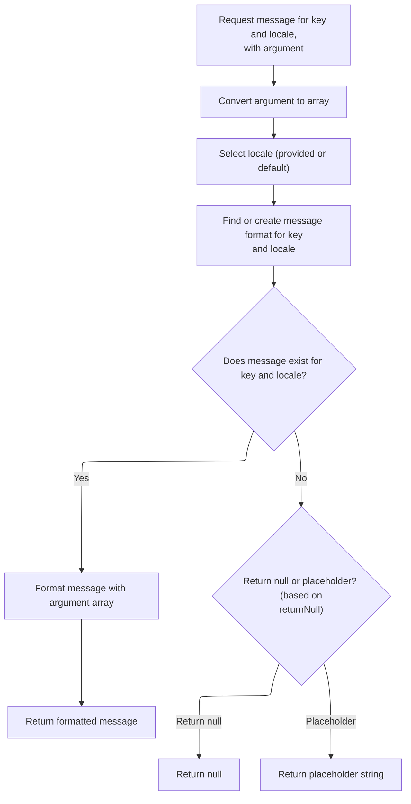
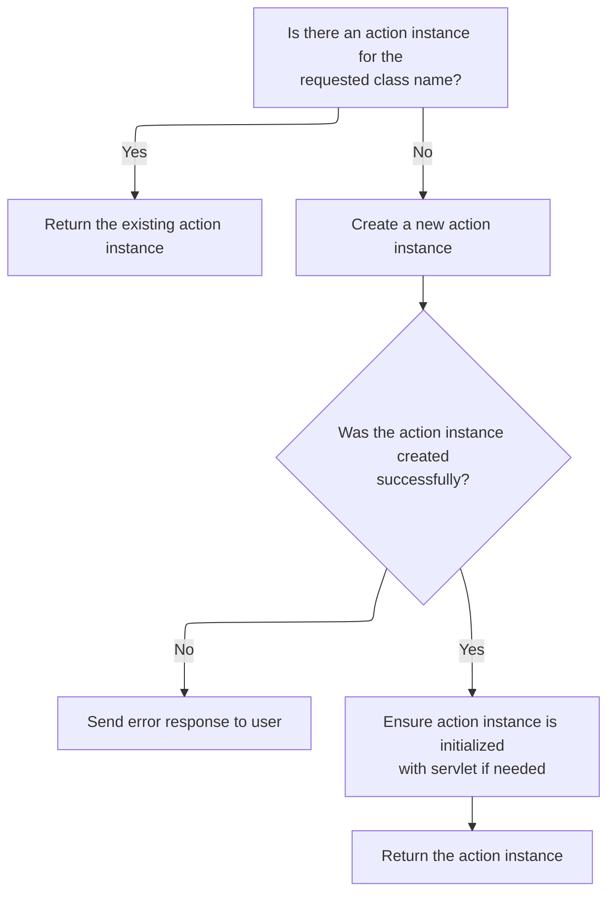

This document describes how the system creates or retrieves an action instance to handle a user request. The process includes logging, checking for existing instances, creating and initializing new ones if needed, and using localized messages for error reporting. This ensures efficient request handling and meaningful user feedback.

# Delegating Action Creation with Logging

<SwmSnippet path="/faces/src/main/java/org/apache/struts/faces/application/FacesTilesRequestProcessor.java" line="189">

---

<SwmToken path="faces/src/main/java/org/apache/struts/faces/application/FacesTilesRequestProcessor.java" pos="189:5:5" line-data="    protected Action processActionCreate(HttpServletRequest request,">`processActionCreate`</SwmToken> just wraps the superclass's action creation with some extra logging. It doesn't change how the Action is created—just logs before and after calling the parent, then returns the result. We call the superclass (<SwmToken path="faces/src/main/java/org/apache/struts/faces/application/FacesTilesRequestProcessor.java" pos="54:15:15" line-data=" * &lt;p&gt;Concrete implementation of &lt;code&gt;RequestProcessor&lt;/code&gt; that">`RequestProcessor`</SwmToken>) next because that's where the actual Action instantiation logic lives.

```java
    protected Action processActionCreate(HttpServletRequest request,
                                         HttpServletResponse response,
                                         ActionMapping mapping)
        throws IOException {

        if (log.isTraceEnabled()) {
            log.trace("Performing standard action create");
        }
        Action result = super.processActionCreate(request, response, mapping);
        if (log.isDebugEnabled()) {
            log.debug("Standard action create returned " +
                      result.getClass().getName() + " instance");
        }
        return (result);

    }
```

---

</SwmSnippet>

# Action Instance Retrieval and Creation

<SwmSnippet path="/core/src/main/java/org/apache/struts/action/RequestProcessor.java" line="248">

---

In <SwmToken path="core/src/main/java/org/apache/struts/action/RequestProcessor.java" pos="248:5:5" line-data="    protected Action processActionCreate(HttpServletRequest request,">`processActionCreate`</SwmToken>, we check if there's already an Action instance for the requested class in the cache. If not, we use a factory method to create one and cache it. If instantiation fails, we need to fetch an error message for logging and error reporting, which is why we call <SwmToken path="core/src/main/java/org/apache/struts/action/RequestProcessor.java" pos="31:10:10" line-data="import org.apache.struts.util.MessageResources;">`MessageResources`</SwmToken> next.

```java
    protected Action processActionCreate(HttpServletRequest request,
        HttpServletResponse response, ActionMapping mapping)
        throws IOException {
        // Acquire the Action instance we will be using (if there is one)
        String className = mapping.getType();

        if (log.isDebugEnabled()) {
            log.debug(" Looking for Action instance for class " + className);
        }

        // If there were a mapping property indicating whether
        // an Action were a singleton or not ([true]),
        // could we just instantiate and return a new instance here?
        Action instance;

        synchronized (actions) {
            // Return any existing Action instance of this class
            instance = (Action) actions.get(className);

            if (instance != null) {
                if (log.isTraceEnabled()) {
                    log.trace("  Returning existing Action instance");
                }

                return (instance);
            }

            // Create and return a new Action instance
            if (log.isTraceEnabled()) {
                log.trace("  Creating new Action instance");
            }

            try {
                instance = (Action) RequestUtils.applicationInstance(className);

                // Maybe we should propagate this exception
                // instead of returning null.
            } catch (Exception e) {
                log.error(getInternal().getMessage("actionCreate",
                        mapping.getPath(), mapping.toString()), e);

```

---

</SwmSnippet>

## Formatting and Retrieving Localized Messages



<SwmSnippet path="/core/src/main/java/org/apache/struts/util/MessageResources.java" line="324">

---

<SwmToken path="core/src/main/java/org/apache/struts/util/MessageResources.java" pos="324:5:5" line-data="    public String getMessage(Locale locale, String key, Object arg0) {">`getMessage`</SwmToken>`(`<SwmToken path="core/src/main/java/org/apache/struts/util/MessageResources.java" pos="324:9:9" line-data="    public String getMessage(Locale locale, String key, Object arg0) {">`locale`</SwmToken>`, `<SwmToken path="core/src/main/java/org/apache/struts/util/MessageResources.java" pos="324:14:14" line-data="    public String getMessage(Locale locale, String key, Object arg0) {">`key`</SwmToken>`, `<SwmToken path="core/src/main/java/org/apache/struts/util/MessageResources.java" pos="324:19:19" line-data="    public String getMessage(Locale locale, String key, Object arg0) {">`arg0`</SwmToken>`)` just wraps the array-based version, so everything ends up in the main formatting logic. We call the array version next to handle the actual message lookup and formatting.

```java
    public String getMessage(Locale locale, String key, Object arg0) {
        return this.getMessage(locale, key, new Object[] { arg0 });
    }
```

---

</SwmSnippet>

<SwmSnippet path="/core/src/main/java/org/apache/struts/util/MessageResources.java" line="286">

---

<SwmToken path="core/src/main/java/org/apache/struts/util/MessageResources.java" pos="286:5:5" line-data="    public String getMessage(Locale locale, String key, Object[] args) {">`getMessage`</SwmToken>`(`<SwmToken path="core/src/main/java/org/apache/struts/util/MessageResources.java" pos="286:9:9" line-data="    public String getMessage(Locale locale, String key, Object[] args) {">`locale`</SwmToken>`, `<SwmToken path="core/src/main/java/org/apache/struts/util/MessageResources.java" pos="286:14:14" line-data="    public String getMessage(Locale locale, String key, Object[] args) {">`key`</SwmToken>`, `<SwmToken path="core/src/main/java/org/apache/struts/util/MessageResources.java" pos="286:21:21" line-data="    public String getMessage(Locale locale, String key, Object[] args) {">`args`</SwmToken>`)` handles the actual message lookup and formatting. It caches <SwmToken path="core/src/main/java/org/apache/struts/util/MessageResources.java" pos="287:5:5" line-data="        // Cache MessageFormat instances as they are accessed">`MessageFormat`</SwmToken> objects for performance, escapes the format string, and returns a placeholder if the message is missing. If the message isn't found here, we need to check the next resource bundle implementation.

```java
    public String getMessage(Locale locale, String key, Object[] args) {
        // Cache MessageFormat instances as they are accessed
        if (locale == null) {
            locale = defaultLocale;
        }

        MessageFormat format = null;
        String formatKey = messageKey(locale, key);

        synchronized (formats) {
            format = (MessageFormat) formats.get(formatKey);

            if (format == null) {
                String formatString = getMessage(locale, key);

                if (formatString == null) {
                    return returnNull ? null : ("???" + formatKey + "???");
                }

                format = new MessageFormat(escape(formatString));
                format.setLocale(locale);
                formats.put(formatKey, format);
            }
        }

        return format.format(args);
    }
```

---

</SwmSnippet>

## Error Handling for Action Creation Failures



<SwmSnippet path="/core/src/main/java/org/apache/struts/action/RequestProcessor.java" line="289">

---

Back in `RequestProcessor.processActionCreate`, after getting the message from <SwmToken path="core/src/main/java/org/apache/struts/action/RequestProcessor.java" pos="31:10:10" line-data="import org.apache.struts.util.MessageResources;">`MessageResources`</SwmToken>, we use it to send an error if Action creation failed. If the message wasn't found, we call <SwmToken path="core/src/main/java/org/apache/struts/util/PropertyMessageResources.java" pos="82:8:8" line-data=" * Configure &lt;code&gt;PropertyMessageResources&lt;/code&gt; to operate in this mode by">`PropertyMessageResources`</SwmToken> next to try another lookup before returning an error.

```java
                response.sendError(HttpServletResponse.SC_INTERNAL_SERVER_ERROR,
                    getInternal().getMessage("actionCreate", mapping.getPath()));

                return (null);
            }

```

---

</SwmSnippet>

<SwmSnippet path="/core/src/main/java/org/apache/struts/util/PropertyMessageResources.java" line="227">

---

<SwmToken path="core/src/main/java/org/apache/struts/util/MessageResources.java" pos="299:7:13" line-data="                String formatString = getMessage(locale, key);">`getMessage(locale, key)`</SwmToken> in <SwmToken path="core/src/main/java/org/apache/struts/util/PropertyMessageResources.java" pos="82:8:8" line-data=" * Configure &lt;code&gt;PropertyMessageResources&lt;/code&gt; to operate in this mode by">`PropertyMessageResources`</SwmToken> tries to find the message using different strategies based on the mode. If it can't find the message for the requested locale, it tries the default locale, then the base properties file, and finally returns a placeholder if nothing is found. This increases the chances of showing a real message to the user.

```java
    public String getMessage(Locale locale, String key) {
        if (log.isDebugEnabled()) {
            log.debug("getMessage(" + locale + "," + key + ")");
        }

        // Initialize variables we will require
        String localeKey = localeKey(locale);
        String originalKey = messageKey(localeKey, key);
        String message = null;

        // Search the specified Locale
        message = findMessage(locale, key, originalKey);
        if (message != null) {
            return message;
        }

        // JSTL Compatibility - JSTL doesn't use the default locale
        if (mode == MODE_JSTL) {

           // do nothing (i.e. don't use default Locale)

        // PropertyResourcesBundle - searches through the hierarchy
        // for the default Locale (e.g. first en_US then en)
        } else if (mode == MODE_RESOURCE_BUNDLE) {

            if (!defaultLocale.equals(locale)) {
                message = findMessage(defaultLocale, key, originalKey);
            }

        // Default (backwards) Compatibility - just searches the
        // specified Locale (e.g. just en_US)
        } else {

            if (!defaultLocale.equals(locale)) {
                localeKey = localeKey(defaultLocale);
                message = findMessage(localeKey, key, originalKey);
            }

        }
        if (message != null) {
            return message;
        }

        // Find the message in the default properties file
        message = findMessage("", key, originalKey);
        if (message != null) {
            return message;
        }

        // Return an appropriate error indication
        if (returnNull) {
            return (null);
        } else {
            return ("???" + messageKey(locale, key) + "???");
        }
    }
```

---

</SwmSnippet>

<SwmSnippet path="/core/src/main/java/org/apache/struts/action/RequestProcessor.java" line="295">

---

After returning from <SwmToken path="core/src/main/java/org/apache/struts/util/PropertyMessageResources.java" pos="82:8:8" line-data=" * Configure &lt;code&gt;PropertyMessageResources&lt;/code&gt; to operate in this mode by">`PropertyMessageResources`</SwmToken>, if we successfully created an Action, we cache it and make sure it has a reference to the servlet. This keeps instance creation efficient and ensures the Action can interact with the servlet environment.

```java
            actions.put(className, instance);

            if (instance.getServlet() == null) {
                instance.setServlet(this.servlet);
            }
        }

        return (instance);
    }
```

---

</SwmSnippet>

&nbsp;

*This is an auto-generated document by Swimm 🌊 and has not yet been verified by a human*

<SwmMeta version="3.0.0" repo-id="Z2l0aHViJTNBJTNBc3RydXRzMSUzQSUzQVN3aW1tLURlbW8=" repo-name="struts1"><sup>Powered by [Swimm](https://app.swimm.io/)</sup></SwmMeta>
