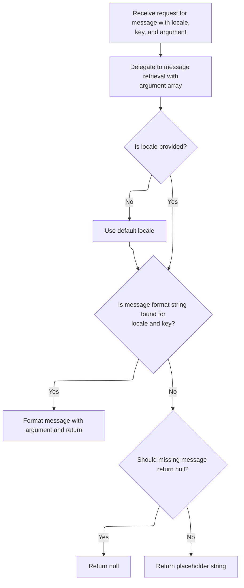
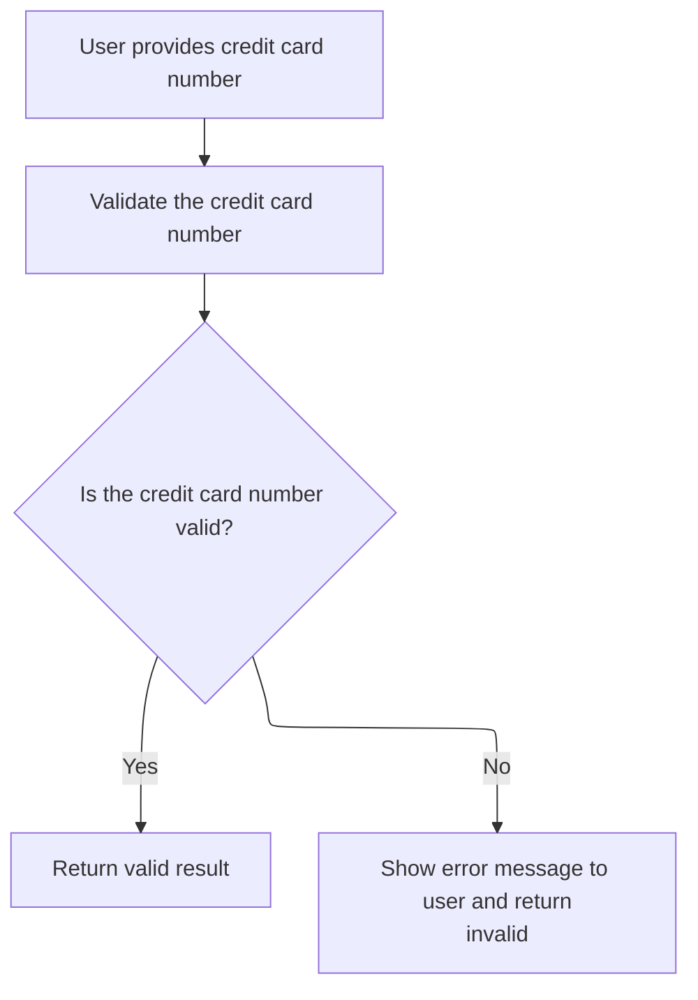
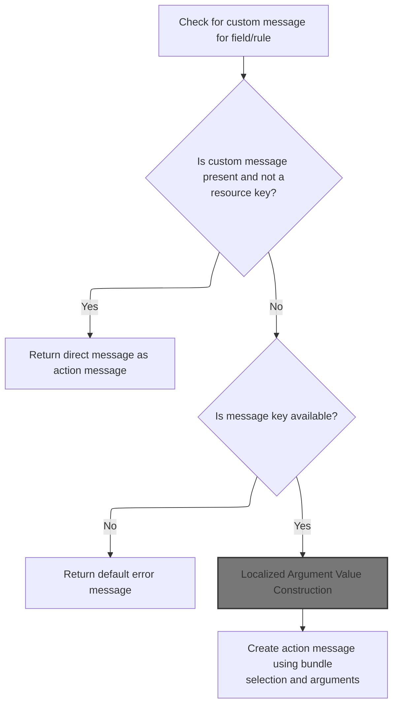
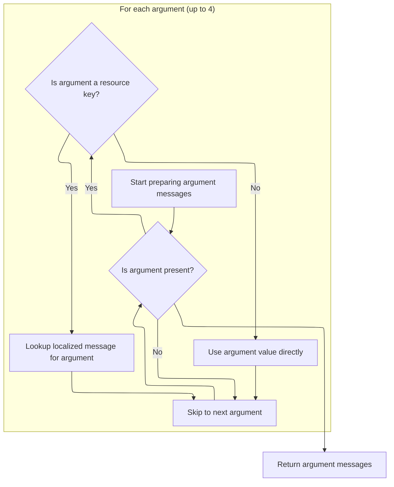
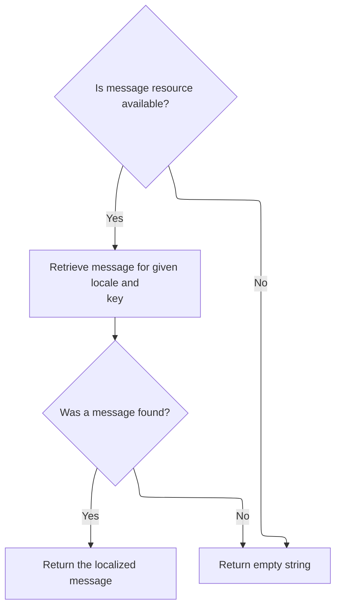
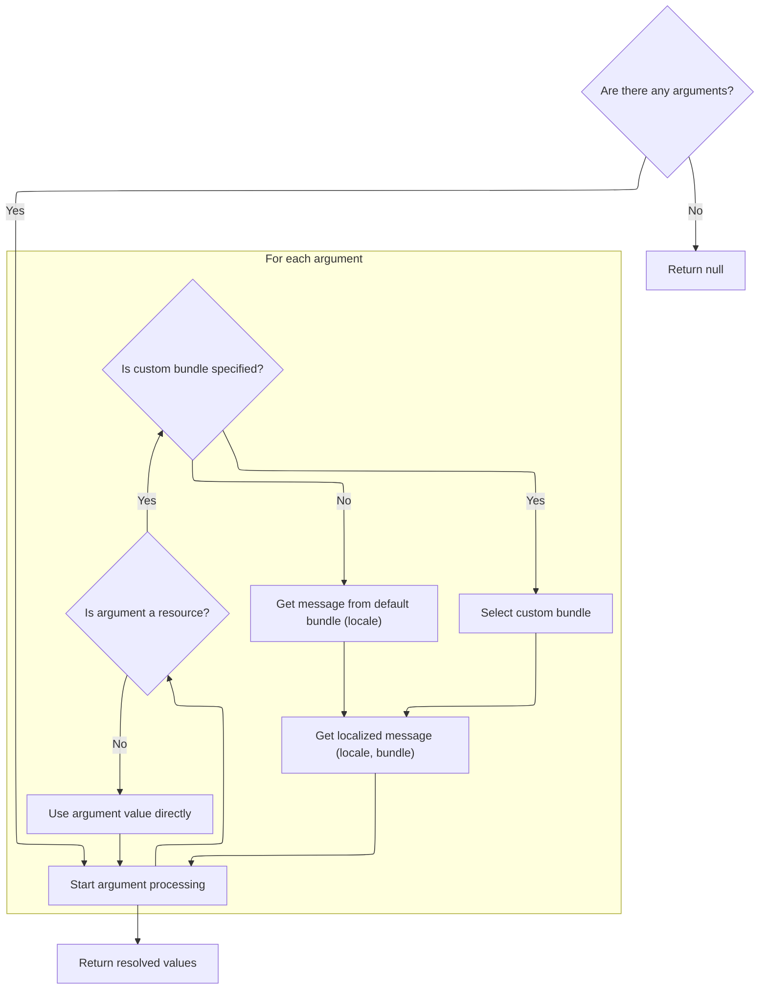
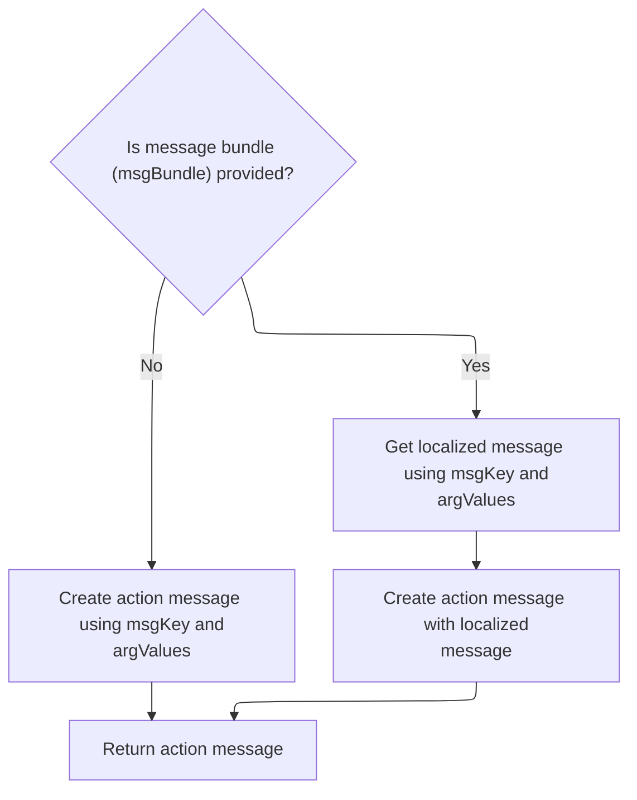

This document describes the flow for validating a credit card number provided by a user. The system checks if the input is blank or null (which is considered valid), validates the credit card format, and, if invalid, constructs a localized error message using resource bundles and argument substitution.

# Credit Card Validation Entry

<SwmSnippet path="/core/src/main/java/org/apache/struts/validator/FieldChecks.java" line="1134">

---

In <SwmToken path="core/src/main/java/org/apache/struts/validator/FieldChecks.java" pos="1134:7:7" line-data="    public static Object validateCreditCard(Object bean, ValidatorAction va,">`validateCreditCard`</SwmToken>, we grab the value from the bean for validation. If there's an exception, we immediately call <SwmToken path="core/src/main/java/org/apache/struts/validator/FieldChecks.java" pos="1143:1:1" line-data="            processFailure(errors, field, validator.getFormName(), &quot;creditCard&quot;, e);">`processFailure`</SwmToken> to log the error and add a user error message, then return false to indicate validation can't continue.

```java
    public static Object validateCreditCard(Object bean, ValidatorAction va,
        Field field, ActionMessages errors, Validator validator,
        HttpServletRequest request) {
        Object result = null;
        String value = null;

        try {
            value = evaluateBean(bean, field);
        } catch (Exception e) {
            processFailure(errors, field, validator.getFormName(), "creditCard", e);
            return Boolean.FALSE;
        }

        if (GenericValidator.isBlankOrNull(value)) {
            return Boolean.TRUE;
        }

```

---

</SwmSnippet>

## Error Handling and Logging

<SwmSnippet path="/core/src/main/java/org/apache/struts/validator/FieldChecks.java" line="1434">

---

In <SwmToken path="core/src/main/java/org/apache/struts/validator/FieldChecks.java" pos="1434:7:7" line-data="    private static void processFailure(ActionMessages errors, Field field,">`processFailure`</SwmToken>, we build a log message using <SwmToken path="core/src/main/java/org/apache/struts/validator/FieldChecks.java" pos="1438:1:3" line-data="            sysmsgs.getMessage(&quot;validation.failed&quot;, validatorName,">`sysmsgs.getMessage`</SwmToken> to include validator, field, form, and exception details, then log it. Next, we need MessageResources.getMessage to handle message formatting and localization.

```java
    private static void processFailure(ActionMessages errors, Field field,
        String formName, String validatorName, Throwable t) {
        // Log the error
        String logErrorMsg =
            sysmsgs.getMessage("validation.failed", validatorName,
                field.getProperty(), formName, t.toString());

        log.error(logErrorMsg, t);

```

---

</SwmSnippet>

### Formatting Log Messages

<SwmSnippet path="/core/src/main/java/org/apache/struts/util/MessageResources.java" line="355">

---

<SwmToken path="core/src/main/java/org/apache/struts/util/MessageResources.java" pos="355:5:5" line-data="    public String getMessage(Locale locale, String key, Object arg0,">`getMessage`</SwmToken> takes three arguments and passes them as an array for message formatting. This lets us inject multiple values into the log or user message templates.

```java
    public String getMessage(Locale locale, String key, Object arg0,
        Object arg1, Object arg2) {
        return this.getMessage(locale, key, new Object[] { arg0, arg1, arg2 });
    }
```

---

</SwmSnippet>

### Message Formatting and Caching



<SwmSnippet path="/core/src/main/java/org/apache/struts/util/MessageResources.java" line="324">

---

<SwmToken path="core/src/main/java/org/apache/struts/util/MessageResources.java" pos="324:5:5" line-data="    public String getMessage(Locale locale, String key, Object arg0) {">`getMessage`</SwmToken> handles message formatting, caching <SwmToken path="core/src/main/java/org/apache/struts/util/MessageResources.java" pos="287:5:5" line-data="        // Cache MessageFormat instances as they are accessed">`MessageFormat`</SwmToken> instances for performance, deals with null locales by using a default, and returns a fallback string if the message is missing. Synchronization ensures thread safety when accessing the cache.

```java
    public String getMessage(Locale locale, String key, Object arg0) {
        return this.getMessage(locale, key, new Object[] { arg0 });
    }
```

---

</SwmSnippet>

<SwmSnippet path="/core/src/main/java/org/apache/struts/util/MessageResources.java" line="286">

---

<SwmToken path="core/src/main/java/org/apache/struts/util/MessageResources.java" pos="286:5:5" line-data="    public String getMessage(Locale locale, String key, Object[] args) {">`getMessage`</SwmToken> here caches <SwmToken path="core/src/main/java/org/apache/struts/util/MessageResources.java" pos="287:5:5" line-data="        // Cache MessageFormat instances as they are accessed">`MessageFormat`</SwmToken> objects for each locale and key, handles null locales by defaulting, and returns a fallback string if the message is missing. It synchronizes access to the cache for thread safety and formats the message with the provided arguments.

```java
    public String getMessage(Locale locale, String key, Object[] args) {
        // Cache MessageFormat instances as they are accessed
        if (locale == null) {
            locale = defaultLocale;
        }

        MessageFormat format = null;
        String formatKey = messageKey(locale, key);

        synchronized (formats) {
            format = (MessageFormat) formats.get(formatKey);

            if (format == null) {
                String formatString = getMessage(locale, key);

                if (formatString == null) {
                    return returnNull ? null : ("???" + formatKey + "???");
                }

                format = new MessageFormat(escape(formatString));
                format.setLocale(locale);
                formats.put(formatKey, format);
            }
        }

        return format.format(args);
    }
```

---

</SwmSnippet>

### User Error Messaging

<SwmSnippet path="/core/src/main/java/org/apache/struts/validator/FieldChecks.java" line="1443">

---

Back in <SwmToken path="core/src/main/java/org/apache/struts/validator/FieldChecks.java" pos="1143:1:1" line-data="            processFailure(errors, field, validator.getFormName(), &quot;creditCard&quot;, e);">`processFailure`</SwmToken>, after logging, we grab a general system error message from sysmsgs and add it to the errors for user display. We need MessageResources.getMessage again to fetch the localized error string.

```java
        // Add general "system error" message to show to the user
        String userErrorMsg = sysmsgs.getMessage("system.error");

        errors.add(field.getKey(), new ActionMessage(userErrorMsg, false));
    }
```

---

</SwmSnippet>

<SwmSnippet path="/core/src/main/java/org/apache/struts/util/MessageResources.java" line="196">

---

<SwmToken path="core/src/main/java/org/apache/struts/util/MessageResources.java" pos="196:5:5" line-data="    public String getMessage(String key) {">`getMessage`</SwmToken> here fetches the message for a key using the default locale and no arguments, which is handy for generic error strings.

```java
    public String getMessage(String key) {
        return this.getMessage((Locale) null, key, null);
    }
```

---

</SwmSnippet>

## Credit Card Format Validation



<SwmSnippet path="/core/src/main/java/org/apache/struts/validator/FieldChecks.java" line="1151">

---

After returning from <SwmToken path="core/src/main/java/org/apache/struts/validator/FieldChecks.java" pos="1143:1:1" line-data="            processFailure(errors, field, validator.getFormName(), &quot;creditCard&quot;, e);">`processFailure`</SwmToken>, <SwmToken path="core/src/main/java/org/apache/struts/validator/FieldChecks.java" pos="1134:7:7" line-data="    public static Object validateCreditCard(Object bean, ValidatorAction va,">`validateCreditCard`</SwmToken> checks the credit card format. If it's invalid, we add an error message using <SwmToken path="core/src/main/java/org/apache/struts/validator/FieldChecks.java" pos="1155:1:3" line-data="                Resources.getActionMessage(validator, request, va, field));">`Resources.getActionMessage`</SwmToken> to build the user-facing error.

```java
        result = GenericTypeValidator.formatCreditCard(value);

        if (result == null) {
            errors.add(field.getKey(),
                Resources.getActionMessage(validator, request, va, field));
        }

        return (result == null) ? Boolean.FALSE : result;
    }
```

---

</SwmSnippet>

# Building Action Messages



<SwmSnippet path="/core/src/main/java/org/apache/struts/validator/Resources.java" line="365">

---

In <SwmToken path="core/src/main/java/org/apache/struts/validator/Resources.java" pos="365:7:7" line-data="    public static ActionMessage getActionMessage(Validator validator,">`getActionMessage`</SwmToken>, we figure out the message key and bundle, check if the message is a resource, and prep for localization. Next, we call <SwmToken path="core/src/main/java/org/apache/struts/validator/Resources.java" pos="391:1:1" line-data="            getMessageResources(application, request, msgBundle);">`getMessageResources`</SwmToken> to fetch the right resource bundle.

```java
    public static ActionMessage getActionMessage(Validator validator,
        HttpServletRequest request, ValidatorAction va, Field field) {
        Msg msg = field.getMessage(va.getName());

        if ((msg != null) && !msg.isResource()) {
            return new ActionMessage(msg.getKey(), false);
        }

        String msgKey = null;
        String msgBundle = null;

        if (msg == null) {
            msgKey = va.getMsg();
        } else {
            msgKey = msg.getKey();
            msgBundle = msg.getBundle();
        }

        if ((msgKey == null) || (msgKey.length() == 0)) {
            return new ActionMessage("??? " + va.getName() + "."
                + field.getProperty() + " ???", false);
        }

        ServletContext application =
            (ServletContext) validator.getParameterValue(SERVLET_CONTEXT_PARAM);
        MessageResources messages =
            getMessageResources(application, request, msgBundle);
```

---

</SwmSnippet>

## Resource Bundle Lookup

<SwmSnippet path="/core/src/main/java/org/apache/struts/validator/Resources.java" line="117">

---

In <SwmToken path="core/src/main/java/org/apache/struts/validator/Resources.java" pos="117:7:7" line-data="    public static MessageResources getMessageResources(">`getMessageResources`</SwmToken>, we look for the resource bundle in the request, then in the application using the module prefix, then globally. If the bundle is null, we use the default. Next, we call ModuleUtils.getModuleConfig to get the module prefix for the lookup.

```java
    public static MessageResources getMessageResources(
        ServletContext application, HttpServletRequest request, String bundle) {
        if (bundle == null) {
            bundle = Globals.MESSAGES_KEY;
        }

        MessageResources resources =
            (MessageResources) request.getAttribute(bundle);

        if (resources == null) {
            ModuleConfig moduleConfig =
                ModuleUtils.getInstance().getModuleConfig(request, application);

            resources =
                (MessageResources) application.getAttribute(bundle
                    + moduleConfig.getPrefix());
        }

```

---

</SwmSnippet>

### Module Configuration Retrieval

<SwmSnippet path="/core/src/main/java/org/apache/struts/util/ModuleUtils.java" line="130">

---

<SwmToken path="core/src/main/java/org/apache/struts/util/ModuleUtils.java" pos="130:5:5" line-data="    public ModuleConfig getModuleConfig(HttpServletRequest request,">`getModuleConfig`</SwmToken> first tries to get the module config from the request. If it's missing, it falls back to the context with an empty string, then stores it in the request for later use. This guarantees we always have a module config available.

```java
    public ModuleConfig getModuleConfig(HttpServletRequest request,
        ServletContext context) {
        ModuleConfig moduleConfig = this.getModuleConfig(request);

        if (moduleConfig == null) {
            moduleConfig = this.getModuleConfig("", context);
            request.setAttribute(Globals.MODULE_KEY, moduleConfig);
        }

        return moduleConfig;
    }
```

---

</SwmSnippet>

<SwmSnippet path="/core/src/main/java/org/apache/struts/util/ModuleUtils.java" line="89">

---

<SwmToken path="core/src/main/java/org/apache/struts/util/ModuleUtils.java" pos="89:5:5" line-data="    public ModuleConfig getModuleConfig(String prefix, ServletContext context) {">`getModuleConfig`</SwmToken> here grabs the module config from the context using either the default key or the key plus prefix. If the prefix is null or '/', it returns the default config; otherwise, it fetches the module-specific config.

```java
    public ModuleConfig getModuleConfig(String prefix, ServletContext context) {
        if ((prefix == null) || "/".equals(prefix)) {
            return (ModuleConfig) context.getAttribute(Globals.MODULE_KEY);
        } else {
            return (ModuleConfig) context.getAttribute(Globals.MODULE_KEY
                + prefix);
        }
    }
```

---

</SwmSnippet>

### Resource Bundle Fallback

<SwmSnippet path="/core/src/main/java/org/apache/struts/validator/Resources.java" line="135">

---

After returning from <SwmToken path="core/src/main/java/org/apache/struts/validator/Resources.java" pos="128:1:1" line-data="                ModuleUtils.getInstance().getModuleConfig(request, application);">`ModuleUtils`</SwmToken>, <SwmToken path="core/src/main/java/org/apache/struts/validator/Resources.java" pos="117:7:7" line-data="    public static MessageResources getMessageResources(">`getMessageResources`</SwmToken> checks for the bundle globally. If it's still missing, it throws a <SwmToken path="core/src/main/java/org/apache/struts/validator/Resources.java" pos="140:5:5" line-data="            throw new NullPointerException(">`NullPointerException`</SwmToken>, making sure missing resources are caught early.

```java
        if (resources == null) {
            resources = (MessageResources) application.getAttribute(bundle);
        }

        if (resources == null) {
            throw new NullPointerException(
                "No message resources found for bundle: " + bundle);
        }

        return resources;
    }
```

---

</SwmSnippet>

## Locale and Argument Preparation

<SwmSnippet path="/core/src/main/java/org/apache/struts/validator/Resources.java" line="392">

---

After getting the resources, <SwmToken path="core/src/main/java/org/apache/struts/validator/FieldChecks.java" pos="1155:3:3" line-data="                Resources.getActionMessage(validator, request, va, field));">`getActionMessage`</SwmToken> grabs the user's locale and fetches the arguments for the error message. Next, we call <SwmToken path="core/src/main/java/org/apache/struts/validator/Resources.java" pos="394:11:11" line-data="        Arg[] args = field.getArgs(va.getName());">`getArgs`</SwmToken> to build the localized argument values.

```java
        Locale locale = RequestUtils.getUserLocale(request, null);

        Arg[] args = field.getArgs(va.getName());
```

---

</SwmSnippet>

## Argument Localization



<SwmSnippet path="/core/src/main/java/org/apache/struts/validator/Resources.java" line="420">

---

<SwmToken path="core/src/main/java/org/apache/struts/validator/Resources.java" pos="420:9:9" line-data="    public static String[] getArgs(String actionName,">`getArgs`</SwmToken> grabs up to four arguments from the field, checks if each is a resource, and fetches localized messages if needed. Otherwise, it uses the argument key directly. This is fixed to four, so it's not flexible for more args.

```java
    public static String[] getArgs(String actionName,
        MessageResources messages, Locale locale, Field field) {
        String[] argMessages = new String[4];

        Arg[] args =
            new Arg[] {
                field.getArg(actionName, 0), field.getArg(actionName, 1),
                field.getArg(actionName, 2), field.getArg(actionName, 3)
            };

        for (int i = 0; i < args.length; i++) {
            if (args[i] == null) {
                continue;
            }

            if (args[i].isResource()) {
                argMessages[i] = getMessage(messages, locale, args[i].getKey());
            } else {
                argMessages[i] = args[i].getKey();
            }
        }

        return argMessages;
    }
```

---

</SwmSnippet>

## Argument Message Retrieval



<SwmSnippet path="/core/src/main/java/org/apache/struts/validator/Resources.java" line="231">

---

<SwmToken path="core/src/main/java/org/apache/struts/validator/Resources.java" pos="231:7:7" line-data="    public static String getMessage(MessageResources messages, Locale locale,">`getMessage`</SwmToken> checks if the messages resource is available, then fetches the localized message for the key. If it's missing, we return an empty string.

```java
    public static String getMessage(MessageResources messages, Locale locale,
        String key) {
        String message = null;

        if (messages != null) {
            message = messages.getMessage(locale, key);
        }

        return (message == null) ? "" : message;
    }
```

---

</SwmSnippet>

<SwmSnippet path="/core/src/main/java/org/apache/struts/util/MessageResources.java" line="218">

---

<SwmToken path="core/src/main/java/org/apache/struts/util/MessageResources.java" pos="218:5:5" line-data="    public String getMessage(String key, Object arg0) {">`getMessage`</SwmToken> here fetches the message for a key and argument, defaulting to the system locale if none is provided.

```java
    public String getMessage(String key, Object arg0) {
        return this.getMessage((Locale) null, key, arg0);
    }
```

---

</SwmSnippet>

## Argument Value Preparation

<SwmSnippet path="/core/src/main/java/org/apache/struts/validator/Resources.java" line="395">

---

After getting the args, <SwmToken path="core/src/main/java/org/apache/struts/validator/FieldChecks.java" pos="1155:3:3" line-data="                Resources.getActionMessage(validator, request, va, field));">`getActionMessage`</SwmToken> calls <SwmToken path="core/src/main/java/org/apache/struts/validator/Resources.java" pos="396:1:1" line-data="            getArgValues(application, request, messages, locale, args);">`getArgValues`</SwmToken> to build the actual argument strings, handling localization and bundle lookup for message formatting.

```java
        String[] argValues =
            getArgValues(application, request, messages, locale, args);

```

---

</SwmSnippet>

## Localized Argument Value Construction



<SwmSnippet path="/core/src/main/java/org/apache/struts/validator/Resources.java" line="455">

---

In <SwmToken path="core/src/main/java/org/apache/struts/validator/Resources.java" pos="455:9:9" line-data="    private static String[] getArgValues(ServletContext application,">`getArgValues`</SwmToken>, we check each argument for a bundle. If present, we fetch the resource bundle for that argument, letting us localize each argument separately. Otherwise, we use the default bundle.

```java
    private static String[] getArgValues(ServletContext application,
        HttpServletRequest request, MessageResources defaultMessages,
        Locale locale, Arg[] args) {
        if ((args == null) || (args.length == 0)) {
            return null;
        }

        String[] values = new String[args.length];

        for (int i = 0; i < args.length; i++) {
            if (args[i] != null) {
                if (args[i].isResource()) {
                    MessageResources messages = defaultMessages;

                    if (args[i].getBundle() != null) {
                        messages =
                            getMessageResources(application, request,
                                args[i].getBundle());
                    }

```

---

</SwmSnippet>

<SwmSnippet path="/core/src/main/java/org/apache/struts/validator/Resources.java" line="475">

---

After returning from <SwmToken path="core/src/main/java/org/apache/struts/validator/Resources.java" pos="117:7:7" line-data="    public static MessageResources getMessageResources(">`getMessageResources`</SwmToken>, <SwmToken path="core/src/main/java/org/apache/struts/validator/Resources.java" pos="396:1:1" line-data="            getArgValues(application, request, messages, locale, args);">`getArgValues`</SwmToken> fetches the localized message for each argument if it's a resource, or uses the key directly. This builds the final argument values for the error message.

```java
                    values[i] = messages.getMessage(locale, args[i].getKey());
                } else {
                    values[i] = args[i].getKey();
                }
            }
        }

        return values;
    }
```

---

</SwmSnippet>

## Final Action Message Construction



<SwmSnippet path="/core/src/main/java/org/apache/struts/validator/Resources.java" line="398">

---

After returning from <SwmToken path="core/src/main/java/org/apache/struts/validator/Resources.java" pos="396:1:1" line-data="            getArgValues(application, request, messages, locale, args);">`getArgValues`</SwmToken>, <SwmToken path="core/src/main/java/org/apache/struts/validator/FieldChecks.java" pos="1155:3:3" line-data="                Resources.getActionMessage(validator, request, va, field));">`getActionMessage`</SwmToken> builds the final <SwmToken path="core/src/main/java/org/apache/struts/validator/Resources.java" pos="398:1:1" line-data="        ActionMessage actionMessage = null;">`ActionMessage`</SwmToken>. If there's no bundle, it uses the key and argument values; if there's a bundle, it fetches the formatted message and wraps it for display.

```java
        ActionMessage actionMessage = null;

        if (msgBundle == null) {
            actionMessage = new ActionMessage(msgKey, argValues);
        } else {
            String message = messages.getMessage(locale, msgKey, argValues);

            actionMessage = new ActionMessage(message, false);
        }

        return actionMessage;
    }
```

---

</SwmSnippet>

&nbsp;

*This is an auto-generated document by Swimm 🌊 and has not yet been verified by a human*

<SwmMeta version="3.0.0" repo-id="Z2l0aHViJTNBJTNBc3RydXRzMSUzQSUzQVN3aW1tLURlbW8=" repo-name="struts1"><sup>Powered by [Swimm](https://app.swimm.io/)</sup></SwmMeta>
