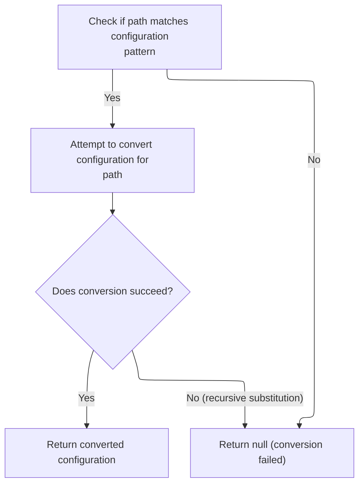
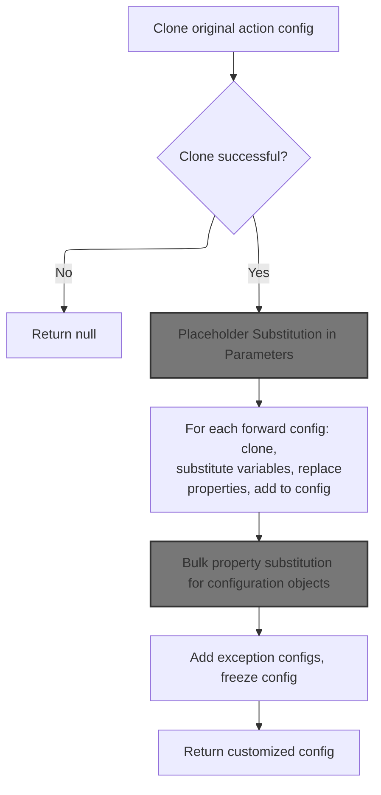
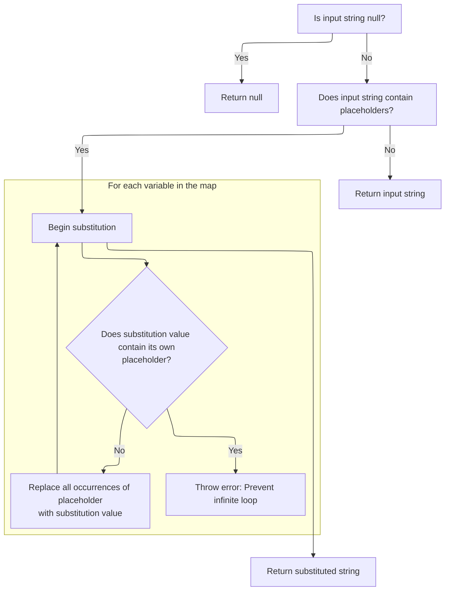
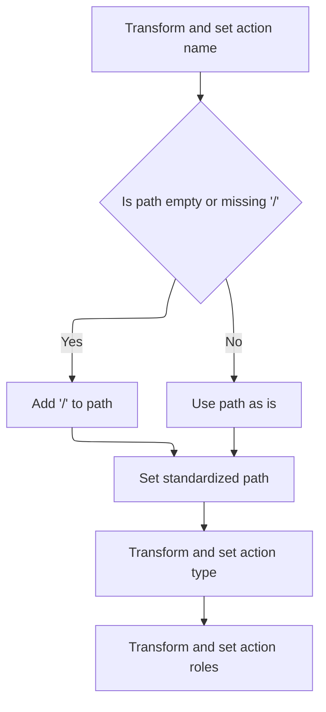
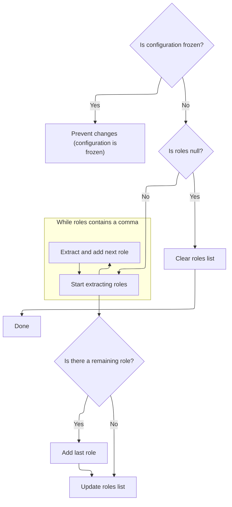
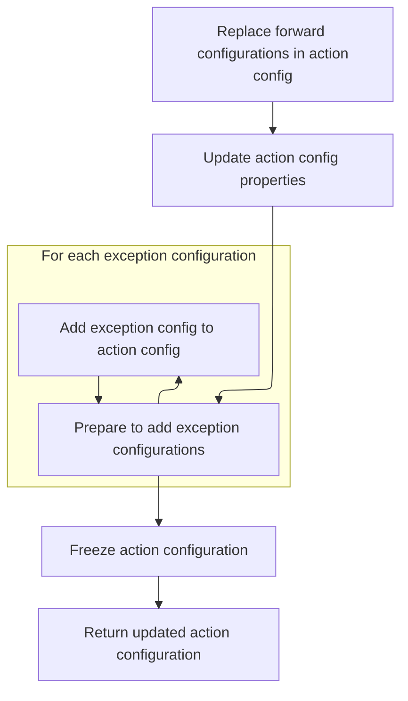
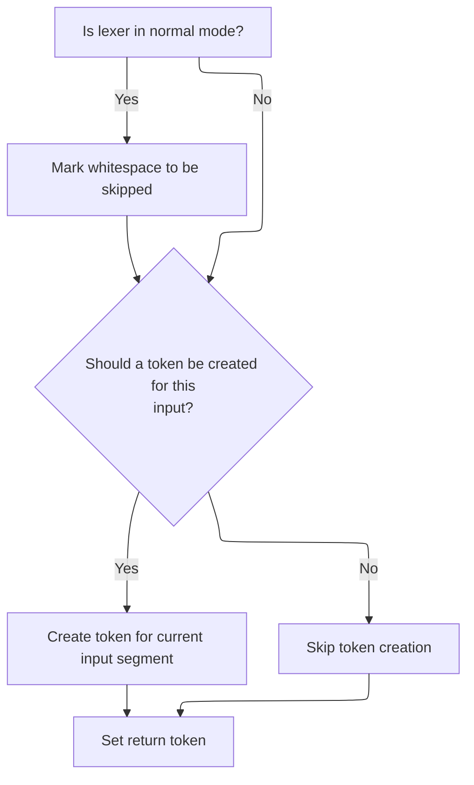

This document explains how input paths are processed and matched against configuration patterns to produce a customized and finalized action configuration. The process includes handling whitespace, matching patterns, substituting variables, and updating configuration properties for use in routing and validation.

# Whitespace Tokenization

<SwmSnippet path="/core/src/main/java/org/apache/struts/validator/validwhen/ValidWhenLexer.java" line="202">

---

In <SwmToken path="core/src/main/java/org/apache/struts/validator/validwhen/ValidWhenLexer.java" pos="202:7:7" line-data="	public final void mWS(boolean _createToken) throws RecognitionException, CharStreamException, TokenStreamException {">`mWS`</SwmToken>, the lexer loops through the input, matching spaces, tabs, newlines, and carriage returns as whitespace tokens. This step strips out whitespace so the parser can focus on the actual validation logic. After tokenizing, the flow continues to <SwmToken path="core/src/main/java/org/apache/struts/config/ActionConfigMatcher.java" pos="47:4:4" line-data="public class ActionConfigMatcher implements Serializable {">`ActionConfigMatcher`</SwmToken>, which uses the parsed tokens to match and configure actions based on patterns.

```java
	public final void mWS(boolean _createToken) throws RecognitionException, CharStreamException, TokenStreamException {
		int _ttype; Token _token=null; int _begin=text.length();
		_ttype = WS;
		int _saveIndex;
		
		{
		int _cnt17=0;
		_loop17:
		do {
			switch ( LA(1)) {
			case ' ':
			{
				match(' ');
				break;
			}
			case '\t':
			{
				match('\t');
				break;
			}
			case '\n':
			{
				match('\n');
				break;
			}
			case '\r':
			{
				match('\r');
				break;
			}
			default:
			{
				if ( _cnt17>=1 ) { break _loop17; } else {throw new NoViableAltForCharException((char)LA(1), getFilename(), getLine(), getColumn());}
			}
			}
			_cnt17++;
		} while (true);
		}
```

---

</SwmSnippet>

## Pattern-Based Action Matching

<SwmSnippet path="/core/src/main/java/org/apache/struts/config/ActionConfigMatcher.java" line="101">

---

In <SwmToken path="core/src/main/java/org/apache/struts/config/ActionConfigMatcher.java" pos="101:5:5" line-data="    public ActionConfig match(String path) {">`match`</SwmToken>, the function normalizes the input path, then loops through all compiled wildcard patterns, using WildcardHelper.match to check for matches. For each match, it prepares a customized <SwmToken path="core/src/main/java/org/apache/struts/config/ActionConfigMatcher.java" pos="101:3:3" line-data="    public ActionConfig match(String path) {">`ActionConfig`</SwmToken> using <SwmToken path="core/src/main/java/org/apache/struts/config/ActionConfigMatcher.java" pos="128:1:1" line-data="                	    convertActionConfig(path,">`convertActionConfig`</SwmToken>. The next step is to call <SwmToken path="core/src/main/java/org/apache/struts/config/ActionConfigMatcher.java" pos="27:10:10" line-data="import org.apache.struts.util.WildcardHelper;">`WildcardHelper`</SwmToken> to actually perform the pattern matching logic.

```java
    public ActionConfig match(String path) {
        ActionConfig config = null;

        if (compiledPaths.size() > 0) {
            if (log.isDebugEnabled()) {
                log.debug("Attempting to match '" + path
                    + "' to a wildcard pattern");
            }

            if ((path.length() > 0) && (path.charAt(0) == '/')) {
                path = path.substring(1);
            }

            Mapping m;
            HashMap vars = new HashMap();

            for (Iterator i = compiledPaths.iterator(); i.hasNext();) {
                m = (Mapping) i.next();

                if (wildcard.match(vars, path, m.getPattern())) {
                    if (log.isDebugEnabled()) {
                        log.debug("Path matches pattern '"
                            + m.getActionConfig().getPath() + "'");
                    }

```

---

</SwmSnippet>

### Wildcard Pattern Matching

See <SwmLink doc-title="Pattern Matching with Wildcards">[Pattern Matching with Wildcards](/.swm/pattern-matching-with-wildcards.bdkvciu0.sw.md)</SwmLink>

### <SwmToken path="core/src/main/java/org/apache/struts/config/ActionConfigMatcher.java" pos="101:3:3" line-data="    public ActionConfig match(String path) {">`ActionConfig`</SwmToken> Conversion After Match



<SwmSnippet path="/core/src/main/java/org/apache/struts/config/ActionConfigMatcher.java" line="126">

---

Back in `ActionConfigMatcher.match`, after returning from <SwmToken path="core/src/main/java/org/apache/struts/config/ActionConfigMatcher.java" pos="27:10:10" line-data="import org.apache.struts.util.WildcardHelper;">`WildcardHelper`</SwmToken>, the code tries to convert the matched <SwmToken path="core/src/main/java/org/apache/struts/config/ActionConfigMatcher.java" pos="129:2:2" line-data="                		    (ActionConfig) m.getActionConfig(), vars);">`ActionConfig`</SwmToken> using variables from the pattern match. If conversion fails due to recursive substitution, it logs a warning and skips that config. The flow then continues to <SwmToken path="core/src/main/java/org/apache/struts/config/ActionConfigMatcher.java" pos="128:1:1" line-data="                	    convertActionConfig(path,">`convertActionConfig`</SwmToken> to build the final <SwmToken path="core/src/main/java/org/apache/struts/config/ActionConfigMatcher.java" pos="129:2:2" line-data="                		    (ActionConfig) m.getActionConfig(), vars);">`ActionConfig`</SwmToken>.

```java
                    try {
                	config =
                	    convertActionConfig(path,
                		    (ActionConfig) m.getActionConfig(), vars);
                    } catch (IllegalStateException e) {
                	log.warn("Path matches pattern '"
                		+ m.getActionConfig().getPath() + "' but is "
                		+ "incompatible with the matching config due "
                		+ "to recursive substitution: "
                		+ path);
                	config = null;
                    }
                }
            }
        }

        return config;
    }
```

---

</SwmSnippet>

## Cloning and Customizing <SwmToken path="core/src/main/java/org/apache/struts/config/ActionConfigMatcher.java" pos="101:3:3" line-data="    public ActionConfig match(String path) {">`ActionConfig`</SwmToken>



<SwmSnippet path="/core/src/main/java/org/apache/struts/config/ActionConfigMatcher.java" line="157">

---

In <SwmToken path="core/src/main/java/org/apache/struts/config/ActionConfigMatcher.java" pos="157:5:5" line-data="    protected ActionConfig convertActionConfig(String path, ActionConfig orig,">`convertActionConfig`</SwmToken>, the code clones the original <SwmToken path="core/src/main/java/org/apache/struts/config/ActionConfigMatcher.java" pos="157:3:3" line-data="    protected ActionConfig convertActionConfig(String path, ActionConfig orig,">`ActionConfig`</SwmToken>, then starts updating its properties by converting parameters using the variables map. This avoids mutating the original config. The next step is to update each property, starting with the name, using <SwmToken path="core/src/main/java/org/apache/struts/config/ActionConfigMatcher.java" pos="170:5:5" line-data="        config.setName(convertParam(orig.getName(), vars));">`convertParam`</SwmToken>.

```java
    protected ActionConfig convertActionConfig(String path, ActionConfig orig,
        Map vars) {
        ActionConfig config = null;

        try {
            config = (ActionConfig) BeanUtils.cloneBean(orig);
        } catch (Exception ex) {
            log.warn("Unable to clone action config, recommend not using "
                + "wildcards", ex);

            return null;
        }

        config.setName(convertParam(orig.getName(), vars));
```

---

</SwmSnippet>

### Placeholder Substitution in Parameters



<SwmSnippet path="/core/src/main/java/org/apache/struts/config/ActionConfigMatcher.java" line="258">

---

In <SwmToken path="core/src/main/java/org/apache/struts/config/ActionConfigMatcher.java" pos="258:5:5" line-data="    protected String convertParam(String val, Map vars) {">`convertParam`</SwmToken>, the code replaces placeholders like {x} in the input string with values from the vars map, using only the first character of each key. It checks for recursive substitution to avoid infinite loops. The next step is to resolve the key value, which is handled by MessageComponent.getKey.

```java
    protected String convertParam(String val, Map vars) {
        if (val == null) {
            return null;
        } else if (val.indexOf("{") == -1) {
            return val;
        }

        Map.Entry entry;
        StringBuffer key = new StringBuffer("{0}");
        StringBuffer ret = new StringBuffer(val);
        String keyStr;
        int x;

        for (Iterator i = vars.entrySet().iterator(); i.hasNext();) {
            entry = (Map.Entry) i.next();
            key.setCharAt(1, ((String) entry.getKey()).charAt(0));
```

---

</SwmSnippet>

<SwmSnippet path="/faces/src/main/java/org/apache/struts/faces/component/MessageComponent.java" line="164">

---

GetKey() checks for a JSF <SwmToken path="faces/src/main/java/org/apache/struts/faces/component/MessageComponent.java" pos="166:1:1" line-data="        ValueBinding vb = getValueBinding(&quot;key&quot;);">`ValueBinding`</SwmToken> for 'key' and returns its value if present, otherwise falls back to the local key variable. This supports both static and dynamic key resolution. After this, the flow returns to <SwmToken path="core/src/main/java/org/apache/struts/config/ActionConfigMatcher.java" pos="170:5:5" line-data="        config.setName(convertParam(orig.getName(), vars));">`convertParam`</SwmToken> to finish substitution.

```java
    public String getKey() {

        ValueBinding vb = getValueBinding("key");
        if (vb != null) {
            return (String) vb.getValue(getFacesContext());
        } else {
            return key;
        }

    }
```

---

</SwmSnippet>

<SwmSnippet path="/core/src/main/java/org/apache/struts/config/ActionConfigMatcher.java" line="274">

---

Back in <SwmToken path="core/src/main/java/org/apache/struts/config/ActionConfigMatcher.java" pos="170:5:5" line-data="        config.setName(convertParam(orig.getName(), vars));">`convertParam`</SwmToken>, after returning from MessageComponent.getKey, the code checks for recursive placeholders (<SwmToken path="core/src/main/java/org/apache/struts/config/ActionConfigMatcher.java" pos="276:3:5" line-data="            // STR-3169">`STR-3169`</SwmToken>). If a value contains its own placeholder, it throws an exception to prevent infinite loops during substitution.

```java
            keyStr = key.toString();
            
            // STR-3169
            // Prevent an infinite loop by retaining the placeholders
            // that contain itself in the substitution value
            if (((String) entry.getValue()).contains(keyStr)) {
        	throw new IllegalStateException();
            }
            
            // Replace all instances of the placeholder
            while ((x = ret.toString().indexOf(keyStr)) > -1) {
                ret.replace(x, x + 3, (String) entry.getValue());
            }
```

---

</SwmSnippet>

### Updating <SwmToken path="core/src/main/java/org/apache/struts/config/ActionConfigMatcher.java" pos="101:3:3" line-data="    public ActionConfig match(String path) {">`ActionConfig`</SwmToken> Properties



<SwmSnippet path="/core/src/main/java/org/apache/struts/config/ActionConfigMatcher.java" line="170">

---

Back in <SwmToken path="core/src/main/java/org/apache/struts/config/ActionConfigMatcher.java" pos="128:1:1" line-data="                	    convertActionConfig(path,">`convertActionConfig`</SwmToken>, after converting the name, the code updates the <SwmToken path="core/src/main/java/org/apache/struts/config/ActionConfigMatcher.java" pos="101:3:3" line-data="    public ActionConfig match(String path) {">`ActionConfig`</SwmToken>'s name property using <SwmToken path="core/src/main/java/org/apache/struts/config/ActionConfigMatcher.java" pos="170:3:3" line-data="        config.setName(convertParam(orig.getName(), vars));">`setName`</SwmToken>. The next step is to call <SwmToken path="core/src/main/java/org/apache/struts/config/ActionConfigMatcher.java" pos="170:3:3" line-data="        config.setName(convertParam(orig.getName(), vars));">`setName`</SwmToken> in <SwmToken path="core/src/main/java/org/apache/struts/config/ActionConfigMatcher.java" pos="101:3:3" line-data="    public ActionConfig match(String path) {">`ActionConfig`</SwmToken> to actually apply the change, unless the configuration is frozen.

```java
        config.setName(convertParam(orig.getName(), vars));

```

---

</SwmSnippet>

<SwmSnippet path="/core/src/main/java/org/apache/struts/config/ActionConfig.java" line="517">

---

SetName checks if the configuration is frozen using the 'configured' flag. If not, it updates the name; otherwise, it throws an exception. This enforces immutability after configuration is finalized.

```java
    public void setName(String name) {
        if (configured) {
            throw new IllegalStateException("Configuration is frozen");
        }

        this.name = name;
    }
```

---

</SwmSnippet>

<SwmSnippet path="/core/src/main/java/org/apache/struts/config/ActionConfigMatcher.java" line="172">

---

Back in <SwmToken path="core/src/main/java/org/apache/struts/config/ActionConfigMatcher.java" pos="128:1:1" line-data="                	    convertActionConfig(path,">`convertActionConfig`</SwmToken>, after updating the name, the code checks if the path starts with '/'. If not, it prepends one to keep the path format consistent. The next step is to call <SwmToken path="core/src/main/java/org/apache/struts/config/ActionConfigMatcher.java" pos="176:3:3" line-data="        config.setPath(path);">`setPath`</SwmToken> in <SwmToken path="core/src/main/java/org/apache/struts/config/ActionConfigMatcher.java" pos="101:3:3" line-data="    public ActionConfig match(String path) {">`ActionConfig`</SwmToken> to apply the normalized path.

```java
        if ((path.length() == 0) || (path.charAt(0) != '/')) {
            path = "/" + path;
        }

        config.setPath(path);
```

---

</SwmSnippet>

<SwmSnippet path="/core/src/main/java/org/apache/struts/config/ActionConfig.java" line="565">

---

SetPath enforces immutability by throwing if the configuration is frozen. If allowed, it updates the path. This keeps routing consistent after configuration is finalized.

```java
    public void setPath(String path) {
        if (configured) {
            throw new IllegalStateException("Configuration is frozen");
        }

        this.path = path;
    }
```

---

</SwmSnippet>

<SwmSnippet path="/core/src/main/java/org/apache/struts/config/ActionConfigMatcher.java" line="177">

---

Back in <SwmToken path="core/src/main/java/org/apache/struts/config/ActionConfigMatcher.java" pos="128:1:1" line-data="                	    convertActionConfig(path,">`convertActionConfig`</SwmToken>, after setting the path, the code updates the <SwmToken path="core/src/main/java/org/apache/struts/config/ActionConfigMatcher.java" pos="101:3:3" line-data="    public ActionConfig match(String path) {">`ActionConfig`</SwmToken>'s type property using <SwmToken path="core/src/main/java/org/apache/struts/config/ActionConfigMatcher.java" pos="177:3:3" line-data="        config.setType(convertParam(orig.getType(), vars));">`setType`</SwmToken>. The next step is to call <SwmToken path="core/src/main/java/org/apache/struts/config/ActionConfigMatcher.java" pos="177:3:3" line-data="        config.setType(convertParam(orig.getType(), vars));">`setType`</SwmToken> in <SwmToken path="core/src/main/java/org/apache/struts/config/ActionConfigMatcher.java" pos="101:3:3" line-data="    public ActionConfig match(String path) {">`ActionConfig`</SwmToken> to apply the change, unless the configuration is frozen.

```java
        config.setType(convertParam(orig.getType(), vars));
```

---

</SwmSnippet>

<SwmSnippet path="/core/src/main/java/org/apache/struts/config/ActionConfigMatcher.java" line="177">

---

Back in <SwmToken path="core/src/main/java/org/apache/struts/config/ActionConfigMatcher.java" pos="128:1:1" line-data="                	    convertActionConfig(path,">`convertActionConfig`</SwmToken>, after updating the type, the code proceeds to update the roles property using <SwmToken path="core/src/main/java/org/apache/struts/config/ActionConfigMatcher.java" pos="178:3:3" line-data="        config.setRoles(convertParam(orig.getRoles(), vars));">`setRoles`</SwmToken>. The next step is to call <SwmToken path="core/src/main/java/org/apache/struts/config/ActionConfigMatcher.java" pos="178:3:3" line-data="        config.setRoles(convertParam(orig.getRoles(), vars));">`setRoles`</SwmToken> in <SwmToken path="core/src/main/java/org/apache/struts/config/ActionConfigMatcher.java" pos="101:3:3" line-data="    public ActionConfig match(String path) {">`ActionConfig`</SwmToken> to apply the change, unless the configuration is frozen.

```java
        config.setType(convertParam(orig.getType(), vars));
```

---

</SwmSnippet>

<SwmSnippet path="/core/src/main/java/org/apache/struts/config/ActionConfig.java" line="788">

---

SetType enforces immutability by throwing if the configuration is frozen. If allowed, it updates the type. This keeps the configuration consistent after it's finalized.

```java
    public void setType(String type) {
        if (configured) {
            throw new IllegalStateException("Configuration is frozen");
        }

        this.type = type;
    }
```

---

</SwmSnippet>

<SwmSnippet path="/core/src/main/java/org/apache/struts/config/ActionConfigMatcher.java" line="178">

---

Back in <SwmToken path="core/src/main/java/org/apache/struts/config/ActionConfigMatcher.java" pos="128:1:1" line-data="                	    convertActionConfig(path,">`convertActionConfig`</SwmToken>, after setting the type, the code updates the roles property using <SwmToken path="core/src/main/java/org/apache/struts/config/ActionConfigMatcher.java" pos="178:3:3" line-data="        config.setRoles(convertParam(orig.getRoles(), vars));">`setRoles`</SwmToken>. The next step is to call <SwmToken path="core/src/main/java/org/apache/struts/config/ActionConfigMatcher.java" pos="178:3:3" line-data="        config.setRoles(convertParam(orig.getRoles(), vars));">`setRoles`</SwmToken> in <SwmToken path="core/src/main/java/org/apache/struts/config/ActionConfigMatcher.java" pos="101:3:3" line-data="    public ActionConfig match(String path) {">`ActionConfig`</SwmToken> to apply the change, unless the configuration is frozen.

```java
        config.setRoles(convertParam(orig.getRoles(), vars));
```

---

</SwmSnippet>

<SwmSnippet path="/core/src/main/java/org/apache/struts/config/ActionConfigMatcher.java" line="178">

---

Back in <SwmToken path="core/src/main/java/org/apache/struts/config/ActionConfigMatcher.java" pos="128:1:1" line-data="                	    convertActionConfig(path,">`convertActionConfig`</SwmToken>, after updating the roles, the code proceeds to update the parameter property using <SwmToken path="core/src/main/java/org/apache/struts/config/ActionConfigMatcher.java" pos="179:3:3" line-data="        config.setParameter(convertParam(orig.getParameter(), vars));">`setParameter`</SwmToken>. The next step is to call <SwmToken path="core/src/main/java/org/apache/struts/config/ActionConfigMatcher.java" pos="179:3:3" line-data="        config.setParameter(convertParam(orig.getParameter(), vars));">`setParameter`</SwmToken> in <SwmToken path="core/src/main/java/org/apache/struts/config/ActionConfigMatcher.java" pos="101:3:3" line-data="    public ActionConfig match(String path) {">`ActionConfig`</SwmToken> to apply the change, unless the configuration is frozen.

```java
        config.setRoles(convertParam(orig.getRoles(), vars));
```

---

</SwmSnippet>

### Parsing and Storing Role Names



<SwmSnippet path="/core/src/main/java/org/apache/struts/config/ActionConfig.java" line="597">

---

In <SwmToken path="core/src/main/java/org/apache/struts/config/ActionConfig.java" pos="597:5:5" line-data="    public void setRoles(String roles) {">`setRoles`</SwmToken>, the code splits the roles string by commas, trims each role, and stores the result in an array. If roles is null, it sets an empty array. It also enforces immutability if the configuration is frozen.

```java
    public void setRoles(String roles) {
        if (configured) {
            throw new IllegalStateException("Configuration is frozen");
        }

        this.roles = roles;

        if (roles == null) {
            roleNames = new String[0];

            return;
        }

        ArrayList list = new ArrayList();

        while (true) {
            int comma = roles.indexOf(',');

            if (comma < 0) {
                break;
            }

            list.add(roles.substring(0, comma).trim());
            roles = roles.substring(comma + 1);
        }
```

---

</SwmSnippet>

<SwmSnippet path="/core/src/main/java/org/apache/struts/config/ActionConfig.java" line="623">

---

After splitting and trimming, any remaining non-empty role is added to the array. The final array is assigned to <SwmToken path="core/src/main/java/org/apache/struts/config/ActionConfig.java" pos="629:1:1" line-data="        roleNames = (String[]) list.toArray(new String[list.size()]);">`roleNames`</SwmToken>, ready for role checks elsewhere in the framework.

```java
        roles = roles.trim();

        if (roles.length() > 0) {
            list.add(roles);
        }

        roleNames = (String[]) list.toArray(new String[list.size()]);
    }
```

---

</SwmSnippet>

### Setting Additional <SwmToken path="core/src/main/java/org/apache/struts/config/ActionConfigMatcher.java" pos="101:3:3" line-data="    public ActionConfig match(String path) {">`ActionConfig`</SwmToken> Properties

<SwmSnippet path="/core/src/main/java/org/apache/struts/config/ActionConfigMatcher.java" line="179">

---

Back in <SwmToken path="core/src/main/java/org/apache/struts/config/ActionConfigMatcher.java" pos="128:1:1" line-data="                	    convertActionConfig(path,">`convertActionConfig`</SwmToken>, after setting roles, the code updates the parameter property using <SwmToken path="core/src/main/java/org/apache/struts/config/ActionConfigMatcher.java" pos="179:3:3" line-data="        config.setParameter(convertParam(orig.getParameter(), vars));">`setParameter`</SwmToken>. The next step is to call <SwmToken path="core/src/main/java/org/apache/struts/config/ActionConfigMatcher.java" pos="179:3:3" line-data="        config.setParameter(convertParam(orig.getParameter(), vars));">`setParameter`</SwmToken> in <SwmToken path="core/src/main/java/org/apache/struts/config/ActionConfigMatcher.java" pos="101:3:3" line-data="    public ActionConfig match(String path) {">`ActionConfig`</SwmToken> to apply the change, unless the configuration is frozen.

```java
        config.setParameter(convertParam(orig.getParameter(), vars));
```

---

</SwmSnippet>

<SwmSnippet path="/core/src/main/java/org/apache/struts/config/ActionConfigMatcher.java" line="179">

---

Back in <SwmToken path="core/src/main/java/org/apache/struts/config/ActionConfigMatcher.java" pos="128:1:1" line-data="                	    convertActionConfig(path,">`convertActionConfig`</SwmToken>, after updating the parameter, the code proceeds to update the attribute property using <SwmToken path="core/src/main/java/org/apache/struts/config/ActionConfigMatcher.java" pos="180:3:3" line-data="        config.setAttribute(convertParam(orig.getAttribute(), vars));">`setAttribute`</SwmToken>. The next step is to call <SwmToken path="core/src/main/java/org/apache/struts/config/ActionConfigMatcher.java" pos="180:3:3" line-data="        config.setAttribute(convertParam(orig.getAttribute(), vars));">`setAttribute`</SwmToken> in <SwmToken path="core/src/main/java/org/apache/struts/config/ActionConfigMatcher.java" pos="101:3:3" line-data="    public ActionConfig match(String path) {">`ActionConfig`</SwmToken> to apply the change, unless the configuration is frozen.

```java
        config.setParameter(convertParam(orig.getParameter(), vars));
```

---

</SwmSnippet>

<SwmSnippet path="/core/src/main/java/org/apache/struts/config/ActionConfig.java" line="541">

---

SetParameter throws if the configuration is frozen. Otherwise, it updates the parameter field. This keeps the configuration consistent after it's finalized.

```java
    public void setParameter(String parameter) {
        if (configured) {
            throw new IllegalStateException("Configuration is frozen");
        }

        this.parameter = parameter;
    }
```

---

</SwmSnippet>

<SwmSnippet path="/core/src/main/java/org/apache/struts/config/ActionConfigMatcher.java" line="180">

---

Back in <SwmToken path="core/src/main/java/org/apache/struts/config/ActionConfigMatcher.java" pos="128:1:1" line-data="                	    convertActionConfig(path,">`convertActionConfig`</SwmToken>, after setting the parameter, the code updates the attribute property using <SwmToken path="core/src/main/java/org/apache/struts/config/ActionConfigMatcher.java" pos="180:3:3" line-data="        config.setAttribute(convertParam(orig.getAttribute(), vars));">`setAttribute`</SwmToken>. The next step is to call <SwmToken path="core/src/main/java/org/apache/struts/config/ActionConfigMatcher.java" pos="180:3:3" line-data="        config.setAttribute(convertParam(orig.getAttribute(), vars));">`setAttribute`</SwmToken> in <SwmToken path="core/src/main/java/org/apache/struts/config/ActionConfigMatcher.java" pos="101:3:3" line-data="    public ActionConfig match(String path) {">`ActionConfig`</SwmToken> to apply the change, unless the configuration is frozen.

```java
        config.setAttribute(convertParam(orig.getAttribute(), vars));
```

---

</SwmSnippet>

<SwmSnippet path="/core/src/main/java/org/apache/struts/config/ActionConfig.java" line="321">

---

GetAttribute returns the attribute if set, otherwise falls back to the name. This guarantees a non-null value for downstream logic.

```java
    public String getAttribute() {
        if (this.attribute == null) {
            return (this.name);
        } else {
            return (this.attribute);
        }
    }
```

---

</SwmSnippet>

<SwmSnippet path="/core/src/main/java/org/apache/struts/config/ActionConfigMatcher.java" line="180">

---

Back in <SwmToken path="core/src/main/java/org/apache/struts/config/ActionConfigMatcher.java" pos="128:1:1" line-data="                	    convertActionConfig(path,">`convertActionConfig`</SwmToken>, after updating the attribute, the code proceeds to update the forward property using <SwmToken path="core/src/main/java/org/apache/struts/config/ActionConfigMatcher.java" pos="181:3:3" line-data="        config.setForward(convertParam(orig.getForward(), vars));">`setForward`</SwmToken>. The next step is to call <SwmToken path="core/src/main/java/org/apache/struts/config/ActionConfigMatcher.java" pos="181:3:3" line-data="        config.setForward(convertParam(orig.getForward(), vars));">`setForward`</SwmToken> in <SwmToken path="core/src/main/java/org/apache/struts/config/ActionConfigMatcher.java" pos="101:3:3" line-data="    public ActionConfig match(String path) {">`ActionConfig`</SwmToken> to apply the change, unless the configuration is frozen.

```java
        config.setAttribute(convertParam(orig.getAttribute(), vars));
```

---

</SwmSnippet>

<SwmSnippet path="/core/src/main/java/org/apache/struts/config/ActionConfigMatcher.java" line="180">

---

Back in <SwmToken path="core/src/main/java/org/apache/struts/config/ActionConfigMatcher.java" pos="128:1:1" line-data="                	    convertActionConfig(path,">`convertActionConfig`</SwmToken>, after setting the attribute, the code updates the forward property using <SwmToken path="core/src/main/java/org/apache/struts/config/ActionConfigMatcher.java" pos="181:3:3" line-data="        config.setForward(convertParam(orig.getForward(), vars));">`setForward`</SwmToken>. The next step is to call <SwmToken path="core/src/main/java/org/apache/struts/config/ActionConfigMatcher.java" pos="181:3:3" line-data="        config.setForward(convertParam(orig.getForward(), vars));">`setForward`</SwmToken> in <SwmToken path="core/src/main/java/org/apache/struts/config/ActionConfigMatcher.java" pos="101:3:3" line-data="    public ActionConfig match(String path) {">`ActionConfig`</SwmToken> to apply the change, unless the configuration is frozen.

```java
        config.setAttribute(convertParam(orig.getAttribute(), vars));
```

---

</SwmSnippet>

<SwmSnippet path="/core/src/main/java/org/apache/struts/config/ActionConfig.java" line="337">

---

SetAttribute throws if the configuration is frozen. Otherwise, it updates the attribute field. This keeps the configuration consistent after it's finalized.

```java
    public void setAttribute(String attribute) {
        if (configured) {
            throw new IllegalStateException("Configuration is frozen");
        }

        this.attribute = attribute;
    }
```

---

</SwmSnippet>

<SwmSnippet path="/core/src/main/java/org/apache/struts/config/ActionConfigMatcher.java" line="181">

---

Back in <SwmToken path="core/src/main/java/org/apache/struts/config/ActionConfigMatcher.java" pos="128:1:1" line-data="                	    convertActionConfig(path,">`convertActionConfig`</SwmToken>, after updating the attribute, the code proceeds to update the forward property using <SwmToken path="core/src/main/java/org/apache/struts/config/ActionConfigMatcher.java" pos="181:3:3" line-data="        config.setForward(convertParam(orig.getForward(), vars));">`setForward`</SwmToken>. The next step is to call <SwmToken path="core/src/main/java/org/apache/struts/config/ActionConfigMatcher.java" pos="181:3:3" line-data="        config.setForward(convertParam(orig.getForward(), vars));">`setForward`</SwmToken> in <SwmToken path="core/src/main/java/org/apache/struts/config/ActionConfigMatcher.java" pos="101:3:3" line-data="    public ActionConfig match(String path) {">`ActionConfig`</SwmToken> to apply the change, unless the configuration is frozen.

```java
        config.setForward(convertParam(orig.getForward(), vars));
```

---

</SwmSnippet>

<SwmSnippet path="/core/src/main/java/org/apache/struts/config/ActionConfigMatcher.java" line="181">

---

Back in <SwmToken path="core/src/main/java/org/apache/struts/config/ActionConfigMatcher.java" pos="128:1:1" line-data="                	    convertActionConfig(path,">`convertActionConfig`</SwmToken>, after setting the forward property, the code updates the include property using <SwmToken path="core/src/main/java/org/apache/struts/config/ActionConfigMatcher.java" pos="182:3:3" line-data="        config.setInclude(convertParam(orig.getInclude(), vars));">`setInclude`</SwmToken>. The next step is to call <SwmToken path="core/src/main/java/org/apache/struts/config/ActionConfigMatcher.java" pos="182:3:3" line-data="        config.setInclude(convertParam(orig.getInclude(), vars));">`setInclude`</SwmToken> in <SwmToken path="core/src/main/java/org/apache/struts/config/ActionConfigMatcher.java" pos="101:3:3" line-data="    public ActionConfig match(String path) {">`ActionConfig`</SwmToken> to apply the change, unless the configuration is frozen.

```java
        config.setForward(convertParam(orig.getForward(), vars));
```

---

</SwmSnippet>

<SwmSnippet path="/core/src/main/java/org/apache/struts/config/ActionConfig.java" line="419">

---

SetForward throws if the configuration is frozen. Otherwise, it updates the forward field. This keeps the configuration consistent after it's finalized.

```java
    public void setForward(String forward) {
        if (configured) {
            throw new IllegalStateException("Configuration is frozen");
        }

        this.forward = forward;
    }
```

---

</SwmSnippet>

<SwmSnippet path="/core/src/main/java/org/apache/struts/config/ActionConfigMatcher.java" line="182">

---

Back in <SwmToken path="core/src/main/java/org/apache/struts/config/ActionConfigMatcher.java" pos="128:1:1" line-data="                	    convertActionConfig(path,">`convertActionConfig`</SwmToken>, after updating the forward property, the code proceeds to update the include property using <SwmToken path="core/src/main/java/org/apache/struts/config/ActionConfigMatcher.java" pos="182:3:3" line-data="        config.setInclude(convertParam(orig.getInclude(), vars));">`setInclude`</SwmToken>. The next step is to call <SwmToken path="core/src/main/java/org/apache/struts/config/ActionConfigMatcher.java" pos="182:3:3" line-data="        config.setInclude(convertParam(orig.getInclude(), vars));">`setInclude`</SwmToken> in <SwmToken path="core/src/main/java/org/apache/struts/config/ActionConfigMatcher.java" pos="101:3:3" line-data="    public ActionConfig match(String path) {">`ActionConfig`</SwmToken> to apply the change, unless the configuration is frozen.

```java
        config.setInclude(convertParam(orig.getInclude(), vars));
```

---

</SwmSnippet>

<SwmSnippet path="/core/src/main/java/org/apache/struts/config/ActionConfigMatcher.java" line="182">

---

Back in <SwmToken path="core/src/main/java/org/apache/struts/config/ActionConfigMatcher.java" pos="128:1:1" line-data="                	    convertActionConfig(path,">`convertActionConfig`</SwmToken>, after setting the include property, the code calls <SwmToken path="core/src/main/java/org/apache/struts/config/ActionConfigMatcher.java" pos="182:3:3" line-data="        config.setInclude(convertParam(orig.getInclude(), vars));">`setInclude`</SwmToken> in <SwmToken path="core/src/main/java/org/apache/struts/config/ActionConfigMatcher.java" pos="101:3:3" line-data="    public ActionConfig match(String path) {">`ActionConfig`</SwmToken> to apply the change, unless the configuration is frozen.

```java
        config.setInclude(convertParam(orig.getInclude(), vars));
```

---

</SwmSnippet>

<SwmSnippet path="/core/src/main/java/org/apache/struts/config/ActionConfig.java" line="446">

---

SetInclude checks the 'configured' flag before updating the include field. If the config is frozen, it throws an exception, so you can't change the include value after the config is finalized. This is a repository-specific immutability guard.

```java
    public void setInclude(String include) {
        if (configured) {
            throw new IllegalStateException("Configuration is frozen");
        }

        this.include = include;
    }
```

---

</SwmSnippet>

<SwmSnippet path="/core/src/main/java/org/apache/struts/config/ActionConfigMatcher.java" line="183">

---

Back in ActionConfigMatcher.convertActionConfig, after updating the include property, the next step is to set the input property using <SwmToken path="core/src/main/java/org/apache/struts/config/ActionConfigMatcher.java" pos="183:1:3" line-data="        config.setInput(convertParam(orig.getInput(), vars));">`config.setInput`</SwmToken>. This applies variable substitution to the input value, keeping the cloned <SwmToken path="core/src/main/java/org/apache/struts/config/ActionConfigMatcher.java" pos="101:3:3" line-data="    public ActionConfig match(String path) {">`ActionConfig`</SwmToken> in sync with the original plus any pattern variables.

```java
        config.setInput(convertParam(orig.getInput(), vars));
```

---

</SwmSnippet>

<SwmSnippet path="/core/src/main/java/org/apache/struts/config/ActionConfigMatcher.java" line="183">

---

Back in ActionConfigMatcher.convertActionConfig, after preparing the input value, <SwmToken path="core/src/main/java/org/apache/struts/config/ActionConfigMatcher.java" pos="183:1:3" line-data="        config.setInput(convertParam(orig.getInput(), vars));">`config.setInput`</SwmToken> is called to update the <SwmToken path="core/src/main/java/org/apache/struts/config/ActionConfigMatcher.java" pos="101:3:3" line-data="    public ActionConfig match(String path) {">`ActionConfig`</SwmToken>. This step ensures the input property is set with any variable substitutions applied.

```java
        config.setInput(convertParam(orig.getInput(), vars));
```

---

</SwmSnippet>

<SwmSnippet path="/core/src/main/java/org/apache/struts/config/ActionConfig.java" line="473">

---

SetInput blocks changes to the input field if the config is frozen, throwing an exception. This keeps the input immutable after configuration is locked, using the repository's 'configured' flag.

```java
    public void setInput(String input) {
        if (configured) {
            throw new IllegalStateException("Configuration is frozen");
        }

        this.input = input;
    }
```

---

</SwmSnippet>

<SwmSnippet path="/core/src/main/java/org/apache/struts/config/ActionConfigMatcher.java" line="184">

---

Back in ActionConfigMatcher.convertActionConfig, after setting the input, the next step is to update the catalog property using <SwmToken path="core/src/main/java/org/apache/struts/config/ActionConfigMatcher.java" pos="184:1:3" line-data="        config.setCatalog(convertParam(orig.getCatalog(), vars));">`config.setCatalog`</SwmToken>. This applies variable substitution to the catalog value, keeping the cloned <SwmToken path="core/src/main/java/org/apache/struts/config/ActionConfigMatcher.java" pos="101:3:3" line-data="    public ActionConfig match(String path) {">`ActionConfig`</SwmToken> consistent with the input variables.

```java
        config.setCatalog(convertParam(orig.getCatalog(), vars));
```

---

</SwmSnippet>

<SwmSnippet path="/core/src/main/java/org/apache/struts/config/ActionConfigMatcher.java" line="184">

---

Back in ActionConfigMatcher.convertActionConfig, after preparing the catalog value, <SwmToken path="core/src/main/java/org/apache/struts/config/ActionConfigMatcher.java" pos="184:1:3" line-data="        config.setCatalog(convertParam(orig.getCatalog(), vars));">`config.setCatalog`</SwmToken> is called to update the <SwmToken path="core/src/main/java/org/apache/struts/config/ActionConfigMatcher.java" pos="101:3:3" line-data="    public ActionConfig match(String path) {">`ActionConfig`</SwmToken>. This step ensures the catalog property is set with any variable substitutions applied.

```java
        config.setCatalog(convertParam(orig.getCatalog(), vars));
```

---

</SwmSnippet>

<SwmSnippet path="/core/src/main/java/org/apache/struts/config/ActionConfig.java" line="882">

---

SetCatalog throws if the config is frozen, so you can't change the catalog after the config is locked. The 'configured' flag is the guard here, enforcing immutability for the catalog property.

```java
    public void setCatalog(String catalog) {
        if (configured) {
            throw new IllegalStateException("Configuration is frozen");
        }

        this.catalog = catalog;
    }
```

---

</SwmSnippet>

<SwmSnippet path="/core/src/main/java/org/apache/struts/config/ActionConfigMatcher.java" line="185">

---

Back in ActionConfigMatcher.convertActionConfig, after updating the catalog, the next step is to set the command property using <SwmToken path="core/src/main/java/org/apache/struts/config/ActionConfigMatcher.java" pos="185:1:3" line-data="        config.setCommand(convertParam(orig.getCommand(), vars));">`config.setCommand`</SwmToken>. This applies variable substitution to the command value, keeping the cloned <SwmToken path="core/src/main/java/org/apache/struts/config/ActionConfigMatcher.java" pos="101:3:3" line-data="    public ActionConfig match(String path) {">`ActionConfig`</SwmToken> in sync with the input variables.

```java
        config.setCommand(convertParam(orig.getCommand(), vars));
```

---

</SwmSnippet>

<SwmSnippet path="/core/src/main/java/org/apache/struts/config/ActionConfigMatcher.java" line="185">

---

Back in ActionConfigMatcher.convertActionConfig, after preparing the command value, <SwmToken path="core/src/main/java/org/apache/struts/config/ActionConfigMatcher.java" pos="185:1:3" line-data="        config.setCommand(convertParam(orig.getCommand(), vars));">`config.setCommand`</SwmToken> is called to update the <SwmToken path="core/src/main/java/org/apache/struts/config/ActionConfigMatcher.java" pos="101:3:3" line-data="    public ActionConfig match(String path) {">`ActionConfig`</SwmToken>. This step ensures the command property is set with any variable substitutions applied.

```java
        config.setCommand(convertParam(orig.getCommand(), vars));
```

---

</SwmSnippet>

<SwmSnippet path="/core/src/main/java/org/apache/struts/config/ActionConfig.java" line="864">

---

SetCommand checks the 'configured' flag and throws if the config is frozen, so you can't change the command after the config is locked. This is how the repo enforces immutability for command.

```java
    public void setCommand(String command) {
        if (configured) {
            throw new IllegalStateException("Configuration is frozen");
        }

        this.command = command;
    }
```

---

</SwmSnippet>

<SwmSnippet path="/core/src/main/java/org/apache/struts/config/ActionConfigMatcher.java" line="186">

---

Back in ActionConfigMatcher.convertActionConfig, after updating the command, the next step is to set the <SwmToken path="core/src/main/java/org/apache/struts/config/ActionConfig.java" pos="499:9:9" line-data="    public void setMultipartClass(String multipartClass) {">`multipartClass`</SwmToken> property using <SwmToken path="core/src/main/java/org/apache/struts/config/ActionConfigMatcher.java" pos="186:1:3" line-data="        config.setMultipartClass(convertParam(orig.getMultipartClass(), vars));">`config.setMultipartClass`</SwmToken>. This applies variable substitution to the <SwmToken path="core/src/main/java/org/apache/struts/config/ActionConfig.java" pos="499:9:9" line-data="    public void setMultipartClass(String multipartClass) {">`multipartClass`</SwmToken> value, keeping the cloned <SwmToken path="core/src/main/java/org/apache/struts/config/ActionConfigMatcher.java" pos="101:3:3" line-data="    public ActionConfig match(String path) {">`ActionConfig`</SwmToken> consistent with the input variables.

```java
        config.setMultipartClass(convertParam(orig.getMultipartClass(), vars));
```

---

</SwmSnippet>

<SwmSnippet path="/core/src/main/java/org/apache/struts/config/ActionConfigMatcher.java" line="186">

---

Back in ActionConfigMatcher.convertActionConfig, after preparing the <SwmToken path="core/src/main/java/org/apache/struts/config/ActionConfig.java" pos="499:9:9" line-data="    public void setMultipartClass(String multipartClass) {">`multipartClass`</SwmToken> value, <SwmToken path="core/src/main/java/org/apache/struts/config/ActionConfigMatcher.java" pos="186:1:3" line-data="        config.setMultipartClass(convertParam(orig.getMultipartClass(), vars));">`config.setMultipartClass`</SwmToken> is called to update the <SwmToken path="core/src/main/java/org/apache/struts/config/ActionConfigMatcher.java" pos="101:3:3" line-data="    public ActionConfig match(String path) {">`ActionConfig`</SwmToken>. This step ensures the <SwmToken path="core/src/main/java/org/apache/struts/config/ActionConfig.java" pos="499:9:9" line-data="    public void setMultipartClass(String multipartClass) {">`multipartClass`</SwmToken> property is set with any variable substitutions applied.

```java
        config.setMultipartClass(convertParam(orig.getMultipartClass(), vars));
```

---

</SwmSnippet>

<SwmSnippet path="/core/src/main/java/org/apache/struts/config/ActionConfig.java" line="499">

---

SetMultipartClass throws if the config is frozen, so you can't change the <SwmToken path="core/src/main/java/org/apache/struts/config/ActionConfig.java" pos="499:9:9" line-data="    public void setMultipartClass(String multipartClass) {">`multipartClass`</SwmToken> after the config is locked. The 'configured' flag is the guard here, enforcing immutability for <SwmToken path="core/src/main/java/org/apache/struts/config/ActionConfig.java" pos="499:9:9" line-data="    public void setMultipartClass(String multipartClass) {">`multipartClass`</SwmToken>.

```java
    public void setMultipartClass(String multipartClass) {
        if (configured) {
            throw new IllegalStateException("Configuration is frozen");
        }

        this.multipartClass = multipartClass;
    }
```

---

</SwmSnippet>

<SwmSnippet path="/core/src/main/java/org/apache/struts/config/ActionConfigMatcher.java" line="187">

---

Back in ActionConfigMatcher.convertActionConfig, after updating the <SwmToken path="core/src/main/java/org/apache/struts/config/ActionConfig.java" pos="499:9:9" line-data="    public void setMultipartClass(String multipartClass) {">`multipartClass`</SwmToken>, the next step is to set the prefix property using <SwmToken path="core/src/main/java/org/apache/struts/config/ActionConfigMatcher.java" pos="187:1:3" line-data="        config.setPrefix(convertParam(orig.getPrefix(), vars));">`config.setPrefix`</SwmToken>. This applies variable substitution to the prefix value, keeping the cloned <SwmToken path="core/src/main/java/org/apache/struts/config/ActionConfigMatcher.java" pos="101:3:3" line-data="    public ActionConfig match(String path) {">`ActionConfig`</SwmToken> in sync with the input variables.

```java
        config.setPrefix(convertParam(orig.getPrefix(), vars));
```

---

</SwmSnippet>

<SwmSnippet path="/core/src/main/java/org/apache/struts/config/ActionConfigMatcher.java" line="187">

---

Back in ActionConfigMatcher.convertActionConfig, after preparing the prefix value, <SwmToken path="core/src/main/java/org/apache/struts/config/ActionConfigMatcher.java" pos="187:1:3" line-data="        config.setPrefix(convertParam(orig.getPrefix(), vars));">`config.setPrefix`</SwmToken> is called to update the <SwmToken path="core/src/main/java/org/apache/struts/config/ActionConfigMatcher.java" pos="101:3:3" line-data="    public ActionConfig match(String path) {">`ActionConfig`</SwmToken>. This step ensures the prefix property is set with any variable substitutions applied.

```java
        config.setPrefix(convertParam(orig.getPrefix(), vars));
```

---

</SwmSnippet>

<SwmSnippet path="/core/src/main/java/org/apache/struts/config/ActionConfig.java" line="585">

---

SetPrefix throws if the config is frozen, so you can't change the prefix after the config is locked. No validation is done on the prefix value itself—just a straight assignment if allowed.

```java
    public void setPrefix(String prefix) {
        if (configured) {
            throw new IllegalStateException("Configuration is frozen");
        }

        this.prefix = prefix;
    }
```

---

</SwmSnippet>

<SwmSnippet path="/core/src/main/java/org/apache/struts/config/ActionConfigMatcher.java" line="188">

---

Back in ActionConfigMatcher.convertActionConfig, after updating the prefix, the next step is to set the suffix property using <SwmToken path="core/src/main/java/org/apache/struts/config/ActionConfigMatcher.java" pos="188:1:3" line-data="        config.setSuffix(convertParam(orig.getSuffix(), vars));">`config.setSuffix`</SwmToken>. This applies variable substitution to the suffix value, keeping the cloned <SwmToken path="core/src/main/java/org/apache/struts/config/ActionConfigMatcher.java" pos="101:3:3" line-data="    public ActionConfig match(String path) {">`ActionConfig`</SwmToken> consistent with the input variables.

```java
        config.setSuffix(convertParam(orig.getSuffix(), vars));
```

---

</SwmSnippet>

<SwmSnippet path="/core/src/main/java/org/apache/struts/config/ActionConfigMatcher.java" line="188">

---

Back in ActionConfigMatcher.convertActionConfig, after preparing the suffix value, <SwmToken path="core/src/main/java/org/apache/struts/config/ActionConfigMatcher.java" pos="188:1:3" line-data="        config.setSuffix(convertParam(orig.getSuffix(), vars));">`config.setSuffix`</SwmToken> is called to update the <SwmToken path="core/src/main/java/org/apache/struts/config/ActionConfigMatcher.java" pos="101:3:3" line-data="    public ActionConfig match(String path) {">`ActionConfig`</SwmToken>. This is part of the process of cloning and customizing the <SwmToken path="core/src/main/java/org/apache/struts/config/ActionConfigMatcher.java" pos="101:3:3" line-data="    public ActionConfig match(String path) {">`ActionConfig`</SwmToken> with variable substitution, so the original stays untouched.

```java
        config.setSuffix(convertParam(orig.getSuffix(), vars));

```

---

</SwmSnippet>

<SwmSnippet path="/core/src/main/java/org/apache/struts/config/ActionConfig.java" line="776">

---

SetSuffix throws if the config is frozen, so you can't change the suffix after the config is locked. The 'configured' flag is the only guard here, and there's no validation on the suffix value itself.

```java
    public void setSuffix(String suffix) {
        if (configured) {
            throw new IllegalStateException("Configuration is frozen");
        }

        this.suffix = suffix;
    }
```

---

</SwmSnippet>

<SwmSnippet path="/core/src/main/java/org/apache/struts/config/ActionConfigMatcher.java" line="190">

---

Back in ActionConfigMatcher.convertActionConfig, after updating the suffix, the function loops through <SwmToken path="core/src/main/java/org/apache/struts/config/ActionConfigMatcher.java" pos="190:1:1" line-data="        ForwardConfig[] fConfigs = orig.findForwardConfigs();">`ForwardConfig`</SwmToken> objects, clones them, applies variable substitution, and replaces the originals in the cloned <SwmToken path="core/src/main/java/org/apache/struts/config/ActionConfigMatcher.java" pos="101:3:3" line-data="    public ActionConfig match(String path) {">`ActionConfig`</SwmToken>. This keeps all forwards in sync with the input variables.

```java
        ForwardConfig[] fConfigs = orig.findForwardConfigs();
        ForwardConfig cfg;

        for (int x = 0; x < fConfigs.length; x++) {
            try {
                cfg = (ActionForward) BeanUtils.cloneBean(fConfigs[x]);
            } catch (Exception ex) {
                log.warn("Unable to clone action config, recommend not using "
                        + "wildcards", ex);
                return null;
            }
            cfg.setName(fConfigs[x].getName());
            cfg.setPath(convertParam(fConfigs[x].getPath(), vars));
```

---

</SwmSnippet>

<SwmSnippet path="/core/src/main/java/org/apache/struts/config/ActionConfigMatcher.java" line="202">

---

Back in ActionConfigMatcher.convertActionConfig, after updating the <SwmToken path="core/src/main/java/org/apache/struts/config/ActionConfigMatcher.java" pos="190:1:1" line-data="        ForwardConfig[] fConfigs = orig.findForwardConfigs();">`ForwardConfig`</SwmToken> path, the next step is to set the path property in <SwmToken path="core/src/main/java/org/apache/struts/config/ActionConfigMatcher.java" pos="217:1:1" line-data="        ExceptionConfig[] exConfigs = orig.findExceptionConfigs();">`ExceptionConfig`</SwmToken>. This ensures that exception handling paths are also updated with variable substitution if needed.

```java
            cfg.setPath(convertParam(fConfigs[x].getPath(), vars));
```

---

</SwmSnippet>

<SwmSnippet path="/core/src/main/java/org/apache/struts/config/ExceptionConfig.java" line="141">

---

SetPath in <SwmToken path="core/src/main/java/org/apache/struts/config/ActionConfigMatcher.java" pos="217:1:1" line-data="        ExceptionConfig[] exConfigs = orig.findExceptionConfigs();">`ExceptionConfig`</SwmToken> throws if the config is frozen, so you can't change the exception path after the config is locked. This is a standard immutability guard for config objects.

```java
    public void setPath(String path) {
        if (configured) {
            throw new IllegalStateException("Configuration is frozen");
        }

        this.path = path;
    }
```

---

</SwmSnippet>

<SwmSnippet path="/core/src/main/java/org/apache/struts/config/ActionConfigMatcher.java" line="203">

---

Back in ActionConfigMatcher.convertActionConfig, after updating the <SwmToken path="core/src/main/java/org/apache/struts/config/ActionConfigMatcher.java" pos="217:1:1" line-data="        ExceptionConfig[] exConfigs = orig.findExceptionConfigs();">`ExceptionConfig`</SwmToken> path, the next step is to set the redirect property in <SwmToken path="core/src/main/java/org/apache/struts/config/ActionConfigMatcher.java" pos="190:1:1" line-data="        ForwardConfig[] fConfigs = orig.findForwardConfigs();">`ForwardConfig`</SwmToken>. This ensures that the redirect flag is correctly applied to the customized <SwmToken path="core/src/main/java/org/apache/struts/config/ActionConfigMatcher.java" pos="190:1:1" line-data="        ForwardConfig[] fConfigs = orig.findForwardConfigs();">`ForwardConfig`</SwmToken>.

```java
            cfg.setRedirect(fConfigs[x].getRedirect());
```

---

</SwmSnippet>

<SwmSnippet path="/core/src/main/java/org/apache/struts/config/ForwardConfig.java" line="222">

---

SetRedirect in <SwmToken path="core/src/main/java/org/apache/struts/config/ActionConfigMatcher.java" pos="190:1:1" line-data="        ForwardConfig[] fConfigs = orig.findForwardConfigs();">`ForwardConfig`</SwmToken> throws if the config is frozen, so you can't change the redirect flag after the config is locked. The 'configured' flag is the only guard here, and it assumes the flag is managed correctly elsewhere.

```java
    public void setRedirect(boolean redirect) {
        if (configured) {
            throw new IllegalStateException("Configuration is frozen");
        }

        this.redirect = redirect;
    }
```

---

</SwmSnippet>

<SwmSnippet path="/core/src/main/java/org/apache/struts/config/ActionConfigMatcher.java" line="204">

---

Back in ActionConfigMatcher.convertActionConfig, after updating the redirect property, the next step is to set the command property in <SwmToken path="core/src/main/java/org/apache/struts/config/ActionConfigMatcher.java" pos="190:1:1" line-data="        ForwardConfig[] fConfigs = orig.findForwardConfigs();">`ForwardConfig`</SwmToken>. This applies variable substitution to the command value for the customized <SwmToken path="core/src/main/java/org/apache/struts/config/ActionConfigMatcher.java" pos="190:1:1" line-data="        ForwardConfig[] fConfigs = orig.findForwardConfigs();">`ForwardConfig`</SwmToken>.

```java
            cfg.setCommand(convertParam(fConfigs[x].getCommand(), vars));
```

---

</SwmSnippet>

<SwmSnippet path="/core/src/main/java/org/apache/struts/config/ActionConfigMatcher.java" line="204">

---

Back in ActionConfigMatcher.convertActionConfig, after preparing the command value, <SwmToken path="core/src/main/java/org/apache/struts/config/ActionConfigMatcher.java" pos="204:1:3" line-data="            cfg.setCommand(convertParam(fConfigs[x].getCommand(), vars));">`cfg.setCommand`</SwmToken> is called to update the <SwmToken path="core/src/main/java/org/apache/struts/config/ActionConfigMatcher.java" pos="190:1:1" line-data="        ForwardConfig[] fConfigs = orig.findForwardConfigs();">`ForwardConfig`</SwmToken>. This step ensures the command property is set with any variable substitutions applied.

```java
            cfg.setCommand(convertParam(fConfigs[x].getCommand(), vars));
```

---

</SwmSnippet>

<SwmSnippet path="/core/src/main/java/org/apache/struts/config/ActionConfigMatcher.java" line="205">

---

Back in ActionConfigMatcher.convertActionConfig, after updating the command property, the next step is to set the catalog property in <SwmToken path="core/src/main/java/org/apache/struts/config/ActionConfigMatcher.java" pos="190:1:1" line-data="        ForwardConfig[] fConfigs = orig.findForwardConfigs();">`ForwardConfig`</SwmToken>. This applies variable substitution to the catalog value for the customized <SwmToken path="core/src/main/java/org/apache/struts/config/ActionConfigMatcher.java" pos="190:1:1" line-data="        ForwardConfig[] fConfigs = orig.findForwardConfigs();">`ForwardConfig`</SwmToken>.

```java
            cfg.setCatalog(convertParam(fConfigs[x].getCatalog(), vars));
```

---

</SwmSnippet>

<SwmSnippet path="/core/src/main/java/org/apache/struts/config/ActionConfigMatcher.java" line="205">

---

Back in ActionConfigMatcher.convertActionConfig, after preparing the catalog value, <SwmToken path="core/src/main/java/org/apache/struts/config/ActionConfigMatcher.java" pos="205:1:3" line-data="            cfg.setCatalog(convertParam(fConfigs[x].getCatalog(), vars));">`cfg.setCatalog`</SwmToken> is called to update the <SwmToken path="core/src/main/java/org/apache/struts/config/ActionConfigMatcher.java" pos="190:1:1" line-data="        ForwardConfig[] fConfigs = orig.findForwardConfigs();">`ForwardConfig`</SwmToken>. This step ensures the catalog property is set with any variable substitutions applied.

```java
            cfg.setCatalog(convertParam(fConfigs[x].getCatalog(), vars));
```

---

</SwmSnippet>

<SwmSnippet path="/core/src/main/java/org/apache/struts/config/ActionConfigMatcher.java" line="206">

---

Back in ActionConfigMatcher.convertActionConfig, after updating the catalog property, the next step is to set the module property in <SwmToken path="core/src/main/java/org/apache/struts/config/ActionConfigMatcher.java" pos="190:1:1" line-data="        ForwardConfig[] fConfigs = orig.findForwardConfigs();">`ForwardConfig`</SwmToken>. This applies variable substitution to the module value for the customized <SwmToken path="core/src/main/java/org/apache/struts/config/ActionConfigMatcher.java" pos="190:1:1" line-data="        ForwardConfig[] fConfigs = orig.findForwardConfigs();">`ForwardConfig`</SwmToken>.

```java
            cfg.setModule(convertParam(fConfigs[x].getModule(), vars));
```

---

</SwmSnippet>

<SwmSnippet path="/core/src/main/java/org/apache/struts/config/ActionConfigMatcher.java" line="206">

---

Back in ActionConfigMatcher.convertActionConfig, after preparing the module value, <SwmToken path="core/src/main/java/org/apache/struts/config/ActionConfigMatcher.java" pos="206:1:3" line-data="            cfg.setModule(convertParam(fConfigs[x].getModule(), vars));">`cfg.setModule`</SwmToken> is called to update the <SwmToken path="core/src/main/java/org/apache/struts/config/ActionConfigMatcher.java" pos="190:1:1" line-data="        ForwardConfig[] fConfigs = orig.findForwardConfigs();">`ForwardConfig`</SwmToken>. This step ensures the module property is set with any variable substitutions applied.

```java
            cfg.setModule(convertParam(fConfigs[x].getModule(), vars));

```

---

</SwmSnippet>

<SwmSnippet path="/core/src/main/java/org/apache/struts/config/ForwardConfig.java" line="210">

---

SetModule in <SwmToken path="core/src/main/java/org/apache/struts/config/ActionConfigMatcher.java" pos="190:1:1" line-data="        ForwardConfig[] fConfigs = orig.findForwardConfigs();">`ForwardConfig`</SwmToken> throws if the config is frozen, so you can't change the module after the config is locked. The method just assigns the value if allowed, but blocks changes once frozen.

```java
    public void setModule(String module) {
        if (configured) {
            throw new IllegalStateException("Configuration is frozen");
        }

        this.module = module;
    }
```

---

</SwmSnippet>

<SwmSnippet path="/core/src/main/java/org/apache/struts/config/ActionConfigMatcher.java" line="208">

---

Back in ActionConfigMatcher.convertActionConfig, after updating the module property, <SwmToken path="core/src/main/java/org/apache/struts/config/ActionConfigMatcher.java" pos="208:1:1" line-data="            replaceProperties(fConfigs[x].getProperties(), cfg.getProperties(),">`replaceProperties`</SwmToken> is called to update all properties in both <SwmToken path="core/src/main/java/org/apache/struts/config/ActionConfigMatcher.java" pos="190:1:1" line-data="        ForwardConfig[] fConfigs = orig.findForwardConfigs();">`ForwardConfig`</SwmToken> and <SwmToken path="core/src/main/java/org/apache/struts/config/ActionConfigMatcher.java" pos="101:3:3" line-data="    public ActionConfig match(String path) {">`ActionConfig`</SwmToken> using the variables map. This ensures every property reflects the input variables.

```java
            replaceProperties(fConfigs[x].getProperties(), cfg.getProperties(),
                vars);

```

---

</SwmSnippet>

### Bulk property substitution for configuration objects

<SwmSnippet path="/core/src/main/java/org/apache/struts/config/ActionConfigMatcher.java" line="238">

---

In <SwmToken path="core/src/main/java/org/apache/struts/config/ActionConfigMatcher.java" pos="238:5:5" line-data="    protected void replaceProperties(Properties orig, Properties props, Map vars) {">`replaceProperties`</SwmToken>, the code loops through each entry in the original Properties object and sets the corresponding property in the target Properties object, applying variable substitution via <SwmToken path="core/src/main/java/org/apache/struts/config/ActionConfigMatcher.java" pos="170:5:5" line-data="        config.setName(convertParam(orig.getName(), vars));">`convertParam`</SwmToken>. To resolve placeholders, <SwmToken path="core/src/main/java/org/apache/struts/config/ActionConfigMatcher.java" pos="170:5:5" line-data="        config.setName(convertParam(orig.getName(), vars));">`convertParam`</SwmToken> may call MessageComponent.getKey, which handles dynamic key resolution for property values.

```java
    protected void replaceProperties(Properties orig, Properties props, Map vars) {
        Map.Entry entry = null;

        for (Iterator i = orig.entrySet().iterator(); i.hasNext();) {
            entry = (Map.Entry) i.next();
            props.setProperty((String) entry.getKey(),
```

---

</SwmSnippet>

<SwmSnippet path="/core/src/main/java/org/apache/struts/config/ActionConfigMatcher.java" line="243">

---

Back in ActionConfigMatcher.replaceProperties, after resolving property values, the code sets each property in the target Properties object. This finalizes the bulk property substitution

```java
            props.setProperty((String) entry.getKey(),
                convertParam((String) entry.getValue(), vars));
        }
    }
```

---

</SwmSnippet>

### Completing <SwmToken path="core/src/main/java/org/apache/struts/config/ActionConfigMatcher.java" pos="101:3:3" line-data="    public ActionConfig match(String path) {">`ActionConfig`</SwmToken> customization



<SwmSnippet path="/core/src/main/java/org/apache/struts/config/ActionConfigMatcher.java" line="211">

---

Back in ActionConfigMatcher.convertActionConfig, after updating <SwmToken path="core/src/main/java/org/apache/struts/config/ActionConfigMatcher.java" pos="190:1:1" line-data="        ForwardConfig[] fConfigs = orig.findForwardConfigs();">`ForwardConfig`</SwmToken> properties, the function removes the original <SwmToken path="core/src/main/java/org/apache/struts/config/ActionConfigMatcher.java" pos="190:1:1" line-data="        ForwardConfig[] fConfigs = orig.findForwardConfigs();">`ForwardConfig`</SwmToken> from the cloned <SwmToken path="core/src/main/java/org/apache/struts/config/ActionConfigMatcher.java" pos="101:3:3" line-data="    public ActionConfig match(String path) {">`ActionConfig`</SwmToken> and adds the customized clone. This keeps the forwards collection in sync with the variable substitutions.

```java
            config.removeForwardConfig(fConfigs[x]);
            config.addForwardConfig(cfg);
        }

```

---

</SwmSnippet>

<SwmSnippet path="/core/src/main/java/org/apache/struts/config/ActionConfig.java" line="1355">

---

RemoveForwardConfig checks if the config is frozen and throws if so. It removes the <SwmToken path="core/src/main/java/org/apache/struts/config/ActionConfig.java" pos="1355:7:7" line-data="    public void removeForwardConfig(ForwardConfig config) {">`ForwardConfig`</SwmToken> from the 'forwards' map using the config's name as the key. The method assumes the <SwmToken path="core/src/main/java/org/apache/struts/config/ActionConfig.java" pos="1355:7:7" line-data="    public void removeForwardConfig(ForwardConfig config) {">`ForwardConfig`</SwmToken> has a valid name present in the collection.

```java
    public void removeForwardConfig(ForwardConfig config) {
        if (configured) {
            throw new IllegalStateException("Configuration is frozen");
        }

        forwards.remove(config.getName());
    }
```

---

</SwmSnippet>

<SwmSnippet path="/core/src/main/java/org/apache/struts/config/ActionConfigMatcher.java" line="215">

---

Back in ActionConfigMatcher.convertActionConfig, after removing the original <SwmToken path="core/src/main/java/org/apache/struts/config/ActionConfigMatcher.java" pos="190:1:1" line-data="        ForwardConfig[] fConfigs = orig.findForwardConfigs();">`ForwardConfig`</SwmToken>, <SwmToken path="core/src/main/java/org/apache/struts/config/ActionConfigMatcher.java" pos="215:1:1" line-data="        replaceProperties(orig.getProperties(), config.getProperties(), vars);">`replaceProperties`</SwmToken> is called again to update all properties in both <SwmToken path="core/src/main/java/org/apache/struts/config/ActionConfigMatcher.java" pos="190:1:1" line-data="        ForwardConfig[] fConfigs = orig.findForwardConfigs();">`ForwardConfig`</SwmToken> and <SwmToken path="core/src/main/java/org/apache/struts/config/ActionConfigMatcher.java" pos="101:3:3" line-data="    public ActionConfig match(String path) {">`ActionConfig`</SwmToken>. This ensures every property reflects the input variables after the swap.

```java
        replaceProperties(orig.getProperties(), config.getProperties(), vars);

```

---

</SwmSnippet>

<SwmSnippet path="/core/src/main/java/org/apache/struts/config/ActionConfigMatcher.java" line="217">

---

Back in ActionConfigMatcher.convertActionConfig, after updating <SwmToken path="core/src/main/java/org/apache/struts/config/ActionConfigMatcher.java" pos="190:1:1" line-data="        ForwardConfig[] fConfigs = orig.findForwardConfigs();">`ForwardConfig`</SwmToken> objects, the function adds <SwmToken path="core/src/main/java/org/apache/struts/config/ActionConfigMatcher.java" pos="217:1:1" line-data="        ExceptionConfig[] exConfigs = orig.findExceptionConfigs();">`ExceptionConfig`</SwmToken> objects from the original <SwmToken path="core/src/main/java/org/apache/struts/config/ActionConfigMatcher.java" pos="101:3:3" line-data="    public ActionConfig match(String path) {">`ActionConfig`</SwmToken> to the clone without modification. This means exception configs are either immutable or don't need variable substitution here.

```java
        ExceptionConfig[] exConfigs = orig.findExceptionConfigs();

        for (int x = 0; x < exConfigs.length; x++) {
            config.addExceptionConfig(exConfigs[x]);
        }
```

---

</SwmSnippet>

<SwmSnippet path="/core/src/main/java/org/apache/struts/config/ActionConfigMatcher.java" line="223">

---

Here, the cloned <SwmToken path="core/src/main/java/org/apache/struts/config/ActionConfigMatcher.java" pos="101:3:3" line-data="    public ActionConfig match(String path) {">`ActionConfig`</SwmToken> is frozen by calling freeze(), locking all its properties against further changes. After freezing, the function returns the config, so downstream code gets an immutable, finalized configuration object.

```java
        config.freeze();

        return config;
    }
```

---

</SwmSnippet>

## Finalizing Whitespace Token Handling



<SwmSnippet path="/core/src/main/java/org/apache/struts/validator/validwhen/ValidWhenLexer.java" line="240">

---

Back in ValidWhenLexer.mWS, after returning from ActionConfigMatcher.match, the lexer finalizes whitespace token handling. It skips whitespace tokens unless guessing is active, and only creates a token if needed. The result is passed to downstream parsing, keeping the flow clean after action configuration.

```java
		if ( inputState.guessing==0 ) {
			_ttype = Token.SKIP;
		}
		if ( _createToken && _token==null && _ttype!=Token.SKIP ) {
			_token = makeToken(_ttype);
			_token.setText(new String(text.getBuffer(), _begin, text.length()-_begin));
		}
		_returnToken = _token;
	}
```

---

</SwmSnippet>

&nbsp;

*This is an auto-generated document by Swimm 🌊 and has not yet been verified by a human*

<SwmMeta version="3.0.0" repo-id="Z2l0aHViJTNBJTNBc3RydXRzMSUzQSUzQVN3aW1tLURlbW8=" repo-name="struts1"><sup>Powered by [Swimm](https://app.swimm.io/)</sup></SwmMeta>
