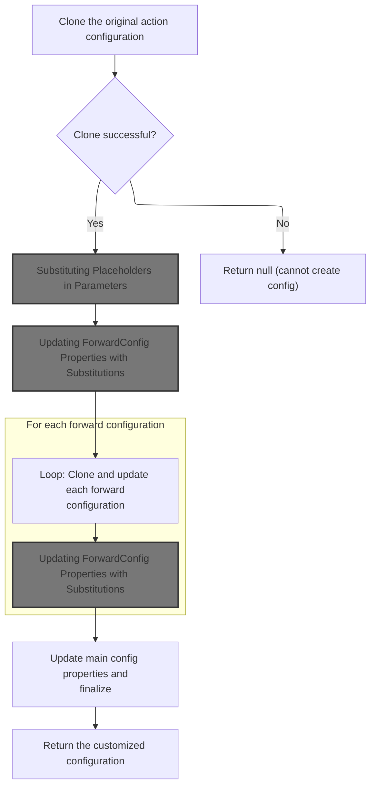
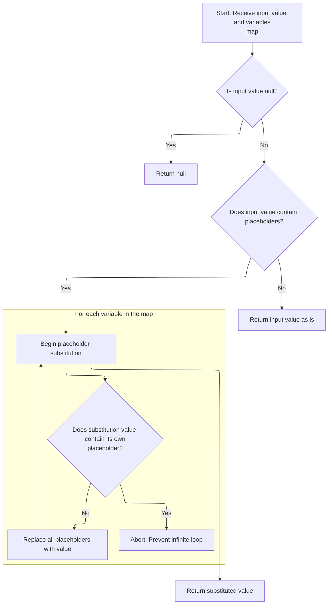
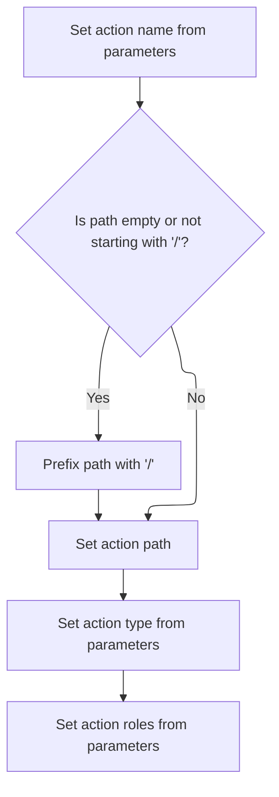
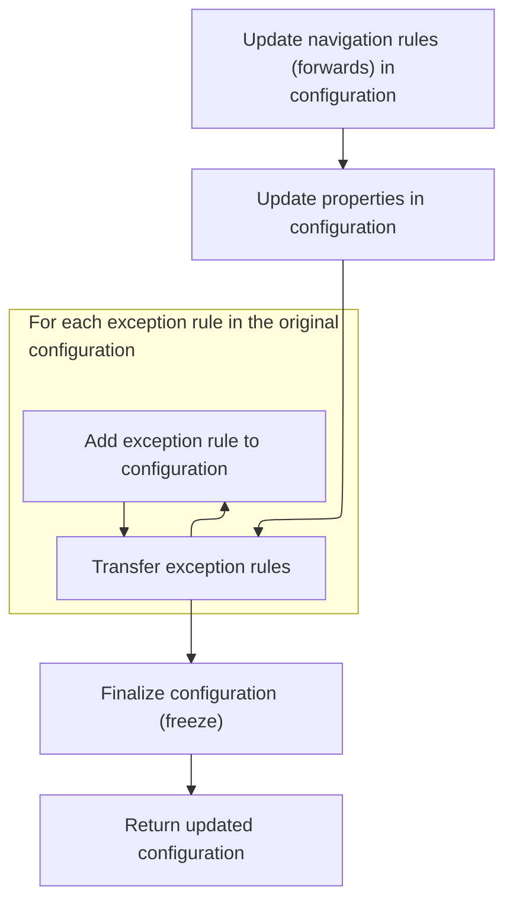

```mermaid
%%{init: {"flowchart": {"defaultRenderer": "elk"}} }%%
flowchart TD
  node1["Substitute variables into all main
config fields (parameter, attribute,
forward, include, input, catalog,
command, multipartClass, prefix, suffix)"]
  click node1 openCode "core/src/main/java/org/apache/struts/config/ActionConfigMatcher.java:179:188"
  subgraph loop1["For each forward in the configuration"]
    node2["Clone the forward"]
    click node2 openCode "core/src/main/java/org/apache/struts/config/ActionConfigMatcher.java:194:195"
    node2 --> node3{"Cloning successful?"}
    node3 -->|"Yes"| node4["Substitute variables into forward fields
(name, path, command, catalog, module)"]
    click node4 openCode "core/src/main/java/org/apache/struts/config/ActionConfigMatcher.java:201:206"
    node4 --> node5["Replace forward properties"]
    click node5 openCode "core/src/main/java/org/apache/struts/config/ActionConfigMatcher.java:208:209"
    node5 --> node2
    node3 -->|"No"| node6["Abort and return null"]
    click node6 openCode "core/src/main/java/org/apache/struts/config/ActionConfigMatcher.java:196:200"
  end
  node1 --> loop1
  loop1 --> node7["Return transformed config"]
  click node7 openCode "core/src/main/java/org/apache/struts/config/ActionConfigMatcher.java:179:209"
classDef HeadingStyle fill:#777777,stroke:#333,stroke-width:2px;

%% Swimm:
%% %%{init: {"flowchart": {"defaultRenderer": "elk"}} }%%
%% flowchart TD
%%   node1["Substitute variables into all main
%% config fields (parameter, attribute,
%% forward, include, input, catalog,
%% command, <SwmToken path="core/src/main/java/org/apache/struts/config/ActionConfig.java" pos="136:5:5" line-data="    protected String multipartClass = null;">`multipartClass`</SwmToken>, prefix, suffix)"]
%%   click node1 openCode "<SwmPath>[core/…/config/ActionConfigMatcher.java](core/src/main/java/org/apache/struts/config/ActionConfigMatcher.java)</SwmPath>:179:188"
%%   subgraph loop1["For each forward in the configuration"]
%%     node2["Clone the forward"]
%%     click node2 openCode "<SwmPath>[core/…/config/ActionConfigMatcher.java](core/src/main/java/org/apache/struts/config/ActionConfigMatcher.java)</SwmPath>:194:195"
%%     node2 --> node3{"Cloning successful?"}
%%     node3 -->|"Yes"| node4["Substitute variables into forward fields
%% (name, path, command, catalog, module)"]
%%     click node4 openCode "<SwmPath>[core/…/config/ActionConfigMatcher.java](core/src/main/java/org/apache/struts/config/ActionConfigMatcher.java)</SwmPath>:201:206"
%%     node4 --> node5["Replace forward properties"]
%%     click node5 openCode "<SwmPath>[core/…/config/ActionConfigMatcher.java](core/src/main/java/org/apache/struts/config/ActionConfigMatcher.java)</SwmPath>:208:209"
%%     node5 --> node2
%%     node3 -->|"No"| node6["Abort and return null"]
%%     click node6 openCode "<SwmPath>[core/…/config/ActionConfigMatcher.java](core/src/main/java/org/apache/struts/config/ActionConfigMatcher.java)</SwmPath>:196:200"
%%   end
%%   node1 --> loop1
%%   loop1 --> node7["Return transformed config"]
%%   click node7 openCode "<SwmPath>[core/…/config/ActionConfigMatcher.java](core/src/main/java/org/apache/struts/config/ActionConfigMatcher.java)</SwmPath>:179:209"
%% classDef HeadingStyle fill:#777777,stroke:#333,stroke-width:2px;
```

This document describes how a template action configuration is transformed into a customized configuration by applying variable substitutions. The process starts with cloning the original configuration and updating all relevant fields with the provided variables, resulting in a finalized configuration ready for use.

# Cloning and Preparing <SwmToken path="core/src/main/java/org/apache/struts/config/ActionConfigMatcher.java" pos="157:3:3" line-data="    protected ActionConfig convertActionConfig(String path, ActionConfig orig,">`ActionConfig`</SwmToken>



<SwmSnippet path="/core/src/main/java/org/apache/struts/config/ActionConfigMatcher.java" line="157">

---

In <SwmToken path="core/src/main/java/org/apache/struts/config/ActionConfigMatcher.java" pos="157:5:5" line-data="    protected ActionConfig convertActionConfig(String path, ActionConfig orig,">`convertActionConfig`</SwmToken>, we clone the original <SwmToken path="core/src/main/java/org/apache/struts/config/ActionConfigMatcher.java" pos="157:3:3" line-data="    protected ActionConfig convertActionConfig(String path, ActionConfig orig,">`ActionConfig`</SwmToken> to avoid mutating the input. Right after cloning, we start updating fields that might contain placeholders, starting with the name. That's why we call <SwmToken path="core/src/main/java/org/apache/struts/config/ActionConfigMatcher.java" pos="170:5:5" line-data="        config.setName(convertParam(orig.getName(), vars));">`convertParam`</SwmToken> next—to handle any variable substitutions in the name before setting it on the cloned config.

```java
    protected ActionConfig convertActionConfig(String path, ActionConfig orig,
        Map vars) {
        ActionConfig config = null;

        try {
            config = (ActionConfig) BeanUtils.cloneBean(orig);
        } catch (Exception ex) {
            log.warn("Unable to clone action config, recommend not using "
                + "wildcards", ex);

            return null;
        }

        config.setName(convertParam(orig.getName(), vars));
```

---

</SwmSnippet>

## Substituting Placeholders in Parameters



<SwmSnippet path="/core/src/main/java/org/apache/struts/config/ActionConfigMatcher.java" line="258">

---

In <SwmToken path="core/src/main/java/org/apache/struts/config/ActionConfigMatcher.java" pos="258:5:5" line-data="    protected String convertParam(String val, Map vars) {">`convertParam`</SwmToken>, we start by checking if the input string has placeholders and, if so, loop through each entry in vars. For each single-character key, we build a placeholder like "{x}" and prep for replacement. Next, we need to resolve what value to substitute, which is why we call into MessageComponent.getKey—this helps fetch the right value, possibly using JSF bindings.

```java
    protected String convertParam(String val, Map vars) {
        if (val == null) {
            return null;
        } else if (val.indexOf("{") == -1) {
            return val;
        }

        Map.Entry entry;
        StringBuffer key = new StringBuffer("{0}");
        StringBuffer ret = new StringBuffer(val);
        String keyStr;
        int x;

        for (Iterator i = vars.entrySet().iterator(); i.hasNext();) {
            entry = (Map.Entry) i.next();
            key.setCharAt(1, ((String) entry.getKey()).charAt(0));
```

---

</SwmSnippet>

<SwmSnippet path="/faces/src/main/java/org/apache/struts/faces/component/MessageComponent.java" line="164">

---

<SwmToken path="faces/src/main/java/org/apache/struts/faces/component/MessageComponent.java" pos="164:5:5" line-data="    public String getKey() {">`getKey`</SwmToken> checks for a JSF <SwmToken path="faces/src/main/java/org/apache/struts/faces/component/MessageComponent.java" pos="166:1:1" line-data="        ValueBinding vb = getValueBinding(&quot;key&quot;);">`ValueBinding`</SwmToken> on 'key' and returns its value if present, otherwise just returns the local 'key' variable. This lets the component support both static and dynamic key values, but always expects a String.

```java
    public String getKey() {

        ValueBinding vb = getValueBinding("key");
        if (vb != null) {
            return (String) vb.getValue(getFacesContext());
        } else {
            return key;
        }

    }
```

---

</SwmSnippet>

<SwmSnippet path="/core/src/main/java/org/apache/struts/config/ActionConfigMatcher.java" line="274">

---

Back in <SwmToken path="core/src/main/java/org/apache/struts/config/ActionConfigMatcher.java" pos="170:5:5" line-data="        config.setName(convertParam(orig.getName(), vars));">`convertParam`</SwmToken>, after getting the value (possibly from MessageComponent.getKey), we check for self-referencing placeholders to avoid infinite loops (<SwmToken path="core/src/main/java/org/apache/struts/config/ActionConfigMatcher.java" pos="276:3:5" line-data="            // STR-3169">`STR-3169`</SwmToken>), then replace all instances of the placeholder with the value in the string. This loop handles all substitutions safely.

```java
            keyStr = key.toString();
            
            // STR-3169
            // Prevent an infinite loop by retaining the placeholders
            // that contain itself in the substitution value
            if (((String) entry.getValue()).contains(keyStr)) {
        	throw new IllegalStateException();
            }
            
            // Replace all instances of the placeholder
            while ((x = ret.toString().indexOf(keyStr)) > -1) {
                ret.replace(x, x + 3, (String) entry.getValue());
            }
```

---

</SwmSnippet>

## Updating <SwmToken path="core/src/main/java/org/apache/struts/config/ActionConfigMatcher.java" pos="157:3:3" line-data="    protected ActionConfig convertActionConfig(String path, ActionConfig orig,">`ActionConfig`</SwmToken> Fields with Substitutions



<SwmSnippet path="/core/src/main/java/org/apache/struts/config/ActionConfigMatcher.java" line="170">

---

Back in <SwmToken path="core/src/main/java/org/apache/struts/config/ActionConfigMatcher.java" pos="157:5:5" line-data="    protected ActionConfig convertActionConfig(String path, ActionConfig orig,">`convertActionConfig`</SwmToken>, after substituting variables in the name, we set it on the config. Next, we need to ensure the path is normalized and set, so we call into <SwmToken path="core/src/main/java/org/apache/struts/config/ActionConfigMatcher.java" pos="157:3:3" line-data="    protected ActionConfig convertActionConfig(String path, ActionConfig orig,">`ActionConfig`</SwmToken> to update the path field.

```java
        config.setName(convertParam(orig.getName(), vars));

```

---

</SwmSnippet>

<SwmSnippet path="/core/src/main/java/org/apache/struts/config/ActionConfig.java" line="517">

---

<SwmToken path="core/src/main/java/org/apache/struts/config/ActionConfig.java" pos="517:5:5" line-data="    public void setName(String name) {">`setName`</SwmToken> sets the config's name, but only if the configuration isn't frozen (checked by the 'configured' flag). If it's frozen, it throws an exception to block changes.

```java
    public void setName(String name) {
        if (configured) {
            throw new IllegalStateException("Configuration is frozen");
        }

        this.name = name;
    }
```

---

</SwmSnippet>

<SwmSnippet path="/core/src/main/java/org/apache/struts/config/ActionConfigMatcher.java" line="172">

---

Back in <SwmToken path="core/src/main/java/org/apache/struts/config/ActionConfigMatcher.java" pos="157:5:5" line-data="    protected ActionConfig convertActionConfig(String path, ActionConfig orig,">`convertActionConfig`</SwmToken>, after setting the name, we check and normalize the path (prepend '/' if missing), then set it on the config. Next, we update the path field using <SwmToken path="core/src/main/java/org/apache/struts/config/ActionConfigMatcher.java" pos="157:3:3" line-data="    protected ActionConfig convertActionConfig(String path, ActionConfig orig,">`ActionConfig`</SwmToken> to keep the config consistent.

```java
        if ((path.length() == 0) || (path.charAt(0) != '/')) {
            path = "/" + path;
        }

        config.setPath(path);
```

---

</SwmSnippet>

<SwmSnippet path="/core/src/main/java/org/apache/struts/config/ActionConfig.java" line="565">

---

<SwmToken path="core/src/main/java/org/apache/struts/config/ActionConfig.java" pos="565:5:5" line-data="    public void setPath(String path) {">`setPath`</SwmToken> updates the config's path, but only if the configuration isn't frozen. If it is, it throws, so you can't change the path after freezing.

```java
    public void setPath(String path) {
        if (configured) {
            throw new IllegalStateException("Configuration is frozen");
        }

        this.path = path;
    }
```

---

</SwmSnippet>

<SwmSnippet path="/core/src/main/java/org/apache/struts/config/ActionConfigMatcher.java" line="177">

---

Back in <SwmToken path="core/src/main/java/org/apache/struts/config/ActionConfigMatcher.java" pos="157:5:5" line-data="    protected ActionConfig convertActionConfig(String path, ActionConfig orig,">`convertActionConfig`</SwmToken>, after setting the path, we move on to update the type field. We call <SwmToken path="core/src/main/java/org/apache/struts/config/ActionConfigMatcher.java" pos="177:5:5" line-data="        config.setType(convertParam(orig.getType(), vars));">`convertParam`</SwmToken> again to handle any variable substitutions in the type before setting it.

```java
        config.setType(convertParam(orig.getType(), vars));
```

---

</SwmSnippet>

<SwmSnippet path="/core/src/main/java/org/apache/struts/config/ActionConfigMatcher.java" line="177">

---

Back in <SwmToken path="core/src/main/java/org/apache/struts/config/ActionConfigMatcher.java" pos="157:5:5" line-data="    protected ActionConfig convertActionConfig(String path, ActionConfig orig,">`convertActionConfig`</SwmToken>, after substituting variables in the type, we set it on the config using <SwmToken path="core/src/main/java/org/apache/struts/config/ActionConfigMatcher.java" pos="157:3:3" line-data="    protected ActionConfig convertActionConfig(String path, ActionConfig orig,">`ActionConfig`</SwmToken>. This keeps the config fields in sync with the latest substitutions.

```java
        config.setType(convertParam(orig.getType(), vars));
```

---

</SwmSnippet>

<SwmSnippet path="/core/src/main/java/org/apache/struts/config/ActionConfig.java" line="788">

---

<SwmToken path="core/src/main/java/org/apache/struts/config/ActionConfig.java" pos="788:5:5" line-data="    public void setType(String type) {">`setType`</SwmToken> sets the config's type, but only if the configuration isn't frozen. If it's frozen, it throws, so you can't change the type after freezing.

```java
    public void setType(String type) {
        if (configured) {
            throw new IllegalStateException("Configuration is frozen");
        }

        this.type = type;
    }
```

---

</SwmSnippet>

<SwmSnippet path="/core/src/main/java/org/apache/struts/config/ActionConfigMatcher.java" line="178">

---

Back in <SwmToken path="core/src/main/java/org/apache/struts/config/ActionConfigMatcher.java" pos="157:5:5" line-data="    protected ActionConfig convertActionConfig(String path, ActionConfig orig,">`convertActionConfig`</SwmToken>, after setting the type, we need to update the roles field. We call <SwmToken path="core/src/main/java/org/apache/struts/config/ActionConfigMatcher.java" pos="178:5:5" line-data="        config.setRoles(convertParam(orig.getRoles(), vars));">`convertParam`</SwmToken> to handle any variable substitutions in the roles string before setting it.

```java
        config.setRoles(convertParam(orig.getRoles(), vars));
```

---

</SwmSnippet>

<SwmSnippet path="/core/src/main/java/org/apache/struts/config/ActionConfigMatcher.java" line="178">

---

Back in <SwmToken path="core/src/main/java/org/apache/struts/config/ActionConfigMatcher.java" pos="157:5:5" line-data="    protected ActionConfig convertActionConfig(String path, ActionConfig orig,">`convertActionConfig`</SwmToken>, after substituting variables in the roles string, we set it on the config using <SwmToken path="core/src/main/java/org/apache/struts/config/ActionConfigMatcher.java" pos="157:3:3" line-data="    protected ActionConfig convertActionConfig(String path, ActionConfig orig,">`ActionConfig`</SwmToken>. This step ensures the roles field is updated with the latest substitutions.

```java
        config.setRoles(convertParam(orig.getRoles(), vars));
```

---

</SwmSnippet>

## Parsing and Setting Roles

```mermaid
%%{init: {"flowchart": {"defaultRenderer": "elk"}} }%%
flowchart TD
    node1["Set roles for action"] --> node2{"Is configuration frozen?"}
    click node1 openCode "core/src/main/java/org/apache/struts/config/ActionConfig.java:597:598"
    click node2 openCode "core/src/main/java/org/apache/struts/config/ActionConfig.java:598:599"
    node2 -->|"Yes"| node3["Reject change (configuration is
frozen)"]
    click node3 openCode "core/src/main/java/org/apache/struts/config/ActionConfig.java:599:600"
    node2 -->|"No"| node4{"Is roles null?"}
    click node4 openCode "core/src/main/java/org/apache/struts/config/ActionConfig.java:604:605"
    node4 -->|"Yes"| node5["Clear roles list and return (roleNames
= empty)"]
    click node5 openCode "core/src/main/java/org/apache/struts/config/ActionConfig.java:605:607"
    node4 -->|"No"| node6["Prepare to split roles"]
    click node6 openCode "core/src/main/java/org/apache/struts/config/ActionConfig.java:610:611"
    node6 --> loop1
    subgraph loop1["For each comma in roles string"]
        loop1a{"Does roles contain a comma?"}
        click loop1a openCode "core/src/main/java/org/apache/struts/config/ActionConfig.java:613:616"
        loop1a -->|"Yes"| loop1b["Extract role before comma and add to
list"]
        click loop1b openCode "core/src/main/java/org/apache/struts/config/ActionConfig.java:619:620"
        loop1b --> loop1c["Remove extracted role from roles
string"]
        click loop1c openCode "core/src/main/java/org/apache/struts/config/ActionConfig.java:620:621"
        loop1c --> loop1a
        loop1a -->|"No"| loop1d{"Is remaining roles string non-empty?"}
        click loop1d openCode "core/src/main/java/org/apache/struts/config/ActionConfig.java:625:626"
        loop1d -->|"Yes"| loop1e["Add final role to list"]
        click loop1e openCode "core/src/main/java/org/apache/struts/config/ActionConfig.java:626:627"
        loop1d -->|"No"| loop1f["No more roles to add"]
        click loop1f openCode "core/src/main/java/org/apache/struts/config/ActionConfig.java:627:628"
    end
    loop1 --> node7["Update roleNames with all roles"]
    click node7 openCode "core/src/main/java/org/apache/struts/config/ActionConfig.java:629:630"

classDef HeadingStyle fill:#777777,stroke:#333,stroke-width:2px;

%% Swimm:
%% %%{init: {"flowchart": {"defaultRenderer": "elk"}} }%%
%% flowchart TD
%%     node1["Set roles for action"] --> node2{"Is configuration frozen?"}
%%     click node1 openCode "<SwmPath>[core/…/config/ActionConfig.java](core/src/main/java/org/apache/struts/config/ActionConfig.java)</SwmPath>:597:598"
%%     click node2 openCode "<SwmPath>[core/…/config/ActionConfig.java](core/src/main/java/org/apache/struts/config/ActionConfig.java)</SwmPath>:598:599"
%%     node2 -->|"Yes"| node3["Reject change (configuration is
%% frozen)"]
%%     click node3 openCode "<SwmPath>[core/…/config/ActionConfig.java](core/src/main/java/org/apache/struts/config/ActionConfig.java)</SwmPath>:599:600"
%%     node2 -->|"No"| node4{"Is roles null?"}
%%     click node4 openCode "<SwmPath>[core/…/config/ActionConfig.java](core/src/main/java/org/apache/struts/config/ActionConfig.java)</SwmPath>:604:605"
%%     node4 -->|"Yes"| node5["Clear roles list and return (<SwmToken path="core/src/main/java/org/apache/struts/config/ActionConfig.java" pos="605:1:1" line-data="            roleNames = new String[0];">`roleNames`</SwmToken>
%% = empty)"]
%%     click node5 openCode "<SwmPath>[core/…/config/ActionConfig.java](core/src/main/java/org/apache/struts/config/ActionConfig.java)</SwmPath>:605:607"
%%     node4 -->|"No"| node6["Prepare to split roles"]
%%     click node6 openCode "<SwmPath>[core/…/config/ActionConfig.java](core/src/main/java/org/apache/struts/config/ActionConfig.java)</SwmPath>:610:611"
%%     node6 --> loop1
%%     subgraph loop1["For each comma in roles string"]
%%         loop1a{"Does roles contain a comma?"}
%%         click loop1a openCode "<SwmPath>[core/…/config/ActionConfig.java](core/src/main/java/org/apache/struts/config/ActionConfig.java)</SwmPath>:613:616"
%%         loop1a -->|"Yes"| loop1b["Extract role before comma and add to
%% list"]
%%         click loop1b openCode "<SwmPath>[core/…/config/ActionConfig.java](core/src/main/java/org/apache/struts/config/ActionConfig.java)</SwmPath>:619:620"
%%         loop1b --> loop1c["Remove extracted role from roles
%% string"]
%%         click loop1c openCode "<SwmPath>[core/…/config/ActionConfig.java](core/src/main/java/org/apache/struts/config/ActionConfig.java)</SwmPath>:620:621"
%%         loop1c --> loop1a
%%         loop1a -->|"No"| loop1d{"Is remaining roles string non-empty?"}
%%         click loop1d openCode "<SwmPath>[core/…/config/ActionConfig.java](core/src/main/java/org/apache/struts/config/ActionConfig.java)</SwmPath>:625:626"
%%         loop1d -->|"Yes"| loop1e["Add final role to list"]
%%         click loop1e openCode "<SwmPath>[core/…/config/ActionConfig.java](core/src/main/java/org/apache/struts/config/ActionConfig.java)</SwmPath>:626:627"
%%         loop1d -->|"No"| loop1f["No more roles to add"]
%%         click loop1f openCode "<SwmPath>[core/…/config/ActionConfig.java](core/src/main/java/org/apache/struts/config/ActionConfig.java)</SwmPath>:627:628"
%%     end
%%     loop1 --> node7["Update <SwmToken path="core/src/main/java/org/apache/struts/config/ActionConfig.java" pos="605:1:1" line-data="            roleNames = new String[0];">`roleNames`</SwmToken> with all roles"]
%%     click node7 openCode "<SwmPath>[core/…/config/ActionConfig.java](core/src/main/java/org/apache/struts/config/ActionConfig.java)</SwmPath>:629:630"
%% 
%% classDef HeadingStyle fill:#777777,stroke:#333,stroke-width:2px;
```



<SwmSnippet path="/core/src/main/java/org/apache/struts/config/ActionConfig.java" line="597">

---

In <SwmToken path="core/src/main/java/org/apache/struts/config/ActionConfig.java" pos="597:5:5" line-data="    public void setRoles(String roles) {">`setRoles`</SwmToken>, we split the roles string by commas, trim each role, and build an array. If the config is frozen, it throws. The method expects a comma-separated list—if the format is off, parsing won't work right.

```java
    public void setRoles(String roles) {
        if (configured) {
            throw new IllegalStateException("Configuration is frozen");
        }

        this.roles = roles;

        if (roles == null) {
            roleNames = new String[0];

            return;
        }

        ArrayList list = new ArrayList();

        while (true) {
            int comma = roles.indexOf(',');

            if (comma < 0) {
                break;
            }

            list.add(roles.substring(0, comma).trim());
            roles = roles.substring(comma + 1);
        }
```

---

</SwmSnippet>

<SwmSnippet path="/core/src/main/java/org/apache/struts/config/ActionConfig.java" line="623">

---

After splitting and trimming, any remaining role is added to the list, then we convert the list to an array and assign it to <SwmToken path="core/src/main/java/org/apache/struts/config/ActionConfig.java" pos="629:1:1" line-data="        roleNames = (String[]) list.toArray(new String[list.size()]);">`roleNames`</SwmToken>. The roles string must be comma-separated for this to work.

```java
        roles = roles.trim();

        if (roles.length() > 0) {
            list.add(roles);
        }

        roleNames = (String[]) list.toArray(new String[list.size()]);
    }
```

---

</SwmSnippet>

## Setting Additional <SwmToken path="core/src/main/java/org/apache/struts/config/ActionConfigMatcher.java" pos="157:3:3" line-data="    protected ActionConfig convertActionConfig(String path, ActionConfig orig,">`ActionConfig`</SwmToken> Properties



<SwmSnippet path="/core/src/main/java/org/apache/struts/config/ActionConfigMatcher.java" line="179">

---

Back in <SwmToken path="core/src/main/java/org/apache/struts/config/ActionConfigMatcher.java" pos="157:5:5" line-data="    protected ActionConfig convertActionConfig(String path, ActionConfig orig,">`convertActionConfig`</SwmToken>, after setting roles, we move on to the parameter field. We call <SwmToken path="core/src/main/java/org/apache/struts/config/ActionConfigMatcher.java" pos="179:5:5" line-data="        config.setParameter(convertParam(orig.getParameter(), vars));">`convertParam`</SwmToken> to handle any variable substitutions before updating the config.

```java
        config.setParameter(convertParam(orig.getParameter(), vars));
```

---

</SwmSnippet>

<SwmSnippet path="/core/src/main/java/org/apache/struts/config/ActionConfigMatcher.java" line="179">

---

Back in <SwmToken path="core/src/main/java/org/apache/struts/config/ActionConfigMatcher.java" pos="157:5:5" line-data="    protected ActionConfig convertActionConfig(String path, ActionConfig orig,">`convertActionConfig`</SwmToken>, after substituting variables in the parameter, we set it on the config using <SwmToken path="core/src/main/java/org/apache/struts/config/ActionConfigMatcher.java" pos="157:3:3" line-data="    protected ActionConfig convertActionConfig(String path, ActionConfig orig,">`ActionConfig`</SwmToken>. This keeps the parameter field up to date.

```java
        config.setParameter(convertParam(orig.getParameter(), vars));
```

---

</SwmSnippet>

<SwmSnippet path="/core/src/main/java/org/apache/struts/config/ActionConfig.java" line="541">

---

<SwmToken path="core/src/main/java/org/apache/struts/config/ActionConfig.java" pos="541:5:5" line-data="    public void setParameter(String parameter) {">`setParameter`</SwmToken> sets the parameter field, but only if the config isn't frozen. If it's frozen, it throws, so you can't change the parameter after freezing.

```java
    public void setParameter(String parameter) {
        if (configured) {
            throw new IllegalStateException("Configuration is frozen");
        }

        this.parameter = parameter;
    }
```

---

</SwmSnippet>

<SwmSnippet path="/core/src/main/java/org/apache/struts/config/ActionConfigMatcher.java" line="180">

---

Back in <SwmToken path="core/src/main/java/org/apache/struts/config/ActionConfigMatcher.java" pos="157:5:5" line-data="    protected ActionConfig convertActionConfig(String path, ActionConfig orig,">`convertActionConfig`</SwmToken>, after setting the parameter, we move on to the attribute field. We call <SwmToken path="core/src/main/java/org/apache/struts/config/ActionConfigMatcher.java" pos="180:5:5" line-data="        config.setAttribute(convertParam(orig.getAttribute(), vars));">`convertParam`</SwmToken> to handle any variable substitutions before updating the config.

```java
        config.setAttribute(convertParam(orig.getAttribute(), vars));
```

---

</SwmSnippet>

<SwmSnippet path="/core/src/main/java/org/apache/struts/config/ActionConfigMatcher.java" line="180">

---

Back in <SwmToken path="core/src/main/java/org/apache/struts/config/ActionConfigMatcher.java" pos="157:5:5" line-data="    protected ActionConfig convertActionConfig(String path, ActionConfig orig,">`convertActionConfig`</SwmToken>, after substituting variables in the attribute, we set it on the config using <SwmToken path="core/src/main/java/org/apache/struts/config/ActionConfigMatcher.java" pos="157:3:3" line-data="    protected ActionConfig convertActionConfig(String path, ActionConfig orig,">`ActionConfig`</SwmToken>. This keeps the attribute field up to date.

```java
        config.setAttribute(convertParam(orig.getAttribute(), vars));
```

---

</SwmSnippet>

<SwmSnippet path="/core/src/main/java/org/apache/struts/config/ActionConfig.java" line="337">

---

<SwmToken path="core/src/main/java/org/apache/struts/config/ActionConfig.java" pos="337:5:5" line-data="    public void setAttribute(String attribute) {">`setAttribute`</SwmToken> sets the attribute field, but only if the config isn't frozen. If it's frozen, it throws, so you can't change the attribute after freezing.

```java
    public void setAttribute(String attribute) {
        if (configured) {
            throw new IllegalStateException("Configuration is frozen");
        }

        this.attribute = attribute;
    }
```

---

</SwmSnippet>

<SwmSnippet path="/core/src/main/java/org/apache/struts/config/ActionConfigMatcher.java" line="181">

---

Back in <SwmToken path="core/src/main/java/org/apache/struts/config/ActionConfigMatcher.java" pos="157:5:5" line-data="    protected ActionConfig convertActionConfig(String path, ActionConfig orig,">`convertActionConfig`</SwmToken>, after setting the attribute, we move on to the forward field. We call <SwmToken path="core/src/main/java/org/apache/struts/config/ActionConfigMatcher.java" pos="181:5:5" line-data="        config.setForward(convertParam(orig.getForward(), vars));">`convertParam`</SwmToken> to handle any variable substitutions before updating the config.

```java
        config.setForward(convertParam(orig.getForward(), vars));
```

---

</SwmSnippet>

<SwmSnippet path="/core/src/main/java/org/apache/struts/config/ActionConfigMatcher.java" line="181">

---

Back in <SwmToken path="core/src/main/java/org/apache/struts/config/ActionConfigMatcher.java" pos="157:5:5" line-data="    protected ActionConfig convertActionConfig(String path, ActionConfig orig,">`convertActionConfig`</SwmToken>, after substituting variables in the forward field, we set it on the config using <SwmToken path="core/src/main/java/org/apache/struts/config/ActionConfigMatcher.java" pos="157:3:3" line-data="    protected ActionConfig convertActionConfig(String path, ActionConfig orig,">`ActionConfig`</SwmToken>. This keeps the forward field up to date.

```java
        config.setForward(convertParam(orig.getForward(), vars));
```

---

</SwmSnippet>

<SwmSnippet path="/core/src/main/java/org/apache/struts/config/ActionConfig.java" line="419">

---

<SwmToken path="core/src/main/java/org/apache/struts/config/ActionConfig.java" pos="419:5:5" line-data="    public void setForward(String forward) {">`setForward`</SwmToken> sets the forward field, but only if the config isn't frozen. If it's frozen, it throws, so you can't change the forward after freezing.

```java
    public void setForward(String forward) {
        if (configured) {
            throw new IllegalStateException("Configuration is frozen");
        }

        this.forward = forward;
    }
```

---

</SwmSnippet>

<SwmSnippet path="/core/src/main/java/org/apache/struts/config/ActionConfigMatcher.java" line="182">

---

Back in <SwmToken path="core/src/main/java/org/apache/struts/config/ActionConfigMatcher.java" pos="157:5:5" line-data="    protected ActionConfig convertActionConfig(String path, ActionConfig orig,">`convertActionConfig`</SwmToken>, after setting the forward, we move on to the include field. We call <SwmToken path="core/src/main/java/org/apache/struts/config/ActionConfigMatcher.java" pos="182:5:5" line-data="        config.setInclude(convertParam(orig.getInclude(), vars));">`convertParam`</SwmToken> to handle any variable substitutions before updating the config.

```java
        config.setInclude(convertParam(orig.getInclude(), vars));
```

---

</SwmSnippet>

<SwmSnippet path="/core/src/main/java/org/apache/struts/config/ActionConfigMatcher.java" line="182">

---

Back in <SwmToken path="core/src/main/java/org/apache/struts/config/ActionConfigMatcher.java" pos="157:5:5" line-data="    protected ActionConfig convertActionConfig(String path, ActionConfig orig,">`convertActionConfig`</SwmToken>, after substituting variables in the include field, we set it on the config using <SwmToken path="core/src/main/java/org/apache/struts/config/ActionConfigMatcher.java" pos="157:3:3" line-data="    protected ActionConfig convertActionConfig(String path, ActionConfig orig,">`ActionConfig`</SwmToken>. This keeps the include field up to date.

```java
        config.setInclude(convertParam(orig.getInclude(), vars));
```

---

</SwmSnippet>

<SwmSnippet path="/core/src/main/java/org/apache/struts/config/ActionConfig.java" line="446">

---

<SwmToken path="core/src/main/java/org/apache/struts/config/ActionConfig.java" pos="446:5:5" line-data="    public void setInclude(String include) {">`setInclude`</SwmToken> sets the include field, but only if the config isn't frozen. If it's frozen, it throws, so you can't change the include after freezing.

```java
    public void setInclude(String include) {
        if (configured) {
            throw new IllegalStateException("Configuration is frozen");
        }

        this.include = include;
    }
```

---

</SwmSnippet>

<SwmSnippet path="/core/src/main/java/org/apache/struts/config/ActionConfigMatcher.java" line="183">

---

Back in <SwmToken path="core/src/main/java/org/apache/struts/config/ActionConfigMatcher.java" pos="157:5:5" line-data="    protected ActionConfig convertActionConfig(String path, ActionConfig orig,">`convertActionConfig`</SwmToken>, after setting the include, we move on to the input field. We call <SwmToken path="core/src/main/java/org/apache/struts/config/ActionConfigMatcher.java" pos="183:5:5" line-data="        config.setInput(convertParam(orig.getInput(), vars));">`convertParam`</SwmToken> to handle any variable substitutions before updating the config.

```java
        config.setInput(convertParam(orig.getInput(), vars));
```

---

</SwmSnippet>

<SwmSnippet path="/core/src/main/java/org/apache/struts/config/ActionConfigMatcher.java" line="183">

---

Back in <SwmToken path="core/src/main/java/org/apache/struts/config/ActionConfigMatcher.java" pos="157:5:5" line-data="    protected ActionConfig convertActionConfig(String path, ActionConfig orig,">`convertActionConfig`</SwmToken>, after substituting variables in the input field, we set it on the config using <SwmToken path="core/src/main/java/org/apache/struts/config/ActionConfigMatcher.java" pos="157:3:3" line-data="    protected ActionConfig convertActionConfig(String path, ActionConfig orig,">`ActionConfig`</SwmToken>. This keeps the input field up to date.

```java
        config.setInput(convertParam(orig.getInput(), vars));
```

---

</SwmSnippet>

<SwmSnippet path="/core/src/main/java/org/apache/struts/config/ActionConfig.java" line="473">

---

<SwmToken path="core/src/main/java/org/apache/struts/config/ActionConfig.java" pos="473:5:5" line-data="    public void setInput(String input) {">`setInput`</SwmToken> sets the input field, but only if the config isn't frozen. If it's frozen, it throws, so you can't change the input after freezing.

```java
    public void setInput(String input) {
        if (configured) {
            throw new IllegalStateException("Configuration is frozen");
        }

        this.input = input;
    }
```

---

</SwmSnippet>

<SwmSnippet path="/core/src/main/java/org/apache/struts/config/ActionConfigMatcher.java" line="184">

---

Back in <SwmToken path="core/src/main/java/org/apache/struts/config/ActionConfigMatcher.java" pos="157:5:5" line-data="    protected ActionConfig convertActionConfig(String path, ActionConfig orig,">`convertActionConfig`</SwmToken>, after setting the input, we move on to the catalog field. We call <SwmToken path="core/src/main/java/org/apache/struts/config/ActionConfigMatcher.java" pos="184:5:5" line-data="        config.setCatalog(convertParam(orig.getCatalog(), vars));">`convertParam`</SwmToken> to handle any variable substitutions before updating the config.

```java
        config.setCatalog(convertParam(orig.getCatalog(), vars));
```

---

</SwmSnippet>

<SwmSnippet path="/core/src/main/java/org/apache/struts/config/ActionConfigMatcher.java" line="184">

---

Back in <SwmToken path="core/src/main/java/org/apache/struts/config/ActionConfigMatcher.java" pos="157:5:5" line-data="    protected ActionConfig convertActionConfig(String path, ActionConfig orig,">`convertActionConfig`</SwmToken>, after substituting variables in the catalog field, we set it on the config using <SwmToken path="core/src/main/java/org/apache/struts/config/ActionConfigMatcher.java" pos="157:3:3" line-data="    protected ActionConfig convertActionConfig(String path, ActionConfig orig,">`ActionConfig`</SwmToken>. This keeps the catalog field up to date.

```java
        config.setCatalog(convertParam(orig.getCatalog(), vars));
```

---

</SwmSnippet>

<SwmSnippet path="/core/src/main/java/org/apache/struts/config/ActionConfig.java" line="882">

---

<SwmToken path="core/src/main/java/org/apache/struts/config/ActionConfig.java" pos="882:5:5" line-data="    public void setCatalog(String catalog) {">`setCatalog`</SwmToken> sets the catalog field, but only if the config isn't frozen. If it's frozen, it throws, so you can't change the catalog after freezing.

```java
    public void setCatalog(String catalog) {
        if (configured) {
            throw new IllegalStateException("Configuration is frozen");
        }

        this.catalog = catalog;
    }
```

---

</SwmSnippet>

<SwmSnippet path="/core/src/main/java/org/apache/struts/config/ActionConfigMatcher.java" line="185">

---

Back in <SwmToken path="core/src/main/java/org/apache/struts/config/ActionConfigMatcher.java" pos="157:5:5" line-data="    protected ActionConfig convertActionConfig(String path, ActionConfig orig,">`convertActionConfig`</SwmToken>, after setting the catalog, we move on to the command field. We call <SwmToken path="core/src/main/java/org/apache/struts/config/ActionConfigMatcher.java" pos="185:5:5" line-data="        config.setCommand(convertParam(orig.getCommand(), vars));">`convertParam`</SwmToken> to handle any variable substitutions before updating the config.

```java
        config.setCommand(convertParam(orig.getCommand(), vars));
```

---

</SwmSnippet>

<SwmSnippet path="/core/src/main/java/org/apache/struts/config/ActionConfigMatcher.java" line="185">

---

Back in <SwmToken path="core/src/main/java/org/apache/struts/config/ActionConfigMatcher.java" pos="157:5:5" line-data="    protected ActionConfig convertActionConfig(String path, ActionConfig orig,">`convertActionConfig`</SwmToken>, after substituting variables in the command field, we set it on the config using <SwmToken path="core/src/main/java/org/apache/struts/config/ActionConfigMatcher.java" pos="157:3:3" line-data="    protected ActionConfig convertActionConfig(String path, ActionConfig orig,">`ActionConfig`</SwmToken>. This keeps the command field up to date.

```java
        config.setCommand(convertParam(orig.getCommand(), vars));
```

---

</SwmSnippet>

<SwmSnippet path="/core/src/main/java/org/apache/struts/config/ActionConfig.java" line="864">

---

<SwmToken path="core/src/main/java/org/apache/struts/config/ActionConfig.java" pos="864:5:5" line-data="    public void setCommand(String command) {">`setCommand`</SwmToken> enforces immutability by throwing if you try to set the command after the config is frozen. If not frozen, it just sets the value.

```java
    public void setCommand(String command) {
        if (configured) {
            throw new IllegalStateException("Configuration is frozen");
        }

        this.command = command;
    }
```

---

</SwmSnippet>

<SwmSnippet path="/core/src/main/java/org/apache/struts/config/ActionConfigMatcher.java" line="186">

---

Back in ActionConfigMatcher.convertActionConfig, after setting command, we call <SwmToken path="core/src/main/java/org/apache/struts/config/ActionConfigMatcher.java" pos="186:5:5" line-data="        config.setMultipartClass(convertParam(orig.getMultipartClass(), vars));">`convertParam`</SwmToken> for <SwmToken path="core/src/main/java/org/apache/struts/config/ActionConfig.java" pos="136:5:5" line-data="    protected String multipartClass = null;">`multipartClass`</SwmToken> and prefix to handle any variable substitutions before updating those fields.

```java
        config.setMultipartClass(convertParam(orig.getMultipartClass(), vars));
        config.setPrefix(convertParam(orig.getPrefix(), vars));
```

---

</SwmSnippet>

<SwmSnippet path="/core/src/main/java/org/apache/struts/config/ActionConfigMatcher.java" line="187">

---

Back in ActionConfigMatcher.convertActionConfig, after converting the prefix, we set it on the config to keep everything in sync with the latest substitutions.

```java
        config.setPrefix(convertParam(orig.getPrefix(), vars));
```

---

</SwmSnippet>

<SwmSnippet path="/core/src/main/java/org/apache/struts/config/ActionConfig.java" line="585">

---

<SwmToken path="core/src/main/java/org/apache/struts/config/ActionConfig.java" pos="585:5:5" line-data="    public void setPrefix(String prefix) {">`setPrefix`</SwmToken> checks if the config is frozen before updating the prefix. If it's frozen, it throws; otherwise, it sets the value.

```java
    public void setPrefix(String prefix) {
        if (configured) {
            throw new IllegalStateException("Configuration is frozen");
        }

        this.prefix = prefix;
    }
```

---

</SwmSnippet>

<SwmSnippet path="/core/src/main/java/org/apache/struts/config/ActionConfigMatcher.java" line="188">

---

Back in ActionConfigMatcher.convertActionConfig, after setting the prefix, we call <SwmToken path="core/src/main/java/org/apache/struts/config/ActionConfigMatcher.java" pos="188:5:5" line-data="        config.setSuffix(convertParam(orig.getSuffix(), vars));">`convertParam`</SwmToken> for the suffix to handle any variable substitutions before updating that field.

```java
        config.setSuffix(convertParam(orig.getSuffix(), vars));
```

---

</SwmSnippet>

<SwmSnippet path="/core/src/main/java/org/apache/struts/config/ActionConfigMatcher.java" line="188">

---

Back in ActionConfigMatcher.convertActionConfig, after converting the suffix, we set it on the config to keep the field up to date.

```java
        config.setSuffix(convertParam(orig.getSuffix(), vars));

```

---

</SwmSnippet>

<SwmSnippet path="/core/src/main/java/org/apache/struts/config/ActionConfig.java" line="776">

---

<SwmToken path="core/src/main/java/org/apache/struts/config/ActionConfig.java" pos="776:5:5" line-data="    public void setSuffix(String suffix) {">`setSuffix`</SwmToken> throws if the config is frozen, otherwise it just sets the suffix value.

```java
    public void setSuffix(String suffix) {
        if (configured) {
            throw new IllegalStateException("Configuration is frozen");
        }

        this.suffix = suffix;
    }
```

---

</SwmSnippet>

<SwmSnippet path="/core/src/main/java/org/apache/struts/config/ActionConfigMatcher.java" line="190">

---

Back in ActionConfigMatcher.convertActionConfig, after setting the suffix, we loop through ForwardConfigs and start cloning and updating their fields, calling <SwmToken path="core/src/main/java/org/apache/struts/config/ActionConfigMatcher.java" pos="202:5:5" line-data="            cfg.setPath(convertParam(fConfigs[x].getPath(), vars));">`convertParam`</SwmToken> for each field that might have placeholders.

```java
        ForwardConfig[] fConfigs = orig.findForwardConfigs();
        ForwardConfig cfg;

        for (int x = 0; x < fConfigs.length; x++) {
            try {
                cfg = (ActionForward) BeanUtils.cloneBean(fConfigs[x]);
            } catch (Exception ex) {
                log.warn("Unable to clone action config, recommend not using "
                        + "wildcards", ex);
                return null;
            }
            cfg.setName(fConfigs[x].getName());
            cfg.setPath(convertParam(fConfigs[x].getPath(), vars));
```

---

</SwmSnippet>

<SwmSnippet path="/core/src/main/java/org/apache/struts/config/ActionConfigMatcher.java" line="202">

---

Back in ActionConfigMatcher.convertActionConfig, after converting the path for the <SwmToken path="core/src/main/java/org/apache/struts/config/ActionConfigMatcher.java" pos="190:1:1" line-data="        ForwardConfig[] fConfigs = orig.findForwardConfigs();">`ForwardConfig`</SwmToken>, we set it to make sure the config uses the resolved value.

```java
            cfg.setPath(convertParam(fConfigs[x].getPath(), vars));
```

---

</SwmSnippet>

<SwmSnippet path="/core/src/main/java/org/apache/struts/config/ExceptionConfig.java" line="141">

---

<SwmToken path="core/src/main/java/org/apache/struts/config/ExceptionConfig.java" pos="141:5:5" line-data="    public void setPath(String path) {">`setPath`</SwmToken> in <SwmToken path="core/src/main/java/org/apache/struts/config/ActionConfigMatcher.java" pos="217:1:1" line-data="        ExceptionConfig[] exConfigs = orig.findExceptionConfigs();">`ExceptionConfig`</SwmToken> throws if the config is frozen, otherwise it sets the path value.

```java
    public void setPath(String path) {
        if (configured) {
            throw new IllegalStateException("Configuration is frozen");
        }

        this.path = path;
    }
```

---

</SwmSnippet>

<SwmSnippet path="/core/src/main/java/org/apache/struts/config/ActionConfigMatcher.java" line="203">

---

Back in ActionConfigMatcher.convertActionConfig, after setting the path, we set the redirect flag on the <SwmToken path="core/src/main/java/org/apache/struts/config/ActionConfigMatcher.java" pos="190:1:1" line-data="        ForwardConfig[] fConfigs = orig.findForwardConfigs();">`ForwardConfig`</SwmToken> to control navigation behavior.

```java
            cfg.setRedirect(fConfigs[x].getRedirect());
```

---

</SwmSnippet>

<SwmSnippet path="/core/src/main/java/org/apache/struts/config/ForwardConfig.java" line="222">

---

<SwmToken path="core/src/main/java/org/apache/struts/config/ForwardConfig.java" pos="222:5:5" line-data="    public void setRedirect(boolean redirect) {">`setRedirect`</SwmToken> in <SwmToken path="core/src/main/java/org/apache/struts/config/ActionConfigMatcher.java" pos="190:1:1" line-data="        ForwardConfig[] fConfigs = orig.findForwardConfigs();">`ForwardConfig`</SwmToken> throws if the config is frozen, otherwise it sets the redirect flag.

```java
    public void setRedirect(boolean redirect) {
        if (configured) {
            throw new IllegalStateException("Configuration is frozen");
        }

        this.redirect = redirect;
    }
```

---

</SwmSnippet>

<SwmSnippet path="/core/src/main/java/org/apache/struts/config/ActionConfigMatcher.java" line="204">

---

Back in ActionConfigMatcher.convertActionConfig, after setting redirect, we call <SwmToken path="core/src/main/java/org/apache/struts/config/ActionConfigMatcher.java" pos="204:5:5" line-data="            cfg.setCommand(convertParam(fConfigs[x].getCommand(), vars));">`convertParam`</SwmToken> for the command field to handle any variable substitutions before updating it.

```java
            cfg.setCommand(convertParam(fConfigs[x].getCommand(), vars));
```

---

</SwmSnippet>

<SwmSnippet path="/core/src/main/java/org/apache/struts/config/ActionConfigMatcher.java" line="204">

---

Back in ActionConfigMatcher.convertActionConfig, after converting the command, we set it on the <SwmToken path="core/src/main/java/org/apache/struts/config/ActionConfigMatcher.java" pos="190:1:1" line-data="        ForwardConfig[] fConfigs = orig.findForwardConfigs();">`ForwardConfig`</SwmToken> to keep the field up to date.

```java
            cfg.setCommand(convertParam(fConfigs[x].getCommand(), vars));
```

---

</SwmSnippet>

<SwmSnippet path="/core/src/main/java/org/apache/struts/config/ActionConfigMatcher.java" line="205">

---

Back in ActionConfigMatcher.convertActionConfig, after setting command, we call <SwmToken path="core/src/main/java/org/apache/struts/config/ActionConfigMatcher.java" pos="205:5:5" line-data="            cfg.setCatalog(convertParam(fConfigs[x].getCatalog(), vars));">`convertParam`</SwmToken> for the catalog field to handle any variable substitutions before updating it.

```java
            cfg.setCatalog(convertParam(fConfigs[x].getCatalog(), vars));
```

---

</SwmSnippet>

<SwmSnippet path="/core/src/main/java/org/apache/struts/config/ActionConfigMatcher.java" line="205">

---

Back in ActionConfigMatcher.convertActionConfig, after converting the catalog, we set it on the <SwmToken path="core/src/main/java/org/apache/struts/config/ActionConfigMatcher.java" pos="190:1:1" line-data="        ForwardConfig[] fConfigs = orig.findForwardConfigs();">`ForwardConfig`</SwmToken> to keep the field up to date.

```java
            cfg.setCatalog(convertParam(fConfigs[x].getCatalog(), vars));
```

---

</SwmSnippet>

<SwmSnippet path="/core/src/main/java/org/apache/struts/config/ActionConfigMatcher.java" line="206">

---

Back in ActionConfigMatcher.convertActionConfig, after setting catalog, we call <SwmToken path="core/src/main/java/org/apache/struts/config/ActionConfigMatcher.java" pos="206:5:5" line-data="            cfg.setModule(convertParam(fConfigs[x].getModule(), vars));">`convertParam`</SwmToken> for the module field to handle any variable substitutions before updating it.

```java
            cfg.setModule(convertParam(fConfigs[x].getModule(), vars));
```

---

</SwmSnippet>

<SwmSnippet path="/core/src/main/java/org/apache/struts/config/ActionConfigMatcher.java" line="206">

---

Back in ActionConfigMatcher.convertActionConfig, after converting the module, we set it on the <SwmToken path="core/src/main/java/org/apache/struts/config/ActionConfigMatcher.java" pos="190:1:1" line-data="        ForwardConfig[] fConfigs = orig.findForwardConfigs();">`ForwardConfig`</SwmToken> to keep the field up to date.

```java
            cfg.setModule(convertParam(fConfigs[x].getModule(), vars));

```

---

</SwmSnippet>

<SwmSnippet path="/core/src/main/java/org/apache/struts/config/ForwardConfig.java" line="210">

---

<SwmToken path="core/src/main/java/org/apache/struts/config/ForwardConfig.java" pos="210:5:5" line-data="    public void setModule(String module) {">`setModule`</SwmToken> in <SwmToken path="core/src/main/java/org/apache/struts/config/ActionConfigMatcher.java" pos="190:1:1" line-data="        ForwardConfig[] fConfigs = orig.findForwardConfigs();">`ForwardConfig`</SwmToken> throws if the config is frozen, otherwise it sets the module value.

```java
    public void setModule(String module) {
        if (configured) {
            throw new IllegalStateException("Configuration is frozen");
        }

        this.module = module;
    }
```

---

</SwmSnippet>

<SwmSnippet path="/core/src/main/java/org/apache/struts/config/ActionConfigMatcher.java" line="208">

---

Back in ActionConfigMatcher.convertActionConfig, after setting all <SwmToken path="core/src/main/java/org/apache/struts/config/ActionConfigMatcher.java" pos="190:1:1" line-data="        ForwardConfig[] fConfigs = orig.findForwardConfigs();">`ForwardConfig`</SwmToken> fields, we call <SwmToken path="core/src/main/java/org/apache/struts/config/ActionConfigMatcher.java" pos="208:1:1" line-data="            replaceProperties(fConfigs[x].getProperties(), cfg.getProperties(),">`replaceProperties`</SwmToken> to update any extra properties that might have placeholders.

```java
            replaceProperties(fConfigs[x].getProperties(), cfg.getProperties(),
                vars);

```

---

</SwmSnippet>

## Updating <SwmToken path="core/src/main/java/org/apache/struts/config/ActionConfigMatcher.java" pos="190:1:1" line-data="        ForwardConfig[] fConfigs = orig.findForwardConfigs();">`ForwardConfig`</SwmToken> Properties with Substitutions

<SwmSnippet path="/core/src/main/java/org/apache/struts/config/ActionConfigMatcher.java" line="238">

---

In <SwmToken path="core/src/main/java/org/apache/struts/config/ActionConfigMatcher.java" pos="238:5:5" line-data="    protected void replaceProperties(Properties orig, Properties props, Map vars) {">`replaceProperties`</SwmToken>, we loop through each property entry to handle substitutions. We need to call into <SwmToken path="faces/src/main/java/org/apache/struts/faces/component/MessageComponent.java" pos="35:4:4" line-data="public class MessageComponent extends UIOutput {">`MessageComponent`</SwmToken> next in case any property value uses JSF bindings or dynamic keys.

```java
    protected void replaceProperties(Properties orig, Properties props, Map vars) {
        Map.Entry entry = null;

        for (Iterator i = orig.entrySet().iterator(); i.hasNext();) {
            entry = (Map.Entry) i.next();
            props.setProperty((String) entry.getKey(),
```

---

</SwmSnippet>

<SwmSnippet path="/core/src/main/java/org/apache/struts/config/ActionConfigMatcher.java" line="243">

---

Back in ActionConfigMatcher.replaceProperties, after getting the property key, we call <SwmToken path="core/src/main/java/org/apache/struts/config/ActionConfigMatcher.java" pos="244:1:1" line-data="                convertParam((String) entry.getValue(), vars));">`convertParam`</SwmToken> on the value to resolve any placeholders before setting it.

```java
            props.setProperty((String) entry.getKey(),
                convertParam((String) entry.getValue(), vars));
```

---

</SwmSnippet>

<SwmSnippet path="/core/src/main/java/org/apache/struts/config/ActionConfigMatcher.java" line="243">

---

Back in ActionConfigMatcher.replaceProperties, after updating all properties, we're done with the loop and ready to move on to the next step.

```java
            props.setProperty((String) entry.getKey(),
                convertParam((String) entry.getValue(), vars));
        }
    }
```

---

</SwmSnippet>

## Finalizing <SwmToken path="core/src/main/java/org/apache/struts/config/ActionConfigMatcher.java" pos="190:1:1" line-data="        ForwardConfig[] fConfigs = orig.findForwardConfigs();">`ForwardConfig`</SwmToken> Updates



<SwmSnippet path="/core/src/main/java/org/apache/struts/config/ActionConfigMatcher.java" line="211">

---

Back in ActionConfigMatcher.convertActionConfig, after replacing properties, we remove the original <SwmToken path="core/src/main/java/org/apache/struts/config/ActionConfigMatcher.java" pos="190:1:1" line-data="        ForwardConfig[] fConfigs = orig.findForwardConfigs();">`ForwardConfig`</SwmToken> to make room for the updated one.

```java
            config.removeForwardConfig(fConfigs[x]);
```

---

</SwmSnippet>

<SwmSnippet path="/core/src/main/java/org/apache/struts/config/ActionConfig.java" line="1355">

---

<SwmToken path="core/src/main/java/org/apache/struts/config/ActionConfig.java" pos="1355:5:5" line-data="    public void removeForwardConfig(ForwardConfig config) {">`removeForwardConfig`</SwmToken> throws if the config is frozen, otherwise it removes the <SwmToken path="core/src/main/java/org/apache/struts/config/ActionConfig.java" pos="1355:7:7" line-data="    public void removeForwardConfig(ForwardConfig config) {">`ForwardConfig`</SwmToken> from the map by its name.

```java
    public void removeForwardConfig(ForwardConfig config) {
        if (configured) {
            throw new IllegalStateException("Configuration is frozen");
        }

        forwards.remove(config.getName());
    }
```

---

</SwmSnippet>

<SwmSnippet path="/core/src/main/java/org/apache/struts/config/ActionConfigMatcher.java" line="212">

---

Back in ActionConfigMatcher.convertActionConfig, after removing the old <SwmToken path="core/src/main/java/org/apache/struts/config/ActionConfigMatcher.java" pos="190:1:1" line-data="        ForwardConfig[] fConfigs = orig.findForwardConfigs();">`ForwardConfig`</SwmToken>, we add the updated one to the config.

```java
            config.addForwardConfig(cfg);
        }

```

---

</SwmSnippet>

<SwmSnippet path="/core/src/main/java/org/apache/struts/config/ActionConfig.java" line="1059">

---

<SwmToken path="core/src/main/java/org/apache/struts/config/ActionConfig.java" pos="1059:5:5" line-data="    public void addForwardConfig(ForwardConfig config) {">`addForwardConfig`</SwmToken> throws if the config is frozen, otherwise it adds the <SwmToken path="core/src/main/java/org/apache/struts/config/ActionConfig.java" pos="1059:7:7" line-data="    public void addForwardConfig(ForwardConfig config) {">`ForwardConfig`</SwmToken> to the map by its name.

```java
    public void addForwardConfig(ForwardConfig config) {
        if (configured) {
            throw new IllegalStateException("Configuration is frozen");
        }

        forwards.put(config.getName(), config);
    }
```

---

</SwmSnippet>

<SwmSnippet path="/core/src/main/java/org/apache/struts/config/ActionConfigMatcher.java" line="215">

---

Back in ActionConfigMatcher.convertActionConfig, after updating ForwardConfigs, we call <SwmToken path="core/src/main/java/org/apache/struts/config/ActionConfigMatcher.java" pos="215:1:1" line-data="        replaceProperties(orig.getProperties(), config.getProperties(), vars);">`replaceProperties`</SwmToken> to update any properties on the <SwmToken path="core/src/main/java/org/apache/struts/config/ActionConfigMatcher.java" pos="157:3:3" line-data="    protected ActionConfig convertActionConfig(String path, ActionConfig orig,">`ActionConfig`</SwmToken> itself that might have placeholders.

```java
        replaceProperties(orig.getProperties(), config.getProperties(), vars);

```

---

</SwmSnippet>

<SwmSnippet path="/core/src/main/java/org/apache/struts/config/ActionConfigMatcher.java" line="217">

---

Back in ActionConfigMatcher.convertActionConfig, after replacing properties, we add all ExceptionConfigs from the original to the updated config.

```java
        ExceptionConfig[] exConfigs = orig.findExceptionConfigs();

        for (int x = 0; x < exConfigs.length; x++) {
            config.addExceptionConfig(exConfigs[x]);
        }
```

---

</SwmSnippet>

<SwmSnippet path="/core/src/main/java/org/apache/struts/config/ActionConfigMatcher.java" line="223">

---

ActionConfigMatcher.convertActionConfig returns the fully updated and frozen config, ready for use without further changes.

```java
        config.freeze();

        return config;
    }
```

---

</SwmSnippet>

&nbsp;

*This is an auto-generated document by Swimm 🌊 and has not yet been verified by a human*

<SwmMeta version="3.0.0" repo-id="Z2l0aHViJTNBJTNBc3RydXRzMSUzQSUzQVN3aW1tLURlbW8=" repo-name="struts1"><sup>Powered by [Swimm](https://app.swimm.io/)</sup></SwmMeta>
